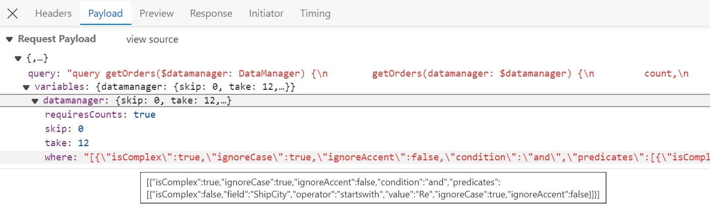
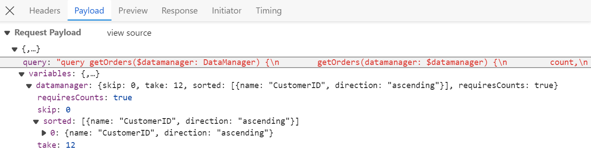
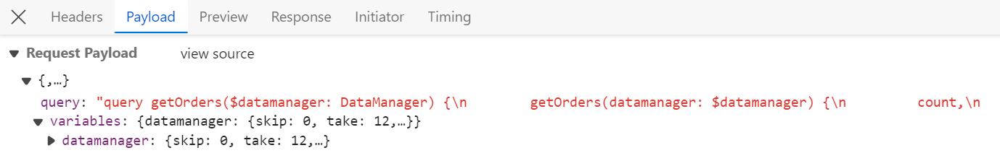
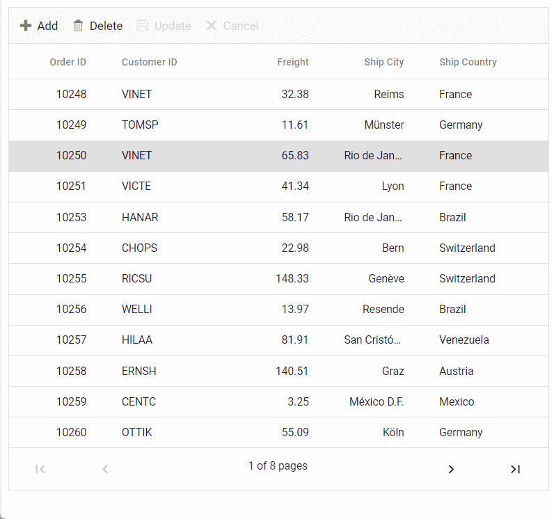

# Connecting GraphQL Service with ##Platform_Name## Grid Control

GraphQL is a powerful query language for APIs, designed to provide a more efficient alternative to traditional REST APIs. It allows you to precisely fetch the data you need, reducing over-fetching and under-fetching of data. GraphQL provides a flexible and expressive syntax for querying, enabling clients to request only the specific data they require.

Syncfusion's Grid control seamlessly integrates with GraphQL servers using the [GraphQLAdaptor](../../data/adaptors#graphql-adaptor) in the [DataManager](../../data/getting-started). This specialized adaptor simplifies the interaction between the Syncfusion Grid and GraphQL servers, allowing efficient data retrieval with support for various operations like CRUD (Create, Read, Update, Delete), paging, sorting, and filtering.

This section describes a step-by-step process for retrieving data from GraphQL service using `GraphQLAdaptor`, then binding it to the Grid control to facilitate data and CRUD operations.

## Configure GraphQL Server

To configure a GraphQL server with Syncfusion Grid, you need to follow the below steps:

**Step 1: Create Service for GraphQL**

* Create a new folder named **GraphQLServer** specifically for your GraphQL server.

* Install the [graph pack](https://www.npmjs.com/package/graphpack) npm package. Open your terminal and navigate to the server folder, then run:

  ```bash
  npm i graphpack
  ```
* To utilize Syncfusion's **ej2-data** package, you need to include it as a dependency in your project's **package.json** file. Here's how you can mention it in the configuration:
  
  ```json
  {
    "name": "graphql-server",
    "version": "1.0.0",
    "description": "",
    "scripts": {
      "dev": "graphpack --port 4205",
      "build": "graphpack build"
    },
    "devDependencies": {
      "graphpack": "^1.0.9"
    },
    "dependencies": {
      "@syncfusion/ej2-data": "24.1.41"
    }
  }
  ```

* Create a database file (src/db.js) to store your data.

  ```js
  export let OrderData = [
  {
      OrderID: 10248, CustomerID: 'VINET', EmployeeID: 5, OrderDate: new Date("07 12 1996 02:00:23"),
      ShipName: 'Vins et alcools Chevalier', ShipCity: 'Reims', ShipAddress: '59 rue de l Abbaye',
      ShipRegion: 'CJ', ShipPostalCode: '51100', ShipCountry: 'France', Freight: 32.38, Verified: !0
  },
  {
      OrderID: 10249, CustomerID: 'TOMSP', EmployeeID: 6, OrderDate: new Date("07 12 1996 00:03:23"),
      ShipName: 'Toms Spezialitäten', ShipCity: 'Münster', ShipAddress: 'Luisenstr. 48',
      ShipRegion: 'CJ', ShipPostalCode: '44087', ShipCountry: 'Germany', Freight: 11.61, Verified: !1
  },
  {
      OrderID: 10250, CustomerID: 'HANAR', EmployeeID: 4, OrderDate: new Date("07 12 1996 00:00:23"),
      ShipName: 'Hanari Carnes', ShipCity: 'Rio de Janeiro', ShipAddress: 'Rua do Paço, 67',
      ShipRegion: 'RJ', ShipPostalCode: '05454-876', ShipCountry: 'Brazil', Freight: 65.83,Verified: !0
  },
    ....
  ];
  ```
Ensure that the GraphQL server is properly configured and dependencies are installed to proceed with the next steps.

**Step 2: Schema Definition for GraphQL Server**

In the context of GraphQL, a schema defines the structure of the data that clients can query from the server. It serves as a contract between the client and the server, outlining the types of data available, the operations that can be performed, and how the data is related.

When integrating GraphQL with the Syncfusion Grid, defining a schema involves specifying the types of data the Grid expects to receive from the GraphQL server, along with any additional parameters for operations like sorting, filtering, and paging.

Here's how you can define a schema for the Syncfusion Grid:

* **Define Types:** Create types representing the structure of data retrieved from GraphQL queries. Since the `GraphQLAdaptor` in Syncfusion extends from `UrlAdaptor`, it expects a JSON response with specific properties:
   *  **result**: An array containing the data entities.
   *  **count**: The total number of records.
   *  **aggregates**: Contains total aggregate data(optional).

  For example, if your Grid displays orders, you might define types for ReturnType and Order:

  ```
  type ReturnType {
    result: [Order]
    count: Int
    aggregates: String # Total records aggregates
  }

  type Order {
    OrderID: Int!
    CustomerID: String
    EmployeeID: Int
    Freight: Int
    ShipCity: String
    ShipCountry: String
  }
  ```

* **Define Queries:** Define queries that can be made to retrieve data from the server. In the case of a Grid, you may define a query to fetch orders, accepting parameters such as `DataManager` for advanced data operations. To utilize `Datamanager`, you need to install packages from `@syncfusion/ej2-data`

  ```
  type Query {
    getOrders(datamanager: DataManager): ReturnType
  }
  ```

* **Define DataManager Input:** Define input types for `DataManager`, specifying parameters for sorting, filtering, paging, aggregates, etc., to be used in queries. The query parameters will be send in a string format which contains the below details.

  | Parameters       | Description                                                                     |
  | ---------------- | ------------------------------------------------------------------------------- |
  | `requiresCounts` | If it is **true** then the total count of records will be included in response. |
  | `skip`           | Holds the number of records to skip.                                            |
  | `take`           | Holds the number of records to take.                                            |
  | `sorted`         | Contains details about current sorted column and its direction.                 |
  | `where`          | Contains details about current filter column name and its constraints.          |
  | `group`          | Contains details about current grouped column names.                            |
  | `search`         | Contains details about current search data.                                     |
  | `aggregates`     | Contains details about aggregate data.                                          |

  ```
  input DataManager {
    skip: Int
    take: Int
    sorted: [Sort]
    group: [String]
    table: String
    select: [String]
    where: String
    search: String
    requiresCounts: Boolean
    aggregates: [Aggregate]
    params: String
  }
  ```

Create a schema file (e.g., src/schema.graphql) in your GraphQL server project and write the schema definition there.

```
#Grid Sort direction

input Sort {
    name: String
    direction: String
} 

#Grid aggregates type

input Aggregate {
    field: String! 
    type: String!
}

# Represents parameters for querying data, including sorting, filtering, etc.
input DataManager {
  skip: Int
  take: Int
  sorted: [Sort]
  group: [String]
  table: String
  select: [String]
  where: String
  search: String
  requiresCounts: Boolean
  aggregates: [Aggregate]
  params: String
}

# Represents an order type
type Order {
  OrderID: Int!
  CustomerID: String
  EmployeeID: Int
  Freight: Int
  ShipCity: String
  ShipCountry: String
}

# Represents the result of a query, including the data and count
type ReturnType {
  result: [Order]
  count: Int
  aggregates: String
}

# Represents a query to fetch orders with specified data manager parameters
type Query {
  getOrders(datamanager: DataManager): ReturnType 
}

```

**Step 3: Implement Resolvers**

To handle GraphQL queries and fetch data from your database, you need to create resolver functions. These resolver functions will be responsible for processing GraphQL queries and returning the appropriate data. In order to return data based on the grid expected result and count, utilize `DataUtil` from `@syncfusion/ej2-data` package.

Create a resolver file(**src/resolvers.js**) and implement the following code.

```javascript

import { OrderData } from "./db";
import { DataUtil } from "@syncfusion/ej2-data";

const resolvers = {
  Query: {
    getOrders: (parent, { datamanager }, context, info) => {
      var ret = DataUtil.processData(datamanager, OrderData);
      return ret;
    }
  }
};

export default resolvers;
```

**Step 4: Run GraphQL Server**

Install required packages and start the GraphQL server by running the following commands in your terminal:

```bash
npm install
npm run dev
```
The server will be hosted at **http://localhost:xxxx/**. (where xxxx represents the port number).

## Connecting grid to an GraphQL service



To integrate GraphQL with the Syncfusion Grid in your ##Platform_Name## application, follow the below steps:

**Step 1:** Set up development environment

Open the command prompt from the required directory, and run the following command to clone the Syncfusion JavaScript (Essential JS 2) quickstart project from GitHub.

```bash
git clone https://github.com/SyncfusionExamples/ej2-quickstart-webpack- GridClient
cd GridClient
```

**Step 2:** Add Syncfusion Grid packages

```bash
npm install
```

**Step 3:** Import the Syncfusion CSS styles

```css

@import '../node_modules/@syncfusion/ej2-base/styles/bootstrap5.css';  
@import '../node_modules/@syncfusion/ej2-buttons/styles/bootstrap5.css';  
@import '../node_modules/@syncfusion/ej2-calendars/styles/bootstrap5.css';  
@import '../node_modules/@syncfusion/ej2-dropdowns/styles/bootstrap5.css';  
@import '../node_modules/@syncfusion/ej2-inputs/styles/bootstrap5.css';  
@import '../node_modules/@syncfusion/ej2-navigations/styles/bootstrap5.css';
@import '../node_modules/@syncfusion/ej2-popups/styles/bootstrap5.css';
@import '../node_modules/@syncfusion/ej2-splitbuttons/styles/bootstrap5.css';
@import '../node_modules/@syncfusion/ej2-notifications/styles/bootstrap5.css';
@import '../node_modules/@syncfusion/ej2-grids/styles/bootstrap5.css';

```

**Step 3:** Adding Grid control
To get started, add the grid control in `app.ts` and `index.html` files using the following code.

Place the following grid code in the `app.ts`.

```ts
import { Grid } from '@syncfusion/ej2-grids';
import { DataManager, GraphQLAdaptor } from '@syncfusion/ej2-data';

let data: DataManager = new DataManager({
    url: "http://localhost:xxxx",  // Replace your hosted server link
    adaptor: new GraphQLAdaptor({
        response: {
            result: 'getOrders.result',
            count: 'getOrders.count'
        },
        query: `query getOrders($datamanager: DataManager) {
        getOrders(datamanager: $datamanager) {
         count,
         result{
          OrderID, CustomerID, ShipCity, ShipCountry}
         }
        }`,
    }),
});

let grid: Grid = new Grid({
    dataSource: data,
    columns: [
        { field: 'OrderID', headerText: 'Order ID', textAlign: 'Right', width: 120, type: 'number', isPrimaryKey: true },
        { field: 'CustomerID', width: 140, headerText: 'Customer ID', type: 'string' },
        { field: 'ShipCity', headerText: 'Ship City', textAlign: 'Right', width: 120 },
        { field: 'ShipCountry', headerText: 'Ship Country', width: 140 }
    ],

});

grid.appendTo('#Grid');
```

Now, add an HTML div element with its ID attribute set to Grid in your `index.html` using the following code.

```html
<!DOCTYPE html>
<html lang="en">

<head>
    <title>EJ2 Grid</title>
    <meta charset="utf-8" />
    <meta name="viewport" content="width=device-width, initial-scale=1.0" />
    <meta name="description" content="Typescript Grid Control" />
    <meta name="author" content="Syncfusion" />
    <link href="https://cdn.syncfusion.com/ej2/26.1.35/ej2-base/styles/bootstrap5.css" rel="stylesheet" />
    <link href="https://cdn.syncfusion.com/ej2/26.1.35/ej2-grids/styles/bootstrap5.css" rel="stylesheet" />
    <link href="https://cdn.syncfusion.com/ej2/26.1.35/ej2-buttons/styles/bootstrap5.css" rel="stylesheet" />
    <link href="https://cdn.syncfusion.com/ej2/26.1.35/ej2-popups/styles/bootstrap5.css" rel="stylesheet" />
    <link href="https://cdn.syncfusion.com/ej2/26.1.35/ej2-richtexteditor/styles/bootstrap5.css" rel="stylesheet" />
    <link href="https://cdn.syncfusion.com/ej2/26.1.35/ej2-navigations/styles/bootstrap5.css" rel="stylesheet" />
    <link href="https://cdn.syncfusion.com/ej2/26.1.35/ej2-dropdowns/styles/bootstrap5.css" rel="stylesheet" />
    <link href="https://cdn.syncfusion.com/ej2/26.1.35/ej2-lists/styles/bootstrap5.css" rel="stylesheet" />
    <link href="https://cdn.syncfusion.com/ej2/26.1.35/ej2-inputs/styles/bootstrap5.css" rel="stylesheet" />
    <link href="https://cdn.syncfusion.com/ej2/26.1.35/ej2-calendars/styles/bootstrap5.css" rel="stylesheet" />
    <link href="https://cdn.syncfusion.com/ej2/26.1.35/ej2-notifications/styles/bootstrap5.css" rel="stylesheet" />
    <link href="https://cdn.syncfusion.com/ej2/26.1.35/ej2-splitbuttons/styles/bootstrap5.css" rel="stylesheet" />

<script src="https://cdnjs.cloudflare.com/ajax/libs/systemjs/0.19.38/system.js"></script>
<script src="https://cdn.syncfusion.com/ej2/syncfusion-helper.js" type ="text/javascript"></script>
</head>

<body>
    <div id='container'>
        <div id='Grid'></div>
    </div>
</body>

</html>
```


**Step 5: Run the Application:**

Once the GraphQL server is running, assign its URL (e.g., http://localhost:xxxx/) to the `dataManager.url` property of the `DataManager` in your application.

```bash
npm start
```

By following these steps, you will successfully integrate GraphQL with the Syncfusion Grid in your ##Platform_Name## application. Ensure that the GraphQL server is running smoothly and is accessible at the specified URL.

You can find the complete `GraphQLAdaptor` sample in the [GitHub](https://github.com/SyncfusionExamples/Binding-data-from-remote-service-to-typescript-data-grid) link.



To integrate GraphQL with the Syncfusion Grid in your JavaScript application, follow the below steps:

**Step 1:** Create a root folder named `GridClient` for your application.

**Step 2:** Open Visual Studio Code and create `GridClient/index.js` and `GridClient/index.html` files for initializing the Essential JS 2 Grid control.

**Step 3:** Place the below code in `index.html`

```html

<!DOCTYPE html>
<html lang="en">

<head>
    <title>EJ2 Grid</title>
    <meta charset="utf-8">
    <meta name="viewport" content="width=device-width, initial-scale=1.0">
    <meta name="description" content="Javascript Grid Control">
    <meta name="author" content="Syncfusion">
    <link href="index.css" rel="stylesheet">
    <link href="https://cdn.syncfusion.com/ej2/25.2.3/ej2-base/styles/bootstrap5.css" rel="stylesheet">
    <link href="https://cdn.syncfusion.com/ej2/25.2.3/ej2-grids/styles/bootstrap5.css" rel="stylesheet">
    <link href="https://cdn.syncfusion.com/ej2/25.2.3/ej2-buttons/styles/bootstrap5.css" rel="stylesheet">
    <link href="https://cdn.syncfusion.com/ej2/25.2.3/ej2-popups/styles/bootstrap5.css" rel="stylesheet">
    <link href="https://cdn.syncfusion.com/ej2/25.2.3/ej2-richtexteditor/styles/bootstrap5.css" rel="stylesheet">
    <link href="https://cdn.syncfusion.com/ej2/25.2.3/ej2-navigations/styles/bootstrap5.css" rel="stylesheet">
    <link href="https://cdn.syncfusion.com/ej2/25.2.3/ej2-dropdowns/styles/bootstrap5.css" rel="stylesheet">
    <link href="https://cdn.syncfusion.com/ej2/25.2.3/ej2-lists/styles/bootstrap5.css" rel="stylesheet">
    <link href="https://cdn.syncfusion.com/ej2/25.2.3/ej2-inputs/styles/bootstrap5.css" rel="stylesheet">
    <link href="https://cdn.syncfusion.com/ej2/25.2.3/ej2-calendars/styles/bootstrap5.css" rel="stylesheet">
    <link href="https://cdn.syncfusion.com/ej2/25.2.3/ej2-notifications/styles/bootstrap5.css" rel="stylesheet">
    <link href="https://cdn.syncfusion.com/ej2/25.2.3/ej2-splitbuttons/styles/bootstrap5.css" rel="stylesheet">

    <script src="https://cdn.syncfusion.com/ej2/25.2.3/dist/ej2.min.js" type="text/javascript"></script>
    <script src="https://cdn.syncfusion.com/ej2/syncfusion-helper.js" type="text/javascript"></script>
</head>

<body>
    <div id="container">
        <div id="Grid"></div>
    </div>
    <script src="index.js" type="text/javascript"></script>
</body>

</html>
```

**Step 4:** Place the below code in `index.js` file

```js
var data = new ej.data.DataManager({
    url: "http://localhost:xxxx/",  // Replace your server hosted link
    adaptor: new ej.data.GraphQLAdaptor({
        response: {
            result: 'getOrders.result',// Retrieve the actual order data
            count: 'getOrders.count'    // Retrieve the total count of orders
        },
        // GraphQL query to fetch orders
        query: `query getOrders($datamanager: DataManager) {
        getOrders(datamanager: $datamanager) {
          count,
          result{
          OrderID, CustomerID, ShipCity, ShipCountry}
          }
        }`,
    }),
});
var grid = new ej.grids.Grid({
    dataSource: data,
    columns: [
        { field: 'OrderID', headerText: 'Order ID', textAlign: 'Right', width: 120, type: 'number', isPrimaryKey: true },
        { field: 'CustomerID', width: 140, headerText: 'Customer ID', type: 'string' },
        { field: 'ShipCity', headerText: 'Ship City', textAlign: 'Right', width: 120 },
        { field: 'ShipCountry', headerText: 'Ship Country', width: 140 }
    ]
});

grid.appendTo('#Grid');
```

**Step 5:** Run the application

Now, run the index.html in web browser.

By following these steps, you will successfully integrate GraphQL with the Syncfusion Grid in your JavaScript application. Ensure that the GraphQL server is running smoothly and is accessible at the specified URL.

You can find the complete `GraphQLAdaptor` sample in the [GitHub](https://github.com/SyncfusionExamples/Binding-data-from-remote-service-to-javascript-data-grid) link.



## Handling searching operation

To handle search operation in the Syncfusion Grid using the GraphQLAdaptor, by utilizing the `datamanager.search` parameters and executing the search operation with the [search](https://ej2.syncfusion.com/documentation/api/data/query/#search) method. This feature allows users to efficiently search through the grid's data and retrieve relevant information based on specified criteria.

In the image below, you can see the values of `datamanager.search` parameters:





import { OrderData } from "./db";
import { DataUtil, Query, DataManager } from "@syncfusion/ej2-data";

const resolvers = {
  Query: {
    getOrders: (parent, { datamanager }, context, info) => {
      let orders = [...OrderData];
      const query = new Query();
      const performSearching = (searchParam) => {
        const { fields, key } = JSON.parse(searchParam)[0];
        query.search(key, fields);
      }
      // Perform Searching
      if (datamanager.search) {
        performSearching(datamanager.search);
      }
      orders = new DataManager(orders).executeLocal(query);
      var count = orders.length;
      return { result: orders, count: count }; // Return result and count
    },
  },
};

export default resolvers;



import { Grid, Toolbar } from '@syncfusion/ej2-grids';
import { DataManager, GraphQLAdaptor } from '@syncfusion/ej2-data';

let data: DataManager = new DataManager({
    url: "http://localhost:xxxx", adaptor: new GraphQLAdaptor({
        response: {
            result: 'getOrders.result',
            count: 'getOrders.count'
        },
        query: `query getOrders($datamanager: DataManager) {
        getOrders(datamanager: $datamanager) {
         count,
         result{
          OrderID, CustomerID, ShipCity, ShipCountry}
         }
        }`,
    }),
});

Grid.Inject(Toolbar);

let grid: Grid = new Grid({
    dataSource: data,
    toolbar: ['Search'],
    columns: [
        { field: 'OrderID', headerText: 'Order ID', textAlign: 'Right', width: 120, type: 'number', isPrimaryKey: true },
        { field: 'CustomerID', width: 140, headerText: 'Customer ID', type: 'string' },
        { field: 'ShipCity', headerText: 'Ship City', textAlign: 'Right', width: 120 },
        { field: 'ShipCountry', headerText: 'Ship Country', width: 140 }
    ],

});

grid.appendTo('#Grid');



var data = new ej.data.DataManager({
    url: "http://localhost:xxxx/",  // xxxx represents the port number
    adaptor: new ej.data.GraphQLAdaptor({
        response: {
            result: 'getOrders.result',// Retrieve the actual order data
            count: 'getOrders.count'    // Retrieve the total count of orders
        },
        // GraphQL query to fetch orders
        query: `query getOrders($datamanager: DataManager) {
        getOrders(datamanager: $datamanager) {
          count,
          result{
          OrderID, CustomerID, ShipCity, ShipCountry}
          }
        }`,
    }),
});
ej.grids.Grid.Inject(ej.grids.Toolbar);
var grid = new ej.grids.Grid({
    dataSource: data,
    toolbar: ['Search'],
    columns: [
        { field: 'OrderID', headerText: 'Order ID', textAlign: 'Right', width: 120, type: 'number', isPrimaryKey: true },
        { field: 'CustomerID', width: 140, headerText: 'Customer ID', type: 'string' },
        { field: 'ShipCity', headerText: 'Ship City', textAlign: 'Right', width: 120 },
        { field: 'ShipCountry', headerText: 'Ship Country', width: 140 }
    ]
});

grid.appendTo('#Grid');




## Handling filtering operation

To handle filter operation in the Syncfusion Grid using the GraphQLAdaptor, by utilizing the `datamanager.where` parameters and executing the filter operation with the [where](https://ej2.syncfusion.com/documentation/api/data/query/#where) method. This feature allows you to efficiently filter through the grid's data and retrieve relevant information based on specified criteria.

In the image below, you can see the values of `datamanager.where` parameters:





import { OrderData } from "./db";
import { DataUtil, Query, DataManager } from "@syncfusion/ej2-data";

const resolvers = {
  Query: {
    getOrders: (parent, { datamanager }, context, info) => {
      let orders = [...OrderData];
      const query = new Query();

      const performFiltering = (filterString) => {
        const filter = JSON.parse(filterString);
        // Iterating over each predicate
        filter[0].predicates.forEach(predicate => {
          const field = predicate.field;
          const operator = predicate.operator;
          const value = predicate.value;
          query.where(field, operator, value);
        });
      }

      // Perform filtering
      if (datamanager.where) {
        performFiltering(datamanager.where);
      }
      orders = new DataManager(orders).executeLocal(query);
      var count = orders.length;
      return { result: orders, count: count }; // Return result and count
    },
  },
};

export default resolvers;



import { Grid, Filter } from '@syncfusion/ej2-grids';
import { DataManager, GraphQLAdaptor } from '@syncfusion/ej2-data';

let data: DataManager = new DataManager({
    url: "http://localhost:xxxx", adaptor: new GraphQLAdaptor({
        response: {
            result: 'getOrders.result',
            count: 'getOrders.count'
        },
        query: `query getOrders($datamanager: DataManager) {
        getOrders(datamanager: $datamanager) {
         count,
         result{
          OrderID, CustomerID, ShipCity, ShipCountry}
         }
        }`,
    }),
});

Grid.Inject(Filter);

let grid: Grid = new Grid({
    dataSource: data,
    allowFiltering: true,
    columns: [
        { field: 'OrderID', headerText: 'Order ID', textAlign: 'Right', width: 120, type: 'number', isPrimaryKey: true },
        { field: 'CustomerID', width: 140, headerText: 'Customer ID', type: 'string' },
        { field: 'ShipCity', headerText: 'Ship City', textAlign: 'Right', width: 120 },
        { field: 'ShipCountry', headerText: 'Ship Country', width: 140 }
    ],

});

grid.appendTo('#Grid');



var data = new ej.data.DataManager({
    url: "http://localhost:xxxx/",  // xxxx represents the port number
    adaptor: new ej.data.GraphQLAdaptor({
        response: {
            result: 'getOrders.result',// Retrieve the actual order data
            count: 'getOrders.count'    // Retrieve the total count of orders
        },
        // GraphQL query to fetch orders
        query: `query getOrders($datamanager: DataManager) {
        getOrders(datamanager: $datamanager) {
          count,
          result{
          OrderID, CustomerID, ShipCity, ShipCountry}
          }
        }`,
    }),
});
ej.grids.Grid.Inject(ej.grids.Filter);
var grid = new ej.grids.Grid({
    dataSource: data,
    allowFiltering: true,
    columns: [
        { field: 'OrderID', headerText: 'Order ID', textAlign: 'Right', width: 120, type: 'number', isPrimaryKey: true },
        { field: 'CustomerID', width: 140, headerText: 'Customer ID', type: 'string' },
        { field: 'ShipCity', headerText: 'Ship City', textAlign: 'Right', width: 120 },
        { field: 'ShipCountry', headerText: 'Ship Country', width: 140 }
    ]
});

grid.appendTo('#Grid');




## Handling sorting operation

To handle sort operation in the Syncfusion Grid using the GraphQLAdaptor, by utilizing the `datamanager.sorted `parameters and executing the sort operation with the [sortBy](https://ej2.syncfusion.com/documentation/api/data/query/#sortBy) method. This feature allows users to efficiently sort grid data based on specified criteria.

In the image below, you can see the values of `datamanager.sorted` parameters:






import { OrderData } from "./db";
import { DataUtil, Query, DataManager } from "@syncfusion/ej2-data";

const resolvers = {
  Query: {
    getOrders: (parent, { datamanager }, context, info) => {
      let orders = [...OrderData];
      const query = new Query();

      const performSorting = (sorted) => {
        for (let i = 0; i < sorted.length; i++) {
          const { name, direction } = sorted[i];
          query.sortBy(name, direction);
        }
      }
      // Perform sorting
      if (datamanager.sorted) {
        performSorting(datamanager.sorted);
      }
      orders = new DataManager(orders).executeLocal(query);
      var count = orders.length;
      return { result: orders, count: count }; // Return result and count
    },
  },
};

export default resolvers;



import { Grid, Sort } from '@syncfusion/ej2-grids';
import { DataManager, GraphQLAdaptor } from '@syncfusion/ej2-data';

let data: DataManager = new DataManager({
    url: "http://localhost:xxxx", adaptor: new GraphQLAdaptor({
        response: {
            result: 'getOrders.result',
            count: 'getOrders.count'
        },
        query: `query getOrders($datamanager: DataManager) {
        getOrders(datamanager: $datamanager) {
         count,
         result{
          OrderID, CustomerID, ShipCity, ShipCountry}
         }
        }`,
    }),
});

Grid.Inject(Sort);

let grid: Grid = new Grid({
    dataSource: data,
    allowSorting:true,
    columns: [
        { field: 'OrderID', headerText: 'Order ID', textAlign: 'Right', width: 120, type: 'number', isPrimaryKey: true },
        { field: 'CustomerID', width: 140, headerText: 'Customer ID', type: 'string' },
        { field: 'ShipCity', headerText: 'Ship City', textAlign: 'Right', width: 120 },
        { field: 'ShipCountry', headerText: 'Ship Country', width: 140 }
    ],
});

grid.appendTo('#Grid');



var data = new ej.data.DataManager({
    url: "http://localhost:xxxx/",  // xxxx represents the port number
    adaptor: new ej.data.GraphQLAdaptor({
        response: {
            result: 'getOrders.result',// Retrieve the actual order data
            count: 'getOrders.count'    // Retrieve the total count of orders
        },
        // GraphQL query to fetch orders
        query: `query getOrders($datamanager: DataManager) {
        getOrders(datamanager: $datamanager) {
          count,
          result{
          OrderID, CustomerID, ShipCity, ShipCountry}
          }
        }`,
    }),
});
ej.grids.Grid.Inject(ej.grids.Sort);
var grid = new ej.grids.Grid({
    dataSource: data,
    allowSorting: true,
    columns: [
        { field: 'OrderID', headerText: 'Order ID', textAlign: 'Right', width: 120, type: 'number', isPrimaryKey: true },
        { field: 'CustomerID', width: 140, headerText: 'Customer ID', type: 'string' },
        { field: 'ShipCity', headerText: 'Ship City', textAlign: 'Right', width: 120 },
        { field: 'ShipCountry', headerText: 'Ship Country', width: 140 }
    ]
});

grid.appendTo('#Grid');




## Handling paging operation

To handle page operation in the Syncfusion Grid using the GraphQLAdaptor, by utilizing the `datamanager.skip` and `datamanager.take` parameters and executing the paging with the [page](https://ej2.syncfusion.com/documentation/api/data/query/#page) method. This feature allows users to navigate through large datasets efficiently by dividing them into pages.

In the image below, you can see the value of `datamanager.skip` and `datamanager.take` parameters:






import { OrderData } from "./db";
import { DataUtil, Query, DataManager } from "@syncfusion/ej2-data";

const resolvers = {
  Query: {
    getOrders: (parent, { datamanager }, context, info) => {
      let orders = [...OrderData];
      const query = new Query();

      // Perform paging
      if (datamanager.skip && datamanager.take) {
        const pageSkip = datamanager.skip / datamanager.take + 1;
        const pageTake = datamanager.take;
        query.page(pageSkip, pageTake);
      } else if (datamanager.skip === 0 && datamanager.take) {
        query.page(1, datamanager.take);
      }
      const currentResult = new DataManager(orders).executeLocal(query);
      return { result: currentResult, count: count }; // Return result and count
    },
  },
};

export default resolvers;



import { Grid, Group, Filter, Page, Sort, Edit, Toolbar } from '@syncfusion/ej2-grids';
import { DataManager, GraphQLAdaptor } from '@syncfusion/ej2-data';

let data: DataManager = new DataManager({
    url: "http://localhost:xxxx", adaptor: new GraphQLAdaptor({
        response: {
            result: 'getOrders.result',
            count: 'getOrders.count'
        },
        query: `query getOrders($datamanager: DataManager) {
        getOrders(datamanager: $datamanager) {
         count,
         result{
          OrderID, CustomerID, ShipCity, ShipCountry}
         }
        }`,
    }),
});

Grid.Inject(Page);

let grid: Grid = new Grid({
    dataSource: data,
    allowPaging: true,
    columns: [
        { field: 'OrderID', headerText: 'Order ID', textAlign: 'Right', width: 120, type: 'number', isPrimaryKey: true },
        { field: 'CustomerID', width: 140, headerText: 'Customer ID', type: 'string' },
        { field: 'ShipCity', headerText: 'Ship City', textAlign: 'Right', width: 120 },
        { field: 'ShipCountry', headerText: 'Ship Country', width: 140 }
    ],

});

grid.appendTo('#Grid');




var data = new ej.data.DataManager({
    url: "http://localhost:xxxx/",  // xxxx represents the port number
    adaptor: new ej.data.GraphQLAdaptor({
        response: {
            result: 'getOrders.result',// Retrieve the actual order data
            count: 'getOrders.count'    // Retrieve the total count of orders
        },
        // GraphQL query to fetch orders
        query: `query getOrders($datamanager: DataManager) {
        getOrders(datamanager: $datamanager) {
          count,
          result{
          OrderID, CustomerID, ShipCity, ShipCountry}
          }
        }`,
    }),
});
ej.grids.Grid.Inject(ej.grids.Page);
var grid = new ej.grids.Grid({
    dataSource: data,
    allowPaging: true,
    columns: [
        { field: 'OrderID', headerText: 'Order ID', textAlign: 'Right', width: 120, type: 'number', isPrimaryKey: true },
        { field: 'CustomerID', width: 140, headerText: 'Customer ID', type: 'string' },
        { field: 'ShipCity', headerText: 'Ship City', textAlign: 'Right', width: 120 },
        { field: 'ShipCountry', headerText: 'Ship Country', width: 140 }
    ]
});

grid.appendTo('#Grid');




## Handling CRUD operations

Syncfusion Grid seamlessly integrates with GraphQL servers using the `GraphQLAdaptor`, enabling efficient CRUD (Create, Read, Update, Delete) operations on your data. The below steps explains how to perform CRUD actions using `GraphQLAdaptor` in Syncfusion Grid.

**Insert operation**

Adding a new record to the database involves the following steps:

* Define the **createOrder** mutation in your GraphQL schema to handle creating a new order. This mutation should accept an OrderInput object containing the new order details.
  
  ```
  [schema.graphql]
  
  input OrderInput {
    OrderID: Int!
    CustomerID: String
    Freight: Float
    ShipCity: String
    ShipCountry: String
  }
  type Mutation {
    createOrder(value: OrderInput): Order!
  }
  ```

* Implement the **createOrder** resolver function in your resolver file. This function should add the new order data to your data source and return the newly created order object.
  
  ```js
  [resolver.js]

    Mutation: {
    createOrder: (parent, { value }, context, info) => {
      const newOrder = value;
      OrderData.push(newOrder);
      return newOrder;
    },
  }
  ```
* Configure the **getMutation** function in your `GraphQLAdaptor` to return the appropriate GraphQL mutation query string based on the insert action. This query string should reference the **createOrder** mutation defined in your schema.


  ```ts
  [index.ts]

  // mutation for performing insert operation
  getMutation: function (action: string) {
    if (action === 'insert') {
      return `mutation CreateOrderMutation($value: OrderInput!){
      createOrder(value: $value){
      OrderID, CustomerID, Freight, ShipCity, ShipCountry
      }}`;
    }
  }
  ```

  ```js
  [index.js]

    // mutation for performing insert operation
  getMutation: function (action) {
    if (action === 'insert') {
      return `mutation CreateOrderMutation($value: OrderInput!){
      createOrder(value: $value){
      OrderID, CustomerID, Freight, ShipCity, ShipCountry
      }}`;
    }
  }
  ```
  

**Update Operation**

Updating an existing record in the database involves the following steps:

* Define the **updateOrder** mutation in your GraphQL schema to handle updating an order. This mutation should accept three arguments:
  
  * **key**: The unique identifier of the order to be updated.
  * **keyColumn**: The name of the column containing the unique identifier.
  * **value**: An OrderInput object containing the updated order details.
  
  ```
  [schema.graphql]

  type Order {
    OrderID: Int!
    CustomerID: String
    Freight: Float
    ShipCity: String
    ShipCountry: String
  }
  input OrderInput {
    OrderID: Int!
    CustomerID: String
    Freight: Float
    ShipCity: String
    ShipCountry: String
  }
  type Mutation {
    updateOrder(key: Int!, keyColumn: String, value: OrderInput): Order
  }
  ```

* Implement the **updateOrder** resolver function in your resolver file. This function should find the order based on the provided key and keyColumn, update its properties with the values from the value argument, and return the updated order object.
  
  ```js
  [resolver.js]

    Mutation: {
    updateOrder: (parent, { key, keyColumn, value }, context, info) => {
      let updatedOrder = OrderData.find(order => order.OrderID === parseInt(key));
      updatedOrder.CustomerID = value.CustomerID;
      updatedOrder.EmployeeID = value.EmployeeID;
      updatedOrder.Freight = value.Freight;
      updatedOrder.ShipCity = value.ShipCity;
      updatedOrder.ShipCountry = value.ShipCountry;
      return updatedOrder; // Make sure to return the updated order.
    },
  }
  ```
* Configure the **getMutation** function in your GraphQLAdaptor to return the appropriate GraphQL mutation query string based on the update action. This query string should reference the **updateOrder** mutation defined in your schema.
  
  ```ts
  [index.ts]

  // mutation for performing update operation
  getMutation: function (action: any): string {
    if (action === 'update') {
      return `mutation UpdateOrderMutation($key: Int!, $keyColumn: String,$value: OrderInput){
      updateOrder(key: $key, keyColumn: $keyColumn, value: $value) {
      OrderID, CustomerID, Freight, ShipCity, ShipCountry
      }}`;
    }
  }
  ```
  
  ```js
  [index.js]

  // mutation for performing update operation
  getMutation: function (action) {
    if (action === 'update') {
      return `mutation UpdateOrderMutation($key: Int!, $keyColumn: String,$value: OrderInput){
      updateOrder(key: $key, keyColumn: $keyColumn, value: $value) {
      OrderID, CustomerID, Freight, ShipCity, ShipCountry
      }}`;
    }
  }
  ```
  

**Delete Operation**

Deleting a record from the database involves the following steps:

* Define the **deleteOrder** mutation in your GraphQL schema to handle deleting an order. This mutation should accept three arguments similar to the updateOrder mutation.
  
  ```
  [schema.graphql]

  type Order {
    OrderID: Int!
    CustomerID: String
    Freight: Float
    ShipCity: String
    ShipCountry: String
  }
  input OrderInput {
    OrderID: Int!
    CustomerID: String
    Freight: Float
    ShipCity: String
    ShipCountry: String
  }
  type Mutation {
    deleteOrder(key: Int!, keyColumn: String, value: OrderInput): Order!
  }
  ```

* Implement the **deleteOrder** resolver function in your resolver file. This function should find the order based on the provided key and keyColumn, remove it from your data source, and return the deleted order object.

  ```js
  [resolver.js]
    Mutation: {
    deleteOrder: (parent, { key, keyColumn, value }, context, info) => {
      const orderIndex = OrderData.findIndex(order => order.OrderID === parseInt(key));
      if (orderIndex === -1) throw new Error("Order not found." + value);
      const deletedOrders = OrderData.splice(orderIndex, 1);
      return deletedOrders[0];
    }
  }
  ```
* Configure the **getMutation** function in your GraphQL adaptor to return the appropriate GraphQL mutation query string based on the delete action. This query string should reference the **deleteOrder** mutation defined in your schema.
.
  ```ts
  [index.ts]
  // mutation for performing delete operation
  getMutation: function (action: string) {
    if (action === 'delete') {
      return `mutation RemoveOrderMutation($key: Int!, $keyColumn: String, $value: OrderInput){
      deleteOrder(key: $key, keyColumn: $keyColumn, value: $value) {
      OrderID, CustomerID, Freight, ShipCity, ShipCountry
      }}`;
    }
  }
  ```
  
  ```js
    [index.js]
  // mutation for performing delete operation
  getMutation: function (action) {
    if (action === 'delete') {
      return `mutation RemoveOrderMutation($key: Int!, $keyColumn: String, $value: OrderInput){
      deleteOrder(key: $key, keyColumn: $keyColumn, value: $value) {
      OrderID, CustomerID, Freight, ShipCity, ShipCountry
      }}`;
    }
  }
  ```
  

> Normal/Inline editing is the default edit [mode](../../api/grid/editSettings/#mode) for the Grid control. To enable CRUD operations, ensure that the [isPrimaryKey](../../api/grid/column/#isprimarykey) property is set to **true** for a specific grid column, ensuring that its value is unique.



import { OrderData } from "./db";
import { DataUtil } from "@syncfusion/ej2-data";

const resolvers = {
  Query: {
    getOrders: (parent, { datamanager }, context, info) => {
      var ret = DataUtil.processData(datamanager, OrderData);
      return ret;
    }
  },
  Mutation: {
    createOrder: (parent, { value }, context, info) => {
      const newOrder = value;
      OrderData.push(newOrder);
      return newOrder;
    },
    updateOrder: (parent, { key, keyColumn, value }, context, info) => {
      let updatedOrder = OrderData.find(order => order.OrderID === parseInt(key));
      updatedOrder.CustomerID = value.CustomerID;
      updatedOrder.EmployeeID = value.EmployeeID;
      updatedOrder.Freight = value.Freight;
      updatedOrder.ShipCity = value.ShipCity;
      updatedOrder.ShipCountry = value.ShipCountry;
      return updatedOrder; // Make sure to return the updated order.
    },
    deleteOrder: (parent, { key, keyColumn, value }, context, info) => {
      const orderIndex = OrderData.findIndex(order => order.OrderID === parseInt(key));
      if (orderIndex === -1) throw new Error("Order not found." + value);
      const deletedOrders = OrderData.splice(orderIndex, 1);
      return deletedOrders[0];
    }
  }
};

export default resolvers;



#Grid Sort direction

input Sort {
    name: String
    direction: String
} 

#Grid aggregates type

input Aggregate {
    field: String! 
    type: String!
}

#Syncfusion DataManager query params

input DataManager {
    skip: Int
    take: Int
    sorted: [Sort]
    group: [String]
    table: String
    select: [String]
    where: String
    search: String
    requiresCounts: Boolean,
    aggregates: [Aggregate],
    params: String
}

#Grid field names
input OrderInput {
  OrderID: Int!
  CustomerID: String
  ShipCity: String
  ShipCountry: String
}

type Order {
  OrderID: Int!
  CustomerID: String
  ShipCity: String
  ShipCountry: String
}

#need to return type as 'result (i.e, current pager data)' and count (i.e., total number of records in your database)
type ReturnType {
  result: [Order]
  count: Int
  aggregates: String
}

type Query {
  getOrders(datamanager: DataManager): ReturnType 
}
type Mutation {

  createOrder(value: OrderInput): Order!
  updateOrder(key: Int!, keyColumn: String, value: OrderInput): Order
  deleteOrder(key: Int!, keyColumn: String, value: OrderInput): Order!
}

.

import { Grid, Edit, Toolbar } from '@syncfusion/ej2-grids';
import { DataManager, GraphQLAdaptor } from '@syncfusion/ej2-data';

let data: DataManager = new DataManager({
    url: "http://localhost:xxxx", adaptor: new GraphQLAdaptor({
        response: {
            result: 'getOrders.result',
            count: 'getOrders.count'
        },
        query: `query getOrders($datamanager: DataManager) {
        getOrders(datamanager: $datamanager) {
         count,
         result{
          OrderID, CustomerID, ShipCity, ShipCountry}
         }
        }`,
        // mutation for performing CRUD
        getMutation: function (action: any): string {
            if (action === 'insert') {
                return `mutation CreateOrderMutation($value: OrderInput!){
           createOrder(value: $value){
            OrderID, CustomerID, ShipCity, ShipCountry
           }}`;
            }
            if (action === 'update') {
                return `mutation UpdateOrderMutation($key: Int!, $keyColumn: String,$value: OrderInput){
           updateOrder(key: $key, keyColumn: $keyColumn, value: $value) {
            OrderID, CustomerID, ShipCity, ShipCountry
           }
         }`;
            } else {
                return `mutation RemoveOrderMutation($key: Int!, $keyColumn: String, $value: OrderInput){
           deleteOrder(key: $key, keyColumn: $keyColumn, value: $value) {
            OrderID, CustomerID, ShipCity, ShipCountry
           }
          }`;
            }
        }
    }),
});

Grid.Inject(Group, Filter, Page, Sort, Edit, Toolbar);

let grid: Grid = new Grid({
    dataSource: data,
    toolbar: ['Add', 'Edit', 'Update', 'Delete', 'Search'],
    editSettings: { allowAdding: true, allowDeleting: true, allowEditing: true },
    columns: [
        { field: 'OrderID', headerText: 'Order ID', textAlign: 'Right', width: 120, type: 'number', isPrimaryKey: true },
        { field: 'CustomerID', width: 140, headerText: 'Customer ID', type: 'string' },
        { field: 'ShipCity', headerText: 'Ship City', textAlign: 'Right', width: 120 },
        { field: 'ShipCountry', headerText: 'Ship Country', width: 140 }
    ],

});

grid.appendTo('#Grid');




var data = new ej.data.DataManager({
    url: "http://localhost:xxxx/",  // xxxx represents the port number
    adaptor: new ej.data.GraphQLAdaptor({
        response: {
            result: 'getOrders.result',// Retrieve the actual order data
            count: 'getOrders.count'    // Retrieve the total count of orders
        },
        // GraphQL query to fetch orders
        query: `query getOrders($datamanager: DataManager) {
        getOrders(datamanager: $datamanager) {
          count,
          result{
          OrderID, CustomerID, ShipCity, ShipCountry}
          }
        }`,

        // mutation for performing CRUD
        getMutation: function (action) {
            if (action === 'insert') {
                return `mutation CreateOrderMutation($value: OrderInput!){
           createOrder(value: $value){
            OrderID, CustomerID, ShipCity, ShipCountry
           }}`;
            }
            if (action === 'update') {
                return `mutation UpdateOrderMutation($key: Int!, $keyColumn: String,$value: OrderInput){
           updateOrder(key: $key, keyColumn: $keyColumn, value: $value) {
            OrderID, CustomerID, ShipCity, ShipCountry
           }
         }`;
            } else {
                return `mutation RemoveOrderMutation($key: Int!, $keyColumn: String, $value: OrderInput){
           deleteOrder(key: $key, keyColumn: $keyColumn, value: $value) {
            OrderID, CustomerID, ShipCity, ShipCountry
           }
          }`;
            }
        }
    }),
});
ej.grids.Grid.Inject(ej.grids.Edit, ej.grids.Toolbar, ej.grids.Sort, ej.grids.Page, ej.grids.Filter);
var grid = new ej.grids.Grid({
    dataSource: data,
    allowPaging: true,
    allowSorting: true,
    allowFiltering: true,
    toolbar: ['Add', 'Edit', 'Update', 'Delete', 'Cancel', 'Search'],
    editSettings: { allowAdding: true, allowDeleting: true, allowEditing: true, },
    columns: [
        { field: 'OrderID', headerText: 'Order ID', textAlign: 'Right', width: 120, type: 'number', isPrimaryKey: true },
        { field: 'CustomerID', width: 140, headerText: 'Customer ID', type: 'string' },
        { field: 'ShipCity', headerText: 'Ship City', textAlign: 'Right', width: 120 },
        { field: 'ShipCountry', headerText: 'Ship Country', width: 140 }
    ]
});

grid.appendTo('#Grid');







> You can find the complete sample for the GraphQLAdaptor in [GitHub](https://github.com/SyncfusionExamples/Binding-data-from-remote-service-to-typescript-data-grid) link.

> You can find the complete sample for the GraphQLAdaptor in [GitHub](https://github.com/SyncfusionExamples/Binding-data-from-remote-service-to-javascript-data-grid) link.
