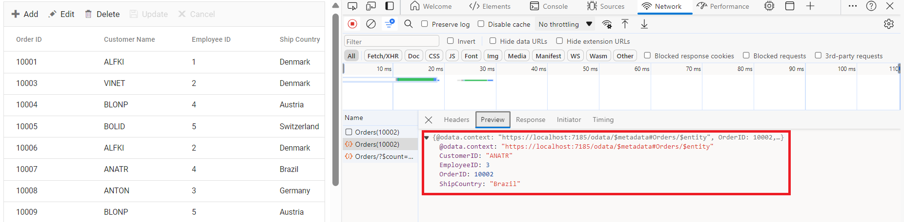

# ODataV4Adaptor in Syncfusion<sup style="font-size:70%">&reg;</sup> ##Platform_Name## Grid Control

The `ODataV4Adaptor` in the Syncfusion<sup style="font-size:70%">&reg;</sup> Grid Control allows seamless integration of the Grid with OData v4 services, enabling efficient data fetching and manipulation. This guide provides detailed instructions on binding data and performing CRUD (Create, Read, Update, Delete) actions using the `ODataV4Adaptor` in your Syncfusion<sup style="font-size:70%">&reg;</sup> Grid Control.

This section describes a step-by-step process for retrieving data using ODataV4Adaptor, then binding it to the ##Platform_Name## Grid control to facilitate data and CRUD operations.



## Creating an ODataV4 service

To configure a server with Syncfusion<sup style="font-size:70%">&reg;</sup> Grid, you need to follow the below steps:

**Step 1:** Set Up Your Development Environment

Before you start, make sure you have the following installed:

- .NET Core SDK
- Node.js
- Visual Studio or any other preferred code editor

**Step 2:** Create a New ASP.NET Core Project

Open Visual Studio and create an ASP.NET Core Web API project named **ODataV4Adaptor**.

**Step 3:** Install NuGet Packages

Using the NuGet package manager in Visual Studio (Tools → NuGet Package Manager → Manage NuGet Packages for Solution), install the **Microsoft.AspNetCore.OData** NuGet package.

**Step 4:** Add the Microsoft.TypeScript.MSBuild NuGet package to the project:

Using the NuGet package manager in Visual Studio (Tools → NuGet Package Manager → Manage NuGet Packages for Solution), install the [Microsoft.TypeScript.MSBuild](https://www.nuget.org/packages/Microsoft.TypeScript.MSBuild/) NuGet package.

**Step 5:** Configure the server

In the `Program.cs` file of your project, configure the server to serve static files by adding the following code:

```cs
var app = builder.Build();

app.UseDefaultFiles();
app.UseStaticFiles();
```

Comment out the below line in `launchSettings.json`:

```json
    "https": {
      "commandName": "Project",
      "dotnetRunMessages": true,
      "launchBrowser": true,
     // "launchUrl": "swagger",
      "applicationUrl": "https://localhost:xxxx;http://localhost:xxxx",
      "environmentVariables": {
        "ASPNETCORE_ENVIRONMENT": "Development"
      }
    },
```
This configuration enables the server to locate and serve the `index.html` file.

**Step 6:** Model Class Creation

Create a model class named **OrdersDetails.cs** in the server-side **Models** folder to represent the order data.




using System.ComponentModel.DataAnnotations;

namespace ODataV4Adaptor.Models
{
 public class OrdersDetails
    {
        public static List<OrdersDetails> order = new List<OrdersDetails>();
        public OrdersDetails()
        {

        }
        public OrdersDetails(
        int OrderID, string CustomerId, int EmployeeId, string ShipCountry)
        {
            this.OrderID = OrderID;
            this.CustomerID = CustomerId;
            this.EmployeeID = EmployeeId;
            this.ShipCountry = ShipCountry;
        }

        public static List<OrdersDetails> GetAllRecords()
        {
            if (order.Count() == 0)
            {
                int code = 10000;
                for (int i = 1; i < 10; i++)
                {
                    order.Add(new OrdersDetails(code + 1, "ALFKI", i + 0,  "Denmark"));
                    order.Add(new OrdersDetails(code + 2, "ANATR", i + 2, "Brazil"));
                    order.Add(new OrdersDetails(code + 3, "ANTON", i + 1, "Germany"));
                    order.Add(new OrdersDetails(code + 4, "BLONP", i + 3, "Austria"));
                    order.Add(new OrdersDetails(code + 5, "BOLID", i + 4, "Switzerland"));
                    code += 5;
                }
            }
            return order;
        }
        [Key]
        public int? OrderID { get; set; }
        public string? CustomerID { get; set; }
        public int? EmployeeID { get; set; }
        public string? ShipCountry { get; set; }
    }
}




**Step 7:** Build the Entity Data Model

To construct the Entity Data Model for your ODataV4 service, utilize the `ODataConventionModelBuilder` to define the model's structure. Start by creating an instance of the `ODataConventionModelBuilder`, then register the entity set **Orders** using the `EntitySet<T>` method, where `OrdersDetails` represents the CLR type containing order details. 

```cs
[program.cs]
using Microsoft.OData.ModelBuilder;

// Create an ODataConventionModelBuilder to build the OData model
var modelBuilder = new ODataConventionModelBuilder();

// Register the "Orders" entity set with the OData model builder
modelBuilder.EntitySet<OrdersDetails>("Orders");
```

**Step 8:** Register the ODataV4 Services

Once the Entity Data Model is built, you need to register the ODataV4 services in your ASP.NET Core application. Here's how:

```cs
[program.cs]

// Add controllers with OData support to the service collection
builder.Services.AddControllers().AddOData(
    options => options
        .Count()
        .AddRouteComponents("odata", modelBuilder.GetEdmModel()));
```
**Step 9:** Add controllers

Finally, add controllers to expose the OData endpoints. Here's an example:

```cs
using Microsoft.AspNetCore.Mvc;
using Microsoft.AspNetCore.OData.Query;
using ODataV4Adaptor.Server.Models;

namespace ODataV4Adaptor.Controllers
{
    [Route("[controller]")]
    [ApiController]
    public class OrdersController : ControllerBase
    {
        /// <summary>
        /// Retrieves all orders.
        /// </summary>
        /// <returns>The collection of orders.</returns>
        [HttpGet]
        [EnableQuery]
        public IActionResult Get()
        {
            var data = OrdersDetails.GetAllRecords().AsQueryable();
            return Ok(data);
        }
    }
}
```

**Step 10:** Run the Application 

Run the application in Visual Studio. It will be accessible on a URL like **https://localhost:xxxx**. 

After running the application, you can verify that the server-side API controller is successfully returning the order data in the URL(https://localhost:xxxx/odata/Orders). Here **xxxx** denotes the port number.

## Connecting syncfusion<sup style="font-size:70%">&reg;</sup> grid to an odataV4 service

To integrate the Syncfusion<sup style="font-size:70%">&reg;</sup> Grid control into your TypeScript and ASP.NET Core project using Visual Studio, follow these steps:

**Step 1:** Create a package.json file:

Run the following command in the project root to create a `package.json` file:

```bash
npm init -y
```

**Step 2:** Install Webpack and Other Dependencies

```bash
npm i -D -E clean-webpack-plugin css-loader html-webpack-plugin mini-css-extract-plugin ts-loader typescript webpack webpack-cli
```

**Step 3:** Configure package.json Scripts

Replace the **scripts** property of `package.json` file with the following code:

```JSON
"scripts": {
  "build": "webpack --mode=development --watch",
  "release": "webpack --mode=production",
  "publish": "npm run release && dotnet publish -c Release"
},
```

**Step 4:** Create wwwroot Folder

Create a folder named `wwwroot` in the project root directory. This folder will contain static files served by the web server.

**Step 5:** Create webpack.config.js

Create a file named `webpack.config.js` in the project root, with the following code to configure the Webpack compilation process:

```js
const path = require("path");
const HtmlWebpackPlugin = require("html-webpack-plugin");
const { CleanWebpackPlugin } = require("clean-webpack-plugin");
const MiniCssExtractPlugin = require("mini-css-extract-plugin");

module.exports = {
    entry: "./src/index.ts",
    output: {
        path: path.resolve(__dirname, "wwwroot"),
        filename: "[name].[chunkhash].js",
        publicPath: "/",
    },
    resolve: {
        extensions: [".js", ".ts"],
    },
    module: {
        rules: [
            {
                test: /\.ts$/,
                use: "ts-loader",
            },
            {
                test: /\.css$/,
                use: [MiniCssExtractPlugin.loader, "css-loader"],
            },
        ],
    },
    plugins: [
        new CleanWebpackPlugin(),
        new HtmlWebpackPlugin({
            template: "./src/index.html",
        }),
        new MiniCssExtractPlugin({
            filename: "css/[name].[chunkhash].css",
        }),
    ],
};
```

**Step 6:** Create a new directory named `src` in the project root for the client code.

**Step 7:** Install Syncfusion<sup style="font-size:70%">&reg;</sup> Packages

Open your terminal in the project’s root folder and install the required Syncfusion<sup style="font-size:70%">&reg;</sup> packages using npm:

```bash
npm install @syncfusion/ej2-grids --save
npm install @syncfusion/ej2-data --save
```

**Step 8:** Create `src/index.html` and add the following code:

```html
<!DOCTYPE html>
<html lang="en">
<head>
    <title>EJ2 Grid</title>
    <meta charset="utf-8" />
    <meta name="viewport" content="width=device-width, initial-scale=1.0" />
    <meta name="description" content="Typescript Grid Control" />
    <meta name="author" content="Syncfusion" />
    <link href="https://cdn.syncfusion.com/ej2/26.1.35/ej2-base/styles/material.css" rel="stylesheet" />
    <link href="https://cdn.syncfusion.com/ej2/26.1.35/ej2-grids/styles/material.css" rel="stylesheet" />
    <link href="https://cdn.syncfusion.com/ej2/26.1.35/ej2-buttons/styles/material.css" rel="stylesheet" />
    <link href="https://cdn.syncfusion.com/ej2/26.1.35/ej2-popups/styles/material.css" rel="stylesheet" />
    <link href="https://cdn.syncfusion.com/ej2/26.1.35/ej2-richtexteditor/styles/material.css" rel="stylesheet" />
    <link href="https://cdn.syncfusion.com/ej2/26.1.35/ej2-navigations/styles/material.css" rel="stylesheet" />
    <link href="https://cdn.syncfusion.com/ej2/26.1.35/ej2-dropdowns/styles/material.css" rel="stylesheet" />
    <link href="https://cdn.syncfusion.com/ej2/26.1.35/ej2-lists/styles/material.css" rel="stylesheet" />
    <link href="https://cdn.syncfusion.com/ej2/26.1.35/ej2-inputs/styles/material.css" rel="stylesheet" />
    <link href="https://cdn.syncfusion.com/ej2/26.1.35/ej2-calendars/styles/material.css" rel="stylesheet" />
    <link href="https://cdn.syncfusion.com/ej2/26.1.35/ej2-notifications/styles/material.css" rel="stylesheet" />
    <link href="https://cdn.syncfusion.com/ej2/26.1.35/ej2-splitbuttons/styles/material.css" rel="stylesheet" />

    <script src="https://cdnjs.cloudflare.com/ajax/libs/systemjs/0.19.38/system.js"></script>

    <script src="https://cdn.syncfusion.com/ej2/syncfusion-helper.js" type="text/javascript"></script>
</head>
<body>
    <div id='container'>
        <div id='Grid'></div>
    </div>
</body>
</html>
```

**Step 9:** Create `src/index.ts` and add the following code:

```ts
import { Grid } from '@syncfusion/ej2-grids';
import { DataManager, ODataV4Adaptor } from '@syncfusion/ej2-data';

let data: DataManager = new DataManager({
    url: 'https://localhost:xxxx/odata/orders',
    adaptor: new ODataV4Adaptor()
});

let grid: Grid = new Grid({
    dataSource: data,
    columns: [
        { field: 'OrderID', headerText: 'Order ID', textAlign: 'Right', width: 120, isPrimaryKey: true, type: 'number' },
        { field: 'CustomerID', width: 140, headerText: 'Customer ID', type: 'string' },
        { field: 'EmployeeID', headerText: 'Employee ID', width: 140 },
        { field: 'ShipCountry', headerText: 'ShipCountry', width: 140 }
    ]
});

grid.appendTo('#Grid');
```

**Step 10:** Create `src/tsconfig.json` in the project and add the following content:

```json
{
  "compilerOptions": {
    "noImplicitAny": true,
    "noEmitOnError": true,
    "removeComments": false,
    "sourceMap": true,
    "target": "es5"
  },
  "exclude": [
    "node_modules",
    "wwwroot"
  ]
}
```

**Step 11:** Install additional packages and build the project

```bash
npm i @types/node
npm run build
```

**Step 12:** Run the project

Run the project in Visual Studio.

The `wwwroot/index.html` file is served at **https://localhost:xxxx**.

With these steps, you have integrated the Syncfusion<sup style="font-size:70%">&reg;</sup> Grid control with your ASP.NET Core project and set up the necessary client-side configuration using Webpack and TypeScript. This will allow the Syncfusion<sup style="font-size:70%">&reg;</sup> Grid to fetch data from your API and display it accordingly.



## Creating an ODataV4 service

**Step 1:** Create a New ASP.NET Core Project

To create a new ASP.NET Core Web API project named ODataV4Adaptor, follow these steps:

* Open Visual Studio.
* Select "Create a new project"
* Choose **ASP.NET Core Web API** project template.
* Name the project **ODataV4Adaptor**.
* Click "Create"

**Step 2:** Install NuGet Packages

Using the NuGet package manager in Visual Studio (Tools → NuGet Package Manager → Manage NuGet Packages for Solution), install the Microsoft.AspNetCore.OData NuGet package.

**Step 3:** Configure the server

In the `Program.cs` file of your project, configure the server to serve static files by adding the following code:

```cs
var app = builder.Build();

app.UseDefaultFiles();
app.UseStaticFiles();
```

Additionally, comment out the following line in the `launchSettings.json` file:

```json
    "https": {
      "commandName": "Project",
      "dotnetRunMessages": true,
      "launchBrowser": true,
     // "launchUrl": "swagger",
      "applicationUrl": "https://localhost:xxxx;http://localhost:xxxx",
      "environmentVariables": {
        "ASPNETCORE_ENVIRONMENT": "Development"
      }
    },
```

This configuration enables the server to locate and serve the `index.html` file.

**Step 4:** Model Class Creation

Create a model class named **OrdersDetails.cs** in the server-side **Models** folder to represent the order data.



using System.ComponentModel.DataAnnotations;

namespace ODataV4Adaptor.Models
{
    public class OrdersDetails
    {
        public static List<OrdersDetails> order = new List<OrdersDetails>();
        public OrdersDetails()
        {

        }
        public OrdersDetails(
        int OrderID, string CustomerId, int EmployeeId, string ShipCountry)
        {
            this.OrderID = OrderID;
            this.CustomerID = CustomerId;
            this.EmployeeID = EmployeeId;
            this.ShipCountry = ShipCountry;
        }

        public static List<OrdersDetails> GetAllRecords()
        {
            if (order.Count() == 0)
            {
                int code = 10000;
                for (int i = 1; i < 10; i++)
                {
                    order.Add(new OrdersDetails(code + 1, "ALFKI", i + 0, "Denmark"));
                    order.Add(new OrdersDetails(code + 2, "ANATR", i + 2, "Brazil"));
                    order.Add(new OrdersDetails(code + 3, "ANTON", i + 1, "Germany"));
                    order.Add(new OrdersDetails(code + 4, "BLONP", i + 3, "Austria"));
                    order.Add(new OrdersDetails(code + 5, "BOLID", i + 4, "Switzerland"));
                    code += 5;
                }
            }
            return order;
        }
        [Key]
        public int? OrderID { get; set; }
        public string? CustomerID { get; set; }
        public int? EmployeeID { get; set; }
        public string? ShipCountry { get; set; }
    }
}



**Step 5:** Build the Entity Data Model**

To construct the Entity Data Model for your ODataV4 service, utilize the `ODataConventionModelBuilder` to define the model's structure. Start by creating an instance of the `ODataConventionModelBuilder`, then register the entity set **Orders** using the `EntitySet<T>` method, where `OrdersDetails` represents the CLR type containing order details. 

```cs
[program.cs]
using Microsoft.OData.ModelBuilder;

// Create an ODataConventionModelBuilder to build the OData model
var modelBuilder = new ODataConventionModelBuilder();

// Register the "Orders" entity set with the OData model builder
modelBuilder.EntitySet<OrdersDetails>("Orders");
```

**Step 6:** Register the ODataV4 Services

Once the Entity Data Model is built, you need to register the ODataV4 services in your ASP.NET Core application. Here's how:

```cs
// Add controllers with OData support to the service collection
builder.Services.AddControllers().AddOData(
    options => options
        .Count()
        .AddRouteComponents("odata", modelBuilder.GetEdmModel()));
```
**Step 7:** Add controllers

Finally, add controllers to expose the OData endpoints. Here's an example:

```cs
using Microsoft.AspNetCore.Mvc;
using Microsoft.AspNetCore.OData.Query;
using ODataV4Adaptor.Models;

namespace ODataV4Adaptor.Controllers
{
    [Route("[controller]")]
    [ApiController]
    public class OrdersController : ControllerBase
    {
        /// <summary>
        /// Retrieves all orders.
        /// </summary>
        /// <returns>The collection of orders.</returns>
        [HttpGet]
        [EnableQuery]
        public IActionResult Get()
        {
            var data = OrdersDetails.GetAllRecords().AsQueryable();
            return Ok(data);
        }
    }
}
```

**Step 8:** Run the Application 

Run the application in Visual Studio. It will be accessible on a URL like **https://localhost:xxxx**. 

After running the application, you can verify that the server-side API controller is successfully returning the order data in the URL(https://localhost:xxxx/odata/Orders). Here **xxxx** denotes the port number.

## Connecting syncfusion<sup style="font-size:70%">&reg;</sup> grid to an odataV4 service

**Step 1:** Create wwwroot folder

Create a folder named `wwwroot` in the project root directory. This folder will contain static files served by the web server.

**Step 2:** Create JS and CSS Folders

Inside the wwwroot folder, create js and css folders to hold script and CSS files, respectively.

**Step 3:** Create index.html File

Create an `index.html` file under the `wwwroot` folder and add the necessary HTML structure along with CSS and JavaScript links to include Syncfusion<sup style="font-size:70%">&reg;</sup> Grid dependencies.

```html
<!DOCTYPE html>
<html lang="en">
<head>
    <title>EJ2 Grid</title>
    <meta charset="utf-8">
    <meta name="viewport" content="width=device-width, initial-scale=1.0">
    <meta name="description" content="Javascript Grid Control">
    <meta name="author" content="Syncfusion">
    <link href="css/index.css" rel="stylesheet">
    <link href="https://cdn.syncfusion.com/ej2/26.1.35/ej2-base/styles/material.css" rel="stylesheet">
    <link href="https://cdn.syncfusion.com/ej2/26.1.35/ej2-grids/styles/material.css" rel="stylesheet">
    <link href="https://cdn.syncfusion.com/ej2/26.1.35/ej2-buttons/styles/material.css" rel="stylesheet">
    <link href="https://cdn.syncfusion.com/ej2/26.1.35/ej2-popups/styles/material.css" rel="stylesheet">
    <link href="https://cdn.syncfusion.com/ej2/26.1.35/ej2-richtexteditor/styles/material.css" rel="stylesheet">
    <link href="https://cdn.syncfusion.com/ej2/26.1.35/ej2-navigations/styles/material.css" rel="stylesheet">
    <link href="https://cdn.syncfusion.com/ej2/26.1.35/ej2-dropdowns/styles/material.css" rel="stylesheet">
    <link href="https://cdn.syncfusion.com/ej2/26.1.35/ej2-lists/styles/material.css" rel="stylesheet">
    <link href="https://cdn.syncfusion.com/ej2/26.1.35/ej2-inputs/styles/material.css" rel="stylesheet">
    <link href="https://cdn.syncfusion.com/ej2/26.1.35/ej2-calendars/styles/material.css" rel="stylesheet">
    <link href="https://cdn.syncfusion.com/ej2/26.1.35/ej2-notifications/styles/material.css" rel="stylesheet">
    <link href="https://cdn.syncfusion.com/ej2/26.1.35/ej2-splitbuttons/styles/material.css" rel="stylesheet">

    <script src="https://cdn.syncfusion.com/ej2/26.1.35/dist/ej2.min.js" type="text/javascript"></script>
    <script src="https://cdn.syncfusion.com/ej2/syncfusion-helper.js" type="text/javascript"></script>
</head>
<body>

    <div id="container">
        <div id="Grid"></div>
    </div>
    <script src="js/index.js" type="text/javascript"></script>
</body>
</html>
```

**Step 4:** Create JavaScript File

Create a index.js file under the `wwwroot/js` folder and add the JavaScript code to initialize the Syncfusion<sup style="font-size:70%">&reg;</sup> Grid with data from the API service.

```js
var data = new ej.data.DataManager({
    url: 'https://localhost:xxxx/odata/orders', // Here xxxx represents the port number
    adaptor: new ej.data.ODataV4Adaptor()
});

var grid = new ej.grids.Grid({
    dataSource: data,
    columns: [
        { field: 'OrderID', headerText: 'Order ID', textAlign: 'Right', width: 120, isPrimaryKey: true, type: 'number' },
        { field: 'CustomerID', width: 140, headerText: 'Customer ID', type: 'string' },
        { field: 'EmployeeID', headerText: 'Employee ID', width: 140 },
        { field: 'ShipCountry', headerText: 'ShipCountry', width: 140 }
    ]
});

grid.appendTo('#Grid');
```

**Step 5:** Run the Project

Now, run the project to see the Syncfusion<sup style="font-size:70%">&reg;</sup> Grid connected to the API service in action.



## Handling searching operation

To enable search operations in your web application using OData, you first need to configure the OData support in your service collection. This involves adding the `Filter` method within the OData setup, allowing you to filter data based on specified criteria. Once enabled, clients can utilize the **$filter** query option in their requests to search for specific data entries.



// Create a new instance of the web application builder
var builder = WebApplication.CreateBuilder(args);

// Create an ODataConventionModelBuilder to build the OData model
var modelBuilder = new ODataConventionModelBuilder();

// Register the "Orders" entity set with the OData model builder
modelBuilder.EntitySet<OrdersDetails>("Orders");

// Add services to the container.

// Add controllers with OData support to the service collection
builder.Services.AddControllers().AddOData(
    options => options
        .Count()
        .Filter() //searching
        .AddRouteComponents("odata", modelBuilder.GetEdmModel()));



import { Grid, Toolbar } from '@syncfusion/ej2-grids';
import { DataManager, ODataV4Adaptor } from '@syncfusion/ej2-data';

let data: DataManager = new DataManager({
    url: 'https://localhost:xxxx/odata/Orders', Here xxxx represents the port number
    adaptor: new ODataV4Adaptor()
});
Grid.Inject(Toolbar);
let grid: Grid = new Grid({
    dataSource: data,
    toolbar:['Search'],
    columns: [
        { field: 'OrderID', headerText: 'Order ID', textAlign: 'Right', width: 120, isPrimaryKey: true, type: 'number' },
        { field: 'CustomerID', width: 140, headerText: 'Customer ID', type: 'string' },
        { field: 'EmployeeID', headerText: 'Employee ID', width: 140 },
        { field: 'ShipCountry', headerText: 'ShipCountry', width: 140 }
    ]
});

grid.appendTo('#Grid');



var data = new ej.data.DataManager({
    url: 'https://localhost:xxxx/odata/orders', // Here xxxx represents the port number
    adaptor: new ej.data.ODataV4Adaptor()
});
ej.grids.Grid.Inject(ej.grids.Toolbar);
var grid = new ej.grids.Grid({
    dataSource: data,
    toolbar:['Search'],
    columns: [
        { field: 'OrderID', headerText: 'Order ID', textAlign: 'Right', width: 120, isPrimaryKey: true, type: 'number' },
        { field: 'CustomerID', width: 140, headerText: 'Customer ID', type: 'string' },
        { field: 'EmployeeID', headerText: 'Employee ID', width: 140 },
        { field: 'ShipCountry', headerText: 'ShipCountry', width: 140 }
    ]
});

grid.appendTo('#Grid');





## Handling filtering operation

To enable filter operations in your web application using OData, you first need to configure the OData support in your service collection. This involves adding the `Filter` method within the OData setup, allowing you to filter data based on specified criteria. Once enabled, clients can utilize the **$filter** query option in your requests to filter for specific data entries.



// Create a new instance of the web application builder
var builder = WebApplication.CreateBuilder(args);

// Create an ODataConventionModelBuilder to build the OData model
var modelBuilder = new ODataConventionModelBuilder();

// Register the "Orders" entity set with the OData model builder
modelBuilder.EntitySet<OrdersDetails>("Orders");

// Add services to the container.

// Add controllers with OData support to the service collection
builder.Services.AddControllers().AddOData(
    options => options
        .Count()
        .Filter() // filtering
        .AddRouteComponents("odata", modelBuilder.GetEdmModel()));



import { Grid, Filter } from '@syncfusion/ej2-grids';
import { DataManager, ODataV4Adaptor } from '@syncfusion/ej2-data';

let data: DataManager = new DataManager({
    url: 'https://localhost:xxxx/odata/Orders',
    adaptor: new ODataV4Adaptor()
});
Grid.Inject(Filter);
let grid: Grid = new Grid({
    dataSource: data,
    allowFiltering: true,
    columns: [
        { field: 'OrderID', headerText: 'Order ID', textAlign: 'Right', width: 120, isPrimaryKey: true, type: 'number' },
        { field: 'CustomerID', width: 140, headerText: 'Customer ID', type: 'string' },
        { field: 'EmployeeID', headerText: 'Employee ID', width: 140 },
        { field: 'ShipCountry', headerText: 'ShipCountry', width: 140 }
    ]
});

grid.appendTo('#Grid');



var data = new ej.data.DataManager({
    url: 'https://localhost:xxxx/odata/orders', // Here xxxx represents the port number
    adaptor: new ej.data.ODataV4Adaptor()
});
ej.grids.Grid.Inject(ej.grids.Filter);
var grid = new ej.grids.Grid({
    dataSource: data,
    allowFiltering:true,
    columns: [
        { field: 'OrderID', headerText: 'Order ID', textAlign: 'Right', width: 120, isPrimaryKey: true, type: 'number' },
        { field: 'CustomerID', width: 140, headerText: 'Customer ID', type: 'string' },
        { field: 'EmployeeID', headerText: 'Employee ID', width: 140 },
        { field: 'ShipCountry', headerText: 'ShipCountry', width: 140 }
    ]
});

grid.appendTo('#Grid');




Single column filtering

Multi column filtering


## Handling sorting operation

To enable sorting operations in your web application using OData, you first need to configure the OData support in your service collection. This involves adding the `OrderBy` method within the OData setup, allowing you to sort data based on specified criteria. Once enabled, clients can utilize the **$orderby** query option in their requests to sort data entries according to desired attributes.



// Create a new instance of the web application builder
var builder = WebApplication.CreateBuilder(args);

// Create an ODataConventionModelBuilder to build the OData model
var modelBuilder = new ODataConventionModelBuilder();

// Register the "Orders" entity set with the OData model builder
modelBuilder.EntitySet<OrdersDetails>("Orders");

// Add services to the container.

// Add controllers with OData support to the service collection
builder.Services.AddControllers().AddOData(
    options => options
        .Count()
        .OrderBy() // sorting
        .AddRouteComponents("odata", modelBuilder.GetEdmModel()));



import { Grid, Sort} from '@syncfusion/ej2-grids';
import { DataManager, ODataV4Adaptor } from '@syncfusion/ej2-data';

let data: DataManager = new DataManager({
    url: 'https://localhost:xxxx/odata/Orders',
    adaptor: new ODataV4Adaptor()
});
Grid.Inject(Sort);
let grid: Grid = new Grid({
    dataSource: data,
    allowSorting: true,
    columns: [
        { field: 'OrderID', headerText: 'Order ID', textAlign: 'Right', width: 120, isPrimaryKey: true, type: 'number' },
        { field: 'CustomerID', width: 140, headerText: 'Customer ID', type: 'string' },
        { field: 'EmployeeID', headerText: 'Employee ID', width: 140 },
        { field: 'ShipCountry', headerText: 'ShipCountry', width: 140 }
    ]
});

grid.appendTo('#Grid');



var data = new ej.data.DataManager({
    url: 'https://localhost:xxxx/odata/orders', // Here xxxx represents the port number
    adaptor: new ej.data.ODataV4Adaptor()
});
ej.grids.Grid.Inject(ej.grids.Sort);
var grid = new ej.grids.Grid({
    dataSource: data,
    allowSorting:true,
    columns: [
        { field: 'OrderID', headerText: 'Order ID', textAlign: 'Right', width: 120, isPrimaryKey: true, type: 'number' },
        { field: 'CustomerID', width: 140, headerText: 'Customer ID', type: 'string' },
        { field: 'EmployeeID', headerText: 'Employee ID', width: 140 },
        { field: 'ShipCountry', headerText: 'ShipCountry', width: 140 }
    ]
});

grid.appendTo('#Grid');




*Single column sorting*


*Multi column sorting*


## Handling paging operation

To implement paging operations in your web application using OData, you can utilize the `SetMaxTop` method within your OData setup to limit the maximum number of records that can be returned per request. While you configure the maximum limit, clients can utilize the **$skip** and **$top** query options in their requests to specify the number of records to skip and the number of records to take, respectively. 




// Create a new instance of the web application builder
var builder = WebApplication.CreateBuilder(args);

// Create an ODataConventionModelBuilder to build the OData model
var modelBuilder = new ODataConventionModelBuilder();

// Register the "Orders" entity set with the OData model builder
modelBuilder.EntitySet<OrdersDetails>("Orders");
 
// Add services to the container.

// Add controllers with OData support to the service collection

var recordCount= OrdersDetails.GetAllRecords().Count;

builder.Services.AddControllers().AddOData(
    options => options
    .Count()
    .SetMaxTop(recordCount)
    .AddRouteComponents(
        "odata",
        modelBuilder.GetEdmModel()));




import { Grid, Page} from '@syncfusion/ej2-grids';
import { DataManager, ODataV4Adaptor } from '@syncfusion/ej2-data';

let data: DataManager = new DataManager({
    url: 'https://localhost:7199/odata/Orders',
    adaptor: new ODataV4Adaptor()
});
Grid.Inject(Page);
let grid: Grid = new Grid({
    dataSource: data,
    allowPaging: true,
    columns: [
        { field: 'OrderID', headerText: 'Order ID', textAlign: 'Right', width: 120, isPrimaryKey: true, type: 'number' },
        { field: 'CustomerID', width: 140, headerText: 'Customer ID', type: 'string' },
        { field: 'EmployeeID', headerText: 'Employee ID', width: 140 },
        { field: 'ShipCountry', headerText: 'ShipCountry', width: 140 }
    ]
});

grid.appendTo('#Grid');




var data = new ej.data.DataManager({
    url: 'https://localhost:xxxx/odata/orders', // Here xxxx represents the port number
    adaptor: new ej.data.ODataV4Adaptor()
});
ej.grids.Grid.Inject(ej.grids.Page);
var grid = new ej.grids.Grid({
    dataSource: data,
    allowPaging: true,
    columns: [
        { field: 'OrderID', headerText: 'Order ID', textAlign: 'Right', width: 120, isPrimaryKey: true, type: 'number' },
        { field: 'CustomerID', width: 140, headerText: 'Customer ID', type: 'string' },
        { field: 'EmployeeID', headerText: 'Employee ID', width: 140 },
        { field: 'ShipCountry', headerText: 'ShipCountry', width: 140 }
    ]
});

grid.appendTo('#Grid');





## Handling CRUD operations

To manage CRUD (Create, Read, Update, Delete) operations using the ODataV4Adaptor, follow the provided guide for configuring the Syncfusion<sup style="font-size:70%">&reg;</sup> Grid for [editing](../editing/edit) and utilize the sample implementation of the `OrdersController` in your server application. This controller handles HTTP requests for CRUD operations such as GET, POST, PATCH, and DELETE.

To enable CRUD operations in the Syncfusion<sup style="font-size:70%">&reg;</sup> Grid control, follow the below steps:





import { Grid, Edit, Toolbar } from '@syncfusion/ej2-grids';
import { DataManager, ODataV4Adaptor } from '@syncfusion/ej2-data';

let data: DataManager = new DataManager({
    url: 'https://localhost:xxxx/odata/Orders',
    adaptor: new ODataV4Adaptor()
});
Grid.Inject(Edit, Toolbar);
let grid: Grid = new Grid({
    dataSource: data,
    toolbar:['Add','Edit','Update','Delete','Cancel'],
    editSettings: { allowAdding: true, allowDeleting: true, allowEditing: true },
    columns: [
        { field: 'OrderID', headerText: 'Order ID', textAlign: 'Right', width: 120, isPrimaryKey: true, type: 'number' },
        { field: 'CustomerID', width: 140, headerText: 'Customer ID', type: 'string' },
        { field: 'EmployeeID', headerText: 'Employee ID', width: 140 },
        { field: 'ShipCountry', headerText: 'ShipCountry', width: 140 }
    ]
});

grid.appendTo('#Grid');




var data = new ej.data.DataManager({
    url: 'https://localhost:xxxx/odata/orders', // Here xxxx represents the port number
    adaptor: new ej.data.ODataV4Adaptor()
});
ej.grids.Grid.Inject(ej.grids.Toolbar, ej.grids.Filter, ej.grids.Sort, ej.grids.Page, ej.grids.Edit);
var grid = new ej.grids.Grid({
    dataSource: data,
    allowFiltering: true,
    allowSorting:true,
    toolbar: ['Add', 'Edit', 'Update', 'Delete', 'Cancel', 'Search'],
    editSettings: { allowAdding: true, allowDeleting: true, allowEditing: true },
    columns: [
        { field: 'OrderID', headerText: 'Order ID', textAlign: 'Right', width: 120, isPrimaryKey: true, type: 'number' },
        { field: 'CustomerID', width: 140, headerText: 'Customer ID', type: 'string' },
        { field: 'EmployeeID', headerText: 'Employee ID', width: 140 },
        { field: 'ShipCountry', headerText: 'ShipCountry', width: 140 }
    ]
});

grid.appendTo('#Grid');




> Normal/Inline editing is the default edit [mode](../../api/grid/editSettings/#mode) for the Grid control. To enable CRUD operations, ensure that the [isPrimaryKey](../../api/grid/column/#isprimarykey) property is set to **true** for a specific Grid column, ensuring that its value is unique.

**Insert Record**

To insert a new record into your Syncfusion<sup style="font-size:70%">&reg;</sup> Grid, you can utilize the `HttpPost` method in your server application. Below is a sample implementation of inserting a record using the **OrdersController**:

```cs
/// <summary>
/// Inserts a new order to the collection.
/// </summary>
/// <param name="addRecord">The order to be inserted.</param>
/// <returns>It returns the newly inserted record detail.</returns>
[HttpPost]
[EnableQuery]
public IActionResult Post([FromBody] OrdersDetails addRecord)
{
    if (addRecord == null)
    {
      return BadRequest("Null order");
    }
    OrdersDetails.GetAllRecords().Insert(0, addRecord);
    return Json(addRecord);
}
```


**Update Record**

Updating a record in the Syncfusion<sup style="font-size:70%">&reg;</sup> Grid can be achieved by utilizing the `HttpPatch` method in your controller. Here's a sample implementation of updating a record:

```cs
/// <summary>
/// Updates an existing order.
/// </summary>
/// <param name="key">The ID of the order to update.</param>
/// <param name="updateRecord">The updated order details.</param>
/// <returns>It returns the updated order details.</returns>
[HttpPatch("{key}")]
public IActionResult Patch(int key, [FromBody] OrdersDetails updateRecord)
{
    if (updateRecord == null)
    {
        return BadRequest("No records");
    }
    var existingOrder = OrdersDetails.GetAllRecords().FirstOrDefault(order => order.OrderID == key);
    if (existingOrder != null)
    {
        // If the order exists, update its properties
        existingOrder.CustomerID = updateRecord.CustomerID ?? existingOrder.CustomerID;
        existingOrder.EmployeeID = updateRecord.EmployeeID ?? existingOrder.EmployeeID;
        existingOrder.ShipCountry = updateRecord.ShipCountry ?? existingOrder.ShipCountry;
    }
    return Json(updateRecord);
}
```


**Delete Record**

To delete a record from your Syncfusion<sup style="font-size:70%">&reg;</sup> Grid, you can utilize the `HttpDelete` method in your controller. Below is a sample implementation:

```cs
/// <summary>
/// Deletes an order.
/// </summary>
/// <param name="key">The ID of the order to delete.</param>
/// <returns>It returns the deleted record detail</returns>
[HttpDelete("{key}")]
public IActionResult Delete(int key)
{
    var deleteRecord = OrdersDetails.GetAllRecords().FirstOrDefault(order => order.OrderID == key);
    if (deleteRecord != null)
    {
        OrdersDetails.GetAllRecords().Remove(deleteRecord);
    }
    return Json(deleteRecord);
}
```



> You can find the complete sample for the ODataV4Adaptor in [GitHub](https://github.com/SyncfusionExamples/Binding-data-from-remote-service-to-typescript-data-grid) link.

> You can find the complete sample for the ODataV4Adaptor in [GitHub](https://github.com/SyncfusionExamples/Binding-data-from-remote-service-to-javascript-data-grid) link.


## Odata with custom url

The Syncfusion<sup style="font-size:70%">&reg;</sup> ODataV4 adaptor extends support for calling customized URLs to accommodate data retrieval and CRUD actions as per your application's requirements. However, when utilizing a custom URL with the ODataV4 adaptor, it's Essential<sup style="font-size:70%">&reg;</sup> to modify the routing configurations in your application's route configuration file to align with your custom URL. You can invoke the custom URL by the following methods in the Datamanager

**Configuring Custom URLs**

To work with custom URLs for CRUD operations in the Syncfusion<sup style="font-size:70%">&reg;</sup> Grid, you can use the following properties:

* insertUrl: Specifies the custom URL for inserting new records.
* removeUrl: Specifies the custom URL for deleting records.
* updateUrl: Specifies the custom URL for updating records.
* batchUrl: Specifies the custom URL for batch editing operations.

> Ensure that the routing configurations on the server-side are properly updated to handle these custom URLs.

The following code example describes the above behavior.





import { Grid, Edit, Toolbar } from '@syncfusion/ej2-grids';
import { DataManager, ODataV4Adaptor } from '@syncfusion/ej2-data';

let data: DataManager = new DataManager({
    url: 'https://localhost:xxxx/odata/Orders', // xxxx denotes port number
    updateUrl: 'https://localhost:xxxx/odata/Orders/Update', // custom URL to update the record
    insertUrl: 'https://localhost:xxxx/odata/Orders/Insert', // custom URL to insert new record
    removeUrl: 'https://localhost:xxxx/odata/Orders/Delete', // custom URL to delete the record
    adaptor: new ODataV4Adaptor()
});
Grid.Inject(Edit, Toolbar);
let grid: Grid = new Grid({
    dataSource: data,
    toolbar:['Add','Edit','Update','Delete','Cancel'],
    editSettings: { allowAdding: true, allowDeleting: true, allowEditing: true },
    columns: [
        { field: 'OrderID', headerText: 'Order ID', textAlign: 'Right', width: 120, isPrimaryKey: true, type: 'number' },
        { field: 'CustomerID', width: 140, headerText: 'Customer ID', type: 'string' },
        { field: 'EmployeeID', headerText: 'Employee ID', width: 140 },
        { field: 'ShipCountry', headerText: 'ShipCountry', width: 140 }
    ]
});

grid.appendTo('#Grid');





var data = new ej.data.DataManager({
    url: 'https://localhost:xxxx/odata/orders', // xxxx denotes port number
    updateUrl: 'https://localhost:xxxx/odata/orders/Update', // custom URL to update the record
    insertUrl: 'https://localhost:xxxx/odata/orders/Insert', // custom URL to insert new record
    removeUrl: 'https://localhost:xxxx/odata/orders/Delete', // custom URL to delete the record
    adaptor: new ej.data.ODataV4Adaptor()
});
ej.grids.Grid.Inject(ej.grids.Toolbar, ej.grids.Edit);
var grid = new ej.grids.Grid({
    dataSource: data,
    toolbar: ['Add', 'Edit', 'Update', 'Delete', 'Cancel'],
    editSettings: { allowAdding: true, allowDeleting: true, allowEditing: true },
    columns: [
        { field: 'OrderID', headerText: 'Order ID', textAlign: 'Right', width: 120, isPrimaryKey: true, type: 'number' },
        { field: 'CustomerID', width: 140, headerText: 'Customer ID', type: 'string' },
        { field: 'EmployeeID', headerText: 'Employee ID', width: 140 },
        { field: 'ShipCountry', headerText: 'ShipCountry', width: 140 }
    ]
});

grid.appendTo('#Grid');




For batch editing, you can specify a custom batch URL as follows:





import { Grid, Edit, Toolbar } from '@syncfusion/ej2-grids';
import { DataManager, ODataV4Adaptor } from '@syncfusion/ej2-data';

let data: DataManager = new DataManager({
    url: 'https://localhost:xxxx/odata/orders', // xxxx denotes port number
    batchUrl: 'https://localhost:xxxx/odata/orders/BatchUpdate', // custom URL for batch update
    adaptor: new ODataV4Adaptor()
});
Grid.Inject(Edit, Toolbar);
let grid: Grid = new Grid({
    dataSource: data,
    toolbar:['Add','Edit','Update','Delete','Cancel'],
    editSettings: { allowAdding: true, allowDeleting: true, allowEditing: true, mode: 'Batch' },
    columns: [
        { field: 'OrderID', headerText: 'Order ID', textAlign: 'Right', width: 120, isPrimaryKey: true, type: 'number' },
        { field: 'CustomerID', width: 140, headerText: 'Customer ID', type: 'string' },
        { field: 'EmployeeID', headerText: 'Employee ID', width: 140 },
        { field: 'ShipCountry', headerText: 'ShipCountry', width: 140 }
    ]
});

grid.appendTo('#Grid');





var data = new ej.data.DataManager({
    url: 'https://localhost:xxxx/odata/orders', // xxxx denotes port number
    batchUrl: 'https://localhost:xxxx/odata/orders/BatchUpdate', // custom URL for batch update
    adaptor: new ej.data.ODataV4Adaptor()
});
ej.grids.Grid.Inject(ej.grids.Toolbar, ej.grids.Edit);
var grid = new ej.grids.Grid({
    dataSource: data,
    toolbar: ['Add', 'Edit', 'Update', 'Delete', 'Cancel'],
    editSettings: { allowAdding: true, allowDeleting: true, allowEditing: true, mode: 'Batch' },
    columns: [
        { field: 'OrderID', headerText: 'Order ID', textAlign: 'Right', width: 120, isPrimaryKey: true, type: 'number' },
        { field: 'CustomerID', width: 140, headerText: 'Customer ID', type: 'string' },
        { field: 'EmployeeID', headerText: 'Employee ID', width: 140 },
        { field: 'ShipCountry', headerText: 'ShipCountry', width: 140 }
    ]
});

grid.appendTo('#Grid');




