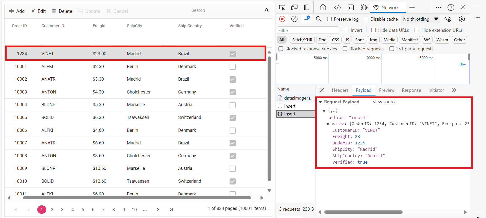

# RemoteSaveAdaptor in Syncfusion ##Platform_Name## Grid Control

The RemoteSaveAdaptor in Syncfusion Angular Grid Component allows you to perform grid actions such as sorting, filtering, searching and paging primarily on the client-side while handling CRUD operations, such as updating, inserting, and removing data, on the server-side for data persistence. This approach optimizes your experience by minimizing unnecessary server interactions.

Ensure your server-side implementation in ASP.NET Core handles CRUD operations. Here is an example of how you can set up your ASP.NET Core controller to handle these operations:

**Server-Side Implementation**

To configure a server with Syncfusion Angular Grid, you need to follow the below steps:

**Step 1:** Set Up Your Development Environment

Before you start, make sure you have the following installed:

- .NET Core SDK
- Node.js
- Visual Studio or any other preferred code editor

**Step 2:** Create a New ASP.NET Core Project

Open Visual Studio and create an ASP.NET Core Web API project named **RemoteSaveAdaptor**. 

**Step 3:** Configure the server

In the `Program.cs` file of your project, configure the server to serve static files by adding the following code:

```cs
[program.cs]

var app = builder.Build();

app.UseDefaultFiles();
app.UseStaticFiles();
```

Comment out the below line in `launchSettings.json`:

```json
    "https": {
      "commandName": "Project",
      "dotnetRunMessages": true,
      "launchBrowser": true,
     // "launchUrl": "swagger",
      "applicationUrl": "https://localhost:xxxx;http://localhost:xxxx",
      "environmentVariables": {
        "ASPNETCORE_ENVIRONMENT": "Development"
      }
    },
```
This configuration enables the server to locate and serve the `index.html` file.

**Step 4:** Model Class Creation

Create a model class named **OrdersDetails.cs** in the **Models** folder to represent the order data.



using System.ComponentModel.DataAnnotations;

namespace RemoteSaveAdaptor.Models
{
  public class OrdersDetails
  {
    public static List<OrdersDetails> order = new List<OrdersDetails>();
    public OrdersDetails()
    {

    }
    public OrdersDetails(int OrderID, string CustomerId, int EmployeeId, double Freight, bool Verified, DateTime OrderDate, string ShipCity, string ShipName, string ShipCountry, DateTime ShippedDate, string ShipAddress)
    {
      this.OrderID = OrderID;
      this.CustomerID = CustomerId;
      this.EmployeeID = EmployeeId;
      this.Freight = Freight;
      this.ShipCity = ShipCity;
      this.Verified = Verified;
      this.OrderDate = OrderDate;
      this.ShipName = ShipName;
      this.ShipCountry = ShipCountry;
      this.ShippedDate = ShippedDate;
      this.ShipAddress = ShipAddress;
    }

    public static List<OrdersDetails> GetAllRecords()
    {
      if (order.Count() == 0)
      {
        int code = 10000;
        for (int i = 1; i <= 2000; i++)
        {
          order.Add(new OrdersDetails(code + 1, "ALFKI", i + 0, 2.3 * i, false, new DateTime(1991, 05, 15), "Berlin", "Simons bistro", "Denmark", new DateTime(1996, 7, 16), "Kirchgasse 6"));
          order.Add(new OrdersDetails(code + 2, "ANATR", i + 2, 3.3 * i, true, new DateTime(1990, 04, 04), "Madrid", "Queen Cozinha", "Brazil", new DateTime(1996, 9, 11), "Avda. Azteca 123"));
          order.Add(new OrdersDetails(code + 3, "ANTON", i + 1, 4.3 * i, true, new DateTime(1957, 11, 30), "Cholchester", "Frankenversand", "Germany", new DateTime(1996, 10, 7), "Carrera 52 con Ave. Bolívar #65-98 Llano Largo"));
          order.Add(new OrdersDetails(code + 4, "BLONP", i + 3, 5.3 * i, false, new DateTime(1930, 10, 22), "Marseille", "Ernst Handel", "Austria", new DateTime(1996, 12, 30), "Magazinweg 7"));
          order.Add(new OrdersDetails(code + 5, "BOLID", i + 4, 6.3 * i, true, new DateTime(1953, 02, 18), "Tsawassen", "Hanari Carnes", "Switzerland", new DateTime(1997, 12, 3), "1029 - 12th Ave. S."));
          code += 5;
        }
      }
      return order;
    }
    [Key]
    public int? OrderID { get; set; }
    public string CustomerID { get; set; }
    public int? EmployeeID { get; set; }
    public double? Freight { get; set; }
    public string ShipCity { get; set; }
    public bool Verified { get; set; }
    public DateTime OrderDate { get; set; }
    public string ShipName { get; set; }
    public string ShipCountry { get; set; }
    public DateTime ShippedDate { get; set; }
    public string ShipAddress { get; set; }
  }
}



**Step 5:** API Controller Creation

```cs
using Microsoft.AspNetCore.Mvc;
using RemoteSaveAdaptor.Models;

namespace RemoteSaveAdaptor.Controllers
{
  [ApiController]
  public class OrdersController : Controller
  {
    [HttpPost]
    [Route("api/[controller]")]
    public object Post()
    {
      // Retrieve data from the data source (e.g., database)
      IQueryable<OrdersDetails> DataSource = GetOrderData().AsQueryable();

      // Get the total records count
      int totalRecordsCount = DataSource.Count();

      // Return data based on the request
      return new { result = DataSource, count = totalRecordsCount };
    }

    [HttpGet]
    [Route("api/[controller]")]
    public List<OrdersDetails> GetOrderData()
    {
      var data = OrdersDetails.GetAllRecords().ToList();
      return data;
    }
  }
}
```

The below class is used to structure data sent during CRUD operations.

```cs
  public class CRUDModel<T> where T : class
  {
    public string? action { get; set; }
    public string? keyColumn { get; set; }
    public object? key { get; set; }
    public T? value { get; set; }
    public List<T>? added { get; set; }
    public List<T>? changed { get; set; }
    public List<T>? deleted { get; set; }
    public IDictionary<string, object>? @params { get; set; }
  }
```

**Insert operation:**

To insert a new record, utilize the [insertUrl](https://help.syncfusion.com/cr/aspnetmvc-js2/Syncfusion.EJ2.DataManager.html#Syncfusion_EJ2_DataManager_InsertUrl) property to specify the controller action mapping URL for the insert operation. Implement the `Insert` method in the API controller to handle the insertion of new records.The newly added record details are bound to the **newRecord** parameter.



```cs
  /// <summary>
  /// Inserts a new data item into the data collection.
  /// </summary>
  /// <param name="addRecord">The order to be inserted.</param>
  /// <returns>It returns the newly inserted record detail.</returns>
  [HttpPost]
  [Route("api/Orders/Insert")]
  public ActionResult Insert([FromBody] CRUDModel<OrdersDetails> newRecord)
  {
      if (newRecord.value !=null)
      {
          OrdersDetails.GetAllRecords().Insert(0, newRecord.value);
      }
      
      return Json(newRecord.value);
  }
```

**Update operation:**

For updating existing records, use the [updateUrl](https://help.syncfusion.com/cr/aspnetmvc-js2/Syncfusion.EJ2.DataManager.html#Syncfusion_EJ2_DataManager_UpdateUrl) property to specify the controller action mapping URL for the update operation. Implement the Update method in the API controller to handle record updates. The updated record details are bound to the **updatedRecord** parameter.


```cs
  /// <summary>
  /// Updates an existing order.
  /// </summary>
  /// <param name="updateRecord">The updated order details.</param>
  /// <returns>It returns the updated order details.</returns>
  [HttpPost]
  [Route("api/Orders/Update")]
  public object Update([FromBody] CRUDModel<OrdersDetails> updatedRecord)
  {
    var updatedOrder = updatedRecord.value;
    if (updatedOrder != null)
    {
      var data = OrdersDetails.GetAllRecords().FirstOrDefault(or => or.OrderID == updatedOrder.OrderID);
      if (data != null)
      {
        // Update the existing record
        data.OrderID = updatedOrder.OrderID;
        data.CustomerID = updatedOrder.CustomerID;
        data.Freight = updatedOrder.Freight;
        data.ShipCity = updatedOrder.ShipCity;
        data.ShipCountry = updatedOrder.ShipCountry;
        data.Verified = updatedOrder.Verified;
        // Update other properties similarly
      }
    }
    return updatedRecord;
  }
```

**Delete operation**

To delete existing records, use the [removeUrl](https://help.syncfusion.com/cr/aspnetmvc-js2/Syncfusion.EJ2.DataManager.html#Syncfusion_EJ2_DataManager_RemoveUrl) property to specify the controller action mapping URL for the delete operation. The primary key value of the deleted record is bound to the **deletedRecord** parameter.


```cs
  /// <summary>
  /// Deletes an order.
  /// </summary>
  /// <param name="deletedRecord">It contains the specific record detail which is need to be removed.</param>
  /// <returns>It returns the deleted record detail</returns>
  [HttpPost]
  [Route("api/Orders/Remove")]
  public object Remove([FromBody] CRUDModel<OrdersDetails> deletedRecord)
  {
      int orderId = int.Parse(deletedRecord.key.ToString()); // get key value from the deletedRecord
      var data = OrdersDetails.GetAllRecords().FirstOrDefault(orderData => orderData.OrderID == orderId);
      if (data != null)
      {
          // Remove the record from the data collection
          OrdersDetails.GetAllRecords().Remove(data);
      }
      return deletedRecord;
  }
```

**4. Run the Application:**

Run the application in Visual Studio. It will be accessible on a URL like **https://localhost:xxxx**. 

After running the application, you can verify that the server-side API controller is successfully returning the order data in the URL(https://localhost:xxxx/api/Orders). Here **xxxx** denotes the port number.



**Connecting syncfusion grid to an api service**

To integrate the Syncfusion Grid control into your TypeScript and ASP.NET Core project using Visual Studio, follow these steps:

**Step 1:** Create a package.json file:

Run the following command in the project root to create a `package.json` file:

```bash
npm init -y
```

**Step 2:** Install Webpack and Other Dependencies

```bash
npm i -D -E clean-webpack-plugin css-loader html-webpack-plugin mini-css-extract-plugin ts-loader typescript webpack webpack-cli
```

**Step 3:** Configure package.json Scripts

Replace the **scripts** property of `package.json` file with the following code:

```JSON
"scripts": {
  "build": "webpack --mode=development --watch",
  "release": "webpack --mode=production",
  "publish": "npm run release && dotnet publish -c Release"
},
```

**Step 4:** Create wwwroot Folder

Create a folder named `wwwroot` in the project root directory. This folder will contain static files served by the web server.

**Step 5:** Create webpack.config.js

Create a file named `webpack.config.js` in the project root, with the following code to configure the Webpack compilation process:

```js
const path = require("path");
const HtmlWebpackPlugin = require("html-webpack-plugin");
const { CleanWebpackPlugin } = require("clean-webpack-plugin");
const MiniCssExtractPlugin = require("mini-css-extract-plugin");

module.exports = {
    entry: "./src/index.ts",
    output: {
        path: path.resolve(__dirname, "wwwroot"),
        filename: "[name].[chunkhash].js",
        publicPath: "/",
    },
    resolve: {
        extensions: [".js", ".ts"],
    },
    module: {
        rules: [
            {
                test: /\.ts$/,
                use: "ts-loader",
            },
            {
                test: /\.css$/,
                use: [MiniCssExtractPlugin.loader, "css-loader"],
            },
        ],
    },
    plugins: [
        new CleanWebpackPlugin(),
        new HtmlWebpackPlugin({
            template: "./src/index.html",
        }),
        new MiniCssExtractPlugin({
            filename: "css/[name].[chunkhash].css",
        }),
    ],
};
```

**Step 6:** Create a new directory named `src` in the project root for the client code.

**Step 7:** Install Syncfusion Packages

Open your terminal in the project’s root folder and install the required Syncfusion packages using npm:

```bash
npm install @syncfusion/ej2-grids --save
npm install @syncfusion/ej2-data --save
```

**Step 8:** Create `src/index.html` and add the following code:

```html
<!DOCTYPE html>
<html lang="en">
<head>
    <title>EJ2 Grid</title>
    <meta charset="utf-8" />
    <meta name="viewport" content="width=device-width, initial-scale=1.0" />
    <meta name="description" content="Typescript Grid Control" />
    <meta name="author" content="Syncfusion" />
    <link href="https://cdn.syncfusion.com/ej2/26.1.35/ej2-base/styles/material.css" rel="stylesheet" />
    <link href="https://cdn.syncfusion.com/ej2/26.1.35/ej2-grids/styles/material.css" rel="stylesheet" />
    <link href="https://cdn.syncfusion.com/ej2/26.1.35/ej2-buttons/styles/material.css" rel="stylesheet" />
    <link href="https://cdn.syncfusion.com/ej2/26.1.35/ej2-popups/styles/material.css" rel="stylesheet" />
    <link href="https://cdn.syncfusion.com/ej2/26.1.35/ej2-richtexteditor/styles/material.css" rel="stylesheet" />
    <link href="https://cdn.syncfusion.com/ej2/26.1.35/ej2-navigations/styles/material.css" rel="stylesheet" />
    <link href="https://cdn.syncfusion.com/ej2/26.1.35/ej2-dropdowns/styles/material.css" rel="stylesheet" />
    <link href="https://cdn.syncfusion.com/ej2/26.1.35/ej2-lists/styles/material.css" rel="stylesheet" />
    <link href="https://cdn.syncfusion.com/ej2/26.1.35/ej2-inputs/styles/material.css" rel="stylesheet" />
    <link href="https://cdn.syncfusion.com/ej2/26.1.35/ej2-calendars/styles/material.css" rel="stylesheet" />
    <link href="https://cdn.syncfusion.com/ej2/26.1.35/ej2-notifications/styles/material.css" rel="stylesheet" />
    <link href="https://cdn.syncfusion.com/ej2/26.1.35/ej2-splitbuttons/styles/material.css" rel="stylesheet" />

    <script src="https://cdnjs.cloudflare.com/ajax/libs/systemjs/0.19.38/system.js"></script>

    <script src="https://cdn.syncfusion.com/ej2/syncfusion-helper.js" type="text/javascript"></script>
</head>
<body>
    <div id='container'>
        <div id='Grid'></div>
    </div>
</body>
</html>
```


**Step 9:** Add the Microsoft.TypeScript.MSBuild NuGet package to the project:

In Solution Explorer, right-click the project node and select Manage NuGet Packages. In the Browse tab, search for [Microsoft.TypeScript.MSBuild](https://www.nuget.org/packages/Microsoft.TypeScript.MSBuild/) and then select Install on the right to install the package.

**Step 10:** In this step, create a new TypeScript file (src/index.ts) and add the necessary code to set up and configure the Syncfusion Grid with `RemoteSaveAdaptor`. The Syncfusion Grid will fetch data from a remote API and support various features such as paging, sorting, filtering, and CRUD operations.

***CRUD Operations Mapping:*** CRUD operations within the grid can be mapped to server-side controller actions using specific properties:

* **insertUrl**: Specifies the URL for inserting new data.
* **removeUrl**: Specifies the URL for removing existing data.
* **updateUrl**: Specifies the URL for updating existing data.
* **crudUrl**: Specifies a single URL for all CRUD operations.
* **batchUrl**: Specifies the URL for batch editing.

```ts
import { Grid, Edit, Toolbar, Sort, Filter, Page } from '@syncfusion/ej2-grids';
import { DataManager, RemoteSaveAdaptor } from '@syncfusion/ej2-data';

Grid.Inject(Edit, Toolbar, Sort, Filter, Page);
let data: DataManager;

function load() {
    fetch('https://localhost:xxxx/api/Orders')
        .then(response => {
            if (!response.ok) {
                throw new Error(`Unable to Fetch Data. Please check URL or network connectivity.`);
            }
            return response.json();
        })
        .then(jsonValue => {
            data = new DataManager({
                json: jsonValue,
                insertUrl: 'https://localhost:xxxx/api/Orders/Insert',
                updateUrl: 'https://localhost:xxxx/api/Orders/Update',
                removeUrl: 'https://localhost:xxxx/api/Orders/Remove',
                adaptor: new RemoteSaveAdaptor()
            });

            createGrid();
        });
}

function createGrid() {
    let grid: Grid = new Grid({
        dataSource: data,
        allowPaging: true,
        allowFiltering: true,
        allowSorting: true,
        toolbar: ['Add', 'Edit', 'Update', 'Delete', 'Cancel','Search'],
        editSettings: { allowAdding: true, allowDeleting: true, allowEditing: true },
        columns: [
            { field: 'OrderID', headerText: 'Order ID', textAlign: 'Right', width: 120, isPrimaryKey: true, type: 'number' },
            { field: 'CustomerID', width: 140, headerText: 'Customer ID', type: 'string' },
            { field: 'ShipCity', headerText: 'ShipCity', width: 140 },
            { field: 'ShipCountry', headerText: 'ShipCountry', width: 140 }
        ]
    });
    grid.appendTo('#Grid');
}

load();

```

**Step 11:** Create `src/tsconfig.json` in the project and add the following content:

```json
{
  "compilerOptions": {
    "noImplicitAny": true,
    "noEmitOnError": true,
    "removeComments": false,
    "sourceMap": true,
    "target": "es5"
  },
  "exclude": [
    "node_modules",
    "wwwroot"
  ]
}
```

**Step 12:** Install additional packages and build the project

```bash
npm i @types/node
npm run build
```

**Step 13:** Run the project

Run the project in Visual Studio.

The `wwwroot/index.html` file is served at **https://localhost:xxxx**.

With these steps, you have integrated the Syncfusion Grid control with your ASP.NET Core project and set up the necessary client-side configuration using Webpack and TypeScript. This will allow the Syncfusion Grid to fetch data from your API and display it accordingly.

> You can find the complete sample for the RemoteSaveAdaptor in [GitHub](https://github.com/SyncfusionExamples/Binding-data-from-remote-service-to-typescript-data-grid) repository.



**Connecting syncfusion grid to an api service**

**Step 1:** Create wwwroot folder

Create a folder named `wwwroot` in the project root directory. This folder will contain static files served by the web server.

**Step 2:** Create JS and CSS Folders

Inside the wwwroot folder, create js and css folders to hold script and CSS files, respectively.

**Step 3:** Create index.html File

Create an `index.html` file under the `wwwroot` folder and add the necessary HTML structure along with CSS and JavaScript links to include Syncfusion Grid dependencies.

```html
<!DOCTYPE html>
<html lang="en">
<head>
    <title>EJ2 Grid</title>
    <meta charset="utf-8">
    <meta name="viewport" content="width=device-width, initial-scale=1.0">
    <meta name="description" content="Javascript Grid Control">
    <meta name="author" content="Syncfusion">
    <link href="css/index.css" rel="stylesheet">
    <link href="https://cdn.syncfusion.com/ej2/26.1.35/ej2-base/styles/material.css" rel="stylesheet">
    <link href="https://cdn.syncfusion.com/ej2/26.1.35/ej2-grids/styles/material.css" rel="stylesheet">
    <link href="https://cdn.syncfusion.com/ej2/26.1.35/ej2-buttons/styles/material.css" rel="stylesheet">
    <link href="https://cdn.syncfusion.com/ej2/26.1.35/ej2-popups/styles/material.css" rel="stylesheet">
    <link href="https://cdn.syncfusion.com/ej2/26.1.35/ej2-richtexteditor/styles/material.css" rel="stylesheet">
    <link href="https://cdn.syncfusion.com/ej2/26.1.35/ej2-navigations/styles/material.css" rel="stylesheet">
    <link href="https://cdn.syncfusion.com/ej2/26.1.35/ej2-dropdowns/styles/material.css" rel="stylesheet">
    <link href="https://cdn.syncfusion.com/ej2/26.1.35/ej2-lists/styles/material.css" rel="stylesheet">
    <link href="https://cdn.syncfusion.com/ej2/26.1.35/ej2-inputs/styles/material.css" rel="stylesheet">
    <link href="https://cdn.syncfusion.com/ej2/26.1.35/ej2-calendars/styles/material.css" rel="stylesheet">
    <link href="https://cdn.syncfusion.com/ej2/26.1.35/ej2-notifications/styles/material.css" rel="stylesheet">
    <link href="https://cdn.syncfusion.com/ej2/26.1.35/ej2-splitbuttons/styles/material.css" rel="stylesheet">

    <script src="https://cdn.syncfusion.com/ej2/26.1.35/dist/ej2.min.js" type="text/javascript"></script>
    <script src="https://cdn.syncfusion.com/ej2/syncfusion-helper.js" type="text/javascript"></script>
</head>
<body>

    <div id="container">
        <div id="Grid"></div>
    </div>
    <script src="js/index.js" type="text/javascript"></script>
</body>
</html>
```

**Step 4:** Create JavaScript File

In this step, you will create a new JavaScript file (js/index.js) and add the necessary code to set up and configure the Syncfusion Grid with `RemoteSaveAdaptor`. The Syncfusion Grid will fetch data from a remote API and support various features such as paging, sorting, filtering, and CRUD operations.

***CRUD Operations Mapping:*** CRUD operations within the grid can be mapped to server-side controller actions using specific properties:

* **insertUrl**: Specifies the URL for inserting new data.
* **removeUrl**: Specifies the URL for removing existing data.
* **updateUrl**: Specifies the URL for updating existing data.
* **crudUrl**: Specifies a single URL for all CRUD operations.
* **batchUrl**: Specifies the URL for batch editing.

```js
ej.grids.Grid.Inject(ej.grids.Toolbar, ej.grids.Edit, ej.grids.Filter, ej.grids.Page, ej.grids.Sort);

load();
var data;

function load() {
    fetch('https://localhost:7035/api/Orders')
        .then(response => {
            if (!response.ok) {
                throw new Error(`Unable to Fetch Data. Please check URL or network connectivity.`);
            }
            return response.json();
        })
        .then(jsonValue => {
            data = new ej.data.DataManager({
                json: jsonValue,
                insertUrl: 'https://localhost:7035/api/Orders/Insert',
                updateUrl: 'https://localhost:7035/api/Orders/Update',
                removeUrl: 'https://localhost:7035/api/Orders/Remove',
                adaptor: new ej.data.RemoteSaveAdaptor()
            });
            createGrid();
        });
}

function createGrid() {
    var grid = new ej.grids.Grid({
        dataSource: data,
        allowPaging: true,
        allowSorting: true,
        allowFiltering: true,
        toolbar: ['Add', 'Edit', 'Delete', 'Update', 'Cancel', 'Search'],
        editSettings: { allowEditing: true, allowAdding: true, allowDeleting: true, mode: 'Normal' },
        columns: [
            { field: 'OrderID', headerText: 'Order ID', textAlign: 'Right', width: 120, isPrimaryKey: true, type: 'number' },
            { field: 'CustomerID', width: 140, headerText: 'Customer ID', type: 'string' },
            { field: 'ShipCity', headerText: 'ShipCity', width: 140 },
            { field: 'ShipCountry', headerText: 'ShipCountry', width: 140 }
        ]
    });
    grid.appendTo('#Grid');
}
```

**Step 5:** Run the Project

Now, run the project to see the Syncfusion Grid connected to the API service in action.

> You can find the complete sample for the RemoteSaveAdaptor in [GitHub](https://github.com/SyncfusionExamples/Binding-data-from-remote-service-to-javascript-data-grid) repository.

