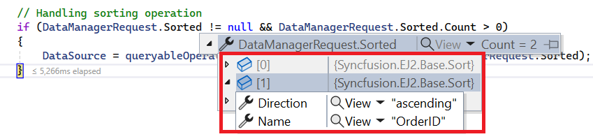
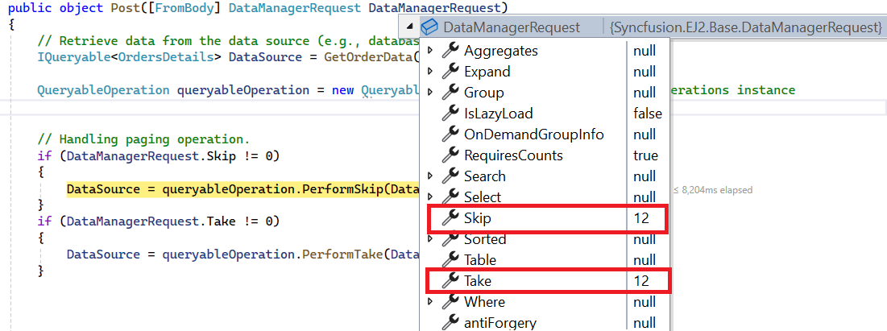

# UrlAdaptor in Syncfusion<sup style="font-size:70%">&reg;</sup> ##Platform_Name## Grid Control

The UrlAdaptor serves as the base adaptor for facilitating communication between remote data services and an UI control. It enables seamless data binding and interaction with custom API services or any remote service through URLs. The UrlAdaptor is particularly useful for the scenarios where a custom API service with unique logic for handling data and CRUD operations is in place. This approach allows for custom handling of data and CRUD operations, and the resultant data returned in the `result` and `count` format for display in the Syncfusion<sup style="font-size:70%">&reg;</sup> ##Platform_Name##  Grid control.

This section describes a step-by-step process for retrieving data using UrlAdaptor, then binding it to the ##Platform_Name## Grid control to facilitate data and CRUD operations.



## Creating an api service

**Step 1:** Set Up Your Development Environment

Before you start, make sure you have the following installed:

- .NET Core SDK
- Node.js
- Visual Studio or any other preferred code editor

**Step 2:** Create a New ASP.NET Core Project

Open Visual Studio and create an ASP.NET Core Web API project named **UrlAdaptor**. 

**Step 3:** Add the Microsoft.TypeScript.MSBuild NuGet package to the project:

In Solution Explorer, right-click the project node and select Manage NuGet Packages. In the Browse tab, search for [Microsoft.TypeScript.MSBuild](https://www.nuget.org/packages/Microsoft.TypeScript.MSBuild/) and then select Install on the right to install the package.

**Step 4:** Configure the server

In `Program.cs`, call `UseDefaultFiles` and `UseStaticFiles`.

```cs
var app = builder.Build();

app.UseDefaultFiles();
app.UseStaticFiles();
```

Comment out the below line in `launchSettings.json`:

```json
    "https": {
      "commandName": "Project",
      "dotnetRunMessages": true,
      "launchBrowser": true,
     // "launchUrl": "swagger",
      "applicationUrl": "https://localhost:xxxx;http://localhost:xxxx",
      "environmentVariables": {
        "ASPNETCORE_ENVIRONMENT": "Development"
      }
    },
```
This configuration enables the server to locate and serve the `index.html` file.

**Step 5:** Model Class Creation

Create a model class named **OrdersDetails.cs** in the **Models** folder to represent the order data.




 namespace UrlAdaptor.Models
 {
 public class OrdersDetails
 {
    public static List<OrdersDetails> order = new List<OrdersDetails>();
    public OrdersDetails()
    {

    }
    public OrdersDetails(
    int OrderID, string CustomerId, int EmployeeId, double Freight, bool Verified,
    DateTime OrderDate, string ShipCity, string ShipName, string ShipCountry,
    DateTime ShippedDate, string ShipAddress)
    {
    this.OrderID = OrderID;
    this.CustomerID = CustomerId;
    this.EmployeeID = EmployeeId;
    this.Freight = Freight;
    this.ShipCity = ShipCity;
    this.Verified = Verified;
    this.OrderDate = OrderDate;
    this.ShipName = ShipName;
    this.ShipCountry = ShipCountry;
    this.ShippedDate = ShippedDate;
    this.ShipAddress = ShipAddress;
    }

    public static List<OrdersDetails> GetAllRecords()
    {
    if (order.Count() == 0)
    {
        int code = 10000;
        for (int i = 1; i < 10; i++)
        {
        order.Add(new OrdersDetails(code + 1, "ALFKI", i + 0, 2.3 * i, false, new DateTime(1991, 05, 15), "Berlin", "Simons bistro", "Denmark", new DateTime(1996, 7, 16), "Kirchgasse 6"));
        order.Add(new OrdersDetails(code + 2, "ANATR", i + 2, 3.3 * i, true, new DateTime(1990, 04, 04), "Madrid", "Queen Cozinha", "Brazil", new DateTime(1996, 9, 11), "Avda. Azteca 123"));
        order.Add(new OrdersDetails(code + 3, "ANTON", i + 1, 4.3 * i, true, new DateTime(1957, 11, 30), "Cholchester", "Frankenversand", "Germany", new DateTime(1996, 10, 7), "Carrera 52 con Ave. Bolívar #65-98 Llano Largo"));
        order.Add(new OrdersDetails(code + 4, "BLONP", i + 3, 5.3 * i, false, new DateTime(1930, 10, 22), "Marseille", "Ernst Handel", "Austria", new DateTime(1996, 12, 30), "Magazinweg 7"));
        order.Add(new OrdersDetails(code + 5, "BOLID", i + 4, 6.3 * i, true, new DateTime(1953, 02, 18), "Tsawassen", "Hanari Carnes", "Switzerland", new DateTime(1997, 12, 3), "1029 - 12th Ave. S."));
        code += 5;
        }
    }
    return order;
    }

    public int? OrderID { get; set; }
    public string? CustomerID { get; set; }
    public int? EmployeeID { get; set; }
    public double? Freight { get; set; }
    public string? ShipCity { get; set; }
    public bool? Verified { get; set; }
    public DateTime OrderDate { get; set; }
    public string? ShipName { get; set; }
    public string? ShipCountry { get; set; }
    public DateTime ShippedDate { get; set; }
    public string? ShipAddress { get; set; }
 }
}




**Step 6:** API Controller Creation

Create a file named `GridController.cs` under the **Controllers** folder. This controller will handle data communication with the Grid control.



using Microsoft.AspNetCore.Http;
using Microsoft.AspNetCore.Mvc;
using UrlAdaptor.Server.Models;

namespace UrlAdaptor.Server.Controllers
{
  [Route("api/[controller]")]
  [ApiController]
  public class GridController : ControllerBase
  {
    [HttpPost]
    public object Post()
    {
      // Retrieve data from the data source (e.g., database)
      IQueryable<OrdersDetails> DataSource = GetOrderData().AsQueryable();

      // Get the total records count
      int totalRecordsCount = DataSource.Count();

      // Return data based on the request
      return new { result = DataSource, count = totalRecordsCount };
    }

    [HttpGet]
    public List<OrdersDetails> GetOrderData()
    {
      var data = OrdersDetails.GetAllRecords().ToList();
      return data;
    }
  }
}



> The **GetOrderData** method retrieves sample order data. You can replace it with your custom logic to fetch data from a database or any other source.

## Connecting syncfusion<sup style="font-size:70%">&reg;</sup> grid to an api service

To integrate the Syncfusion<sup style="font-size:70%">&reg;</sup> Grid control into your ##Platform_Name## and ASP.NET Core project using Visual Studio, follow these steps:

**Step 1:** Create a package.json file:

Run the following command in the project root to create a `package.json` file:

```bash
npm init -y
```

**Step 2:** Install Webpack and Other Dependencies

```bash
npm i -D -E clean-webpack-plugin css-loader html-webpack-plugin mini-css-extract-plugin ts-loader typescript webpack webpack-cli
```

**Step 3:** Configure package.json Scripts

Replace the **scripts** property of `package.json` file with the following code:

```JSON
"scripts": {
  "build": "webpack --mode=development --watch",
  "release": "webpack --mode=production",
  "publish": "npm run release && dotnet publish -c Release"
},
```

**Step 4:** Create wwwroot Folder

Create a folder named `wwwroot` in the project root directory. This folder will contain static files served by the web server.

**Step 5:** Create webpack.config.js

Create a file named `webpack.config.js` in the project root, with the following code to configure the Webpack compilation process:

```js
const path = require("path");
const HtmlWebpackPlugin = require("html-webpack-plugin");
const { CleanWebpackPlugin } = require("clean-webpack-plugin");
const MiniCssExtractPlugin = require("mini-css-extract-plugin");

module.exports = {
    entry: "./src/index.ts",
    output: {
        path: path.resolve(__dirname, "wwwroot"),
        filename: "[name].[chunkhash].js",
        publicPath: "/",
    },
    resolve: {
        extensions: [".js", ".ts"],
    },
    module: {
        rules: [
            {
                test: /\.ts$/,
                use: "ts-loader",
            },
            {
                test: /\.css$/,
                use: [MiniCssExtractPlugin.loader, "css-loader"],
            },
        ],
    },
    plugins: [
        new CleanWebpackPlugin(),
        new HtmlWebpackPlugin({
            template: "./src/index.html",
        }),
        new MiniCssExtractPlugin({
            filename: "css/[name].[chunkhash].css",
        }),
    ],
};
```

**Step 6:** Create a new directory named `src` in the project root for the client code.

**Step 7:** Install Syncfusion<sup style="font-size:70%">&reg;</sup> Packages

Open your terminal in the project’s root folder and install the required Syncfusion<sup style="font-size:70%">&reg;</sup> packages using npm:

```bash
npm install @syncfusion/ej2-grids --save
npm install @syncfusion/ej2-data --save
```

**Step 8:** Create `src/index.html` and add the following code:

```html
<!DOCTYPE html>
<html lang="en">
<head>
    <title>EJ2 Grid</title>
    <meta charset="utf-8" />
    <meta name="viewport" content="width=device-width, initial-scale=1.0" />
    <meta name="description" content="Typescript Grid Control" />
    <meta name="author" content="Syncfusion" />
    <link href="https://cdn.syncfusion.com/ej2/26.1.35/ej2-base/styles/bootstrap5.css" rel="stylesheet" />
    <link href="https://cdn.syncfusion.com/ej2/26.1.35/ej2-grids/styles/bootstrap5.css" rel="stylesheet" />
    <link href="https://cdn.syncfusion.com/ej2/26.1.35/ej2-buttons/styles/bootstrap5.css" rel="stylesheet" />
    <link href="https://cdn.syncfusion.com/ej2/26.1.35/ej2-popups/styles/bootstrap5.css" rel="stylesheet" />
    <link href="https://cdn.syncfusion.com/ej2/26.1.35/ej2-richtexteditor/styles/bootstrap5.css" rel="stylesheet" />
    <link href="https://cdn.syncfusion.com/ej2/26.1.35/ej2-navigations/styles/bootstrap5.css" rel="stylesheet" />
    <link href="https://cdn.syncfusion.com/ej2/26.1.35/ej2-dropdowns/styles/bootstrap5.css" rel="stylesheet" />
    <link href="https://cdn.syncfusion.com/ej2/26.1.35/ej2-lists/styles/bootstrap5.css" rel="stylesheet" />
    <link href="https://cdn.syncfusion.com/ej2/26.1.35/ej2-inputs/styles/bootstrap5.css" rel="stylesheet" />
    <link href="https://cdn.syncfusion.com/ej2/26.1.35/ej2-calendars/styles/bootstrap5.css" rel="stylesheet" />
    <link href="https://cdn.syncfusion.com/ej2/26.1.35/ej2-notifications/styles/bootstrap5.css" rel="stylesheet" />
    <link href="https://cdn.syncfusion.com/ej2/26.1.35/ej2-splitbuttons/styles/bootstrap5.css" rel="stylesheet" />

    <script src="https://cdnjs.cloudflare.com/ajax/libs/systemjs/0.19.38/system.js"></script>

    <script src="https://cdn.syncfusion.com/ej2/syncfusion-helper.js" type="text/javascript"></script>
</head>
<body>
    <div id='container'>
        <div id='Grid'></div>
    </div>
</body>
</html>
```

**Step 9:** Create `src/index.ts` and add the following code:

```ts
import { Grid } from '@syncfusion/ej2-grids';
import { DataManager, UrlAdaptor } from '@syncfusion/ej2-data';

let data: DataManager = new DataManager({
    url: 'https://localhost:xxxx/api/Grid',
    adaptor: new UrlAdaptor()
});

let grid: Grid = new Grid({
    dataSource: data,
    columns: [
        { field: 'OrderID', headerText: 'Order ID', textAlign: 'Right', width: 120, isPrimaryKey: true, type: 'number' },
        { field: 'CustomerID', width: 140, headerText: 'Customer ID', type: 'string' },
        { field: 'ShipCity', headerText: 'ShipCity', width: 140 },
        { field: 'ShipCountry', headerText: 'ShipCountry', width: 140 }
    ]
});

grid.appendTo('#Grid');
```

**Step 10:** Create `src/tsconfig.json` in the project and add the following content:

```json
{
  "compilerOptions": {
    "noImplicitAny": true,
    "noEmitOnError": true,
    "removeComments": false,
    "sourceMap": true,
    "target": "es5"
  },
  "exclude": [
    "node_modules",
    "wwwroot"
  ]
}
```

**Step 11:** Install additional packages and build the project

```bash
npm i @types/node
npm run build
```

**Step 12:** Run the project

Run the project in Visual Studio.

The `wwwroot/index.html` file is served at **https://localhost:xxxx**.

With these steps, you have integrated the Syncfusion<sup style="font-size:70%">&reg;</sup> Grid control with your ASP.NET Core project and set up the necessary client-side configuration using Webpack and ##Platform_Name##. This will allow the Syncfusion<sup style="font-size:70%">&reg;</sup> Grid to fetch data from your API and display it accordingly.



## Creating an api service

**Step 1:** Create a New ASP.NET Core Project

To create a new ASP.NET Core Web API project named UrlAdaptor, follow these steps:

* Open Visual Studio.
* Select "Create a new project"
* Choose **ASP.NET Core Web API** project template.
* Name the project **UrlAdaptor**.
* Click "Create"

**Step 2:** Configure the server

In the `Program.cs` file of your project, configure the server to serve static files by adding the following code:

```cs
var app = builder.Build();

app.UseDefaultFiles();
app.UseStaticFiles();
```

Additionally, comment out the following line in the `launchSettings.json` file:

```json
    "https": {
      "commandName": "Project",
      "dotnetRunMessages": true,
      "launchBrowser": true,
     // "launchUrl": "swagger",
      "applicationUrl": "https://localhost:xxxx;http://localhost:xxxx",
      "environmentVariables": {
        "ASPNETCORE_ENVIRONMENT": "Development"
      }
    },
```
This configuration enables the server to locate and serve the index.html file.

**Step 3:** Model Class Creation

Create a model class named **OrdersDetails.cs** in the **Models** folder to represent the order data.




 namespace UrlAdaptor.Models
 {
 public class OrdersDetails
 {
    public static List<OrdersDetails> order = new List<OrdersDetails>();
    public OrdersDetails()
    {

    }
    public OrdersDetails(
    int OrderID, string CustomerId, int EmployeeId, double Freight, bool Verified,
    DateTime OrderDate, string ShipCity, string ShipName, string ShipCountry,
    DateTime ShippedDate, string ShipAddress)
    {
    this.OrderID = OrderID;
    this.CustomerID = CustomerId;
    this.EmployeeID = EmployeeId;
    this.Freight = Freight;
    this.ShipCity = ShipCity;
    this.Verified = Verified;
    this.OrderDate = OrderDate;
    this.ShipName = ShipName;
    this.ShipCountry = ShipCountry;
    this.ShippedDate = ShippedDate;
    this.ShipAddress = ShipAddress;
    }

    public static List<OrdersDetails> GetAllRecords()
    {
    if (order.Count() == 0)
    {
        int code = 10000;
        for (int i = 1; i < 10; i++)
        {
        order.Add(new OrdersDetails(code + 1, "ALFKI", i + 0, 2.3 * i, false, new DateTime(1991, 05, 15), "Berlin", "Simons bistro", "Denmark", new DateTime(1996, 7, 16), "Kirchgasse 6"));
        order.Add(new OrdersDetails(code + 2, "ANATR", i + 2, 3.3 * i, true, new DateTime(1990, 04, 04), "Madrid", "Queen Cozinha", "Brazil", new DateTime(1996, 9, 11), "Avda. Azteca 123"));
        order.Add(new OrdersDetails(code + 3, "ANTON", i + 1, 4.3 * i, true, new DateTime(1957, 11, 30), "Cholchester", "Frankenversand", "Germany", new DateTime(1996, 10, 7), "Carrera 52 con Ave. Bolívar #65-98 Llano Largo"));
        order.Add(new OrdersDetails(code + 4, "BLONP", i + 3, 5.3 * i, false, new DateTime(1930, 10, 22), "Marseille", "Ernst Handel", "Austria", new DateTime(1996, 12, 30), "Magazinweg 7"));
        order.Add(new OrdersDetails(code + 5, "BOLID", i + 4, 6.3 * i, true, new DateTime(1953, 02, 18), "Tsawassen", "Hanari Carnes", "Switzerland", new DateTime(1997, 12, 3), "1029 - 12th Ave. S."));
        code += 5;
        }
    }
    return order;
    }

    public int? OrderID { get; set; }
    public string? CustomerID { get; set; }
    public int? EmployeeID { get; set; }
    public double? Freight { get; set; }
    public string? ShipCity { get; set; }
    public bool? Verified { get; set; }
    public DateTime OrderDate { get; set; }
    public string? ShipName { get; set; }
    public string? ShipCountry { get; set; }
    public DateTime ShippedDate { get; set; }
    public string? ShipAddress { get; set; }
 }
}




**Step 4:** API Controller Creation

Create a file named `GridController.cs` under the **Controllers** folder. This controller will handle data communication with the Grid control.




using Microsoft.AspNetCore.Http;
using Microsoft.AspNetCore.Mvc;
using UrlAdaptor.Models;

namespace UrlAdaptor.Controllers
{
  [ApiController]
  public class GridController : ControllerBase
  {
    
    // method to retrieve data
    [HttpGet]
    [Route("api/[controller]")]
    public List<OrdersDetails> GetOrderData()
    {
        // Retrieve all records and convert to list
        var data = OrdersDetails.GetAllRecords().ToList();
        return data;
    }

     // method to handle incoming data manager requests
    [HttpPost]
    [Route("api/[controller]")]
    public object Post()
    {
        // Retrieve data source and convert to queryable
        IQueryable<OrdersDetails> DataSource = GetOrderData().AsQueryable();

        // Get total record count
        int totalRecordsCount = DataSource.Count();

        // Return result and total record count
        return new { result = DataSource, count = totalRecordsCount };
    }
  }
}




> The **GetOrderData** method retrieves sample order data. You can replace it with your custom logic to fetch data from a database or any other source.

## Connecting syncfusion<sup style="font-size:70%">&reg;</sup> grid to an api service

**Step 1:** Create wwwroot folder

Create a folder named `wwwroot` in the project root directory. This folder will contain static files served by the web server.

**Step 2:** Create JS and CSS Folders

Inside the wwwroot folder, create js and css folders to hold script and CSS files, respectively.

**Step 3:** Create index.html File

Create an `index.html` file under the `wwwroot` folder and add the necessary HTML structure along with CSS and JavaScript links to include Syncfusion<sup style="font-size:70%">&reg;</sup> Grid dependencies.

```html
<!DOCTYPE html>
<html lang="en">
<head>
    <title>EJ2 Grid</title>
    <meta charset="utf-8">
    <meta name="viewport" content="width=device-width, initial-scale=1.0">
    <meta name="description" content="Javascript Grid Control">
    <meta name="author" content="Syncfusion">
    <link href="css/index.css" rel="stylesheet">
    <link href="https://cdn.syncfusion.com/ej2/26.1.35/ej2-base/styles/bootstrap5.css" rel="stylesheet">
    <link href="https://cdn.syncfusion.com/ej2/26.1.35/ej2-grids/styles/bootstrap5.css" rel="stylesheet">
    <link href="https://cdn.syncfusion.com/ej2/26.1.35/ej2-buttons/styles/bootstrap5.css" rel="stylesheet">
    <link href="https://cdn.syncfusion.com/ej2/26.1.35/ej2-popups/styles/bootstrap5.css" rel="stylesheet">
    <link href="https://cdn.syncfusion.com/ej2/26.1.35/ej2-richtexteditor/styles/bootstrap5.css" rel="stylesheet">
    <link href="https://cdn.syncfusion.com/ej2/26.1.35/ej2-navigations/styles/bootstrap5.css" rel="stylesheet">
    <link href="https://cdn.syncfusion.com/ej2/26.1.35/ej2-dropdowns/styles/bootstrap5.css" rel="stylesheet">
    <link href="https://cdn.syncfusion.com/ej2/26.1.35/ej2-lists/styles/bootstrap5.css" rel="stylesheet">
    <link href="https://cdn.syncfusion.com/ej2/26.1.35/ej2-inputs/styles/bootstrap5.css" rel="stylesheet">
    <link href="https://cdn.syncfusion.com/ej2/26.1.35/ej2-calendars/styles/bootstrap5.css" rel="stylesheet">
    <link href="https://cdn.syncfusion.com/ej2/26.1.35/ej2-notifications/styles/bootstrap5.css" rel="stylesheet">
    <link href="https://cdn.syncfusion.com/ej2/26.1.35/ej2-splitbuttons/styles/bootstrap5.css" rel="stylesheet">

    <script src="https://cdn.syncfusion.com/ej2/26.1.35/dist/ej2.min.js" type="text/javascript"></script>
    <script src="https://cdn.syncfusion.com/ej2/syncfusion-helper.js" type="text/javascript"></script>
</head>
<body>

    <div id="container">
        <div id="Grid"></div>
    </div>
    <script src="js/index.js" type="text/javascript"></script>
</body>
</html>
```

**Step 4:** Create JavaScript File

Create a index.js file under the `wwwroot/js` folder and add the JavaScript code to initialize the Syncfusion<sup style="font-size:70%">&reg;</sup> Grid with data from the API service.

```js
var data = new ej.data.DataManager({
    url: 'https://localhost:xxxx/api/Grid', // Here xxxx represents the port number
    adaptor: new ej.data.UrlAdaptor()
});

var grid = new ej.grids.Grid({
    dataSource: data,

    columns: [
        { field: 'OrderID', headerText: 'Order ID', textAlign: 'Right', width: 120, isPrimaryKey: true, type: 'number' },
        { field: 'CustomerID', width: 140, headerText: 'Customer ID', type: 'string' },
        { field: 'ShipCity', headerText: 'ShipCity', width: 140 },
        { field: 'ShipCountry', headerText: 'ShipCountry', width: 140 }
    ]
});

grid.appendTo('#Grid');
```

**Step 5:** Run the Project

Now, run the project to see the Syncfusion<sup style="font-size:70%">&reg;</sup> Grid connected to the API service in action.



> * The Syncfusion<sup style="font-size:70%">&reg;</sup> Grid control provides built-in support for handling various data operations such as searching, sorting, filtering, aggregate and paging on the server-side. These operations can be handled using methods such as [PerformSearching](https://help.syncfusion.com/cr/aspnetmvc-js2/Syncfusion.EJ2.Base.QueryableOperation.html#Syncfusion_EJ2_Base_QueryableOperation_PerformSearching__1_System_Linq_IQueryable___0__System_Collections_Generic_List_Syncfusion_EJ2_Base_SearchFilter__), [PerformFiltering](https://help.syncfusion.com/cr/aspnetmvc-js2/Syncfusion.EJ2.Base.QueryableOperation.html#Syncfusion_EJ2_Base_QueryableOperation_PerformFiltering__1_System_Linq_IQueryable___0__System_Collections_Generic_List_Syncfusion_EJ2_Base_WhereFilter__System_String_), [PerformSorting](https://help.syncfusion.com/cr/aspnetmvc-js2/Syncfusion.EJ2.Base.QueryableOperation.html#Syncfusion_EJ2_Base_QueryableOperation_PerformSorting__1_System_Linq_IQueryable___0__System_Collections_Generic_List_Syncfusion_EJ2_Base_Sort__), [PerformTake](https://help.syncfusion.com/cr/aspnetmvc-js2/Syncfusion.EJ2.Base.QueryableOperation.html#Syncfusion_EJ2_Base_QueryableOperation_PerformTake__1_System_Linq_IQueryable___0__System_Int32_) and [PerformSkip](https://help.syncfusion.com/cr/aspnetmvc-js2/Syncfusion.EJ2.Base.QueryableOperation.html#Syncfusion_EJ2_Base_QueryableOperation_PerformSkip__1_System_Linq_IQueryable___0__System_Int32_) available in the `Syncfusion.EJ2.AspNet.Core` package. Let’s explore how to manage these data operations using the `UrlAdaptor`.
> * In an API service project, add `Syncfusion.EJ2.AspNet.Core` by opening the NuGet package manager in Visual Studio (Tools → NuGet Package Manager → Manage NuGet Packages for Solution), search and install it.
> * To access [DataManagerRequest](https://help.syncfusion.com/cr/aspnetmvc-js2/Syncfusion.EJ2.Base.DataManagerRequest.html) and [QueryableOperation](https://help.syncfusion.com/cr/aspnetmvc-js2/Syncfusion.EJ2.Base.QueryableOperation.html), import `Syncfusion.EJ2.Base` in `GridController.cs` file.
> * In the UrlAdaptor configuration, the properties of the DataManager object are encapsulated within an object named **value**. To access the DataManager properties, a dedicated class is created, representing the **value** object.
    ```cs
    // Model for handling data manager requests
    public class DataManager
    {
        public required DataManagerRequest Value { get; set; }
    }
    ```

## Handling searching operation

To handle searching operation, ensure that your API endpoint supports custom searching criteria. Implement the searching logic on the server-side using the [PerformSearching](https://help.syncfusion.com/cr/aspnetmvc-js2/Syncfusion.EJ2.Base.QueryableOperation.html#Syncfusion_EJ2_Base_QueryableOperation_PerformSearching__1_System_Linq_IQueryable___0__System_Collections_Generic_List_Syncfusion_EJ2_Base_SearchFilter__) method from the [QueryableOperation](https://help.syncfusion.com/cr/aspnetmvc-js2/Syncfusion.EJ2.Base.QueryableOperation.html) class. This allows the custom data source to undergo searching based on the criteria specified in the incoming [DataManagerRequest](https://help.syncfusion.com/cr/aspnetmvc-js2/Syncfusion.EJ2.Base.DataManagerRequest.html) object




[HttpPost]
public object Post([FromBody] DataManagerRequest DataManagerRequest)
{
  // Retrieve data from the data source (e.g., database)
  IQueryable<OrdersDetails> DataSource = GetOrderData().AsQueryable();
  QueryableOperation queryableOperation = new QueryableOperation(); // Initialize QueryableOperation instance

  // Handling Searching
  if (DataManagerRequest.Search != null && DataManagerRequest.Search.Count > 0)
  {
      DataSource = queryableOperation.PerformSearching(DataSource, DataManagerRequest.Search);
  }
  // Get the total records count
  int totalRecordsCount = DataSource.Count();

  // Return data based on the request
  return new { result = DataSource, count = totalRecordsCount };
}



import { Grid, Toolbar } from '@syncfusion/ej2-grids';
import { DataManager, UrlAdaptor } from '@syncfusion/ej2-data';

Grid.Inject(Toolbar);

let data: DataManager = new DataManager({
    url: 'https://localhost:xxxx/api/Grid',
    adaptor: new UrlAdaptor()
});

let grid: Grid = new Grid({
    dataSource: data,
    toolbar: ['Search'],
    columns: [
        { field: 'OrderID', headerText: 'Order ID', textAlign: 'Right', width: 120, isPrimaryKey: true, type: 'number' },
        { field: 'CustomerID', width: 140, headerText: 'Customer ID', type: 'string' },
        { field: 'ShipCity', headerText: 'ShipCity', width: 140 },
        { field: 'ShipCountry', headerText: 'ShipCountry', width: 140 }
    ]
});

grid.appendTo('#Grid');



ej.grids.Grid.Inject(ej.grids.Toolbar);

var data = new ej.data.DataManager({
    url: 'https://localhost:xxxx/api/Grid',
    adaptor: new ej.data.UrlAdaptor()
});

var grid = new ej.grids.Grid({
    dataSource: data,
    toolbar: ['Search'],
    columns: [
                { field: 'OrderID', headerText: 'Order ID', textAlign: 'Right', width: 120, type: 'number' },
                { field: 'CustomerID', width: 140, headerText: 'Customer ID', type: 'string' },
                { field: 'ShipCity', headerText: 'ShipCity', width: 140 },
                { field: 'ShipCountry', headerText: 'ShipCountry', width: 140 }
    ]
});

grid.appendTo('#Grid');




## Handling filtering operation

To handle filtering operation, ensure that your API endpoint supports custom filtering criteria. Implement the filtering logic on the server-side using the [PerformFiltering](https://help.syncfusion.com/cr/aspnetmvc-js2/Syncfusion.EJ2.Base.QueryableOperation.html#Syncfusion_EJ2_Base_QueryableOperation_PerformFiltering__1_System_Linq_IQueryable___0__System_Collections_Generic_List_Syncfusion_EJ2_Base_WhereFilter__System_String_) method from the [QueryableOperation](https://help.syncfusion.com/cr/aspnetmvc-js2/Syncfusion.EJ2.Base.QueryableOperation.html) class. This allows the custom data source to undergo filtering based on the criteria specified in the incoming [DataManagerRequest](https://help.syncfusion.com/cr/aspnetmvc-js2/Syncfusion.EJ2.Base.DataManagerRequest.html) object.

**Single column filtering**


**Multi column filtering**




[HttpPost]
public object Post([FromBody] DataManagerRequest DataManagerRequest)
{
  // Retrieve data from the data source (e.g., database)
  IQueryable<OrdersDetails> DataSource = GetOrderData().AsQueryable();

  QueryableOperation queryableOperation = new QueryableOperation(); // Initialize QueryableOperation instance

  if (DataManagerRequest.Where != null && DataManagerRequest.Where.Count > 0)
  {
    // Handling filtering operation
    foreach (var condition in DataManagerRequest.Where)
    {
      foreach (var predicate in condition.predicates)
      {
        DataSource = queryableOperation.PerformFiltering(DataSource, DataManagerRequest.Where, predicate.Operator);
      }
    }
  }
  // Get the total records count
  int totalRecordsCount = DataSource.Count();

  // Return data based on the request
  return new { result = DataSource, count = totalRecordsCount };
}



import { Grid, Filter } from '@syncfusion/ej2-grids';
import { DataManager, UrlAdaptor } from '@syncfusion/ej2-data';

Grid.Inject(Filter);

let data: DataManager = new DataManager({
    url: 'https://localhost:xxxx/api/Grid',
    adaptor: new UrlAdaptor()
});

let grid: Grid = new Grid({
    dataSource: data,
    allowFiltering: true,
    columns: [
        { field: 'OrderID', headerText: 'Order ID', textAlign: 'Right', width: 120, isPrimaryKey: true, type: 'number' },
        { field: 'CustomerID', width: 140, headerText: 'Customer ID', type: 'string' },
        { field: 'ShipCity', headerText: 'ShipCity', width: 140 },
        { field: 'ShipCountry', headerText: 'ShipCountry', width: 140 }
    ]
});

grid.appendTo('#Grid');



ej.grids.Grid.Inject(ej.grids.Filter);

var data = new ej.data.DataManager({
    url: 'https://localhost:xxxx/api/Grid',
    adaptor: new ej.data.UrlAdaptor()
});

var grid = new ej.grids.Grid({
    dataSource: data,
    allowFiltering: true,
    columns: [
                { field: 'OrderID', headerText: 'Order ID', textAlign: 'Right', width: 120, type: 'number' },
                { field: 'CustomerID', width: 140, headerText: 'Customer ID', type: 'string' },
                { field: 'ShipCity', headerText: 'ShipCity', width: 140 },
                { field: 'ShipCountry', headerText: 'ShipCountry', width: 140 }
    ]
});

grid.appendTo('#Grid');




## Handling sorting operation

To handle sorting operation, ensure that your API endpoint supports custom sorting criteria. Implement the sorting logic on the server-side using the [PerformSorting](https://help.syncfusion.com/cr/aspnetmvc-js2/Syncfusion.EJ2.Base.QueryableOperation.html#Syncfusion_EJ2_Base_QueryableOperation_PerformSorting__1_System_Linq_IQueryable___0__System_Collections_Generic_List_Syncfusion_EJ2_Base_Sort__) method from the [QueryableOperation](https://help.syncfusion.com/cr/aspnetmvc-js2/Syncfusion.EJ2.Base.QueryableOperation.html) class. This allows the custom data source to undergo sorting based on the criteria specified in the incoming [DataManagerRequest](https://help.syncfusion.com/cr/aspnetmvc-js2/Syncfusion.EJ2.Base.DataManagerRequest.html) object.

**Single column sorting**


**Multi column sorting**




[HttpPost]
public object Post([FromBody] DataManagerRequest DataManagerRequest)
{
  // Retrieve data from the data source (e.g., database)
  IQueryable<OrdersDetails> DataSource = GetOrderData().AsQueryable();

  QueryableOperation queryableOperation = new QueryableOperation(); // Initialize QueryableOperation instance

  // Handling Sorting operation
  if (DataManagerRequest.Sorted != null && DataManagerRequest.Sorted.Count > 0)
  {
    DataSource = queryableOperation.PerformSorting(DataSource, DataManagerRequest.Sorted);
  }

  // Get the total count of records
  int totalRecordsCount = DataSource.Count();

  // Return data based on the request
  return new { result = DataSource, count = totalRecordsCount };
}



import { Grid, Sort } from '@syncfusion/ej2-grids';
import { DataManager, UrlAdaptor } from '@syncfusion/ej2-data';

Grid.Inject(Sort);

let data: DataManager = new DataManager({
    url: 'https://localhost:xxxx/api/Grid',
    adaptor: new UrlAdaptor()
});

let grid: Grid = new Grid({
    dataSource: data,
    allowSorting: true,
    columns: [
        { field: 'OrderID', headerText: 'Order ID', textAlign: 'Right', width: 120, isPrimaryKey: true, type: 'number' },
        { field: 'CustomerID', width: 140, headerText: 'Customer ID', type: 'string' },
        { field: 'ShipCity', headerText: 'ShipCity', width: 140 },
        { field: 'ShipCountry', headerText: 'ShipCountry', width: 140 }
    ]
});

grid.appendTo('#Grid');



ej.grids.Grid.Inject(ej.grids.Sort);

var data = new ej.data.DataManager({
    url: 'https://localhost:xxxx/api/Grid',
    adaptor: new ej.data.UrlAdaptor()
});

var grid = new ej.grids.Grid({
    dataSource: data,
    allowSorting: true,
    columns: [
                { field: 'OrderID', headerText: 'Order ID', textAlign: 'Right', width: 120, type: 'number' },
                { field: 'CustomerID', width: 140, headerText: 'Customer ID', type: 'string' },
                { field: 'ShipCity', headerText: 'ShipCity', width: 140 },
                { field: 'ShipCountry', headerText: 'ShipCountry', width: 140 }
    ]
});

grid.appendTo('#Grid');




## Handling paging operation

To handle paging operation, ensure that your API endpoint supports custom paging criteria. Implement the paging logic on the server-side using the [PerformTake](https://help.syncfusion.com/cr/aspnetmvc-js2/Syncfusion.EJ2.Base.QueryableOperation.html#Syncfusion_EJ2_Base_QueryableOperation_PerformTake__1_System_Linq_IQueryable___0__System_Int32_) and [PerformSkip](https://help.syncfusion.com/cr/aspnetmvc-js2/Syncfusion.EJ2.Base.QueryableOperation.html#Syncfusion_EJ2_Base_QueryableOperation_PerformSkip__1_System_Linq_IQueryable___0__System_Int32_) method from the [QueryableOperation](https://help.syncfusion.com/cr/aspnetmvc-js2/Syncfusion.EJ2.Base.QueryableOperation.html) class. This allows the custom data source to undergo paging based on the criteria specified in the incoming [DataManagerRequest](https://help.syncfusion.com/cr/aspnetmvc-js2/Syncfusion.EJ2.Base.DataManagerRequest.html) object.





[HttpPost]
public object Post([FromBody] DataManager DataManagerRequest)
{
    // Retrieve data from the data source (e.g., database)
    IQueryable<OrdersDetails> DataSource = GetOrderData().AsQueryable();

    // Get the total records count
    int totalRecordsCount = DataSource.Count();

    QueryableOperation queryableOperation = new QueryableOperation(); // Initialize QueryableOperation instance

    // Retrieve data manager value
    DataManagerRequest DataManagerParams = DataManagerRequest.Value;

    // Handling paging operation.
    if (DataManagerParams.Skip != 0)
    {
        // Paging
        DataSource = queryableOperation.PerformSkip(DataSource, DataManagerParams.Skip);
    }
    if (DataManagerParams.Take != 0)
    {
        DataSource = queryableOperation.PerformTake(DataSource, DataManagerParams.Take);
    }

    // Return data based on the request
    return new { result = DataSource, count = totalRecordsCount };
}

// Model for handling data manager requests
public class DataManager
{
    public required DataManagerRequest Value { get; set; }
}



import { Grid, Page } from '@syncfusion/ej2-grids';
import { DataManager, UrlAdaptor } from '@syncfusion/ej2-data';

Grid.Inject(Page);

let data: DataManager = new DataManager({
    url: 'https://localhost:xxxx/api/Grid',
    adaptor: new UrlAdaptor()
});

let grid: Grid = new Grid({
    dataSource: data,
    allowPaging: true,
    columns: [
        { field: 'OrderID', headerText: 'Order ID', textAlign: 'Right', width: 120, isPrimaryKey: true, type: 'number' },
        { field: 'CustomerID', width: 140, headerText: 'Customer ID', type: 'string' },
        { field: 'ShipCity', headerText: 'ShipCity', width: 140 },
        { field: 'ShipCountry', headerText: 'ShipCountry', width: 140 }
    ]
});

grid.appendTo('#Grid');



ej.grids.Grid.Inject(ej.grids.Page);
var data = new ej.data.DataManager({
    url: 'https://localhost:xxxx/api/Grid',
    adaptor: new ej.data.UrlAdaptor()
});

var grid = new ej.grids.Grid({
    dataSource: data,
    allowPaging: true,
    columns: [
                { field: 'OrderID', headerText: 'Order ID', textAlign: 'Right', width: 120, type: 'number' },
                { field: 'CustomerID', width: 140, headerText: 'Customer ID', type: 'string' },
                { field: 'ShipCity', headerText: 'ShipCity', width: 140 },
                { field: 'ShipCountry', headerText: 'ShipCountry', width: 140 }
    ]
});

grid.appendTo('#Grid');





> You can find the complete sample for the UrlAdaptor in [GitHub](https://github.com/SyncfusionExamples/Binding-data-from-remote-service-to-typescript-data-grid) link.

> You can find the complete sample for the UrlAdaptor in [GitHub](https://github.com/SyncfusionExamples/Binding-data-from-remote-service-to-javascript-data-grid) link.


## Handling CRUD operations

The Syncfusion<sup style="font-size:70%">&reg;</sup> ##Platform_Name## Grid Control seamlessly integrates CRUD (Create, Read, Update, Delete) operations with server-side controller actions through specific properties: [insertUrl](https://help.syncfusion.com/cr/aspnetmvc-js2/Syncfusion.EJ2.DataManager.html#Syncfusion_EJ2_DataManager_InsertUrl), [removeUrl](https://help.syncfusion.com/cr/aspnetmvc-js2/Syncfusion.EJ2.DataManager.html#Syncfusion_EJ2_DataManager_RemoveUrl), [updateUrl](https://help.syncfusion.com/cr/aspnetmvc-js2/Syncfusion.EJ2.DataManager.html#Syncfusion_EJ2_DataManager_UpdateUrl), [crudUrl](https://help.syncfusion.com/cr/aspnetmvc-js2/Syncfusion.EJ2.DataManager.html#Syncfusion_EJ2_DataManager_CrudUrl), and [batchUrl](https://help.syncfusion.com/cr/aspnetmvc-js2/Syncfusion.EJ2.DataManager.html#Syncfusion_EJ2_DataManager_BatchUrl). These properties enable the grid to communicate with the data service for every grid action, facilitating server-side operations.

**CRUD Operations Mapping**

CRUD operations within the grid can be mapped to server-side controller actions using specific properties:

1. **insertUrl**: Specifies the URL for inserting new data.
2. **removeUrl**: Specifies the URL for removing existing data.
3. **updateUrl**: Specifies the URL for updating existing data.
4. **crudUrl**: Specifies a single URL for all CRUD operations.
5. **batchUrl**: Specifies the URL for batch editing.

To enable editing in ##Platform_Name## Grid control, refer to the editing [documentation](../editing/edit). In the below example, the inline edit [mode](../../api/grid/editSettings/#mode) is enabled and [toolbar](../../api/grid/#toolbar) property is configured to display toolbar items for editing purposes.




import { Grid, Edit, Toolbar } from '@syncfusion/ej2-grids';
import { DataManager, UrlAdaptor } from '@syncfusion/ej2-data';

Grid.Inject(Edit, Toolbar);

let data: DataManager = new DataManager({
    url: 'https://localhost:xxxx/api/Grid',
    insertUrl: 'https://localhost:xxxx/api/Grid/Insert',
    updateUrl: 'https://localhost:xxxx/api/Grid/Update',
    removeUrl: 'https://localhost:xxxx/api/Grid/Remove',
    adaptor: new UrlAdaptor()
});

let grid: Grid = new Grid({
    dataSource: data,
    toolbar: ['Add', 'Edit', 'Delete', 'Update', 'Cancel'],
    editSettings: { allowEditing: true, allowAdding: true, allowDeleting: true, mode: 'Normal' },
    columns: [
        { field: 'OrderID', headerText: 'Order ID', textAlign: 'Right', width: 120, isPrimaryKey: true, type: 'number' },
        { field: 'CustomerID', width: 140, headerText: 'Customer ID', type: 'string' },
        { field: 'ShipCity', headerText: 'ShipCity', width: 140 },
        { field: 'ShipCountry', headerText: 'ShipCountry', width: 140 }
    ]
});

grid.appendTo('#Grid');



ej.grids.Grid.Inject(ej.grids.Toolbar, ej.grids.Edit);

var data = new ej.data.DataManager({
    url: 'https://localhost:xxxx/api/Grid', // Here xxxx represents the port number
    insertUrl: 'https://localhost:xxxx/api/grid/Insert',
    updateUrl: 'https://localhost:xxxx/api/grid/Update',
    removeUrl: 'https://localhost:xxxx/api/grid/Remove',
    adaptor: new ej.data.UrlAdaptor()
});

var grid = new ej.grids.Grid({
    dataSource: data,
    toolbar: ['Add', 'Edit', 'Delete', 'Update', 'Cancel'],
    editSettings: { allowEditing: true, allowAdding: true, allowDeleting: true, mode: 'Normal' },
    columns: [
        { field: 'OrderID', headerText: 'Order ID', textAlign: 'Right', width: 120, isPrimaryKey: true, type: 'number' },
        { field: 'CustomerID', width: 140, headerText: 'Customer ID', type: 'string' },
        { field: 'ShipCity', headerText: 'ShipCity', width: 140 },
        { field: 'ShipCountry', headerText: 'ShipCountry', width: 140 }
    ]
});

grid.appendTo('#Grid');




> Normal/Inline editing is the default edit [mode](../../api/grid/editSettings/#mode) for the Grid control. To enable CRUD operations, ensure that the [isPrimaryKey](../../api/grid/column/#isprimarykey) property is set to **true** for a specific Grid column, ensuring that its value is unique.

The below class is used to structure data sent during CRUD operations.

```cs
public class CRUDModel<T> where T : class
{
  public string? action { get; set; }
  public string? keyColumn { get; set; }
  public object? key { get; set; }
  public T? value { get; set; }
  public List<T>? added { get; set; }
  public List<T>? changed { get; set; }
  public List<T>? deleted { get; set; }
  public IDictionary<string, object>? @params { get; set; }
}
```

**Insert operation:**

To insert a new record, utilize the [insertUrl](https://help.syncfusion.com/cr/aspnetmvc-js2/Syncfusion.EJ2.DataManager.html#Syncfusion_EJ2_DataManager_InsertUrl) property to specify the controller action mapping URL for the insert operation. The newly added record details are bound to the **newRecord** parameter.


```cs

/// <summary>
/// Inserts a new data item into the data collection.
/// </summary>
/// <param name="newRecord">It contains the new record detail which is need to be inserted.</param>
/// <returns>Returns void</returns>
[HttpPost]
[Route("api/[controller]/Insert")]
public void Insert([FromBody] CRUDModel<OrdersDetails> newRecord)
{
    // Check if new record is not null
    if (newRecord.value != null)
    {
        // Insert new record
        OrdersDetails.GetAllRecords().Insert(0, newRecord.value);
    }
}
```

**Update operation:**

For updating existing records, utilize the [updateUrl](https://help.syncfusion.com/cr/aspnetmvc-js2/Syncfusion.EJ2.DataManager.html#Syncfusion_EJ2_DataManager_UpdateUrl) property to specify the controller action mapping URL for the update operation. The updated record details are bound to the **updatedRecord** parameter.


```cs

/// <summary>
/// Update a existing data item from the data collection.
/// </summary>
/// <param name="updatedRecord">It contains the updated record detail which is need to be updated.</param>
/// <returns>Returns void</returns>
[HttpPost]
[Route("api/[controller]/Update")]
public void Update([FromBody] CRUDModel<OrdersDetails> updatedRecord)
{
    // Retrieve updated order
    var updatedOrder = updatedRecord.value;
    if (updatedOrder != null)
    {
        // Find existing record
        var data = OrdersDetails.GetAllRecords().FirstOrDefault(or => or.OrderID == updatedOrder.OrderID);
        if (data != null)
        {
            // Update existing record
            data.OrderID = updatedOrder.OrderID;
            data.CustomerID = updatedOrder.CustomerID;
            data.ShipCity = updatedOrder.ShipCity;
            data.ShipCountry = updatedOrder.ShipCountry;
            // Update other properties similarly
        }
    }
}
```

**Delete operation**

To delete existing records, use the [removeUrl](https://help.syncfusion.com/cr/aspnetmvc-js2/Syncfusion.EJ2.DataManager.html#Syncfusion_EJ2_DataManager_RemoveUrl) property to specify the controller action mapping URL for the delete operation. The primary key value of the deleted record is bound to the **deletedRecord** parameter.


```cs
/// <summary>
/// Remove a specific data item from the data collection.
/// </summary>
/// <param name="deletedRecord">It contains the specific record detail which is need to be removed.</param>
/// <return>Returns void</return>
[HttpPost]
[Route("api/[controller]/Remove")]
public void Remove([FromBody] CRUDModel<OrdersDetails> deletedRecord)
{
    int orderId = int.Parse(deletedRecord.key.ToString()); // get key value from the deletedRecord
    var data = OrdersDetails.GetAllRecords().FirstOrDefault(orderData => orderData.OrderID == orderId);
    if (data != null)
    {
        // Remove the record from the data collection
        OrdersDetails.GetAllRecords().Remove(data);
    }
}
```


**Single method for performing all CRUD operations**

Using the `crudUrl` property, the controller action mapping URL can be specified to perform all the CRUD operation at server-side using a single method instead of specifying separate controller action method for CRUD (insert, update and delete) operations.

The following code example describes the above behavior.


```ts
import { Grid, Edit, Toolbar } from '@syncfusion/ej2-grids';
import { DataManager, UrlAdaptor } from '@syncfusion/ej2-data';

Grid.Inject(Edit, Toolbar);

let data: DataManager = new DataManager({
    url: 'https://localhost:xxxx/api/Grid', // Replace your hosted link
    crudUrl:'https://localhost:xxxx/api/grid/CrudUpdate',
    adaptor: new UrlAdaptor()
});

let grid: Grid = new Grid({
    dataSource: data,
    toolbar: ['Add', 'Edit', 'Delete', 'Update', 'Cancel'],
    editSettings: { allowEditing: true, allowAdding: true, allowDeleting: true, mode: 'Normal' },
    columns: [
        { field: 'OrderID', headerText: 'Order ID', textAlign: 'Right', width: 120, isPrimaryKey: true, type: 'number' },
        { field: 'CustomerID', width: 140, headerText: 'Customer ID', type: 'string' },
        { field: 'ShipCity', headerText: 'ShipCity', width: 140 },
        { field: 'ShipCountry', headerText: 'ShipCountry', width: 140 }
    ]
});

grid.appendTo('#Grid');
```


```js
ej.grids.Grid.Inject(ej.grids.Toolbar, ej.grids.Edit);

var data = new ej.data.DataManager({
    url: 'https://localhost:xxxx/api/Grid', // Here xxxx represents the port number
    crudUrl:'https://localhost:xxxx/api/grid/CrudUpdate',
    adaptor: new ej.data.UrlAdaptor()
});

var grid = new ej.grids.Grid({
    dataSource: data,
    toolbar: ['Add', 'Edit', 'Delete', 'Update', 'Cancel'],
    editSettings: { allowEditing: true, allowAdding: true, allowDeleting: true, mode: 'Normal' },
    columns: [
        { field: 'OrderID', headerText: 'Order ID', textAlign: 'Right', width: 120, isPrimaryKey: true, type: 'number' },
        { field: 'CustomerID', width: 140, headerText: 'Customer ID', type: 'string' },
        { field: 'ShipCity', headerText: 'ShipCity', width: 140 },
        { field: 'ShipCountry', headerText: 'ShipCountry', width: 140 }
    ]
});

grid.appendTo('#Grid');
```


```cs

[HttpPost]
[Route("api/[controller]/CrudUpdate")]
public void CrudUpdate([FromBody] CRUDModel<OrdersDetails> request)
{
  // perform update operation
  if (request.action == "update")
  {
    var orderValue = request.value;
    OrdersDetails existingRecord = OrdersDetails.GetAllRecords().Where(or => or.OrderID == orderValue.OrderID).FirstOrDefault();
    existingRecord.OrderID = orderValue.OrderID;
    existingRecord.CustomerID = orderValue.CustomerID;
    existingRecord.ShipCity = orderValue.ShipCity;
  }
  // perform insert operation
  else if (request.action == "insert")
  {
    OrdersDetails.GetAllRecords().Insert(0, request.value);
  }
  // perform remove operation
  else if (request.action == "remove")
  {
    OrdersDetails.GetAllRecords().Remove(OrdersDetails.GetAllRecords().Where(or => or.OrderID == int.Parse(request.key.ToString())).FirstOrDefault());
  }
}
```

**Batch operation**

To perform batch operation, define the edit [mode](../../api/grid/editSettings/#mode) as **Batch** and specify the `batchUrl` property in the DataManager. Use the **Add** toolbar button to insert new row in batch editing mode. To edit a cell, double-click the desired cell and update the value as required. To delete a record, simply select the record and press the **Delete** toolbar button. Now, all CRUD operations will be executed in single request. Clicking the **Update** toolbar button will update the newly added, edited, or deleted records from the OrdersDetails table using a single API POST request.


```ts
import { Grid, Edit, Toolbar } from '@syncfusion/ej2-grids';
import { DataManager, UrlAdaptor } from '@syncfusion/ej2-data';

Grid.Inject(Edit, Toolbar);

let data: DataManager = new DataManager({
    url: 'https://localhost:xxxx/api/Grid',
    batchUrl:'https://localhost:xxxx/api/grid/BatchUpdate',
    adaptor: new UrlAdaptor()
});

let grid: Grid = new Grid({
    dataSource: data,
    toolbar: ['Add', 'Edit', 'Delete', 'Update', 'Cancel'],
    editSettings: { allowEditing: true, allowAdding: true, allowDeleting: true, mode: 'Batch' },
    columns: [
        { field: 'OrderID', headerText: 'Order ID', textAlign: 'Right', width: 120, isPrimaryKey: true, type: 'number' },
        { field: 'CustomerID', width: 140, headerText: 'Customer ID', type: 'string' },
        { field: 'ShipCity', headerText: 'ShipCity', width: 140 },
        { field: 'ShipCountry', headerText: 'ShipCountry', width: 140 }
    ]
});

grid.appendTo('#Grid');
```

```js
ej.grids.Grid.Inject(ej.grids.Toolbar, ej.grids.Edit);

var data = new ej.data.DataManager({
    url: 'https://localhost:xxxx/api/Grid', // Here xxxx represents the port number
    batchUrl:'https://localhost:xxxx/api/grid/BatchUpdate',
    adaptor: new ej.data.UrlAdaptor()
});

var grid = new ej.grids.Grid({
    dataSource: data,
    toolbar: ['Add', 'Edit', 'Delete', 'Update', 'Cancel'],
    editSettings: { allowEditing: true, allowAdding: true, allowDeleting: true, mode: 'Normal' },
    columns: [
        { field: 'OrderID', headerText: 'Order ID', textAlign: 'Right', width: 120, isPrimaryKey: true, type: 'number' },
        { field: 'CustomerID', width: 140, headerText: 'Customer ID', type: 'string' },
        { field: 'ShipCity', headerText: 'ShipCity', width: 140 },
        { field: 'ShipCountry', headerText: 'ShipCountry', width: 140 }
    ]
});

grid.appendTo('#Grid');
```


```cs
[HttpPost]
[Route("api/[controller]/BatchUpdate")]
public IActionResult BatchUpdate([FromBody] CRUDModel<OrdersDetails> batchOperation)
{
  if (batchOperation.added != null)
  {
    foreach (var addedOrder in batchOperation.added)
    {
      OrdersDetails.GetAllRecords().Insert(0, addedOrder);
    }
  }
 if (batchOperation.changed != null)
  {
    foreach (var changedOrder in batchOperation.changed)
    {
      var existingOrder = OrdersDetails.GetAllRecords().FirstOrDefault(or => or.OrderID == changedOrder.OrderID);
      if (existingOrder != null)
      {
        existingOrder.CustomerID = changedOrder.CustomerID;
        existingOrder.ShipCity = changedOrder.ShipCity;
        // Update other properties as needed
      }
    }
  }
if (batchOperation.deleted != null)
  {
    foreach (var deletedOrder in batchOperation.deleted)
    {
      var orderToDelete = OrdersDetails.GetAllRecords().FirstOrDefault(or => or.OrderID == deletedOrder.OrderID);
      if (orderToDelete != null)
      {
        OrdersDetails.GetAllRecords().Remove(orderToDelete);
      }
    }
  }
  return Json(batchOperation);
}
```



> You can find the complete sample for the UrlAdaptor in [GitHub](https://github.com/SyncfusionExamples/Binding-data-from-remote-service-to-typescript-data-grid) link.

> You can find the complete sample for the UrlAdaptor in [GitHub](https://github.com/SyncfusionExamples/Binding-data-from-remote-service-to-javascript-data-grid) link.

