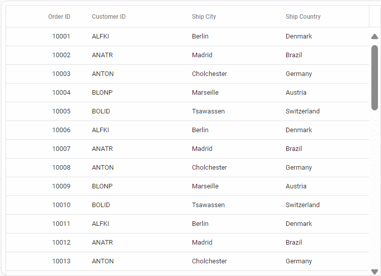
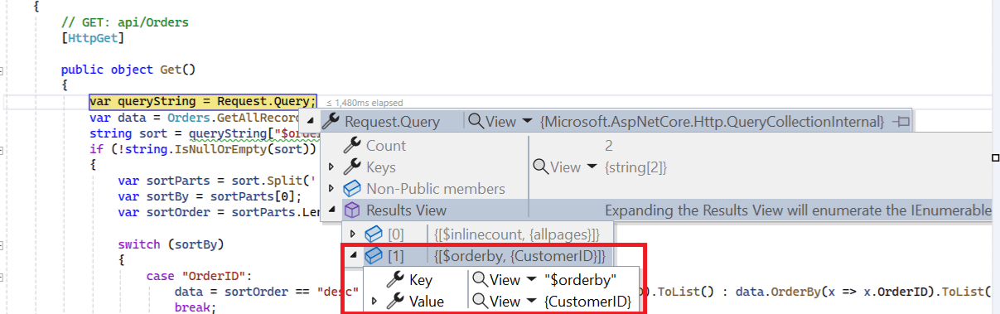
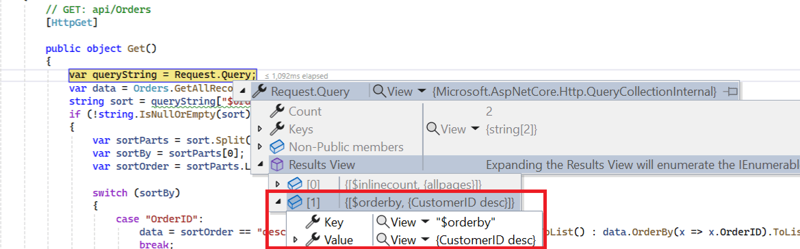
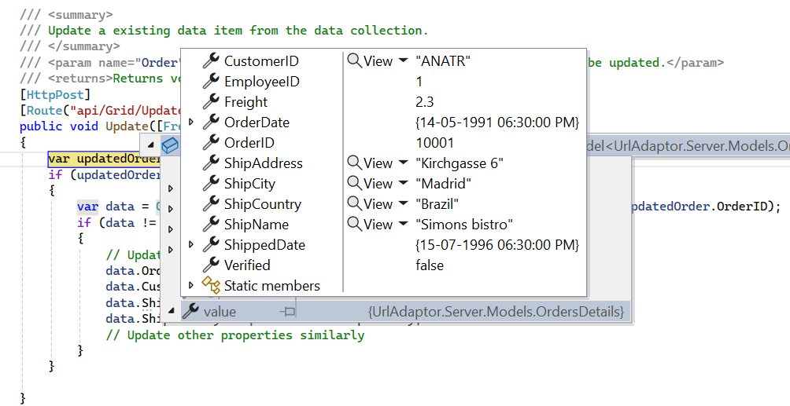

# WebApiAdaptor in Syncfusion<sup style="font-size:70%">&reg;</sup> ##Platform_Name## Grid Control

The `WebApiAdaptor` is an extension of the `ODataAdaptor`, designed to interact with Web APIs created with OData endpoints. This adaptor ensures seamless communication between Syncfusion<sup style="font-size:70%">&reg;</sup> Grid and OData-endpoint based Web APIs, enabling efficient data retrieval and manipulation. For successful integration, the endpoint must be capable of understanding OData-formatted queries sent along with the request.

To enable the OData query option for a Web API, please refer to the corresponding [documentation](https://learn.microsoft.com/en-us/aspnet/web-api/overview/odata-support-in-aspnet-web-api/supporting-odata-query-options), which provides detailed instructions on configuring the endpoint to understand OData-formatted queries.

This section describes a step-by-step process for retrieving data using WebApiAdaptor, then binding it to the ##Platform_Name## Grid control to facilitate data and CRUD operations.



## Creating an api service

**Step 1:** Set Up Your Development Environment

Before you start, make sure you have the following installed:

- .NET Core SDK
- Node.js
- Visual Studio or any other preferred code editor

**Step 2:** Create a New ASP.NET Core Project

Open Visual Studio and create an ASP.NET Core Web API project named **WebApiAdaptor**. 

**Step 3:** Add the Microsoft.TypeScript.MSBuild NuGet package to the project:

In Solution Explorer, right-click the project node and select Manage NuGet Packages. In the Browse tab, search for [Microsoft.TypeScript.MSBuild](https://www.nuget.org/packages/Microsoft.TypeScript.MSBuild/) and then select Install on the right to install the package.

**Step 4:** Configure the server

In `Program.cs`, call `UseDefaultFiles` and `UseStaticFiles`.

```cs
var app = builder.Build();

app.UseDefaultFiles();
app.UseStaticFiles();
```

Comment out the below line in `launchSettings.json`:

```json
    "https": {
      "commandName": "Project",
      "dotnetRunMessages": true,
      "launchBrowser": true,
     // "launchUrl": "swagger",
      "applicationUrl": "https://localhost:xxxx;http://localhost:xxxx",
      "environmentVariables": {
        "ASPNETCORE_ENVIRONMENT": "Development"
      }
    },
```
This configuration enables the server to locate and serve the `index.html` file.

**Step 5:** Model Class Creation

Create a model class named **OrdersDetails.cs** in the **Models** folder to represent the order data.




 namespace WebApiAdaptor.Models
 {
 public class OrdersDetails
 {
    public static List<OrdersDetails> order = new List<OrdersDetails>();
    public OrdersDetails()
    {

    }
    public OrdersDetails(
    int OrderID, string CustomerId, int EmployeeId, double Freight, bool Verified,
    DateTime OrderDate, string ShipCity, string ShipName, string ShipCountry,
    DateTime ShippedDate, string ShipAddress)
    {
    this.OrderID = OrderID;
    this.CustomerID = CustomerId;
    this.EmployeeID = EmployeeId;
    this.Freight = Freight;
    this.ShipCity = ShipCity;
    this.Verified = Verified;
    this.OrderDate = OrderDate;
    this.ShipName = ShipName;
    this.ShipCountry = ShipCountry;
    this.ShippedDate = ShippedDate;
    this.ShipAddress = ShipAddress;
    }

    public static List<OrdersDetails> GetAllRecords()
    {
    if (order.Count() == 0)
    {
        int code = 10000;
        for (int i = 1; i < 10; i++)
        {
        order.Add(new OrdersDetails(code + 1, "ALFKI", i + 0, 2.3 * i, false, new DateTime(1991, 05, 15), "Berlin", "Simons bistro", "Denmark", new DateTime(1996, 7, 16), "Kirchgasse 6"));
        order.Add(new OrdersDetails(code + 2, "ANATR", i + 2, 3.3 * i, true, new DateTime(1990, 04, 04), "Madrid", "Queen Cozinha", "Brazil", new DateTime(1996, 9, 11), "Avda. Azteca 123"));
        order.Add(new OrdersDetails(code + 3, "ANTON", i + 1, 4.3 * i, true, new DateTime(1957, 11, 30), "Cholchester", "Frankenversand", "Germany", new DateTime(1996, 10, 7), "Carrera 52 con Ave. Bolívar #65-98 Llano Largo"));
        order.Add(new OrdersDetails(code + 4, "BLONP", i + 3, 5.3 * i, false, new DateTime(1930, 10, 22), "Marseille", "Ernst Handel", "Austria", new DateTime(1996, 12, 30), "Magazinweg 7"));
        order.Add(new OrdersDetails(code + 5, "BOLID", i + 4, 6.3 * i, true, new DateTime(1953, 02, 18), "Tsawassen", "Hanari Carnes", "Switzerland", new DateTime(1997, 12, 3), "1029 - 12th Ave. S."));
        code += 5;
        }
    }
    return order;
    }

    public int? OrderID { get; set; }
    public string? CustomerID { get; set; }
    public int? EmployeeID { get; set; }
    public double? Freight { get; set; }
    public string? ShipCity { get; set; }
    public bool? Verified { get; set; }
    public DateTime OrderDate { get; set; }
    public string? ShipName { get; set; }
    public string? ShipCountry { get; set; }
    public DateTime ShippedDate { get; set; }
    public string? ShipAddress { get; set; }
 }
}




**Step 6:** API Controller Creation

Create a file named `OrdersController.cs` under the **Controllers** folder. This controller will handle data communication with the Typescript Grid component. Implement the **Get** method in the controller to return the data in JSON format, including the **Items** and **Count** properties as required by `WebApiAdaptor`.



using Microsoft.AspNetCore.Http;
using Microsoft.AspNetCore.Mvc;
using WebApiAdaptor.Models;

namespace WebApiAdaptor.Controllers
{
  [Route("api/[controller]")]
  [ApiController]
  public class GridController : ControllerBase
  {
    [HttpGet]
    public object Get()
    {
    var data = OrdersDetails.GetAllRecords().ToList();
    return  new { Items = data, Count = data.Count() };
    }
  }
}




## Connecting syncfusion<sup style="font-size:70%">&reg;</sup> grid to an api service

To integrate the Syncfusion<sup style="font-size:70%">&reg;</sup> Grid control into your ##Platform_Name## and ASP.NET Core project using Visual Studio, follow these steps:

**Step 1:** Create a package.json file:

Run the following command in the project root to create a `package.json` file:

```bash
npm init -y
```

**Step 2:** Install Webpack and Other Dependencies

```bash
npm i -D -E clean-webpack-plugin css-loader html-webpack-plugin mini-css-extract-plugin ts-loader typescript webpack webpack-cli
```

**Step 3:** Configure package.json Scripts

Replace the **scripts** property of `package.json` file with the following code:

```JSON
"scripts": {
  "build": "webpack --mode=development --watch",
  "release": "webpack --mode=production",
  "publish": "npm run release && dotnet publish -c Release"
},
```

**Step 4:** Create wwwroot Folder

Create a folder named `wwwroot` in the project root directory. This folder will contain static files served by the web server.

**Step 5:** Create webpack.config.js

Create a file named `webpack.config.js` in the project root, with the following code to configure the Webpack compilation process:

```js
const path = require("path");
const HtmlWebpackPlugin = require("html-webpack-plugin");
const { CleanWebpackPlugin } = require("clean-webpack-plugin");
const MiniCssExtractPlugin = require("mini-css-extract-plugin");

module.exports = {
    entry: "./src/index.ts",
    output: {
        path: path.resolve(__dirname, "wwwroot"),
        filename: "[name].[chunkhash].js",
        publicPath: "/",
    },
    resolve: {
        extensions: [".js", ".ts"],
    },
    module: {
        rules: [
            {
                test: /\.ts$/,
                use: "ts-loader",
            },
            {
                test: /\.css$/,
                use: [MiniCssExtractPlugin.loader, "css-loader"],
            },
        ],
    },
    plugins: [
        new CleanWebpackPlugin(),
        new HtmlWebpackPlugin({
            template: "./src/index.html",
        }),
        new MiniCssExtractPlugin({
            filename: "css/[name].[chunkhash].css",
        }),
    ],
};
```

**Step 6:** Create a new directory named `src` in the project root for the client code.

**Step 7:** Install Syncfusion<sup style="font-size:70%">&reg;</sup> Packages

Open your terminal in the project’s root folder and install the required Syncfusion<sup style="font-size:70%">&reg;</sup> packages using npm:

```bash
npm install @syncfusion/ej2-grids --save
npm install @syncfusion/ej2-data --save
```

**Step 8:** Create `src/index.html` and add the following code:

```html
<!DOCTYPE html>
<html lang="en">
<head>
    <title>EJ2 Grid</title>
    <meta charset="utf-8" />
    <meta name="viewport" content="width=device-width, initial-scale=1.0" />
    <meta name="description" content="Typescript Grid Control" />
    <meta name="author" content="Syncfusion" />
    <link href="https://cdn.syncfusion.com/ej2/26.1.35/ej2-base/styles/material.css" rel="stylesheet" />
    <link href="https://cdn.syncfusion.com/ej2/26.1.35/ej2-grids/styles/material.css" rel="stylesheet" />
    <link href="https://cdn.syncfusion.com/ej2/26.1.35/ej2-buttons/styles/material.css" rel="stylesheet" />
    <link href="https://cdn.syncfusion.com/ej2/26.1.35/ej2-popups/styles/material.css" rel="stylesheet" />
    <link href="https://cdn.syncfusion.com/ej2/26.1.35/ej2-richtexteditor/styles/material.css" rel="stylesheet" />
    <link href="https://cdn.syncfusion.com/ej2/26.1.35/ej2-navigations/styles/material.css" rel="stylesheet" />
    <link href="https://cdn.syncfusion.com/ej2/26.1.35/ej2-dropdowns/styles/material.css" rel="stylesheet" />
    <link href="https://cdn.syncfusion.com/ej2/26.1.35/ej2-lists/styles/material.css" rel="stylesheet" />
    <link href="https://cdn.syncfusion.com/ej2/26.1.35/ej2-inputs/styles/material.css" rel="stylesheet" />
    <link href="https://cdn.syncfusion.com/ej2/26.1.35/ej2-calendars/styles/material.css" rel="stylesheet" />
    <link href="https://cdn.syncfusion.com/ej2/26.1.35/ej2-notifications/styles/material.css" rel="stylesheet" />
    <link href="https://cdn.syncfusion.com/ej2/26.1.35/ej2-splitbuttons/styles/material.css" rel="stylesheet" />

    <script src="https://cdnjs.cloudflare.com/ajax/libs/systemjs/0.19.38/system.js"></script>

    <script src="https://cdn.syncfusion.com/ej2/syncfusion-helper.js" type="text/javascript"></script>
</head>
<body>
    <div id='container'>
        <div id='Grid'></div>
    </div>
</body>
</html>
```

**Step 9:** Create `src/index.ts` and add the following code:

```ts
import { Grid } from '@syncfusion/ej2-grids';
import { DataManager, WebApiAdaptor } from '@syncfusion/ej2-data';

let data: DataManager = new DataManager({
    url: 'https://localhost:xxxx/api/Grid',
    adaptor: new WebApiAdaptor()
});

let grid: Grid = new Grid({
    dataSource: data,
    columns: [
        { field: 'OrderID', headerText: 'Order ID', textAlign: 'Right', width: 120, isPrimaryKey: true, type: 'number' },
        { field: 'CustomerID', width: 140, headerText: 'Customer ID', type: 'string' },
        { field: 'ShipCity', headerText: 'ShipCity', width: 140 },
        { field: 'ShipCountry', headerText: 'ShipCountry', width: 140 }
    ]
});

grid.appendTo('#Grid');
```

**Step 10:** Create `src/tsconfig.json` in the project and add the following content:

```json
{
  "compilerOptions": {
    "noImplicitAny": true,
    "noEmitOnError": true,
    "removeComments": false,
    "sourceMap": true,
    "target": "es5"
  },
  "exclude": [
    "node_modules",
    "wwwroot"
  ]
}
```

**Step 11:** Install additional packages and build the project

```bash
npm i @types/node
npm run build
```

**Step 12:** Run the project

Run the project in Visual Studio.

The `wwwroot/index.html` file is served at **https://localhost:xxxx**.

With these steps, you have integrated the Syncfusion<sup style="font-size:70%">&reg;</sup> Grid control with your ASP.NET Core project and set up the necessary client-side configuration using Webpack and ##Platform_Name##. This will allow the Syncfusion<sup style="font-size:70%">&reg;</sup> Grid to fetch data from your API and display it accordingly.



## Creating an api service

**Step 1:** Create a New ASP.NET Core Project

To create a new ASP.NET Core Web API project named WebApiAdaptor, follow these steps:

* Open Visual Studio.
* Select "Create a new project"
* Choose **ASP.NET Core Web API** project template.
* Name the project **WebApiAdaptor**.
* Click "Create"

**Step 2:** Configure the server

In the `Program.cs` file of your project, configure the server to serve static files by adding the following code:

```cs
var app = builder.Build();

app.UseDefaultFiles();
app.UseStaticFiles();
```

Additionally, comment out the following line in the `launchSettings.json` file:

```json
    "https": {
      "commandName": "Project",
      "dotnetRunMessages": true,
      "launchBrowser": true,
     // "launchUrl": "swagger",
      "applicationUrl": "https://localhost:xxxx;http://localhost:xxxx",
      "environmentVariables": {
        "ASPNETCORE_ENVIRONMENT": "Development"
      }
    },
```
This configuration enables the server to locate and serve the index.html file.

**Step 3:** Model Class Creation

Create a model class named **OrdersDetails.cs** in the **Models** folder to represent the order data.




 namespace WebApiAdaptor.Models
 {
 public class OrdersDetails
 {
    public static List<OrdersDetails> order = new List<OrdersDetails>();
    public OrdersDetails()
    {

    }
    public OrdersDetails(
    int OrderID, string CustomerId, int EmployeeId, double Freight, bool Verified,
    DateTime OrderDate, string ShipCity, string ShipName, string ShipCountry,
    DateTime ShippedDate, string ShipAddress)
    {
    this.OrderID = OrderID;
    this.CustomerID = CustomerId;
    this.EmployeeID = EmployeeId;
    this.Freight = Freight;
    this.ShipCity = ShipCity;
    this.Verified = Verified;
    this.OrderDate = OrderDate;
    this.ShipName = ShipName;
    this.ShipCountry = ShipCountry;
    this.ShippedDate = ShippedDate;
    this.ShipAddress = ShipAddress;
    }

    public static List<OrdersDetails> GetAllRecords()
    {
    if (order.Count() == 0)
    {
        int code = 10000;
        for (int i = 1; i < 10; i++)
        {
        order.Add(new OrdersDetails(code + 1, "ALFKI", i + 0, 2.3 * i, false, new DateTime(1991, 05, 15), "Berlin", "Simons bistro", "Denmark", new DateTime(1996, 7, 16), "Kirchgasse 6"));
        order.Add(new OrdersDetails(code + 2, "ANATR", i + 2, 3.3 * i, true, new DateTime(1990, 04, 04), "Madrid", "Queen Cozinha", "Brazil", new DateTime(1996, 9, 11), "Avda. Azteca 123"));
        order.Add(new OrdersDetails(code + 3, "ANTON", i + 1, 4.3 * i, true, new DateTime(1957, 11, 30), "Cholchester", "Frankenversand", "Germany", new DateTime(1996, 10, 7), "Carrera 52 con Ave. Bolívar #65-98 Llano Largo"));
        order.Add(new OrdersDetails(code + 4, "BLONP", i + 3, 5.3 * i, false, new DateTime(1930, 10, 22), "Marseille", "Ernst Handel", "Austria", new DateTime(1996, 12, 30), "Magazinweg 7"));
        order.Add(new OrdersDetails(code + 5, "BOLID", i + 4, 6.3 * i, true, new DateTime(1953, 02, 18), "Tsawassen", "Hanari Carnes", "Switzerland", new DateTime(1997, 12, 3), "1029 - 12th Ave. S."));
        code += 5;
        }
    }
    return order;
    }

    public int? OrderID { get; set; }
    public string? CustomerID { get; set; }
    public int? EmployeeID { get; set; }
    public double? Freight { get; set; }
    public string? ShipCity { get; set; }
    public bool? Verified { get; set; }
    public DateTime OrderDate { get; set; }
    public string? ShipName { get; set; }
    public string? ShipCountry { get; set; }
    public DateTime ShippedDate { get; set; }
    public string? ShipAddress { get; set; }
 }
}




**Step 4:** API Controller Creation

Create a file named `GridController.cs` under the **Controllers** folder. This controller will handle data communication with the Javscript Grid component. Implement the **Get** method in the controller to return the data in JSON format, including the **Items** and **Count** properties as required by `WebApiAdaptor`.




using Microsoft.AspNetCore.Http;
using Microsoft.AspNetCore.Mvc;
using WebApiAdaptor.Models;

namespace WebApiAdaptor.Controllers
{
  [Route("api/[controller]")]
  [ApiController]
  public class GridController : ControllerBase
  {
    [HttpGet]
    public object Get()
    {
    var data = OrdersDetails.GetAllRecords().ToList();
    return  new { Items = data, Count = data.Count() };
    }
  }
}




## Connecting syncfusion<sup style="font-size:70%">&reg;</sup> grid to an api service

**Step 1:** Create wwwroot folder

Create a folder named `wwwroot` in the project root directory. This folder will contain static files served by the web server.

**Step 2:** Create JS and CSS Folders

Inside the wwwroot folder, create js and css folders to hold script and CSS files, respectively.

**Step 3:** Create index.html File

Create an `index.html` file under the `wwwroot` folder and add the necessary HTML structure along with CSS and JavaScript links to include Syncfusion<sup style="font-size:70%">&reg;</sup> Grid dependencies.

```html
<!DOCTYPE html>
<html lang="en">
<head>
    <title>EJ2 Grid</title>
    <meta charset="utf-8">
    <meta name="viewport" content="width=device-width, initial-scale=1.0">
    <meta name="description" content="Javascript Grid Control">
    <meta name="author" content="Syncfusion">
    <link href="https://cdn.syncfusion.com/ej2/26.1.35/ej2-base/styles/material.css" rel="stylesheet">
    <link href="https://cdn.syncfusion.com/ej2/26.1.35/ej2-grids/styles/material.css" rel="stylesheet">
    <link href="https://cdn.syncfusion.com/ej2/26.1.35/ej2-buttons/styles/material.css" rel="stylesheet">
    <link href="https://cdn.syncfusion.com/ej2/26.1.35/ej2-popups/styles/material.css" rel="stylesheet">
    <link href="https://cdn.syncfusion.com/ej2/26.1.35/ej2-richtexteditor/styles/material.css" rel="stylesheet">
    <link href="https://cdn.syncfusion.com/ej2/26.1.35/ej2-navigations/styles/material.css" rel="stylesheet">
    <link href="https://cdn.syncfusion.com/ej2/26.1.35/ej2-dropdowns/styles/material.css" rel="stylesheet">
    <link href="https://cdn.syncfusion.com/ej2/26.1.35/ej2-lists/styles/material.css" rel="stylesheet">
    <link href="https://cdn.syncfusion.com/ej2/26.1.35/ej2-inputs/styles/material.css" rel="stylesheet">
    <link href="https://cdn.syncfusion.com/ej2/26.1.35/ej2-calendars/styles/material.css" rel="stylesheet">
    <link href="https://cdn.syncfusion.com/ej2/26.1.35/ej2-notifications/styles/material.css" rel="stylesheet">
    <link href="https://cdn.syncfusion.com/ej2/26.1.35/ej2-splitbuttons/styles/material.css" rel="stylesheet">

    <script src="https://cdn.syncfusion.com/ej2/26.1.35/dist/ej2.min.js" type="text/javascript"></script>
    <script src="https://cdn.syncfusion.com/ej2/syncfusion-helper.js" type="text/javascript"></script>
</head>
<body>

    <div id="container">
        <div id="Grid"></div>
    </div>
    <script src="js/index.js" type="text/javascript"></script>
</body>
</html>
```

**Step 4:** Create JavaScript File

Create a index.js file under the `wwwroot/js` folder and add the JavaScript code to initialize the Syncfusion<sup style="font-size:70%">&reg;</sup> Grid with data from the API service.

```js
var data = new ej.data.DataManager({
    url: 'https://localhost:xxxx/api/Grid', // Here xxxx represents the port number
    adaptor: new ej.data.WebApiAdaptor()
});

var grid = new ej.grids.Grid({
    dataSource: data,

    columns: [
        { field: 'OrderID', headerText: 'Order ID', textAlign: 'Right', width: 120, isPrimaryKey: true, type: 'number' },
        { field: 'CustomerID', width: 140, headerText: 'Customer ID', type: 'string' },
        { field: 'ShipCity', headerText: 'ShipCity', width: 140 },
        { field: 'ShipCountry', headerText: 'ShipCountry', width: 140 }
    ]
});

grid.appendTo('#Grid');
```

**Step 5:** Run the Project

Now, run the project to see the Syncfusion<sup style="font-size:70%">&reg;</sup> Grid connected to the API service in action.





## Handling searching operation

To handle search operation, implement search logic on the server side according to the received OData-formatted query.




// GET: api/Orders
[HttpGet]

public object Get()
{
  var queryString = Request.Query;
  var data = OrdersDetails.GetAllRecords().ToList();
  string filter = queryString["$filter"];

  if (filter != null)
  {
    var filters = filter.Split(new string[] { " and " }, StringSplitOptions.RemoveEmptyEntries);
    foreach (var filterItem in filters)
    {
      if (filterItem.Contains("substringof"))
      {
        // Perform Searching
        var searchParts = filterItem.Split('(', ')', '\'');
        var searchValue = searchParts[3];

        // Apply the search value to all searchable fields
        data = data.Where(cust =>
          cust.OrderID.ToString().Contains(searchValue) ||
          cust.CustomerID.ToLower().Contains(searchValue) ||
          cust.ShipCity.ToLower().Contains(searchValue)
        // Add conditions for other searchable fields as needed
        ).ToList();
      }
      else
      {
        // Perform filtering
      }
    }
  }
  return new { Items = data, Count = data.Count() };
}



import { Grid, Toolbar } from '@syncfusion/ej2-grids';
import { DataManager, WebApiAdaptor } from '@syncfusion/ej2-data';

Grid.Inject(Toolbar);

let data: DataManager = new DataManager({
    url: 'https://localhost:xxxx/api/Grid',
    adaptor: new WebApiAdaptor()
});

let grid: Grid = new Grid({
    dataSource: data,
    toolbar: ['Search'],
    columns: [
        { field: 'OrderID', headerText: 'Order ID', textAlign: 'Right', width: 120, isPrimaryKey: true, type: 'number' },
        { field: 'CustomerID', width: 140, headerText: 'Customer ID', type: 'string' },
        { field: 'ShipCity', headerText: 'ShipCity', width: 140 },
        { field: 'ShipCountry', headerText: 'ShipCountry', width: 140 }
    ]
});

grid.appendTo('#Grid');



ej.grids.Grid.Inject(ej.grids.Toolbar);

var data = new ej.data.DataManager({
    url: 'https://localhost:xxxx/api/Grid',
    adaptor: new ej.data.WebApiAdaptor()
});

var grid = new ej.grids.Grid({
    dataSource: data,
    toolbar: ['Search'],
    columns: [
                { field: 'OrderID', headerText: 'Order ID', textAlign: 'Right', width: 120, type: 'number' },
                { field: 'CustomerID', width: 140, headerText: 'Customer ID', type: 'string' },
                { field: 'ShipCity', headerText: 'ShipCity', width: 140 },
                { field: 'ShipCountry', headerText: 'ShipCountry', width: 140 }
    ]
});

grid.appendTo('#Grid');




## Handling filtering operation

To handle filter operations, ensure that your Web API endpoint supports filtering based on OData-formatted queries. Implement the filtering logic on the server-side as shown in the provided code snippet.




// GET: api/Orders
[HttpGet]
public object Get()
{
  var queryString = Request.Query;
  var data = Orders.GetAllRecords().ToList();
  string filter = queryString["$filter"];
  
  if (filter != null)
  {
    var filters = filter.Split(new string[] { " and " }, StringSplitOptions.RemoveEmptyEntries);
    foreach (var filterItem in filters)
    {
      var filterfield = "";
      var filtervalue = "";
      var filterParts = filterItem.Split('(', ')', '\'');
      if (filterParts.Length != 9)
      {
        var filterValueParts = filterParts[1].Split();
        filterfield = filterValueParts[0];
        filtervalue = filterValueParts[2];
      }
      else
      {
        filterfield = filterParts[3];
        filtervalue = filterParts[5];
      }
      switch (filterfield)
      {
        case "OrderID":
          data = (from cust in data
                where cust.OrderID.ToString() == filtervalue.ToString()
                select cust).ToList();
        break;
        case "CustomerID":
          data = (from cust in data
                where cust.CustomerID.ToLower().StartsWith(filtervalue.ToString())
                select cust).ToList();
        break;
        case "ShipCity":
          data = (from cust in data
                where cust.ShipCity.ToLower().StartsWith(filtervalue.ToString())
                select cust).ToList();
        break;
      }
    }
    return new { Items = data, Count = data.Count() };
  }
}



import { Grid, Filter } from '@syncfusion/ej2-grids';
import { DataManager, WebApiAdaptor } from '@syncfusion/ej2-data';

Grid.Inject(Filter);

let data: DataManager = new DataManager({
    url: 'https://localhost:xxxx/api/Grid',
    adaptor: new WebApiAdaptor()
});

let grid: Grid = new Grid({
    dataSource: data,
    allowFiltering: true,
    columns: [
        { field: 'OrderID', headerText: 'Order ID', textAlign: 'Right', width: 120, isPrimaryKey: true, type: 'number' },
        { field: 'CustomerID', width: 140, headerText: 'Customer ID', type: 'string' },
        { field: 'ShipCity', headerText: 'ShipCity', width: 140 },
        { field: 'ShipCountry', headerText: 'ShipCountry', width: 140 }
    ]
});

grid.appendTo('#Grid');



ej.grids.Grid.Inject(ej.grids.Filter);

var data = new ej.data.DataManager({
    url: 'https://localhost:xxxx/api/Grid',
    adaptor: new ej.data.WebApiAdaptor()
});

var grid = new ej.grids.Grid({
    dataSource: data,
    allowFiltering: true,
    columns: [
                { field: 'OrderID', headerText: 'Order ID', textAlign: 'Right', width: 120, type: 'number' },
                { field: 'CustomerID', width: 140, headerText: 'Customer ID', type: 'string' },
                { field: 'ShipCity', headerText: 'ShipCity', width: 140 },
                { field: 'ShipCountry', headerText: 'ShipCountry', width: 140 }
    ]
});

grid.appendTo('#Grid');




## Handling sorting operation

To handle sorting action, implement sorting logic on the server-side according to the received OData-formatted query.

***Ascending Sorting***



***Descending Sorting***





// GET: api/Orders
[HttpGet]

public object Get()
{
    var queryString = Request.Query;
    var data = OrdersDetails.GetAllRecords().ToList();
    string sort = queryString["$orderby"];   //sorting     
    if (!string.IsNullOrEmpty(sort))
    {
        var sortConditions = sort.Split(',');
        var orderedData = data.OrderBy(x => 0); // Start with a stable sort
        foreach (var sortCondition in sortConditions)
        {
            var sortParts = sortCondition.Trim().Split(' ');
            var sortBy = sortParts[0];
            var sortOrder = sortParts.Length > 1 && sortParts[1].ToLower() == "desc";
            switch (sortBy)
            {
                case "OrderID":
                    orderedData = sortOrder ? orderedData.ThenByDescending(x => x.OrderID) : orderedData.ThenBy(x => x.OrderID);
                    break;
                case "CustomerID":
                    orderedData = sortOrder ? orderedData.ThenByDescending(x => x.CustomerID) : orderedData.ThenBy(x => x.CustomerID);
                    break;
                case "ShipCity":
                    orderedData = sortOrder ? orderedData.ThenByDescending(x => x.ShipCity) : orderedData.ThenBy(x => x.ShipCity);
                    break;
            }
        }
        data = orderedData.ToList();
    }
    return new { Items = data, Count = data.Count() };
}



import { Grid, Sort } from '@syncfusion/ej2-grids';
import { DataManager, WebApiAdaptor } from '@syncfusion/ej2-data';

Grid.Inject(Sort);

let data: DataManager = new DataManager({
    url: 'https://localhost:xxxx/api/Grid',
    adaptor: new WebApiAdaptor()
});

let grid: Grid = new Grid({
    dataSource: data,
    allowSorting: true,
    columns: [
        { field: 'OrderID', headerText: 'Order ID', textAlign: 'Right', width: 120, isPrimaryKey: true, type: 'number' },
        { field: 'CustomerID', width: 140, headerText: 'Customer ID', type: 'string' },
        { field: 'ShipCity', headerText: 'ShipCity', width: 140 },
        { field: 'ShipCountry', headerText: 'ShipCountry', width: 140 }
    ]
});

grid.appendTo('#Grid');



ej.grids.Grid.Inject(ej.grids.Sort);

var data = new ej.data.DataManager({
    url: 'https://localhost:xxxx/api/Grid',
    adaptor: new ej.data.WebApiAdaptor()
});

var grid = new ej.grids.Grid({
    dataSource: data,
    allowSorting: true,
    columns: [
                { field: 'OrderID', headerText: 'Order ID', textAlign: 'Right', width: 120, type: 'number' },
                { field: 'CustomerID', width: 140, headerText: 'Customer ID', type: 'string' },
                { field: 'ShipCity', headerText: 'ShipCity', width: 140 },
                { field: 'ShipCountry', headerText: 'ShipCountry', width: 140 }
    ]
});

grid.appendTo('#Grid');




## Handling paging operation

Implement paging logic on the server-side according to the received OData-formatted query. Ensure that the endpoint supports paging based on the specified criteria.




[HttpPost]
public object Post([FromBody] DataManager DataManagerRequest)
{
    // Retrieve data from the data source (e.g., database)
    IQueryable<OrdersDetails> DataSource = GetOrderData().AsQueryable();

    // Get the total records count
    int totalRecordsCount = DataSource.Count();

    QueryableOperation queryableOperation = new QueryableOperation(); // Initialize QueryableOperation instance

    // Retrieve data manager value
    DataManagerRequest DataManagerParams = DataManagerRequest.Value;

    // Handling paging operation.
    if (DataManagerParams.Skip != 0)
    {
        // Paging
        DataSource = queryableOperation.PerformSkip(DataSource, DataManagerParams.Skip);
    }
    if (DataManagerParams.Take != 0)
    {
        DataSource = queryableOperation.PerformTake(DataSource, DataManagerParams.Take);
    }

    // Return data based on the request
    return new { result = DataSource, count = totalRecordsCount };
}

// Model for handling data manager requests
public class DataManager
{
    public required DataManagerRequest Value { get; set; }
}



import { Grid, Page } from '@syncfusion/ej2-grids';
import { DataManager, WebApiAdaptor } from '@syncfusion/ej2-data';

Grid.Inject(Page);

let data: DataManager = new DataManager({
    url: 'https://localhost:xxxx/api/Grid',
    adaptor: new WebApiAdaptor()
});

let grid: Grid = new Grid({
    dataSource: data,
    allowPaging: true,
    columns: [
        { field: 'OrderID', headerText: 'Order ID', textAlign: 'Right', width: 120, isPrimaryKey: true, type: 'number' },
        { field: 'CustomerID', width: 140, headerText: 'Customer ID', type: 'string' },
        { field: 'ShipCity', headerText: 'ShipCity', width: 140 },
        { field: 'ShipCountry', headerText: 'ShipCountry', width: 140 }
    ]
});

grid.appendTo('#Grid');



ej.grids.Grid.Inject(ej.grids.Page);
var data = new ej.data.DataManager({
    url: 'https://localhost:xxxx/api/Grid',
    adaptor: new ej.data.WebApiAdaptor()
});

var grid = new ej.grids.Grid({
    dataSource: data,
    allowPaging: true,
    columns: [
                { field: 'OrderID', headerText: 'Order ID', textAlign: 'Right', width: 120, type: 'number' },
                { field: 'CustomerID', width: 140, headerText: 'Customer ID', type: 'string' },
                { field: 'ShipCity', headerText: 'ShipCity', width: 140 },
                { field: 'ShipCountry', headerText: 'ShipCountry', width: 140 }
    ]
});

grid.appendTo('#Grid');





> You can find the complete sample for the WebApiAdaptor in [GitHub](https://github.com/SyncfusionExamples/Binding-data-from-remote-service-to-typescript-data-grid) link.

> You can find the complete sample for the WebApiAdaptor in [GitHub](https://github.com/SyncfusionExamples/Binding-data-from-remote-service-to-javascript-data-grid) link.


## Handling CRUD operations

The Syncfusion<sup style="font-size:70%">&reg;</sup> ##Platform_Name## Grid Control seamlessly integrates CRUD (Create, Read, Update, Delete) operations with server-side controller actions through specific properties: [insertUrl](https://help.syncfusion.com/cr/aspnetmvc-js2/Syncfusion.EJ2.DataManager.html#Syncfusion_EJ2_DataManager_InsertUrl), [removeUrl](https://help.syncfusion.com/cr/aspnetmvc-js2/Syncfusion.EJ2.DataManager.html#Syncfusion_EJ2_DataManager_RemoveUrl), [updateUrl](https://help.syncfusion.com/cr/aspnetmvc-js2/Syncfusion.EJ2.DataManager.html#Syncfusion_EJ2_DataManager_UpdateUrl), [crudUrl](https://help.syncfusion.com/cr/aspnetmvc-js2/Syncfusion.EJ2.DataManager.html#Syncfusion_EJ2_DataManager_CrudUrl), and [batchUrl](https://help.syncfusion.com/cr/aspnetmvc-js2/Syncfusion.EJ2.DataManager.html#Syncfusion_EJ2_DataManager_BatchUrl). These properties enable the grid to communicate with the data service for every grid action, facilitating server-side operations.

To enable editing in ##Platform_Name## Grid control, refer to the editing [documentation](../editing/edit). In the below example, the inline edit [mode](../../api/grid/editSettings/#mode) is enabled and [toolbar](../../api/grid/#toolbar) property is configured to display toolbar items for editing purposes.




import { Grid, Edit, Toolbar } from '@syncfusion/ej2-grids';
import { DataManager, WebApiAdaptor } from '@syncfusion/ej2-data';

Grid.Inject(Edit, Toolbar);

let data: DataManager = new DataManager({
    url: 'https://localhost:xxxx/api/Grid',
    adaptor: new WebApiAdaptor()
});

let grid: Grid = new Grid({
    dataSource: data,
    toolbar: ['Add', 'Edit', 'Delete', 'Update', 'Cancel'],
    editSettings: { allowEditing: true, allowAdding: true, allowDeleting: true, mode: 'Normal' },
    columns: [
        { field: 'OrderID', headerText: 'Order ID', textAlign: 'Right', width: 120, isPrimaryKey: true, type: 'number' },
        { field: 'CustomerID', width: 140, headerText: 'Customer ID', type: 'string' },
        { field: 'ShipCity', headerText: 'ShipCity', width: 140 },
        { field: 'ShipCountry', headerText: 'ShipCountry', width: 140 }
    ]
});

grid.appendTo('#Grid');



ej.grids.Grid.Inject(ej.grids.Toolbar, ej.grids.Edit);

var data = new ej.data.DataManager({
    url: 'https://localhost:xxxx/api/Grid', // Here xxxx represents the port number
    adaptor: new ej.data.WebApiAdaptor()
});

var grid = new ej.grids.Grid({
    dataSource: data,
    toolbar: ['Add', 'Edit', 'Delete', 'Update', 'Cancel'],
    editSettings: { allowEditing: true, allowAdding: true, allowDeleting: true, mode: 'Normal' },
    columns: [
        { field: 'OrderID', headerText: 'Order ID', textAlign: 'Right', width: 120, isPrimaryKey: true, type: 'number' },
        { field: 'CustomerID', width: 140, headerText: 'Customer ID', type: 'string' },
        { field: 'ShipCity', headerText: 'ShipCity', width: 140 },
        { field: 'ShipCountry', headerText: 'ShipCountry', width: 140 }
    ]
});

grid.appendTo('#Grid');




> Normal/Inline editing is the default edit [mode](../../api/grid/editSettings/#mode) for the Grid control. To enable CRUD operations, ensure that the [isPrimaryKey](../../api/grid/column/#isprimarykey) property is set to **true** for a specific Grid column, ensuring that its value is unique.

**Insert operation:**

To insert a new record, utilize the [insertUrl](https://help.syncfusion.com/cr/aspnetmvc-js2/Syncfusion.EJ2.DataManager.html#Syncfusion_EJ2_DataManager_InsertUrl) property to specify the controller action mapping URL for the insert operation. The newly added record details are bound to the **newRecord** parameter.


```cs
// POST: api/Orders
[HttpPost]
/// <summary>
/// Inserts a new data item into the data collection.
/// </summary>
/// <param name="newRecord">It holds new record detail which is need to be inserted.</param>
/// <returns>Returns void</returns>
public void Post([FromBody] OrdersDetails newRecord)
{
  // Insert a new record into the OrdersDetails model
  OrdersDetails.GetAllRecords().Insert(0, newRecord);
}
```

**Update operation:**

For updating existing records, utilize the [updateUrl](https://help.syncfusion.com/cr/aspnetmvc-js2/Syncfusion.EJ2.DataManager.html#Syncfusion_EJ2_DataManager_UpdateUrl) property to specify the controller action mapping URL for the update operation. The updated record details are bound to the **updatedRecord** parameter.



```cs
// PUT: api/Orders/5
[HttpPut]
/// <summary>
/// Update a existing data item from the data collection.
/// </summary>
/// <param name="updatedOrder">It holds updated record detail which is need to be updated.</param>
/// <returns>Returns void</returns>
public void Put(int id, [FromBody] OrdersDetails updatedOrder)
{
  // Find the existing order by ID
  var existingOrder = OrdersDetails.GetAllRecords().FirstOrDefault(o => o.OrderID == id);
  if (existingOrder != null)
  {
    // If the order exists, update its properties
    existingOrder.OrderID = updatedOrder.OrderID;
    existingOrder.CustomerID = updatedOrder.CustomerID;
    existingOrder.ShipCity = updatedOrder.ShipCity;
    existingOrder.ShipCountry = updatedOrder.ShipCountry;
  }
}
```

**Delete operation**

To delete existing records, use the [removeUrl](https://help.syncfusion.com/cr/aspnetmvc-js2/Syncfusion.EJ2.DataManager.html#Syncfusion_EJ2_DataManager_RemoveUrl) property to specify the controller action mapping URL for the delete operation. The primary key value of the deleted record is bound to the **deletedRecord** parameter.


```cs
// DELETE: api/5

[HttpDelete("{id}")]
/// <summary>
/// Remove a specific data item from the data collection.
/// </summary>
/// <param name="key">It holds specific record detail id which is need to be removed.</param>
/// <returns>Returns void</returns>
public void Delete(int key)
{
  // Find the order to remove by ID
  var orderToRemove = OrdersDetails.GetAllRecords().FirstOrDefault(order => order.OrderID == key);
  // If the order exists, remove it
  if (orderToRemove != null)
  {
    OrdersDetails.GetAllRecords().Remove(orderToRemove);
  }
}
```



> You can find the complete sample for the WebApiAdaptor in [GitHub](https://github.com/SyncfusionExamples/Binding-data-from-remote-service-to-typescript-data-grid) link.

> You can find the complete sample for the WebApiAdaptor in [GitHub](https://github.com/SyncfusionExamples/Binding-data-from-remote-service-to-javascript-data-grid) link.
