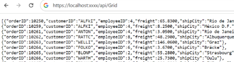
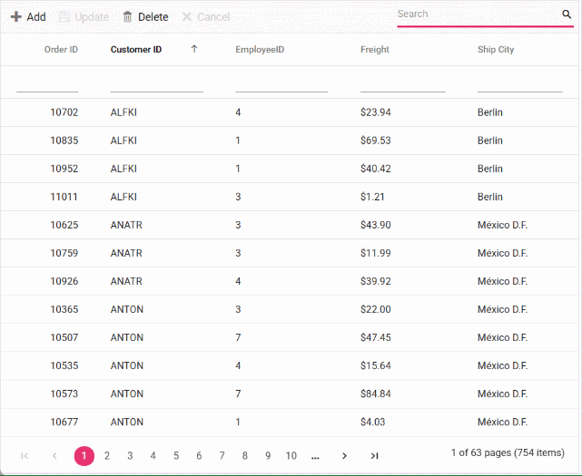

# Connecting PostgreSQL Server data to Syncfusion ##Platform_Name## Grid

This section describes how to connect and retrieve data from a PostgreSQL Server database using [Npgsql EntityFrameworkCore PostgreSQL](https://www.nuget.org/packages/Npgsql.EntityFrameworkCore.PostgreSQL) and bind it to the Syncfusion ##Platform_Name## Grid.

PostgreSQL Server database can be bound to the Grid in different ways (i.e.) using [dataSource](../../api/grid/#datasource) property, custom adaptor and remote data binding using various adaptors. In this documentation, two approaches will be examined to connect a PostgreSQL Server database to a Grid. Both the approaches have capability to handle data and CRUD operations with built-in methods as well as can be customized as per your own.

**1. Using UrlAdaptor**

The [UrlAdaptor](../../grid/connecting-to-adaptors/url-adaptor) serves as the base adaptor for facilitating communication between remote data services and an UI component. It enables the remote binding of data to the Syncfusion ##Platform_Name## Grid by connecting to an existing pre-configured API service linked to the PostgreSQL Server database. While the Grid supports various adaptors to fulfill this requirement, including [Web API](../../grid/connecting-to-adaptors/web-api-adaptor), [ODataV4](../../grid/connecting-to-adaptors/odatav4-adaptor), [UrlAdaptor](../../grid/connecting-to-adaptors/url-adaptor), and [GraphQL](../../grid/connecting-to-adaptors/graphql-adaptor), the `UrlAdaptor` is particularly useful for the scenarios where a custom API service with unique logic for handling data and CRUD operations is in place. This approach allows for custom handling of data and CRUD operations, and the resultant data returned in the `result` and `count` format for display in the Grid.

**2. Using CustomAdaptor**

The `CustomAdaptor` serves as a mediator between the UI component and the database for data binding. While the data source from the database can be directly bound to the Syncfusion ##Platform_Name## Grid locally using the `dataSource` property, the `CustomAdaptor` approach is preferred as it allows for customization of both data operations and CRUD operations according to specific requirements. In this approach, for every action in the Grid, a corresponding request with action details is sent to the `CustomAdaptor`. The Grid provides predefined methods to perform data operations such as **searching**, **filtering**, **sorting**, **aggregation**, **paging** and **grouping**. Alternatively, your own custom methods can be employed to execute operations and return the data in the `result` and `count` format for displaying in the Grid. Additionally, for CRUD operations, predefined methods can be overridden to provide custom functionality. Further details on this can be found in the latter part of the documentation.

## Binding data from PostgreSQL Server using an API service

This section describes step by step process how to retrieve data from a PostgreSQL Server using an API service and bind it to the Syncfusion ##Platform_Name## Grid.



### Creating an API service

**Step 1:** Set up your development environment:

Before you start, make sure you have the following installed:

- .NET Core SDK
- Node.js
- Visual Studio or any other preferred code editor

**Step 2:** Open Visual Studio and create an ASP.NET Core Web API project named **Grid_PostgreSQL_TS**. 

**Step 3:** In Solution Explorer, right-click the project node and select Manage NuGet Packages. In the Browse tab, search for [Microsoft.TypeScript.MSBuild](https://www.nuget.org/packages/Microsoft.TypeScript.MSBuild/) and then select Install on the right to install the package.

**Step 4:** In `Program.cs`, call `UseDefaultFiles` and `UseStaticFiles`.

```cs
var app = builder.Build();
app.UseDefaultFiles();
app.UseStaticFiles();
```

Comment out the below line in `launchSettings.json`:

```json
"https": {
  "commandName": "Project",
  "dotnetRunMessages": true,
  "launchBrowser": true,
  // "launchUrl": "swagger",
  "applicationUrl": "https://localhost:xxxx;http://localhost:xxxx",
  "environmentVariables": {
    "ASPNETCORE_ENVIRONMENT": "Development"
  }
}
```
This configuration enables the server to locate and serve the `index.html` file.

**Step 5:** To connect a PostgreSQL Server database using the PostgreSQL driver in your application, you need to install the [Npgsql.EntityFrameworkCore.PostgreSQL ](https://www.nuget.org/packages/Npgsql.EntityFrameworkCore.PostgreSQL) NuGet package. To add **Npgsql.EntityFrameworkCore.PostgreSQL** in the app, open the NuGet package manager in Visual Studio (Tools → NuGet Package Manager → Manage NuGet Packages for Solution), search and install it.

**Step 6:** Create an API controller (aka, GridController.cs) file under **Controllers** folder that helps to establish data communication with the Grid.

**Step 7:** In an API controller (aka, GridController), connect to PostgreSQL Server. In the **GetOrderData()** method **NpgsqlConnection** helps to connect the PostgreSQL Server database. Next, using **NpgsqlCommand** and **NpgsqlDataAdapter** you can process the desired Npgsql query string and retrieve data from the database. The **Fill** method of the **DataAdapter** is used to populate the Npgsql data into a **DataTable** as shown in the following code snippet.




using Microsoft.AspNetCore.Mvc;
using System.ComponentModel.DataAnnotations;
using System.Data;
using Syncfusion.EJ2.Base;
using Npgsql;

namespace Grid_PostgreSQL_Custom.Server.Controllers
{
  [ApiController]
  public class GridController : ControllerBase
  {

    string ConnectionString = @"<Enter a valid connection string>";

    /// <summary>
    /// Processes the DataManager request to perform searching, filtering, sorting, and paging operations.
    /// </summary>
    /// <param name="DataManagerRequest">Contains the details of the data operation requested.</param>
    /// <returns>Returns a JSON object along with the total record count.</returns>
    [HttpPost]
    [Route("api/[controller]")]
    public object Post([FromBody] DataManagerRequest DataManagerRequest)
    {
      // Retrieve data from the data source (e.g., database).
      IQueryable<Orders> DataSource = GetOrderData().AsQueryable();

      // Get the total count of records.
      int totalRecordsCount = DataSource.Count();

      // Return data based on the request.
      return new { result = DataSource, count = totalRecordsCount };
    }

    /// <summary>
    /// Retrieves the order data from the database.
    /// </summary>
    /// <returns>Returns a list of orders fetched from the database.</returns>
    [HttpGet]
    [Route("api/[controller]")]
    public List<Orders> GetOrderData()
    {
      // Define the SQL query to retrieve all orders from the database, ordered by OrderID.
      string queryStr = "SELECT * FROM public.\"Orders\" ORDER BY \"OrderID\"";

      // Create a new NpgsqlConnection object using the connection string.
      NpgsqlConnection Connection = new(ConnectionString);

      // Open the database connection before executing the query.
      Connection.Open();

      //Using NpgsqlCommand and query create connection with database.
      NpgsqlCommand Command = new(queryStr, Connection);

      // Using NpgsqlDataAdapter to execute the NpgsqlCommand and fill the results into a DataTable. 
      NpgsqlDataAdapter DataAdapter = new(Command);

      // Create a DataTable to hold the data retrieved from the database.
      DataTable DataTable = new();

      // Using NpgsqlDataAdapter, process the query string and fill the data into the dataset.
      DataAdapter.Fill(DataTable);

      // Close the connection after executing the command.
      Connection.Close();

      // Cast the data fetched from NpgsqlDataAdapter to List.<T>
      List<Orders> dataSource = (from DataRow Data in DataTable.Rows
        select new Orders()
          {
            OrderID = Convert.ToInt32(Data["OrderID"]),
            CustomerID = Data["CustomerID"].ToString(),
            EmployeeID = Convert.ToInt32(Data["EmployeeID"]),
            ShipCity = Data["ShipCity"].ToString(),
            Freight = Convert.ToDecimal(Data["Freight"])
        }).ToList();
      return dataSource;
    }

    public class Orders
    {
      [Key]
      public int? OrderID { get; set; }
      public string? CustomerID { get; set; }
      public int? EmployeeID { get; set; }
      public decimal Freight { get; set; }
      public string? ShipCity { get; set; }
    }
  }
}




**8.** Run the application and it will be hosted within the URL `https://localhost:xxxx`.

**9.** Finally, the retrieved data from PostgreSQL Server database which is in the form of list can be found in an API controller available in the URL link `https://localhost:xxxx/api/Grid`, as shown in the browser page below.





**Step 1:** To create a new ASP.NET Core Web API project named **Grid_PostgreSQL_TS**, follow these steps:

    * Open Visual Studio.
    * Select "Create a new project".
    * Choose **ASP.NET Core Web API** project template.
    * Name the project **Grid_PostgreSQL_TS**.
    * Click "Create".

**Step 2:** In `Program.cs`, call `UseDefaultFiles` and `UseStaticFiles`.

```cs
var app = builder.Build();
app.UseDefaultFiles();
app.UseStaticFiles();
```

Comment out the below line in `launchSettings.json`:

```json
"https": {
  "commandName": "Project",
  "dotnetRunMessages": true,
  "launchBrowser": true,
  // "launchUrl": "swagger",
  "applicationUrl": "https://localhost:xxxx;http://localhost:xxxx",
  "environmentVariables": {
    "ASPNETCORE_ENVIRONMENT": "Development"
  }
}
```
This configuration enables the server to locate and serve the `index.html` file.

**Step 3:** To connect a PostgreSQL Server database using the PostgreSQL driver in your application, you need to install the [Npgsql.EntityFrameworkCore.PostgreSQL ](https://www.nuget.org/packages/Npgsql.EntityFrameworkCore.PostgreSQL) NuGet package. To add **Npgsql.EntityFrameworkCore.PostgreSQL** in the app, open the NuGet package manager in Visual Studio (Tools → NuGet Package Manager → Manage NuGet Packages for Solution), search and install it.

**Step 4:** Create an API controller (aka, GridController.cs) file under **Controllers** folder that helps to establish data communication with the Syncfusion ##Platform_Name## Grid.

**Step 5:** In an API controller (aka, GridController), connect to PostgreSQL Server. In the **GetOrderData()** method **NpgsqlConnection** helps to connect the PostgreSQL Server database. Next, using **NpgsqlCommand** and **NpgsqlDataAdapter** you can process the desired Npgsql query string and retrieve data from the database. The **Fill** method of the **DataAdapter** is used to populate the Npgsql data into a **DataTable** as shown in the following code snippet.




using Microsoft.AspNetCore.Mvc;
using System.ComponentModel.DataAnnotations;
using System.Data;
using Syncfusion.EJ2.Base;
using Npgsql;

namespace Grid_PostgreSQL_Custom.Server.Controllers
{
  [ApiController]
  public class GridController : ControllerBase
  {

    string ConnectionString = @"<Enter a valid connection string>";

    /// <summary>
    /// Processes the DataManager request to perform searching, filtering, sorting, and paging operations.
    /// </summary>
    /// <param name="DataManagerRequest">Contains the details of the data operation requested.</param>
    /// <returns>Returns a JSON object along with the total record count.</returns>
    [HttpPost]
    [Route("api/[controller]")]
    public object Post([FromBody] DataManagerRequest DataManagerRequest)
    {
      // Retrieve data from the data source (e.g., database).
      IQueryable<Orders> DataSource = GetOrderData().AsQueryable();

      // Get the total count of records.
      int totalRecordsCount = DataSource.Count();

      // Return data based on the request.
      return new { result = DataSource, count = totalRecordsCount };
    }

    /// <summary>
    /// Retrieves the order data from the database.
    /// </summary>
    /// <returns>Returns a list of orders fetched from the database.</returns>
    [HttpGet]
    [Route("api/[controller]")]
    public List<Orders> GetOrderData()
    {
      // Define the SQL query to retrieve all orders from the database, ordered by OrderID.
      string queryStr = "SELECT * FROM public.\"Orders\" ORDER BY \"OrderID\"";

      // Create a new NpgsqlConnection object using the connection string.
      NpgsqlConnection Connection = new(ConnectionString);

      // Open the database connection before executing the query.
      Connection.Open();

      //Using NpgsqlCommand and query create connection with database.
      NpgsqlCommand Command = new(queryStr, Connection);

      // Using NpgsqlDataAdapter to execute the NpgsqlCommand and fill the results into a DataTable. 
      NpgsqlDataAdapter DataAdapter = new(Command);

      // Create a DataTable to hold the data retrieved from the database.
      DataTable DataTable = new();

      // Using NpgsqlDataAdapter, process the query string and fill the data into the dataset.
      DataAdapter.Fill(DataTable);

      // Close the connection after executing the command.
      Connection.Close();

      // Cast the data fetched from NpgsqlDataAdapter to List.<T>
      List<Orders> dataSource = (from DataRow Data in DataTable.Rows
        select new Orders()
          {
            OrderID = Convert.ToInt32(Data["OrderID"]),
            CustomerID = Data["CustomerID"].ToString(),
            EmployeeID = Convert.ToInt32(Data["EmployeeID"]),
            ShipCity = Data["ShipCity"].ToString(),
            Freight = Convert.ToDecimal(Data["Freight"])
        }).ToList();
      return dataSource;
    }

    public class Orders
    {
      [Key]
      public int? OrderID { get; set; }
      public string? CustomerID { get; set; }
      public int? EmployeeID { get; set; }
      public decimal Freight { get; set; }
      public string? ShipCity { get; set; }
    }
  }
}




**5.** Run the application and it will be hosted within the URL `https://localhost:xxxx`.

**6.** Finally, the retrieved data from PostgreSQL Server database which is in the form of list can be found in an API controller available in the URL link `https://localhost:xxxx/api/Grid`, as shown in the browser page below.




### Connecting Syncfusion ##Platform_Name## Grid to an API service

To integrate Syncfusion ##Platform_Name## Grid into your ##Platform_Name## and ASP.NET Core project using Visual Studio, follow the below steps:



**Step 1:** Run the following command in the project root to create a `package.json` file:

```bash
npm init -y
```

**Step 2:** Install webpack and other dependencies.

```bash
npm i -D -E clean-webpack-plugin css-loader html-webpack-plugin mini-css-extract-plugin ts-loader typescript webpack webpack-cli
```

**Step 3:** Replace the **scripts** property of `package.json` file with the following code:

```JSON
"scripts": {
  "build": "webpack --mode=development --watch",
  "release": "webpack --mode=production",
  "publish": "npm run release && dotnet publish -c Release"
},
```

**Step 4:** Create a folder named `wwwroot` in the project root directory. This folder will contain static files served by the web server.

**Step 5:** Create a file named `webpack.config.js` in the project root, with the following code to configure the Webpack compilation process:

```js
const path = require("path");
const HtmlWebpackPlugin = require("html-webpack-plugin");
const { CleanWebpackPlugin } = require("clean-webpack-plugin");
const MiniCssExtractPlugin = require("mini-css-extract-plugin");

module.exports = {
    entry: "./src/index.ts",
    output: {
        path: path.resolve(__dirname, "wwwroot"),
        filename: "[name].[chunkhash].js",
        publicPath: "/",
    },
    resolve: {
        extensions: [".js", ".ts"],
    },
    module: {
        rules: [
            {
                test: /\.ts$/,
                use: "ts-loader",
            },
            {
                test: /\.css$/,
                use: [MiniCssExtractPlugin.loader, "css-loader"],
            },
        ],
    },
    plugins: [
        new CleanWebpackPlugin(),
        new HtmlWebpackPlugin({
            template: "./src/index.html",
        }),
        new MiniCssExtractPlugin({
            filename: "css/[name].[chunkhash].css",
        }),
    ],
};
```

**Step 6:** Create a new directory named `src` in the project root for the client code.

**Step 7:** Open your terminal in the project’s root folder and install the required Syncfusion packages using npm:

```bash
npm install @syncfusion/ej2-grids --save
npm install @syncfusion/ej2-data --save
```

**Step 8:** Create `src/index.html` and add the following code:

```html
<!DOCTYPE html>
<html lang="en">
<head>
    <title>EJ2 Grid</title>
    <meta charset="utf-8" />
    <meta name="viewport" content="width=device-width, initial-scale=1.0" />
    <meta name="description" content="Typescript Grid Control" />
    <meta name="author" content="Syncfusion" />
    <link href="https://cdn.syncfusion.com/ej2/{{ site.ej2version }}/ej2-base/styles/bootstrap5.css" rel="stylesheet" />
    <link href="https://cdn.syncfusion.com/ej2/{{ site.ej2version }}/ej2-grids/styles/bootstrap5.css" rel="stylesheet" />
    <link href="https://cdn.syncfusion.com/ej2/{{ site.ej2version }}/ej2-buttons/styles/bootstrap5.css" rel="stylesheet" />
    <link href="https://cdn.syncfusion.com/ej2/{{ site.ej2version }}/ej2-popups/styles/bootstrap5.css" rel="stylesheet" />
    <link href="https://cdn.syncfusion.com/ej2/{{ site.ej2version }}/ej2-richtexteditor/styles/bootstrap5.css" rel="stylesheet" />
    <link href="https://cdn.syncfusion.com/ej2/{{ site.ej2version }}/ej2-navigations/styles/bootstrap5.css" rel="stylesheet" />
    <link href="https://cdn.syncfusion.com/ej2/{{ site.ej2version }}/ej2-dropdowns/styles/bootstrap5.css" rel="stylesheet" />
    <link href="https://cdn.syncfusion.com/ej2/{{ site.ej2version }}/ej2-lists/styles/bootstrap5.css" rel="stylesheet" />
    <link href="https://cdn.syncfusion.com/ej2/{{ site.ej2version }}/ej2-inputs/styles/bootstrap5.css" rel="stylesheet" />
    <link href="https://cdn.syncfusion.com/ej2/{{ site.ej2version }}/ej2-calendars/styles/bootstrap5.css" rel="stylesheet" />
    <link href="https://cdn.syncfusion.com/ej2/{{ site.ej2version }}/ej2-notifications/styles/bootstrap5.css" rel="stylesheet" />
    <link href="https://cdn.syncfusion.com/ej2/{{ site.ej2version }}/ej2-splitbuttons/styles/bootstrap5.css" rel="stylesheet" />
    <script src="https://cdnjs.cloudflare.com/ajax/libs/systemjs/0.19.38/system.js"></script>
    <style>
    </style>
    <script src="https://cdn.syncfusion.com/ej2/syncfusion-helper.js" type="text/javascript"></script>
</head>
<body>
    <div id='container'>
        <div id='Grid'></div>
    </div>
</body>
</html>
```

**Step 9:**  Create `src/index.ts` . In this file, import `DataManager` and `UrlAdaptor` from `@syncfusion/ej2-data`. Create a [DataManager](../../data/getting-started) instance specifying the URL of your API endpoint(https:localhost:xxxx/api/Grid) using the `url` property and set the adaptor `UrlAdaptor`.

**Step 10** The `DataManager` offers multiple adaptor options to connect with remote database based on an API service. Below is an example of the `UrlAdaptor` configuration where an API service are set up to return the resulting data in the `result` and `count` format.

**Step 11:** The `UrlAdaptor` acts as the base adaptor for interacting with remote data service. Most of the built-in adaptors are derived from the `UrlAdaptor`.




import { Grid } from '@syncfusion/ej2-grids';
import { DataManager, UrlAdaptor } from '@syncfusion/ej2-data';

let data: DataManager = new DataManager({
    url: 'https://localhost:xxxx/api/Grid', // Replace your hosted link.
    adaptor: new UrlAdaptor()
}); 

let grid: Grid = new Grid({
    dataSource: data,
    height:"348px"
    columns: [
        { field: 'OrderID', headerText: 'Order ID', textAlign: 'Right', width: 120 },
        { field: 'CustomerID', width: 140, headerText: 'Customer ID' },
        { field: 'EmployeeID', headerText: 'Employee ID', width: 120, textAlign: 'Right' },
        { field: 'Freight', headerText: 'Freight', width: 90, format: 'C2', textAlign: 'Right' },
        { field: 'ShipCity', headerText: 'ShipCity', width: 140 },
    ]
});

grid.appendTo('#Grid');





using Microsoft.AspNetCore.Mvc;
using System.ComponentModel.DataAnnotations;
using System.Data;
using Syncfusion.EJ2.Base;
using Npgsql;

namespace Grid_PostgreSQL.Server.Controllers
{
  [ApiController]
  public class GridController : ControllerBase
  {

    string ConnectionString = @"<Enter a valid connection string>";

    /// <summary>
    /// Processes the DataManager request to perform searching, filtering, sorting, and paging operations.
    /// </summary>
    /// <param name="DataManagerRequest">Contains the details of the data operation requested.</param>
    /// <returns>Returns a JSON object along with the total record count.</returns>
    [HttpPost]
    [Route("api/[controller]")]
    public object Post([FromBody] DataManagerRequest DataManagerRequest)
    {
      // Retrieve data from the data source (e.g., database).
      IQueryable<Orders> DataSource = GetOrderData().AsQueryable();

      // Get the total count of records.
      int totalRecordsCount = DataSource.Count();

      // Return data based on the request.
      return new { result = DataSource, count = totalRecordsCount };
    }

    /// <summary>
    /// Retrieves the order data from the database.
    /// </summary>
    /// <returns>Returns a list of orders fetched from the database.</returns>
    [HttpGet]
    [Route("api/[controller]")]
    public List<Orders> GetOrderData()
    {
      // Define the SQL query to retrieve all orders from the database, ordered by OrderID.
      string queryStr = "SELECT * FROM public.\"Orders\" ORDER BY \"OrderID\"";

      // Create a new NpgsqlConnection object using the connection string.
      NpgsqlConnection Connection = new(ConnectionString);

      // Open the database connection before executing the query.
      Connection.Open();

      //Using NpgsqlCommand and query create connection with database.
      NpgsqlCommand Command = new(queryStr, Connection);

      // Using NpgsqlDataAdapter to execute the NpgsqlCommand and fill the results into a DataTable. 
      NpgsqlDataAdapter DataAdapter = new(Command);

      // Create a DataTable to hold the data retrieved from the database.
      DataTable DataTable = new();

      // Using NpgsqlDataAdapter, process the query string and fill the data into the dataset.
      DataAdapter.Fill(DataTable);

      // Close the connection after executing the command.
      Connection.Close();

      // Cast the data fetched from NpgsqlDataAdapter to List.<T>
      List<Orders> dataSource = (from DataRow Data in DataTable.Rows
        select new Orders()
          {
            OrderID = Convert.ToInt32(Data["OrderID"]),
            CustomerID = Data["CustomerID"].ToString(),
            EmployeeID = Convert.ToInt32(Data["EmployeeID"]),
            ShipCity = Data["ShipCity"].ToString(),
            Freight = Convert.ToDecimal(Data["Freight"])
        }).ToList();
      return dataSource;
    }

    public class Orders
    {
      [Key]
      public int? OrderID { get; set; }
      public string? CustomerID { get; set; }
      public int? EmployeeID { get; set; }
      public decimal Freight { get; set; }
      public string? ShipCity { get; set; }
    }
  }
}




**Step 12:** Create `src/tsconfig.json` in the project and add the following content:

```json
{
  "compilerOptions": {
    "noImplicitAny": true,
    "noEmitOnError": true,
    "removeComments": false,
    "sourceMap": true,
    "target": "es5"
  },
  "exclude": [
    "node_modules",
    "wwwroot"
  ]
}
```

**Step 13:** Install additional packages and build the project.

```bash
npm i @types/node
npm run build
```



**Step 1:** Create a folder named `wwwroot` in the project root directory. This folder will contain static files served by the web server.

**Step 2:** Inside the **wwwroot** folder, create **js** to hold script file, respectively.

**Step 3:** Create an `index.html` file under the `wwwroot` folder and add the necessary HTML structure along with CSS and JavaScript links to include Syncfusion Grid dependencies.

```html
<!DOCTYPE html>
<html lang="en">
<head>
    <title>EJ2 Grid</title>
    <meta charset="utf-8">
    <meta name="viewport" content="width=device-width, initial-scale=1.0">
    <meta name="description" content="Javascript Grid Control">
    <meta name="author" content="Syncfusion">
    <link href="https://cdn.syncfusion.com/ej2/{{ site.ej2version }}/ej2-base/styles/bootstrap5.css" rel="stylesheet">
    <link href="https://cdn.syncfusion.com/ej2/{{ site.ej2version }}/ej2-grids/styles/bootstrap5.css" rel="stylesheet">
    <link href="https://cdn.syncfusion.com/ej2/{{ site.ej2version }}/ej2-buttons/styles/bootstrap5.css" rel="stylesheet">
    <link href="https://cdn.syncfusion.com/ej2/{{ site.ej2version }}/ej2-popups/styles/bootstrap5.css" rel="stylesheet">
    <link href="https://cdn.syncfusion.com/ej2/{{ site.ej2version }}/ej2-richtexteditor/styles/bootstrap5.css" rel="stylesheet">
    <link href="https://cdn.syncfusion.com/ej2/{{ site.ej2version }}/ej2-navigations/styles/bootstrap5.css" rel="stylesheet">
    <link href="https://cdn.syncfusion.com/ej2/{{ site.ej2version }}/ej2-dropdowns/styles/bootstrap5.css" rel="stylesheet">
    <link href="https://cdn.syncfusion.com/ej2/{{ site.ej2version }}/ej2-lists/styles/bootstrap5.css" rel="stylesheet">
    <link href="https://cdn.syncfusion.com/ej2/{{ site.ej2version }}/ej2-inputs/styles/bootstrap5.css" rel="stylesheet">
    <link href="https://cdn.syncfusion.com/ej2/{{ site.ej2version }}/ej2-calendars/styles/bootstrap5.css" rel="stylesheet">
    <link href="https://cdn.syncfusion.com/ej2/{{ site.ej2version }}/ej2-notifications/styles/bootstrap5.css" rel="stylesheet">
    <link href="https://cdn.syncfusion.com/ej2/{{ site.ej2version }}/ej2-splitbuttons/styles/bootstrap5.css" rel="stylesheet">
    <script src="https://cdn.syncfusion.com/ej2/{{ site.ej2version }}/dist/ej2.min.js" type="text/javascript"></script>
    <script src="https://cdn.syncfusion.com/ej2/syncfusion-helper.js" type="text/javascript"></script>
</head>
<body>
    <div id="container">
        <div id="Grid"></div>
    </div>
    <script  src="js/index.js" type="text/javascript"></script>
</body>
</html>
```

**Step 4:** Create a **index.js** file under the `wwwroot/js` folder . In this file, Create a [DataManager](../../data/getting-started) instance specifying the URL of your API endpoint(https:localhost:xxxx/api/Grid) using the `url` property and set the adaptor `UrlAdaptor`.

**Step 5:** The `DataManager` offers multiple adaptor options to connect with remote database based on an API service. Below is an example of the `UrlAdaptor` configuration where an API service are set up to return the resulting data in the `result` and `count` format.

**Step 6:** The `UrlAdaptor` acts as the base adaptor for interacting with remote data service. Most of the built-in adaptors are derived from the `UrlAdaptor`.




let data = new ej.data.DataManager({
  url: 'https://localhost:xxxx/api/Grid', // Replace your hosted link.
  adaptor: new ej.data.UrlAdaptor()
});

var grid = new ej.grids.Grid({
    dataSource: data,
    height:"348px",
    columns: [
        { field: 'OrderID', headerText: 'Order ID', textAlign: 'Right', width: 120 },
        { field: 'CustomerID', width: 140, headerText: 'Customer ID' },
        { field: 'EmployeeID', headerText: 'Employee ID', width: 120, textAlign: 'Right' },
        { field: 'Freight', headerText: 'Freight', width: 90, format: 'C2', textAlign: 'Right' },
        { field: 'ShipCity', headerText: 'ShipCity', width: 140 },
    ]
});
grid.appendTo('#Grid');





using Microsoft.AspNetCore.Mvc;
using System.ComponentModel.DataAnnotations;
using System.Data;
using Syncfusion.EJ2.Base;
using Npgsql;

namespace Grid_PostgreSQL.Server.Controllers
{
  [ApiController]
  public class GridController : ControllerBase
  {

    string ConnectionString = @"<Enter a valid connection string>";

    /// <summary>
    /// Processes the DataManager request to perform searching, filtering, sorting, and paging operations.
    /// </summary>
    /// <param name="DataManagerRequest">Contains the details of the data operation requested.</param>
    /// <returns>Returns a JSON object along with the total record count.</returns>
    [HttpPost]
    [Route("api/[controller]")]
    public object Post([FromBody] DataManagerRequest DataManagerRequest)
    {
      // Retrieve data from the data source (e.g., database).
      IQueryable<Orders> DataSource = GetOrderData().AsQueryable();

      // Get the total count of records.
      int totalRecordsCount = DataSource.Count();

      // Return data based on the request.
      return new { result = DataSource, count = totalRecordsCount };
    }

    /// <summary>
    /// Retrieves the order data from the database.
    /// </summary>
    /// <returns>Returns a list of orders fetched from the database.</returns>
    [HttpGet]
    [Route("api/[controller]")]
    public List<Orders> GetOrderData()
    {
      // Define the SQL query to retrieve all orders from the database, ordered by OrderID.
      string queryStr = "SELECT * FROM public.\"Orders\" ORDER BY \"OrderID\"";

      // Create a new NpgsqlConnection object using the connection string.
      NpgsqlConnection Connection = new(ConnectionString);

      // Open the database connection before executing the query.
      Connection.Open();

      //Using NpgsqlCommand and query create connection with database.
      NpgsqlCommand Command = new(queryStr, Connection);

      // Using NpgsqlDataAdapter to execute the NpgsqlCommand and fill the results into a DataTable. 
      NpgsqlDataAdapter DataAdapter = new(Command);

      // Create a DataTable to hold the data retrieved from the database.
      DataTable DataTable = new();

      // Using NpgsqlDataAdapter, process the query string and fill the data into the dataset.
      DataAdapter.Fill(DataTable);

      // Close the connection after executing the command.
      Connection.Close();

      // Cast the data fetched from NpgsqlDataAdapter to List.<T>
      List<Orders> dataSource = (from DataRow Data in DataTable.Rows
        select new Orders()
          {
            OrderID = Convert.ToInt32(Data["OrderID"]),
            CustomerID = Data["CustomerID"].ToString(),
            EmployeeID = Convert.ToInt32(Data["EmployeeID"]),
            ShipCity = Data["ShipCity"].ToString(),
            Freight = Convert.ToDecimal(Data["Freight"])
        }).ToList();
      return dataSource;
    }

    public class Orders
    {
      [Key]
      public int? OrderID { get; set; }
      public string? CustomerID { get; set; }
      public int? EmployeeID { get; set; }
      public decimal Freight { get; set; }
      public string? ShipCity { get; set; }
    }
  }
}






> Replace https://localhost:xxxx/api/Grid with the actual **URL** of your API endpoint that provides the data in a consumable format (e.g., JSON).



**Step 14:** Run the application in Visual Studio. It will be accessible via a URL like **https://localhost:xxxx**.



**Step 7:** Run the application in Visual Studio. It will be accessible via a URL like **https://localhost:xxxx**.



> * The Syncfusion ##Platform_Name## Grid provides built-in support for handling various data operations such as searching, sorting, filtering, aggregate and paging on the server-side. These operations can be handled using methods such as `PerformSearching`, `PerformFiltering`, `PerformSorting`, `PerformTake` and `PerformSkip` available in the [Syncfusion.EJ2.AspNet.Core](https://www.nuget.org/packages/Syncfusion.EJ2.AspNet.Core/) package. Let’s explore how to manage these data operations using the `UrlAdaptor`.
> * In an API service project, add `Syncfusion.EJ2.AspNet.Core` by opening the NuGet package manager in Visual Studio (Tools → NuGet Package Manager → Manage NuGet Packages for Solution), search and install it.
> * To access `DataManagerRequest` and `QueryableOperation`, import `Syncfusion.EJ2.Base` in `GridController.cs` file.

### Handling searching operation

To handle searching operation, ensure that your API endpoint supports custom searching criteria. Implement the searching logic on the server-side using the `PerformSearching` method from the `QueryableOperation` class. This allows the custom data source to undergo searching based on the criteria specified in the incoming `DataManagerRequest` object.




/// <summary>
/// Processes the DataManager request to perform searching operation.
/// </summary>
/// <param name="DataManagerRequest">Contains the details of the data operation requested.</param>
/// <returns>Returns a JSON object with the searched data along with the total record count.</returns>
[HttpPost]
[Route("api/[controller]")]
public object Post([FromBody] DataManagerRequest DataManagerRequest)
{
  // Retrieve data from the data source (e.g., database).
  IQueryable<Orders> DataSource = GetOrderData().AsQueryable();

  // Initialize QueryableOperation instance.
  QueryableOperation queryableOperation = new QueryableOperation();

  // Handling searching operation.
  if (DataManagerRequest.Search != null && DataManagerRequest.Search.Count > 0)
  {
    DataSource = queryableOperation.PerformSearching(DataSource, DataManagerRequest.Search);
    //Add custom logic here if needed and remove above method.
  }

  // Get the total count of records.
  int totalRecordsCount = DataSource.Count();

  // Return data based on the request.
  return new { result = DataSource, count = totalRecordsCount };
}







import { Grid, Toolbar } from '@syncfusion/ej2-grids';
import { DataManager, UrlAdaptor } from '@syncfusion/ej2-data';

Grid.Inject(Toolbar);

let data: DataManager = new DataManager({
    url: 'https://localhost:xxxx/api/Grid', // Replace your hosted link.
    adaptor: new UrlAdaptor()
}); 

let grid: Grid = new Grid({
    dataSource: data,
    toolbar: ['Search'],
    height:"348px",
    columns: [
        { field: 'OrderID', headerText: 'Order ID', textAlign: 'Right', width: 120},
        { field: 'CustomerID', width: 140, headerText: 'Customer ID'},
        { field: 'EmployeeID', headerText: 'Employee ID', width: 120, textAlign: 'Right' },
        { field: 'Freight', headerText: 'Freight', width: 90, format: 'C2', textAlign: 'Right' },
        { field: 'ShipCity', headerText: 'ShipCity', width: 140 },
    ]
});

grid.appendTo('#Grid');







ej.grids.Grid.Inject(ej.grids.Toolbar);

let data = new ej.data.DataManager({
  url: 'https://localhost:xxxx/api/Grid', // Replace your hosted link.
  adaptor: new ej.data.UrlAdaptor()
});

var grid = new ej.grids.Grid({
    dataSource: data,
    height:"348px",
    toolbar: ['Search'],
    columns: [
        { field: 'OrderID', headerText: 'Order ID', textAlign: 'Right', width: 120 },
        { field: 'CustomerID', width: 140, headerText: 'Customer ID'},
        { field: 'EmployeeID', headerText: 'Employee ID', width: 120,textAlign: 'Right' },
        { field: 'Freight', headerText: 'Freight', width: 90, format: 'C2', textAlign: 'Right'},
        { field: 'ShipCity', headerText: 'ShipCity', width: 140 },
    ]
});
grid.appendTo('#Grid');






### Handling filtering operation

To handle filtering operation, ensure that your API endpoint supports custom filtering criteria. Implement the filtering logic on the server-side using the `PerformFiltering` method from the `QueryableOperation` class. This allows the custom data source to undergo filtering based on the criteria specified in the incoming `DataManagerRequest` object.




/// <summary>
/// Processes the DataManager request to perform filtering operation.
/// </summary>
/// <param name="DataManagerRequest">Contains the details of the data operation requested.</param>
/// <returns>Returns a JSON object with the filtered data along with the total record count.</returns>

[HttpPost]
[Route("api/[controller]")]
public object Post([FromBody] DataManagerRequest DataManagerRequest)
{
  // Retrieve data from the data source (e.g., database).
  IQueryable<Orders> DataSource = GetOrderData().AsQueryable();

  // Initialize QueryableOperation instance.
  QueryableOperation queryableOperation = new QueryableOperation();

  // Handling filtering operation.
  if (DataManagerRequest.Where != null && DataManagerRequest.Where.Count > 0)
  {
    foreach (WhereFilter condition in DataManagerRequest.Where)
    {
      foreach (WhereFilter predicate in condition.predicates)
      {
        DataSource = queryableOperation.PerformFiltering(DataSource, DataManagerRequest.Where, predicate.Operator);
        //Add custom logic here if needed and remove above method.
      }
    }
  }

  // Get the total count of records.
  int totalRecordsCount = DataSource.Count();

  // Return data based on the request.
  return new { result = DataSource, count = totalRecordsCount };
}







import { Grid, Filter } from '@syncfusion/ej2-grids';
import { DataManager, UrlAdaptor } from '@syncfusion/ej2-data';

Grid.Inject(Filter);

let data: DataManager = new DataManager({
    url: 'https://localhost:xxxx/api/Grid', // Replace your hosted link.
    adaptor: new UrlAdaptor()
}); 

let grid: Grid = new Grid({
    dataSource: data,
    allowFiltering: true,
    height:"348px",
    columns: [
        { field: 'OrderID', headerText: 'Order ID', textAlign: 'Right', width: 120},
        { field: 'CustomerID', width: 140, headerText: 'Customer ID'},
        { field: 'EmployeeID', headerText: 'Employee ID', width: 120, textAlign: 'Right' },
        { field: 'Freight', headerText: 'Freight', width: 90, format: 'C2', textAlign: 'Right' },
        { field: 'ShipCity', headerText: 'ShipCity', width: 140 },
    ]
});

grid.appendTo('#Grid');







ej.grids.Grid.Inject(ej.grids.Filter);

let data = new ej.data.DataManager({
  url: 'https://localhost:xxxx/api/Grid', // Replace your hosted link.
  adaptor: new ej.data.UrlAdaptor()
});

var grid = new ej.grids.Grid({
    dataSource: data,
    height:"348px",
    allowFiltering: true,
    columns: [
        { field: 'OrderID', headerText: 'Order ID', textAlign: 'Right', width: 120 },
        { field: 'CustomerID', width: 140, headerText: 'Customer ID'},
        { field: 'EmployeeID', headerText: 'Employee ID', width: 120,textAlign: 'Right' },
        { field: 'Freight', headerText: 'Freight', width: 90, format: 'C2', textAlign: 'Right'},
        { field: 'ShipCity', headerText: 'ShipCity', width: 140 },
    ]
});
grid.appendTo('#Grid');






### Handling sorting operation

To handle sorting operation, ensure that your API endpoint supports custom sorting criteria. Implement the sorting logic on the server-side using the `PerformSorting` method from the `QueryableOperation` class. This allows the custom data source to undergo sorting based on the criteria specified in the incoming `DataManagerRequest` object.





/// <summary>
/// Processes the DataManager request to perform sorting operation.
/// </summary>
/// <param name="DataManagerRequest">Contains the details of the data operation requested.</param>
/// <returns>Returns a JSON object with the sorted data along with the total record count.</returns>
[HttpPost]
[Route("api/[controller]")]
public object Post([FromBody] DataManagerRequest DataManagerRequest)
{
  // Retrieve data from the data source (e.g., database).
  IQueryable<Orders> DataSource = GetOrderData().AsQueryable();

  // Initialize QueryableOperation instance.
  QueryableOperation queryableOperation = new QueryableOperation();

  // Handling sorting operation.
  if (DataManagerRequest.Sorted != null && DataManagerRequest.Sorted.Count > 0)
  {
    DataSource = queryableOperation.PerformSorting(DataSource, DataManagerRequest.Sorted);
    //Add custom logic here if needed and remove above method.
  }

  // Get the total count of records.
  int totalRecordsCount = DataSource.Count();

  // Return data based on the request.
  return new { result = DataSource, count = totalRecordsCount };
}







import { Grid, Sort} from '@syncfusion/ej2-grids';
import { DataManager, UrlAdaptor } from '@syncfusion/ej2-data';

Grid.Inject(Sort);

let data: DataManager = new DataManager({
    url: 'https://localhost:xxxx/api/Grid', // Replace your hosted link.
    adaptor: new UrlAdaptor()
}); 

let grid: Grid = new Grid({
    dataSource: data,
    allowSorting: true,
    height:"348px",
    columns: [
        { field: 'OrderID', headerText: 'Order ID', textAlign: 'Right', width: 120},
        { field: 'CustomerID', width: 140, headerText: 'Customer ID'},
        { field: 'EmployeeID', headerText: 'Employee ID', width: 120, textAlign: 'Right' },
        { field: 'Freight', headerText: 'Freight', width: 90, format: 'C2', textAlign: 'Right' },
        { field: 'ShipCity', headerText: 'ShipCity', width: 140 },
    ]
});

grid.appendTo('#Grid');







ej.grids.Grid.Inject(ej.grids.Sort);

let data = new ej.data.DataManager({
  url: 'https://localhost:xxxx/api/Grid', // Replace your hosted link.
  adaptor: new ej.data.UrlAdaptor()
});

var grid = new ej.grids.Grid({
    dataSource: data,
    allowSorting: true,
    columns: [
        { field: 'OrderID', headerText: 'Order ID', textAlign: 'Right', width: 120 },
        { field: 'CustomerID', width: 140, headerText: 'Customer ID' },
        { field: 'EmployeeID', headerText: 'Employee ID', width: 120,textAlign: 'Right' },
        { field: 'Freight', headerText: 'Freight', width: 90, format: 'C2', textAlign: 'Right'},
        { field: 'ShipCity', headerText: 'ShipCity', width: 140 },
    ]
});
grid.appendTo('#Grid');






### Handling paging operation

To handle paging operation, ensure that your API endpoint supports custom paging criteria. Implement the paging logic on the server-side using the `PerformTake` and `PerformSkip`method from the `QueryableOperation` class. This allows the custom data source to undergo paging based on the criteria specified in the incoming `DataManagerRequest` object.




/// <summary>
/// Processes the DataManager request to perform paging operation.
/// </summary>
/// <param name="DataManagerRequest">Contains the details of the data operation requested.</param>
/// <returns>Returns a JSON object with the paginated data along with the total record count.</returns>
[HttpPost]
[Route("api/[controller]")]
public object Post([FromBody] DataManagerRequest DataManagerRequest)
{
  // Retrieve data from the data source (e.g., database).
  IQueryable<Orders> DataSource = GetOrderData().AsQueryable();

  // Initialize QueryableOperation instance.
  QueryableOperation queryableOperation = new QueryableOperation();

  // Get the total count of records.
  int totalRecordsCount = DataSource.Count();

  // Handling paging operation.
  if (DataManagerRequest.Skip != 0)
  {
    DataSource = queryableOperation.PerformSkip(DataSource, DataManagerRequest.Skip);
    //Add custom logic here if needed and remove above method.
  }
  if (DataManagerRequest.Take != 0)
  {
    DataSource = queryableOperation.PerformTake(DataSource, DataManagerRequest.Take);
    //Add custom logic here if needed and remove above method.
  }

  // Return data based on the request.
  return new { result = DataSource, count = totalRecordsCount };
}






import { Grid, Page } from '@syncfusion/ej2-grids';
import { DataManager, UrlAdaptor } from '@syncfusion/ej2-data';

Grid.Inject(Page);

let data: DataManager = new DataManager({
    url: 'https://localhost:xxxx/api/Grid', // Replace your hosted link.
    adaptor: new UrlAdaptor()
}); 

let grid: Grid = new Grid({
    dataSource: data,
    allowPaging: true,
    height:"348px",
    columns: [
        { field: 'OrderID', headerText: 'Order ID', textAlign: 'Right', width: 120},
        { field: 'CustomerID', width: 140, headerText: 'Customer ID'},
        { field: 'EmployeeID', headerText: 'Employee ID', width: 120, textAlign: 'Right' },
        { field: 'Freight', headerText: 'Freight', width: 90, format: 'C2', textAlign: 'Right' },
        { field: 'ShipCity', headerText: 'ShipCity', width: 140 },
    ]
});

grid.appendTo('#Grid');







ej.grids.Grid.Inject(ej.grids.Page);

let data = new ej.data.DataManager({
  url: 'https://localhost:xxxx/api/Grid', // Replace your hosted link.
  adaptor: new ej.data.UrlAdaptor()
});

var grid = new ej.grids.Grid({
    dataSource: data,
    allowPaging: true,
    columns: [
        { field: 'OrderID', headerText: 'Order ID', textAlign: 'Right', width: 120 },
        { field: 'CustomerID', width: 140, headerText: 'Customer ID' },
        { field: 'EmployeeID', headerText: 'Employee ID', width: 120,textAlign: 'Right' },
        { field: 'Freight', headerText: 'Freight', width: 90, format: 'C2', textAlign: 'Right'},
        { field: 'ShipCity', headerText: 'ShipCity', width: 140 },
    ]
});
grid.appendTo('#Grid');






### Handling CRUD operations

The Syncfusion ##Platform_Name## Grid seamlessly integrates CRUD (Create, Read, Update, and Delete) operations with server-side controller actions through specific properties: `insertUrl`, `removeUrl`, `updateUrl` and `batchUrl`. These properties enable the Grid to communicate with the data service for every Grid action, facilitating server-side operations.

**CRUD Operations Mapping**

CRUD operations within the Grid can be mapped to server-side controller actions using specific properties:

1. **insertUrl**: Specifies the URL for inserting new data.
2. **removeUrl**: Specifies the URL for removing existing data.
3. **updateUrl**: Specifies the URL for updating existing data.
4. **batchUrl**: Specifies the URL for batch editing.

To enable editing in Grid, refer to the editing [documentation](../../grid/editing/edit). In the below example, the inline edit [mode](../../api/grid/editSettings/#mode) is enabled and [toolbar](../../api/grid/#toolbar) property is configured to display toolbar items for editing purposes.





import { Grid, Edit, Toolbar } from '@syncfusion/ej2-grids';
import { DataManager, UrlAdaptor } from '@syncfusion/ej2-data';

Grid.Inject(Edit, Toolbar);

let data: DataManager = new DataManager({
    url: 'https://localhost:xxxx/api/Grid', // Replace your hosted link.
    insertUrl: 'https://localhost:xxxx/api/Grid/Insert',
    updateUrl: 'https://localhost:xxxx/api/Grid/Update',
    removeUrl: 'https://localhost:xxxx/api/Grid/Remove',
    // Enable batch URL when batch editing is enabled.
    //batchUrl: 'https://localhost:xxxx/api/Grid/BatchUpdate',
    adaptor: new UrlAdaptor()
}); 

let grid: Grid = new Grid({
    dataSource: data,
    toolbar: ['Add', 'Edit', 'Delete', 'Update', 'Cancel', 'Search'],
    editSettings: { allowEditing: true, allowAdding: true, allowDeleting: true, mode: 'Normal' },
    columns: [
        { field: 'OrderID', headerText: 'Order ID', textAlign: 'Right', width: 120, isIdentity: true, isPrimaryKey: true },
        { field: 'CustomerID', width: 140, headerText: 'Customer ID' },
        { field: 'EmployeeID', headerText: 'Employee ID', width: 120 , textAlign: 'Right'},
        { field: 'Freight', headerText: 'Freight', width: 90, format: 'C2', textAlign: 'Right' },
        { field: 'ShipCity', headerText: 'ShipCity', width: 140 },
    ]
});

grid.appendTo('#Grid');







ej.grids.Grid.Inject(ej.grids.Edit, ej.grids.Toolbar);

let data = new ej.data.DataManager({
  url: 'https://localhost:xxxx/api/Grid', // Replace your hosted link.
  insertUrl: 'https://localhost:xxxx/api/Grid/Insert',
  updateUrl: 'https://localhost:xxxx/api/Grid/Update',
  removeUrl: 'https://localhost:xxxx/api/Grid/Remove',
  // Enable batch URL when batch editing is enabled.
  //batchUrl: 'https://localhost:xxxx/api/Grid/BatchUpdate',
  adaptor: new ej.data.UrlAdaptor()
});

var grid = new ej.grids.Grid({
    dataSource: data,
    toolbar: ['Add', 'Edit', 'Delete', 'Update', 'Cancel', 'Search'],
    editSettings: { allowEditing: true, allowAdding: true, allowDeleting: true, mode: 'Normal' },
    columns: [
        { field: 'OrderID', headerText: 'Order ID', textAlign: 'Right', width: 120, isIdentity: true, isPrimaryKey: true },
        { field: 'CustomerID', width: 140, headerText: 'Customer ID' },
        { field: 'EmployeeID', headerText: 'Employee ID', width: 120, textAlign: 'Right' },
        { field: 'Freight', headerText: 'Freight', width: 90, format: 'C2', textAlign: 'Right' },
        { field: 'ShipCity', headerText: 'ShipCity', width: 140 },
    ]
});
grid.appendTo('#Grid');






> * Normal/Inline editing is the default edit [mode](../../api/grid/editSettings/#mode) for the Grid. To enable CRUD operations, ensure that the [isPrimaryKey](../../api/grid/column/#isprimarykey) property is set to **true** for a specific Grid column, ensuring that its value is unique.
> * If database has an auto generated column, ensure to define [isIdentity](../../api/grid/column/#isidentity) property of Grid column to disable them during adding or editing operations.

**Insert Operation:**

To insert a new row, simply click the **Add** toolbar button. The new record edit form will be displayed as shown below. Upon clicking the **Update** toolbar button, the record will be inserted into the **Orders** table by calling the following **POST** method of an API.




/// <summary>
/// Inserts a new data item into the data collection.
/// </summary>
/// <param name="newRecord">It contains the new record detail which is need to be inserted.</param>
/// <returns>Returns void.</returns>
[HttpPost]
[Route("api/[controller]/Insert")]
public void Insert([FromBody] CRUDModel<Orders> value)
{
  // Create query to insert the specific into the database by accessing its properties.
  string queryStr = $"Insert into \"Orders\" (\"CustomerID\", \"Freight\", \"ShipCity\", \"EmployeeID\") values('{value.value.CustomerID}',{value.value.Freight},'{value.value.ShipCity}','{value.value.EmployeeID}')";

  // Create a new NpgsqlConnection object using the connection string.
  NpgsqlConnection Connection = new NpgsqlConnection(ConnectionString);

  // Open the database connection before executing the query.
  Connection.Open();

  // Execute the Npgsql command.
  NpgsqlCommand Command = new NpgsqlCommand(queryStr, Connection);

  // Execute this code to reflect the changes into the database.
  Command.ExecuteNonQuery();

  // Close the database connection after executing the command.
  Connection.Close();

  // Add custom logic here if needed and remove the above method.
}

public class CRUDModel<T> where T : class
{
  public string? action { get; set; }
  public string? keyColumn { get; set; }
  public object? key { get; set; }
  public T? value { get; set; }
  public List<T>? added { get; set; }
  public List<T>? changed { get; set; }
  public List<T>? deleted { get; set; }
  public IDictionary<string, object>? @params { get; set; }
}




**Update Operation:**

To edit a row, first select desired row and click the **Edit** toolbar button. The edit form will be displayed and proceed to modify any column value as per your requirement. Clicking the **Update** toolbar button will update the edit record in the **Orders** table by involving the following **Post** method of an API.




/// <summary>
/// Update a existing data item from the data collection.
/// </summary>
/// <param name="Order">It contains the updated record detail which is need to be updated.</param>
/// <returns>Returns void.</returns>
[HttpPost]
[Route("api/[controller]/Update")]
public void Update([FromBody] CRUDModel<Orders> value)
{
  // Create query to update the changes into the database by accessing its properties.
  string queryStr = $"Update \"Orders\" set \"CustomerID\"='{value.value.CustomerID}', \"Freight\"={value.value.Freight},\"EmployeeID\"={value.value.EmployeeID},\"ShipCity\"='{value.value.ShipCity}' where \"OrderID\"={value.value.OrderID}";

  // Create a new NpgsqlConnection object using the connection string.
  NpgsqlConnection Connection = new NpgsqlConnection(ConnectionString);

  // Open the database connection before executing the query.
  Connection.Open();

  // Execute the Npgsql command.
  NpgsqlCommand Command = new NpgsqlCommand(queryStr, Connection);

  // Execute this code to reflect the changes into the database.
  Command.ExecuteNonQuery();

  // Close the database connection after executing the command.
  Connection.Close();

  // Add custom logic here if needed and remove the above method.
}

public class CRUDModel<T> where T : class
{
  public string? action { get; set; }
  public string? keyColumn { get; set; }
  public object? key { get; set; }
  public T? value { get; set; }
  public List<T>? added { get; set; }
  public List<T>? changed { get; set; }
  public List<T>? deleted { get; set; }
  public IDictionary<string, object>? @params { get; set; }
}




**Delete Operation:**

To delete a row, simply select the desired row and click the **Delete** toolbar button. This action will trigger a **DELETE** request to an API, containing the primary key value of the selected record. As a result corresponding record will be removed from the **Orders** table. 




/// <summary>
/// Remove a specific data item from the data collection.
/// </summary>
/// <param name="value">It contains the specific record detail which is need to be removed.</param>
/// <return>Returns void.</return>
[HttpPost]
[Route("api/[controller]/Remove")]
public void Remove([FromBody] CRUDModel<Orders> value)
{
  //Create query to remove the specific from database by passing the primary key column value.
  string queryStr = $"DELETE FROM \"Orders\" WHERE \"OrderID\" = {value.key}";

  // Create a new NpgsqlConnection object using the connection string.
  NpgsqlConnection Connection = new NpgsqlConnection(ConnectionString);

  // Open the database connection before executing the query.
  Connection.Open();

  // Execute the Npgsql command.
  NpgsqlCommand Command = new NpgsqlCommand(queryStr, Connection);

  //Execute this code to reflect the changes into the database.
  Command.ExecuteNonQuery();

  // Close the database connection after executing the command.
  Connection.Close();

  //Add custom logic here if needed and remove above method.
}

public class CRUDModel<T> where T : class
{
  public string? action { get; set; }
  public string? keyColumn { get; set; }
  public object? key { get; set; }
  public T? value { get; set; }
  public List<T>? added { get; set; }
  public List<T>? changed { get; set; }
  public List<T>? deleted { get; set; }
  public IDictionary<string, object>? @params { get; set; }
}




**Batch Operation:**

To perform batch operation, define the edit [mode](../../api/grid/editSettings/#mode) as **Batch** and specify the `batchUrl` property in the `DataManager`. Use the **Add** toolbar button to insert new row in batch editing mode. To edit a cell, double-click the desired cell and update the value as required. To delete a record, simply select the record and press the **Delete** toolbar button. Now, all CRUD operations will be executed in batch editing mode. Clicking the **Update** toolbar button will update the newly added, edited, or deleted records from the **Orders** table using a single API **POST** request.




/// <summary>
/// Batch update (Insert, Update, and Delete) a collection of data items from the data collection.
/// </summary>
/// <param name="CRUDModel<T>">The set of information along with details about the CRUD actions to be executed from the database.</param>
/// <returns>Returns void.</returns>
[HttpPost]
[Route("api/[controller]/BatchUpdate")]
public IActionResult BatchUpdate([FromBody] CRUDModel<Orders> value)
{
  if (value.changed != null && value.changed.Count > 0)
  {
    foreach (Orders Record in (IEnumerable<Orders>)value.changed)
    {
      // Create query to update the changes into the database by accessing its properties.
      string queryStr = $"Update \"Orders\" set \"CustomerID\"='{Record.CustomerID}', \"Freight\"={Record.Freight},\"EmployeeID\"={Record.EmployeeID},\"ShipCity\"='{Record.ShipCity}' where \"OrderID\"={Record.OrderID}";

      // Create a new NpgsqlConnection object using the connection string.
      NpgsqlConnection Connection = new NpgsqlConnection(ConnectionString);

      // Open the database connection before executing the query.
      Connection.Open();

      // Execute the Npgsql command.
      NpgsqlCommand Command = new NpgsqlCommand(queryStr, Connection);

      // Execute this code to reflect the changes into the database.
      Command.ExecuteNonQuery();

      // Close the database connection after executing the command.
      Connection.Close();

      // Add custom logic here if needed and remove the above method.
    }
  }
  if (value.added != null && value.added.Count > 0)
  {
    foreach (Orders Record in (IEnumerable<Orders>)value.added)
    {
      // Create query to insert the specific into the database by accessing its properties.
      string queryStr = $"Insert into \"Orders\" (\"CustomerID\", \"Freight\", \"ShipCity\", \"EmployeeID\") values('{Record.CustomerID}',{Record.Freight},'{Record.ShipCity}','{Record.EmployeeID}')";

      // Create a new NpgsqlConnection object using the connection string.
      NpgsqlConnection Connection = new NpgsqlConnection(ConnectionString);

      // Open the database connection before executing the query.
      Connection.Open();

      // Execute the Npgsql command.
      NpgsqlCommand Command = new NpgsqlCommand(queryStr, Connection);

      // Execute this code to reflect the changes into the database.
      Command.ExecuteNonQuery();

      // Close the database connection after executing the command.
      Connection.Close();

      // Add custom logic here if needed and remove the above method.
    }
  }
  if (value.deleted != null && value.deleted.Count > 0)
  {
    foreach (Orders Record in (IEnumerable<Orders>)value.deleted)
    {
      //Create query to remove the specific from database by passing the primary key column value.
      string queryStr = $"DELETE FROM \"Orders\" WHERE \"OrderID\" = {Record.OrderID}";

      // Create a new NpgsqlConnection object using the connection string.
      NpgsqlConnection Connection = new NpgsqlConnection(ConnectionString);

      // Open the database connection before executing the query.
      Connection.Open();

      // Execute the Npgsql command.
      NpgsqlCommand Command = new NpgsqlCommand(queryStr, Connection);

      //Execute this code to reflect the changes into the database.
      Command.ExecuteNonQuery();

      // Close the database connection after executing the command.
      Connection.Close();

      //Add custom logic here if needed and remove above method.
    }
  }
  return new JsonResult(value);
}

public class CRUDModel<T> where T : class
{
  public string? action { get; set; }
  public string? keyColumn { get; set; }
  public object? key { get; set; }
  public T? value { get; set; }
  public List<T>? added { get; set; }
  public List<T>? changed { get; set; }
  public List<T>? deleted { get; set; }
  public IDictionary<string, object>? @params { get; set; }
}




When you run the application, the resultant Grid will look like this


## Binding data from PostgreSQL Server using CustomAdaptor

This section describes step by step process how to retrieve data from a PostgreSQL Server using `CustomAdaptor` and bind it to the Grid.

**1.** To create a simple Grid, the procedure is explained in the above-mentioned topic on [Connecting Syncfusion ##Platform_Name## Grid to an API service](#connecting-syncfusion-##Platform_Name##-grid-to-an-api-service)

**2.** To connect a PostgreSQL Server database using the PostgreSQL driver in your application, you need to install the [Npgsql.EntityFrameworkCore.PostgreSQL](https://www.nuget.org/packages/Npgsql.EntityFrameworkCore.PostgreSQL) NuGet package. To add **Npgsql.EntityFrameworkCore.PostgreSQL** in the app, open the NuGet package manager in Visual Studio (Tools → NuGet Package Manager → Manage NuGet Packages for Solution), search and install it.

**3.** If you intend to inject your own service into the `CustomAdaptor` and utilize it, you can achieve this as follows:

  * Create a `CustomAdaptor` that extends the `UrlAdaptor` class.
  * Override the `processResponse` method to process server responses.

**4.** Within the `processResponse` method of `CustomAdaptor`, fetch data by calling the **GetOrderData** method.

  * In this `GetOrderData` method, the PostgreSQL Server database data is fetch by using the **NpgsqlDataAdapter** class.

  * Employ the **Fill** method of the **DataAdapter** to populate a **DataSet** with the results of the `Select` command of the **DataAdapter**, followed by conversion of the **DataSet** into a List.

  * Finally, return the response as a `result` and `count` pair object in the `processResponse` method to bind the data to the Grid.





import { Grid } from '@syncfusion/ej2-grids';
import { DataManager, UrlAdaptor } from '@syncfusion/ej2-data';
import { CustomAdaptor } from './CustomAdaptor';

let data: DataManager = new DataManager({
    url: 'https://localhost:xxxx/api/Grid', // Replace your hosted link.
    adaptor: new CustomAdaptor()
}); 

let grid: Grid = new Grid({
    dataSource: data,
    columns: [
        { field: 'OrderID', headerText: 'Order ID', textAlign: 'Right', width: 120 },
        { field: 'CustomerID', width: 140, headerText: 'Customer ID' },
        { field: 'EmployeeID', headerText: 'Employee ID', width: 120 , textAlign: 'Right'},
        { field: 'Freight', headerText: 'Freight', width: 90, format: 'C2', textAlign: 'Right' },
        { field: 'ShipCity', headerText: 'ShipCity', width: 140 },
    ]
});

grid.appendTo('#Grid');





import { UrlAdaptor } from '@syncfusion/ej2-data';

export class CustomAdaptor extends UrlAdaptor 
{
    public override processResponse(): any 
    {
        const original: any = super.processResponse.apply(this, arguments as any);
        return original;
    }
}  







let data = new ej.data.DataManager({
  url: 'https://localhost:xxxx/api/Grid', // Replace your hosted link.
  adaptor: new ej.data.UrlAdaptor()
});

var grid = new ej.grids.Grid({
    dataSource: data,
    columns: [
        { field: 'OrderID', headerText: 'Order ID', textAlign: 'Right', width: 120 },
        { field: 'CustomerID', width: 140, headerText: 'Customer ID' },
        { field: 'EmployeeID', headerText: 'Employee ID', width: 120, textAlign: 'Right' },
        { field: 'Freight', headerText: 'Freight', width: 90, format: 'C2', textAlign: 'Right' },
        { field: 'ShipCity', headerText: 'ShipCity', width: 140 },
    ]
});
grid.appendTo('#Grid');





export class CustomAdaptor extends ej.data.UrlAdaptor {
    processResponse() {
        // Calling base class processResponse function.
        const original = super.processResponse.apply(this, arguments);
        return original;
    }
}  






using Microsoft.AspNetCore.Mvc;
using System.ComponentModel.DataAnnotations;
using System.Data;
using Syncfusion.EJ2.Base;
using Npgsql;

namespace Grid_PostgreSQL.Server.Controllers
{
  [ApiController]
  public class GridController : ControllerBase
  {

    string ConnectionString = @"<Enter a valid connection string>";

    /// <summary>
    /// Processes the DataManager request to perform searching, filtering, sorting, and paging operations.
    /// </summary>
    /// <param name="DataManagerRequest">Contains the details of the data operation requested.</param>
    /// <returns>Returns a JSON object along with the total record count.</returns>
    [HttpPost]
    [Route("api/[controller]")]
    public object Post([FromBody] DataManagerRequest DataManagerRequest)
    {
      // Retrieve data from the data source (e.g., database).
      IQueryable<Orders> DataSource = GetOrderData().AsQueryable();

      // Get the total count of records.
      int totalRecordsCount = DataSource.Count();

      // Return data based on the request.
      return new { result = DataSource, count = totalRecordsCount };
    }

    /// <summary>
    /// Retrieves the order data from the database.
    /// </summary>
    /// <returns>Returns a list of orders fetched from the database.</returns>
    [HttpGet]
    [Route("api/[controller]")]
    public List<Orders> GetOrderData()
    {
      // Define the SQL query to retrieve all orders from the database, ordered by OrderID.
      string queryStr = "SELECT * FROM public.\"Orders\" ORDER BY \"OrderID\"";

      // Create a new NpgsqlConnection object using the connection string.
      NpgsqlConnection Connection = new(ConnectionString);

      // Open the database connection before executing the query.
      Connection.Open();

      //Using NpgsqlCommand and query create connection with database.
      NpgsqlCommand Command = new(queryStr, Connection);

      // Using NpgsqlDataAdapter to execute the NpgsqlCommand and fill the results into a DataTable. 
      NpgsqlDataAdapter DataAdapter = new(Command);

      // Create a DataTable to hold the data retrieved from the database.
      DataTable DataTable = new();

      // Using NpgsqlDataAdapter, process the query string and fill the data into the dataset.
      DataAdapter.Fill(DataTable);

      // Close the connection after executing the command.
      Connection.Close();

      // Cast the data fetched from NpgsqlDataAdapter to List.<T>
      List<Orders> dataSource = (from DataRow Data in DataTable.Rows
        select new Orders()
          {
            OrderID = Convert.ToInt32(Data["OrderID"]),
            CustomerID = Data["CustomerID"].ToString(),
            EmployeeID = Convert.ToInt32(Data["EmployeeID"]),
            ShipCity = Data["ShipCity"].ToString(),
            Freight = Convert.ToDecimal(Data["Freight"])
        }).ToList();
      return dataSource;
    }

    public class Orders
    {
      [Key]
      public int? OrderID { get; set; }
      public string? CustomerID { get; set; }
      public int? EmployeeID { get; set; }
      public decimal Freight { get; set; }
      public string? ShipCity { get; set; }
    }
  }
}




> * The `DataManagerRequest` encompasses details about the Grid actions such as searching, filtering, sorting, aggregate, paging and grouping.

### Handling searching operation

When utilizing the `CustomAdaptor` in ##Platform_Name##, managing the searching operation involves overriding the `processResponse` method of the `UrlAdaptor` class.

In the code example below, searching a custom data source can be accomplished by employing the built-in `PerformSearching` method of the `QueryableOperation` class. Alternatively, you can implement your own method for searching operation and bind the resultant data to the Grid.




/// <summary>
/// Processes the DataManager request to perform searching operation.
/// </summary>
/// <param name="DataManagerRequest">Contains the details of the data operation requested.</param>
/// <returns>Returns a JSON object with the searched data along with the total record count.</returns>
[HttpPost]
[Route("api/[controller]")]
public object Post([FromBody] DataManagerRequest DataManagerRequest) 
{
  // Retrieve data from the data source (e.g., database).
  IQueryable<Orders> DataSource = GetOrderData().AsQueryable();

  // Initialize QueryableOperation instance.
  QueryableOperation queryableOperation = new QueryableOperation(); 

  // Handling searching operation.                                       
  if (DataManagerRequest.Search != null && DataManagerRequest.Search.Count > 0) 
  {
    DataSource = queryableOperation.PerformSearching(DataSource, DataManagerRequest.Search);
    //Add custom logic here if needed and remove above method.
  }

  // Get the total count of records.
  int totalRecordsCount = DataSource.Count();

  // Return data based on the request.
  return new { result = DataSource, count = totalRecordsCount };
}






import { Grid, Toolbar } from '@syncfusion/ej2-grids';
import { DataManager, UrlAdaptor } from '@syncfusion/ej2-data';
import { CustomAdaptor } from './CustomAdaptor';

Grid.Inject(Toolbar);

let data: DataManager = new DataManager({
    url: 'https://localhost:xxxx/api/Grid', // Replace your hosted link.
    adaptor: new CustomAdaptor()
}); 

let grid: Grid = new Grid({
    dataSource: data,
    toolbar: ['Search'],
    height:"348px",
    columns: [
        { field: 'OrderID', headerText: 'Order ID', textAlign: 'Right', width: 120},
        { field: 'CustomerID', width: 140, headerText: 'Customer ID'},
        { field: 'EmployeeID', headerText: 'Employee ID', width: 120, textAlign: 'Right' },
        { field: 'Freight', headerText: 'Freight', width: 90, format: 'C2', textAlign: 'Right' },
        { field: 'ShipCity', headerText: 'ShipCity', width: 140 },
    ]
});

grid.appendTo('#Grid');





import { UrlAdaptor } from '@syncfusion/ej2-data';

export class CustomAdaptor extends UrlAdaptor 
{
    public override processResponse(): any 
    {
        const original: any = super.processResponse.apply(this, arguments as any);
        return original;
    }
}  







import { CustomAdaptor } from './CustomAdaptor.js';

ej.grids.Grid.Inject(ej.grids.Toolbar);

let data = new ej.data.DataManager({
  url: 'https://localhost:xxxx/api/Grid', // Replace your hosted link.
  adaptor: new ej.data.CustomAdaptor()
});

var grid = new ej.grids.Grid({
    dataSource: data,
    height:"348px",
    toolbar: ['Search'],
    columns: [
        { field: 'OrderID', headerText: 'Order ID', textAlign: 'Right', width: 120 },
        { field: 'CustomerID', width: 140, headerText: 'Customer ID'},
        { field: 'EmployeeID', headerText: 'Employee ID', width: 120,textAlign: 'Right' },
        { field: 'Freight', headerText: 'Freight', width: 90, format: 'C2', textAlign: 'Right'},
        { field: 'ShipCity', headerText: 'ShipCity', width: 140 },
    ]
});
grid.appendTo('#Grid');





export class CustomAdaptor extends ej.data.UrlAdaptor {
    processResponse() {
        // Calling base class processResponse function.
        const original = super.processResponse.apply(this, arguments);
        return original;
    }
}  






### Handling filtering operation

When utilizing the `CustomAdaptor` in ##Platform_Name##, managing the filtering operation involves overriding the `processResponse` method of the `UrlAdaptor` class.

In the code example below, filtering a custom data source can be achieved by utilizing the built-in `PerformFiltering` method of the `QueryableOperation` class. Alternatively, you can implement your own method for filtering operation and bind the resulting data to the Grid.




/// <summary>
/// Processes the DataManager request to perform filtering operation.
/// </summary>
/// <param name="DataManagerRequest">Contains the details of the data operation requested.</param>
/// <returns>Returns a JSON object with the filtered data along with the total record count.</returns>
[HttpPost]
[Route("api/[controller]")]
public object Post([FromBody] DataManagerRequest DataManagerRequest) 
{
  // Retrieve data from the data source (e.g., database).
  IQueryable<Orders> DataSource = GetOrderData().AsQueryable();

  // Initialize QueryableOperation instance.
  QueryableOperation queryableOperation = new QueryableOperation();

  // Handling filtering operation.
  if (DataManagerRequest.Where != null && DataManagerRequest.Where.Count > 0) 
  {
    foreach (WhereFilter condition in DataManagerRequest.Where) 
    {
      foreach (WhereFilter predicate in condition.predicates) 
      {
        DataSource = queryableOperation.PerformFiltering(DataSource, DataManagerRequest.Where, predicate.Operator);
        //Add custom logic here if needed and remove above method.
      }
    }
  }

  // Get the total count of records.
  int totalRecordsCount = DataSource.Count();

  // Return data based on the request.
  return new { result = DataSource, count = totalRecordsCount };
}






import { Grid, Filter} from '@syncfusion/ej2-grids';
import { DataManager, UrlAdaptor } from '@syncfusion/ej2-data';
import { CustomAdaptor } from './CustomAdaptor';

Grid.Inject(Filter);

let data: DataManager = new DataManager({
    url: 'https://localhost:xxxx/api/Grid', // Replace your hosted link.
    adaptor: new CustomAdaptor()
}); 

let grid: Grid = new Grid({
    dataSource: data,
    allowFiltering: true,
    height:"348px",
    columns: [
        { field: 'OrderID', headerText: 'Order ID', textAlign: 'Right', width: 120},
        { field: 'CustomerID', width: 140, headerText: 'Customer ID'},
        { field: 'EmployeeID', headerText: 'Employee ID', width: 120, textAlign: 'Right' },
        { field: 'Freight', headerText: 'Freight', width: 90, format: 'C2', textAlign: 'Right' },
        { field: 'ShipCity', headerText: 'ShipCity', width: 140 },
    ]
});

grid.appendTo('#Grid');





import { UrlAdaptor } from '@syncfusion/ej2-data';

export class CustomAdaptor extends UrlAdaptor 
{
    public override processResponse(): any 
    {
        const original: any = super.processResponse.apply(this, arguments as any);
        return original;
    }
}  







import { CustomAdaptor } from './CustomAdaptor.js';

ej.grids.Grid.Inject(ej.grids.Filter);

let data = new ej.data.DataManager({
  url: 'https://localhost:xxxx/api/Grid', // Replace your hosted link.
  adaptor: new CustomAdaptor()
});

var grid = new ej.grids.Grid({
    dataSource: data,
    height:"348px",
    allowFiltering: true,
    columns: [
        { field: 'OrderID', headerText: 'Order ID', textAlign: 'Right', width: 120 },
        { field: 'CustomerID', width: 140, headerText: 'Customer ID'},
        { field: 'EmployeeID', headerText: 'Employee ID', width: 120,textAlign: 'Right' },
        { field: 'Freight', headerText: 'Freight', width: 90, format: 'C2', textAlign: 'Right'},
        { field: 'ShipCity', headerText: 'ShipCity', width: 140 },
    ]
});
grid.appendTo('#Grid');





export class CustomAdaptor extends ej.data.UrlAdaptor {
    processResponse() {
        // Calling base class processResponse function.
        const original = super.processResponse.apply(this, arguments);
        return original;
    }
}  





### Handling sorting operation

When utilizing the `CustomAdaptor` in ##Platform_Name##, managing the sorting operation involves overriding the `processResponse` method of the `UrlAdaptor` class.

In the code example below, sorting a custom data source can be accomplished by employing the built-in `PerformSorting` method of the `QueryableOperation` class. Alternatively, you can implement your own method for sorting operation and bind the resulting data to the Grid.




/// <summary>
/// Processes the DataManager request to perform sorting operation.
/// </summary>
/// <param name="DataManagerRequest">Contains the details of the data operation requested.</param>
/// <returns>Returns a JSON object with the sorted data along with the total record count.</returns>
[HttpPost]
[Route("api/[controller]")]
public object Post([FromBody] DataManagerRequest DataManagerRequest) 
{
  // Retrieve data from the data source (e.g., database).
  IQueryable<Orders> DataSource = GetOrderData().AsQueryable();

  // Initialize QueryableOperation instance.
  QueryableOperation queryableOperation = new QueryableOperation(); 

  // Handling sorting operation.
  if (DataManagerRequest.Sorted != null && DataManagerRequest.Sorted.Count > 0) 
  {
    DataSource = queryableOperation.PerformSorting(DataSource, DataManagerRequest.Sorted);
    //Add custom logic here if needed and remove above method.
  }

  // Get the total count of records.
  int totalRecordsCount = DataSource.Count();

  // Return data based on the request.
  return new { result = DataSource, count = totalRecordsCount };
}






import { Grid, Sort} from '@syncfusion/ej2-grids';
import { DataManager, UrlAdaptor } from '@syncfusion/ej2-data';
import { CustomAdaptor } from './CustomAdaptor';

Grid.Inject(Sort);

let data: DataManager = new DataManager({
    url: 'https://localhost:xxxx/api/Grid', // Replace your hosted link.
    adaptor: new CustomAdaptor()
}); 

let grid: Grid = new Grid({
    dataSource: data,
    allowSorting: true,
    height:"348px",
    columns: [
        { field: 'OrderID', headerText: 'Order ID', textAlign: 'Right', width: 120},
        { field: 'CustomerID', width: 140, headerText: 'Customer ID'},
        { field: 'EmployeeID', headerText: 'Employee ID', width: 120, textAlign: 'Right' },
        { field: 'Freight', headerText: 'Freight', width: 90, format: 'C2', textAlign: 'Right' },
        { field: 'ShipCity', headerText: 'ShipCity', width: 140 },
    ]
});

grid.appendTo('#Grid');





import { UrlAdaptor } from '@syncfusion/ej2-data';

export class CustomAdaptor extends UrlAdaptor 
{
    public override processResponse(): any 
    {
        const original: any = super.processResponse.apply(this, arguments as any);
        return original;
    }
}  







import { CustomAdaptor } from './CustomAdaptor.js';

ej.grids.Grid.Inject(ej.grids.Sort);

let data = new ej.data.DataManager({
  url: 'https://localhost:xxxx/api/Grid', // Replace your hosted link.
  adaptor: new CustomAdaptor()
});

var grid = new ej.grids.Grid({
    dataSource: data,
    allowSorting: true,
    columns: [
        { field: 'OrderID', headerText: 'Order ID', textAlign: 'Right', width: 120 },
        { field: 'CustomerID', width: 140, headerText: 'Customer ID' },
        { field: 'EmployeeID', headerText: 'Employee ID', width: 120,textAlign: 'Right' },
        { field: 'Freight', headerText: 'Freight', width: 90, format: 'C2', textAlign: 'Right'},
        { field: 'ShipCity', headerText: 'ShipCity', width: 140 },
    ]
});
grid.appendTo('#Grid');





export class CustomAdaptor extends ej.data.UrlAdaptor {
    processResponse() {
        // Calling base class processResponse function.
        const original = super.processResponse.apply(this, arguments);
        return original;
    }
}  






### Handling paging operation

When utilizing the `CustomAdaptor` in ##Platform_Name##, managing the paging operation involves overriding the `processResponse` method of the `UrlAdaptor` class.

In the code example below, paging a custom data source can be achieved by utilizing the built-in `PerformTake` and `PerformSkip` method of the `QueryableOperation` class. Alternatively, you can use your own method for paging operation and bind the resulting data to the Grid.




/// <summary>
/// Processes the DataManager request to perform paging operation.
/// </summary>
/// <param name="DataManagerRequest">Contains the details of the data operation requested.</param>
/// <returns>Returns a JSON object with the paginated data along with the total record count.</returns>
  [HttpPost]
  [Route("api/[controller]")]
  public object Post([FromBody] DataManagerRequest DataManagerRequest) 
  {
    // Retrieve data from the data source (e.g., database).
    IQueryable<Orders> DataSource = GetOrderData().AsQueryable();

    // Initialize QueryableOperation instance.
    QueryableOperation queryableOperation = new QueryableOperation();

    // Get the total count of records.
    int totalRecordsCount = DataSource.Count();

    // Handling paging operation.
    if (DataManagerRequest.Skip != 0) 
    {
      DataSource = queryableOperation.PerformSkip(DataSource, DataManagerRequest.Skip);
      //Add custom logic here if needed and remove above method.
    }
    if (DataManagerRequest.Take != 0) 
    {
      DataSource = queryableOperation.PerformTake(DataSource, DataManagerRequest.Take);
      //Add custom logic here if needed and remove above method.
    }

    // Return data based on the request.
    return new { result = DataSource, count = totalRecordsCount };
  }






import { Grid, Page } from '@syncfusion/ej2-grids';
import { DataManager, UrlAdaptor } from '@syncfusion/ej2-data';
import { CustomAdaptor } from './CustomAdaptor';

Grid.Inject(Page);

let data: DataManager = new DataManager({
    url: 'https://localhost:xxxx/api/Grid', // Replace your hosted link.
    adaptor: new CustomAdaptor()
}); 

let grid: Grid = new Grid({
    dataSource: data,
    allowPaging: true,
    height:"348px",
    columns: [
        { field: 'OrderID', headerText: 'Order ID', textAlign: 'Right', width: 120},
        { field: 'CustomerID', width: 140, headerText: 'Customer ID'},
        { field: 'EmployeeID', headerText: 'Employee ID', width: 120, textAlign: 'Right' },
        { field: 'Freight', headerText: 'Freight', width: 90, format: 'C2', textAlign: 'Right' },
        { field: 'ShipCity', headerText: 'ShipCity', width: 140 },
    ]
});

grid.appendTo('#Grid');





import { UrlAdaptor } from '@syncfusion/ej2-data';

export class CustomAdaptor extends UrlAdaptor 
{
    public override processResponse(): any 
    {
        const original: any = super.processResponse.apply(this, arguments as any);
        return original;
    }
}  







import { CustomAdaptor } from './CustomAdaptor.js';

ej.grids.Grid.Inject(ej.grids.Page);

let data = new ej.data.DataManager({
  url: 'https://localhost:xxxx/api/Grid', // Replace your hosted link.
  adaptor: new CustomAdaptor()
});

var grid = new ej.grids.Grid({
    dataSource: data,
    allowPaging: true,
    columns: [
        { field: 'OrderID', headerText: 'Order ID', textAlign: 'Right', width: 120 },
        { field: 'CustomerID', width: 140, headerText: 'Customer ID' },
        { field: 'EmployeeID', headerText: 'Employee ID', width: 120,textAlign: 'Right' },
        { field: 'Freight', headerText: 'Freight', width: 90, format: 'C2', textAlign: 'Right'},
        { field: 'ShipCity', headerText: 'ShipCity', width: 140 },
    ]
});
grid.appendTo('#Grid');





export class CustomAdaptor extends ej.data.UrlAdaptor {
    processResponse() {
        // Calling base class processResponse function.
        const original = super.processResponse.apply(this, arguments);
        return original;
    }
}  






### Handling CRUD operations

To enable editing in the Syncfusion ##Platform_Name## Grid, utilize the [editSettings](../../api/grid/editSettings) property. The Grid offers multiple edit modes including the **Inline/Normal**, **Dialog** and **Batch** editing. For more details, refer to the Grid [editing](../../grid/editing/edit) documentation.

In this scenario, the inline edit [mode](../../api/grid/editSettings/#mode) and [toolbar](../../api/grid/#toolbar) property configured to display toolbar items for editing purpose.





import { Grid, Edit, Toolbar} from '@syncfusion/ej2-grids';
import { DataManager, UrlAdaptor } from '@syncfusion/ej2-data';
import { CustomAdaptor } from './CustomAdaptor';

Grid.Inject(Edit, Toolbar);

let data: DataManager = new DataManager({
    url: 'https://localhost:xxxx/api/Grid', // Replace your hosted link.
    insertUrl: 'https://localhost:xxxx/api/Grid/Insert',
    updateUrl: 'https://localhost:xxxx/api/Grid/Update',
    removeUrl: 'https://localhost:xxxx/api/Grid/Remove',
    // Enable batch URL when batch editing is enabled.
    //batchUrl: 'https://localhost:xxxx/api/Grid/BatchUpdate',
    adaptor: new CustomAdaptor()
}); 

let grid: Grid = new Grid({
    dataSource: data,
    toolbar: ['Add', 'Edit', 'Delete', 'Update', 'Cancel', 'Search'],
    editSettings: { allowEditing: true, allowAdding: true, allowDeleting: true, mode: 'Normal' },
    columns: [
        { field: 'OrderID', headerText: 'Order ID', textAlign: 'Right', width: 120, isIdentity: true, isPrimaryKey: true },
        { field: 'CustomerID', width: 140, headerText: 'Customer ID' },
        { field: 'EmployeeID', headerText: 'Employee ID', width: 120 , textAlign: 'Right'},
        { field: 'Freight', headerText: 'Freight', width: 90, format: 'C2', textAlign: 'Right' },
        { field: 'ShipCity', headerText: 'ShipCity', width: 140 },
    ]
});

grid.appendTo('#Grid');





import { UrlAdaptor } from '@syncfusion/ej2-data';

export class CustomAdaptor extends UrlAdaptor 
{
    public override processResponse(): any 
    {
        const original: any = super.processResponse.apply(this, arguments as any);
        return original;
    }
}    







import { CustomAdaptor } from './CustomAdaptor.js';

ej.grids.Grid.Inject(ej.grids.Edit, ej.grids.Toolbar);

let data = new ej.data.DataManager({ 
  url: 'https://localhost:xxxx/api/Grid', // Replace your hosted link.
  insertUrl: 'https://localhost:xxxx/api/Grid/Insert',
  updateUrl: 'https://localhost:xxxx/api/Grid/Update',
  removeUrl: 'https://localhost:xxxx/api/Grid/Remove',
  // Enable batch URL when batch editing is enabled.
  //batchUrl: 'https://localhost:xxxx/api/Grid/BatchUpdate',
  adaptor: new CustomAdaptor()
});

var grid = new ej.grids.Grid({
    dataSource: data,
    toolbar: ['Add', 'Edit', 'Delete', 'Update', 'Cancel', 'Search'],
    editSettings: { allowEditing: true, allowAdding: true, allowDeleting: true, mode: 'Normal' },
    columns: [
        { field: 'OrderID', headerText: 'Order ID', textAlign: 'Right', width: 120, isIdentity: true, isPrimaryKey: true },
        { field: 'CustomerID', width: 140, headerText: 'Customer ID' },
        { field: 'EmployeeID', headerText: 'Employee ID', width: 120, textAlign: 'Right' },
        { field: 'Freight', headerText: 'Freight', width: 90, format: 'C2', textAlign: 'Right' },
        { field: 'ShipCity', headerText: 'ShipCity', width: 140 },
    ]
});
grid.appendTo('#Grid');





export class CustomAdaptor extends ej.data.UrlAdaptor {
    processResponse() {
        // Calling base class processResponse function.
        const original = super.processResponse.apply(this, arguments);
        return original;
    }
}    






> * Normal/Inline editing is the default edit `mode` for the Grid. To enable CRUD operations, ensure that the [isPrimaryKey](../../api/grid/column/#isprimarykey) property is set to **true** for a specific Grid column, ensuring that its value is unique.
> * If database has an auto generated column, ensure to define [isIdentity](../../api/grid/column/#isidentity) property of Grid column to disable them during adding or editing operations.

The CRUD operations can be performed and customized on our own by overriding the following CRUD methods of the `UrlAdaptor` 

* insert
* remove
* update
* batchRequest

Let’s see how to perform CRUD operation using PostgreSQL Server data with Grid.

**Insert Operation:**

To execute the insert operation, you will need to override the `insert` method of the `CustomAdaptor`. Then, integrate the following code snippet into the `CustomAdaptor` class. The below code snippet demonstrated how to handle the insertion of new records within the `insert` method of `CustomAdaptor`. Modify the logic within this method according to the requirements of your application.





import { UrlAdaptor } from '@syncfusion/ej2-data';

export class CustomAdaptor extends UrlAdaptor 
{
    public override processResponse(): any 
    {
        const original: any = super.processResponse.apply(this, arguments as any);
        return original;
    }

    public override insert(dm: any, data: any): any {
        return {
            url: dm.dataSource.insertUrl || dm.dataSource.url,
            data: JSON.stringify({
                __RequestVerificationToken: "Syncfusion",
                value: data,
                action: 'insert'
            }),
            type: 'POST'
        };
    }
}







export class CustomAdaptor extends ej.data.UrlAdaptor {
    processResponse() {
        // Calling base class processResponse function.
        const original = super.processResponse.apply(this, arguments);
        return original;
    }
    insert(dm, data) {
        return {
            url: dm.dataSource.insertUrl || dm.dataSource.url,
            data: JSON.stringify({
                __RequestVerificationToken: "Syncfusion",
                value: data,
                action: 'insert'
            }),
            type: 'POST'
        };
    }
}






/// <summary>
/// Inserts a new data item into the data collection.
/// </summary>
/// <param name="newRecord">It contains the new record detail which is need to be inserted.</param>
/// <returns>Returns void.</returns>
[HttpPost]
[Route("api/[controller]/Insert")]
public void Insert([FromBody] CRUDModel<Orders> value)
{
  // Create query to insert the specific into the database by accessing its properties.
  string queryStr = $"Insert into \"Orders\" (\"CustomerID\", \"Freight\", \"ShipCity\", \"EmployeeID\") values('{value.value.CustomerID}',{value.value.Freight},'{value.value.ShipCity}','{value.value.EmployeeID}')";

  // Create a new NpgsqlConnection object using the connection string.
  NpgsqlConnection Connection = new NpgsqlConnection(ConnectionString);

  // Open the database connection before executing the query.
  Connection.Open();

  // Execute the Npgsql command.
  NpgsqlCommand Command = new NpgsqlCommand(queryStr, Connection);

  // Execute this code to reflect the changes into the database.
  Command.ExecuteNonQuery();

  // Close the database connection after executing the command.
  Connection.Close();

  // Add custom logic here if needed and remove the above method.
}

public class CRUDModel<T> where T : class
{
  public string? action { get; set; }
  public string? keyColumn { get; set; }
  public object? key { get; set; }
  public T? value { get; set; }
  public List<T>? added { get; set; }
  public List<T>? changed { get; set; }
  public List<T>? deleted { get; set; }
  public IDictionary<string, object>? @params { get; set; }
}




**Update Operation:**

To execute the update operation, override the `update` method of the `CustomAdaptor`. Then, integrate the following code snippet into the `CustomAdaptor` class. The below code snippet demonstrated how to handle the updating of existing records within the `update` method of the `CustomAdaptor`. Modify the logic within this method according to the requirements of your application.





import { UrlAdaptor } from '@syncfusion/ej2-data';

export class CustomAdaptor extends UrlAdaptor {
  public override processResponse(): any {
    // Calling base class processResponse function.
    const original: any = super.processResponse.apply(this, arguments as any);
    return original;
  }

  public override update(dm: any, keyField: string, value: any): any {
    return {
      url: dm.dataSource.updateUrl || dm.dataSource.url,
      data: JSON.stringify({
        __RequestVerificationToken: "Syncfusion",
        value: value,
        action: 'update'
      }),
      type: 'POST'
    };
  }
}







export class CustomAdaptor extends ej.data.UrlAdaptor {
    processResponse() {
        // Calling base class processResponse function.
        const original = super.processResponse.apply(this, arguments);
        return original;
    }
    update(dm, keyField, value) {
        return {
            url: dm.dataSource.updateUrl || dm.dataSource.url,
            data: JSON.stringify({
                __RequestVerificationToken: "Syncfusion",
                value: value,
                action: 'update'
            }),
            type: 'POST'
        };
    }
}    






/// <summary>
/// Update a existing data item from the data collection.
/// </summary>
/// <param name="Order">It contains the updated record detail which is need to be updated.</param>
/// <returns>Returns void.</returns>
[HttpPost]
[Route("api/[controller]/Update")]
public void Update([FromBody] CRUDModel<Orders> value)
{
  // Create query to update the changes into the database by accessing its properties.
  string queryStr = $"Update \"Orders\" set \"CustomerID\"='{value.value.CustomerID}', \"Freight\"={value.value.Freight},\"EmployeeID\"={value.value.EmployeeID},\"ShipCity\"='{value.value.ShipCity}' where \"OrderID\"={value.value.OrderID}";

  // Create a new NpgsqlConnection object using the connection string.
  NpgsqlConnection Connection = new NpgsqlConnection(ConnectionString);

  // Open the database connection before executing the query.
  Connection.Open();

  // Execute the Npgsql command.
  NpgsqlCommand Command = new NpgsqlCommand(queryStr, Connection);

  // Execute this code to reflect the changes into the database.
  Command.ExecuteNonQuery();

  // Close the database connection after executing the command.
  Connection.Close();

  // Add custom logic here if needed and remove the above method.
}

public class CRUDModel<T> where T : class
{
  public string? action { get; set; }
  public string? keyColumn { get; set; }
  public object? key { get; set; }
  public T? value { get; set; }
  public List<T>? added { get; set; }
  public List<T>? changed { get; set; }
  public List<T>? deleted { get; set; }
  public IDictionary<string, object>? @params { get; set; }
}




**Delete Operation:**

To perform the delete operation, you need to override the `remove` method of the `CustomAdaptor`. Below is the code snippet that you can add to `CustomAdaptor` class. The below code snippet demonstrated how to handle the deletion of existing records within the `remove` method of `CustomAdaptor`. Modify the logic within this method according to the requirements of your application.





import { UrlAdaptor } from '@syncfusion/ej2-data';

export class CustomAdaptor extends UrlAdaptor {
  public override processResponse(): any {
    // Calling base class processResponse function.
    const original: any = super.processResponse.apply(this, arguments as any);
    return original;
  }

  public override remove(dm: any, keyField: string, value: any): any {
    return {
      url: dm.dataSource.removeUrl || dm.dataSource.url,
      data: JSON.stringify({
        __RequestVerificationToken: "Syncfusion",
        key: value,
        keyColumn: keyField,
        action: 'remove'
      }),
      type: 'POST'
    };
  }
}






export class CustomAdaptor extends ej.data.UrlAdaptor {
    processResponse() {
        // Calling base class processResponse function.
        const original = super.processResponse.apply(this, arguments);
        return original;
    }
    remove(dm, keyField, value) {
        return {
            url: dm.dataSource.removeUrl || dm.dataSource.url,
            data: JSON.stringify({
                __RequestVerificationToken: "Syncfusion",
                key: value,
                keyColumn: keyField,
                action: 'remove'
            }),
            type: 'POST'
        };
    }
}





/// <summary>
/// Remove a specific data item from the data collection.
/// </summary>
/// <param name="value">It contains the specific record detail which is need to be removed.</param>
/// <return>Returns void.</return>
[HttpPost]
[Route("api/[controller]/Remove")]
public void Remove([FromBody] CRUDModel<Orders> value)
{
  //Create query to remove the specific from database by passing the primary key column value.
  string queryStr = $"DELETE FROM \"Orders\" WHERE \"OrderID\" = {value.key}";

  // Create a new NpgsqlConnection object using the connection string.
  NpgsqlConnection Connection = new NpgsqlConnection(ConnectionString);

  // Open the database connection before executing the query.
  Connection.Open();

  // Execute the Npgsql command.
  NpgsqlCommand Command = new NpgsqlCommand(queryStr, Connection);

  //Execute this code to reflect the changes into the database.
  Command.ExecuteNonQuery();

  // Close the database connection after executing the command.
  Connection.Close();

  //Add custom logic here if needed and remove above method.
}

public class CRUDModel<T> where T : class
{
  public string? action { get; set; }
  public string? keyColumn { get; set; }
  public object? key { get; set; }
  public T? value { get; set; }
  public List<T>? added { get; set; }
  public List<T>? changed { get; set; }
  public List<T>? deleted { get; set; }
  public IDictionary<string, object>? @params { get; set; }
}




**Batch Operation:**

To perform the batch operation, override the **batchRequest** method of the `CustomAdaptor` and add the following code in the `CustomAdaptor`. The below code snippet demonstrated how to handle the batch update request within the **batchRequest** method of `CustomAdaptor`. Modify the logic within this method according to the requirements of your application.





import { UrlAdaptor } from '@syncfusion/ej2-data';

export class CustomAdaptor extends UrlAdaptor {
  public override processResponse(): any {
    // Calling base class processResponse function.
    const original: any = super.processResponse.apply(this, arguments as any);
    return original;
  }

  public override batchRequest(dm:any, changes: any, e:any, query: any, original?: Object): Object {
    return {
      url: dm.dataSource.batchUrl || dm.dataSource.url,
      data: JSON.stringify({
        __RequestVerificationToken: "Syncfusion",
        added: changes.addedRecords,
        changed: changes.changedRecords,
        deleted: changes.deletedRecords,
        key: e.key,
        action: 'batch'
      }),
      type: 'POST'
    };
  }
}







export class CustomAdaptor extends ej.data.UrlAdaptor {
    processResponse() {
        // Calling base class processResponse function.
        const original = super.processResponse.apply(this, arguments);
        return original;
    }  

    batchRequest(dm, changes, e, query, original) {
     return {
         url: dm.dataSource.batchUrl || dm.dataSource.url,
         data: JSON.stringify({
             __RequestVerificationToken: "Syncfusion",
             added: changes.addedRecords,
             changed: changes.changedRecords,
             deleted: changes.deletedRecords,
             key: e.key,
             action: 'batch'
         }),
         type: 'POST'
     };
   }
}






/// <summary>
/// Batch update (Insert, Update, and Delete) a collection of data items from the data collection.
/// </summary>
/// <param name="CRUDModel<T>">The set of information along with details about the CRUD actions to be executed from the database.</param>
/// <returns>Returns void.</returns>
[HttpPost]
[Route("api/[controller]/BatchUpdate")]
public IActionResult BatchUpdate([FromBody] CRUDModel<Orders> value)
{
  if (value.changed != null && value.changed.Count > 0)
  {
    foreach (Orders Record in (IEnumerable<Orders>)value.changed)
    {
      // Create query to update the changes into the database by accessing its properties.
      string queryStr = $"Update \"Orders\" set \"CustomerID\"='{Record.CustomerID}', \"Freight\"={Record.Freight},\"EmployeeID\"={Record.EmployeeID},\"ShipCity\"='{Record.ShipCity}' where \"OrderID\"={Record.OrderID}";

      // Create a new NpgsqlConnection object using the connection string.
      NpgsqlConnection Connection = new NpgsqlConnection(ConnectionString);

      // Open the database connection before executing the query.
      Connection.Open();

      // Execute the Npgsql command.
      NpgsqlCommand Command = new NpgsqlCommand(queryStr, Connection);

      // Execute this code to reflect the changes into the database.
      Command.ExecuteNonQuery();

      // Close the database connection after executing the command.
      Connection.Close();

      // Add custom logic here if needed and remove the above method.
    }
  }
  if (value.added != null && value.added.Count > 0)
  {
    foreach (Orders Record in (IEnumerable<Orders>)value.added)
    {
      // Create query to insert the specific into the database by accessing its properties.
      string queryStr = $"Insert into \"Orders\" (\"CustomerID\", \"Freight\", \"ShipCity\", \"EmployeeID\") values('{Record.CustomerID}',{Record.Freight},'{Record.ShipCity}','{Record.EmployeeID}')";

      // Create a new NpgsqlConnection object using the connection string.
      NpgsqlConnection Connection = new NpgsqlConnection(ConnectionString);

      // Open the database connection before executing the query.
      Connection.Open();

      // Execute the Npgsql command.
      NpgsqlCommand Command = new NpgsqlCommand(queryStr, Connection);

      // Execute this code to reflect the changes into the database.
      Command.ExecuteNonQuery();

      // Close the database connection after executing the command.
      Connection.Close();

      // Add custom logic here if needed and remove the above method.
    }
  }
  if (value.deleted != null && value.deleted.Count > 0)
  {
    foreach (Orders Record in (IEnumerable<Orders>)value.deleted)
    {
      //Create query to remove the specific from database by passing the primary key column value.
      string queryStr = $"DELETE FROM \"Orders\" WHERE \"OrderID\" = {Record.OrderID}";

      // Create a new NpgsqlConnection object using the connection string.
      NpgsqlConnection Connection = new NpgsqlConnection(ConnectionString);

      // Open the database connection before executing the query.
      Connection.Open();

      // Execute the Npgsql command.
      NpgsqlCommand Command = new NpgsqlCommand(queryStr, Connection);

      //Execute this code to reflect the changes into the database.
      Command.ExecuteNonQuery();

      // Close the database connection after executing the command.
      Connection.Close();

      //Add custom logic here if needed and remove above method.
    }
  }
  return new JsonResult(value);
}

public class CRUDModel<T> where T : class
{
  public string? action { get; set; }
  public string? keyColumn { get; set; }
  public object? key { get; set; }
  public T? value { get; set; }
  public List<T>? added { get; set; }
  public List<T>? changed { get; set; }
  public List<T>? deleted { get; set; }
  public IDictionary<string, object>? @params { get; set; }
}





