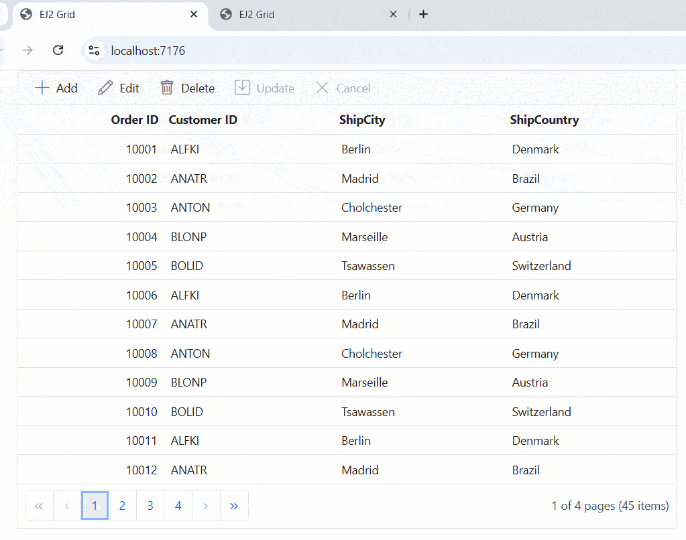
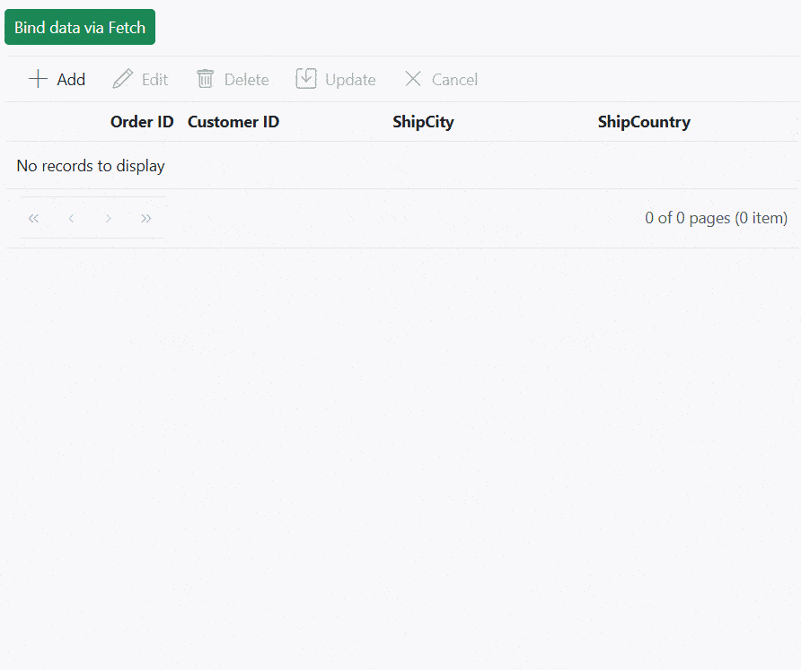

# Local data in ##Platform_Name## Grid control

The Syncfusion<sup style="font-size:70%">&reg;</sup> Grid offers a straight forward way to bind local data, such as arrays or JSON objects, to the grid control. This feature allows you to display and manipulate data within the grid without the need for external server calls, making it particularly useful for scenarios where you're working with static or locally stored data.

To achieve this, you can assign a JavaScript object array to the [dataSource](../../api/grid/#datasource) property. Additionally, you have an option to provide the local data source using an instance of the **DataManager**.

The following example demonstrates how to utilize the local data binding feature in the ##Platform_Name## Grid control:



 







        
















## Data binding with SignalR

The Syncfusion<sup style="font-size:70%">&reg;</sup> Grid provides support for real-time data binding using SignalR, allowing you to update the grid automatically as data changes on the server-side. This feature is particularly useful for applications requiring live updates and synchronization across multiple clients.

To achieve real-time data binding with SignalR in your Syncfusion<sup style="font-size:70%">&reg;</sup> ##Platform_Name## Grid, follow the steps below:




**Step 1:** Set up your development environment

Before you start, make sure you have the following installed:

- .NET Core SDK
- Node.js
- Visual Studio or any other preferred code editor

**Step 2:**  Open Visual Studio and create an ASP.NET Core Web API project named **signalR**. 

**Step 3:** Add the Microsoft.TypeScript.MSBuild NuGet package to the project:

In Solution Explorer, right-click the project node and select Manage NuGet Packages. In the Browse tab, search for [Microsoft.TypeScript.MSBuild](https://www.nuget.org/packages/Microsoft.TypeScript.MSBuild/) and then select Install on the right to install the package.

**Step 4:** Run the following command in the project root to create a `package.json` file:

```bash
npm init -y
```

**Step 5:** Replace the **scripts** property of `package.json` file with the following code:

```JSON
"scripts": {
  "build": "webpack --mode=development --watch",
  "release": "webpack --mode=production",
  "publish": "npm run release && dotnet publish -c Release"
},
```

**Step 6:** Create a folder named `wwwroot` in the project root directory. This folder will contain static files served by the web server.

**Step 7:** Install Webpack and Other Dependencies

```bash
npm i -D -E clean-webpack-plugin css-loader html-webpack-plugin mini-css-extract-plugin ts-loader typescript webpack webpack-cli
```

**Step 8:** Create a file named `webpack.config.js` in the project root, with the following code to configure the Webpack compilation process:

```js
const path = require("path");
const HtmlWebpackPlugin = require("html-webpack-plugin");
const { CleanWebpackPlugin } = require("clean-webpack-plugin");
const MiniCssExtractPlugin = require("mini-css-extract-plugin");

module.exports = {
    entry: "./src/index.ts",
    output: {
        path: path.resolve(__dirname, "wwwroot"),
        filename: "[name].[chunkhash].js",
        publicPath: "/",
    },
    resolve: {
        extensions: [".js", ".ts"],
    },
    module: {
        rules: [
            {
                test: /\.ts$/,
                use: "ts-loader",
            },
            {
                test: /\.css$/,
                use: [MiniCssExtractPlugin.loader, "css-loader"],
            },
        ],
    },
    plugins: [
        new CleanWebpackPlugin(),
        new HtmlWebpackPlugin({
            template: "./src/index.html",
        }),
        new MiniCssExtractPlugin({
            filename: "css/[name].[chunkhash].css",
        }),
    ],
};
```
**Step 9:** Open your terminal in the project root folder and install the required Syncfusion<sup style="font-size:70%">&reg;</sup> packages using npm:

```ts

npm install @syncfusion/ej2-grids --save
npm install @syncfusion/ej2-base --save

```

**Step 10:** Install the necessary SignalR package for your client application using npm:

```ts

 npm install @microsoft/signalr — save

```

**Step 11:** Create a new directory named `src` in the project root for the client code.

**Step 12:** Create `src/index.html` file and add the following code:

```html
<!DOCTYPE html>
<html lang="en">
<head>
    <title>EJ2 Grid</title>
    <meta charset="utf-8" />
    <meta name="viewport" content="width=device-width, initial-scale=1.0" />
    <meta name="description" content="Typescript Grid Control" />
    <meta name="author" content="Syncfusion" />
    <link href="https://cdn.syncfusion.com/ej2/27.148/ej2-base/styles/bootstrap5.css" rel="stylesheet" />
    <link href="https://cdn.syncfusion.com/ej2/27.148/ej2-grids/styles/bootstrap5.css" rel="stylesheet" />
    <link href="https://cdn.syncfusion.com/ej2/27.148/ej2-buttons/styles/bootstrap5.css" rel="stylesheet" />
    <link href="https://cdn.syncfusion.com/ej2/27.148/ej2-popups/styles/bootstrap5.css" rel="stylesheet" />
    <link href="https://cdn.syncfusion.com/ej2/27.148/ej2-richtexteditor/styles/bootstrap5.css" rel="stylesheet" />
    <link href="https://cdn.syncfusion.com/ej2/27.148/ej2-navigations/styles/bootstrap5.css" rel="stylesheet" />
    <link href="https://cdn.syncfusion.com/ej2/27.148/ej2-dropdowns/styles/bootstrap5.css" rel="stylesheet" />
    <link href="https://cdn.syncfusion.com/ej2/27.148/ej2-lists/styles/bootstrap5.css" rel="stylesheet" />
    <link href="https://cdn.syncfusion.com/ej2/27.148/ej2-inputs/styles/bootstrap5.css" rel="stylesheet" />
    <link href="https://cdn.syncfusion.com/ej2/27.148/ej2-calendars/styles/bootstrap5.css" rel="stylesheet" />
    <link href="https://cdn.syncfusion.com/ej2/27.148/ej2-notifications/styles/bootstrap5.css" rel="stylesheet" />
    <link href="https://cdn.syncfusion.com/ej2/27.148/ej2-splitbuttons/styles/bootstrap5.css" rel="stylesheet" />
    <script src="https://cdnjs.cloudflare.com/ajax/libs/systemjs/0.19.38/system.js"></script>
    <script src="https://cdn.syncfusion.com/ej2/syncfusion-helper.js" type="text/javascript"></script>
</head>
<body>
    <div id='container'>
        <div id='Grid'></div>
    </div>
</body>
</html>
```

**Step 13:** Create `src/index.ts` file. In your client-side code, establish a connection to the SignalR hub and configure grid data binding in the **index.ts** file.

```
import { Grid, Edit, Toolbar, EditEventArgs,Page } from '@syncfusion/ej2-grids';
import { DataManager, UrlAdaptor } from '@syncfusion/ej2-data';
import { HubConnection } from '@microsoft/signalr';
import * as signalR from '@microsoft/signalr';

Grid.Inject(Edit, Toolbar, Page);

let data: DataManager = new DataManager({
    url: 'https://localhost:****/api/Grid',
    insertUrl: 'https://localhost:****/api/Grid/Insert',
    updateUrl: 'https://localhost:****/api/Grid/Update',
    removeUrl: 'https://localhost:****/api/Grid/Remove',
    adaptor: new UrlAdaptor()
}); //Use remote server host instead number ****
let connection: HubConnection = new signalR.HubConnectionBuilder()
    .withUrl("https://localhost:****/ChatHub")  //Use remote server host instead number ****
    .build(); 
let grid: Grid = new Grid({
    dataSource: data,
    toolbar: ['Add', 'Edit', 'Delete', 'Update', 'Cancel', 'Search'],
    allowPaging: true,
    created: onCreated,
    actionComplete: actionComplete,
    editSettings: { allowEditing: true, allowAdding: true, allowDeleting: true, mode: 'Normal' },
    columns: [
        { field: 'OrderID', headerText: 'Order ID', textAlign: 'Right', width: 120, isPrimaryKey: true, type: 'number' },
        { field: 'CustomerID', width: 140, headerText: 'Customer ID', type: 'string' },
        { field: 'ShipCity', headerText: 'ShipCity', width: 140 },
        { field: 'ShipCountry', headerText: 'ShipCountry', width: 140 }
    ]
});

grid.appendTo('#Grid');

function onCreated() {
    connection.on("ReceiveMessage", (message: string) => {
        if (grid) {
            grid.refresh();
        }

    });
    connection.start()
        .then(() => {
            console.log("SignalR connection established successfully");
            connection.invoke('SendMessage', "refreshPages")
                .catch((err: Error) => {
                    console.error("Error sending data:", err.toString());
                });
        })
        .catch((err: Error) => {
            console.error("Error establishing SignalR connection:", err.toString());
        });
}
function actionComplete(args: EditEventArgs) {
    if (args.requestType === "save" || args.requestType === "delete") {
        connection.invoke('SendMessage', "refreshPages")
            .catch((err: Error) => {
                console.error(err.toString());
            });
    }
}

```

**Step 14:** Create `src/tsconfig.json` in the project and add the following content:

```json
{
  "compilerOptions": {
    "noImplicitAny": true,
    "noEmitOnError": true,
    "removeComments": false,
    "sourceMap": true,
    "target": "es5"
  },
  "exclude": [
    "node_modules",
    "wwwroot"
  ]
}
```

**Step 15:** Create a SignalR hub on the server-side to manage communication between clients and the server. You can create a **ChatHub.cs** file under the **Hubs** folder. Add the following code to define methods for sending data updates to clients:





using Microsoft.AspNetCore.SignalR;

namespace SignalRChat.Hubs
{
    public class ChatHub : Hub 
    {
        public async Task SendMessage(string message)
        {
            await Clients.All.SendAsync("ReceiveMessage", message);
        }
    }
}





**Step 16:** Configure the SignalR server to route requests to the SignalR hub. In the **Program.cs** file, add the following code:





using signalR.Hubs;

var builder = WebApplication.CreateBuilder(args);
builder.Services.AddSignalR(); // Add SignalR services

// Add services to the container.

builder.Services.AddControllers();
// Learn more about configuring Swagger/OpenAPI at https://aka.ms/aspnetcore/swashbuckle
builder.Services.AddEndpointsApiExplorer();
builder.Services.AddSwaggerGen();

var app = builder.Build();

// Configure the HTTP request pipeline.
if (app.Environment.IsDevelopment())
{
    app.UseSwagger();
    app.UseSwaggerUI();
}

app.UseHttpsRedirection();
app.UseDefaultFiles();
app.UseStaticFiles();
app.MapHub<ChatHub>("/chatHub"); // Map the ChatHub

app.UseAuthorization();

app.MapControllers();

app.Run();





**Step 17 :** Create a model class named **OrdersDetails.cs** under the **Models** folder in the server-side project to represent the order data. Add the following code.




 namespace signalR.Models
{
    public class OrdersDetails
    {
        public static List<OrdersDetails> order = new List<OrdersDetails>();
        public OrdersDetails()
        {

        }
        public OrdersDetails(
        int OrderID, string CustomerId, int EmployeeId, double Freight, bool Verified,
        DateTime OrderDate, string ShipCity, string ShipName, string ShipCountry,
        DateTime ShippedDate, string ShipAddress)
        {
            this.OrderID = OrderID;
            this.CustomerID = CustomerId;
            this.EmployeeID = EmployeeId;
            this.Freight = Freight;
            this.ShipCity = ShipCity;
            this.Verified = Verified;
            this.OrderDate = OrderDate;
            this.ShipName = ShipName;
            this.ShipCountry = ShipCountry;
            this.ShippedDate = ShippedDate;
            this.ShipAddress = ShipAddress;
        }

        public static List<OrdersDetails> GetAllRecords()
        {
            if (order.Count() == 0)
            {
                int code = 10000;
                for (int i = 1; i < 10; i++)
                {
                    order.Add(new OrdersDetails(code + 1, "ALFKI", i + 0, 2.3 * i, false, new DateTime(1991, 05, 15), "Berlin", "Simons bistro", "Denmark", new DateTime(1996, 7, 16), "Kirchgasse 6"));
                    order.Add(new OrdersDetails(code + 2, "ANATR", i + 2, 3.3 * i, true, new DateTime(1990, 04, 04), "Madrid", "Queen Cozinha", "Brazil", new DateTime(1996, 9, 11), "Avda. Azteca 123"));
                    order.Add(new OrdersDetails(code + 3, "ANTON", i + 1, 4.3 * i, true, new DateTime(1957, 11, 30), "Cholchester", "Frankenversand", "Germany", new DateTime(1996, 10, 7), "Carrera 52 con Ave. Bolívar #65-98 Llano Largo"));
                    order.Add(new OrdersDetails(code + 4, "BLONP", i + 3, 5.3 * i, false, new DateTime(1930, 10, 22), "Marseille", "Ernst Handel", "Austria", new DateTime(1996, 12, 30), "Magazinweg 7"));
                    order.Add(new OrdersDetails(code + 5, "BOLID", i + 4, 6.3 * i, true, new DateTime(1953, 02, 18), "Tsawassen", "Hanari Carnes", "Switzerland", new DateTime(1997, 12, 3), "1029 - 12th Ave. S."));
                    code += 5;
                }
            }
            return order;
        }

        public int? OrderID { get; set; }
        public string? CustomerID { get; set; }
        public int? EmployeeID { get; set; }
        public double? Freight { get; set; }
        public string? ShipCity { get; set; }
        public bool? Verified { get; set; }
        public DateTime OrderDate { get; set; }
        public string? ShipName { get; set; }
        public string? ShipCountry { get; set; }
        public DateTime ShippedDate { get; set; }
        public string? ShipAddress { get; set; }
    }
}




**Step 18:** Create a controller on the server-side to manage data operations such as fetching, updating, inserting, and deleting records. You can create a **GridController.cs** file under the **Controllers** folder. Add the following code to define methods for sending data updates to clients.



using Microsoft.AspNetCore.Mvc;
using Syncfusion.EJ2.Base;
using signalR.Models;

namespace siagnalR.Controllers
{
    [ApiController]
    public class GridController : Controller
    {
        [HttpPost]
        [Route("api/[controller]")]
        public object Post([FromBody] DataManagerRequest DataManagerRequest)
        {
            // Retrieve data from the data source (e.g., database)
            IQueryable<OrdersDetails> DataSource = GetOrderData().AsQueryable();

            QueryableOperation queryableOperation = new QueryableOperation(); // Initialize DataOperations instance

            // Handling searching operation
            if (DataManagerRequest.Search != null && DataManagerRequest.Search.Count > 0)
            {
                DataSource = queryableOperation.PerformSearching(DataSource, DataManagerRequest.Search);
            }

            // Handling filtering operation
            if (DataManagerRequest.Where != null && DataManagerRequest.Where.Count > 0)
            {
                foreach (var condition in DataManagerRequest.Where)
                {
                    foreach (var predicate in condition.predicates)
                    {
                        DataSource = queryableOperation.PerformFiltering(DataSource, DataManagerRequest.Where, predicate.Operator);
                    }
                }
            }

            // Handling sorting operation
            if (DataManagerRequest.Sorted != null && DataManagerRequest.Sorted.Count > 0)
            {
                DataSource = queryableOperation.PerformSorting(DataSource, DataManagerRequest.Sorted);
            }

            // Get the total count of records
            int totalRecordsCount = DataSource.Count();

            // Handling paging operation.
            if (DataManagerRequest.Skip != 0)
            {
                DataSource = queryableOperation.PerformSkip(DataSource, DataManagerRequest.Skip);
            }
            if (DataManagerRequest.Take != 0)
            {
                DataSource = queryableOperation.PerformTake(DataSource, DataManagerRequest.Take);
            }

            // Return data based on the request
            return new { result = DataSource, count = totalRecordsCount };
        }

        [HttpGet]
        [Route("api/[controller]")]
        public List<OrdersDetails> GetOrderData()
        {
            var data = OrdersDetails.GetAllRecords().ToList();
            return data;
        }

        /// <summary>
        /// Inserts a new data item into the data collection.
        /// </summary>
        /// <param name="newRecord">It contains the new record detail which is need to be inserted.</param>
        /// <returns>Returns void</returns>
        [HttpPost]
        [Route("api/Grid/Insert")]
        public void Insert([FromBody] CRUDModel<OrdersDetails> newRecord)
        {
            if (newRecord.value != null)
            {
                OrdersDetails.GetAllRecords().Insert(0, newRecord.value);
            }
        }

        /// <summary>
        /// Update a existing data item from the data collection.
        /// </summary>
        /// <param name="Order">It contains the updated record detail which is need to be updated.</param>
        /// <returns>Returns void</returns>
        [HttpPost]
        [Route("api/Grid/Update")]
        public void Update([FromBody] CRUDModel<OrdersDetails> Order)
        {
            var updatedOrder = Order.value;
            if (updatedOrder != null)
            {
                var data = OrdersDetails.GetAllRecords().FirstOrDefault(or => or.OrderID == updatedOrder.OrderID);
                if (data != null)
                {
                    // Update the existing record
                    data.OrderID = updatedOrder.OrderID;
                    data.CustomerID = updatedOrder.CustomerID;
                    data.ShipCity = updatedOrder.ShipCity;
                    data.ShipCountry = updatedOrder.ShipCountry;
                    // Update other properties similarly
                }
            }

        }
        /// <summary>
        /// Remove a specific data item from the data collection.
        /// </summary>
        /// <param name="value">It contains the specific record detail which is need to be removed.</param>
        /// <return>Returns void</return>
        [HttpPost]
        [Route("api/Grid/Remove")]
        public void Remove([FromBody] CRUDModel<OrdersDetails> value)
        {
            int orderId = int.Parse((value.key).ToString());
            var data = OrdersDetails.GetAllRecords().FirstOrDefault(orderData => orderData.OrderID == orderId);
            if (data != null)
            {
                // Remove the record from the data collection
                OrdersDetails.GetAllRecords().Remove(data);
            }
        }

        /// <summary>
        /// Perform all the CRUD operation at server-side using a single method instead of specifying separate controller action method for CRUD (insert, update and delete) operations.
        /// </summary>
        /// <param name="request"></param>
        [HttpPost]
        [Route("api/[controller]/CrudUpdate")]
        public void CrudUpdate([FromBody] CRUDModel<OrdersDetails> request)
        {
            if (request.action == "update")
            {
                // Update record
                var orderValue = request.value;
                OrdersDetails existingRecord = OrdersDetails.GetAllRecords().FirstOrDefault(or => or.OrderID == orderValue.OrderID);

                if (orderValue != null && existingRecord != null)
                {
                    existingRecord.OrderID = orderValue.OrderID;
                    existingRecord.CustomerID = orderValue.CustomerID;
                    existingRecord.ShipCity = orderValue.ShipCity;
                }

            }
            else if (request.action == "insert")
            {
                // Insert record
                if (request.value != null)
                {
                    OrdersDetails.GetAllRecords().Insert(0, request.value);
                }
            }
            else if (request.action == "remove")
            {
                // Delete record
                OrdersDetails.GetAllRecords().Remove(OrdersDetails.GetAllRecords().FirstOrDefault(or => or.OrderID == int.Parse(request.key.ToString())));
            }

        }
        [HttpPost]
        [Route("api/[controller]/BatchUpdate")]
        public IActionResult BatchUpdate([FromBody] CRUDModel<OrdersDetails> batchmodel)
        {
            if (batchmodel.added != null)
            {
                foreach (var addedOrder in batchmodel.added)
                {
                    OrdersDetails.GetAllRecords().Insert(0, addedOrder);
                }
            }
            if (batchmodel.changed != null)
            {
                foreach (var changedOrder in batchmodel.changed)
                {
                    var existingOrder = OrdersDetails.GetAllRecords().FirstOrDefault(or => or.OrderID == changedOrder.OrderID);
                    if (existingOrder != null)
                    {
                        existingOrder.CustomerID = changedOrder.CustomerID;
                        existingOrder.ShipCity = changedOrder.ShipCity;
                        existingOrder.ShipCountry = changedOrder.ShipCountry;
                        // Update other properties as needed
                    }
                }
            }
            if (batchmodel.deleted != null)
            {
                foreach (var deletedOrder in batchmodel.deleted)
                {
                    var orderToDelete = OrdersDetails.GetAllRecords().FirstOrDefault(or => or.OrderID == deletedOrder.OrderID);
                    if (orderToDelete != null)
                    {
                        OrdersDetails.GetAllRecords().Remove(orderToDelete);
                    }
                }
            }
            return Json(batchmodel);
        }


        public class CRUDModel<T> where T : class
        {

            public string? action { get; set; }

            public string? keyColumn { get; set; }

            public object? key { get; set; }

            public T? value { get; set; }

            public List<T>? added { get; set; }

            public List<T>? changed { get; set; }

            public List<T>? deleted { get; set; }

            public IDictionary<string, object>? @params { get; set; }
        }
    }
}




**Step 19:**  Comment out the below line in `launchSettings.json`:

```json
    "https": {
      "commandName": "Project",
      "dotnetRunMessages": true,
      "launchBrowser": true,
     // "launchUrl": "swagger",
      "applicationUrl": "https://localhost:xxxx;http://localhost:xxxx",
      "environmentVariables": {
        "ASPNETCORE_ENVIRONMENT": "Development"
      }
    },
```

**Step 20:**  Build the project using the following command:

```bash
npm run build
```

**Step 21:**  Run the project in Visual Studio.

The wwwroot/index.html file is served at https://localhost:xxxx.



**Step 1:** To create a new ASP.NET Core Web API project named **signalR**, follow these steps:

* Open Visual Studio.
* Select "Create a new project"
* Choose **ASP.NET Core Web API** project template.
* Name the project **signalR**.
* Click "Create"

**Step 2:** Create a folder named **wwwroot** in the project root directory. This folder will contain static files served by the web server.

**Step 3:** Install the SignalR Client Library by following these steps:

1. In Solution Explorer, right-click the project and choose Add > Client-Side Library.

2. In the Add Client-Side Library dialog:

   * Choose **unpkg** as the provider.
   * Type **@microsoft/signalr@latest** in the library field.
   * Choose Select specific files, expand dist/browser, and check **signalr.js** and **signalr.min.js**.
   * Specify wwwroot/js/signalr/* as the target location.
   * Click Install.

**Step 4:** Create an **index.html** file under the **wwwroot** folde and add the following code:





<!DOCTYPE html>
<html lang="en">
<head>
    <title>EJ2 Grid</title>
    <meta charset="utf-8">
    <meta name="viewport" content="width=device-width, initial-scale=1.0">
    <meta name="description" content="Javascript Grid Control">
    <meta name="author" content="Syncfusion">
    <link href="https://cdn.syncfusion.com/ej2/27.148/ej2-base/styles/bootstrap5.css" rel="stylesheet">
    <link href="https://cdn.syncfusion.com/ej2/27.148/ej2-grids/styles/bootstrap5.css" rel="stylesheet">
    <link href="https://cdn.syncfusion.com/ej2/27.148/ej2-buttons/styles/bootstrap5.css" rel="stylesheet">
    <link href="https://cdn.syncfusion.com/ej2/27.148/ej2-popups/styles/bootstrap5.css" rel="stylesheet">
    <link href="https://cdn.syncfusion.com/ej2/27.148/ej2-richtexteditor/styles/bootstrap5.css" rel="stylesheet">
    <link href="https://cdn.syncfusion.com/ej2/27.148/ej2-navigations/styles/bootstrap5.css" rel="stylesheet">
    <link href="https://cdn.syncfusion.com/ej2/27.148/ej2-dropdowns/styles/bootstrap5.css" rel="stylesheet">
    <link href="https://cdn.syncfusion.com/ej2/27.148/ej2-lists/styles/bootstrap5.css" rel="stylesheet">
    <link href="https://cdn.syncfusion.com/ej2/27.148/ej2-inputs/styles/bootstrap5.css" rel="stylesheet">
    <link href="https://cdn.syncfusion.com/ej2/27.148/ej2-calendars/styles/bootstrap5.css" rel="stylesheet">
    <link href="https://cdn.syncfusion.com/ej2/27.148/ej2-notifications/styles/bootstrap5.css" rel="stylesheet">
    <link href="https://cdn.syncfusion.com/ej2/27.148/ej2-splitbuttons/styles/bootstrap5.css" rel="stylesheet">
    <script src="https://cdnjs.cloudflare.com/ajax/libs/systemjs/0.19.38/system.js"></script>
    <script src="https://cdn.syncfusion.com/ej2/27.148/dist/ej2.min.js" type="text/javascript"></script>
    <script src="https://cdn.syncfusion.com/ej2/syncfusion-helper.js" type="text/javascript"></script>
</head>
<body>
        <div id="container">
            <div id="Grid"></div>
        </div>
    <script src="js/microsoft/signalr/dist/browser/signalr.js"></script>
    <script src="js/index.js" type="text/javascript"></script>
</body>
</html>





**Step 5:**  Create a **js** folder under the **wwwroot** folder, then create an **index.js** file within the **js** folder. In your client-side code, establish a connection to the SignalR hub and configure grid data binding in the **index.js** file.

```
let data = new ej.data.DataManager({
    url: 'https://localhost:****/api/Grid',
    insertUrl: 'https://localhost:****/api/Grid/Insert',
    updateUrl: 'https://localhost:****/api/Grid/Update',
    removeUrl: 'https://localhost:****/api/Grid/Remove',
    adaptor: new ej.data.UrlAdaptor()
});//Use remote server host instead number ****
let connection = new signalR.HubConnectionBuilder()
    .withUrl("https://localhost:****/ChatHub")  //Use remote server host instead number ****
    .build();

var grid = new ej.grids.Grid({
    dataSource:data,
    toolbar: ['Add', 'Edit', 'Delete', 'Update', 'Cancel'],
    allowPaging: true,
    actionComplete: actionComplete,
    created: onCreated,
    editSettings: { allowEditing: true, allowAdding: true, allowDeleting: true, mode: 'Normal' },
    columns: [
        { field: 'OrderID', headerText: 'Order ID', textAlign: 'Right', width: 120, isPrimaryKey: true, type: 'number' },
        { field: 'CustomerID', width: 140, headerText: 'Customer ID', type: 'string' },
        { field: 'ShipCity', headerText: 'ShipCity', width: 140 },
        { field: 'ShipCountry', headerText: 'ShipCountry', width: 140 }
    ]
});
grid.appendTo('#Grid');

function onCreated() {
    connection.on("ReceiveMessage", (message) => {
        if (grid) {
            grid.refresh();
        }

    });
    connection.start()
        .then(() => {
            console.log("SignalR connection established successfully");
            connection.invoke('SendMessage', "refreshPages")
                .catch((err) => {
                    console.error("Error sending data:", err.toString());
                });
        })
        .catch((err) => {
            console.error("Error establishing SignalR connection:", err.toString());
        });
}
function actionComplete(args) {
    if (args.requestType === "save" || args.requestType === "delete") {
        connection.invoke('SendMessage', "refreshPages")
            .catch((err) => {
                console.error(err.toString());
            });
    }
}

```

**Step 6:** Create a SignalR hub on the server-side to manage communication between clients and the server. You can create a **ChatHub.cs** file under the **Hubs** folder. Add the following code to define methods for sending data updates to clients:





using Microsoft.AspNetCore.SignalR;

namespace SignalRChat.Hubs
{
    public class ChatHub : Hub 
    {
        public async Task SendMessage(string message)
        {
            await Clients.All.SendAsync("ReceiveMessage", message);
        }
    }
}





**Step 7:** Configure the SignalR server to route requests to the SignalR hub. In the **Program.cs** file, add the following code:





using signalR.Hubs;

var builder = WebApplication.CreateBuilder(args);
builder.Services.AddSignalR(); // Add SignalR services

// Add services to the container.

builder.Services.AddControllers();
// Learn more about configuring Swagger/OpenAPI at https://aka.ms/aspnetcore/swashbuckle
builder.Services.AddEndpointsApiExplorer();
builder.Services.AddSwaggerGen();

var app = builder.Build();

// Configure the HTTP request pipeline.
if (app.Environment.IsDevelopment())
{
    app.UseSwagger();
    app.UseSwaggerUI();
}

app.UseHttpsRedirection();
app.UseDefaultFiles();
app.UseStaticFiles();
app.MapHub<ChatHub>("/chatHub"); // Map the ChatHub

app.UseAuthorization();

app.MapControllers();

app.Run();





**Step 8 :** Create a model class named **OrdersDetails.cs** under the **Models** folder in the server-side project to represent the order data. Add the following code.




 namespace signalR.Models
{
    public class OrdersDetails
    {
        public static List<OrdersDetails> order = new List<OrdersDetails>();
        public OrdersDetails()
        {

        }
        public OrdersDetails(
        int OrderID, string CustomerId, int EmployeeId, double Freight, bool Verified,
        DateTime OrderDate, string ShipCity, string ShipName, string ShipCountry,
        DateTime ShippedDate, string ShipAddress)
        {
            this.OrderID = OrderID;
            this.CustomerID = CustomerId;
            this.EmployeeID = EmployeeId;
            this.Freight = Freight;
            this.ShipCity = ShipCity;
            this.Verified = Verified;
            this.OrderDate = OrderDate;
            this.ShipName = ShipName;
            this.ShipCountry = ShipCountry;
            this.ShippedDate = ShippedDate;
            this.ShipAddress = ShipAddress;
        }

        public static List<OrdersDetails> GetAllRecords()
        {
            if (order.Count() == 0)
            {
                int code = 10000;
                for (int i = 1; i < 10; i++)
                {
                    order.Add(new OrdersDetails(code + 1, "ALFKI", i + 0, 2.3 * i, false, new DateTime(1991, 05, 15), "Berlin", "Simons bistro", "Denmark", new DateTime(1996, 7, 16), "Kirchgasse 6"));
                    order.Add(new OrdersDetails(code + 2, "ANATR", i + 2, 3.3 * i, true, new DateTime(1990, 04, 04), "Madrid", "Queen Cozinha", "Brazil", new DateTime(1996, 9, 11), "Avda. Azteca 123"));
                    order.Add(new OrdersDetails(code + 3, "ANTON", i + 1, 4.3 * i, true, new DateTime(1957, 11, 30), "Cholchester", "Frankenversand", "Germany", new DateTime(1996, 10, 7), "Carrera 52 con Ave. Bolívar #65-98 Llano Largo"));
                    order.Add(new OrdersDetails(code + 4, "BLONP", i + 3, 5.3 * i, false, new DateTime(1930, 10, 22), "Marseille", "Ernst Handel", "Austria", new DateTime(1996, 12, 30), "Magazinweg 7"));
                    order.Add(new OrdersDetails(code + 5, "BOLID", i + 4, 6.3 * i, true, new DateTime(1953, 02, 18), "Tsawassen", "Hanari Carnes", "Switzerland", new DateTime(1997, 12, 3), "1029 - 12th Ave. S."));
                    code += 5;
                }
            }
            return order;
        }

        public int? OrderID { get; set; }
        public string? CustomerID { get; set; }
        public int? EmployeeID { get; set; }
        public double? Freight { get; set; }
        public string? ShipCity { get; set; }
        public bool? Verified { get; set; }
        public DateTime OrderDate { get; set; }
        public string? ShipName { get; set; }
        public string? ShipCountry { get; set; }
        public DateTime ShippedDate { get; set; }
        public string? ShipAddress { get; set; }
    }
}




**Step 9:** Create a controller on the server-side to manage data operations such as fetching, updating, inserting, and deleting records. You can create a **GridController.cs** file under the **Controllers** folder. Add the following code to define methods for sending data updates to clients.



using Microsoft.AspNetCore.Mvc;
using Syncfusion.EJ2.Base;
using signalR.Models;

namespace siagnalR.Controllers
{
    [ApiController]
    public class GridController : Controller
    {
        [HttpPost]
        [Route("api/[controller]")]
        public object Post([FromBody] DataManagerRequest DataManagerRequest)
        {
            // Retrieve data from the data source (e.g., database)
            IQueryable<OrdersDetails> DataSource = GetOrderData().AsQueryable();

            QueryableOperation queryableOperation = new QueryableOperation(); // Initialize DataOperations instance

            // Handling searching operation
            if (DataManagerRequest.Search != null && DataManagerRequest.Search.Count > 0)
            {
                DataSource = queryableOperation.PerformSearching(DataSource, DataManagerRequest.Search);
            }

            // Handling filtering operation
            if (DataManagerRequest.Where != null && DataManagerRequest.Where.Count > 0)
            {
                foreach (var condition in DataManagerRequest.Where)
                {
                    foreach (var predicate in condition.predicates)
                    {
                        DataSource = queryableOperation.PerformFiltering(DataSource, DataManagerRequest.Where, predicate.Operator);
                    }
                }
            }

            // Handling sorting operation
            if (DataManagerRequest.Sorted != null && DataManagerRequest.Sorted.Count > 0)
            {
                DataSource = queryableOperation.PerformSorting(DataSource, DataManagerRequest.Sorted);
            }

            // Get the total count of records
            int totalRecordsCount = DataSource.Count();

            // Handling paging operation.
            if (DataManagerRequest.Skip != 0)
            {
                DataSource = queryableOperation.PerformSkip(DataSource, DataManagerRequest.Skip);
            }
            if (DataManagerRequest.Take != 0)
            {
                DataSource = queryableOperation.PerformTake(DataSource, DataManagerRequest.Take);
            }

            // Return data based on the request
            return new { result = DataSource, count = totalRecordsCount };
        }

        [HttpGet]
        [Route("api/[controller]")]
        public List<OrdersDetails> GetOrderData()
        {
            var data = OrdersDetails.GetAllRecords().ToList();
            return data;
        }

        /// <summary>
        /// Inserts a new data item into the data collection.
        /// </summary>
        /// <param name="newRecord">It contains the new record detail which is need to be inserted.</param>
        /// <returns>Returns void</returns>
        [HttpPost]
        [Route("api/Grid/Insert")]
        public void Insert([FromBody] CRUDModel<OrdersDetails> newRecord)
        {
            if (newRecord.value != null)
            {
                OrdersDetails.GetAllRecords().Insert(0, newRecord.value);
            }
        }

        /// <summary>
        /// Update a existing data item from the data collection.
        /// </summary>
        /// <param name="Order">It contains the updated record detail which is need to be updated.</param>
        /// <returns>Returns void</returns>
        [HttpPost]
        [Route("api/Grid/Update")]
        public void Update([FromBody] CRUDModel<OrdersDetails> Order)
        {
            var updatedOrder = Order.value;
            if (updatedOrder != null)
            {
                var data = OrdersDetails.GetAllRecords().FirstOrDefault(or => or.OrderID == updatedOrder.OrderID);
                if (data != null)
                {
                    // Update the existing record
                    data.OrderID = updatedOrder.OrderID;
                    data.CustomerID = updatedOrder.CustomerID;
                    data.ShipCity = updatedOrder.ShipCity;
                    data.ShipCountry = updatedOrder.ShipCountry;
                    // Update other properties similarly
                }
            }

        }
        /// <summary>
        /// Remove a specific data item from the data collection.
        /// </summary>
        /// <param name="value">It contains the specific record detail which is need to be removed.</param>
        /// <return>Returns void</return>
        [HttpPost]
        [Route("api/Grid/Remove")]
        public void Remove([FromBody] CRUDModel<OrdersDetails> value)
        {
            int orderId = int.Parse((value.key).ToString());
            var data = OrdersDetails.GetAllRecords().FirstOrDefault(orderData => orderData.OrderID == orderId);
            if (data != null)
            {
                // Remove the record from the data collection
                OrdersDetails.GetAllRecords().Remove(data);
            }
        }

        /// <summary>
        /// Perform all the CRUD operation at server-side using a single method instead of specifying separate controller action method for CRUD (insert, update and delete) operations.
        /// </summary>
        /// <param name="request"></param>
        [HttpPost]
        [Route("api/[controller]/CrudUpdate")]
        public void CrudUpdate([FromBody] CRUDModel<OrdersDetails> request)
        {
            if (request.action == "update")
            {
                // Update record
                var orderValue = request.value;
                OrdersDetails existingRecord = OrdersDetails.GetAllRecords().FirstOrDefault(or => or.OrderID == orderValue.OrderID);

                if (orderValue != null && existingRecord != null)
                {
                    existingRecord.OrderID = orderValue.OrderID;
                    existingRecord.CustomerID = orderValue.CustomerID;
                    existingRecord.ShipCity = orderValue.ShipCity;
                }

            }
            else if (request.action == "insert")
            {
                // Insert record
                if (request.value != null)
                {
                    OrdersDetails.GetAllRecords().Insert(0, request.value);
                }
            }
            else if (request.action == "remove")
            {
                // Delete record
                OrdersDetails.GetAllRecords().Remove(OrdersDetails.GetAllRecords().FirstOrDefault(or => or.OrderID == int.Parse(request.key.ToString())));
            }

        }
        [HttpPost]
        [Route("api/[controller]/BatchUpdate")]
        public IActionResult BatchUpdate([FromBody] CRUDModel<OrdersDetails> batchmodel)
        {
            if (batchmodel.added != null)
            {
                foreach (var addedOrder in batchmodel.added)
                {
                    OrdersDetails.GetAllRecords().Insert(0, addedOrder);
                }
            }
            if (batchmodel.changed != null)
            {
                foreach (var changedOrder in batchmodel.changed)
                {
                    var existingOrder = OrdersDetails.GetAllRecords().FirstOrDefault(or => or.OrderID == changedOrder.OrderID);
                    if (existingOrder != null)
                    {
                        existingOrder.CustomerID = changedOrder.CustomerID;
                        existingOrder.ShipCity = changedOrder.ShipCity;
                        existingOrder.ShipCountry = changedOrder.ShipCountry;
                        // Update other properties as needed
                    }
                }
            }
            if (batchmodel.deleted != null)
            {
                foreach (var deletedOrder in batchmodel.deleted)
                {
                    var orderToDelete = OrdersDetails.GetAllRecords().FirstOrDefault(or => or.OrderID == deletedOrder.OrderID);
                    if (orderToDelete != null)
                    {
                        OrdersDetails.GetAllRecords().Remove(orderToDelete);
                    }
                }
            }
            return Json(batchmodel);
        }


        public class CRUDModel<T> where T : class
        {

            public string? action { get; set; }

            public string? keyColumn { get; set; }

            public object? key { get; set; }

            public T? value { get; set; }

            public List<T>? added { get; set; }

            public List<T>? changed { get; set; }

            public List<T>? deleted { get; set; }

            public IDictionary<string, object>? @params { get; set; }
        }
    }
}




**Step 10:**  Comment out the below line in `launchSettings.json`:

```json
    "https": {
      "commandName": "Project",
      "dotnetRunMessages": true,
      "launchBrowser": true,
     // "launchUrl": "swagger",
      "applicationUrl": "https://localhost:xxxx;http://localhost:xxxx",
      "environmentVariables": {
        "ASPNETCORE_ENVIRONMENT": "Development"
      }
    },
```




The following screenshot represents the addition, editing, and deletion operations performed, reflecting changes across all client sides.






> You can find a complete sample for signalR on [GitHub](https://github.com/SyncfusionExamples/Binding-data-with-SignalR-in-ej2-typescript-grid).

 


> You can find a complete sample for signalR on [GitHub](https://github.com/SyncfusionExamples/Binding-data-with-SignalR-in-ej2-javascript-grid).


> * In an API service project, add `Syncfusion.EJ2.AspNet.Core` by opening the NuGet package manager in Visual Studio (Tools → NuGet Package Manager → Manage NuGet Packages for Solution), search and install it.

> * To access [DataManagerRequest](https://help.syncfusion.com/cr/aspnetmvc-js2/Syncfusion.EJ2.Base.DataManagerRequest.html) and [QueryableOperation](https://help.syncfusion.com/cr/aspnetmvc-js2/Syncfusion.EJ2.Base.QueryableOperation.html), import `Syncfusion.EJ2.Base` in `GridController.cs` file.


## Binding data from excel file


 
The Syncfusion<sup style="font-size:70%">&reg;</sup> Grid control allows you to import data from Excel files into your web application for display and manipulation within the grid. This feature streamlines the process of transferring Excel data to a web-based environment. This can be achieved by using [Uploader](../../uploader/getting-started) control [change](../../api/uploader#change) event.

 
 
The Syncfusion<sup style="font-size:70%">&reg;</sup> Grid control allows you to import data from Excel files into your web application for display and manipulation within the grid. This feature streamlines the process of transferring Excel data to a web-based environment. This can be achieved by using [Uploader](../../uploader/es5-getting-started) control [change](../../api/uploader#change) event. 



To bind data from an Excel file to a Syncfusion<sup style="font-size:70%">&reg;</sup> Grid control, including the xlsx library via a script tag in an HTML page

```html
<script type="text/javascript" src="https://unpkg.com/xlsx@0.15.1/dist/xlsx.full.min.js"></script>
```

To import excel data in to grid, you can follow these steps:

1. Import excel file using Uploader control. 
2. Parse the excel file data using **XLSX** library.
3. Bind the JSON to the grid control. 


 
The following example demonstrates how to import Excel data into the grid by utilizing the [Uploader](../../uploader/getting-started) control's `change` event along with the **XLSX** library:

 
 
The following example demonstrates how to import Excel data into the grid by utilizing the [Uploader](../../uploader/es5-getting-started) control's `change` event along with the **XLSX** library:





 







        
















## Binding data and performing CRUD actions via Fetch request

The Syncfusion<sup style="font-size:70%">&reg;</sup> Grid provides a seamless way to bind data from external sources using Fetch requests, facilitating CRUD (Create, Read, Update, Delete) operations with data retrieved from a server. This feature is particularly valuable for sending data to a server for database updates and asynchronously retrieving data without refreshing the entire web page.

To achieve data binding and perform CRUD actions using Fetch requests in the Syncfusion<sup style="font-size:70%">&reg;</sup> Grid, follow these steps:




**Step 1:** Set up your development environment

Before you start, make sure you have the following installed:

- .NET Core SDK
- Node.js
- Visual Studio or any other preferred code editor

**Step 2:**  Open Visual Studio and create an ASP.NET Core Web API project named **FetchRequest**. 

**Step 3:** Add the Microsoft.TypeScript.MSBuild NuGet package to the project:

In Solution Explorer, right-click the project node and select Manage NuGet Packages. In the Browse tab, search for [Microsoft.TypeScript.MSBuild](https://www.nuget.org/packages/Microsoft.TypeScript.MSBuild/) and then select Install on the right to install the package.

**Step 4:** Run the following command in the project root to create a `package.json` file:

```bash
npm init -y
```

**Step 5:** Replace the **scripts** property of `package.json` file with the following code:

```JSON
"scripts": {
  "build": "webpack --mode=development --watch",
  "release": "webpack --mode=production",
  "publish": "npm run release && dotnet publish -c Release"
},
```

**Step 6:** Create a folder named `wwwroot` in the project root directory. This folder will contain static files served by the web server.

**Step 7:** Install Webpack and Other Dependencies

```bash
npm i -D -E clean-webpack-plugin css-loader html-webpack-plugin mini-css-extract-plugin ts-loader typescript webpack webpack-cli
```

**Step 8:** Create a file named `webpack.config.js` in the project root, with the following code to configure the Webpack compilation process:





const path = require("path");
const HtmlWebpackPlugin = require("html-webpack-plugin");
const { CleanWebpackPlugin } = require("clean-webpack-plugin");
const MiniCssExtractPlugin = require("mini-css-extract-plugin");

module.exports = {
    entry: "./src/index.ts",
    output: {
        path: path.resolve(__dirname, "wwwroot"),
        filename: "[name].[chunkhash].js",
        publicPath: "/",
    },
    resolve: {
        extensions: [".js", ".ts"],
    },
    module: {
        rules: [
            {
                test: /\.ts$/,
                use: "ts-loader",
            },
            {
                test: /\.css$/,
                use: [MiniCssExtractPlugin.loader, "css-loader"],
            },
        ],
    },
    plugins: [
        new CleanWebpackPlugin(),
        new HtmlWebpackPlugin({
            template: "./src/index.html",
        }),
        new MiniCssExtractPlugin({
            filename: "css/[name].[chunkhash].css",
        }),
    ],
};




**Step 9:** Create `src/tsconfig.json` in the project and add the following content:

```json
{
  "compilerOptions": {
    "noImplicitAny": false,
    "noEmitOnError": true,
    "removeComments": false,
    "sourceMap": true,
    "target": "es5"
  },
  "exclude": [
    "node_modules",
    "wwwroot"
  ]
}
```

**Step 10:**  Comment out the below line in `launchSettings.json`:

```json
    "https": {
      "commandName": "Project",
      "dotnetRunMessages": true,
      "launchBrowser": true,
     // "launchUrl": "swagger",
      "applicationUrl": "https://localhost:xxxx;http://localhost:xxxx",
      "environmentVariables": {
        "ASPNETCORE_ENVIRONMENT": "Development"
      }
    },
```

**Step 11:**  In the **Program.cs** file, add the following code:





var builder = WebApplication.CreateBuilder(args);

// Add services to the container.

builder.Services.AddControllers();
// Learn more about configuring Swagger/OpenAPI at https://aka.ms/aspnetcore/swashbuckle
builder.Services.AddEndpointsApiExplorer();
builder.Services.AddSwaggerGen();

var app = builder.Build();

// Configure the HTTP request pipeline.
if (app.Environment.IsDevelopment())
{
    app.UseSwagger();
    app.UseSwaggerUI();
}

app.UseHttpsRedirection();

app.UseAuthorization();
app.UseDefaultFiles();
app.MapControllerRoute(
    name: "default",
    pattern: "{controller=Grid}/{action=Index}");
app.UseStaticFiles();
app.MapControllers();

app.Run();





**Step 12:** Open your terminal in the project root folder and install the required Syncfusion<sup style="font-size:70%">&reg;</sup> packages using npm:

```ts

npm install @syncfusion/ej2-grids --save
npm install @syncfusion/ej2-base --save
npm install @syncfusion/ej2-buttons --save

```

**Step 13:** Create a new directory named `src` in the project root for the client code.

**Step 14:** Create `src/index.html` file and add the following code:





<!DOCTYPE html>
<html lang="en">
<head>
    <title>EJ2 Grid</title>
    <meta charset="utf-8" />
    <meta name="viewport" content="width=device-width, initial-scale=1.0" />
    <meta name="description" content="Typescript Grid Control" />
    <meta name="author" content="Syncfusion" />
    <link href="https://cdn.syncfusion.com/ej2/27.148/ej2-base/styles/bootstrap5.css" rel="stylesheet" />
    <link href="https://cdn.syncfusion.com/ej2/27.148/ej2-grids/styles/bootstrap5.css" rel="stylesheet" />
    <link href="https://cdn.syncfusion.com/ej2/27.148/ej2-buttons/styles/bootstrap5.css" rel="stylesheet" />
    <link href="https://cdn.syncfusion.com/ej2/27.148/ej2-popups/styles/bootstrap5.css" rel="stylesheet" />
    <link href="https://cdn.syncfusion.com/ej2/27.148/ej2-richtexteditor/styles/bootstrap5.css" rel="stylesheet" />
    <link href="https://cdn.syncfusion.com/ej2/27.148/ej2-navigations/styles/bootstrap5.css" rel="stylesheet" />
    <link href="https://cdn.syncfusion.com/ej2/27.148/ej2-dropdowns/styles/bootstrap5.css" rel="stylesheet" />
    <link href="https://cdn.syncfusion.com/ej2/27.148/ej2-lists/styles/bootstrap5.css" rel="stylesheet" />
    <link href="https://cdn.syncfusion.com/ej2/27.148/ej2-inputs/styles/bootstrap5.css" rel="stylesheet" />
    <link href="https://cdn.syncfusion.com/ej2/27.148/ej2-calendars/styles/bootstrap5.css" rel="stylesheet" />
    <link href="https://cdn.syncfusion.com/ej2/27.148/ej2-notifications/styles/bootstrap5.css" rel="stylesheet" />
    <link href="https://cdn.syncfusion.com/ej2/27.148/ej2-splitbuttons/styles/bootstrap5.css" rel="stylesheet" />
    <link rel="stylesheet" href="https://stackpath.bootstrapcdn.com/bootstrap/4.1.2/css/bootstrap.min.css">
    <script src="https://cdnjs.cloudflare.com/ajax/libs/systemjs/0.19.38/system.js"></script>
    <script src="https://cdn.syncfusion.com/ej2/syncfusion-helper.js" type="text/javascript"></script>
</head>
<body>
    <div id='container'>
        <div style="padding-bottom: 10px; padding-top:10px">
            <button ejs-button id="buttons" cssClass="e-small"></button>
        </div>
        <div id='Grid'></div>
    </div>
</body>
</html>





**Step 15:** Create an **index.ts** file in the **src** folder and follow the steps below.

A. To bind data from an external Fetch request, utilize the [dataSource](../api/grid/#datasource) property of the Grid. Fetch data from the server and provide it to the `dataSource` property using the `onSuccess` event of the Fetch request.

B. To perform CRUD actions, leverage the [actionBegin](../api/grid/#actionbegin) event. You can cancel the default CRUD operations by utilizing the **cancel** argument provided by this event. This allows you to dynamically call your server-side method using Fetch, along with the relevant data received from the `actionBegin` event, to update your server data accordingly.

C. In the Fetch success event, you have the flexibility to utilize the Grid [endEdit](../api/grid/#endedit) and [deleteRecord](../api/grid/#deleterecord) methods to handle the addition, editing, and deletion of corresponding data in the Grid. However, invoking these methods triggers the `actionBegin` event once again to save the changes in the Grid. To prevent this behavior and maintain control over the execution flow, you can employ a flag variable and manage it within the `actionComplete` and Fetch failure events: The following code snippet demonstrates this approach:





import { Grid, Edit, Toolbar, EditEventArgs, Page } from '@syncfusion/ej2-grids';
import { Button } from '@syncfusion/ej2-buttons';
import { Fetch } from '@syncfusion/ej2-base';

Grid.Inject(Edit, Toolbar, Page);

let flag: Boolean = false;

let grid: Grid = new Grid({
    toolbar: ['Add', 'Edit', 'Delete', 'Update', 'Cancel'],
    allowPaging: true,
    actionBegin : actionBegin,
    actionComplete:actionComplete,
    editSettings: { allowEditing: true, allowAdding: true, allowDeleting: true, mode: 'Normal' },
    columns: [
        { field: 'OrderID', headerText: 'Order ID', textAlign: 'Right', width: 120, isPrimaryKey: true, type: 'number' },
        { field: 'CustomerID', width: 140, headerText: 'Customer ID', type: 'string' },
        { field: 'ShipCity', headerText: 'ShipCity', width: 140 },
        { field: 'ShipCountry', headerText: 'ShipCountry', width: 140 }
    ]
});

grid.appendTo('#Grid');

let button: Button = new Button({
    content: 'Bind data via Fetch',
    cssClass:'e-success'
});
button.appendTo('#buttons');

(document.getElementById('buttons') as HTMLElement).onclick = function () {
    const fetchRequest = new Fetch("https://localhost:****/Grid/Getdata", 'POST');//Use remote server host number instead ****
    fetchRequest.send();
    fetchRequest.onSuccess = (data) => {
        grid.dataSource = data;
    };
};

function actionComplete(e: EditEventArgs) {
    if (e.requestType === 'save' || e.requestType === 'delete') {
        flag = false;
    }
}
function actionBegin(e: EditEventArgs) {

    if (!flag) {
         //To add and save a new record using Fetch requests
        if (e.requestType == 'save' && ((e as any).action == 'add')) {
            var editedData = (e as any).data;
            e.cancel = true;
            var fetchRequest = new Fetch({
                url: 'https://localhost:****/Grid/Insert', //Use remote server host instead number ****
                type: 'POST',
                contentType: 'application/json; charset=utf-8',
                data: JSON.stringify({ value: editedData })
            });
            fetchRequest.onSuccess = () => {
                flag = true;
                grid.endEdit();
            };
            fetchRequest.onFailure = () => {
                flag = false;
            };
            fetchRequest.send();
        }
        // To edit and save a record using an Fetch request
        if (e.requestType == 'save' && ((e as any).action == "edit")) {
            var editedData = (e as any).data;
            e.cancel = true;
            var fetchRequest = new Fetch({
                url: 'https://localhost:****/Grid/Update', //Use remote server host instead number ****
                type: 'POST',
                contentType: 'application/json; charset=utf-8',
                data: JSON.stringify({ value: editedData })
            });
            fetchRequest.onSuccess = () => {
                flag = true;
                grid.endEdit();
            };
            fetchRequest.onFailure = () => {
                flag = false;
            };
            fetchRequest.send();
        }
        //To delete a record using an Fetch request,

        if (e.requestType == 'delete') {
            var editedData = (e as any).data;
            e.cancel = true;
            var fetchRequest = new Fetch({
                url: 'https://localhost:****/Grid/Delete', //Use remote server host instead number ****
                type: 'POST',
                contentType: 'application/json; charset=utf-8',
                data: JSON.stringify({ key: editedData[0][grid.getPrimaryKeyFieldNames()[0]] })
            });
            fetchRequest.onSuccess = () => {
                flag = true;
                grid.deleteRecord();
            };
            fetchRequest.onFailure = () => {
                flag = false;
            };
            fetchRequest.send();
        }
    }
}





**Step 16:**  Create a **GridController.cs** file in the **Controllers** folder. On the server side, there is a method named **GetData** within the GridController that provides the data source for the grid. When the button is clicked, a Fetch request is sent to retrieve the data from the server and bind it to the Grid component. Additionally, implement server-side logic to perform add, edit, and delete operations.





using FetchRequest.Models;
using Microsoft.AspNetCore.Mvc;

namespace FetchRequest.Controllers
{
    public class GridController : Controller
    {

        public ActionResult Getdata()
        {
            var DataSource = OrdersDetails.GetAllRecords();
            return Json(DataSource);
        }
        //update the record in server side
        public ActionResult Update([FromBody] CRUDModel<OrdersDetails> value)
        {
            var ord = value.value;
            OrdersDetails val = OrdersDetails.GetAllRecords().Where(or => or.OrderID == ord.OrderID).FirstOrDefault();
            val.OrderID = ord.OrderID;
            val.EmployeeID = ord.EmployeeID;
            val.CustomerID = ord.CustomerID;
            val.Freight = ord.Freight;
            val.OrderDate = ord.OrderDate;
            val.ShipCity = ord.ShipCity;
            val.ShipCountry = ord.ShipCountry;

            return Json(value.value);
        }


        //insert the record
        public ActionResult Insert([FromBody] CRUDModel<OrdersDetails> value)
        {

            OrdersDetails.GetAllRecords().Insert(0, value.value);
            return Json(value.value);
        }

        //Delete the record
        public ActionResult Delete(int key)
        {
            OrdersDetails.GetAllRecords().Remove(OrdersDetails.GetAllRecords().Where(or => or.OrderID == key).FirstOrDefault());
            var data = OrdersDetails.GetAllRecords();
            return Json(data);
        }
    }

}

public class CRUDModel<T> where T : class
{
    public string action { get; set; }
    public string table { get; set; }
    public string keyColumn { get; set; }
    public object key { get; set; }
    public T value { get; set; }
    public List<T> added { get; set; }
    public List<T> changed { get; set; }
    public List<T> deleted { get; set; }
    public IDictionary<string, object> @params { get; set; }
}





**Step 17:** Create a model class named **OrdersDetails.cs** under the **Models** folder in the server-side project to represent the order data.  





namespace FetchRequest.Models
{
    public class OrdersDetails
    {
        public static List<OrdersDetails> order = new List<OrdersDetails>();
        public OrdersDetails()
        {

        }
        public OrdersDetails(
        int OrderID, string CustomerId, int EmployeeId, double Freight, bool Verified,
        DateTime OrderDate, string ShipCity, string ShipName, string ShipCountry,
        DateTime ShippedDate, string ShipAddress)
        {
            this.OrderID = OrderID;
            this.CustomerID = CustomerId;
            this.EmployeeID = EmployeeId;
            this.Freight = Freight;
            this.ShipCity = ShipCity;
            this.Verified = Verified;
            this.OrderDate = OrderDate;
            this.ShipName = ShipName;
            this.ShipCountry = ShipCountry;
            this.ShippedDate = ShippedDate;
            this.ShipAddress = ShipAddress;
        }

        public static List<OrdersDetails> GetAllRecords()
        {
            if (order.Count() == 0)
            {
                int code = 10000;
                for (int i = 1; i < 10; i++)
                {
                    order.Add(new OrdersDetails(code + 1, "ALFKI", i + 0, 2.3 * i, false, new DateTime(1991, 05, 15), "Berlin", "Simons bistro", "Denmark", new DateTime(1996, 7, 16), "Kirchgasse 6"));
                    order.Add(new OrdersDetails(code + 2, "ANATR", i + 2, 3.3 * i, true, new DateTime(1990, 04, 04), "Madrid", "Queen Cozinha", "Brazil", new DateTime(1996, 9, 11), "Avda. Azteca 123"));
                    order.Add(new OrdersDetails(code + 3, "ANTON", i + 1, 4.3 * i, true, new DateTime(1957, 11, 30), "Cholchester", "Frankenversand", "Germany", new DateTime(1996, 10, 7), "Carrera 52 con Ave. Bolívar #65-98 Llano Largo"));
                    order.Add(new OrdersDetails(code + 4, "BLONP", i + 3, 5.3 * i, false, new DateTime(1930, 10, 22), "Marseille", "Ernst Handel", "Austria", new DateTime(1996, 12, 30), "Magazinweg 7"));
                    order.Add(new OrdersDetails(code + 5, "BOLID", i + 4, 6.3 * i, true, new DateTime(1953, 02, 18), "Tsawassen", "Hanari Carnes", "Switzerland", new DateTime(1997, 12, 3), "1029 - 12th Ave. S."));
                    code += 5;
                }
            }
            return order;
        }

        public int? OrderID { get; set; }
        public string? CustomerID { get; set; }
        public int? EmployeeID { get; set; }
        public double? Freight { get; set; }
        public string? ShipCity { get; set; }
        public bool? Verified { get; set; }
        public DateTime OrderDate { get; set; }
        public string? ShipName { get; set; }
        public string? ShipCountry { get; set; }
        public DateTime ShippedDate { get; set; }
        public string? ShipAddress { get; set; }
    }
}





**Step 18:**  Build the project using the following command:

```bash
npm run build
```

**Step 19:**  Run the project in Visual Studio.

The wwwroot/index.html file is served at https://localhost:xxxx.



**Step 1:** To create a new ASP.NET Core Web API project named **FetchRequest**, follow these steps:

* Open Visual Studio.
* Select "Create a new project"
* Choose **ASP.NET Core Web API** project template.
* Name the project **FetchRequest**.
* Click "Create"

**Step 2:**  Comment out the below line in `launchSettings.json`:

```json
    "https": {
      "commandName": "Project",
      "dotnetRunMessages": true,
      "launchBrowser": true,
     // "launchUrl": "swagger",
      "applicationUrl": "https://localhost:xxxx;http://localhost:xxxx",
      "environmentVariables": {
        "ASPNETCORE_ENVIRONMENT": "Development"
      }
    },
```

**Step 3:**  In the **Program.cs** file, add the following code:





var builder = WebApplication.CreateBuilder(args);

// Add services to the container.

builder.Services.AddControllers();
// Learn more about configuring Swagger/OpenAPI at https://aka.ms/aspnetcore/swashbuckle
builder.Services.AddEndpointsApiExplorer();
builder.Services.AddSwaggerGen();

var app = builder.Build();

// Configure the HTTP request pipeline.
if (app.Environment.IsDevelopment())
{
    app.UseSwagger();
    app.UseSwaggerUI();
}

app.UseHttpsRedirection();

app.UseAuthorization();
app.UseDefaultFiles();
app.MapControllerRoute(
    name: "default",
    pattern: "{controller=Grid}/{action=Index}");
app.UseStaticFiles();
app.MapControllers();

app.Run();






**Step 4:** Create a folder named **wwwroot** in the project root directory. This folder will contain static files served by the web server.

**Step 5:** Create an **index.html** file under the **wwwroot** folde and add the following code:





<!DOCTYPE html>
<html lang="en">
<head>
    <title>EJ2 Grid</title>
    <meta charset="utf-8">
    <meta name="viewport" content="width=device-width, initial-scale=1.0">
    <meta name="description" content="Javascript Grid Control">
    <meta name="author" content="Syncfusion">
    <link href="https://cdn.syncfusion.com/ej2/27.148/ej2-base/styles/bootstrap5.css" rel="stylesheet">
    <link href="https://cdn.syncfusion.com/ej2/27.148/ej2-grids/styles/bootstrap5.css" rel="stylesheet">
    <link href="https://cdn.syncfusion.com/ej2/27.148/ej2-buttons/styles/bootstrap5.css" rel="stylesheet">
    <link href="https://cdn.syncfusion.com/ej2/27.148/ej2-popups/styles/bootstrap5.css" rel="stylesheet">
    <link href="https://cdn.syncfusion.com/ej2/27.148/ej2-richtexteditor/styles/bootstrap5.css" rel="stylesheet">
    <link href="https://cdn.syncfusion.com/ej2/27.148/ej2-navigations/styles/bootstrap5.css" rel="stylesheet">
    <link href="https://cdn.syncfusion.com/ej2/27.148/ej2-dropdowns/styles/bootstrap5.css" rel="stylesheet">
    <link href="https://cdn.syncfusion.com/ej2/27.148/ej2-lists/styles/bootstrap5.css" rel="stylesheet">
    <link href="https://cdn.syncfusion.com/ej2/27.148/ej2-inputs/styles/bootstrap5.css" rel="stylesheet">
    <link href="https://cdn.syncfusion.com/ej2/27.148/ej2-calendars/styles/bootstrap5.css" rel="stylesheet">
    <link href="https://cdn.syncfusion.com/ej2/27.148/ej2-notifications/styles/bootstrap5.css" rel="stylesheet">
    <link href="https://cdn.syncfusion.com/ej2/27.148/ej2-splitbuttons/styles/bootstrap5.css" rel="stylesheet">
    <script src="https://cdnjs.cloudflare.com/ajax/libs/systemjs/0.19.38/system.js"></script>
    <script src="https://cdn.syncfusion.com/ej2/27.148/dist/ej2.min.js" type="text/javascript"></script>
    <script src="https://cdn.syncfusion.com/ej2/syncfusion-helper.js" type="text/javascript"></script>
</head>
<body>
    <div class='col-md-9'>
        <div style="padding-bottom: 10px; padding-top:10px">
            <button ejs-button id="buttons" cssClass="e-small"></button>
        </div>
        <div id="container">
            <div id="Grid"></div>
        </div>
    </div>
        <script src="js/index.js" type="text/javascript"></script>
</body>
</html>





**Step 6:**  Create a **js** folder under the **wwwroot** folder, then create an **index.js** file within the **js** folder and follow the steps below:

A. To bind data from an external Fetch request, utilize the [dataSource](../api/grid/#datasource) property of the Grid. Fetch data from the server and provide it to the `dataSource` property using the `onSuccess` event of the Fetch request.

B. To perform CRUD actions, leverage the [actionBegin](../api/grid/#actionbegin) event. You can cancel the default CRUD operations by utilizing the **cancel** argument provided by this event. This allows you to dynamically call your server-side method using Fetch, along with the relevant data received from the `actionBegin` event, to update your server data accordingly.

C. In the Fetch success event, you have the flexibility to utilize the Grid [endEdit](../api/grid/#endedit) and [deleteRecord](../api/grid/#deleterecord) methods to handle the addition, editing, and deletion of corresponding data in the Grid. However, invoking these methods triggers the `actionBegin` event once again to save the changes in the Grid. To prevent this behavior and maintain control over the execution flow, you can employ a flag variable and manage it within the `actionComplete` and Fetch failure events: The following code snippet demonstrates this approach:





var grid = new ej.grids.Grid({
    toolbar: ['Add', 'Edit', 'Delete', 'Update', 'Cancel'],
    allowPaging: true,
    actionBegin: actionBegin,
    actionComplete: actionComplete,
    editSettings: { allowEditing: true, allowAdding: true, allowDeleting: true, mode: 'Normal' },
    columns: [
        { field: 'OrderID', headerText: 'Order ID', textAlign: 'Right', width: 120, isPrimaryKey: true, type: 'number' },
        { field: 'CustomerID', width: 140, headerText: 'Customer ID', type: 'string' },
        { field: 'ShipCity', headerText: 'ShipCity', width: 140 },
        { field: 'ShipCountry', headerText: 'ShipCountry', width: 140 }
    ]
});
grid.appendTo('#Grid');

var button = new ej.buttons.Button({
    content: 'Bind data via Fetch',
    cssClass: 'e-success'
});
button.appendTo('#buttons');
let flag = false;

document.getElementById('buttons').onclick = function () {
    const fetchRequest = new ej.base.Fetch("https://localhost:****/Grid/Getdata", 'POST'); //Use remote server host instead number ****
    fetchRequest.send();
    fetchRequest.onSuccess = (data) => {
        grid.dataSource = data;
    };
};

function actionComplete(e) {
    if (e.requestType === 'save' || e.requestType === 'delete') {
        flag = false;
    }
}
function actionBegin(e) {

    if (!flag) {
        if (e.requestType == 'save' && (e.action == 'add')) {
            var editedData = e.data;
            e.cancel = true;
            var fetchRequest = new ej.base.Fetch({
                url: 'https://localhost:****/Grid/Insert',
                type: 'POST',
                contentType: 'application/json; charset=utf-8',
                data: JSON.stringify({ value: editedData })
            });//Use remote server host instead number ****
            fetchRequest.onSuccess = () => {
                flag = true;
                grid.endEdit();
            };
            fetchRequest.onFailure = () => {
                flag = false;
            };
            fetchRequest.send();
        }
        if (e.requestType == 'save' && (e.action == "edit")) {
            var editedData = e.data;
            e.cancel = true;
            var fetchRequest = new ej.base.Fetch({
                url: 'https://localhost:****/Grid/Update',
                type: 'POST',
                contentType: 'application/json; charset=utf-8',
                data: JSON.stringify({ value: editedData })
            }); //Use remote server host instead number ****
            fetchRequest.onSuccess = () => {
                flag = true;
                grid.endEdit();
            };
            fetchRequest.onFailure = () => {
                flag = false;
            };
            fetchRequest.send();
        }
        if (e.requestType == 'delete') {
            var editedData = e.data;
            e.cancel = true;
            var fetchRequest = new ej.base.Fetch({
                url: 'https://localhost:****/Grid/Delete',
                type: 'POST',
                contentType: 'application/json; charset=utf-8',
                data: JSON.stringify({ key: editedData[0][grid.getPrimaryKeyFieldNames()[0]] })
            });//Use remote server host instead number ****
            fetchRequest.onSuccess = () => {
                flag = true;
                grid.deleteRecord();
            };
            fetchRequest.onFailure = () => {
                flag = false;
            };
            fetchRequest.send();
        }
    }
}





**Step 7:**  Create a **GridController.cs** file in the **Controllers** folder. On the server side, there is a method named **GetData** within the GridController that provides the data source for the grid. When the button is clicked, a Fetch request is sent to retrieve the data from the server and bind it to the Grid component. Additionally, implement server-side logic to perform add, edit, and delete operations.





using FetchRequest.Models;
using Microsoft.AspNetCore.Mvc;

namespace FetchRequest.Controllers
{
    public class GridController : Controller
    {

        public ActionResult Getdata()
        {
            var DataSource = OrdersDetails.GetAllRecords();
            return Json(DataSource);
        }
        //update the record in server side
        public ActionResult Update([FromBody] CRUDModel<OrdersDetails> value)
        {
            var ord = value.value;
            OrdersDetails val = OrdersDetails.GetAllRecords().Where(or => or.OrderID == ord.OrderID).FirstOrDefault();
            val.OrderID = ord.OrderID;
            val.EmployeeID = ord.EmployeeID;
            val.CustomerID = ord.CustomerID;
            val.Freight = ord.Freight;
            val.OrderDate = ord.OrderDate;
            val.ShipCity = ord.ShipCity;
            val.ShipCountry = ord.ShipCountry;

            return Json(value.value);
        }


        //insert the record
        public ActionResult Insert([FromBody] CRUDModel<OrdersDetails> value)
        {

            OrdersDetails.GetAllRecords().Insert(0, value.value);
            return Json(value.value);
        }

        //Delete the record
        public ActionResult Delete(int key)
        {
            OrdersDetails.GetAllRecords().Remove(OrdersDetails.GetAllRecords().Where(or => or.OrderID == key).FirstOrDefault());
            var data = OrdersDetails.GetAllRecords();
            return Json(data);
        }
    }

}

public class CRUDModel<T> where T : class
{
    public string action { get; set; }
    public string table { get; set; }
    public string keyColumn { get; set; }
    public object key { get; set; }
    public T value { get; set; }
    public List<T> added { get; set; }
    public List<T> changed { get; set; }
    public List<T> deleted { get; set; }
    public IDictionary<string, object> @params { get; set; }
}





**Step 8:** Create a model class named **OrdersDetails.cs** under the **Models** folder in the server-side project to represent the order data.  





namespace FetchRequest.Models
{
    public class OrdersDetails
    {
        public static List<OrdersDetails> order = new List<OrdersDetails>();
        public OrdersDetails()
        {

        }
        public OrdersDetails(
        int OrderID, string CustomerId, int EmployeeId, double Freight, bool Verified,
        DateTime OrderDate, string ShipCity, string ShipName, string ShipCountry,
        DateTime ShippedDate, string ShipAddress)
        {
            this.OrderID = OrderID;
            this.CustomerID = CustomerId;
            this.EmployeeID = EmployeeId;
            this.Freight = Freight;
            this.ShipCity = ShipCity;
            this.Verified = Verified;
            this.OrderDate = OrderDate;
            this.ShipName = ShipName;
            this.ShipCountry = ShipCountry;
            this.ShippedDate = ShippedDate;
            this.ShipAddress = ShipAddress;
        }

        public static List<OrdersDetails> GetAllRecords()
        {
            if (order.Count() == 0)
            {
                int code = 10000;
                for (int i = 1; i < 10; i++)
                {
                    order.Add(new OrdersDetails(code + 1, "ALFKI", i + 0, 2.3 * i, false, new DateTime(1991, 05, 15), "Berlin", "Simons bistro", "Denmark", new DateTime(1996, 7, 16), "Kirchgasse 6"));
                    order.Add(new OrdersDetails(code + 2, "ANATR", i + 2, 3.3 * i, true, new DateTime(1990, 04, 04), "Madrid", "Queen Cozinha", "Brazil", new DateTime(1996, 9, 11), "Avda. Azteca 123"));
                    order.Add(new OrdersDetails(code + 3, "ANTON", i + 1, 4.3 * i, true, new DateTime(1957, 11, 30), "Cholchester", "Frankenversand", "Germany", new DateTime(1996, 10, 7), "Carrera 52 con Ave. Bolívar #65-98 Llano Largo"));
                    order.Add(new OrdersDetails(code + 4, "BLONP", i + 3, 5.3 * i, false, new DateTime(1930, 10, 22), "Marseille", "Ernst Handel", "Austria", new DateTime(1996, 12, 30), "Magazinweg 7"));
                    order.Add(new OrdersDetails(code + 5, "BOLID", i + 4, 6.3 * i, true, new DateTime(1953, 02, 18), "Tsawassen", "Hanari Carnes", "Switzerland", new DateTime(1997, 12, 3), "1029 - 12th Ave. S."));
                    code += 5;
                }
            }
            return order;
        }

        public int? OrderID { get; set; }
        public string? CustomerID { get; set; }
        public int? EmployeeID { get; set; }
        public double? Freight { get; set; }
        public string? ShipCity { get; set; }
        public bool? Verified { get; set; }
        public DateTime OrderDate { get; set; }
        public string? ShipName { get; set; }
        public string? ShipCountry { get; set; }
        public DateTime ShippedDate { get; set; }
        public string? ShipAddress { get; set; }
    }
}







The following screenshot represents loading data when the button is clicked and CRUD operations are performed:





> You can find a complete sample for binding data and performing CRUD actions via Fetch requests on [GitHub](https://github.com/SyncfusionExamples/Binding-data-and-perform-action-in-ej2-typescript-grid-using-Fetch-request)



> You can find a complete sample for binding data and performing CRUD actions via Fetch requests on [GitHub](https://github.com/SyncfusionExamples/Binding-data-and-perform-action-in-ej2-javascript-grid-using-Fetch-request)



### Display the loading indicator with local data. 

The Syncfusion<sup style="font-size:70%">&reg;</sup> Grid allows you to display a loading indicator while loading local data. This feature is useful when there is a delay in loading data from a local source, and you want to inform the you that the data is being fetched.

To display the loading indicator with local data, you need to set the [showSpinner](../api/grid#showspinner) property to **true**. This property controls the visibility of the loading indicator.

The following example demonstrates how to display the loading indicator in the Syncfusion<sup style="font-size:70%">&reg;</sup> Grid using the [load](../api/grid#load) and [created](../api/grid/#created) events:







import { Grid, Page } from '@syncfusion/ej2-grids';
import { data } from './datasource.ts';

Grid.Inject(Page);

let grid: Grid = new Grid({
  allowPaging: true,
  created:created,
  load:load,
  pageSettings: { pageCount: 3,pageSize: 5 },
  columns: [
    { field: 'OrderID', headerText: 'Order ID', textAlign: 'Right', width: 120 },
    { field: 'CustomerName', headerText: 'Customer Name', width: 150 },
    { field: 'OrderDate', headerText: 'Order Date', width: 130, format: 'yMd', textAlign: 'Right' },
    { field: 'Freight', headerText: 'Freight', width: 120, format: 'C2', textAlign: 'Right' },
    { field: 'ShippedDate', headerText: 'Shipped Date', width: 140, format: 'yMd', textAlign: 'Right' },
    { field: 'ShipCountry', headerText: 'Ship Country', width: 150 }
  ],
  height: 315
});
grid.appendTo('#Grid');

let isDataLoading =true

function load() {
  if (isDataLoading) { 
    grid.showSpinner();
  }
}

function created(){
  isDataLoading = true;
  grid.dataSource = data ;
}










let isDataLoading =true

var grid = new ej.grids.Grid({
  allowPaging: true,
  created:created,
  load:load,
  pageSettings: { pageCount: 3,pageSize: 5 },
  columns: [
    { field: 'OrderID', headerText: 'Order ID', textAlign: 'Right', width: 120 },
    { field: 'CustomerName', headerText: 'Customer Name', width: 150 },
    { field: 'OrderDate', headerText: 'Order Date', width: 130, format: 'yMd', textAlign: 'Right' },
    { field: 'Freight', headerText: 'Freight', width: 120, format: 'C2', textAlign: 'Right' },
    { field: 'ShippedDate', headerText: 'Shipped Date', width: 140, format: 'yMd', textAlign: 'Right' },
    { field: 'ShipCountry', headerText: 'Ship Country', width: 150 }
  ],
  height: 315
});
grid.appendTo('#Grid');

function load() {
  if (isDataLoading) { 
    grid.showSpinner();
  }
}

function created(){
  isDataLoading = true;
  grid.dataSource = data;
}







## Binding data and performing CRUD actions via AJAX request

The Syncfusion<sup style="font-size:70%">&reg;</sup> Grid provides a seamless way to bind data from external sources using AJAX requests, facilitating CRUD (Create, Read, Update, Delete) operations with data retrieved from a server. This feature is particularly valuable for sending data to a server for database updates and asynchronously retrieving data without refreshing the entire web page

To achieve data binding and perform CRUD actions using Ajax requests in the Syncfusion<sup style="font-size:70%">&reg;</sup> Grid, follow these steps:




**Step 1:** Set up your development environment

Before you start, make sure you have the following installed:

- .NET Core SDK
- Node.js
- Visual Studio or any other preferred code editor

**Step 2:**  Open Visual Studio and create an ASP.NET Core Web API project named **AJAXRequest**. 

**Step 3:** Add the Microsoft.TypeScript.MSBuild NuGet package to the project:

In Solution Explorer, right-click the project node and select Manage NuGet Packages. In the Browse tab, search for [Microsoft.TypeScript.MSBuild](https://www.nuget.org/packages/Microsoft.TypeScript.MSBuild/) and then select Install on the right to install the package.

**Step 4:** Run the following command in the project root to create a `package.json` file:

```bash
npm init -y
```

**Step 5:** Replace the **scripts** property of `package.json` file with the following code:

```JSON
"scripts": {
  "build": "webpack --mode=development --watch",
  "release": "webpack --mode=production",
  "publish": "npm run release && dotnet publish -c Release"
},
```

**Step 6:** Create a folder named `wwwroot` in the project root directory. This folder will contain static files served by the web server.

**Step 7:** Install Webpack and Other Dependencies

```bash
npm i -D -E clean-webpack-plugin css-loader html-webpack-plugin mini-css-extract-plugin ts-loader typescript webpack webpack-cli
```

**Step 8:** Create a file named `webpack.config.js` in the project root, with the following code to configure the Webpack compilation process:





const path = require("path");
const HtmlWebpackPlugin = require("html-webpack-plugin");
const { CleanWebpackPlugin } = require("clean-webpack-plugin");
const MiniCssExtractPlugin = require("mini-css-extract-plugin");

module.exports = {
    entry: "./src/index.ts",
    output: {
        path: path.resolve(__dirname, "wwwroot"),
        filename: "[name].[chunkhash].js",
        publicPath: "/",
    },
    resolve: {
        extensions: [".js", ".ts"],
    },
    module: {
        rules: [
            {
                test: /\.ts$/,
                use: "ts-loader",
            },
            {
                test: /\.css$/,
                use: [MiniCssExtractPlugin.loader, "css-loader"],
            },
        ],
    },
    plugins: [
        new CleanWebpackPlugin(),
        new HtmlWebpackPlugin({
            template: "./src/index.html",
        }),
        new MiniCssExtractPlugin({
            filename: "css/[name].[chunkhash].css",
        }),
    ],
};




**Step 9:**  Comment out the below line in `launchSettings.json`:

```json
    "https": {
      "commandName": "Project",
      "dotnetRunMessages": true,
      "launchBrowser": true,
     // "launchUrl": "swagger",
      "applicationUrl": "https://localhost:xxxx;http://localhost:xxxx",
      "environmentVariables": {
        "ASPNETCORE_ENVIRONMENT": "Development"
      }
    },
```

**Step 10:**  In the **Program.cs** file, add the following code:





var builder = WebApplication.CreateBuilder(args);

// Add services to the container.

builder.Services.AddControllers();
// Learn more about configuring Swagger/OpenAPI at https://aka.ms/aspnetcore/swashbuckle
builder.Services.AddEndpointsApiExplorer();
builder.Services.AddSwaggerGen();

var app = builder.Build();

// Configure the HTTP request pipeline.
if (app.Environment.IsDevelopment())
{
    app.UseSwagger();
    app.UseSwaggerUI();
}

app.UseHttpsRedirection();

app.UseAuthorization();
app.UseDefaultFiles();
app.MapControllerRoute(
    name: "default",
    pattern: "{controller=Grid}/{action=Index}");
app.UseStaticFiles();
app.MapControllers();

app.Run();





**Step 11:** Open your terminal in the project root folder and install the required Syncfusion<sup style="font-size:70%">&reg;</sup> packages using npm:

```ts

npm install @syncfusion/ej2-grids --save
npm install @syncfusion/ej2-base --save
npm install @syncfusion/ej2-buttons --save

```

**Step 12:** Create a new directory named `src` in the project root for the client code.

**Step 13:** Create `src/tsconfig.json` in the project and add the following content:

```json
{
  "compilerOptions": {
    "noImplicitAny": false,
    "noEmitOnError": true,
    "removeComments": false,
    "sourceMap": true,
    "target": "es5"
  },
  "exclude": [
    "node_modules",
    "wwwroot"
  ]
}
```

**Step 14:** Create `src/index.html` file and add the following code:





<!DOCTYPE html>
<html lang="en">
<head>
    <title>EJ2 Grid</title>
    <meta charset="utf-8" />
    <meta name="viewport" content="width=device-width, initial-scale=1.0" />
    <meta name="description" content="Typescript Grid Control" />
    <meta name="author" content="Syncfusion" />
    <link href="https://cdn.syncfusion.com/ej2/27.148/ej2-base/styles/bootstrap5.css" rel="stylesheet" />
    <link href="https://cdn.syncfusion.com/ej2/27.148/ej2-grids/styles/bootstrap5.css" rel="stylesheet" />
    <link href="https://cdn.syncfusion.com/ej2/27.148/ej2-buttons/styles/bootstrap5.css" rel="stylesheet" />
    <link href="https://cdn.syncfusion.com/ej2/27.148/ej2-popups/styles/bootstrap5.css" rel="stylesheet" />
    <link href="https://cdn.syncfusion.com/ej2/27.148/ej2-richtexteditor/styles/bootstrap5.css" rel="stylesheet" />
    <link href="https://cdn.syncfusion.com/ej2/27.148/ej2-navigations/styles/bootstrap5.css" rel="stylesheet" />
    <link href="https://cdn.syncfusion.com/ej2/27.148/ej2-dropdowns/styles/bootstrap5.css" rel="stylesheet" />
    <link href="https://cdn.syncfusion.com/ej2/27.148/ej2-lists/styles/bootstrap5.css" rel="stylesheet" />
    <link href="https://cdn.syncfusion.com/ej2/27.148/ej2-inputs/styles/bootstrap5.css" rel="stylesheet" />
    <link href="https://cdn.syncfusion.com/ej2/27.148/ej2-calendars/styles/bootstrap5.css" rel="stylesheet" />
    <link href="https://cdn.syncfusion.com/ej2/27.148/ej2-notifications/styles/bootstrap5.css" rel="stylesheet" />
    <link href="https://cdn.syncfusion.com/ej2/27.148/ej2-splitbuttons/styles/bootstrap5.css" rel="stylesheet" />
    <link rel="stylesheet" href="https://stackpath.bootstrapcdn.com/bootstrap/4.1.2/css/bootstrap.min.css">
    <script src="https://cdnjs.cloudflare.com/ajax/libs/systemjs/0.19.38/system.js"></script>
    <script src="https://cdn.syncfusion.com/ej2/syncfusion-helper.js" type="text/javascript"></script>
</head>
<body>
    <div id='container'>
        <div class='col-md-9'>
        <div style="padding-bottom: 10px; padding-top:10px">
            <button ejs-button id="buttons" cssClass="e-small"></button>
        </div>
        <div id='Grid'></div>
       </div>

    </div>
</body>
</html>





**Step 15:** Create an **index.ts** file in the **src** folder and follow the steps below.

A. To bind data from an external AJAX request, utilize the [dataSource](../api/grid/#datasource) property of the Grid. AJAX data from the server and provide it to the `dataSource` property using the `onSuccess` event of the AJAX request.

B. To perform CRUD actions, leverage the [actionBegin](../api/grid/#actionbegin) event. You can cancel the default CRUD operations by utilizing the **cancel** argument provided by this event. This allows you to dynamically call your server-side method using AJAX, along with the relevant data received from the `actionBegin` event, to update your server data accordingly.

C. In the AJAX success event, you have the flexibility to utilize the Grid [endEdit](../api/grid/#endedit) and [deleteRecord](../api/grid/#deleterecord) methods to handle the addition, editing, and deletion of corresponding data in the Grid. However, invoking these methods triggers the `actionBegin` event once again to save the changes in the Grid. To prevent this behavior and maintain control over the execution flow, you can employ a flag variable and manage it within the `actionComplete` and AJAX failure events: The following code snippet demonstrates this approach:





import { Grid, Edit, Toolbar, EditEventArgs, Page } from '@syncfusion/ej2-grids';
import { Button } from '@syncfusion/ej2-buttons';
import { Ajax } from '@syncfusion/ej2-base';

Grid.Inject(Edit, Toolbar, Page);

let flag: Boolean = false;

let grid: Grid = new Grid({
    toolbar: ['Add', 'Edit', 'Delete', 'Update', 'Cancel'],
    allowPaging: true,
    actionBegin: actionBegin,
    actionComplete: actionComplete,
    editSettings: { allowEditing: true, allowAdding: true, allowDeleting: true, mode: 'Normal' },
    columns: [
        { field: 'OrderID', headerText: 'Order ID', textAlign: 'Right', width: 120, isPrimaryKey: true, type: 'number' },
        { field: 'CustomerID', width: 140, headerText: 'Customer ID', type: 'string' },
        { field: 'ShipCity', headerText: 'ShipCity', width: 140 },
        { field: 'ShipCountry', headerText: 'ShipCountry', width: 140 }
    ]
});

grid.appendTo('#Grid');

let button: Button = new Button({
    content: 'Bind data via AJAX',
    cssClass: 'e-success'
});
button.appendTo('#buttons');

(document.getElementById('buttons') as HTMLElement).onclick = function () {
    const ajax = new Ajax("https://localhost:****/Grid/Getdata", 'POST'); //Use remote server host instead number ****
    ajax.send();
    ajax.onSuccess = (data) => {
        grid.dataSource = JSON.parse(data);
    };
};

function actionComplete(e: EditEventArgs) {
    if (e.requestType === 'save' || e.requestType === 'delete') {
        flag = false;
    }
}
function actionBegin(e: EditEventArgs) {

    if (!flag) {
        //To add and save a new record using AJAX requests
        if (e.requestType == 'save' && ((e as any).action == 'add')) {
            var editedData = (e as any).data;
            e.cancel = true;
            var ajax = new Ajax({
                url: 'https://localhost:****/Grid/Insert',
                type: 'POST',
                contentType: 'application/json; charset=utf-8',
                data: JSON.stringify({ value: editedData })
            }); //Use remote server host instead number ****
            ajax.onSuccess = () => {
                flag = true;
                grid.endEdit();
            };
            ajax.onFailure = () => {
                flag = false;
            };
            ajax.send();
        }
        // To edit and save a record using an AJAX request
        if (e.requestType == 'save' && ((e as any).action == "edit")) {
            var editedData = (e as any).data;
            e.cancel = true;
            var ajax = new Ajax({
                url: 'https://localhost:****/Grid/Update',
                type: 'POST',
                contentType: 'application/json; charset=utf-8',
                data: JSON.stringify({ value: editedData })
            }); //Use remote server host instead number ****
            ajax.onSuccess = () => {
                flag = true;
                grid.endEdit();
            };
            ajax.onFailure = () => {
                flag = false;
            };
            ajax.send();
        }
        //To delete a record using an AJAX request,

        if (e.requestType == 'delete') {
            var editedData = (e as any).data;
            e.cancel = true;
            var ajax = new Ajax({
                url: 'https://localhost:****/Grid/Delete',
                type: 'POST',
                contentType: 'application/json; charset=utf-8',
                data: JSON.stringify({ key: editedData[0][grid.getPrimaryKeyFieldNames()[0]] })
            }); //Use remote server host instead number ****
            ajax.onSuccess = () => {
                flag = true;
                grid.deleteRecord();
            };
            ajax.onFailure = () => {
                flag = false;
            };
            ajax.send();
        }
    }
}





**Step 16:**  Create a **GridController.cs** file in the **Controllers** folder. On the server side, there is a method named **GetData** within the GridController that provides the data source for the grid. When the button is clicked, a AJAX request is sent to retrieve the data from the server and bind it to the Grid component. Additionally, implement server-side logic to perform add, edit, and delete operations.





using AJAXRequest.Models;
using Microsoft.AspNetCore.Mvc;

namespace AJAXRequest.Controllers
{
    public class GridController : Controller
    {

        public ActionResult Getdata()
        {
            var DataSource = OrdersDetails.GetAllRecords();
            return Json(DataSource);
        }
        //update the record in server side
        public ActionResult Update([FromBody] CRUDModel<OrdersDetails> value)
        {
            var ord = value.value;
            OrdersDetails val = OrdersDetails.GetAllRecords().Where(or => or.OrderID == ord.OrderID).FirstOrDefault();
            val.OrderID = ord.OrderID;
            val.EmployeeID = ord.EmployeeID;
            val.CustomerID = ord.CustomerID;
            val.Freight = ord.Freight;
            val.OrderDate = ord.OrderDate;
            val.ShipCity = ord.ShipCity;
            val.ShipCountry = ord.ShipCountry;

            return Json(value.value);
        }

        //insert the record
        public ActionResult Insert([FromBody] CRUDModel<OrdersDetails> value)
        {

            OrdersDetails.GetAllRecords().Insert(0, value.value);
            return Json(value.value);
        }

        //Delete the record
        public ActionResult Delete(int key)
        {
            OrdersDetails.GetAllRecords().Remove(OrdersDetails.GetAllRecords().Where(or => or.OrderID == key).FirstOrDefault());
            var data = OrdersDetails.GetAllRecords();
            return Json(data);
        }
    }

}

public class CRUDModel<T> where T : class
{
    public string action { get; set; }
    public string table { get; set; }
    public string keyColumn { get; set; }
    public object key { get; set; }
    public T value { get; set; }
    public List<T> added { get; set; }
    public List<T> changed { get; set; }
    public List<T> deleted { get; set; }
    public IDictionary<string, object> @params { get; set; }
}





**Step 17:** Create a model class named **OrdersDetails.cs** under the **Models** folder in the server-side project to represent the order data.  





namespace AJAXRequest.Models
{
    public class OrdersDetails
    {
        public static List<OrdersDetails> order = new List<OrdersDetails>();
        public OrdersDetails()
        {

        }
        public OrdersDetails(
        int OrderID, string CustomerId, int EmployeeId, double Freight, bool Verified,
        DateTime OrderDate, string ShipCity, string ShipName, string ShipCountry,
        DateTime ShippedDate, string ShipAddress)
        {
            this.OrderID = OrderID;
            this.CustomerID = CustomerId;
            this.EmployeeID = EmployeeId;
            this.Freight = Freight;
            this.ShipCity = ShipCity;
            this.Verified = Verified;
            this.OrderDate = OrderDate;
            this.ShipName = ShipName;
            this.ShipCountry = ShipCountry;
            this.ShippedDate = ShippedDate;
            this.ShipAddress = ShipAddress;
        }

        public static List<OrdersDetails> GetAllRecords()
        {
            if (order.Count() == 0)
            {
                int code = 10000;
                for (int i = 1; i < 10; i++)
                {
                    order.Add(new OrdersDetails(code + 1, "ALFKI", i + 0, 2.3 * i, false, new DateTime(1991, 05, 15), "Berlin", "Simons bistro", "Denmark", new DateTime(1996, 7, 16), "Kirchgasse 6"));
                    order.Add(new OrdersDetails(code + 2, "ANATR", i + 2, 3.3 * i, true, new DateTime(1990, 04, 04), "Madrid", "Queen Cozinha", "Brazil", new DateTime(1996, 9, 11), "Avda. Azteca 123"));
                    order.Add(new OrdersDetails(code + 3, "ANTON", i + 1, 4.3 * i, true, new DateTime(1957, 11, 30), "Cholchester", "Frankenversand", "Germany", new DateTime(1996, 10, 7), "Carrera 52 con Ave. Bolívar #65-98 Llano Largo"));
                    order.Add(new OrdersDetails(code + 4, "BLONP", i + 3, 5.3 * i, false, new DateTime(1930, 10, 22), "Marseille", "Ernst Handel", "Austria", new DateTime(1996, 12, 30), "Magazinweg 7"));
                    order.Add(new OrdersDetails(code + 5, "BOLID", i + 4, 6.3 * i, true, new DateTime(1953, 02, 18), "Tsawassen", "Hanari Carnes", "Switzerland", new DateTime(1997, 12, 3), "1029 - 12th Ave. S."));
                    code += 5;
                }
            }
            return order;
        }

        public int? OrderID { get; set; }
        public string? CustomerID { get; set; }
        public int? EmployeeID { get; set; }
        public double? Freight { get; set; }
        public string? ShipCity { get; set; }
        public bool? Verified { get; set; }
        public DateTime OrderDate { get; set; }
        public string? ShipName { get; set; }
        public string? ShipCountry { get; set; }
        public DateTime ShippedDate { get; set; }
        public string? ShipAddress { get; set; }
    }
}





**Step 18:**  Build the project using the following command:

```bash
npm run build
```

**Step 19:**  Run the project in Visual Studio.

The wwwroot/index.html file is served at https://localhost:xxxx.



**Step 1:** To create a new ASP.NET Core Web API project named **AJAXRequest**, follow these steps:

* Open Visual Studio.
* Select "Create a new project"
* Choose **ASP.NET Core Web API** project template.
* Name the project **AJAXRequest**.
* Click "Create"

**Step 2:**  Comment out the below line in `launchSettings.json`:

```json
    "https": {
      "commandName": "Project",
      "dotnetRunMessages": true,
      "launchBrowser": true,
     // "launchUrl": "swagger",
      "applicationUrl": "https://localhost:xxxx;http://localhost:xxxx",
      "environmentVariables": {
        "ASPNETCORE_ENVIRONMENT": "Development"
      }
    },
```

**Step 3:**  In the **Program.cs** file, add the following code:





var builder = WebApplication.CreateBuilder(args);

// Add services to the container.

builder.Services.AddControllers();
// Learn more about configuring Swagger/OpenAPI at https://aka.ms/aspnetcore/swashbuckle
builder.Services.AddEndpointsApiExplorer();
builder.Services.AddSwaggerGen();

var app = builder.Build();

// Configure the HTTP request pipeline.
if (app.Environment.IsDevelopment())
{
    app.UseSwagger();
    app.UseSwaggerUI();
}

app.UseHttpsRedirection();

app.UseAuthorization();
app.UseDefaultFiles();
app.MapControllerRoute(
    name: "default",
    pattern: "{controller=Grid}/{action=Index}");
app.UseStaticFiles();
app.MapControllers();

app.Run();





**Step 4:** Create a folder named **wwwroot** in the project root directory. This folder will contain static files served by the web server.

**Step 5:** Create an **index.html** file under the **wwwroot** folde and add the following code::





<!DOCTYPE html>
<html lang="en">
<head>
    <title>EJ2 Grid</title>
    <meta charset="utf-8">
    <meta name="viewport" content="width=device-width, initial-scale=1.0">
    <meta name="description" content="Javascript Grid Control">
    <meta name="author" content="Syncfusion">
    <link href="https://cdn.syncfusion.com/ej2/27.148/ej2-base/styles/bootstrap5.css" rel="stylesheet">
    <link href="https://cdn.syncfusion.com/ej2/27.148/ej2-grids/styles/bootstrap5.css" rel="stylesheet">
    <link href="https://cdn.syncfusion.com/ej2/27.148/ej2-buttons/styles/bootstrap5.css" rel="stylesheet">
    <link href="https://cdn.syncfusion.com/ej2/27.148/ej2-popups/styles/bootstrap5.css" rel="stylesheet">
    <link href="https://cdn.syncfusion.com/ej2/27.148/ej2-richtexteditor/styles/bootstrap5.css" rel="stylesheet">
    <link href="https://cdn.syncfusion.com/ej2/27.148/ej2-navigations/styles/bootstrap5.css" rel="stylesheet">
    <link href="https://cdn.syncfusion.com/ej2/27.148/ej2-dropdowns/styles/bootstrap5.css" rel="stylesheet">
    <link href="https://cdn.syncfusion.com/ej2/27.148/ej2-lists/styles/bootstrap5.css" rel="stylesheet">
    <link href="https://cdn.syncfusion.com/ej2/27.148/ej2-inputs/styles/bootstrap5.css" rel="stylesheet">
    <link href="https://cdn.syncfusion.com/ej2/27.148/ej2-calendars/styles/bootstrap5.css" rel="stylesheet">
    <link href="https://cdn.syncfusion.com/ej2/27.148/ej2-notifications/styles/bootstrap5.css" rel="stylesheet">
    <link rel="stylesheet" href="https://stackpath.bootstrapcdn.com/bootstrap/4.1.2/css/bootstrap.min.css">
    <link href="https://cdn.syncfusion.com/ej2/27.148/ej2-splitbuttons/styles/bootstrap5.css" rel="stylesheet">
    <script src="https://cdnjs.cloudflare.com/ajax/libs/systemjs/0.19.38/system.js"></script>
    <script src="https://cdn.syncfusion.com/ej2/27.148/dist/ej2.min.js" type="text/javascript"></script>
    <script src="https://cdn.syncfusion.com/ej2/syncfusion-helper.js" type="text/javascript"></script>
</head>
<body>
    <div class='col-md-9'>
        <div style="padding-bottom: 10px; padding-top:10px">
            <button ejs-button id="buttons" cssClass="e-small"></button>
        </div>
        <div id="container">
            <div id="Grid"></div>
        </div>
    </div>
        <script src="js/index.js" type="text/javascript"></script>
</body>
</html>





**Step 6:**  Create a **js** folder under the **wwwroot** folder, then create an **index.js** file within the **js** folder and follow the steps below:

A. To bind data from an external AJAX request, utilize the [dataSource](../api/grid/#datasource) property of the Grid. AJAX data from the server and provide it to the `dataSource` property using the `onSuccess` event of the AJAX request.

B. To perform CRUD actions, leverage the [actionBegin](../api/grid/#actionbegin) event. You can cancel the default CRUD operations by utilizing the **cancel** argument provided by this event. This allows you to dynamically call your server-side method using AJAX, along with the relevant data received from the `actionBegin` event, to update your server data accordingly.

C. In the AJAX success event, you have the flexibility to utilize the Grid [endEdit](../api/grid/#endedit) and [deleteRecord](../api/grid/#deleterecord) methods to handle the addition, editing, and deletion of corresponding data in the Grid. However, invoking these methods triggers the `actionBegin` event once again to save the changes in the Grid. To prevent this behavior and maintain control over the execution flow, you can employ a flag variable and manage it within the `actionComplete` and AJAX failure events: The following code snippet demonstrates this approach:





var grid = new ej.grids.Grid({
    toolbar: ['Add', 'Edit', 'Delete', 'Update', 'Cancel'],
    allowPaging: true,
    actionBegin: actionBegin,
    actionComplete: actionComplete,
    editSettings: { allowEditing: true, allowAdding: true, allowDeleting: true, mode: 'Normal' },
    columns: [
        { field: 'OrderID', headerText: 'Order ID', textAlign: 'Right', width: 120, isPrimaryKey: true, type: 'number' },
        { field: 'CustomerID', width: 140, headerText: 'Customer ID', type: 'string' },
        { field: 'ShipCity', headerText: 'ShipCity', width: 140 },
        { field: 'ShipCountry', headerText: 'ShipCountry', width: 140 }
    ]
});
grid.appendTo('#Grid');

var button = new ej.buttons.Button({
    content: 'Bind data via AJAX',
    cssClass: 'e-success'
});
button.appendTo('#buttons');
let flag = false;

document.getElementById('buttons').onclick = function () {
    const ajaxRequest = new ej.base.Ajax("https://localhost:****/Grid/Getdata", 'POST');  //Use remote server host instead number ****
    ajaxRequest.send();
    ajaxRequest.onSuccess = (data) => {
        grid.dataSource = JSON.parse(data);
    };
};

function actionComplete(e) {
    if (e.requestType === 'save' || e.requestType === 'delete') {
        flag = false;
    }
}
function actionBegin(e) {

    if (!flag) {
        if (e.requestType == 'save' && (e.action == 'add')) {
            var editedData = e.data;
            e.cancel = true;
            var ajaxRequest = new ej.base.Ajax({
                url: 'https://localhost:****/Grid/Insert',
                type: 'POST',
                contentType: 'application/json; charset=utf-8',
                data: JSON.stringify({ value: editedData })
            }); //Use remote server host instead number ****
            ajaxRequest.onSuccess = () => {
                flag = true;
                grid.endEdit();
            };
            ajaxRequest.onFailure = () => {
                flag = false;
            };
            ajaxRequest.send();
        }
        if (e.requestType == 'save' && (e.action == "edit")) {
            var editedData = e.data;
            e.cancel = true;
            var ajaxRequest = new ej.base.Ajax({
                url: 'https://localhost:****/Grid/Update',
                type: 'POST',
                contentType: 'application/json; charset=utf-8',
                data: JSON.stringify({ value: editedData })
            }); //Use remote server host instead number ****
            ajaxRequest.onSuccess = () => {
                flag = true;
                grid.endEdit();
            };
            ajaxRequest.onFailure = () => {
                flag = false;
            };
            ajaxRequest.send();
        }
        if (e.requestType == 'delete') {
            var editedData = e.data;
            e.cancel = true;
            var ajaxRequest = new ej.base.Ajax({
                url: 'https://localhost:****/Grid/Delete',
                type: 'POST',
                contentType: 'application/json; charset=utf-8',
                data: JSON.stringify({ key: editedData[0][grid.getPrimaryKeyFieldNames()[0]] })
            });//Use remote server host instead number ****
            ajaxRequest.onSuccess = () => {
                flag = true;
                grid.deleteRecord();
            };
            ajaxRequest.onFailure = () => {
                flag = false;
            };
            ajaxRequest.send();
        }
    }
}





**Step 7:**  Create a **GridController.cs** file in the **Controllers** folder. On the server side, there is a method named **GetData** within the GridController that provides the data source for the grid. When the button is clicked, a AJAX request is sent to retrieve the data from the server and bind it to the Grid component. Additionally, implement server-side logic to perform add, edit, and delete operations.





using AJAXRequest.Models;
using Microsoft.AspNetCore.Mvc;

namespace AJAXRequest.Controllers
{
    public class GridController : Controller
    {

        public ActionResult Getdata()
        {
            var DataSource = OrdersDetails.GetAllRecords();
            return Json(DataSource);
        }
        //update the record in server side
        public ActionResult Update([FromBody] CRUDModel<OrdersDetails> value)
        {
            var ord = value.value;
            OrdersDetails val = OrdersDetails.GetAllRecords().Where(or => or.OrderID == ord.OrderID).FirstOrDefault();
            val.OrderID = ord.OrderID;
            val.EmployeeID = ord.EmployeeID;
            val.CustomerID = ord.CustomerID;
            val.Freight = ord.Freight;
            val.OrderDate = ord.OrderDate;
            val.ShipCity = ord.ShipCity;
            val.ShipCountry = ord.ShipCountry;

            return Json(value.value);
        }


        //insert the record
        public ActionResult Insert([FromBody] CRUDModel<OrdersDetails> value)
        {

            OrdersDetails.GetAllRecords().Insert(0, value.value);
            return Json(value.value);
        }

        //Delete the record
        public ActionResult Delete(int key)
        {
            OrdersDetails.GetAllRecords().Remove(OrdersDetails.GetAllRecords().Where(or => or.OrderID == key).FirstOrDefault());
            var data = OrdersDetails.GetAllRecords();
            return Json(data);
        }
    }

}

public class CRUDModel<T> where T : class
{
    public string action { get; set; }
    public string table { get; set; }
    public string keyColumn { get; set; }
    public object key { get; set; }
    public T value { get; set; }
    public List<T> added { get; set; }
    public List<T> changed { get; set; }
    public List<T> deleted { get; set; }
    public IDictionary<string, object> @params { get; set; }
}





**Step 8:** Create a model class named **OrdersDetails.cs** under the **Models** folder in the server-side project to represent the order data.  





namespace AJAXRequest.Models
{
    public class OrdersDetails
    {
        public static List<OrdersDetails> order = new List<OrdersDetails>();
        public OrdersDetails()
        {

        }
        public OrdersDetails(
        int OrderID, string CustomerId, int EmployeeId, double Freight, bool Verified,
        DateTime OrderDate, string ShipCity, string ShipName, string ShipCountry,
        DateTime ShippedDate, string ShipAddress)
        {
            this.OrderID = OrderID;
            this.CustomerID = CustomerId;
            this.EmployeeID = EmployeeId;
            this.Freight = Freight;
            this.ShipCity = ShipCity;
            this.Verified = Verified;
            this.OrderDate = OrderDate;
            this.ShipName = ShipName;
            this.ShipCountry = ShipCountry;
            this.ShippedDate = ShippedDate;
            this.ShipAddress = ShipAddress;
        }

        public static List<OrdersDetails> GetAllRecords()
        {
            if (order.Count() == 0)
            {
                int code = 10000;
                for (int i = 1; i < 10; i++)
                {
                    order.Add(new OrdersDetails(code + 1, "ALFKI", i + 0, 2.3 * i, false, new DateTime(1991, 05, 15), "Berlin", "Simons bistro", "Denmark", new DateTime(1996, 7, 16), "Kirchgasse 6"));
                    order.Add(new OrdersDetails(code + 2, "ANATR", i + 2, 3.3 * i, true, new DateTime(1990, 04, 04), "Madrid", "Queen Cozinha", "Brazil", new DateTime(1996, 9, 11), "Avda. Azteca 123"));
                    order.Add(new OrdersDetails(code + 3, "ANTON", i + 1, 4.3 * i, true, new DateTime(1957, 11, 30), "Cholchester", "Frankenversand", "Germany", new DateTime(1996, 10, 7), "Carrera 52 con Ave. Bolívar #65-98 Llano Largo"));
                    order.Add(new OrdersDetails(code + 4, "BLONP", i + 3, 5.3 * i, false, new DateTime(1930, 10, 22), "Marseille", "Ernst Handel", "Austria", new DateTime(1996, 12, 30), "Magazinweg 7"));
                    order.Add(new OrdersDetails(code + 5, "BOLID", i + 4, 6.3 * i, true, new DateTime(1953, 02, 18), "Tsawassen", "Hanari Carnes", "Switzerland", new DateTime(1997, 12, 3), "1029 - 12th Ave. S."));
                    code += 5;
                }
            }
            return order;
        }

        public int? OrderID { get; set; }
        public string? CustomerID { get; set; }
        public int? EmployeeID { get; set; }
        public double? Freight { get; set; }
        public string? ShipCity { get; set; }
        public bool? Verified { get; set; }
        public DateTime OrderDate { get; set; }
        public string? ShipName { get; set; }
        public string? ShipCountry { get; set; }
        public DateTime ShippedDate { get; set; }
        public string? ShipAddress { get; set; }
    }
}







The following screenshot represents loading data when the button is clicked and CRUD operations are performed:




> You can find a complete sample for binding data and performing CRUD actions via AJAX requests on [GitHub](https://github.com/SyncfusionExamples/Binding-data-and-perform-action-in-ej2-typescript-grid-using-Ajax-request)



> You can find a complete sample for binding data and performing CRUD actions via AJAX requests on [GitHub](https://github.com/SyncfusionExamples/Binding-data-and-perform-action-in-ej2-vue-grid-using-Ajax-request)



### Display the loading indicator using AJAX. 

The Syncfusion<sup style="font-size:70%">&reg;</sup> Grid allows you to display a loading indicator while loading data using AJAX. This feature is useful when there is a delay in loading data from data , and you want to inform the you that the data is being fetched. This is particularly beneficial when working with large datasets or under conditions of slower internet connections.

To display the loading indicator with local data, you need to set the [showSpinner](../api/grid#showspinner) property to **true**. This property controls the visibility of the loading indicator.

The following example demonstrates how to display the loading indicator in the Syncfusion<sup style="font-size:70%">&reg;</sup> Grid using the [load](../api/grid#load) and [created](../api/grid/#created) events:






import { Grid, Page } from '@syncfusion/ej2-grids';
import { data } from './datasource.ts';
import { Ajax } from '@syncfusion/ej2-base';

Grid.Inject(Page);
let isDataLoading =true

let grid: Grid = new Grid({
  allowPaging: true,
  created:created,
  load:load,
  pageSettings: { pageCount: 3,pageSize: 5 },
  columns: [
    { field: 'OrderID', headerText: 'Order ID', textAlign: 'Right', width: 120 },
    { field: 'CustomerName', headerText: 'Customer Name', width: 150 },
    { field: 'OrderDate', headerText: 'Order Date', width: 130, format: 'yMd', textAlign: 'Right' },
    { field: 'Freight', headerText: 'Freight', width: 120, format: 'C2', textAlign: 'Right' },
    { field: 'ShippedDate', headerText: 'Shipped Date', width: 140, format: 'yMd', textAlign: 'Right' },
    { field: 'ShipCountry', headerText: 'Ship Country', width: 150 }
  ],
  height: 315
});
grid.appendTo('#Grid');

function load() {
  if (isDataLoading) {
      grid.showSpinner();
      isDataLoading = false;
  }
}
function created() {
  isDataLoading = true;
  const ajax = new Ajax(
          'https://services.syncfusion.com/angular/production/api/orders',
          'GET'
        );
  ajax.send();
  ajax.onSuccess = (data: string) => {
      grid.dataSource = JSON.parse(data);
  };
}










let isDataLoading =true

var grid = new ej.grids.Grid({
  allowPaging: true,
  created:created,
  load:load,
  pageSettings: { pageCount: 3,pageSize: 5 },
  columns: [
    { field: 'OrderID', headerText: 'Order ID', textAlign: 'Right', width: 120 },
    { field: 'CustomerName', headerText: 'Customer Name', width: 150 },
    { field: 'OrderDate', headerText: 'Order Date', width: 130, format: 'yMd', textAlign: 'Right' },
    { field: 'Freight', headerText: 'Freight', width: 120, format: 'C2', textAlign: 'Right' },
    { field: 'ShippedDate', headerText: 'Shipped Date', width: 140, format: 'yMd', textAlign: 'Right' },
    { field: 'ShipCountry', headerText: 'Ship Country', width: 150 }
  ],
  height: 315
});
grid.appendTo('#Grid');

function load() {
  if (isDataLoading) {
      grid.showSpinner();
      isDataLoading = false;
  }
}
function created() {
  isDataLoading = true;
  const ajax = new ej2.base.Ajax(
          'https://services.syncfusion.com/angular/production/api/orders',
          'GET'
        );
  ajax.send();
  ajax.onSuccess = (data) => {
      grid.dataSource = JSON.parse(data);
  };
}








## Managing spinner visibility during data loading

Showing a spinner during data loading in the Syncfusion<sup style="font-size:70%">&reg;</sup> ##Platform_Name## Grid enhances the experience by providing a visual indication of the loading progress. This feature helps to understand that data is being fetched or processed.

To show or hide a spinner during data loading in the grid, you can utilize the [showSpinner](../../api/grid/#showspinner) and [hideSpinner](../../api/grid/#hidespinner) methods provided by the Grid control.

The following example demonstrates how to show and hide the spinner during data loading using external buttons in a grid:



 







        
















## Immutable mode  

Immutable mode in the Syncfusion<sup style="font-size:70%">&reg;</sup> Grid is designed to optimize re-rendering performance by utilizing the object reference and [deep compare](https://dmitripavlutin.com/how-to-compare-objects-in-javascript/#4-deep-equality) concept. This mode ensures that when performing Grid actions, only the modified or newly added rows are re-rendered, preventing unnecessary re-rendering of unchanged rows. 

To enable this feature, you need to set the [enableImmutableMode](../../api/grid/#enableImmutableMode) property as **true**.

If immutable mode is enabled, when the datasource changes, only newly added rows are regenerated or reused. Consequently, the grid's [queryCellInfo](../../api/grid/#querycellinfo) and [rowDataBound](../../api/grid/#rowdatabound) events trigger only for newly generated rows, not for existing rows. 

If immutable mode is not enabled, both newly added rows and existing rows are regenerated or reused when the datasource changes. As a result, the `rowDataBound` and `queryCellInfo` events trigger for both newly added and existing rows. 

> This feature uses the primary key value for data comparison. So, you need to provide the [isPrimaryKey](../../api/grid/column/#isprimarykey) column.

The following example demonstrates how to enable immutable mode in an ##Platform_Name## control. When add, delete, or update actions are performed, existing rows are not regenerated or reused, ensuring efficient rendering of only the modified or newly added rows:



 







        
















### Limitations

The following features are not supported in the immutable mode:

* Frozen rows and columns
* Grouping
* Row Template 
* Detail Template
* Hierarchy Grid
* Scrolling 
* Virtual scroll
* Infinite scroll
* Column reorder
* Rows, column spanning
* PDF export, Excel export, Print
* Column Resize
* Drag and drop
* Column template
* Column chooser
* Clipboard
* AutoFit
* Filtering