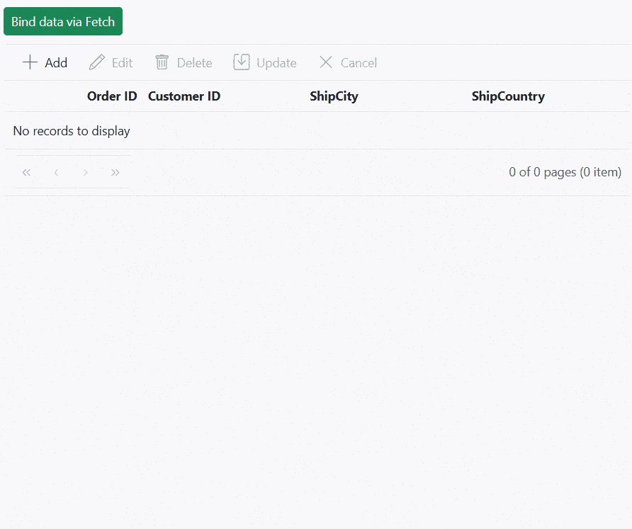

# Local Data Binding in ##Platform_Name## Data Grid

The Data Grid provides a straightforward way to bind local data, such as arrays or JSON objects, to the grid component. This feature allows data to be displayed and manipulated within the grid without the need for external server calls, making it particularly useful for scenarios involving static or locally stored data.

Assign an array of JavaScript objects to the [dataSource](../../api/grid#datasource) property.

The following example demonstrates the local data binding feature in the grid:



 







        
















## Binding data from Excel files



The Data Grid supports importing data from Excel files for display and manipulation within the grid. This streamlines transferring Excel data into a web-based environment. Use the [Uploader](../../uploader/getting-started) component's  [change](../../api/uploader#change) event to handle the import.



The Data Grid supports importing data from Excel files for display and manipulation within the grid. This streamlines transferring Excel data into a web-based environment. Use the [Uploader](../../uploader/es5-getting-started) component's  [change](../../api/uploader#change) event to handle the import.



To bind data from an Excel file to a Data Grid control, including the `xlsx` library via a script tag in an HTML page

```html
<script type="text/javascript" src="https://unpkg.com/xlsx@0.15.1/dist/xlsx.full.min.js"></script>
```

To import Excel data into the grid, the following steps can be used:

1. Import the Excel file using the Uploader control.
2. Parse the Excel file data using the `XLSX` library.
3. Bind the JSON to the grid control.


 
The following example demonstrates importing Excel data into the grid by utilizing the [Uploader](../../uploader/getting-started) control's `change` event along with the **XLSX** library:

 
 
The following example demonstrates importing Excel data into the grid by utilizing the [Uploader](../../uploader/es5-getting-started) control's `change` event along with the **XLSX** library:





 







        
















## CRUD operations using Fetch requests

The Data Grid provides a seamless way to bind data from external sources using Fetch requests, facilitating CRUD (Create, Read, Update, Delete) operations with data retrieved from a server. This feature is particularly valuable for sending data to a server for database updates and for asynchronously retrieving data without refreshing the entire web page.

To achieve data binding and perform CRUD actions using Fetch requests in the grid, follow these steps:




**Step 1:** Set up the development environment

Before starting, make sure the following are installed:

- .NET Core SDK
- Node.js
- Visual Studio or any other preferred code editor

**Step 2:**  Open Visual Studio and create an ASP.NET Core Web API project named **FetchRequest**. 

**Step 3:** Add the Microsoft.TypeScript.MSBuild NuGet package to the project:

In Solution Explorer, right-click the project node and select Manage NuGet Packages. In the Browse tab, search for [Microsoft.TypeScript.MSBuild](https://www.nuget.org/packages/Microsoft.TypeScript.MSBuild/) and then select Install on the right to install the package.

**Step 4:** Run the following command in the project root to create a `package.json` file:

```bash
npm init -y
```

**Step 5:** Replace the **scripts** property of `package.json` file with the following code:

```JSON
"scripts": {
  "build": "webpack --mode=development --watch",
  "release": "webpack --mode=production",
  "publish": "npm run release && dotnet publish -c Release"
},
```

**Step 6:** Create a folder named `wwwroot` in the project root directory. This folder will contain static files served by the web server.

**Step 7:** Install Webpack and Other Dependencies

```bash
npm i -D -E clean-webpack-plugin css-loader html-webpack-plugin mini-css-extract-plugin ts-loader typescript webpack webpack-cli
```

**Step 8:** Create a file named `webpack.config.js` in the project root, with the following code to configure the Webpack compilation process:





const path = require("path");
const HtmlWebpackPlugin = require("html-webpack-plugin");
const { CleanWebpackPlugin } = require("clean-webpack-plugin");
const MiniCssExtractPlugin = require("mini-css-extract-plugin");

module.exports = {
    entry: "./src/index.ts",
    output: {
        path: path.resolve(__dirname, "wwwroot"),
        filename: "[name].[chunkhash].js",
        publicPath: "/",
    },
    resolve: {
        extensions: [".js", ".ts"],
    },
    module: {
        rules: [
            {
                test: /\.ts$/,
                use: "ts-loader",
            },
            {
                test: /\.css$/,
                use: [MiniCssExtractPlugin.loader, "css-loader"],
            },
        ],
    },
    plugins: [
        new CleanWebpackPlugin(),
        new HtmlWebpackPlugin({
            template: "./src/index.html",
        }),
        new MiniCssExtractPlugin({
            filename: "css/[name].[chunkhash].css",
        }),
    ],
};




**Step 9:** Create `src/tsconfig.json` in the project and add the following content:

```json
{
  "compilerOptions": {
    "noImplicitAny": false,
    "noEmitOnError": true,
    "removeComments": false,
    "sourceMap": true,
    "target": "es5"
  },
  "exclude": [
    "node_modules",
    "wwwroot"
  ]
}
```

**Step 10:**  Comment out the below line in `launchSettings.json`:

```json
    "https": {
      "commandName": "Project",
      "dotnetRunMessages": true,
      "launchBrowser": true,
     // "launchUrl": "swagger",
      "applicationUrl": "https://localhost:xxxx;http://localhost:xxxx",
      "environmentVariables": {
        "ASPNETCORE_ENVIRONMENT": "Development"
      }
    },
```

**Step 11:**  In the **Program.cs** file, add the following code:





var builder = WebApplication.CreateBuilder(args);

// Add services to the container.

builder.Services.AddControllers();
// Learn more about configuring Swagger/OpenAPI at https://aka.ms/aspnetcore/swashbuckle
builder.Services.AddEndpointsApiExplorer();
builder.Services.AddSwaggerGen();

var app = builder.Build();

// Configure the HTTP request pipeline.
if (app.Environment.IsDevelopment())
{
    app.UseSwagger();
    app.UseSwaggerUI();
}

app.UseHttpsRedirection();

app.UseAuthorization();
app.UseDefaultFiles();
app.MapControllerRoute(
    name: "default",
    pattern: "{controller=Grid}/{action=Index}");
app.UseStaticFiles();
app.MapControllers();

app.Run();





**Step 12:** Open the terminal in the project root folder and install the required Syncfusion<sup style="font-size:70%">&reg;</sup> packages using npm:

```ts

npm install @syncfusion/ej2-grids --save
npm install @syncfusion/ej2-base --save
npm install @syncfusion/ej2-buttons --save

```

**Step 13:** Create a new directory named `src` in the project root for the client code.

**Step 14:** Create `src/index.html` file and add the following code:





<!DOCTYPE html>
<html lang="en">
<head>
    <title>EJ2 Grid</title>
    <meta charset="utf-8" />
    <meta name="viewport" content="width=device-width, initial-scale=1.0" />
    <meta name="description" content="Typescript Grid Control" />
    <meta name="author" content="Syncfusion" />
    <link href="https://cdn.syncfusion.com/ej2/27.148/ej2-base/styles/bootstrap5.css" rel="stylesheet" />
    <link href="https://cdn.syncfusion.com/ej2/27.148/ej2-grids/styles/bootstrap5.css" rel="stylesheet" />
    <link href="https://cdn.syncfusion.com/ej2/27.148/ej2-buttons/styles/bootstrap5.css" rel="stylesheet" />
    <link href="https://cdn.syncfusion.com/ej2/27.148/ej2-popups/styles/bootstrap5.css" rel="stylesheet" />
    <link href="https://cdn.syncfusion.com/ej2/27.148/ej2-richtexteditor/styles/bootstrap5.css" rel="stylesheet" />
    <link href="https://cdn.syncfusion.com/ej2/27.148/ej2-navigations/styles/bootstrap5.css" rel="stylesheet" />
    <link href="https://cdn.syncfusion.com/ej2/27.148/ej2-dropdowns/styles/bootstrap5.css" rel="stylesheet" />
    <link href="https://cdn.syncfusion.com/ej2/27.148/ej2-lists/styles/bootstrap5.css" rel="stylesheet" />
    <link href="https://cdn.syncfusion.com/ej2/27.148/ej2-inputs/styles/bootstrap5.css" rel="stylesheet" />
    <link href="https://cdn.syncfusion.com/ej2/27.148/ej2-calendars/styles/bootstrap5.css" rel="stylesheet" />
    <link href="https://cdn.syncfusion.com/ej2/27.148/ej2-notifications/styles/bootstrap5.css" rel="stylesheet" />
    <link href="https://cdn.syncfusion.com/ej2/27.148/ej2-splitbuttons/styles/bootstrap5.css" rel="stylesheet" />
    <link rel="stylesheet" href="https://stackpath.bootstrapcdn.com/bootstrap/4.1.2/css/bootstrap.min.css">
    <script src="https://cdnjs.cloudflare.com/ajax/libs/systemjs/0.19.38/system.js"></script>
    <script src="https://cdn.syncfusion.com/ej2/syncfusion-helper.js" type="text/javascript"></script>
</head>
<body>
    <div id='container'>
        <div style="padding-bottom: 10px; padding-top:10px">
            <button ejs-button id="buttons" cssClass="e-small"></button>
        </div>
        <div id='Grid'></div>
    </div>
</body>
</html>





**Step 15:** Create an **index.ts** file in the **src** folder and follow the steps below.

A. To bind data from an external Fetch request, use the [dataSource](../api/grid#datasource) property of the grid. Fetch data from the server and assign it to the `dataSource` property in the `onSuccess` event of the Fetch request.

B. To perform CRUD actions, use the [actionBegin](../api/grid#actionbegin) event. The default CRUD operations can be canceled by using the **cancel** argument provided by this event. This enables a server-side method to be called with Fetch, along with the relevant data received from the `actionBegin` event, to update server data accordingly.

C. In the Fetch success event, the grid [endEdit](../api/grid#endedit) and [deleteRecord](../api/grid#deleterecord) methods can be used to handle the addition, editing, and deletion of corresponding data in the grid. However, invoking these methods triggers the `actionBegin` event again to save the changes in the grid. To prevent this behavior and maintain control over the execution flow, a flag variable can be employed and managed within the `actionComplete` and Fetch failure events: The following code snippet demonstrates this approach:





import { Grid, Edit, Toolbar, EditEventArgs, Page } from '@syncfusion/ej2-grids';
import { Button } from '@syncfusion/ej2-buttons';
import { Fetch } from '@syncfusion/ej2-base';

Grid.Inject(Edit, Toolbar, Page);

let flag: Boolean = false;

let grid: Grid = new Grid({
    toolbar: ['Add', 'Edit', 'Delete', 'Update', 'Cancel'],
    allowPaging: true,
    actionBegin : actionBegin,
    actionComplete:actionComplete,
    editSettings: { allowEditing: true, allowAdding: true, allowDeleting: true, mode: 'Normal' },
    columns: [
        { field: 'OrderID', headerText: 'Order ID', textAlign: 'Right', width: 120, isPrimaryKey: true, type: 'number' },
        { field: 'CustomerID', width: 140, headerText: 'Customer ID', type: 'string' },
        { field: 'ShipCity', headerText: 'ShipCity', width: 140 },
        { field: 'ShipCountry', headerText: 'ShipCountry', width: 140 }
    ]
});

grid.appendTo('#Grid');

let button: Button = new Button({
    content: 'Bind data via Fetch',
    cssClass:'e-success'
});
button.appendTo('#buttons');

(document.getElementById('buttons') as HTMLElement).onclick = function () {
    const fetchRequest = new Fetch("https://localhost:****/Grid/Getdata", 'POST');//Use remote server host number instead ****
    fetchRequest.send();
    fetchRequest.onSuccess = (data) => {
        grid.dataSource = data;
    };
};

function actionComplete(e: EditEventArgs) {
    if (e.requestType === 'save' || e.requestType === 'delete') {
        flag = false;
    }
}
function actionBegin(e: EditEventArgs) {

    if (!flag) {
         //To add and save a new record using Fetch requests
        if (e.requestType == 'save' && ((e as any).action == 'add')) {
            var editedData = (e as any).data;
            e.cancel = true;
            var fetchRequest = new Fetch({
                url: 'https://localhost:****/Grid/Insert', //Use remote server host instead number ****
                type: 'POST',
                contentType: 'application/json; charset=utf-8',
                data: JSON.stringify({ value: editedData })
            });
            fetchRequest.onSuccess = () => {
                flag = true;
                grid.endEdit();
            };
            fetchRequest.onFailure = () => {
                flag = false;
            };
            fetchRequest.send();
        }
        // To edit and save a record using an Fetch request
        if (e.requestType == 'save' && ((e as any).action == "edit")) {
            var editedData = (e as any).data;
            e.cancel = true;
            var fetchRequest = new Fetch({
                url: 'https://localhost:****/Grid/Update', //Use remote server host instead number ****
                type: 'POST',
                contentType: 'application/json; charset=utf-8',
                data: JSON.stringify({ value: editedData })
            });
            fetchRequest.onSuccess = () => {
                flag = true;
                grid.endEdit();
            };
            fetchRequest.onFailure = () => {
                flag = false;
            };
            fetchRequest.send();
        }
        //To delete a record using an Fetch request,

        if (e.requestType == 'delete') {
            var editedData = (e as any).data;
            e.cancel = true;
            var fetchRequest = new Fetch({
                url: 'https://localhost:****/Grid/Delete', //Use remote server host instead number ****
                type: 'POST',
                contentType: 'application/json; charset=utf-8',
                data: JSON.stringify({ key: editedData[0][grid.getPrimaryKeyFieldNames()[0]] })
            });
            fetchRequest.onSuccess = () => {
                flag = true;
                grid.deleteRecord();
            };
            fetchRequest.onFailure = () => {
                flag = false;
            };
            fetchRequest.send();
        }
    }
}





**Step 16:**  Create a **GridController.cs** file in the **Controllers** folder. On the server side, there is a method named **GetData** within the GridController that provides the data source for the grid. When the button is clicked, a Fetch request is sent to retrieve the data from the server and bind it to the grid. Additionally, implement server-side logic to perform add, edit, and delete operations.





using FetchRequest.Models;
using Microsoft.AspNetCore.Mvc;

namespace FetchRequest.Controllers
{
    public class GridController : Controller
    {

        public ActionResult Getdata()
        {
            var DataSource = OrdersDetails.GetAllRecords();
            return Json(DataSource);
        }
        //update the record in server side
        public ActionResult Update([FromBody] CRUDModel<OrdersDetails> value)
        {
            var ord = value.value;
            OrdersDetails val = OrdersDetails.GetAllRecords().Where(or => or.OrderID == ord.OrderID).FirstOrDefault();
            val.OrderID = ord.OrderID;
            val.EmployeeID = ord.EmployeeID;
            val.CustomerID = ord.CustomerID;
            val.Freight = ord.Freight;
            val.OrderDate = ord.OrderDate;
            val.ShipCity = ord.ShipCity;
            val.ShipCountry = ord.ShipCountry;

            return Json(value.value);
        }


        //insert the record
        public ActionResult Insert([FromBody] CRUDModel<OrdersDetails> value)
        {

            OrdersDetails.GetAllRecords().Insert(0, value.value);
            return Json(value.value);
        }

        //Delete the record
        public ActionResult Delete(int key)
        {
            OrdersDetails.GetAllRecords().Remove(OrdersDetails.GetAllRecords().Where(or => or.OrderID == key).FirstOrDefault());
            var data = OrdersDetails.GetAllRecords();
            return Json(data);
        }
    }

}

public class CRUDModel<T> where T : class
{
    public string action { get; set; }
    public string table { get; set; }
    public string keyColumn { get; set; }
    public object key { get; set; }
    public T value { get; set; }
    public List<T> added { get; set; }
    public List<T> changed { get; set; }
    public List<T> deleted { get; set; }
    public IDictionary<string, object> @params { get; set; }
}





**Step 17:** Create a model class named **OrdersDetails.cs** under the **Models** folder in the server-side project to represent the order data.  





namespace FetchRequest.Models
{
    public class OrdersDetails
    {
        public static List<OrdersDetails> order = new List<OrdersDetails>();
        public OrdersDetails()
        {

        }
        public OrdersDetails(
        int OrderID, string CustomerId, int EmployeeId, double Freight, bool Verified,
        DateTime OrderDate, string ShipCity, string ShipName, string ShipCountry,
        DateTime ShippedDate, string ShipAddress)
        {
            this.OrderID = OrderID;
            this.CustomerID = CustomerId;
            this.EmployeeID = EmployeeId;
            this.Freight = Freight;
            this.ShipCity = ShipCity;
            this.Verified = Verified;
            this.OrderDate = OrderDate;
            this.ShipName = ShipName;
            this.ShipCountry = ShipCountry;
            this.ShippedDate = ShippedDate;
            this.ShipAddress = ShipAddress;
        }

        public static List<OrdersDetails> GetAllRecords()
        {
            if (order.Count() == 0)
            {
                int code = 10000;
                for (int i = 1; i < 10; i++)
                {
                    order.Add(new OrdersDetails(code + 1, "ALFKI", i + 0, 2.3 * i, false, new DateTime(1991, 05, 15), "Berlin", "Simons bistro", "Denmark", new DateTime(1996, 7, 16), "Kirchgasse 6"));
                    order.Add(new OrdersDetails(code + 2, "ANATR", i + 2, 3.3 * i, true, new DateTime(1990, 04, 04), "Madrid", "Queen Cozinha", "Brazil", new DateTime(1996, 9, 11), "Avda. Azteca 123"));
                    order.Add(new OrdersDetails(code + 3, "ANTON", i + 1, 4.3 * i, true, new DateTime(1957, 11, 30), "Cholchester", "Frankenversand", "Germany", new DateTime(1996, 10, 7), "Carrera 52 con Ave. Bolívar #65-98 Llano Largo"));
                    order.Add(new OrdersDetails(code + 4, "BLONP", i + 3, 5.3 * i, false, new DateTime(1930, 10, 22), "Marseille", "Ernst Handel", "Austria", new DateTime(1996, 12, 30), "Magazinweg 7"));
                    order.Add(new OrdersDetails(code + 5, "BOLID", i + 4, 6.3 * i, true, new DateTime(1953, 02, 18), "Tsawassen", "Hanari Carnes", "Switzerland", new DateTime(1997, 12, 3), "1029 - 12th Ave. S."));
                    code += 5;
                }
            }
            return order;
        }

        public int? OrderID { get; set; }
        public string? CustomerID { get; set; }
        public int? EmployeeID { get; set; }
        public double? Freight { get; set; }
        public string? ShipCity { get; set; }
        public bool? Verified { get; set; }
        public DateTime OrderDate { get; set; }
        public string? ShipName { get; set; }
        public string? ShipCountry { get; set; }
        public DateTime ShippedDate { get; set; }
        public string? ShipAddress { get; set; }
    }
}





**Step 18:**  Build the project using the following command:

```bash
npm run build
```

**Step 19:**  Run the project in Visual Studio.

The wwwroot/index.html file is served at https://localhost:xxxx.



**Step 1:** To create a new ASP.NET Core Web API project named **FetchRequest**, follow these steps:

* Open Visual Studio.
* Select "Create a new project"
* Choose **ASP.NET Core Web API** project template.
* Name the project **FetchRequest**.
* Click "Create"

**Step 2:**  Comment out the below line in `launchSettings.json`:

```json
    "https": {
      "commandName": "Project",
      "dotnetRunMessages": true,
      "launchBrowser": true,
     // "launchUrl": "swagger",
      "applicationUrl": "https://localhost:xxxx;http://localhost:xxxx",
      "environmentVariables": {
        "ASPNETCORE_ENVIRONMENT": "Development"
      }
    },
```

**Step 3:**  In the **Program.cs** file, add the following code:





var builder = WebApplication.CreateBuilder(args);

// Add services to the container.

builder.Services.AddControllers();
// Learn more about configuring Swagger/OpenAPI at https://aka.ms/aspnetcore/swashbuckle
builder.Services.AddEndpointsApiExplorer();
builder.Services.AddSwaggerGen();

var app = builder.Build();

// Configure the HTTP request pipeline.
if (app.Environment.IsDevelopment())
{
    app.UseSwagger();
    app.UseSwaggerUI();
}

app.UseHttpsRedirection();

app.UseAuthorization();
app.UseDefaultFiles();
app.MapControllerRoute(
    name: "default",
    pattern: "{controller=Grid}/{action=Index}");
app.UseStaticFiles();
app.MapControllers();

app.Run();






**Step 4:** Create a folder named **wwwroot** in the project root directory. This folder will contain static files served by the web server.

**Step 5:** Create an **index.html** file under the **wwwroot** folder and add the following code:





<!DOCTYPE html>
<html lang="en">
<head>
    <title>EJ2 Grid</title>
    <meta charset="utf-8">
    <meta name="viewport" content="width=device-width, initial-scale=1.0">
    <meta name="description" content="Javascript Grid Control">
    <meta name="author" content="Syncfusion">
    <link href="https://cdn.syncfusion.com/ej2/27.148/ej2-base/styles/bootstrap5.css" rel="stylesheet">
    <link href="https://cdn.syncfusion.com/ej2/27.148/ej2-grids/styles/bootstrap5.css" rel="stylesheet">
    <link href="https://cdn.syncfusion.com/ej2/27.148/ej2-buttons/styles/bootstrap5.css" rel="stylesheet">
    <link href="https://cdn.syncfusion.com/ej2/27.148/ej2-popups/styles/bootstrap5.css" rel="stylesheet">
    <link href="https://cdn.syncfusion.com/ej2/27.148/ej2-richtexteditor/styles/bootstrap5.css" rel="stylesheet">
    <link href="https://cdn.syncfusion.com/ej2/27.148/ej2-navigations/styles/bootstrap5.css" rel="stylesheet">
    <link href="https://cdn.syncfusion.com/ej2/27.148/ej2-dropdowns/styles/bootstrap5.css" rel="stylesheet">
    <link href="https://cdn.syncfusion.com/ej2/27.148/ej2-lists/styles/bootstrap5.css" rel="stylesheet">
    <link href="https://cdn.syncfusion.com/ej2/27.148/ej2-inputs/styles/bootstrap5.css" rel="stylesheet">
    <link href="https://cdn.syncfusion.com/ej2/27.148/ej2-calendars/styles/bootstrap5.css" rel="stylesheet">
    <link href="https://cdn.syncfusion.com/ej2/27.148/ej2-notifications/styles/bootstrap5.css" rel="stylesheet">
    <link href="https://cdn.syncfusion.com/ej2/27.148/ej2-splitbuttons/styles/bootstrap5.css" rel="stylesheet">
    <script src="https://cdnjs.cloudflare.com/ajax/libs/systemjs/0.19.38/system.js"></script>
    <script src="https://cdn.syncfusion.com/ej2/27.148/dist/ej2.min.js" type="text/javascript"></script>
    <script src="https://cdn.syncfusion.com/ej2/syncfusion-helper.js" type="text/javascript"></script>
</head>
<body>
    <div class='col-md-9'>
        <div style="padding-bottom: 10px; padding-top:10px">
            <button ejs-button id="buttons" cssClass="e-small"></button>
        </div>
        <div id="container">
            <div id="Grid"></div>
        </div>
    </div>
        <script src="js/index.js" type="text/javascript"></script>
</body>
</html>





**Step 6:**  Create a **js** folder under the **wwwroot** folder, then create an **index.js** file within the **js** folder and follow the steps below:

A. To bind data from an external Fetch request, utilize the [dataSource](../api/grid#datasource) property of the grid. Fetch data from the server and provide it to the `dataSource` property using the `onSuccess` event of the Fetch request.

B. To perform CRUD actions, leverage the [actionBegin](../api/grid#actionbegin) event. The default CRUD operations can be canceled by utilizing the **cancel** argument provided by this event. This enables a dynamic call to the server-side method using Fetch, along with the relevant data received from the `actionBegin` event, to update server data accordingly.

C. In the Fetch success event, the grid [endEdit](../api/grid#endedit) and [deleteRecord](../api/grid#deleterecord) methods can be used to handle the addition, editing, and deletion of corresponding data in the grid. However, invoking these methods triggers the `actionBegin` event once again to save the changes in the grid. To prevent this behavior and maintain control over the execution flow, a flag variable can be employed and managed within the `actionComplete` and Fetch failure events: The following code snippet demonstrates this approach:





var grid = new ej.grids.Grid({
    toolbar: ['Add', 'Edit', 'Delete', 'Update', 'Cancel'],
    allowPaging: true,
    actionBegin: actionBegin,
    actionComplete: actionComplete,
    editSettings: { allowEditing: true, allowAdding: true, allowDeleting: true, mode: 'Normal' },
    columns: [
        { field: 'OrderID', headerText: 'Order ID', textAlign: 'Right', width: 120, isPrimaryKey: true, type: 'number' },
        { field: 'CustomerID', width: 140, headerText: 'Customer ID', type: 'string' },
        { field: 'ShipCity', headerText: 'ShipCity', width: 140 },
        { field: 'ShipCountry', headerText: 'ShipCountry', width: 140 }
    ]
});
grid.appendTo('#Grid');

var button = new ej.buttons.Button({
    content: 'Bind data via Fetch',
    cssClass: 'e-success'
});
button.appendTo('#buttons');
let flag = false;

document.getElementById('buttons').onclick = function () {
    const fetchRequest = new ej.base.Fetch("https://localhost:****/Grid/Getdata", 'POST'); //Use remote server host instead number ****
    fetchRequest.send();
    fetchRequest.onSuccess = (data) => {
        grid.dataSource = data;
    };
};

function actionComplete(e) {
    if (e.requestType === 'save' || e.requestType === 'delete') {
        flag = false;
    }
}
function actionBegin(e) {

    if (!flag) {
        if (e.requestType == 'save' && (e.action == 'add')) {
            var editedData = e.data;
            e.cancel = true;
            var fetchRequest = new ej.base.Fetch({
                url: 'https://localhost:****/Grid/Insert',
                type: 'POST',
                contentType: 'application/json; charset=utf-8',
                data: JSON.stringify({ value: editedData })
            });//Use remote server host instead number ****
            fetchRequest.onSuccess = () => {
                flag = true;
                grid.endEdit();
            };
            fetchRequest.onFailure = () => {
                flag = false;
            };
            fetchRequest.send();
        }
        if (e.requestType == 'save' && (e.action == "edit")) {
            var editedData = e.data;
            e.cancel = true;
            var fetchRequest = new ej.base.Fetch({
                url: 'https://localhost:****/Grid/Update',
                type: 'POST',
                contentType: 'application/json; charset=utf-8',
                data: JSON.stringify({ value: editedData })
            }); //Use remote server host instead number ****
            fetchRequest.onSuccess = () => {
                flag = true;
                grid.endEdit();
            };
            fetchRequest.onFailure = () => {
                flag = false;
            };
            fetchRequest.send();
        }
        if (e.requestType == 'delete') {
            var editedData = e.data;
            e.cancel = true;
            var fetchRequest = new ej.base.Fetch({
                url: 'https://localhost:****/Grid/Delete',
                type: 'POST',
                contentType: 'application/json; charset=utf-8',
                data: JSON.stringify({ key: editedData[0][grid.getPrimaryKeyFieldNames()[0]] })
            });//Use remote server host instead number ****
            fetchRequest.onSuccess = () => {
                flag = true;
                grid.deleteRecord();
            };
            fetchRequest.onFailure = () => {
                flag = false;
            };
            fetchRequest.send();
        }
    }
}





**Step 7:**  Create a **GridController.cs** file in the **Controllers** folder. On the server side, there is a method named **GetData** within the GridController that provides the data source for the grid. When the button is clicked, a Fetch request is sent to retrieve the data from the server and bind it to the grid. Additionally, implement server-side logic to perform add, edit, and delete operations.





using FetchRequest.Models;
using Microsoft.AspNetCore.Mvc;

namespace FetchRequest.Controllers
{
    public class GridController : Controller
    {

        public ActionResult Getdata()
        {
            var DataSource = OrdersDetails.GetAllRecords();
            return Json(DataSource);
        }
        //update the record in server side
        public ActionResult Update([FromBody] CRUDModel<OrdersDetails> value)
        {
            var ord = value.value;
            OrdersDetails val = OrdersDetails.GetAllRecords().Where(or => or.OrderID == ord.OrderID).FirstOrDefault();
            val.OrderID = ord.OrderID;
            val.EmployeeID = ord.EmployeeID;
            val.CustomerID = ord.CustomerID;
            val.Freight = ord.Freight;
            val.OrderDate = ord.OrderDate;
            val.ShipCity = ord.ShipCity;
            val.ShipCountry = ord.ShipCountry;

            return Json(value.value);
        }


        //insert the record
        public ActionResult Insert([FromBody] CRUDModel<OrdersDetails> value)
        {

            OrdersDetails.GetAllRecords().Insert(0, value.value);
            return Json(value.value);
        }

        //Delete the record
        public ActionResult Delete(int key)
        {
            OrdersDetails.GetAllRecords().Remove(OrdersDetails.GetAllRecords().Where(or => or.OrderID == key).FirstOrDefault());
            var data = OrdersDetails.GetAllRecords();
            return Json(data);
        }
    }

}

public class CRUDModel<T> where T : class
{
    public string action { get; set; }
    public string table { get; set; }
    public string keyColumn { get; set; }
    public object key { get; set; }
    public T value { get; set; }
    public List<T> added { get; set; }
    public List<T> changed { get; set; }
    public List<T> deleted { get; set; }
    public IDictionary<string, object> @params { get; set; }
}





**Step 8:** Create a model class named **OrdersDetails.cs** under the **Models** folder in the server-side project to represent the order data.  





namespace FetchRequest.Models
{
    public class OrdersDetails
    {
        public static List<OrdersDetails> order = new List<OrdersDetails>();
        public OrdersDetails()
        {

        }
        public OrdersDetails(
        int OrderID, string CustomerId, int EmployeeId, double Freight, bool Verified,
        DateTime OrderDate, string ShipCity, string ShipName, string ShipCountry,
        DateTime ShippedDate, string ShipAddress)
        {
            this.OrderID = OrderID;
            this.CustomerID = CustomerId;
            this.EmployeeID = EmployeeId;
            this.Freight = Freight;
            this.ShipCity = ShipCity;
            this.Verified = Verified;
            this.OrderDate = OrderDate;
            this.ShipName = ShipName;
            this.ShipCountry = ShipCountry;
            this.ShippedDate = ShippedDate;
            this.ShipAddress = ShipAddress;
        }

        public static List<OrdersDetails> GetAllRecords()
        {
            if (order.Count() == 0)
            {
                int code = 10000;
                for (int i = 1; i < 10; i++)
                {
                    order.Add(new OrdersDetails(code + 1, "ALFKI", i + 0, 2.3 * i, false, new DateTime(1991, 05, 15), "Berlin", "Simons bistro", "Denmark", new DateTime(1996, 7, 16), "Kirchgasse 6"));
                    order.Add(new OrdersDetails(code + 2, "ANATR", i + 2, 3.3 * i, true, new DateTime(1990, 04, 04), "Madrid", "Queen Cozinha", "Brazil", new DateTime(1996, 9, 11), "Avda. Azteca 123"));
                    order.Add(new OrdersDetails(code + 3, "ANTON", i + 1, 4.3 * i, true, new DateTime(1957, 11, 30), "Cholchester", "Frankenversand", "Germany", new DateTime(1996, 10, 7), "Carrera 52 con Ave. Bolívar #65-98 Llano Largo"));
                    order.Add(new OrdersDetails(code + 4, "BLONP", i + 3, 5.3 * i, false, new DateTime(1930, 10, 22), "Marseille", "Ernst Handel", "Austria", new DateTime(1996, 12, 30), "Magazinweg 7"));
                    order.Add(new OrdersDetails(code + 5, "BOLID", i + 4, 6.3 * i, true, new DateTime(1953, 02, 18), "Tsawassen", "Hanari Carnes", "Switzerland", new DateTime(1997, 12, 3), "1029 - 12th Ave. S."));
                    code += 5;
                }
            }
            return order;
        }

        public int? OrderID { get; set; }
        public string? CustomerID { get; set; }
        public int? EmployeeID { get; set; }
        public double? Freight { get; set; }
        public string? ShipCity { get; set; }
        public bool? Verified { get; set; }
        public DateTime OrderDate { get; set; }
        public string? ShipName { get; set; }
        public string? ShipCountry { get; set; }
        public DateTime ShippedDate { get; set; }
        public string? ShipAddress { get; set; }
    }
}







The following screenshot represents loading data when the button is clicked and CRUD operations are performed:





> A complete sample for binding data and performing CRUD actions via Fetch requests is available on [GitHub](https://github.com/SyncfusionExamples/Binding-data-and-perform-action-in-ej2-typescript-grid-using-Fetch-request)



> A complete sample for binding data and performing CRUD actions via Fetch requests is available on [GitHub](https://github.com/SyncfusionExamples/Binding-data-and-perform-action-in-ej2-javascript-grid-using-Fetch-request)



### Display the loading indicator with local data. 

The Data Grid allows a loading indicator to be displayed while local data is being loaded. This feature is useful when there is a delay in loading data from a local source, and it helps indicate that the data is being fetched.

To display the loading indicator with local data, set the [showSpinner](../api/grid#showspinner) property to **true**. This property controls the visibility of the loading indicator.

The following example demonstrates displaying the loading indicator in the grid using the [load](../api/grid#load) and [created](../api/grid#created) events:







import { Grid, Page } from '@syncfusion/ej2-grids';
import { data } from './datasource.ts';

Grid.Inject(Page);

let grid: Grid = new Grid({
  allowPaging: true,
  created:created,
  load:load,
  pageSettings: { pageCount: 3,pageSize: 5 },
  columns: [
    { field: 'OrderID', headerText: 'Order ID', textAlign: 'Right', width: 120 },
    { field: 'CustomerName', headerText: 'Customer Name', width: 150 },
    { field: 'OrderDate', headerText: 'Order Date', width: 130, format: 'yMd', textAlign: 'Right' },
    { field: 'Freight', headerText: 'Freight', width: 120, format: 'C2', textAlign: 'Right' },
    { field: 'ShippedDate', headerText: 'Shipped Date', width: 140, format: 'yMd', textAlign: 'Right' },
    { field: 'ShipCountry', headerText: 'Ship Country', width: 150 }
  ],
  height: 315
});
grid.appendTo('#Grid');

let isDataLoading =true

function load() {
  if (isDataLoading) { 
    grid.showSpinner();
  }
}

function created(){
  isDataLoading = true;
  grid.dataSource = data ;
}










let isDataLoading =true

var grid = new ej.grids.Grid({
  allowPaging: true,
  created:created,
  load:load,
  pageSettings: { pageCount: 3,pageSize: 5 },
  columns: [
    { field: 'OrderID', headerText: 'Order ID', textAlign: 'Right', width: 120 },
    { field: 'CustomerName', headerText: 'Customer Name', width: 150 },
    { field: 'OrderDate', headerText: 'Order Date', width: 130, format: 'yMd', textAlign: 'Right' },
    { field: 'Freight', headerText: 'Freight', width: 120, format: 'C2', textAlign: 'Right' },
    { field: 'ShippedDate', headerText: 'Shipped Date', width: 140, format: 'yMd', textAlign: 'Right' },
    { field: 'ShipCountry', headerText: 'Ship Country', width: 150 }
  ],
  height: 315
});
grid.appendTo('#Grid');

function load() {
  if (isDataLoading) { 
    grid.showSpinner();
  }
}

function created(){
  isDataLoading = true;
  grid.dataSource = data;
}







## CRUD Operations using AJAX requests

The Data Grid provides a seamless way to bind data from external sources using AJAX requests, facilitating CRUD (Create, Read, Update, Delete) operations with data retrieved from a server. This feature is particularly valuable for sending data to a server for database updates and asynchronously retrieving data without refreshing the entire web page.

To achieve data binding and perform CRUD actions using Ajax requests in the grid, follow these steps:




**Step 1:** Set up the development environment

Before starting, make sure the following are installed:

- .NET Core SDK
- Node.js
- Visual Studio or any other preferred code editor

**Step 2:**  Open Visual Studio and create an ASP.NET Core Web API project named **AJAXRequest**. 

**Step 3:** Add the Microsoft.TypeScript.MSBuild NuGet package to the project:

In Solution Explorer, right-click the project node and select Manage NuGet Packages. In the Browse tab, search for [Microsoft.TypeScript.MSBuild](https://www.nuget.org/packages/Microsoft.TypeScript.MSBuild/) and then select Install on the right to install the package.

**Step 4:** Run the following command in the project root to create a `package.json` file:

```bash
npm init -y
```

**Step 5:** Replace the **scripts** property of `package.json` file with the following code:

```JSON
"scripts": {
  "build": "webpack --mode=development --watch",
  "release": "webpack --mode=production",
  "publish": "npm run release && dotnet publish -c Release"
},
```

**Step 6:** Create a folder named `wwwroot` in the project root directory. This folder will contain static files served by the web server.

**Step 7:** Install Webpack and Other Dependencies

```bash
npm i -D -E clean-webpack-plugin css-loader html-webpack-plugin mini-css-extract-plugin ts-loader typescript webpack webpack-cli
```

**Step 8:** Create a file named `webpack.config.js` in the project root, with the following code to configure the Webpack compilation process:





const path = require("path");
const HtmlWebpackPlugin = require("html-webpack-plugin");
const { CleanWebpackPlugin } = require("clean-webpack-plugin");
const MiniCssExtractPlugin = require("mini-css-extract-plugin");

module.exports = {
    entry: "./src/index.ts",
    output: {
        path: path.resolve(__dirname, "wwwroot"),
        filename: "[name].[chunkhash].js",
        publicPath: "/",
    },
    resolve: {
        extensions: [".js", ".ts"],
    },
    module: {
        rules: [
            {
                test: /\.ts$/,
                use: "ts-loader",
            },
            {
                test: /\.css$/,
                use: [MiniCssExtractPlugin.loader, "css-loader"],
            },
        ],
    },
    plugins: [
        new CleanWebpackPlugin(),
        new HtmlWebpackPlugin({
            template: "./src/index.html",
        }),
        new MiniCssExtractPlugin({
            filename: "css/[name].[chunkhash].css",
        }),
    ],
};




**Step 9:**  Comment out the below line in `launchSettings.json`:

```json
    "https": {
      "commandName": "Project",
      "dotnetRunMessages": true,
      "launchBrowser": true,
     // "launchUrl": "swagger",
      "applicationUrl": "https://localhost:xxxx;http://localhost:xxxx",
      "environmentVariables": {
        "ASPNETCORE_ENVIRONMENT": "Development"
      }
    },
```

**Step 10:**  In the **Program.cs** file, add the following code:





var builder = WebApplication.CreateBuilder(args);

// Add services to the container.

builder.Services.AddControllers();
// Learn more about configuring Swagger/OpenAPI at https://aka.ms/aspnetcore/swashbuckle
builder.Services.AddEndpointsApiExplorer();
builder.Services.AddSwaggerGen();

var app = builder.Build();

// Configure the HTTP request pipeline.
if (app.Environment.IsDevelopment())
{
    app.UseSwagger();
    app.UseSwaggerUI();
}

app.UseHttpsRedirection();

app.UseAuthorization();
app.UseDefaultFiles();
app.MapControllerRoute(
    name: "default",
    pattern: "{controller=Grid}/{action=Index}");
app.UseStaticFiles();
app.MapControllers();

app.Run();





**Step 11:** Open the terminal in the project root folder and install the required Syncfusion<sup style="font-size:70%">&reg;</sup> packages using npm:

```ts

npm install @syncfusion/ej2-grids --save
npm install @syncfusion/ej2-base --save
npm install @syncfusion/ej2-buttons --save

```

**Step 12:** Create a new directory named `src` in the project root for the client code.

**Step 13:** Create `src/tsconfig.json` in the project and add the following content:

```json
{
  "compilerOptions": {
    "noImplicitAny": false,
    "noEmitOnError": true,
    "removeComments": false,
    "sourceMap": true,
    "target": "es5"
  },
  "exclude": [
    "node_modules",
    "wwwroot"
  ]
}
```

**Step 14:** Create `src/index.html` file and add the following code:





<!DOCTYPE html>
<html lang="en">
<head>
    <title>EJ2 Grid</title>
    <meta charset="utf-8" />
    <meta name="viewport" content="width=device-width, initial-scale=1.0" />
    <meta name="description" content="Typescript Grid Control" />
    <meta name="author" content="Syncfusion" />
    <link href="https://cdn.syncfusion.com/ej2/27.148/ej2-base/styles/bootstrap5.css" rel="stylesheet" />
    <link href="https://cdn.syncfusion.com/ej2/27.148/ej2-grids/styles/bootstrap5.css" rel="stylesheet" />
    <link href="https://cdn.syncfusion.com/ej2/27.148/ej2-buttons/styles/bootstrap5.css" rel="stylesheet" />
    <link href="https://cdn.syncfusion.com/ej2/27.148/ej2-popups/styles/bootstrap5.css" rel="stylesheet" />
    <link href="https://cdn.syncfusion.com/ej2/27.148/ej2-richtexteditor/styles/bootstrap5.css" rel="stylesheet" />
    <link href="https://cdn.syncfusion.com/ej2/27.148/ej2-navigations/styles/bootstrap5.css" rel="stylesheet" />
    <link href="https://cdn.syncfusion.com/ej2/27.148/ej2-dropdowns/styles/bootstrap5.css" rel="stylesheet" />
    <link href="https://cdn.syncfusion.com/ej2/27.148/ej2-lists/styles/bootstrap5.css" rel="stylesheet" />
    <link href="https://cdn.syncfusion.com/ej2/27.148/ej2-inputs/styles/bootstrap5.css" rel="stylesheet" />
    <link href="https://cdn.syncfusion.com/ej2/27.148/ej2-calendars/styles/bootstrap5.css" rel="stylesheet" />
    <link href="https://cdn.syncfusion.com/ej2/27.148/ej2-notifications/styles/bootstrap5.css" rel="stylesheet" />
    <link href="https://cdn.syncfusion.com/ej2/27.148/ej2-splitbuttons/styles/bootstrap5.css" rel="stylesheet" />
    <link rel="stylesheet" href="https://stackpath.bootstrapcdn.com/bootstrap/4.1.2/css/bootstrap.min.css">
    <script src="https://cdnjs.cloudflare.com/ajax/libs/systemjs/0.19.38/system.js"></script>
    <script src="https://cdn.syncfusion.com/ej2/syncfusion-helper.js" type="text/javascript"></script>
</head>
<body>
    <div id='container'>
        <div class='col-md-9'>
        <div style="padding-bottom: 10px; padding-top:10px">
            <button ejs-button id="buttons" cssClass="e-small"></button>
        </div>
        <div id='Grid'></div>
       </div>

    </div>
</body>
</html>





**Step 15:** Create an **index.ts** file in the **src** folder and follow the steps below.

A. To bind data from an external AJAX request, utilize the [dataSource](../api/grid#datasource) property of the grid. AJAX data from the server and provide it to the `dataSource` property using the `onSuccess` event of the AJAX request.

B. To perform CRUD actions, leverage the [actionBegin](../api/grid#actionbegin) event. The default CRUD operations can be canceled by utilizing the **cancel** argument provided by this event. This enables a dynamic call to the server-side method using AJAX, along with the relevant data received from the `actionBegin` event, to update server data accordingly.

C. In the AJAX success event, the grid [endEdit](../api/g#endedit) and [deleteRecord](../api/g#deleterecord) methods can be used to handle the addition, editing, and deletion of corresponding data in the grid. However, invoking these methods triggers the `actionBegin` event once again to save the changes in the grid. To prevent this behavior and maintain control over the execution flow, a flag variable can be employed and managed within the `actionComplete` and AJAX failure events: The following code snippet demonstrates this approach:





import { Grid, Edit, Toolbar, EditEventArgs, Page } from '@syncfusion/ej2-grids';
import { Button } from '@syncfusion/ej2-buttons';
import { Ajax } from '@syncfusion/ej2-base';

Grid.Inject(Edit, Toolbar, Page);

let flag: Boolean = false;

let grid: Grid = new Grid({
    toolbar: ['Add', 'Edit', 'Delete', 'Update', 'Cancel'],
    allowPaging: true,
    actionBegin: actionBegin,
    actionComplete: actionComplete,
    editSettings: { allowEditing: true, allowAdding: true, allowDeleting: true, mode: 'Normal' },
    columns: [
        { field: 'OrderID', headerText: 'Order ID', textAlign: 'Right', width: 120, isPrimaryKey: true, type: 'number' },
        { field: 'CustomerID', width: 140, headerText: 'Customer ID', type: 'string' },
        { field: 'ShipCity', headerText: 'ShipCity', width: 140 },
        { field: 'ShipCountry', headerText: 'ShipCountry', width: 140 }
    ]
});

grid.appendTo('#Grid');

let button: Button = new Button({
    content: 'Bind data via AJAX',
    cssClass: 'e-success'
});
button.appendTo('#buttons');

(document.getElementById('buttons') as HTMLElement).onclick = function () {
    const ajax = new Ajax("https://localhost:****/Grid/Getdata", 'POST'); //Use remote server host instead number ****
    ajax.send();
    ajax.onSuccess = (data) => {
        grid.dataSource = JSON.parse(data);
    };
};

function actionComplete(e: EditEventArgs) {
    if (e.requestType === 'save' || e.requestType === 'delete') {
        flag = false;
    }
}
function actionBegin(e: EditEventArgs) {

    if (!flag) {
        //To add and save a new record using AJAX requests
        if (e.requestType == 'save' && ((e as any).action == 'add')) {
            var editedData = (e as any).data;
            e.cancel = true;
            var ajax = new Ajax({
                url: 'https://localhost:****/Grid/Insert',
                type: 'POST',
                contentType: 'application/json; charset=utf-8',
                data: JSON.stringify({ value: editedData })
            }); //Use remote server host instead number ****
            ajax.onSuccess = () => {
                flag = true;
                grid.endEdit();
            };
            ajax.onFailure = () => {
                flag = false;
            };
            ajax.send();
        }
        // To edit and save a record using an AJAX request
        if (e.requestType == 'save' && ((e as any).action == "edit")) {
            var editedData = (e as any).data;
            e.cancel = true;
            var ajax = new Ajax({
                url: 'https://localhost:****/Grid/Update',
                type: 'POST',
                contentType: 'application/json; charset=utf-8',
                data: JSON.stringify({ value: editedData })
            }); //Use remote server host instead number ****
            ajax.onSuccess = () => {
                flag = true;
                grid.endEdit();
            };
            ajax.onFailure = () => {
                flag = false;
            };
            ajax.send();
        }
        //To delete a record using an AJAX request,

        if (e.requestType == 'delete') {
            var editedData = (e as any).data;
            e.cancel = true;
            var ajax = new Ajax({
                url: 'https://localhost:****/Grid/Delete',
                type: 'POST',
                contentType: 'application/json; charset=utf-8',
                data: JSON.stringify({ key: editedData[0][grid.getPrimaryKeyFieldNames()[0]] })
            }); //Use remote server host instead number ****
            ajax.onSuccess = () => {
                flag = true;
                grid.deleteRecord();
            };
            ajax.onFailure = () => {
                flag = false;
            };
            ajax.send();
        }
    }
}





**Step 16:**  Create a **GridController.cs** file in the **Controllers** folder. On the server side, there is a method named **GetData** within the GridController that provides the data source for the grid. When the button is clicked, a AJAX request is sent to retrieve the data from the server and bind it to the grid component. Additionally, implement server-side logic to perform add, edit, and delete operations.





using AJAXRequest.Models;
using Microsoft.AspNetCore.Mvc;

namespace AJAXRequest.Controllers
{
    public class GridController : Controller
    {

        public ActionResult Getdata()
        {
            var DataSource = OrdersDetails.GetAllRecords();
            return Json(DataSource);
        }
        //update the record in server side
        public ActionResult Update([FromBody] CRUDModel<OrdersDetails> value)
        {
            var ord = value.value;
            OrdersDetails val = OrdersDetails.GetAllRecords().Where(or => or.OrderID == ord.OrderID).FirstOrDefault();
            val.OrderID = ord.OrderID;
            val.EmployeeID = ord.EmployeeID;
            val.CustomerID = ord.CustomerID;
            val.Freight = ord.Freight;
            val.OrderDate = ord.OrderDate;
            val.ShipCity = ord.ShipCity;
            val.ShipCountry = ord.ShipCountry;

            return Json(value.value);
        }

        //insert the record
        public ActionResult Insert([FromBody] CRUDModel<OrdersDetails> value)
        {

            OrdersDetails.GetAllRecords().Insert(0, value.value);
            return Json(value.value);
        }

        //Delete the record
        public ActionResult Delete(int key)
        {
            OrdersDetails.GetAllRecords().Remove(OrdersDetails.GetAllRecords().Where(or => or.OrderID == key).FirstOrDefault());
            var data = OrdersDetails.GetAllRecords();
            return Json(data);
        }
    }

}

public class CRUDModel<T> where T : class
{
    public string action { get; set; }
    public string table { get; set; }
    public string keyColumn { get; set; }
    public object key { get; set; }
    public T value { get; set; }
    public List<T> added { get; set; }
    public List<T> changed { get; set; }
    public List<T> deleted { get; set; }
    public IDictionary<string, object> @params { get; set; }
}





**Step 17:** Create a model class named **OrdersDetails.cs** under the **Models** folder in the server-side project to represent the order data.  





namespace AJAXRequest.Models
{
    public class OrdersDetails
    {
        public static List<OrdersDetails> order = new List<OrdersDetails>();
        public OrdersDetails()
        {

        }
        public OrdersDetails(
        int OrderID, string CustomerId, int EmployeeId, double Freight, bool Verified,
        DateTime OrderDate, string ShipCity, string ShipName, string ShipCountry,
        DateTime ShippedDate, string ShipAddress)
        {
            this.OrderID = OrderID;
            this.CustomerID = CustomerId;
            this.EmployeeID = EmployeeId;
            this.Freight = Freight;
            this.ShipCity = ShipCity;
            this.Verified = Verified;
            this.OrderDate = OrderDate;
            this.ShipName = ShipName;
            this.ShipCountry = ShipCountry;
            this.ShippedDate = ShippedDate;
            this.ShipAddress = ShipAddress;
        }

        public static List<OrdersDetails> GetAllRecords()
        {
            if (order.Count() == 0)
            {
                int code = 10000;
                for (int i = 1; i < 10; i++)
                {
                    order.Add(new OrdersDetails(code + 1, "ALFKI", i + 0, 2.3 * i, false, new DateTime(1991, 05, 15), "Berlin", "Simons bistro", "Denmark", new DateTime(1996, 7, 16), "Kirchgasse 6"));
                    order.Add(new OrdersDetails(code + 2, "ANATR", i + 2, 3.3 * i, true, new DateTime(1990, 04, 04), "Madrid", "Queen Cozinha", "Brazil", new DateTime(1996, 9, 11), "Avda. Azteca 123"));
                    order.Add(new OrdersDetails(code + 3, "ANTON", i + 1, 4.3 * i, true, new DateTime(1957, 11, 30), "Cholchester", "Frankenversand", "Germany", new DateTime(1996, 10, 7), "Carrera 52 con Ave. Bolívar #65-98 Llano Largo"));
                    order.Add(new OrdersDetails(code + 4, "BLONP", i + 3, 5.3 * i, false, new DateTime(1930, 10, 22), "Marseille", "Ernst Handel", "Austria", new DateTime(1996, 12, 30), "Magazinweg 7"));
                    order.Add(new OrdersDetails(code + 5, "BOLID", i + 4, 6.3 * i, true, new DateTime(1953, 02, 18), "Tsawassen", "Hanari Carnes", "Switzerland", new DateTime(1997, 12, 3), "1029 - 12th Ave. S."));
                    code += 5;
                }
            }
            return order;
        }

        public int? OrderID { get; set; }
        public string? CustomerID { get; set; }
        public int? EmployeeID { get; set; }
        public double? Freight { get; set; }
        public string? ShipCity { get; set; }
        public bool? Verified { get; set; }
        public DateTime OrderDate { get; set; }
        public string? ShipName { get; set; }
        public string? ShipCountry { get; set; }
        public DateTime ShippedDate { get; set; }
        public string? ShipAddress { get; set; }
    }
}





**Step 18:**  Build the project using the following command:

```bash
npm run build
```

**Step 19:**  Run the project in Visual Studio.

The wwwroot/index.html file is served at https://localhost:xxxx.



**Step 1:** To create a new ASP.NET Core Web API project named **AJAXRequest**, follow these steps:

* Open Visual Studio.
* Select "Create a new project"
* Choose **ASP.NET Core Web API** project template.
* Name the project **AJAXRequest**.
* Click "Create"

**Step 2:**  Comment out the below line in `launchSettings.json`:

```json
    "https": {
      "commandName": "Project",
      "dotnetRunMessages": true,
      "launchBrowser": true,
     // "launchUrl": "swagger",
      "applicationUrl": "https://localhost:xxxx;http://localhost:xxxx",
      "environmentVariables": {
        "ASPNETCORE_ENVIRONMENT": "Development"
      }
    },
```

**Step 3:**  In the **Program.cs** file, add the following code:





var builder = WebApplication.CreateBuilder(args);

// Add services to the container.

builder.Services.AddControllers();
// Learn more about configuring Swagger/OpenAPI at https://aka.ms/aspnetcore/swashbuckle
builder.Services.AddEndpointsApiExplorer();
builder.Services.AddSwaggerGen();

var app = builder.Build();

// Configure the HTTP request pipeline.
if (app.Environment.IsDevelopment())
{
    app.UseSwagger();
    app.UseSwaggerUI();
}

app.UseHttpsRedirection();

app.UseAuthorization();
app.UseDefaultFiles();
app.MapControllerRoute(
    name: "default",
    pattern: "{controller=Grid}/{action=Index}");
app.UseStaticFiles();
app.MapControllers();

app.Run();





**Step 4:** Create a folder named **wwwroot** in the project root directory. This folder will contain static files served by the web server.

**Step 5:** Create an **index.html** file under the **wwwroot** folder and add the following code::





<!DOCTYPE html>
<html lang="en">
<head>
    <title>EJ2 Grid</title>
    <meta charset="utf-8">
    <meta name="viewport" content="width=device-width, initial-scale=1.0">
    <meta name="description" content="Javascript Grid Control">
    <meta name="author" content="Syncfusion">
    <link href="https://cdn.syncfusion.com/ej2/27.148/ej2-base/styles/bootstrap5.css" rel="stylesheet">
    <link href="https://cdn.syncfusion.com/ej2/27.148/ej2-grids/styles/bootstrap5.css" rel="stylesheet">
    <link href="https://cdn.syncfusion.com/ej2/27.148/ej2-buttons/styles/bootstrap5.css" rel="stylesheet">
    <link href="https://cdn.syncfusion.com/ej2/27.148/ej2-popups/styles/bootstrap5.css" rel="stylesheet">
    <link href="https://cdn.syncfusion.com/ej2/27.148/ej2-richtexteditor/styles/bootstrap5.css" rel="stylesheet">
    <link href="https://cdn.syncfusion.com/ej2/27.148/ej2-navigations/styles/bootstrap5.css" rel="stylesheet">
    <link href="https://cdn.syncfusion.com/ej2/27.148/ej2-dropdowns/styles/bootstrap5.css" rel="stylesheet">
    <link href="https://cdn.syncfusion.com/ej2/27.148/ej2-lists/styles/bootstrap5.css" rel="stylesheet">
    <link href="https://cdn.syncfusion.com/ej2/27.148/ej2-inputs/styles/bootstrap5.css" rel="stylesheet">
    <link href="https://cdn.syncfusion.com/ej2/27.148/ej2-calendars/styles/bootstrap5.css" rel="stylesheet">
    <link href="https://cdn.syncfusion.com/ej2/27.148/ej2-notifications/styles/bootstrap5.css" rel="stylesheet">
    <link rel="stylesheet" href="https://stackpath.bootstrapcdn.com/bootstrap/4.1.2/css/bootstrap.min.css">
    <link href="https://cdn.syncfusion.com/ej2/27.148/ej2-splitbuttons/styles/bootstrap5.css" rel="stylesheet">
    <script src="https://cdnjs.cloudflare.com/ajax/libs/systemjs/0.19.38/system.js"></script>
    <script src="https://cdn.syncfusion.com/ej2/27.148/dist/ej2.min.js" type="text/javascript"></script>
    <script src="https://cdn.syncfusion.com/ej2/syncfusion-helper.js" type="text/javascript"></script>
</head>
<body>
    <div class='col-md-9'>
        <div style="padding-bottom: 10px; padding-top:10px">
            <button ejs-button id="buttons" cssClass="e-small"></button>
        </div>
        <div id="container">
            <div id="Grid"></div>
        </div>
    </div>
        <script src="js/index.js" type="text/javascript"></script>
</body>
</html>





**Step 6:**  Create a **js** folder under the **wwwroot** folder, then create an **index.js** file within the **js** folder and follow the steps below:

A. To bind data from an external AJAX request, utilize the [dataSource](../api/grid#datasource) property of the grid. AJAX data from the server and provide it to the `dataSource` property using the `onSuccess` event of the AJAX request.

B. To perform CRUD actions, leverage the [actionBegin](../api/grid#actionbegin) event. The default CRUD operations can be canceled by utilizing the **cancel** argument provided by this event. This enables a dynamic call to the server-side method using AJAX, along with the relevant data received from the `actionBegin` event, to update server data accordingly.

C. In the AJAX success event, the grid [endEdit](../api/grid#endedit) and [deleteRecord](../api/grid#deleterecord) methods can be used to handle the addition, editing, and deletion of corresponding data in the grid. However, invoking these methods triggers the `actionBegin` event once again to save the changes in the grid. To prevent this behavior and maintain control over the execution flow, a flag variable can be employed and managed within the `actionComplete` and AJAX failure events: The following code snippet demonstrates this approach:





var grid = new ej.grids.Grid({
    toolbar: ['Add', 'Edit', 'Delete', 'Update', 'Cancel'],
    allowPaging: true,
    actionBegin: actionBegin,
    actionComplete: actionComplete,
    editSettings: { allowEditing: true, allowAdding: true, allowDeleting: true, mode: 'Normal' },
    columns: [
        { field: 'OrderID', headerText: 'Order ID', textAlign: 'Right', width: 120, isPrimaryKey: true, type: 'number' },
        { field: 'CustomerID', width: 140, headerText: 'Customer ID', type: 'string' },
        { field: 'ShipCity', headerText: 'ShipCity', width: 140 },
        { field: 'ShipCountry', headerText: 'ShipCountry', width: 140 }
    ]
});
grid.appendTo('#Grid');

var button = new ej.buttons.Button({
    content: 'Bind data via AJAX',
    cssClass: 'e-success'
});
button.appendTo('#buttons');
let flag = false;

document.getElementById('buttons').onclick = function () {
    const ajaxRequest = new ej.base.Ajax("https://localhost:****/Grid/Getdata", 'POST');  //Use remote server host instead number ****
    ajaxRequest.send();
    ajaxRequest.onSuccess = (data) => {
        grid.dataSource = JSON.parse(data);
    };
};

function actionComplete(e) {
    if (e.requestType === 'save' || e.requestType === 'delete') {
        flag = false;
    }
}
function actionBegin(e) {

    if (!flag) {
        if (e.requestType == 'save' && (e.action == 'add')) {
            var editedData = e.data;
            e.cancel = true;
            var ajaxRequest = new ej.base.Ajax({
                url: 'https://localhost:****/Grid/Insert',
                type: 'POST',
                contentType: 'application/json; charset=utf-8',
                data: JSON.stringify({ value: editedData })
            }); //Use remote server host instead number ****
            ajaxRequest.onSuccess = () => {
                flag = true;
                grid.endEdit();
            };
            ajaxRequest.onFailure = () => {
                flag = false;
            };
            ajaxRequest.send();
        }
        if (e.requestType == 'save' && (e.action == "edit")) {
            var editedData = e.data;
            e.cancel = true;
            var ajaxRequest = new ej.base.Ajax({
                url: 'https://localhost:****/Grid/Update',
                type: 'POST',
                contentType: 'application/json; charset=utf-8',
                data: JSON.stringify({ value: editedData })
            }); //Use remote server host instead number ****
            ajaxRequest.onSuccess = () => {
                flag = true;
                grid.endEdit();
            };
            ajaxRequest.onFailure = () => {
                flag = false;
            };
            ajaxRequest.send();
        }
        if (e.requestType == 'delete') {
            var editedData = e.data;
            e.cancel = true;
            var ajaxRequest = new ej.base.Ajax({
                url: 'https://localhost:****/Grid/Delete',
                type: 'POST',
                contentType: 'application/json; charset=utf-8',
                data: JSON.stringify({ key: editedData[0][grid.getPrimaryKeyFieldNames()[0]] })
            });//Use remote server host instead number ****
            ajaxRequest.onSuccess = () => {
                flag = true;
                grid.deleteRecord();
            };
            ajaxRequest.onFailure = () => {
                flag = false;
            };
            ajaxRequest.send();
        }
    }
}





**Step 7:**  Create a **GridController.cs** file in the **Controllers** folder. On the server side, there is a method named **GetData** within the GridController that provides the data source for the grid. When the button is clicked, a AJAX request is sent to retrieve the data from the server and bind it to the Data Grid component. Additionally, implement server-side logic to perform add, edit, and delete operations.





using AJAXRequest.Models;
using Microsoft.AspNetCore.Mvc;

namespace AJAXRequest.Controllers
{
    public class GridController : Controller
    {

        public ActionResult Getdata()
        {
            var DataSource = OrdersDetails.GetAllRecords();
            return Json(DataSource);
        }
        //update the record in server side
        public ActionResult Update([FromBody] CRUDModel<OrdersDetails> value)
        {
            var ord = value.value;
            OrdersDetails val = OrdersDetails.GetAllRecords().Where(or => or.OrderID == ord.OrderID).FirstOrDefault();
            val.OrderID = ord.OrderID;
            val.EmployeeID = ord.EmployeeID;
            val.CustomerID = ord.CustomerID;
            val.Freight = ord.Freight;
            val.OrderDate = ord.OrderDate;
            val.ShipCity = ord.ShipCity;
            val.ShipCountry = ord.ShipCountry;

            return Json(value.value);
        }


        //insert the record
        public ActionResult Insert([FromBody] CRUDModel<OrdersDetails> value)
        {

            OrdersDetails.GetAllRecords().Insert(0, value.value);
            return Json(value.value);
        }

        //Delete the record
        public ActionResult Delete(int key)
        {
            OrdersDetails.GetAllRecords().Remove(OrdersDetails.GetAllRecords().Where(or => or.OrderID == key).FirstOrDefault());
            var data = OrdersDetails.GetAllRecords();
            return Json(data);
        }
    }

}

public class CRUDModel<T> where T : class
{
    public string action { get; set; }
    public string table { get; set; }
    public string keyColumn { get; set; }
    public object key { get; set; }
    public T value { get; set; }
    public List<T> added { get; set; }
    public List<T> changed { get; set; }
    public List<T> deleted { get; set; }
    public IDictionary<string, object> @params { get; set; }
}





**Step 8:** Create a model class named **OrdersDetails.cs** under the **Models** folder in the server-side project to represent the order data.  





namespace AJAXRequest.Models
{
    public class OrdersDetails
    {
        public static List<OrdersDetails> order = new List<OrdersDetails>();
        public OrdersDetails()
        {

        }
        public OrdersDetails(
        int OrderID, string CustomerId, int EmployeeId, double Freight, bool Verified,
        DateTime OrderDate, string ShipCity, string ShipName, string ShipCountry,
        DateTime ShippedDate, string ShipAddress)
        {
            this.OrderID = OrderID;
            this.CustomerID = CustomerId;
            this.EmployeeID = EmployeeId;
            this.Freight = Freight;
            this.ShipCity = ShipCity;
            this.Verified = Verified;
            this.OrderDate = OrderDate;
            this.ShipName = ShipName;
            this.ShipCountry = ShipCountry;
            this.ShippedDate = ShippedDate;
            this.ShipAddress = ShipAddress;
        }

        public static List<OrdersDetails> GetAllRecords()
        {
            if (order.Count() == 0)
            {
                int code = 10000;
                for (int i = 1; i < 10; i++)
                {
                    order.Add(new OrdersDetails(code + 1, "ALFKI", i + 0, 2.3 * i, false, new DateTime(1991, 05, 15), "Berlin", "Simons bistro", "Denmark", new DateTime(1996, 7, 16), "Kirchgasse 6"));
                    order.Add(new OrdersDetails(code + 2, "ANATR", i + 2, 3.3 * i, true, new DateTime(1990, 04, 04), "Madrid", "Queen Cozinha", "Brazil", new DateTime(1996, 9, 11), "Avda. Azteca 123"));
                    order.Add(new OrdersDetails(code + 3, "ANTON", i + 1, 4.3 * i, true, new DateTime(1957, 11, 30), "Cholchester", "Frankenversand", "Germany", new DateTime(1996, 10, 7), "Carrera 52 con Ave. Bolívar #65-98 Llano Largo"));
                    order.Add(new OrdersDetails(code + 4, "BLONP", i + 3, 5.3 * i, false, new DateTime(1930, 10, 22), "Marseille", "Ernst Handel", "Austria", new DateTime(1996, 12, 30), "Magazinweg 7"));
                    order.Add(new OrdersDetails(code + 5, "BOLID", i + 4, 6.3 * i, true, new DateTime(1953, 02, 18), "Tsawassen", "Hanari Carnes", "Switzerland", new DateTime(1997, 12, 3), "1029 - 12th Ave. S."));
                    code += 5;
                }
            }
            return order;
        }

        public int? OrderID { get; set; }
        public string? CustomerID { get; set; }
        public int? EmployeeID { get; set; }
        public double? Freight { get; set; }
        public string? ShipCity { get; set; }
        public bool? Verified { get; set; }
        public DateTime OrderDate { get; set; }
        public string? ShipName { get; set; }
        public string? ShipCountry { get; set; }
        public DateTime ShippedDate { get; set; }
        public string? ShipAddress { get; set; }
    }
}







The following screenshot represents loading data when the button is clicked and CRUD operations are performed:




> A complete sample for binding data and performing CRUD actions via AJAX requests is available on [GitHub](https://github.com/SyncfusionExamples/Binding-data-and-perform-action-in-ej2-typescript-grid-using-Ajax-request)



> A complete sample for binding data and performing CRUD actions via AJAX requests is available on [GitHub](https://github.com/SyncfusionExamples/Binding-data-and-perform-action-in-ej2-vue-grid-using-Ajax-request)



### Display the loading indicator using AJAX. 

The Data Grid allows a loading indicator to be displayed while data is loading through AJAX. This feature is useful when there is a delay in loading data from a remote source, and it helps indicate that the data is being fetched. This is particularly beneficial when working with large datasets or slower internet connections.

To display the loading indicator with local data, set the [showSpinner](../api/grid#showspinner) property to **true**. This property controls the visibility of the loading indicator.

The following example demonstrates displaying the loading indicator in the grid using the [load](../api/grid#load) and [created](../api/grid#created) events:






import { Grid, Page } from '@syncfusion/ej2-grids';
import { data } from './datasource.ts';
import { Ajax } from '@syncfusion/ej2-base';

Grid.Inject(Page);
let isDataLoading =true

let grid: Grid = new Grid({
  allowPaging: true,
  created:created,
  load:load,
  pageSettings: { pageCount: 3,pageSize: 5 },
  columns: [
    { field: 'OrderID', headerText: 'Order ID', textAlign: 'Right', width: 120 },
    { field: 'CustomerName', headerText: 'Customer Name', width: 150 },
    { field: 'OrderDate', headerText: 'Order Date', width: 130, format: 'yMd', textAlign: 'Right' },
    { field: 'Freight', headerText: 'Freight', width: 120, format: 'C2', textAlign: 'Right' },
    { field: 'ShippedDate', headerText: 'Shipped Date', width: 140, format: 'yMd', textAlign: 'Right' },
    { field: 'ShipCountry', headerText: 'Ship Country', width: 150 }
  ],
  height: 315
});
grid.appendTo('#Grid');

function load() {
  if (isDataLoading) {
      grid.showSpinner();
      isDataLoading = false;
  }
}
function created() {
  isDataLoading = true;
  const ajax = new Ajax(
          'https://services.syncfusion.com/angular/production/api/orders',
          'GET'
        );
  ajax.send();
  ajax.onSuccess = (data: string) => {
      grid.dataSource = JSON.parse(data);
  };
}










let isDataLoading =true

var grid = new ej.grids.Grid({
  allowPaging: true,
  created:created,
  load:load,
  pageSettings: { pageCount: 3,pageSize: 5 },
  columns: [
    { field: 'OrderID', headerText: 'Order ID', textAlign: 'Right', width: 120 },
    { field: 'CustomerName', headerText: 'Customer Name', width: 150 },
    { field: 'OrderDate', headerText: 'Order Date', width: 130, format: 'yMd', textAlign: 'Right' },
    { field: 'Freight', headerText: 'Freight', width: 120, format: 'C2', textAlign: 'Right' },
    { field: 'ShippedDate', headerText: 'Shipped Date', width: 140, format: 'yMd', textAlign: 'Right' },
    { field: 'ShipCountry', headerText: 'Ship Country', width: 150 }
  ],
  height: 315
});
grid.appendTo('#Grid');

function load() {
  if (isDataLoading) {
      grid.showSpinner();
      isDataLoading = false;
  }
}
function created() {
  isDataLoading = true;
  const ajax = new ej2.base.Ajax(
          'https://services.syncfusion.com/angular/production/api/orders',
          'GET'
        );
  ajax.send();
  ajax.onSuccess = (data) => {
      grid.dataSource = JSON.parse(data);
  };
}








## Managing spinner visibility during data loading

Showing a spinner during data loading in the grid enhances the experience by providing a visual indication of the loading progress. This feature helps to understand that data is being fetched or processed.

To show or hide a spinner during data loading in the grid, use the [showSpinner](../../api/grid#showspinner) and [hideSpinner](../../api/grid#hidespinner) methods provided by the Data Grid component.

The following example demonstrates showing and hiding the spinner during data loading using external buttons in a grid.



 







        
















## Immutable mode

Immutable mode in the Data Grid is designed to optimize re-rendering performance by utilizing the object reference and deep compare concept. This mode ensures that when performing grid actions, only the modified or newly added rows are re-rendered, preventing unnecessary re-rendering of unchanged rows. 

Enable immutable mode by setting [enableImmutableMode](../../api/grid#enableImmutableMode) to `true`.

If immutable mode is enabled, when the datasource changes, only newly added rows are regenerated or reused. Consequently, the grid's [queryCellInfo](../../api/grid#querycellinfo) and [rowDataBound](../../api/grid#rowdatabound) events trigger only for newly generated rows, not for existing rows. 

If immutable mode is not enabled, both newly added rows and existing rows are regenerated or reused when the datasource changes. As a result, the `rowDataBound` and `queryCellInfo` events trigger for both newly added and existing rows.

> This feature uses the primary key value for data comparison. Therefore, the [isPrimaryKey](../../api/grid/column#isprimarykey) column must be provided.

The following example demonstrates enabling immutable mode in the grid. When add, delete, or update actions are performed, existing rows are not regenerated or reused, ensuring efficient rendering of only the modified or newly added rows:



 







        
















### Immutable mode constraints

Immutable mode updates only the rows whose data has changed to improve rendering performance. As a result, features that rely on complex layouts, advanced rendering scenarios, data processing operations, or interactive grid behaviors may not function as expected.ng