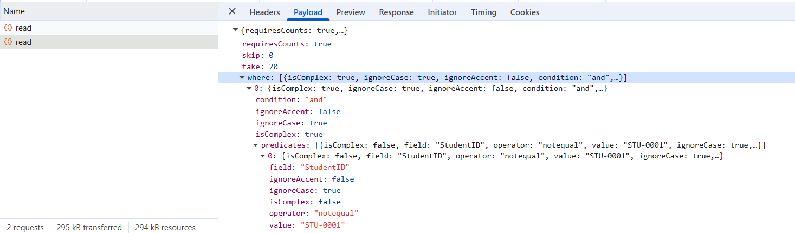
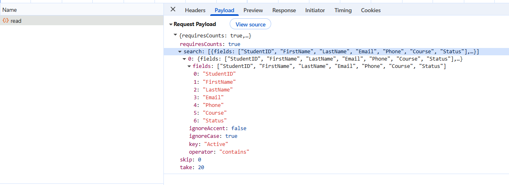
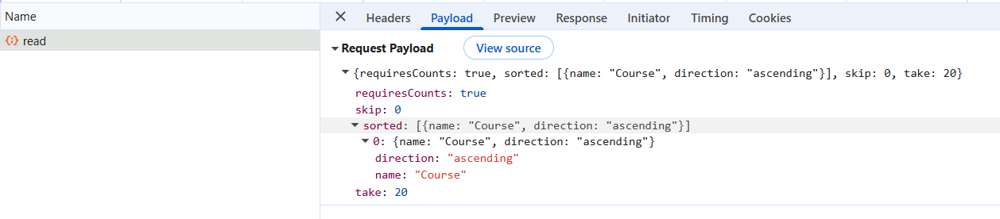
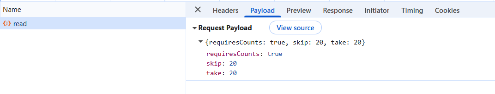
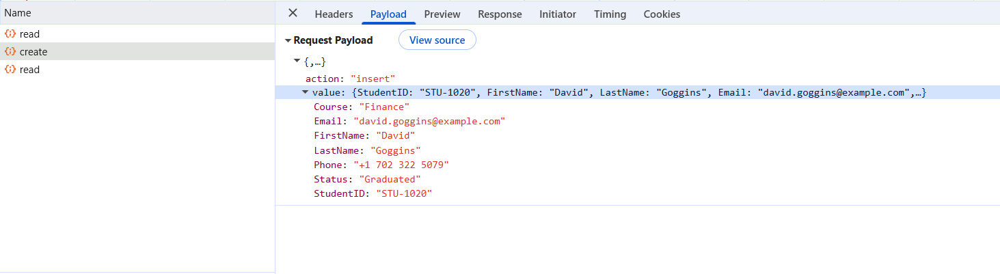
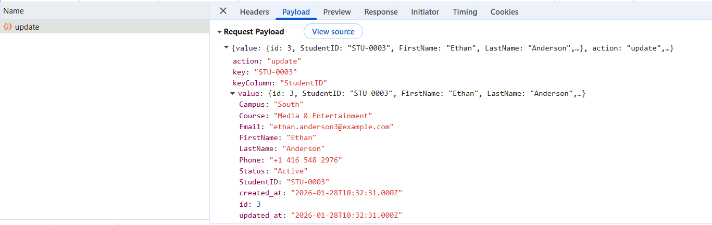
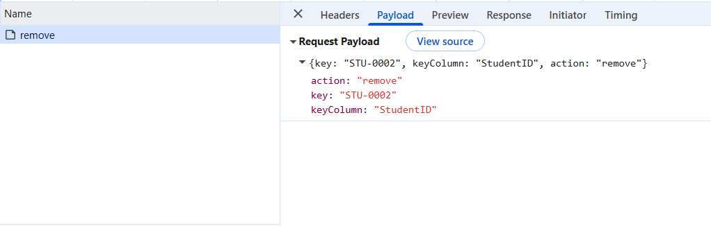

# Connecting PHP Laravel data to Syncfusion Grid with PHP

[Laravel](https://laravel.com/docs/12.x) is a modern PHP framework that provides a clean, elegant syntax and powerful features for building web applications. The Syncfusion ##Platform_Name## Grid component seamlessly integrates with the Laravel framework and MySQL Server, providing strong support for RESTful APIs. By combining Laravel’s robust backend with the Grid’s rich frontend features enables the creation of interactive, responsive data management interfaces with minimal custom code.

## Why Integrate Laravel with Syncfusion Grid?

- **Streamlined Data Connectivity**: Syncfusion Grid easily consumes RESTful API endpoints, enabling smooth communication with any backend service.

- **Simplified Data Handling**: It provides built‑in support for CRUD operations, enabling records to be managed directly in the Grid without complex setup.

- **Scalable Performance**: With server‑side processing for filtering, sorting, and paging, Syncfusion Grid ensures responsive performance even with large datasets.

- **Rich Feature Set**: Syncfusion Grid provides an extensive collection of advanced features such as grouping, exporting, column customization, and responsive layouts. These capabilities make it a versatile and scalable solution for enterprise‑grade data management.

## Prerequisites

Before proceeding, ensure that the following tools are installed and configured:

| Requirement | Version | Purpose |
|-------------|---------|---------|
| **PHP** | 8.1 or higher | Laravel runtime environment |
| **Composer** | 2.0+ | PHP package manager for dependencies |
| **Node.js** | 14.x or higher | JavaScript runtime for frontend tools |
| **MySQL** | 8.0 or higher | Database server (or PostgreSQL, SQLite) |
| **Laravel** | 10.x or 11.x | PHP web application framework |
| **Git** | 2.30+ | Version control system |

**Recommended development tools:**

- Visual Studio Code or another preferred editor.
- Postman or Insomnia for API testing.
- MySQL Workbench or phpMyAdmin for database management.

## Key topics

| # | Topics | Link |
|---|---------|-------|
| 1 | Create a Laravel project, configure the database, and set up models with migrations | [View](#setting-up-the-laravel-application) |
| 2 | Create Blade templates and configure `UrlAdaptor` for seamless Grid integration | [View](#integrating-syncfusion-grid-with-laravel-api) |
| 3 | Handle server-side filtering, searching, sorting, and paging for efficient data processing | [View](#performing-data-operations) |
| 4 | Enable insert, read, update, and delete operations from the Grid using `UrlAdaptor` | [View](#performing-crud-operations) |
| 5 | Run the Laravel development server and access the application locally | [View](#running-the-application) |
| 6 | Explore a complete working sample on GitHub | [View](#github-sample) |

### Verifying Installation

Open a terminal (for example, an integrated terminal in Visual Studio Code or Windows Command Prompt opened with <kbd>Win+R</kbd>, or macOS Terminal launched with <kbd>Cmd+Space</kbd>) and run the following command to verify installation:

```bash
# Check PHP version
php -v

# Check Composer version
composer --version

# Check Node.js version
node --version

# Check MySQL version
mysql --version
```
Error during command execution. The corresponding tool may not be installed or configured correctly. See the [troubleshooting](#troubleshooting) section at the end of this guide for installation help.

## Building the Laravel application

Follow these steps to create a new Laravel application:

Open the terminal in Visual Studio Code or Command Prompt before running the steps and commands below to create a new Laravel application.

### Step 1: Create a new PHP with Laravel project

Run the following command to create a new Laravel project using Composer:

```bash 
composer create-project laravel/laravel grid-demo
cd grid-demo
```

This command creates a folder named **grid-demo** containing the default Laravel application structure, including configuration files, directories, and dependency management.

### Step 2: Configure the database

Create a new database for the application by running the following commands:

```bash
# For MySQL using command line
mysql -u root -p
CREATE DATABASE students_db CHARACTER SET utf8mb4 COLLATE utf8mb4_unicode_ci;
EXIT;
```

This command creates a database named "students_db" with UTF-8 character set and Unicode collation for proper text handling.

Update the `.env` file in the project root with database credentials:

```
DB_CONNECTION=mysql
DB_HOST=127.0.0.1
DB_PORT=3306
DB_DATABASE=students_db
DB_USERNAME=root
DB_PASSWORD=your_password
```

> **Note:** The `.env` file stores sensitive configuration. Never commit it to version control. Database credentials in `DB_USERNAME` and `DB_PASSWORD` must match the MySQL configuration.

### Step 3: Create a model with migration

Generate a model with migration for managing student data:

```bash
php artisan make:model Student -m
```
This command creates two files:
- **Model**: (**app/Models/Student.php**) — represents the students table and allows object‑oriented interaction with the database.
- **Migration**: (**database/migrations/xxxx_xx_xx_create_students_table.php**) — a schema file used to define or modify database tables.

> The **xxxx_xx_xx** part is a timestamp automatically added by Laravel. It ensures migrations run in the correct order. Even though the name looks like a "version" this file is simply the first definition of the "students" table.

Update the migration file (**database/migrations/xxxx_xx_xx_create_students_table.php**) with the following schema:

```php
<?php

use Illuminate\Database\Migrations\Migration;
use Illuminate\Database\Schema\Blueprint;
use Illuminate\Support\Facades\Schema;

return new class extends Migration
{
    public function up(): void
    {
        Schema::create('students', function (Blueprint $table) {
            $table->id('StudentID');
            $table->string('FirstName');
            $table->string('LastName')->nullable();
            $table->string('Email')->unique();
            $table->string('Course')->nullable();
            $table->enum('Status', ['Active', 'Inactive', 'Graduated'])->default('Active');
            $table->enum('Campus', ['Main', 'Downtown', 'North', 'South'])->default('Main');
            $table->timestamps();
            
            // Add indexes for better query performance
            $table->index('FirstName');
            $table->index('Course');
        });
    }

    public function down(): void
    {
        Schema::dropIfExists('students');
    }
};
```
Run the following migration command to apply the schema (with its columns, indexes, and constraints) and create the "students" table:

```bash
php artisan migrate
```

### Step 4: Update the student model

Update the student model (**app/Models/Student.php**) to configure [Eloquent ORM](https://laravel.com/docs/eloquent) for database interactions:

```php
<?php

namespace App\Models;

use Illuminate\Database\Eloquent\Model;

class Student extends Model
{
    protected $primaryKey = 'StudentID';
    public $timestamps = true;
    
    protected $fillable = [
        'FirstName',
        'LastName',
        'Email',
        'Course',
        'Status',
        'Campus'
    ];
    
    protected $casts = [
        'created_at' => 'datetime',
        'updated_at' => 'datetime',
    ];
}
```

**Key Details:**

- The "$fillable" array specifies which fields can be mass‑assigned using methods like "create()" or "fill()".  
- The "$primaryKey" property tells Laravel that "StudentID" is the unique identifier for this model.  
- The "$timestamps" property enables automatic tracking of the "created_at" and "updated_at" fields.  
- The "$casts" property ensures timestamp fields are treated as proper datetime objects in PHP.  

> **Primary Key:** A primary key ("StudentID") uniquely identifies each record in the table and enables efficient lookups and relationships.

### Step 5: Create a server controller

Generate a controller by executing the following command. The controller will handle server‑side operations:

```bash
php artisan make:controller ServerController
```

This command creates the **ServerController.php** file inside the (**app/Http/Controllers**) folder. It will manage data operations such as reading, inserting, updating, and deleting records.

```php
<?php

namespace App\Http\Controllers;

use Illuminate\Http\Request;
use App\Models\Student;
use Illuminate\Support\Facades\Validator;

class ServerController extends Controller
{
    /**
     * Read/Query handler
     */
    public function read(Request $request)
    {
        try {
            $query = Student::query();
            $count = $query->count();  // Get total BEFORE pagination
            
            // ...filtering, sorting, searching logic...
            
            $result = $query->get();
            
            return response()->json([
                'result' => $result,
                'count'  => $count
            ]);
        } catch (\Exception $e) {
            return response()->json(['error' => $e->getMessage()], 500);
        }
    }
}
```

 This example demonstrates only basic data retrieval. Filtering, searching, sorting, and paging will be covered later in [performing data operations](#performing-data-operations) section.

### Step 6: Define API routes

After creating the **ServerController**, API routes must be defined to connect client requests to its methods. Open the existing (**routes/api.php**) file and add the following routes:

```php
<?php

use Illuminate\Http\Request;
use Illuminate\Support\Facades\Route;
use App\Http\Controllers\ServerController;

Route::middleware('auth:sanctum')->get('/user', function (Request $request) {
    return $request->user();
});

Route::post('/read', [ServerController::class, 'read']);            // Read/Query
Route::post('/insert', [ServerController::class, 'insert']);        // Insert
Route::post('/update', [ServerController::class, 'update']);        // Update
Route::post('/remove', [ServerController::class, 'remove']);        // Delete
```

These routes map Grid actions to specific controller methods. Each route listens for a `POST` request (/read, /insert, /update, /remove) and directs it to the corresponding method in **ServerController**.

### Step 7: Configure the CORS

Configure Cross-Origin Resource Sharing (CORS) in the (**config/cors.php**) file. CORS controls which external domains are permitted to access the API. Without CORS configuration, the frontend Grid will receive blocked requests and fail to load or update data.

```php
'allowed_origins' => ['*'],
'allowed_methods' => ['*'],
'allowed_headers' => ['*'],
'exposed_headers' => [],
'max_age' => 0,
'supports_credentials' => false,
```

> Allowing all origins ('*') is fine for development. In production, replace this with the actual domain for security.

### Step 8: Creating the database seeder

Update the (**database/seeders/DatabaseSeeder.php**) file to populate the database with sample student data for testing.

> **Seeders:** Seeders are Laravel classes that automatically fill database tables with test data. They are useful during development and testing because they save time compared to entering records manually.

```php
<?php

namespace Database\Seeders;

use Illuminate\Database\Seeder;
use App\Models\Student;

class DatabaseSeeder extends Seeder
{
    /**
     * Seed the application's database.
     * This generates 1000 student records dynamically for testing the Grid with large datasets
     */
    public function run(): void
    {
        // Clear existing students
        Student::truncate();

        // Generate 1000 student records dynamically
        $firstNames = ['John', 'Emily', 'Michael', 'Olivia', 'Daniel', 'Ethan', 'Madison', 'Logan', 'Chloe', 'Jackson', 'William', 'Abigail', 'Henry', 'Victoria', 'Samuel', 'Charles', 'Megan', 'Jason', 'Lily', 'Alexander', 'Jacob', 'Emma', 'Lucas', 'Amelia', 'Mason', 'Liam', 'Ava', 'Noah', 'Sophie', 'Elijah', 'Isabella', 'Benjamin', 'Harper', 'Evelyn', 'James', 'Scarlett', 'Caroline', 'Hudson', 'Paisley', 'Charlotte', 'Oliver', 'Avery', 'Julia', 'Aiden', 'Nathan', 'Sophia', 'David'];
        
        $lastNames = ['Miller', 'Johnson', 'Anderson', 'Harris', 'Thompson', 'Carter', 'Rivera', 'Brooks', 'Ward', 'Bailey', 'Clark', 'Lewis', 'Allen', 'Young', 'King', 'Green', 'Hall', 'Adams', 'Baker', 'Nelson', 'Murphy', 'Davis', 'Garcia', 'Martinez', 'Lee', 'Taylor', 'Thomas', 'Jackson', 'White', 'Martin', 'Rodriguez', 'Wilson', 'Moore', 'Williams', 'Myers', 'Kelley', 'Watts', 'Barrett', 'Shaw', 'Bennett', 'Scott', 'Pierce', 'Reed', 'Henderson'];
        
        $courses = ['Banking', 'Finance', 'Investment Banking', 'E-Commerce', 'Healthcare Management', 'Environmental Science', 'Retail Management', 'Logistics', 'Supply Chain', 'Philosophy', 'Hospitality', 'Graphic Design', 'Media & Entertainment'];
        
        $statuses = ['Active', 'Graduated', 'Inactive'];
        
        $campuses = ['Main', 'Downtown', 'North', 'South'];

        $students = [];

        for ($i = 1; $i <= 1000; $i++) {
            $firstName = $firstNames[array_rand($firstNames)];
            $lastName = $lastNames[array_rand($lastNames)];

            $students[] = [
                'FirstName' => $firstName,
                'LastName' => $lastName,
                'Email' => strtolower($firstName . '.' . $lastName . $i . '@example.com'),
                'Course' => $courses[array_rand($courses)],
                'Status' => $statuses[array_rand($statuses)],
                'Campus' => $campuses[array_rand($campuses)]
            ];
        }

        // Insert all student records into database
        foreach ($students as $student) {
            Student::create($student);
        }

        // Log completion
        $this->command->info('Successfully seeded ' . count($students) . ' students into the database.');
    }
}
```

Run the seeder with the following command in the Visual Studio Code terminal or Command Prompt:

```bash
php artisan migrate:fresh --seed
```

This command executes the DatabaseSeeder, which populates the database with 1,000 dynamically generated student records. Each record contains a first name, last name, email, course, status, and campus assignment, and is assigned a unique auto‑incremented "StudentID".

## Integrating Syncfusion Grid with PHP and Laravel API

The following steps outline the process to integrate and connect the Syncfusion<sup style="font-size:70%">&reg;</sup> Grid with a Laravel API.

### Step 1: Create the main Blade view file

Laravel uses **Blade** as its templating engine. Blade makes it easy to mix PHP with HTML using a simple and safe syntax. For example, variables can be displayed with "{{ $name }}", and control structures like **@if** or **@foreach** can be used without writing long PHP tags.

Create a new **Blade** file at (**resources/views/grid.blade.php**). This file will serve as the main HTML page where the Syncfusion Grid will be rendered:

```html
<!DOCTYPE html>
<html lang="en">
<head>
    <meta charset="UTF-8">
    <meta name="viewport" content="width=device-width, initial-scale=1.0">
    <title>Student Management Grid</title>
</head>
<body>
    <div class="container">
        <h1>Student Management System</h1>
        <div id="Grid"></div>
    </div>

    <script>
        document.addEventListener('DOMContentLoaded', function() {
            // Initialize the component here
        });
    </script>
</body>
</html>
```

### Step 2: Add Syncfusion references

Include Syncfusion’s CSS and JavaScript libraries using CDN links:

```html
<!-- Syncfusion EJ2 CSS Theme (Material 3 Light) -->
<link rel="stylesheet" href="https://cdn.syncfusion.com/ej2/32.1.24/material3.css">
<!-- Syncfusion EJ2 JavaScript Library -->
<script src="https://cdn.syncfusion.com/ej2/32.1.24/dist/ej2.min.js"></script>
```
These Syncfusion CDN links load all EJ2 components and styles, enabling the Syncfusion Grid and other integrated components in the application. For projects that prefer local installation, use local script and style [references](https://ej2.syncfusion.com/javascript/documentation/grid/getting-started#using-local-script-and-style).

In this example, the "Material 3" theme is applied. Other themes can be chosen or customized as needed. For more details, refer to the [Syncfusion React Components Appearance](https://ej2.syncfusion.com/javascript/documentation/appearance/theme) documentation.

### Step 3: Connect the Grid and Laravel API by using the DataManager

The Syncfusion [DataManager](https://ej2.syncfusion.com/javascript/documentation/data/overview) acts as the data layer and serves as a bridge between the Syncfusion Grid and the backend. Every action performed in the Grid such as fetching records, sorting, filtering, searching, paging, or performing CRUD (Create, Read, Update, Delete) operations is routed through the DataManager. It standardizes communication with remote services and ensures that queries are properly serialized before reaching the server.

The [UrlAdaptor](https://ej2.syncfusion.com/javascript/documentation/data/adaptors#url-adaptor) is a built‑in adaptor specifically designed for custom RESTful APIs like Laravel. It defines the format of requests and the processing of responses. The UrlAdaptor converts Grid actions into HTTP `POST` requests and manages the JSON responses returned by the server, enabling the Grid to display and handle data seamlessly.

If the `UrlAdaptor` does not meet the requirements of a project, other adaptors can be used. For example, the `WebApiAdaptor` is available for scenarios where APIs follow different conventions.

The `UrlAdaptor` expects the server to respond with a JSON object containing:

  - **result**: An array of data records for the current page (records to be displayed on demand).
  - **count**: The total number of records available on the server (required for accurate pagination).

```
const dataManager = new ej.data.DataManager({
    url: "{{ url('/api/read') }}",              // POST endpoint for featching data with filters, sort, paging
    insertUrl: "{{ url('/api/insert') }}",      // POST endpoint for inserting new records
    updateUrl: "{{ url('/api/update') }}",      // POST endpoint for updating records
    removeUrl: "{{ url('/api/remove') }}",      // POST endpoint for deleting records
    adaptor: new ej.data.UrlAdaptor(),          // Activates the UrlAdaptor
});
```

**API Interaction Flow**:

This section describes the communication between the Syncfusion Grid and the existing **ServerController**(ServerController.php), where requests are sent through the `DataManager` and processed responses are returned for data operations.

1. **Read Request** - When Grid loads or performs data operations:
   - Client sends `POST` to `/api/read` with `DataManager` state (where, sorted, search, skip, take).
   - ServerController processes and returns: `{ result: [...], count: total }`.

2. **Insert Request** - When adding a new record:
   - Client sends `POST` to `/api/insert` with new record in `value` property.
   - ServerController inserts the record and returns the saved record.

3. **Update Request** - When updating a record:
   - Client sends `POST` to `/api/update` with modified record in `value` property.
   - ServerController updates and returns the updated record.

4. **Remove Request** - When deleting a record:
   - Client sends `POST` to `/api/remove` with primary key.
   - ServerController deletes and returns confirmation.

### Step 4: Initialize Grid with UrlAdaptor

Add the Grid initialization in the Blade template's script section and set the `dataSource` with the already created `DataManager` instance.

```javascript
document.addEventListener('DOMContentLoaded', function() {

    // Initialize Grid
    const grid = new ej.grids.Grid({
        dataSource: dataManager,
        allowPaging: true,
        pageSettings: { pageSize: 10 },
        allowSorting: true,
        allowFiltering: true,
        editSettings: { allowEditing: true, allowAdding: true, allowDeleting: true, mode: 'Normal' },
        toolbar: ['Add', 'Edit', 'Delete', 'Update', 'Cancel', 'Search'],
        columns: [
            { field: 'StudentID', headerText: 'ID', width: '100', isPrimaryKey: true, allowEditing: false },
            { field: 'FirstName', headerText: 'First Name', width: 150, validationRules: { required: true } },
            { field: 'LastName', headerText: 'Last Name', width: '150' },
            { field: 'Email', headerText: 'Email', width: '200', validationRules: { required: true, email: true } },
            { field: 'Course', headerText: 'Course', width: '200' },
            { field: 'Status', headerText: 'Status', width: '120' }
        ],
        actionFailure: function(args) {
            console.error('Grid action failed:', args.error);
        }
    });

    // Render the Grid
    grid.appendTo('#Grid');
});
```

### Step 5: Define web route

In Laravel, routes are used to map incoming HTTP requests to specific views or controller actions. By default, all routes are defined inside the (**routes/web.php**) file for web‑based requests.

A simple route is defined to load the Grid view when the root URL (/) of the application is visited.

```php
<?php

use Illuminate\Support\Facades\Route;

Route::get('/', function () {
    return view('grid');
});
```

## Performing data operations

The **ServerController** (ServerController.php) works with the `UrlAdaptor` to handle all Grid data operations. Actions such as filtering, searching, sorting, and paging are sent through the single /api/read endpoint. The "read" method in the controller receives these requests, applies the conditions to the database query, and returns the results back to the Grid.

For detailed `DataManager` request parameter documentation, refer to the [DataManager](https://ej2.syncfusion.com/javascript/documentation/data/overview) documentation.

### Filtering

When the Grid performs a filtering action, the `UrlAdaptor` sends filter conditions to the `/api/read` endpoint in a `where` parameter. The "applyWhere()" and "applyOperator()" methods handle these conditions and build the database filter query.



**Client-to-server communication:**
- Grid sends `POST` to `/api/read` with `where` parameter containing filter predicates (field, operator, value).
- The **ServerController** receives the request and calls "applyWhere()" method.
- "applyWhere()" processes predicates and applies WHERE clauses to the database query.
- "applyOperator()" converts Grid operators to SQL operations.
- Supported operators: equal, notequal, greaterthan, lessthan, contains, startswith, endswith, in, notin.
- The filtered results are returned to the Grid in JSON format containing the "result" records and the "count" of total available records.


```php
class ServerController extends Controller
{
    public function read(Request $dm)
    {
        try {
            $query = Student::query();
            $count = $query->count();

            // Apply filtering
            if (!empty($dm['where'])) {
                $this->applyWhere($query, $dm['where']);
            }

            $result = $query->get();

            return response()->json([
                'result' => $result,
                'count'  => $dm['requiresCounts'] ? $count : $result->count()
            ]);
        } catch (\Exception $e) {
            return response()->json(['error' => $e->getMessage()], 500);
        }
    }
}
```

The "applyWhere()" method processes filter predicates and applies WHERE clauses to the database query. It handles both simple and complex filter conditions with multiple predicates and nested AND/OR logic.

```php
private function applyWhere($query, array $where)
{
    $applyGroup = function($q, $group, $logic = 'and') use (&$applyGroup) {
        $method = strtolower($logic) === 'or' ? 'orWhere' : 'where';
        
        foreach ($group as $pred) {
            // Handle complex (nested) predicates
            if (!empty($pred['isComplex']) && !empty($pred['predicates'])) {
                $q->$method(function($nested) use ($pred, $applyGroup) {
                    $applyGroup($nested, $pred['predicates'], $pred['condition'] ?? 'and');
                });
                continue;
            }
            
            // Simple predicate
            $field = $pred['field'] ?? null;
            $operator = $pred['operator'] ?? 'equal';
            $value = $pred['value'] ?? null;
            $ignoreCase = $pred['ignoreCase'] ?? true;
            
            if (!$field) continue;
            
            $this->applyOperator($q, $method, $field, $operator, $value, $ignoreCase);
        }
    };
    
    $applyGroup($query, $where, 'and');
}
```

For the complete implementation, refer to the [applyWhere()](https://github.com/SyncfusionExamples/syncfusion-grid-component-in-php-laravel/blob/master/app/Http/Controllers/ServerController.php#L119) method.

The "applyOperator()" method maps individual Grid filter operators to SQL operations, applying them to the database query and supporting all standard comparison types.

**Supported Operators:**
- **equal, notequal** - Equality comparisons
- **contains, startswith, endswith** - String pattern matching
- **greaterthan, greaterthanorequal, lessthan, lessthanorequal** - Numeric comparisons
- **in, notin** - Array value checks

```php
private function applyOperator($q, $method, $field, $operator, $value, $ignoreCase)
{
    switch ($operator) {
        case 'equal':
            $q->$method($field, '=', $value);
            break;
        case 'notequal':
            $q->$method($field, '!=', $value);
            break;
        case 'greaterthan':
            $q->$method($field, '>', $value);
            break;
        case 'greaterthanorequal':
            $q->$method($field, '>=', $value);
            break;
        case 'lessthan':
            $q->$method($field, '<', $value);
            break;
        case 'lessthanorequal':
            $q->$method($field, '<=', $value);
            break;
        case 'contains':
            if ($ignoreCase) {
                if ($method === 'orWhere') {
                    $q->orWhereRaw("LOWER($field) LIKE ?", [mb_strtolower('%' . $value . '%')]);
                } else {
                    $q->whereRaw("LOWER($field) LIKE ?", [mb_strtolower('%' . $value . '%')]);
                }
            } else {
                $q->$method($field, 'LIKE', '%' . $value . '%');
            }
            break;
        case 'startswith':
            if ($ignoreCase) {
                if ($method === 'orWhere') {
                    $q->orWhereRaw("LOWER($field) LIKE ?", [mb_strtolower($value . '%')]);
                } else {
                    $q->whereRaw("LOWER($field) LIKE ?", [mb_strtolower($value . '%')]);
                }
            } else {
                $q->$method($field, 'LIKE', $value . '%');
            }
            break;
        case 'endswith':
            if ($ignoreCase) {
                if ($method === 'orWhere') {
                    $q->orWhereRaw("LOWER($field) LIKE ?", [mb_strtolower('%' . $value)]);
                } else {
                    $q->whereRaw("LOWER($field) LIKE ?", [mb_strtolower('%' . $value)]);
                }
            } else {
                $q->$method($field, 'LIKE', '%' . $value);
            }
            break;
        case 'in':
            $methodName = $method . 'In';
            $q->$methodName($field, is_array($value) ? $value : [$value]);
            break;
        case 'notin':
            $methodName = $method . 'NotIn';
            $q->$methodName($field, is_array($value) ? $value : [$value]);
            break;
        case 'isnull':
            $q->$method . 'Null'($field);
            break;
        case 'isnotnull':
            $q->$method . 'NotNull'($field);
            break;
        default:
            $q->$method($field, '=', $value);
    }
}
```

For the complete implementation, refer to the [applyOperator()](https://github.com/SyncfusionExamples/syncfusion-grid-component-in-php-laravel/blob/master/app/Http/Controllers/ServerController.php#L151) method.

### Searching

During the search action, `UrlAdaptor` sends the search text along with the target columns to the `/api/read` endpoint of the **ServerController** in a parameter named search.



**Client-to-server communication:**
- The Grid sends a `POST` request to `/api/read` with a "search" parameter that includes the search term and target fields.
- Both case‑insensitive and case‑sensitive searches are supported.
- The matching results are returned to the Grid in JSON format containing the "result" records and the "count" of total available records.

```php
class ServerController extends Controller
{
    /**
     * Fetch students data with search
     */
    public function read(Request $dm)
    {
        try {
            $query = Student::query();

            // Get total count before applying filters
            $count = $query->count();

            // Apply search conditions
            if (!empty($dm['search'])) {
                foreach ($dm['search'] as $s) {
                    $fields = $s['fields'] ?? [];
                    $key = $s['key'] ?? '';
                    
                    if (empty($fields) || !$key) continue;
                    
                    $operator = $s['operator'] ?? 'contains';
                    $ignoreCase = $s['ignoreCase'] ?? true;
                    
                    $query->where(function($q) use ($fields, $key, $operator, $ignoreCase) {
                        foreach ($fields as $i => $field) {
                            $method = $i === 0 ? 'where' : 'orWhere';
                            
                            if ($operator === 'contains') {
                                if ($ignoreCase) {
                                    if ($method === 'orWhere') {
                                        $q->orWhereRaw("LOWER($field) LIKE ?", [mb_strtolower('%' . $key . '%')]);
                                    } else {
                                        $q->whereRaw("LOWER($field) LIKE ?", [mb_strtolower('%' . $key . '%')]);
                                    }
                                } else {
                                    $q->$method($field, 'LIKE', '%' . $key . '%');
                                }
                            } else {
                                $q->$method($field, '=', $key);
                            }
                        }
                    });
                }
            }

            $result = $query->get();

            return response()->json([
                'result' => $result,
                'count'  => $dm['requiresCounts'] ? $count : $result->count()
            ]);
        } catch (\Exception $e) {
            return response()->json(['error' => $e->getMessage()], 500);
        }
    }
}
```

### Sorting

Sorting operations are handled in the "read" method based on the `sorted` parameter received from the client. `UrlAdaptor` sends the column name and sort direction (ascending or descending) to the `/api/read` endpoint of the **ServerController**.



**Client-to-server communication:**
- The Grid sends a `POST` request to `/api/read` with a sorted parameter that includes the column name and sort direction.
- The **ServerController** receives this request and processes sorting in the read method.
- An `orderBy` clause is applied to sort results in ascending or descending order.
- The sorted results are returned to the Grid in JSON format with the result records and the count of total available records.


```php
class ServerController extends Controller
{
    /**
     * Fetch students data with sorting
     */
    public function read(Request $dm)
    {
        try {
            $query = Student::query();

            // Get total count before applying filters
            $count = $query->count();

            if (!empty($dm['sorted'])) {
                foreach ($dm['sorted'] as $sort) {
                    $direction = strtolower($sort['direction'] ?? 'ascending') === 'descending' ? 'desc' : 'asc';
                    $query->orderBy($sort['name'], $direction);
                }
            }

            $result = $query->get();

            return response()->json([
                'result' => $result,
                'count'  => $dm['requiresCounts'] ? $count : $result->count()
            ]);
        } catch (\Exception $e) {
            return response()->json(['error' => $e->getMessage()], 500);
        }
    }
}
```

### Paging

Server-side pagination is implemented using the `skip` and `take` parameters received from the client in the `/api/read` endpoint. Instead of loading all records at once, the server retrieves only the current page data from the database.

Server-side pagination is implemented using the `skip` and `take` parameters sent from the client to the `/api/read` endpoint in the **ServerController**. Instead of loading all records at once, the server retrieves only the current page's data from the database, improving performance and efficiency.



**Client-to-server communication:**
- The Grid sends a `POST` request to `/api/read` with skip (offset) and take (limit) parameters.
- The **ServerController** receives these parameters in the read method.
- The query applies `skip()` to offset records and `take()` to limit results based on the page size.
- The total record count is calculated before paging to ensure correct pagination display.
- Paginated results are returned to the Grid in JSON format with the result records and the count of total available records.

```php

class ServerController extends Controller
{
    /**
     * Fetch students data
     */
    public function read(Request $dm)
    {
        try {
            $query = Student::query();

            // Get total count before applying filters
            $count = $query->count();

            if (isset($dm['skip']) && $dm['skip'] != 0) {
                $query->skip((int) $dm['skip']);
            }
            if (isset($dm['take']) && $dm['take'] != 0) {
                $query->take((int) $dm['take']);
            }

            $result = $query->get();

            return response()->json([
                'result' => $result,
                'count'  => $dm['requiresCounts'] ? $count : $result->count()
            ]);
        } catch (\Exception $e) {
            return response()->json(['error' => $e->getMessage()], 500);
        }
    }
}

```

## Performing CRUD operations

The **ServerController** handles insert, update, and delete operations triggered by `UrlAdaptor` with each action routed through its corresponding API endpoint.

### Insert

The "insert" method handles creating new student records. When the "Add" button is clicked and the form is submitted, `UrlAdaptor` sends the new record data to `/api/insert` endpoint of the **ServerController**.



**Client-to-server communication:**

- The Grid sends a `POST` request to `/api/insert` with new record data in the value property.
- The ServerController’s insert method receives and validates the data.
- Required fields are checked (for example, "FirstName" is mandatory).
- A new student record is created using Eloquent ORM.
- The server returns the created record along with the generated ID.
- The Grid updates its table display with the newly created record returned from the server.

```php
/**
 * Insert handler for new records
 */
public function insert(Request $request)
{
    try {
        $data = $request->json()->all() ?: $request->all();
        $updatedRecord = $data['value'] ?? $data;

        // Validate required fields - FirstName is mandatory
        if (empty($updatedRecord['FirstName'])) {
            return response()->json(['message' => 'FirstName is required'], 422);
        }
        
        $student = Student::create($updatedRecord);
        return response()->json($student, 201);
    } catch (\Exception $e) {
        return response()->json(['message' => 'Insert failed: ' . $e->getMessage()], 422);
    }
}
```

### Update

The "update" method handles modifying existing student records. When a record is edited and submitted, the `UrlAdaptor` sends the updated data to the `/api/update` endpoint of the ServerController.



**Client-to-server communication:**

- The Grid sends a `POST` request to `/api/update` with modified record data in the value property.
- The ServerController’s update method receives the request.
- The "StudentID" is extracted as the primary key to identify the record.
- The record is located using Eloquent’s "where()" method.
- All changed fields are updated using "fill()" and "save()".
- The updated record is returned to refresh the Grid display.

```php
/**
 * Update handler for existing records
 */
public function update(Request $request)
{
    try {
        // Retrieve updated record from request
        $requestData = $request->json()->all() ?: $request->all();
        $updatedRecord = $requestData['value'] ?? $requestData;
            
        // Grid sends StudentID as the key for updates
        $studentId = $updatedRecord['StudentID'] ?? null;
            
        if (empty($studentId)) {
            return response()->json(['message' => 'Missing StudentID'], 422);
        }
            
        $student = Student::where('StudentID', $studentId)->firstOrFail();
            
        $student->fill($updatedRecord)->save();
            
        // Retrieve and return updated record
        $updatedRecord = $student->fresh();
        return response()->json($updatedRecord);
    } catch (\Exception $e) {
        return response()->json(['message' => 'Update failed: ' . $e->getMessage()], 422);
    }
}
```

### Delete

The "remove" method handles deleting student records from the database. When a record is selected and deleted, `UrlAdaptor` sends the primary key of that record to the `/api/remove` endpoint of the **ServerController**.



**Client-to-server communication:**
- The Grid sends a `POST` request to `/api/remove` with the primary key (StudentID).
- The ServerController’s remove method receives the request.
- The "StudentID" is extracted from the request parameters.
- The corresponding record is located and deleted from the database.
- A confirmation response is returned to the client.

```php
/**
 * Remove handler for deleting records
 */
public function remove(Request $request)
{
    try {
        $studentId = $request->json('key') ?: $request->input('key');
        
        if (!$studentId) {
            return response()->json(['message' => 'Missing StudentID'], 422);
        }
        
        Student::where('StudentID', $studentId)->firstOrFail()->delete();
        return response()->json(['deleted' => $studentId]);
    } catch (\Exception $e) {
        return response()->json(['message' => 'Delete failed: ' . $e->getMessage()], 422);
    }
}
```

## Running the application

Start the Laravel development server by running the following command in the Visual Studio Code terminal or Command Prompt:

```bash
php artisan serve
```

The application is now accessible at `http://localhost:8000`. The Grid displays student data from the database and enables filtering, searching, sorting, paging, and CRUD operations through the `UrlAdaptor` and Laravel API endpoints.

## Complete sample repository

A complete, working sample implementation is available in the [GitHub repository](https://github.com/SyncfusionExamples/syncfusion-grid-component-in-php-laravel).

The repository contains the complete Laravel backend implementation with all ServerController methods, API routes, database models, and migrations.

## Troubleshooting

**Issue: "Command not found: php"**
- **Solution:** PHP is not installed or not added to the system PATH. Visit [php.net](https://php.net) to download and install PHP. After installation, restart the terminal.

**Issue: "Command not found: composer"**
- **Solution:** Composer is not installed. Download it from [getcomposer.org](https://getcomposer.org) and follow the installation steps.

**Issue: "SQLSTATE[HY000]: General error: 1030 Got error..."**
- **Solution:** The database connection has failed. Confirm that `DB_HOST`, `DB_USERNAME`, and `DB_PASSWORD` in the `.env` file are configured correctly, and ensure MySQL is running.

**Issue: "Class 'App\Models\Student' not found"**
- **Solution:** The Student model wasn't created properly. Run:
  ```bash
  php artisan make:model Student -m
  ```

**Issue: "The migration file was not found"**
- **Solution:** Run migrations again:
  ```bash
  php artisan migrate
  ```

**Issue: "GridDataManager is not defined" or "Grid not displaying data"**
- **Solution:** Ensure Syncfusion CDN links are properly added to the HTML file. Check that the URLs are correct and accessible from the browser.

**Issue: "403 Forbidden error when submitting form"**
- **Solution:** CSRF token may be missing. Ensure the form includes:
  ```html
  {{ csrf_field() }}
  ```
  This applies only to web routes in (**routes/web.php**), not API routes.

**Issue: "419 error or 'Page Expired' when Grid tries to read/insert/update/delete data"**
- **Solution:** A CSRF token may have been accidentally added to API requests. API routes in (**routes/api.php**) are **automatically CSRF-exempt**. Do NOT add CSRF tokens to API calls. `UrlAdaptor` handles this correctly without tokens. If the error persists:
  1. Verify that (**routes/api.php**) is used (not (**routes/web.php**)) for API endpoints
  2. Remove any CSRF token headers from `DataManager` configuration
  3. Ensure the API route is prefixed with `/api/` in the URL (e.g., `{{ url('/api/read') }}`)

**Issue: "Grid shows data but filtering/sorting doesn't work"**
- **Solution:** Ensure the Laravel API endpoints (`/api/read`, `/api/insert`, `/api/update`, `/api/remove`) are properly defined in (**routes/api.php**) and the ServerController methods are implemented.

**Issue: "Port 8000 is already in use"**
- **Solution:** Another application is using port 8000. Run Laravel on a different port:
  ```bash
  php artisan serve --port=8001
  ```

**Issue: "CORS error: No 'Access-Control-Allow-Origin' header"**
- **Solution:** CORS is not properly configured. Ensure:
  1. The `fruitcake/laravel-cors` package is installed (`composer require fruitcake/laravel-cors`)
  2. `HandleCors` middleware is registered in `app/Http/Kernel.php` under the `$middleware` array
  3. `config/cors.php` is properly configured for the specified domain.
  ```php
  'allowed_origins' => ['http://localhost:8000', 'http://localhost:3000'],
  ```

**Issue: "Mass assignment exception when inserting/updating records"**
- **Solution:** A field being inserted is not in the model's `$fillable` array. Add the field to the Student model:
  ```php
  protected $fillable = ['FirstName', 'LastName', 'Email', 'Course', 'Status', 'Campus'];
  ```

**Issue: "Edit/Delete buttons don't work; Grid shows 'Editing failed'"**
- **Solution:** Verify StudentID type consistency:
  1. Check migration: `$table->id('StudentID')` creates auto-increment integer
  2. Check Grid column: `{ field: 'StudentID', isPrimaryKey: true }`
  3. Ensure seeder does NOT manually set StudentID (remove `'StudentID' => ...` line)
  4. Verify Controller update/remove methods use: `where('StudentID', $studentId)`

**Issue: "Grid loads but 404 error on read/insert/update/delete"**
- **Solution:** API routes are not registered. Verify (**routes/api.php**) contains:
  ```php
  Route::post('/read', [ServerController::class, 'read']);
  Route::post('/insert', [ServerController::class, 'insert']);
  Route::post('/update', [ServerController::class, 'update']);
  Route::post('/remove', [ServerController::class, 'remove']);
  ```

**Issue: "Filtering/Sorting/Paging shows no results or 500 error"**
- **Solution:** Ensure the "read()" method handles all `DataManager` parameters:
  1. Check that "applyWhere()", and sorting logic are implemented
  2. Verify `skip()` and `take()` parameters are processed correctly
  3. Return response with both `result` array and `count` property:
     ```php
     return response()->json(['result' => $records, 'count' => $total]);
     ```
