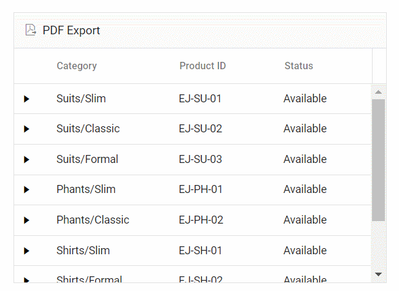

# Exporting grid with templates in ##Platform_Name## Grid control

The grid offers the option to export the column, detail, and caption templates to a PDF document. The template contains images, hyperlinks, and customized text.

## Exporting with column template

The PDF export functionality allows you to export Grid columns that include images, hyperlinks, and custom text to an PDF document.

In the following sample, the hyperlinks and images are exported to PDF using [hyperlink](../../api/grid/pdfQueryCellInfoEventArgs/#hyperlink) and [image](../../api/grid/pdfQueryCellInfoEventArgs/#image) properties in the [pdfQueryCellInfo](../../api/grid/#pdfquerycellinfo) event.

> PDF Export supports base64 string to export the images.



 







        
















## Exporting with detail template

By default, the grid will export the parent grid with expanded detail rows alone. Change the exporting option by using the `PdfExportProperties.hierarchyExportMode` property. The available options are:

| Mode     | Behavior    |
|----------|-------------|
| Expanded | Exports the parent grid with expanded detail rows. |
| All      | Exports the parent grid with all the detail rows. |
| None     | Exports the parent grid alone. |

The detail rows in the exported PDF can be customized or formatted using the [exportDetailTemplate](../../api/grid/#exportdetailtemplate) event. In this event, the detail rows of the PDF document are formatted in accordance with their parent row details.

In the following sample, the detail row content is formatted by specifying the [columnCount](../../api/grid/detailTemplateProperties/#columncount), [columnHeader](../../api/grid/detailTemplateProperties/#columnheader), and [rows](../../api/grid/detailTemplateProperties/#rows) properties using its [parentRow](../../api/grid/exportDetailTemplateEventArgs/#parentrow) details. This allows for the creation of detail rows in the PDF document. Additionally, custom styles can be applied to specific cells using the [style](../../api/grid/detailTemplateCell/#style) property.

> If `columnCount` is not provided, the columns in the detail row of the PDF grid will be generated based on the count of the `columnHeader`/`rows` first row's [cells](../../api/grid/detailTemplateRow/#cells).
> When using [rowSpan](../../api/grid/detailTemplateCell/#rowspan), it is essential to provide the cell's [index](../../api/grid/detailTemplateCell/#index) for proper functionality.



 







        
















## Exporting with caption template

The PDF export feature enables exporting of Grid with a caption template to an PDF document.

In the following sample, the customized caption text is exported to PDF using [captionText](../../api/grid/exportGroupCaptionEventArgs/#captiontext) property in the [exportGroupCaption](../../api/grid/#exportgroupcaption) event.



 







        
















