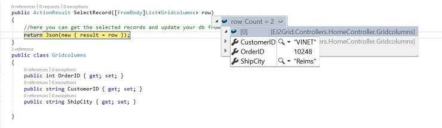

# Pdf export in ##Platform_Name## Grid control

PDF export allows exporting Grid data to PDF document. You need to use the [`pdfExport`](../../api/grid/#pdfexport) method for exporting. To enable PDF export in the grid, set the [`allowPdfExport`](../../api/grid/#allowpdfexport) as true.

To use PDF export, inject the `PdfExport` module in grid.



 







        















## Show spinner while exporting

You can show/ hide spinner component while exporting the grid using `showSpinner`/ `hideSpinner` methods. You can use `toolbarClick` event to show spinner before exporting and hide a spinner in the `pdfExportComplete` or `excelExportComplete` event after the exporting.

In the `toolbarClick` event, based on the parameter `args.item.id` as `Grid_pdfexport` or `Grid_excelexport` we can call the `showSpinner` method from grid instance.

In the `pdfExportComplete` or `excelExportComplete` event, We can call the `hideSpinner` method.

In the below demo, we have rendered the default spinner component when exporting the grid.



 







        















## Custom data source

PDF export provides an option to define datasource dynamically before exporting. To export data dynamically, define the `dataSource` in `exportProperties`



 







        















## Passing additional parameters to the server when exporting

You can pass the additional parameter in the `query` property by invoking `addParams` method. In the `toolbarClick` event, you can define params as key and value pair so it will receive at the server side when exporting.

In the below example, we have passed `recordcount` as `12` using `addParams` method.



 







        















## Passing the selected records to the server using ajax request via custom toolbar button click

You can pass the selected records to the server with the help of an ajax request. In the `toolbarClick` event, you can get the selected records using the [`getSelectedRecords`](../../api/grid/#getselectedrecords) method and pass the selected records to the server using the **data** property of the ajax.

```ts
import { Grid, Page,Toolbar } from '@syncfusion/ej2-grids';
import { Ajax } from '@syncfusion/ej2-base';

Grid.Inject(Page,Toolbar);
let grid: Grid = new Grid({
    dataSource: data,
    allowSelection: true,
    toolbar: ['Selected'],
    columns: [
        { type: 'checkbox', width: 50, },
        { field: 'OrderID', headerText: 'Order ID', textAlign: 'Right', width: 120},
        { field: 'CustomerID', width: 140, headerText: 'CustomerID'},
        { field: 'ShipCity', headerText: 'Ship Country', width: 140 }
    ],
    toolbarClick: function (args) {
        if (args.item.text === 'Selected') {
            var selectedRecord = this.getSelectedRecords();
            var ajax = new Ajax({
                url: "/Home/SelectRecord",
                type: "POST",
                contentType: "application/json",
                data: JSON.stringify(selectedRecord),
                successHandler: function (response) {
                    console.log(JSON.parse(response));
                },
                failure: function (response) {
                    alert(response);
                }
            });
            ajax.send();
        }
    },
});
grid.appendTo('#Grid');
```

The selected record details are bound to the `row` parameter. Please refer to the following screenshot.



## See Also

* [How to Exporting Grid in Cordova application](../how-to/exporting-grid-in-cordova-application)