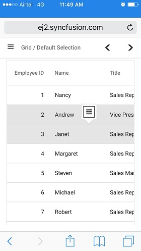

# Selection in ##Platform_Name## Grid control

Selection provides an option to highlight a row or a cell or a column. It can be done through simple mouse down or arrow keys. To disable selection in the Grid, set the [`allowSelection`](../../api/grid/#allowselection) to false.

The grid supports two types of selection that can be set by using the [`selectionSettings.type`](../../api/grid/selectionSettings/#type). They are:

* **`Single`**: The `Single` value is set by default, and it only allows selection of a single row or a cell or a column.
* **`Multiple`**: Allows you to select multiple rows or cells or columns.
To perform the multi-selection, press and hold CTRL key and click the desired rows or cells or columns. To select range of rows or cells or columns, press and hold the SHIFT key and click the rows or cells or columns.



 







        















## Selection mode

The grid supports three types of selection mode that can be set by using
the [`selectionSettings.mode`](../../api/grid/selectionSettings/#mode). They are:

* **`Row`**: The `Row` value is set by default, and allows you to select only rows.
* **`Cell`**: Allows you to select only cells.
* **`Both`**: Allows you to select rows and cells at the same time.



 







        















## Touch interaction

When you tap a grid row on touchscreen device, the tapped row is selected. It also shows a popup   for multi-row selection. To select multiple rows or cells, tap the popup  and then tap the desired rows or cells.

> Multi-selection requires the selection [`type`](../../api/grid/selectionSettings/#type) to be `multiple`.

The following screenshot represents a grid touch selection in the device.

