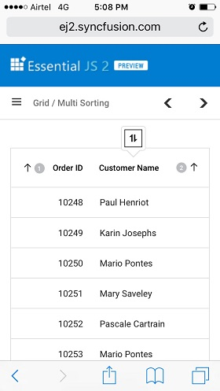

# Sorting in ##Platform_Name## Grid control

Sorting enables you to sort data in the `Ascending` or `Descending` order. To sort a column, click the column header.

To sort multiple columns, press and hold the CTRL key and click the column header.  You can clear sorting of any one of the multi-sorted columns by pressing and holding the SHIFT key and clicking the specific column header.

To enable sorting in the Grid, set the [`allowSorting`](../api/grid/#allowsorting) to true. Sorting options can be configured through the [`sortSettings`](../api/grid/#sortsettings).

To sort, inject the [`Sort`](../api/grid/sort) module in the grid.



 







        
















> * Grid columns are sorted in the `Ascending` order. If you click the already sorted column, the sort direction toggles.
> * You can apply and clear sorting by invoking [`sortColumn`](../api/grid/#sortcolumn) and [`clearSorting`](../api/grid/#clearsorting) methods.
> * To disable sorting for a particular column, set the [`columns.allowSorting`](../api/grid/column/#allowsorting) to false.

## Initial sort

To sort at initial rendering, set the [`field`](../api/grid/sortDescriptorModel/#field) and [`direction`](../api/grid/sortDescriptorModel/#direction-string) in the `sortSettings.columns`.



 







        
















## Multi-column sorting

You can sort more than one column in a Grid. To sort multiple columns, press and hold the `CTRL` key and click the column header. The sorting order will be displayed in the header while performing multi-column sorting.

To clear sorting for a particular column, press the "Shift + mouse left click".

> The [`allowSorting`](../api/grid/#allowsorting) must be true while enabling multi-column sort.
> Set [`allowMultiSorting`](../api/grid/#allowmultisorting) property as `false` to disable multi-column sorting.



 







        
















## Sort order

By default, the sorting order will be as `ascending -> descending -> none`.

When first click a column header it sorts the column in ascending. Again click the same column header, it will sort the column in descending. A repetitive third click on the same column header will clear the sorting.

## Sort foreign key column based on Text

For local data in Grid, sorting will be performed based on the [`foreignKeyValue`](../api/grid/column/#foreignkeyvalue).

For remote data in Grid, sorting will be performed based on the [`foreignKeyField`](../api/grid/column/#foreignkeyfield), we need to handle the sorting operation at the server side.

```ts
import { Grid, ForeignKey, Sort } from '@syncfusion/ej2-grids';
import { DataManager, ODataV4Adaptor } from '@syncfusion/ej2-data';

Grid.Inject(ForeignKey, Sort);

let dataSource: DataManager = new DataManager({
    json: '/OData/Items',
    adaptor: new ODataV4Adaptor
});
let employeeData: DataManager = new DataManager({
    url: '/OData/Brands',
    adaptor: new ODataV4Adaptor
});
let grid: Grid = new Grid(
    {
        dataSource: data,
        columns: [
            { field: 'OrderID', headerText: 'Order ID', textAlign: 'Right', width: 100 },
            {
                field: 'EmployeeID', headerText: 'Employee Name', width: 150, foreignKeyValue: 'FirstName', dataSource: employeeData
            },
            { field: 'Freight', headerText: 'Freight', width: 100, textAlign: 'Right'},
            { field: 'ShipName', headerText: 'Ship Name', width: 180 }
        ],
        height: 315
    });
grid.appendTo('#Grid');

```

The following code example describes the handling of sorting operation at the server side.

```
    public class ItemsController : ODataController
    {
        [EnableQuery]
        public IQueryable<Item> Get()
        {
            List<Item> GridData = JsonConvert.DeserializeObject<Item[]>(Properties.Resources.ItemsJson).AsQueryable().ToList();
            List<Brand> empData = JsonConvert.DeserializeObject<Brand[]>(Properties.Resources.BrandsJson).AsQueryable().ToList();
            var queryString = HttpContext.Current.Request.QueryString;
            var allUrlKeyValues = ControllerContext.Request.GetQueryNameValuePairs();
            string key = allUrlKeyValues.LastOrDefault(x => x.Key == "$orderby").Value;
            if (key != null)
            {
                if (key == "EmployeeID") {
                    GridData = SortFor(key); //Only for foreignKey Column ascending
                }
                else if(key == "EmployeeID desc") {
                    GridData = SortFor(key); //Only for foreignKey Column descending
                }
            }
            var count = GridData.Count();
            var data = GridData.AsQueryable();
            return data;
        }

        public List<Item> SortFor(String Sorted)
        {
            List<Item> GridData = JsonConvert.DeserializeObject<Item[]>(Properties.Resources.ItemsJson).AsQueryable().ToList();
            List<Brand> empData = JsonConvert.DeserializeObject<Brand[]>(Properties.Resources.BrandsJson).AsQueryable().ToList();
            if (Sorted == "EmployeeID") //check whether ascending or descending
                empData = empData.OrderBy(e => e.FirstName).ToList();
            else if(Sorted == "EmployeeID desc")
                empData = empData.OrderByDescending(e => e.FirstName).ToList();
            List<Item> or = new List<Item>();
            for (int i = 0; i < empData.Count(); i++) {
                //Select the Field matching records
                IEnumerable<Item> list = GridData.Where(pred => pred.EmployeeID == empData[i].EmployeeID).ToList();
                or.AddRange(list);
            }
            return or;
        }
    }
```

## Sorting events

During the sort action, the grid component triggers two events. The [`actionBegin`](../api/grid/#actionbegin) event triggers before the sort action starts, and the [`actionComplete`](../api/grid/#actioncomplete--emittypepageeventargsgroupeventargsfiltereventargssearcheventargssorteventargs) event triggers after the sort action is completed. Using these events you can perform the needed actions.



 







        
















> The [`args.requestType`](../api/grid/sortEventArgs/#requesttype) is the current action name. For example, in sorting the [`args.requestType`](../api/grid/sortEventArgs/#requesttype) value is 'sorting'.

## Custom sort comparer

You can customize the default sort action for a column by defining the [`column.sortComparer`](../api/grid/column/#sortcomparer) property. The sort comparer function has the same functionality like [`Array.sort`](https://developer.mozilla.org/en-US/docs/Web/JavaScript/Reference/Global_Objects/Array/sort) sort comparer.

In the following example, custom sort comparer function was defined in the `Customer ID` column.



 







        
















> The sort comparer function will work only for the local data.

## Touch interaction

When you tap the grid header on touchscreen devices, the selected column header is sorted. A popup  is displayed for multi-column sorting. To sort multiple columns, tap the popup, and then tap the desired grid headers.

> The [`allowMultiSorting`](../api/grid/#allowmultisorting) and [`allowSorting`](api/grid/#allowsorting) should be `true` then only the popup will be shown.

The following screenshot shows grid touch sorting.


