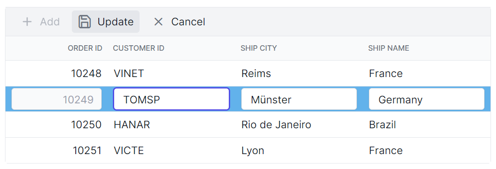
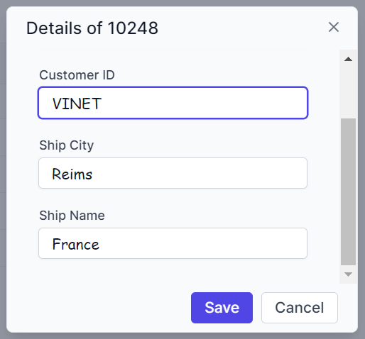

# Editing in ##Platform_Name## Grid control

You can customize the appearance of editing-related elements in the Syncfusion ##Platform_Name## Grid control using CSS. Below are examples of how to customize various editing-related elements.

## Customizing the edited and added row element

To customize the appearance of edited and added row table elements in the grid, you can use the following CSS code:

```css
.e-grid .e-editedrow table, .e-grid .e-addedrow table {
	    background-color: #62b2eb;
}
```
In this example, the .**e-editedrow** class represents the edited row element, and the **.e-addedrow** class represents the added row element. You can modify the `background-color` property to change the color of these row table elements.




## Customizing the edited row input element

To customize the appearance of edited row input elements in the grid, you can use the following CSS code:

```css

.e-grid .e-gridform .e-rowcell .e-input-group .e-input.e-field {
    font-family: cursive;
    color:rgb(214, 33, 123)
}

```
In this example, the **.e-gridform** class represents the editing form, and the **.e-input** class represents the input elements within the form. You can modify the `font-family` property to change the font and `color` property  to change text color of the input elements.


## Customizing the edit dialog header element

To customize the appearance of the edit dialog header element in the grid, you can use the following CSS code:

```css

.e-edit-dialog .e-dlg-header-content {
    background-color: #deecf9;
}

```
In this example, the **.e-edit-dialog** class represents the edit dialog, and the **.e-dlg-header-content** class targets the header content within the dialog. You can modify the `background-color` property to change the color of the header element.


## Customizing the edited row input element in dialog edit mode

To customize the appearance of edited row input elements in dialog edit mode, you can use the following CSS code:

```css

.e-gridform .e-rowcell .e-float-input .e-field {
    font-family: cursive;
}

```
In this example, the **.e-gridform** class represents the editing form, and the **.e-float-input** class targets the floating input elements within the form. You can modify the `font-family` property to change the font of the input elements.



## Customizing the command column buttons

To customize the appearance of command column buttons such as edit, delete, update, and cancel, you can use the following CSS code:

```css

.e-grid .e-delete::before ,.e-grid .e-cancel-icon::before{
    color: #f51717;
}
.e-grid .e-edit::before, .e-grid .e-update::before {
    color: #077005;
}

```
In this example, the **.e-edit, .e-delete, .e-update, and .e-cancel-icon** classes represent the respective command column buttons. You can modify the `color` property to change the color of these buttons.


