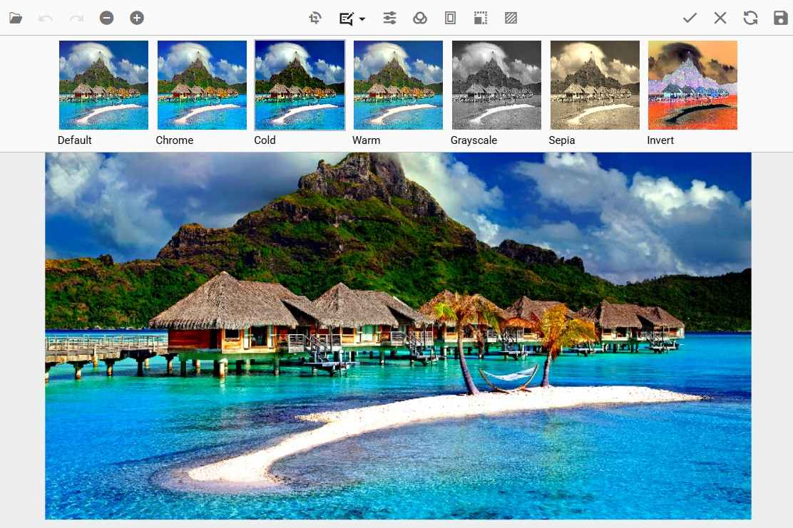

# End-User Capabilities in ##Platform_Name## Image Editor

The following operations are available for end users and are explained briefly in the sections below.

## Open an image

To open an image in the image editor, follow these steps:

* Click the Open icon on the left side of the toolbar.

* The file explorer dialog opens and accepts files in JPEG, PNG, JPG, SVG, WEBP, and BMP formats.

* Select the image you want to open from the file explorer window.

## Zooming

Image zooming can be performed in the following ways.

* Using toolbar.

* Using pinch zoom in touch enabled devices.

* Using mouse wheel.

* Using keyboard.

### Using toolbar

To zoom in or out the image in the image editor, follow these steps:

* Open an image in the image editor; the Zoom In / Zoom Out option is enabled only after an image is opened.

* Click the Zoom In button to zoom in, or the Zoom Out button to zoom out.

### Using pinch

To zoom in or out the image in the image editor, follow these steps:

* Touch the image with two fingers to perform zooming.

* Zoom in and out is controlled by touch gestures.

### Using mouse wheel

To zoom in or out the image in the image editor, follow these steps:

* Press the Ctrl key and scroll the mouse wheel to perform zooming.

* Zoom in and out is controlled by the mouse wheel.

### Using keyboard

To zoom in or out the image in the image editor, follow these steps:

* Press the Ctrl key with the '+' button from the keyboard to zoom in an image.

* Press the Ctrl key with the '-' button from the keyboard to zoom out an image.

## Panning

To pan an image in the image editor, follow these steps:

* Click and drag the image to move or pan it.

* The panning option is enabled only in the following two cases:

    * When a selection is applied for cropping an image.

    * When the image size exceeds the canvas size while zooming an image.

## Cropping and image transformation

To crop an image in the image editor, follow these steps:

* Cropping can be performed based on the selection in an image editor.

* To perform selection, click the crop button in the toolbar. This opens the contextual toolbar that shows crop selection options, rotate options, flip options, and straightening options.

* Click the crop selection button and select the type of selection such as custom, circle, square, and ratio selection from the popup.

* Once selection is completed, do panning to move the image to get the cropped region.

* Utilize the rotate and flip buttons along with the straighten slider to perform image transformations, including any inserted annotations.

* Once the cropping region is finalized in the image, click the tick icon at the top right of the toolbar to crop the image.

## Annotations

To add annotations to an image in the image editor, follow these steps:

* To add an annotation, click the annotation button in the toolbar and select the type of annotation such as Line, Rectangle, Ellipse, Path, Arrow, Text, or Freehand drawing to be inserted to the image editor.

* Once the annotation is added to the image, it can be repositioned by dragging, and resized using the selection handles placed around the annotation.

* To rotate annotations, grab the rotation handle at the bottom of the annotation. Rotation is applicable to all annotations except text annotations.

* Customize the annotations by changing their color, stroke width, font family, and font size through the contextual toolbar. The contextual toolbar will be enabled whenever the annotations are selected.

* When annotations are selected in the Image Editor, the quick access toolbar becomes active, providing convenient access to various actions such as duplicating, deleting, or editing text associated with the selected annotation. This toolbar enables users to perform these common operations quickly and efficiently, streamlining their workflow and enhancing the overall editing experience.

## Filtering and fine-tuning

### Fine-tune an image

To perform fine-tuning on an image in the image editor, follow these steps:

* Click the fine-tune button which displays the list of fine-tuning options available in the image editor.

* Click one of the fine-tune options from the list of options which shows a slider to adjust the corresponding filter.

* Click on the canvas or the tick icon at the top right of the toolbar in the image editor to apply the modifications.

### Apply a filter

To apply filters on an image in the image editor, follow these steps:

* Click the filter button which displays the list of filters available in the image editor.

* Click the filter from list of options to apply the corresponding filter to an image.

* Click on the canvas or the tick icon at the top right of the toolbar in the image editor to apply the modifications.

## Undo and redo the operations

To undo and redo the actions performed in an image editor, follow these steps:

* The undo button will be enabled once an action is performed in an image editor.

* The redo button will be enabled once an undo action is performed in an image editor.

* Click the undo or redo button on the left side of the toolbar to perform the undo and redo operation.

* Ctrl + Z and Ctrl + Y facilitate this process by allowing users to undo and redo actions, respectively.

## Reset an image

To revert all the changes done in an image editor, follow these steps:

* Click the reset button which is located on the right side of the toolbar.

* This will revert all the changes performed in the image editor, including annotations, transforms, filters, and fine-tune adjustments.

## Export an image

To save the modified image in the Image Editor, follow these steps:

* Click the Save button on the right side of the toolbar.

* In the export popup, select your preferred file format (PNG, JPEG, SVG, or WEBP) to save the image with all applied modifications. (BMP images opened in the editor are not available for export; choose another format.)

* If saving in JPEG, use the Image Quality slider to set the desired quality level (0-100). A higher value retains more detail but increases file size.

* Click Download to save the modified image to your device.

* Press Ctrl + S to download the image in the same format as the loaded image without opening the Save dialog. For example, if the loaded image is PNG, it will be saved as PNG.

