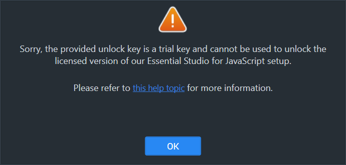
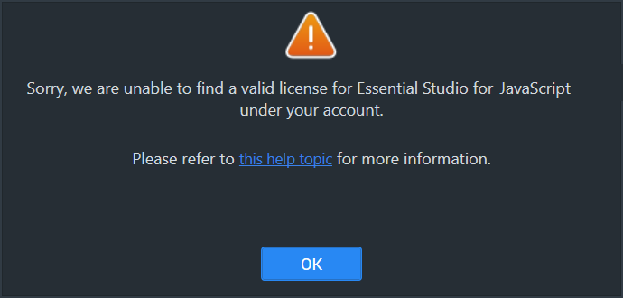
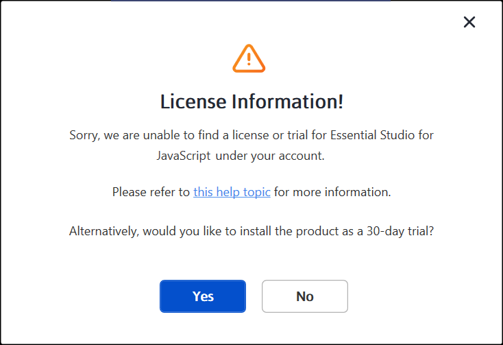
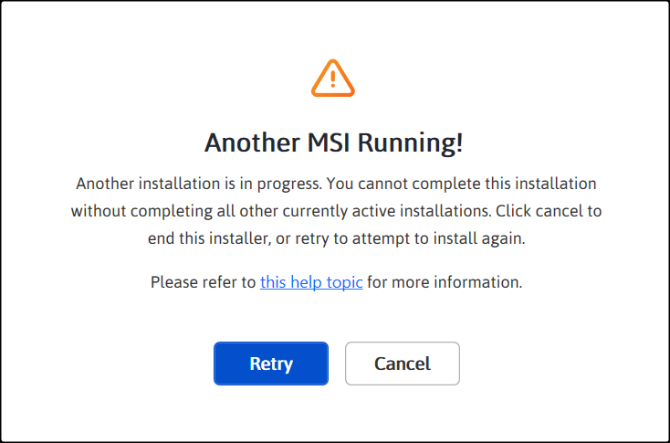
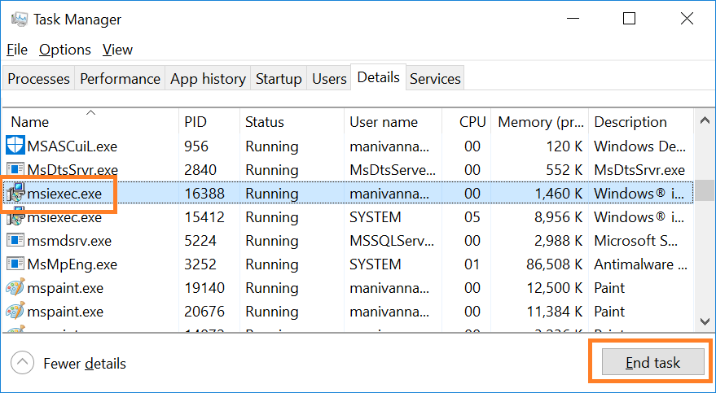
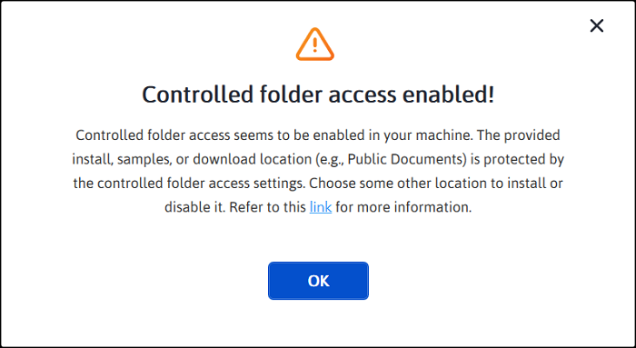

# Common Installation Errors

This article describes the most common installation errors, as well as the causes and solutions to those errors.

**Applies to:** Syncfusion Essential Studio installers (Online and Offline) for ##Platform_Name## on Windows.

* Unlocking the license installer using the trial key
* License has expired
* Unable to find a valid license or trial
* Unable to install because of another installation
* Unable to install due to controlled folder access

## Unlocking the license installer using the trial key

**Error Message:** Sorry, the provided unlock key is a trial unlock key and cannot be used to unlock the licensed version of our Essential Studio&reg; for JavaScript installer.

**Reason**   You are attempting to use a Trial unlock key to unlock the licensed installer.

**Suggested solution**   Only a licensed unlock key can unlock a licensed installer. To unlock the licensed installer, use the licensed unlock key. To generate the licensed unlock key, refer to [this](https://www.syncfusion.com/kb/2326/how-to-generate-syncfusion-setup-unlock-key-from-syncfusion-support-account) article.

## License has expired

**Error Message:** Your license for Syncfusion&reg; Essential Studio&reg; for JavaScript – EJ2 has been expired since &lt;date&gt;. Please renew your subscription and try again.

***Online Installer***

**Reason**   This error message will appear if your license has expired.

**Suggested solution**   You can choose from the options below.

1. You can renew your subscription [here](https://www.syncfusion.com/account/my-renewals).

2. You can get a new license [here](https://www.syncfusion.com/sales/products).

3. You can reach out to our sales team by emailing sales@syncfusion.com.

4. You can extend the 30-day trial period before it expires.

## Unable to find a valid license or trial

**Error Message:** Sorry, we are unable to find a valid license or trial for Essential Studio&reg; for JavaScript – EJ2 under your account.

***Offline installer***

***Online installer***

**Reason**   The following are possible causes of this error:

* When your trial period expired
* When you don’t have a license or an active trial
* You are not the license holder of your license
* Your account administrator has not yet assigned you a license.

**Suggested solution**  

1. You can get a new license [here](https://www.syncfusion.com/sales/products).

2. Contact your account administrator.

3. Send an email to clientrelations@syncfusion.com to request a license.

4. You can reach out to our sales team by emailing sales@syncfusion.com.

## Unable to install because of another installation

**Error Message:** Another installation is in progress. You cannot start this installation without completing all other currently active installations. Click cancel to end this installer or retry to attempt after currently active installation completed to install again.

**Reason**   You are trying to install when another installation is already running on your machine.

**Suggested solution**   To resolve the issue, end the active msiexec process using Task Manager, then run the Syncfusion&reg; installer again. If the problem persists, restart the computer and try again.

1. Open Windows Task Manager.

2. Go to the **Details** tab.

3. Select **msiexec.exe** (it may appear as **msiexec.exe *32** on 64-bit systems) and click **End task**.

## Unable to install due to controlled folder access

***Offline***

**Error Message:** Controlled folder access seems to be enabled in your machine. The provided install or samples location (e.g., Public Documents) is protected by the controlled folder access settings.

***Online***

**Error Message:** Controlled folder access seems to be enabled in your machine. The provided install, samples, or download location (e.g., Public Documents) is protected by the controlled folder access settings. (The Online installer references the additional download location, while the Offline installer does not.)

**Reason**   Controlled folder access is enabled on your machine.

***Suggested solution***

**Suggestion 1:**  
1. Our demos are installed in the Public Documents folder by default.
2. Controlled folder access is enabled on your machine, so the demos cannot be installed in the Documents folder. If you need to install the demos in the Documents folder, follow the steps in this [link](https://support.microsoft.com/en-us/windows/allow-an-app-to-access-controlled-folders-b5b6627a-b008-2ca2-7931-7e51e912b034) and disable controlled folder access. You can also allow the Syncfusion installer through Controlled Folder Access instead of disabling it entirely.
3. You can re-enable controlled folder access after installing the Syncfusion&reg; installer.

**Suggestion 2:**  
1. If you do not want to disable controlled folder access, you can install the demos in another directory. In the installer, click **Browse** on the install location screen and choose a folder that is not protected by controlled folder access.
