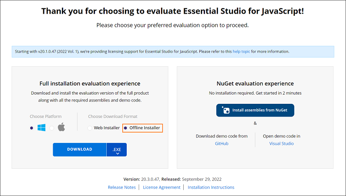
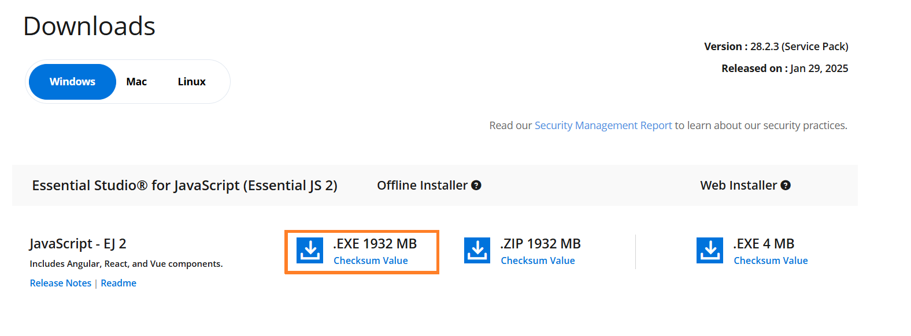
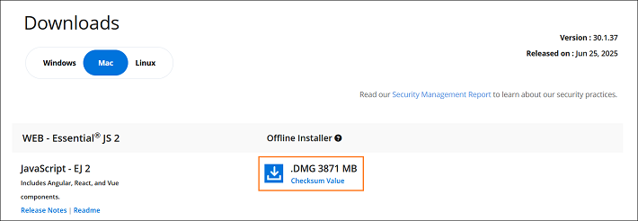
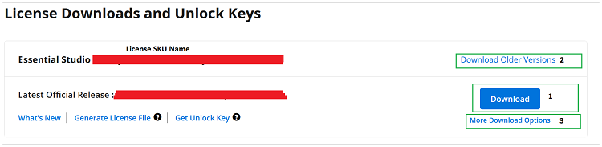

# Download JavaScript – EJ2 Installer

The Syncfusion&reg; JavaScript - EJ2 installer can be downloaded from the Syncfusion&reg; website. You can either download the licensed installer or try our trial installer depending on your license. This guide covers the following options:

* Trial Installer
* Licensed Installer

**Prerequisites**

* A registered Syncfusion&reg; account. To create one, see the [Syncfusion downloads page](https://www.syncfusion.com/downloads).
* A Windows, macOS, or Linux machine that meets the [Syncfusion system requirements](https://help.syncfusion.com/common/essential-studio/system-requirements) for the platform you are installing.

## Download the Trial Version

The 30-day trial can be downloaded in two ways:

* Download Free Trial Setup
* Start Trials if using components through [npm](https://www.npmjs.com/search?q=%40syncfusion%2Fej2-)

### Download Free Trial Setup

1. Evaluate the 30-day free trial by visiting the [Download Free Trial](https://www.syncfusion.com/downloads) page and selecting the JavaScript platform.

2. After completing the required form or logging in with your registered Syncfusion&reg; account, download the JavaScript - EJ2 trial installer from the confirmation page (see the screenshot below).

    

3. With a trial license, only the latest version's trial installer can be downloaded.

4. After downloading, the Syncfusion&reg; JavaScript - EJ2 trial installer can be unlocked using either the trial unlock key or the Syncfusion&reg; registered login credentials. For more information on generating an unlock key, see [this article](https://www.syncfusion.com/kb/8069/how-to-generate-unlock-key-for-essentials-studio-products).

5. Before the trial expires, you can download the trial installer at any time from your registered account's **Trials & Downloads** page (see the screenshot below).

    

6. Click **Download** (element 1 in the screenshot below) to get the Syncfusion&reg; Essential Studio&reg; JavaScript – EJ2 web installer.

    

7. Click **More Download Options** (element 2 in the above screenshot) to get the Essential Studio&reg; JavaScript installer for various platforms.

   - **Windows**

     Select the **Windows** tab to download the appropriate installer options for Windows.

     - **Offline Installer:** Available in `.EXE` and `.ZIP` formats.

         

     - **Web Installer:** Available in `.EXE` format for minimal download size.

         

   - **Mac**

     Select the **Mac** tab to download the appropriate installer options for Mac, which are provided in `.DMG` format.

     

### Start Trials if Using Components Through npm

If you have already obtained Syncfusion&reg; components through [npm](https://www.npmjs.com/search?q=%40syncfusion%2Fej2-), initiate an evaluation as follows:

1. Start your 30-day free trial for JavaScript – EJ2 from the [Start Trial](https://www.syncfusion.com/account/manage-trials/start-trials) page in your account.

    

2. To access this page, you must sign up or log in with your Syncfusion&reg; account.

3. Begin your trial by selecting the JavaScript – EJ2 product.

    > **Note:** If you've already used the trial products and they haven't expired, you won't be able to start the trial for the same product again.

4. After you've started the trial, go to the [Trials & Downloads](https://www.syncfusion.com/account/manage-trials/start-trials) page to get the latest version trial installer. Generate the [unlock key](https://www.syncfusion.com/kb/8069/how-to-generate-unlock-key-for-essentials-studio-products) at any time before the trial period expires (see the screenshot below).

    

5. You can find your current active trial products on the [Trials & Downloads](https://www.syncfusion.com/account/manage-trials/start-trials) page.

## Download the License Version

1. Syncfusion&reg; licensed products are available on the [License & Downloads](https://www.syncfusion.com/account/downloads) page under your registered Syncfusion&reg; account.

2. You can view all the licenses (both active and expired) associated with your account.

3. Click **Download** (element 1 in the screenshot below) to download the respective product's installer.

4. The most recent version of the installer is downloaded from this page.

5. To download older version installers, go to [Downloads - Older Versions](https://www.syncfusion.com/account/downloads/studio) (element 2 in the screenshot below).

6. Download other platform/add-on installers by selecting **More Download Options** (element 3 in the screenshot below).

7. For Windows OS, both `.EXE` and `.ZIP` formats are available. These are both offline installers.

    

8. After downloading, unlock the installer with your licensed unlock key, then refer to the [Online installer](https://ej2.syncfusion.com/documentation/installation-and-upgrade/installation-using-web-installer) and [Offline installer](https://ej2.syncfusion.com/documentation/installation-and-upgrade/installation-using-offline-installer) guides for step-by-step installation instructions.