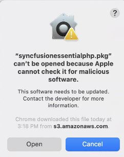
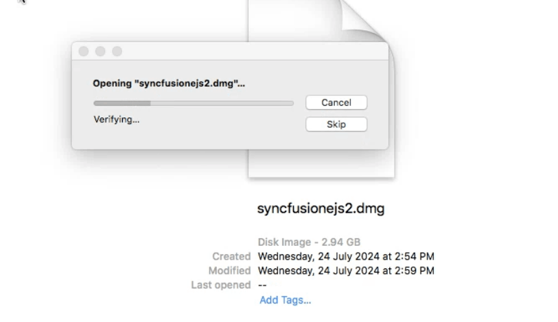
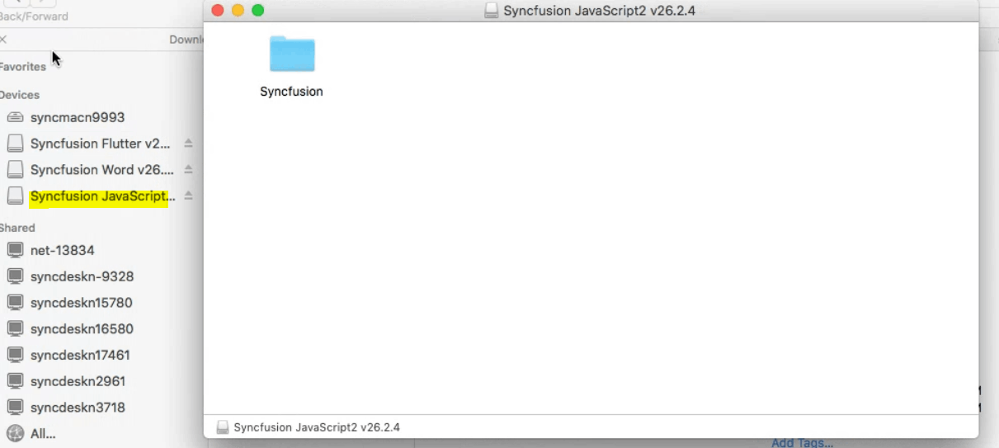
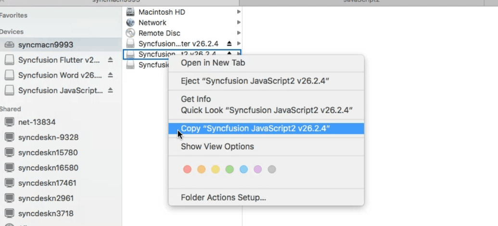
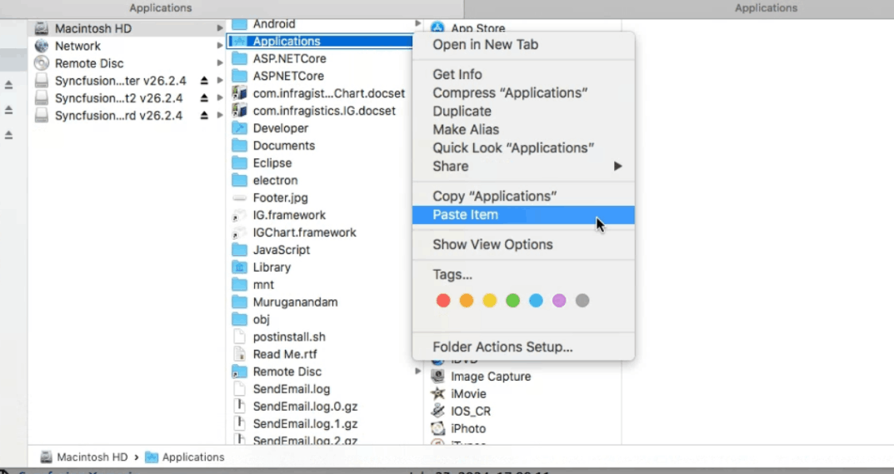
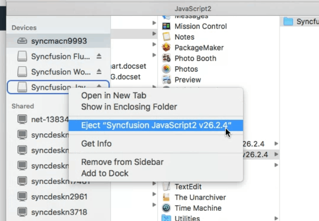

# Installing Syncfusion JavaScript – EJ2 Mac Installer

## Steps to resolve the warning message in Catalina OS or later

   While running Essential Studio JavaScript - EJ2 Mac Installer on Catalina MacOS or later, the below alert will be displayed.

   

   If you receive this alert, follow the below steps for the easiest solution.

   1. Right-click the downloaded dmg file.
   2. Select the "Open With" option and choose "DiskImageMounter (Default)". The following pop-up appears.

      

   3. When you click "Open" the installer window will be opened.

## Step-by-Step Installation

The steps below show how to install the Essential Studio JavaScript - EJ2 Mac installer.

1. Locate the downloaded dmg file and open the file by double click on it.

   

2. This action will automatically mount the disk image and create a virtual drive on your desktop or in the Finder sidebar.

   

3. Copy the mounted disk file.

   

4. And paste it in "Applications" folder shortcut.

   

   N> The Unlock key is not required to install the Mac installer. The Syncfusion Essential Studio JavaScript - EJ2 Mac installer can be used for development purposes without registering the Unlock key.

5. Now you can open the folder to explore the Syncfusion Essential Studio Mac installer.

   

6. To remove the DMG file, Right-click on the virtual drive on your desktop or in the Finder sidebar and select "Eject." Also delete the folder from the Applications.

   

## License key registration in samples

After the installation, the license key is required to register the demo source that is included in the Mac installer. To learn about the steps for license registration for the JavaScript - EJ2 Mac installer, please refer to this.

Register the license key by using [registerLicense](https://ej2.syncfusion.com/javascript/documentation/licensing/license-key-registration#javascript-es5) method after the Syncfusion JavaScript script file reference.