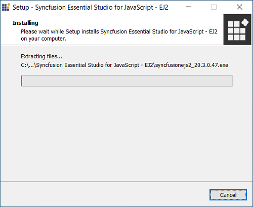
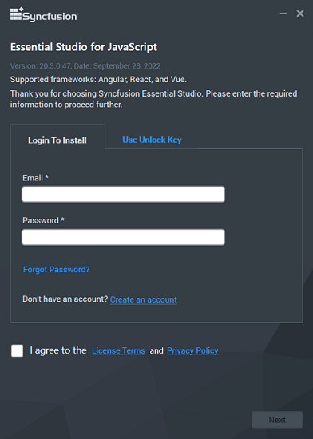
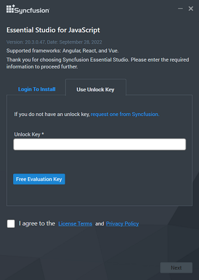
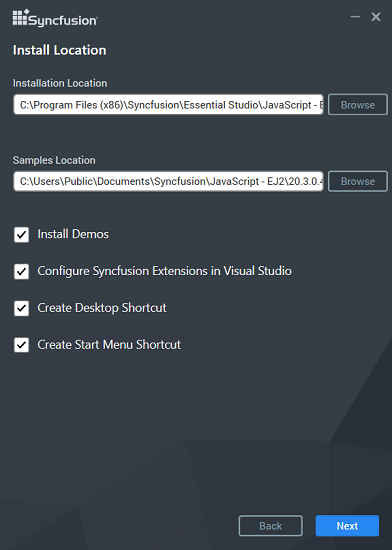
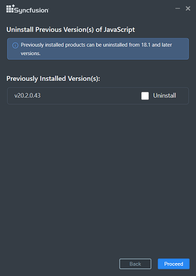
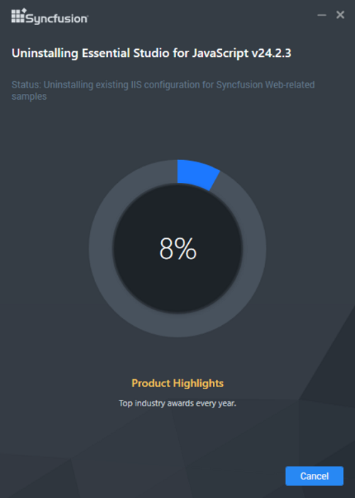
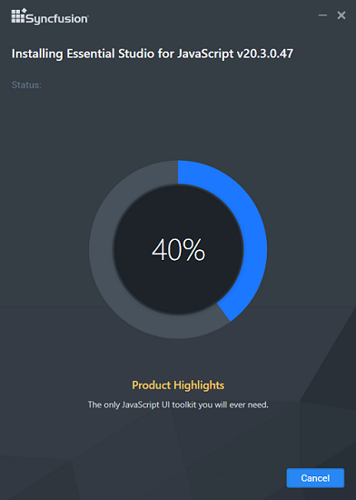
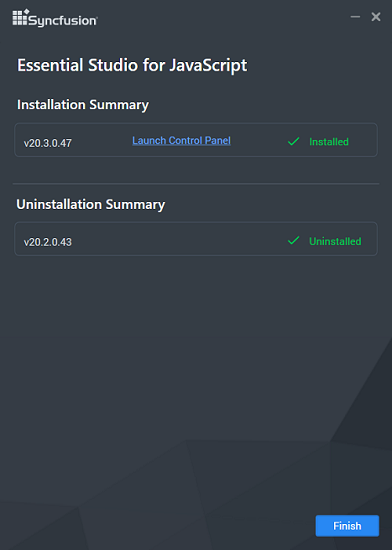

# Installation Using the Offline Installer

This guide explains how to install the Syncfusion<sup style="font-size:70%">&reg;</sup> Essential<sup style="font-size:70%">&reg;</sup> JavaScript - EJ2 **offline installer** on Windows, either through the installer UI or in **silent mode** from the command line.

> If you do not yet have the installer, see the [Download](https://ej2.syncfusion.com/documentation/installation-and-upgrade/download) section to obtain the trial or licensed version.

**Prerequisites**

* A Windows machine with administrator privileges.
* The downloaded offline installer (`.exe` or `.zip`).
* A valid Syncfusion<sup style="font-size:70%">&reg;</sup> account (for **Login to Install**) or a Syncfusion<sup style="font-size:70%">&reg;</sup> unlock key (for **Use Unlock Key**).
* For the **Install Demos** option, the target install location must be writable. If **Controlled folder access** is enabled on Windows, see [Common Installation Errors](https://ej2.syncfusion.com/documentation/installation-and-upgrade/common-installation-errors).

The frameworks supported by this installer are:

* JavaScript
* Angular
* React
* Vue
* JavaScript (ES5)

## Installing with the UI

The steps below show how to install the Essential<sup style="font-size:70%">&reg;</sup> Studio JavaScript – EJ2 installer.

1. Open the Syncfusion<sup style="font-size:70%">&reg;</sup> JavaScript – EJ2 offline installer file from the downloaded location by double-clicking it. The Installer Wizard automatically opens and extracts the package.

    

    > **Note:** The Installer wizard extracts the `syncfusionejs2_<version>.exe` dialog, which displays the package's unzip operation.

2. To unlock the Syncfusion<sup style="font-size:70%">&reg;</sup> offline installer, choose one of the following options:

    * **Login to Install**
    * **Use Unlock Key**

    **Login to Install**

    You must enter your Syncfusion<sup style="font-size:70%">&reg;</sup> email address and password. If you don't already have a Syncfusion<sup style="font-size:70%">&reg;</sup> account, you can sign up for one by clicking **Create an account**. If you have forgotten your password, click **Forgot Password** to create a new one. Once you've entered your Syncfusion<sup style="font-size:70%">&reg;</sup> email and password, click **Next**.

    

    **Use Unlock Key**

    Unlock keys are used to unlock the Syncfusion<sup style="font-size:70%">&reg;</sup> offline installer, and they are platform and version specific. Use either a Syncfusion<sup style="font-size:70%">&reg;</sup> licensed or trial unlock key to unlock the Syncfusion<sup style="font-size:70%">&reg;</sup> JavaScript – EJ2 installer. The trial unlock key is only valid for 30 days; the installer will not accept an expired trial key.

    To learn how to generate an unlock key for both trial and licensed products, see this [Knowledge Base article](https://www.syncfusion.com/kb/2326).

    

3. After reading the License Terms and Privacy Policy, check the **I agree to the License Terms and Privacy Policy** check box. Click **Next**.

4. Change the install and samples locations here. You can also change the **Additional Settings** (described below). Click **Next** / **Install** to install with the default settings.

    

    **Additional Settings**

    * Select the **Install Demos** check box to install Syncfusion<sup style="font-size:70%">&reg;</sup> samples, or leave the check box unchecked if you do not want to install samples.
    * Select the **Configure Syncfusion<sup style="font-size:70%">&reg;</sup> Extensions controls in Visual Studio** check box to configure the Syncfusion<sup style="font-size:70%">&reg;</sup> Extensions in Visual Studio. Clear this check box if you do not want to configure the extensions.
    * Check the **Create Desktop Shortcut** check box to add a desktop shortcut for Syncfusion<sup style="font-size:70%">&reg;</sup> Control Panel.
    * Check the **Create Start Menu Shortcut** check box to add a shortcut to the start menu for Syncfusion<sup style="font-size:70%">&reg;</sup> Control Panel.

5. If any previous versions of the current product are installed, the **Uninstall Previous Version(s)** wizard is opened. Select each version you want to uninstall, then click **Proceed**.

    

    > **Note:** From the 2021 Volume 1 release, Syncfusion<sup style="font-size:70%">&reg;</sup> has added the option to uninstall previous versions from 18.1 onward while installing the new version.
    >
    > **Note:** If any version is selected to uninstall, a confirmation screen will appear. If you click **Continue**, the Progress screen will display the uninstall and install progress respectively. If no versions are chosen to be uninstalled, only the installation progress is displayed.

    **Confirmation Alert**

    

    **Uninstall Progress**

    

    **Install Progress**

    

    > **Note:** The **Completed** screen is displayed once the JavaScript – EJ2 product is installed. If any version is selected to uninstall, the completed screen displays both install and uninstall status.

    

6. After installation, click the **Launch Control Panel** link to open the Syncfusion<sup style="font-size:70%">&reg;</sup> Control Panel.

7. Click **Finish**. Your system has been installed with the Syncfusion<sup style="font-size:70%">&reg;</sup> Essential Studio<sup style="font-size:70%">&reg;</sup> JavaScript – EJ2 product.

## Installing in Silent Mode

The Syncfusion<sup style="font-size:70%">&reg;</sup> Essential Studio<sup style="font-size:70%">&reg;</sup> JavaScript – EJ2 installer supports installation and uninstallation via the command line in silent mode.

### Command Line Installation

To install through the command line in silent mode, follow the steps below.

1. Run the Syncfusion<sup style="font-size:70%">&reg;</sup> JavaScript – EJ2 installer by double-clicking it. The Installer Wizard automatically opens and extracts the package.

2. The `syncfusionejs2_<version>.exe` file is extracted into the Windows Temp directory.

3. Open the Temp folder by running `%temp%` in the Run dialog (Win + R). The `syncfusionejs2_<version>.exe` file is located in one of the subfolders.

4. Copy the extracted `syncfusionejs2_<version>.exe` file to a local drive.

5. Exit the Installer Wizard.

6. Run Command Prompt **as an administrator**, then run the installer with the following arguments.

    **Syntax**

    ```bat
    "installer file path\SyncfusionEssentialStudio<product>_<version>.exe" /Install silent /UNLOCKKEY:"<product unlock key>" [/log "<log file path>"] [/InstallPath:<install location>] [/InstallSamples:true|false] [/InstallAssemblies:true|false] [/UninstallExistAssemblies:true|false] [/InstallToolbox:true|false]
    ```

    Arguments inside square brackets are optional.

    **Example**

    ```bat
    "D:\Temp\syncfusionejs2_20.2.0.36.exe" /Install silent /UNLOCKKEY:"your-unlock-key" /log "C:\Temp\EssentialStudioPlatform.log" /InstallPath:"C:\Syncfusion\20.2.0.36" /InstallSamples:true /InstallAssemblies:true /UninstallExistAssemblies:true /InstallToolbox:true
    ```

    Replace `20.2.0.36` with the Essential<sup style="font-size:70%">&reg;</sup> Studio version, and replace `your-unlock-key` with the unlock key for that version.

7. Essential<sup style="font-size:70%">&reg;</sup> Studio for JavaScript (Essential<sup style="font-size:70%">&reg;</sup> JS 2) is installed.

    To confirm the install, check the Syncfusion<sup style="font-size:70%">&reg;</sup> Control Panel entry, or run the following PowerShell command to verify the installed version:

    ```powershell
    Get-ItemProperty HKLM:\Software\Microsoft\Windows\CurrentVersion\Uninstall\* |
      Where-Object { $_.DisplayName -like 'Syncfusion*JavaScript*' } |
      Select-Object DisplayName, DisplayVersion
    ```

    A successful silent install returns exit code `0`. Other exit codes indicate an error; see the log file specified by `/log` for details.

### Command Line Uninstallation

Syncfusion<sup style="font-size:70%">&reg;</sup> Essential<sup style="font-size:70%">&reg;</sup> JavaScript – EJ2 can also be uninstalled silently using the command line.

1. Run the Syncfusion<sup style="font-size:70%">&reg;</sup> JavaScript – EJ2 installer by double-clicking it. The Installer Wizard automatically opens and extracts the package.

2. The `syncfusionejs2_<version>.exe` file is extracted into the Temp directory.

3. Open the Temp folder by running `%temp%`. The `syncfusionejs2_<version>.exe` file is located in one of the subfolders.

4. Copy the extracted `syncfusionejs2_<version>.exe` file to a local drive.

5. Exit the Installer Wizard.

6. Run Command Prompt **as an administrator**, then run the installer with the following arguments.

    **Syntax**

    ```bat
    "copied installer file path\syncfusionejs2_<version>.exe" /uninstall silent
    ```

    **Example**

    ```bat
    "D:\Temp\syncfusionejs2_20.2.0.36.exe" /uninstall silent
    ```

7. Essential<sup style="font-size:70%">&reg;</sup> Studio for JavaScript (Essential<sup style="font-size:70%">&reg;</sup> JS 2) is uninstalled.

## Troubleshooting

| Issue | Possible Cause | Suggested Fix |
| --- | --- | --- |
| Installer fails with "Another installation is in progress." | Another MSI installation is currently running. | End the running `msiexec.exe` process in Task Manager, or wait for the other install to finish. See [Common Installation Errors](https://ej2.syncfusion.com/documentation/installation-and-upgrade/common-installation-errors). |
| "Controlled folder access seems to be enabled" alert. | Windows Controlled folder access is blocking the install/samples location. | Allow access for the installer in **Windows Security** → **Virus & threat protection** → **Manage ransomware protection**, or install to a non-protected folder. |
| Login to Install fails with an invalid credentials error. | Wrong account, or the account does not own a license. | Verify the account owns a Syncfusion<sup style="font-size:70%">&reg;</sup> license, or use the **Use Unlock Key** option instead. |
| Silent install reports a non-zero exit code. | Invalid arguments, missing unlock key, or path issues. | Re-run with `/log "<log file path>"` and inspect the log for the exact error. |
| The "I agree to the License Terms and Privacy Policy" check box is disabled. | The license text has not been scrolled to the end. | Scroll the license text to the bottom before checking the box. |

For additional help, see [Common Installation Errors](https://ej2.syncfusion.com/documentation/installation-and-upgrade/common-installation-errors).