# Installation using Web Installer

You can refer to the [Download](https://ej2.syncfusion.com/documentation/installation-and-upgrade/download) section to learn how to get the JavaScript – EJ2 trial or licensed installer.

**Applies to:** Syncfusion Essential Studio&reg; JavaScript – EJ2 Web Installer on Windows.

## Prerequisites

Before you begin, make sure the following are in place:

* Windows 7 SP1 or later (Windows 10/11 recommended), 64-bit.
* Administrator rights on the machine (the installer must be run as administrator).
* An active internet connection (the Web Installer downloads the selected products at install time).
* A Syncfusion&reg; account with a valid trial or licensed subscription. To create one, see [Create a Syncfusion account](https://www.syncfusion.com/account/register).
* Any framework-specific prerequisites for the products you select (for example, Visual Studio for the Syncfusion Extensions option). The installer will alert you if additional software is required.

## Overview

For the Essential Studio&reg; JavaScript – EJ2 product, Syncfusion&reg; offers a Web Installer. This installer alleviates the burden of downloading a larger installer. You can simply download and run the online installer, which will be smaller in size and will download and install the Essential Studio&reg; products you have chosen. You can get the most recent version of Essential Studio&reg; Web Installer [here](https://www.syncfusion.com/account/downloads).

The frameworks listed below are supported in this installer.

* JavaScript
* Angular
* React
* Vue
* JavaScript (ES5)

## Installation

The steps below show how to install Essential Studio&reg; JavaScript – EJ2 Web Installer.

>Tip: Right-click the installer `.exe` and choose **Run as administrator** to avoid permission issues.

1. Open the Syncfusion&reg; Essential Studio&reg; JavaScript – EJ2 Web Installer file from the downloaded location by double-clicking it. The Installer Wizard automatically opens and extracts the package.

    

    >Note: The installer wizard extracts the `syncfusionejs2webinstaller_{version}.exe` dialog, which displays the package's unzip operation.

2. The Syncfusion&reg; JavaScript - EJ2 Web Installer's welcome wizard will be displayed. Click the **Next** button.

    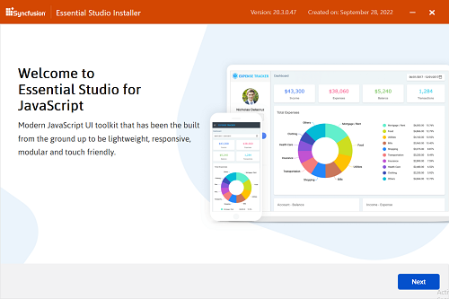

3. The Platform Selection Wizard will appear. From the **Available** tab, select the products to be installed. Select the **Install All** checkbox to install all products.

    **Available**

    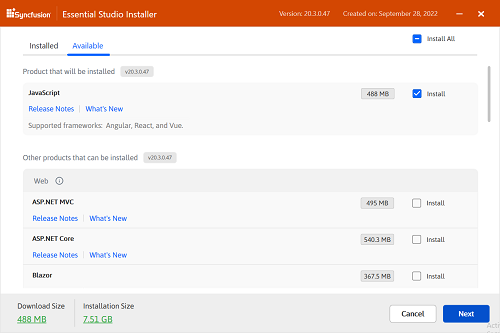

    If you have multiple products installed in the same version, they will be listed under the **Installed** tab. You can also select which products to uninstall from the same version. Click the **Next** button.

    **Installed**

    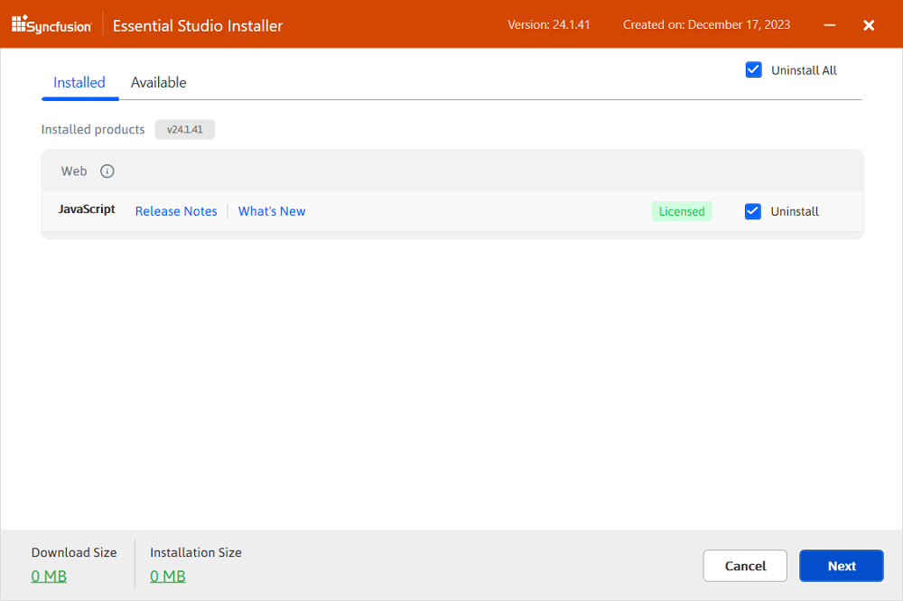

    >Important: If the required software for the selected product isn't already installed, the **Additional Software Required** alert will appear. You can, however, continue the installation and install the necessary software later.

    **Required Software**

    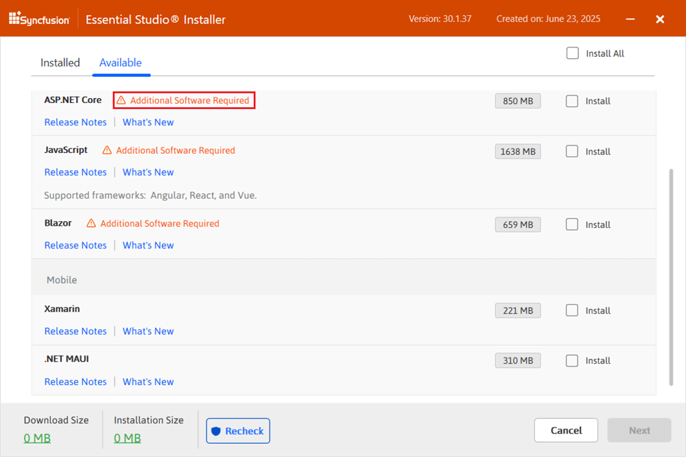

4. If previous version(s) for the selected products are installed, the **Uninstall previous version** wizard will be displayed. You can see the list of previously installed versions for the products you've chosen here. To remove all versions, check the **Uninstall All** checkbox. Click the **Next** button.

    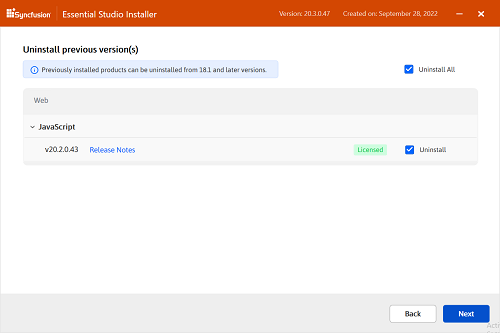

    >Note: From the 2021 Volume 1 release, Syncfusion&reg; provides an option to uninstall previous versions from 18.1 while installing the new version.

5. A pop-up screen will be displayed to confirm the uninstallation of the selected previous versions.

    

6. The **Confirmation** wizard will appear with the list of products to be installed/uninstalled. You can view and modify the list of products that will be installed and uninstalled from this page.

    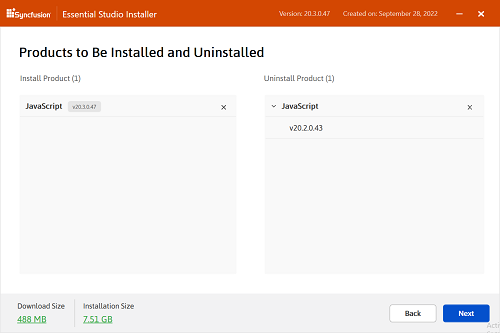

    >Note: By clicking the **Download Size** and **Installation Size** links, you can determine the approximate size of the download and installation.

7. The **Configuration** wizard will appear. You can change the **Download**, **Install**, and **Demos** locations from here. You can also change the additional settings on a product-by-product basis. Click **Next** to install with the default settings.

    

    **Additional settings**
    * Select the **Install Demos** check box to install Syncfusion&reg; samples, or leave the check box unchecked if you do not want to install Syncfusion&reg; samples.
    * Select the **Configure Syncfusion Extensions controls in Visual Studio** checkbox to configure the Syncfusion&reg; Extensions in Visual Studio, or clear this check box when you do not want to configure the Syncfusion&reg; Extensions in Visual Studio.
    * Check the **Create Desktop Shortcut** checkbox to add a desktop shortcut for the Syncfusion&reg; Control Panel.
    * Check the **Create Start Menu Shortcut** checkbox to add a shortcut to the Start menu for the Syncfusion&reg; Control Panel.

8. After reading the License Terms and Conditions, check the **I agree to the License Terms and Privacy Policy** check box. Click the **Next** button.

9. The **Login** wizard will appear. You must enter your Syncfusion&reg; email address and password. If you do not already have a Syncfusion&reg; account, you can create one by clicking **Create an Account**. If you have forgotten your password, click **Forgot Password** to create a new one. Click the **Install** button.

    

    >Important: The products you have chosen will be installed based on your Syncfusion&reg; license (Trial or Licensed).

10. The download and installation/uninstallation progress will be displayed as shown below.

    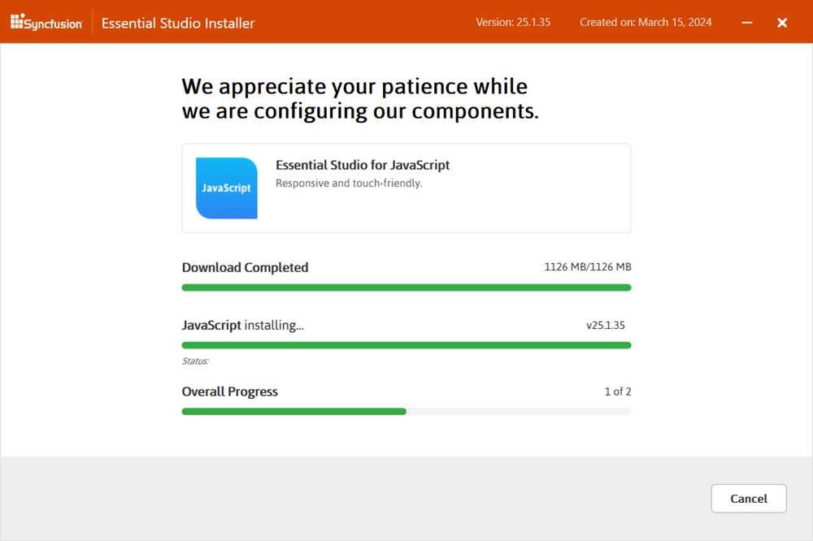

11. When the installation is finished, the **Summary** wizard will appear. Here you can see the list of products that have been installed successfully and those that have failed. To close the Summary wizard, click **Finish**.

    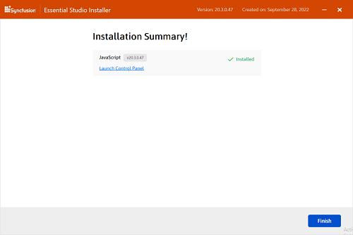

    * To open the Syncfusion&reg; Control Panel, click **Launch Control Panel**.

12. After installation, there will be two Syncfusion&reg; Control Panel entries, as shown below. The Essential Studio&reg; entry will manage all Syncfusion&reg; products installed in the same version, while the Product entry will only uninstall the specific product setup.

    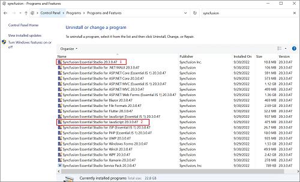

## Troubleshooting

If you encounter issues during installation, see [Common installation errors](https://ej2.syncfusion.com/documentation/installation-and-upgrade/common-installation-errors) for solutions to typical problems such as trial vs. license key mismatch, blocked installations, and controlled folder access.

## Uninstallation

The Syncfusion&reg; JavaScript – EJ2 installer can be uninstalled in two ways.

* Uninstall the JavaScript – EJ2 using the Syncfusion&reg; JavaScript – EJ2 web installer.
* Uninstall the JavaScript – EJ2 from Windows Control Panel.

Follow either one of the options below to uninstall Syncfusion&reg; Essential Studio&reg; JavaScript – EJ2.

### Option 1: Uninstall the JavaScript – EJ2 using the Syncfusion&reg; JavaScript – EJ2 web installer

Syncfusion&reg; provides the option to uninstall products of the same version directly from the Web Installer application. Select the products to be uninstalled from the list, and the Web Installer will uninstall them one by one.

Open the Syncfusion&reg; Essential Studio&reg; JavaScript – EJ2 Online Installer file from the downloaded location by double-clicking it. The Installer Wizard automatically opens and extracts the package.

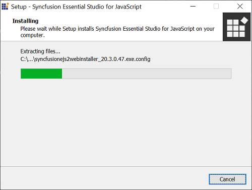

The Syncfusion&reg; JavaScript – EJ2 Web Installer's welcome wizard will be displayed. Click the **Next** button.

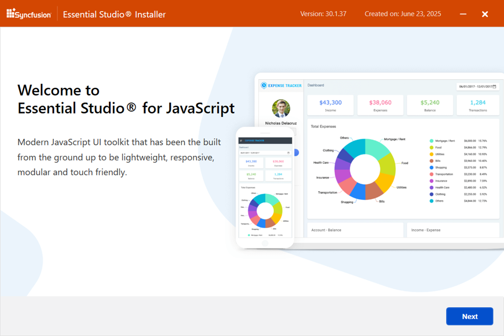

### Option 2: Uninstall the JavaScript–EJ2 from Windows Control Panel

You can uninstall all the installed products by selecting the **Syncfusion&reg; Essential Studio&reg; {version}** entry (element 1 in the below screenshot) from the Windows control panel, or you can uninstall JavaScript – EJ2 alone by selecting the **Syncfusion&reg; Essential Studio&reg; for JavaScript – EJ2 {version}** entry (element 2 in the below screenshot) from the Windows control panel.

>Note: If the **Syncfusion&reg; Essential Studio&reg; for JavaScript – EJ2 {version}** entry is selected from the Windows Control Panel, the Syncfusion&reg; Essential Studio&reg; JavaScript – EJ2 will be removed, and the default MSI uninstallation window shown below will be displayed.

1. The Platform Selection Wizard will appear. From the **Installed** tab, select the products to be uninstalled. To select all products, check the **Uninstall All** checkbox. Click the **Next** button.

    **Installed**
    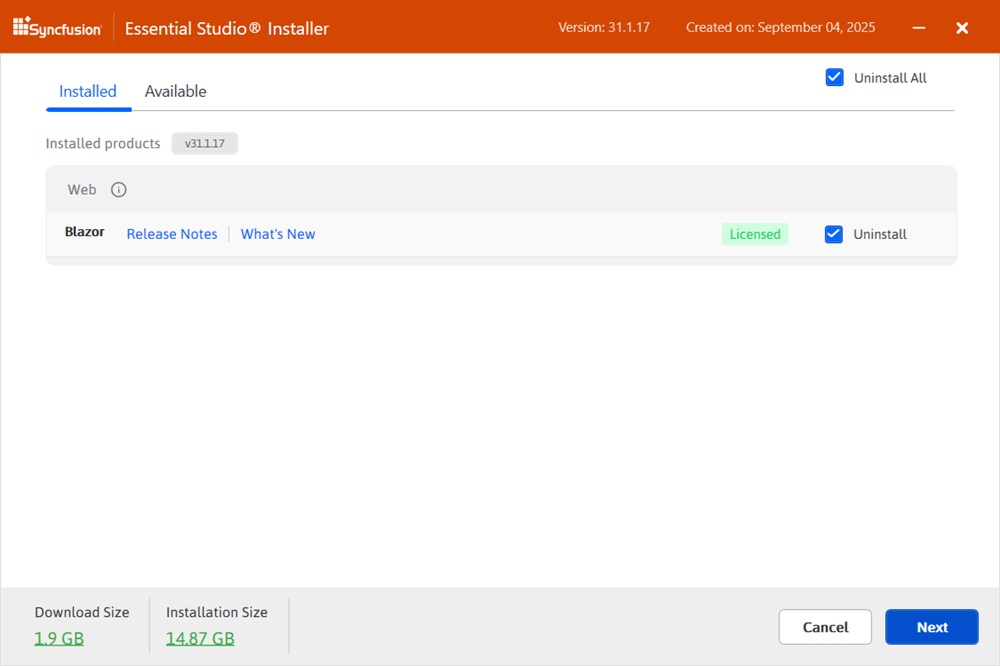

    You can also select the products to be installed from the **Available** tab. Click the **Next** button.

    **Available**
    

2. If other products are also selected for installation, the **Uninstall previous version** wizard will be displayed with previous version(s) installed for the selected products. Here you can view the list of installed previous versions for the selected products. Select the **Uninstall All** checkbox to select all the versions. Click **Next**.

    

3. A pop-up screen will be displayed to confirm the uninstallation of the selected previous versions.

    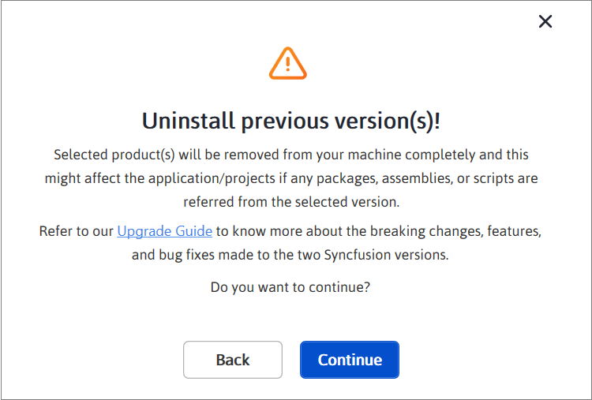

4. The **Confirmation** wizard will appear with the list of products to be installed/uninstalled. Here you can view and modify the list of products that will be installed/uninstalled.

    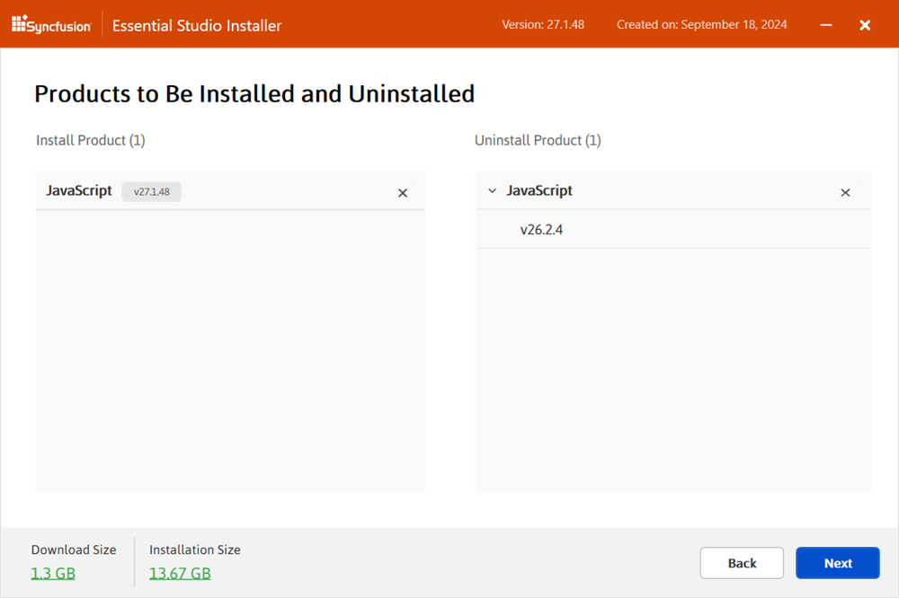

    >Note: By clicking the **Download Size** and **Installation Size** links, you can determine the approximate size of the download and installation.

5. The **Configuration** wizard will appear. You can change the **Download**, **Install**, and **Demos** locations from here. You can also change the additional settings on a product-by-product basis. Click **Next** to install with the default settings.

    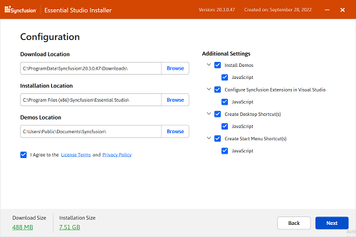

6. After reading the License Terms and Conditions, check the **I agree to the License Terms and Privacy Policy** check box. Click the **Next** button.

7. The **Login** wizard will appear. You must enter your Syncfusion&reg; email address and password. If you do not already have a Syncfusion&reg; account, you can create one by clicking **Create an Account**. If you have forgotten your password, click **Forgot Password** to create a new one. Click the **Install** button.

    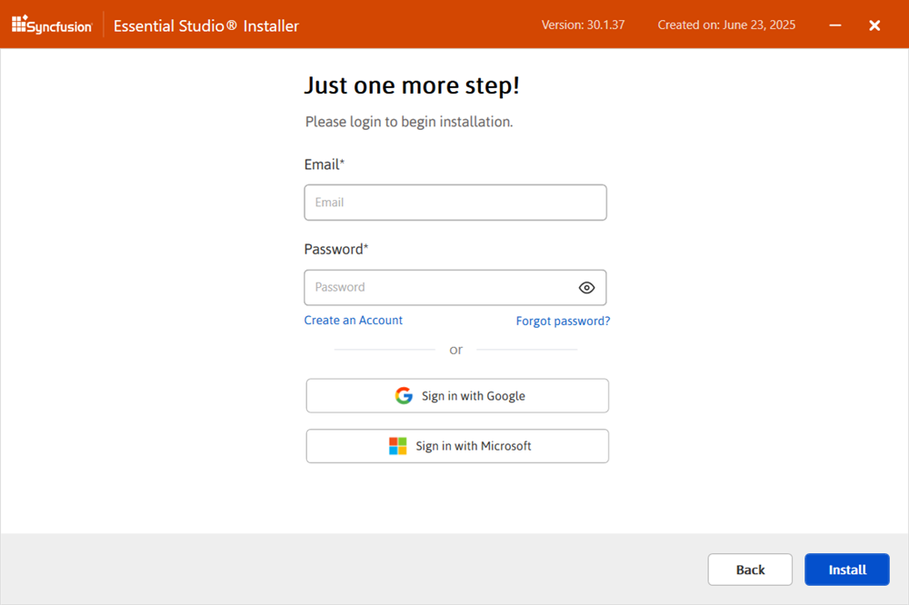

    >Important: The products you have chosen will be installed/uninstalled based on your Syncfusion&reg; license (Trial or Licensed).

8. The download, installation, and uninstallation progress will be shown.

    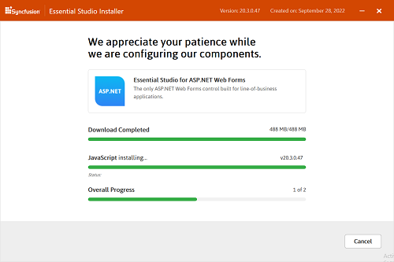

9. When the process is finished, the **Summary** wizard will appear. Here you can see the list of products that have been successfully and unsuccessfully installed/uninstalled. To close the Summary wizard, click **Finish**.

    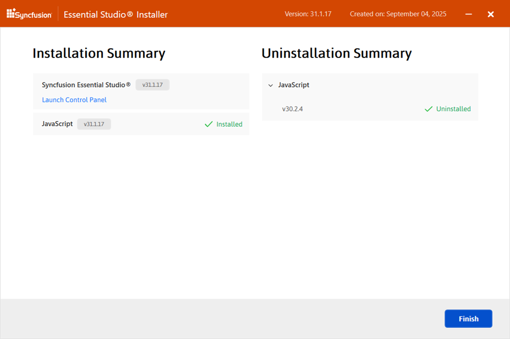

    * To open the Syncfusion&reg; Control Panel, click **Launch Control Panel**.