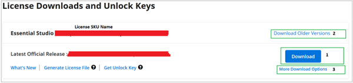

# Download Syncfusion&reg; JavaScript Linux Installer

**Applies to:** Syncfusion Essential Studio&reg; JavaScript – EJ2 Linux installer on Linux distributions supported by Syncfusion.

The Syncfusion&reg; installer can be downloaded from the [Syncfusion website](https://www.syncfusion.com/). You can either download the licensed installer or try our trial installer, depending on your license.

* Trial Installer
* Licensed Installer

## Download the Trial Version

Our 30-day trial can be downloaded in two ways:

* Download the Free Trial Setup.
* Start a trial if you are using components through [NuGet.org](https://www.nuget.org/packages?q=syncfusion).

### Download Free Trial Setup

1. Visit the [Download Free Trial](https://www.syncfusion.com/downloads) page and select the product to evaluate our 30-day free trial.
2. After completing the required form or signing in with your registered Syncfusion&reg; account, you can download the trial installer from the confirmation page (as shown in the screenshot below).

   

3. With a trial license, only the latest version's trial installer can be downloaded.
4. An unlock key is not required to install the Syncfusion&reg; JavaScript Linux trial installer.
5. Before the trial expires, you can download the trial installer at any time from your registered account's [Trials & Downloads](https://www.syncfusion.com/account/manage-trials/downloads) page (as shown in the screenshot below).

   

6. Click **More Download Options** (element 2 in the screenshot above) to get the JavaScript Product Offline trial installer, which is available in ZIP format.

   

### Start Trials if using components through [NuGet.org](https://www.nuget.org/packages?q=syncfusion)

You should initiate an evaluation if you have already obtained our components through [NuGet.org](https://www.nuget.org/packages?q=syncfusion).

1. Start your 30-day free trial from the [Start Trial](https://www.syncfusion.com/account/manage-trials/start-trials) page in your account.

   > You can generate the license key for your active trial products from the [Trials & Downloads](https://www.syncfusion.com/account/manage-trials/downloads) page. This license key is required to use our trial products in your application. To learn more, see the [licensing overview](https://help.syncfusion.com/common/essential-studio/licensing/overview).

   

2. To access this page, you must sign up or sign in with your Syncfusion&reg; account.
3. Begin your trial by selecting the Syncfusion&reg; product.

   > If you have already used a trial for a product and it has not expired, you will not be able to start a new trial for the same product.

4. After starting the trial, go to the [Trials & Downloads](https://www.syncfusion.com/account/manage-trials/downloads) page to get the latest version trial installer. You can generate the [unlock key](https://www.syncfusion.com/kb/8069/how-to-generate-unlock-key-for-essentials-studio-products) and [license key](https://ej2.syncfusion.com/javascript/documentation/licensing/license-key-generation) here at any time before the trial period expires (as shown in the screenshot below).

   

5. You can find your current active trial products on the [Trials & Downloads](https://www.syncfusion.com/account/manage-trials/downloads) page.

## Download the License Version

1. Syncfusion&reg; licensed products are available on the [License & Downloads](https://www.syncfusion.com/account/downloads) page under your registered Syncfusion&reg; account.
2. You can view all the licenses (both active and expired) associated with your account.
3. Download the JavaScript Linux licensed installer by going to **More Download Options** (element 3 in the screenshot below).

   

4. An unlock key is not required to install the Syncfusion&reg; JavaScript Linux licensed installer.
5. For Linux, the ZIP format is available for download.

   

For step-by-step installation guidelines, see [Installation using the Linux installer](https://ej2.syncfusion.com/javascript/documentation/installation-and-upgrade/linux-installer/installation-using-linux-installer).	
