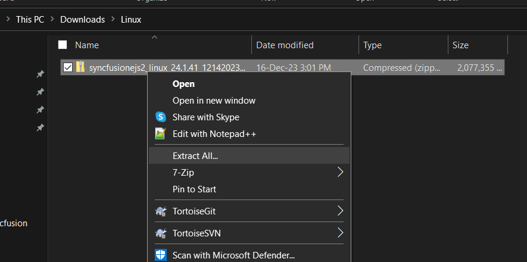

# Installing Syncfusion&reg; JavaScript Linux installer

**Applies to:** Syncfusion Essential Studio&reg; JavaScript – EJ2 Linux installer on Linux distributions supported by Syncfusion.

## Prerequisites

Before you begin, make sure the following are in place:

* A user account with permission to extract the ZIP file and write to the target install directory. Use `sudo` for system-wide locations such as `/opt`.
* `unzip` (or another archive tool) available on the system to extract the installer.
* A current version of the Syncfusion JavaScript Linux installer ZIP. If you do not have it, see [Download](https://ej2.syncfusion.com/documentation/installation-and-upgrade/linux-installer/download).
* A valid license key if you are using the licensed installer; the trial installer does not require an unlock key.

## Step-by-Step Installation

The steps below show how to install the Syncfusion&reg; JavaScript Linux installer.

1. Extract the Syncfusion&reg; JavaScript Linux installer (`.zip`) file using your archive tool of choice. For example, from a terminal:

   

2. The Linux ZIP file contains the demo source, NuGet packages, and supporting files (as shown in the screenshot below).

   

   > An unlock key is not required to install the Linux installer.

3. Open the extracted demo source in a browser or your preferred editor to launch the included samples, and reference the NuGet packages in your project as needed.

   To use the samples with the licensed installer, see the [License key registration](#license-key-registration-in-samples) section below.

## License key registration in samples

After installation, a license key is required to register the demo source that is included in the Linux installer. To learn the steps for license registration for the JavaScript – EJ2 Linux installer, see [License key registration](https://ej2.syncfusion.com/javascript/documentation/licensing/license-key-registration).

Register the license key by using the [`registerLicense`](https://ej2.syncfusion.com/javascript/documentation/licensing/license-key-registration#javascript-es5) method after the Syncfusion&reg; JavaScript script file reference.

## Troubleshooting

If you encounter issues during installation, see [Common installation errors](https://ej2.syncfusion.com/documentation/installation-and-upgrade/common-installation-errors) for solutions to typical problems such as trial vs. license key mismatch, blocked installations, and controlled folder access.