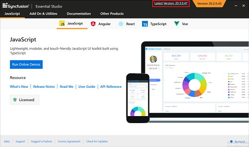

# Upgrading Syncfusion&reg; JavaScript (Essential&reg; JS2)

**Applies to:** Syncfusion Essential Studio&reg; JavaScript – EJ2 on Windows.

Syncfusion&reg; releases new volumes once every three months, with exciting new features. There will be one Service Pack release for these volume releases. Service Pack releases are provided to address major bug fixes in the volume releases.

You can upgrade from any previous version — trial or licensed — to the latest release without uninstalling older versions.

See the **[Upgrade Guide](https://help.syncfusion.com/upgrade-guide/typescript)** for JavaScript – EJ2 to learn more about the breaking changes, bug fixes, new features, and known issues between your current version and the latest version you are trying to upgrade to.

## Prerequisites

Before you begin, make sure the following are in place:

* An active internet connection.
* A Syncfusion&reg; account with a valid trial or licensed subscription. To create one, see [Create a Syncfusion account](https://www.syncfusion.com/account/register).
* Administrator rights on the machine (the installer must be run as administrator).
* A free disk space of at least 3 GB (the exact size is shown on the installer's **Download Size** and **Installation Size** links).

## Upgrading to the latest version

The most recent version of Syncfusion&reg; JavaScript – EJ2 can be downloaded and installed by clicking the **Latest Version: {Version}** link at the top of the Syncfusion&reg; JavaScript – EJ2 Control Panel.

You can also upgrade to the latest version by downloading and installing the products you require from the [Syncfusion Downloads](https://www.syncfusion.com/account/downloads) page. The existing installed versions are not required to be uninstalled.

It is not required to install the Volume release before installing the Service Pack release. As releases for Volume and Service Packs work independently, you can install the latest version with major bug fixes directly.

## Upgrade procedure

1. Open the Syncfusion&reg; JavaScript – EJ2 Control Panel (from the Start menu or the desktop shortcut created during installation).
2. Click the **Latest Version: {Version}** link at the top of the Control Panel. The web installer downloads and launches automatically.
3. In the installer, accept the License Terms and sign in with your Syncfusion&reg; account.
4. Select the products to upgrade, configure the install location, and complete the wizard. The new version installs side-by-side with any earlier versions.

For full step-by-step instructions, see [Installation using web installer](https://ej2.syncfusion.com/documentation/installation-and-upgrade/installation-using-web-installer/).

## Upgrade from trial version to license version

Uninstall the trial version and install the fully licensed installer from the [License and Downloads](https://www.syncfusion.com/account/downloads) section of our website to upgrade from the trial version.

>Note: License key registration is not required for JavaScript if you are using scripts (`.js`) and CSS files. If you are using the Syncfusion npm packages, you must register the license key in your application as described in the [licensing documentation](https://ej2.syncfusion.com/documentation/licensing/).

## Troubleshooting

If you encounter issues during the upgrade, see [Common installation errors](https://ej2.syncfusion.com/documentation/installation-and-upgrade/common-installation-errors/) for solutions to typical problems such as license key mismatch, blocked installations, and controlled folder access.