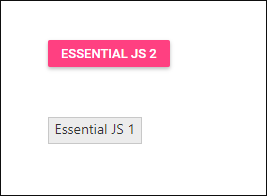

# Compatibility between Essential® JS 1 and Essential® JS2

Use Essential<sup style="font-size:70%">&reg;</sup> JS 1 and Essential<sup style="font-size:70%">&reg;</sup> JS 2 controls together on the same web page. This guide shows how to set them up without style or functionality conflicts.

## Prerequisites

* [Visual Studio Code](https://code.visualstudio.com/) (or any text editor)
* Basic understanding of HTML and JavaScript

## Quick Setup

### Step 1: Start with Syncfusion<sup style="font-size:70%">&reg;</sup> Essential JS 2

Follow the [Quick Start](./quick-start) guide to create an Essential JS 2 application with a basic Button control.

### Step 2: Use Compatibility Styles

Replace your default style with the compatibility style to prevent UI conflicts.

**Using CDN:**
```
https://cdn.syncfusion.com/ej2/styles/compatibility/material.css
```

### Step 3: Add Syncfusion<sup style="font-size:70%">&reg;</sup> control to the application

Create a folder named quickstart and add an index.html file inside it.
Below is a ready-to-use HTML file that includes both EJ1 and EJ2 controls:


```html
<!DOCTYPE html>
<html>
  <head>
    <title>Essential Js1 + Essential Js2 Compatibility</title>
    
    <!-- Compatibility Styles -->
    <link href="https://cdn.syncfusion.com/ej2/styles/compatibility/material.css" rel="stylesheet" />
    
    <!-- jQuery (required by EJ1) -->
    <script src="https://cdnjs.cloudflare.com/ajax/libs/jquery/3.7.1/jquery.min.js"></script>
    
    <!-- EJ1 Script -->
    <script src="https://cdn.syncfusion.com/13.2.0.29/js/web/ej.web.all.min.js"></script>
    
    <!-- EJ2 Scripts -->
    <script src="https://cdn.syncfusion.com/ej2/33.2.3/ej2-base/dist/global/ej2-base.min.js"></script>
    <script src="https://cdn.syncfusion.com/ej2/33.2.3/ej2-grids/dist/global/ej2-grids.min.js"></script>
  </head>
  
  <body>
    
    <!-- EJ1 Button -->
    <button id="ej1Button">ESSENTIAL JS 1</button>
    
    <!-- EJ2 Button -->
    <button id="ej2Button">ESSENTIAL JS 2 </button>
    
    <script>
      // Extend ej namespace with Syncfusion
      $.extend(ej, Syncfusion);
      
      // Initialize EJ1 Button
      $("#ej1Button").ejButton();
      
      // Initialize EJ2 Button
      var button2 = new ej.buttons.Button({ isPrimary: true });
      button2.appendTo('#ej2Button');
    </script>
  </body>
</html>
```

### Step 4: Run the application

Open the HTML file in your browser. Both EJ1 and EJ2 controls should render without conflicts.



## Important Notes

- **Load order:** EJ1 resources (jQuery + EJ1 script) must come before EJ2 resources.
- **Compatibility styles:** Always use the compatibility theme to prevent visual conflicts.
- **Namespace:** Extend the `ej` namespace with `Syncfusion` before initializing controls.

## See Also

* [Essential JS 2 Quick Start](./quick-start): A step-by-step quickstart that walks you through creating a minimal Syncfusion EJ2 application (CDN and local examples).
* [GitHub Samples - EJ2 Quickstart](https://github.com/SyncfusionExamples/ej2-quickstart): Ready-to-run sample projects demonstrating CDN and local setups for common EJ2 scenarios.
