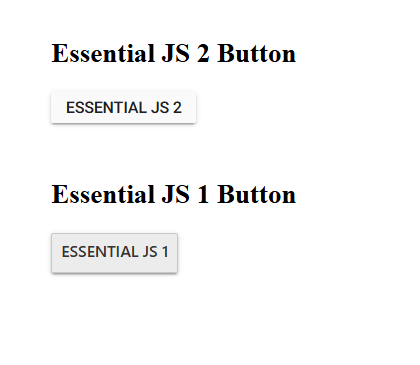

# Compatibility between Essential® JS 1 and Essential® JS2

Use Essential<sup style="font-size:70%">&reg;</sup> JS 1 and Essential<sup style="font-size:70%">&reg;</sup> JS 2 controls together on the same web page. This guide shows how to set them up without style or functionality conflicts.

## Prerequisites

* [Visual Studio Code] (or any text editor)
* Basic understanding of HTML and JavaScript

## Quick Setup

### Step 1: Get started with Syncfusion<sup style="font-size:70%">&reg;</sup> Essential JS 2

Follow the [Quick Start](./quick-start) guide to create an Essential JS 2 application with a basic Button control.

### Step 2: Use Compatibility Styles

Replace your default style with the compatibility style to prevent UI conflicts.

**Reference the styles from the CDN:**
```
https://cdn.syncfusion.com/ej2/styles/compatibility/material.css
```

### Step 3: Add Syncfusion<sup style="font-size:70%">&reg;</sup> control to the application

Create a folder named quickstart and add an index.html file inside it.
Below is a ready-to-use HTML file that includes both EJ1 and EJ2 controls:


```html
<!DOCTYPE html>
<head>
    <title>Essential JS 2 - Essential JS 1</title>
    <!-- Essential JS 1 default theme -->
    <link href=" http://cdn.syncfusion.com/16.1.0.24/js/web/flat-azure/ej.web.all.compatibility.min.css " rel="stylesheet" type="text/css" />
    <!-- Essential JS 2 material theme -->
    <link href="https://cdn.syncfusion.com/ej2/styles/compatibility/material.css" rel="stylesheet" type="text/css" />
    <!-- Essential JS 1 scripts -->
    <script src="https://cdn.syncfusion.com/js/assets/external/jquery-1.10.2.min.js" type="text/javascript"></script>
    <script src="https://cdn.syncfusion.com/js/assets/external/jquery.easing.1.3.min.js" type="text/javascript"></script>
    <script src=" https://cdn.syncfusion.com/16.1.0.24/js/web/ej.web.all.min.js" type="text/javascript"></script>
    <!-- Essential JS 2 script -->
    <script src=" https://cdn.syncfusion.com/ej2/dist/ej2.min.js" type="text/javascript"></script>
</head>

<body>
    <div style="margin: 50px;">
        <!-- Add HTML Button element for Essential JS 2 -->
        <h2>Essential JS 2 Button</h2>
        <button id="btn2">Essential JS 2</button>
    </div>
	<div style="margin: 50px;">
        <h2>Essential JS 1 Button</h2>
        <!-- Add HTML Button element for Essential JS 1 -->
        <button id="btn1">Essential JS 1</button>
    </div>
    <script>
   // Extend ej namespace with Syncfusion
   $.extend(ej, Syncfusion);
   // Initialize Essential JS 1 JavaScript Button component
   $("#btn1").ejButton({
        size: "medium",
        showRoundedCorner: true,
   })
   // Initialize Essential JS 2 JavaScript Button component
   var button = new ej.buttons.Button();
   button.appendTo('#btn2');
</script>
</body>

</html>
```

### Step 4: Run the application

Open the HTML file in your browser. Both EJ1 and EJ2 controls should render without conflicts.



## Important Notes

- **Load order:** EJ1 resources (jQuery + EJ1 script) must come before EJ2 resources.
- **Compatibility styles:** Always use the compatibility theme to prevent visual conflicts.
- **Namespace:** Extend the `ej` namespace with `Syncfusion` before initializing controls.

## See Also

* [Essential JS 2 Quick Start](./quick-start): A step-by-step quickstart that walks you through creating a minimal Syncfusion EJ2 application (CDN and local examples).
* [GitHub Samples - EJ2 Quickstart](https://github.com/SyncfusionExamples/ej2-quickstart): Ready-to-run sample projects demonstrating CDN and local setups for common EJ2 scenarios.
