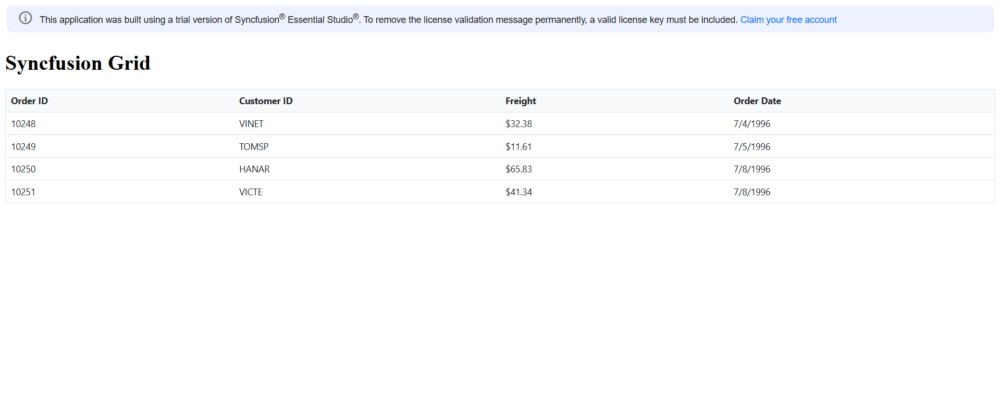

# Getting Started with Syncfusion® JavaScript (ES5) UI Controls

Build your first Syncfusion JavaScript (ES5) application with a simple Grid control in just a few minutes. This quickstart guides you through creating a minimal, runnable HTML page that loads the Syncfusion EJ2 (ES5) Grid from the CDN, initializes it with sample data, and renders a responsive data table.


## Prerequisites

* [Visual Studio Code](https://code.visualstudio.com) (or any text editor)
* A web browser to view the result

## Quick Setup

### Step 1: Create Folder and HTML file

* Create a folder named `quickstart` in your desired directory
* Inside the `quickstart` folder, create a new file named `index.html`

### Step 2: Add Syncfusion<sup style="font-size:70%">&reg;</sup> CDN Resources

Include the following CSS and JavaScript links in the `<head>` section.

**Styles (CSS):**
```
https://cdn.syncfusion.com/ej2/33.2.3/ej2-base/styles/bootstrap5.3.css
https://cdn.syncfusion.com/ej2/33.2.3/ej2-grids/styles/bootstrap5.3.css
```

**Scripts (JavaScript):**
```
https://cdn.syncfusion.com/ej2/33.2.3/ej2-base/dist/global/ej2-base.min.js
https://cdn.syncfusion.com/ej2/33.2.3/ej2-data/dist/global/ej2-data.min.js
https://cdn.syncfusion.com/ej2/33.2.3/ej2-popups/dist/global/ej2-popups.min.js
https://cdn.syncfusion.com/ej2/33.2.3/ej2-grids/dist/global/ej2-grids.min.js
```

### Step 3: Add Syncfusion<sup style="font-size:70%">&reg;</sup>control to the application

Copy and paste the following complete code into your `index.html` file:

```html
<!DOCTYPE html>
<html>
  <head>
    <title>Syncfusion Grid - Quick Start</title>
    <!-- Styles -->
    <link href="https://cdn.syncfusion.com/ej2/33.2.3/ej2-base/styles/bootstrap5.3.css" rel="stylesheet" />
    <link href="https://cdn.syncfusion.com/ej2/33.2.3/ej2-grids/styles/bootstrap5.3.css" rel="stylesheet" />
    
    <!-- Scripts -->
    <script src="https://cdn.syncfusion.com/ej2/33.2.3/ej2-base/dist/global/ej2-base.min.js"></script>
    <script src="https://cdn.syncfusion.com/ej2/33.2.3/ej2-data/dist/global/ej2-data.min.js"></script>
    <script src="https://cdn.syncfusion.com/ej2/33.2.3/ej2-popups/dist/global/ej2-popups.min.js"></script>
    <script src="https://cdn.syncfusion.com/ej2/33.2.3/ej2-grids/dist/global/ej2-grids.min.js"></script>
  </head>
  
  <body>
    <h1>Syncfusion Grid</h1>
    <div id="Grid"></div>
    
    <script>
      // Sample data
      var data = [
        { OrderID: 10248, CustomerID: 'VINET', Freight: 32.38, OrderDate: new Date(1996, 6, 4) },
        { OrderID: 10249, CustomerID: 'TOMSP', Freight: 11.61, OrderDate: new Date(1996, 6, 5) },
        { OrderID: 10250, CustomerID: 'HANAR', Freight: 65.83, OrderDate: new Date(1996, 6, 8) },
        { OrderID: 10251, CustomerID: 'VICTE', Freight: 41.34, OrderDate: new Date(1996, 6, 8) }
      ];
      
      // Create Grid
      var grid = new ej.grids.Grid({
        dataSource: data,
        columns: [
          { field: 'OrderID', headerText: 'Order ID', width: 120 },
          { field: 'CustomerID', headerText: 'Customer ID', width: 140 },
          { field: 'Freight', headerText: 'Freight', width: 120, format: 'C2' },
          { field: 'OrderDate', headerText: 'Order Date', width: 140, format: 'yMd' }
        ]
      });
      
      // Render Grid
      grid.appendTo('#Grid');
    </script>
  </body>
</html>
```

### Step 4: Open in Browser

Open the `quickstart/index.html` file in your web browser. You should see the Syncfusion Grid control displaying the sample data.

## Output

The following screenshot shows the output of the Syncfusion Grid quick start application:



## See Also

* **[Grid Component Documentation](https://ej2.syncfusion.com/javascript/documentation/grid/getting-started)** - Comprehensive guide to all Grid control features and functionality.

* **[GitHub Samples](https://github.com/SyncfusionExamples/ej2-quickstart)** - View complete working examples for CDN and local resource implementations.

* **[Register License Key](https://ej2.syncfusion.com/javascript/documentation/licensing/license-key-registration)** - Learn how to register your Syncfusion license key in your JavaScript application.
