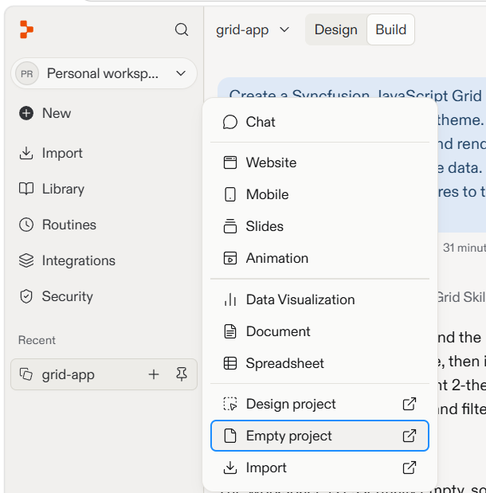
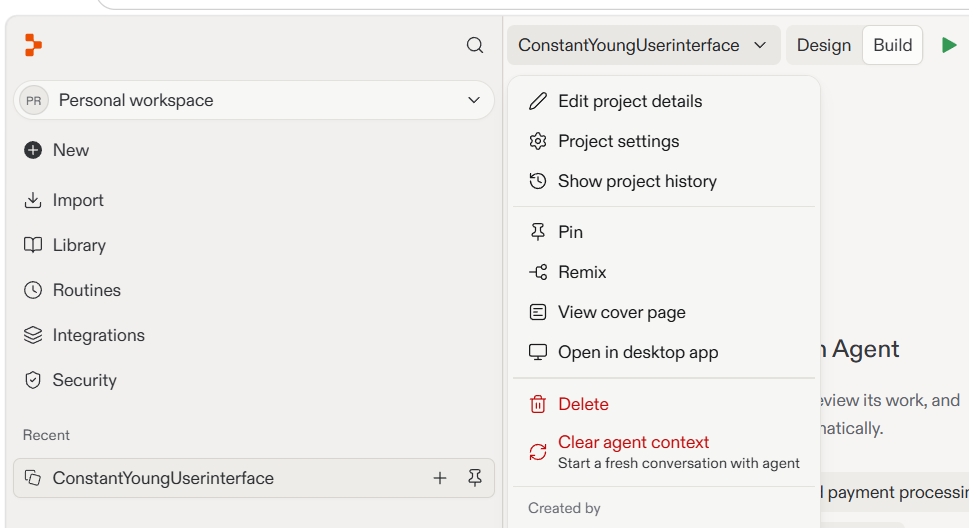
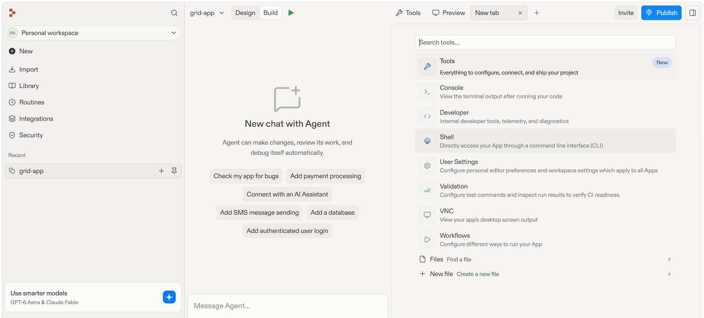
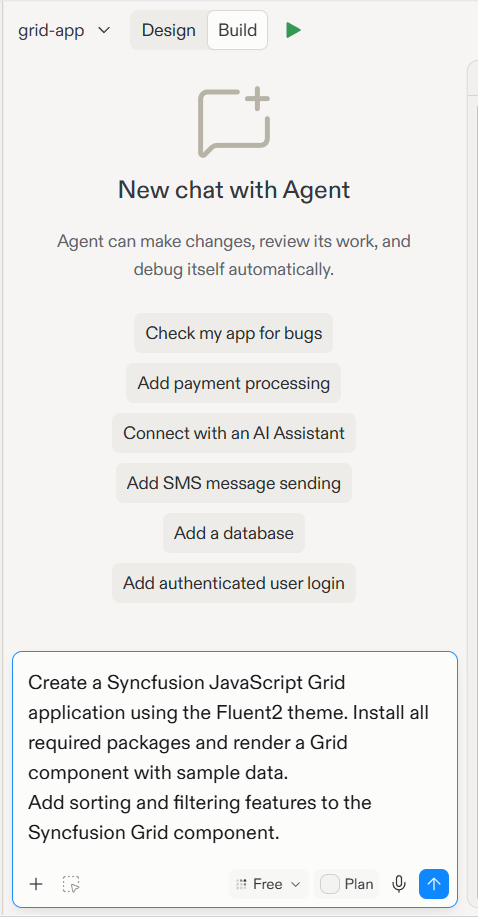
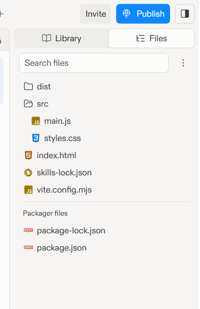
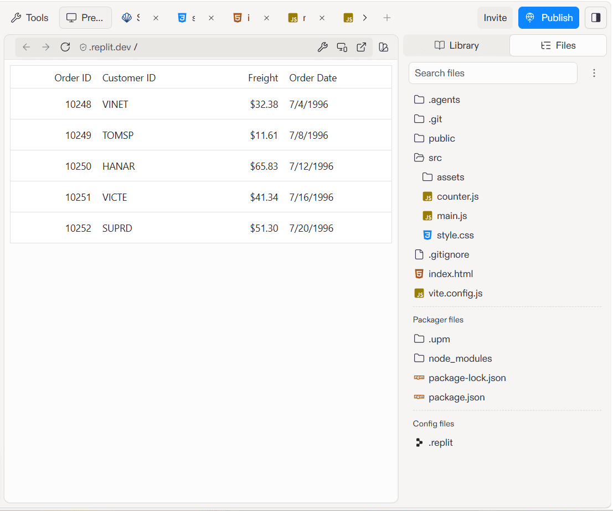
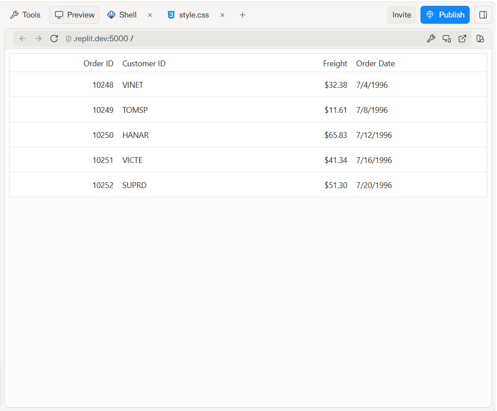

# Getting Started with Syncfusion Grid in Replit

This section provides a step-by-step guide for setting up a JavaScript application in Replit and integrating the Syncfusion<sup style="font-size:70%">&reg;</sup> Grid control — without installing any local tools.

`Replit` is a browser-based development environment that lets you write, run, and deploy applications entirely in the cloud. It requires no local setup and is well suited for users who are new to software development, or who want to prototype and iterate quickly without configuring local development tools.

## Prerequisites

Before getting started, ensure the following:

* A free or paid Replit account
* A valid Syncfusion® license key (licensed or trial)

> No local Node.js, npm, or IDE installation is required. All development happens inside the Replit browser environment.

## Create a project in Replit

1. Sign in to [Replit](https://replit.com/).
2. Click **New** and select **Empty project**.

Replit creates an empty project with a default generated name.



3. To rename the project, click the project name dropdown located at the top of the Replit workspace, select **Edit project details**, and enter a name such as `grid-app`.



## Integrate the Syncfusion Grid control

This section explains how to integrate the Syncfusion® Grid control into your existing Replit JavaScript project with the minimum required configuration. You can use either of the following approaches to add and run the Grid control successfully.

Before proceeding, click the **+** icon in the tab bar and select **Shell** from the new tab. The Shell is required for both the Agent Skills and Vite CLI approaches described in the following sections.






Use the pre-installed Syncfusion® Grid skills with the Replit Agent to generate the application code automatically.

## Install the JavaScript Grid skills

To install the Syncfusion® Grid skills, run the following command in the Shell tab:

```bash
npx skills add syncfusion/javascript-ui-controls-skills --skill syncfusion-javascript-grid
```

Once skills are installed, the Replit Agent automatically:

* **Reads the skill files** — The agent retrieves control APIs, best practices, and code patterns from the installed Syncfusion skills.
* **Grounds code generation** — The agent uses skill-based knowledge instead of generic AI suggestions, ensuring accurate Syncfusion APIs and patterns.
* **Generates production-ready code** — The agent generates complete, working implementations that can be directly integrated into your application.
* **Enforces best practices** — The agent recommends correct packages, proper license registration, theme setup, and configuration.

Once skills are installed, the Replit Agent can generate Grid control code automatically. Open the Replit Agent panel and enter a prompt such as:

> Create a minimal Replit web app using the Syncfusion EJ2 JavaScript Grid and the Fluent 2 theme. Install the required packages: @syncfusion/ej2-grids, @syncfusion/ej2-base, @syncfusion/ej2-fluent2-theme, and Vite. Render a single Grid with sample order data. Enable sorting by column headers and filtering with the Grid’s filter menus by injecting the Sort and Filter modules. Keep the page simple—just the Grid, with no dashboard or extra interface. Start the Replit preview and verify the app loads. Do not publish, deploy, or configure a custom domain.




The agent will:

* Create a JavaScript application structure
* Install the required Syncfusion® packages (@syncfusion/ej2-grids, @syncfusion/ej2-fluent2-theme, etc.)
* Register the license key before control initialization if mentioned
* Import the theme CSS in the correct file
* Generate the complete Grid control implementation with your requested features
* Create sample data and configuration based on your requirements

Review the generated code by opening the Library panel on the right side. Click the Files tab to view all project files. Then, click on files like `src/main.js`, `index.html`, and `src/style.css` to view and edit the generated code if needed. You can also press Ctrl + Shift + L to quickly toggle the Library panel.



## Run the application

Once the agent finishes generating the application code, the JavaScript Grid application will be automatically displayed in the preview pane.





Create the JavaScript application manually using the Vite CLI and add the Syncfusion® Grid control step by step.

## Create a JavaScript project

1. In the Shell tab, run the following command to create a Vite JavaScript project:

```bash
npm create vite@latest . -- --template vanilla
```

2. Install the project dependencies:

```bash
npm install
```

3. Install the Syncfusion® Grid package and the Fluent2 theme:

```bash
npm install @syncfusion/ej2-grids @syncfusion/ej2-fluent2-theme
```

4. Open the `src/style.css` file and add the following import statement:

```css
@import "@syncfusion/ej2-fluent2-theme/styles/fluent2.css";
```

5. Open the `index.html` file and add the Grid container element:

```html
<!DOCTYPE html>
<html lang="en">
<head>
    <meta charset="UTF-8" />
    <link rel="icon" type="image/svg+xml" href="/vite.svg" />
    <meta name="viewport" content="width=device-width, initial-scale=1.0" />
    <title>Syncfusion Grid in JavaScript</title>
</head>
<body>
    <div id="app">
        <!-- Syncfusion Grid Container -->
        <div id="Grid"></div>
    </div>
    <script type="module" src="/src/main.js"></script>
</body>
</html>
```

6. Open the `src/main.js` file and replace its contents with:

```javascript
import { registerLicense } from '@syncfusion/ej2-base';
import { Grid } from '@syncfusion/ej2-grids';
import './style.css';

// Register Syncfusion License
registerLicense('YOUR_LICENSE_KEY');

// Sample data
var data = [
    {
        OrderID: 10248,
        CustomerID: 'VINET',
        Freight: 32.38,
        OrderDate: new Date(8364186e5)
    },
    {
        OrderID: 10249,
        CustomerID: 'TOMSP',
        Freight: 11.61,
        OrderDate: new Date(8367642e5)
    },
    {
        OrderID: 10250,
        CustomerID: 'HANAR',
        Freight: 65.83,
        OrderDate: new Date(8371242e5)
    },
    {
        OrderID: 10251,
        CustomerID: 'VICTE',
        Freight: 41.34,
        OrderDate: new Date(8374842e5)
    },
    {
        OrderID: 10252,
        CustomerID: 'SUPRD',
        Freight: 51.3,
        OrderDate: new Date(8378442e5)
    }
];

// Initialize Grid control
var grid = new Grid({
    dataSource: data,
    columns: [
        { field: 'OrderID', headerText: 'Order ID', width: 120, type: 'number', textAlign: 'Right' },
        { field: 'CustomerID', headerText: 'Customer ID', width: 140, type: 'string' },
        { field: 'Freight', headerText: 'Freight', width: 120, format: 'C2', type: 'number', textAlign: 'Right' },
        { field: 'OrderDate', headerText: 'Order Date', width: 150, format: 'yMd', type: 'date' }
    ]
});

// Render the Grid control
grid.appendTo('#Grid');
```




For more information on obtaining and registering a license key, see [How to Register a Syncfusion® License Key](../../licensing/license-key-registration).

## Run the Application

Once you have completed all the setup steps, click the **Run** button (▶) at the top of the Replit workspace. The JavaScript Grid application will be built and rendered in the preview pane.



## Key features to explore

Once your Grid is running, you can enhance it with:

* Data binding: Bind data from APIs or remote sources
* Sorting and filtering: Enable sorting and filtering on columns using Grid properties
* Paging: Add pagination to handle large datasets
* Selection: Enable row or cell selection
* Editing: Allow inline editing of cell values with the Edit module
* Exporting: Export data to Excel or PDF formats
* Responsive design: Build responsive layouts that adapt to different screen sizes

## Tips for working in Replit

* Shell access: Use the Shell tab to run any npm commands, such as installing additional packages or starting or stopping the development server manually.
* Persistent storage: Replit persists your project files automatically. Changes are saved as you type.
* File management: Use the file browser to view and edit project files. You can also use the context menu to create, edit, and manage files.


## Troubleshooting

| Issue | Resolution |
|-------|-----------|
| Preview shows "Your app is not running" | Click **Run** to start the development server. If the issue persists, open the Agent panel and describe the issue (for example, *"My app is not starting in preview"*), then ask the agent to check the workflow and fix any runtime errors. |
| Module not found errors | Open the Shell and run `npm install` to restore all dependencies. |
| License warning banner | Verify that `registerLicense` is called before initializing the Grid control. |
| Grid not displaying | Ensure the theme CSS is imported in `src/style.css` and that the Grid container element with id `Grid` exists in your HTML. |
| Shell commands not working | Wait for Replit to finish booting the environment, then retry the command. |
| Blocked request: This host is not allowed | This occurs when Vite blocks the Replit preview hostname. Configure `server.allowedHosts` in `vite.config.js` to allow Replit preview domains, and then restart the application. |

If you encounter an error similar to:

```text
Blocked request. This host ("<replit-preview-host>.replit.dev") is not allowed.
To allow this host, add "<replit-preview-host>.replit.dev" to server.allowedHosts in vite.config.js.
```

Create or update the `vite.config.js` file with the following configuration:

```javascript
import { defineConfig } from 'vite';

export default defineConfig({
  server: {
    host: '0.0.0.0',
    port: 5000,
    allowedHosts: ['.replit.dev', '.repl.co'],
  },
});
```

After updating `vite.config.js`, restart the application. The Replit preview should then load the application without the blocked host error.

## See also

* [Grid Getting Started Documentation](https://ej2.syncfusion.com/documentation/grid/getting-started)
* [How to register Syncfusion<sup style="font-size:70%">&reg;</sup> license key](https://ej2.syncfusion.com/documentation/licensing/license-key-registration)
* [Syncfusion<sup style="font-size:70%">&reg;</sup> JavaScript Themes](https://ej2.syncfusion.com/documentation/appearance/theme)
* [Replit Documentation](https://docs.replit.com/)
