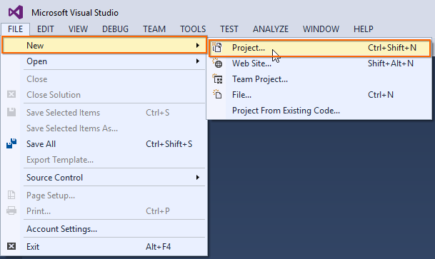
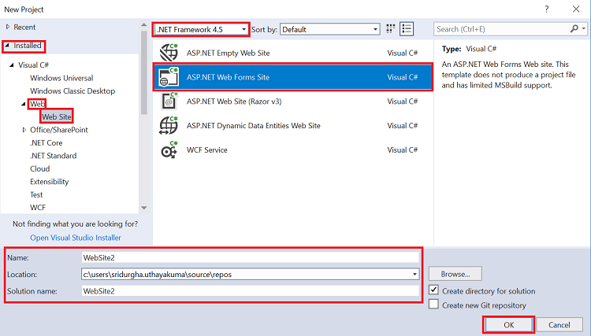
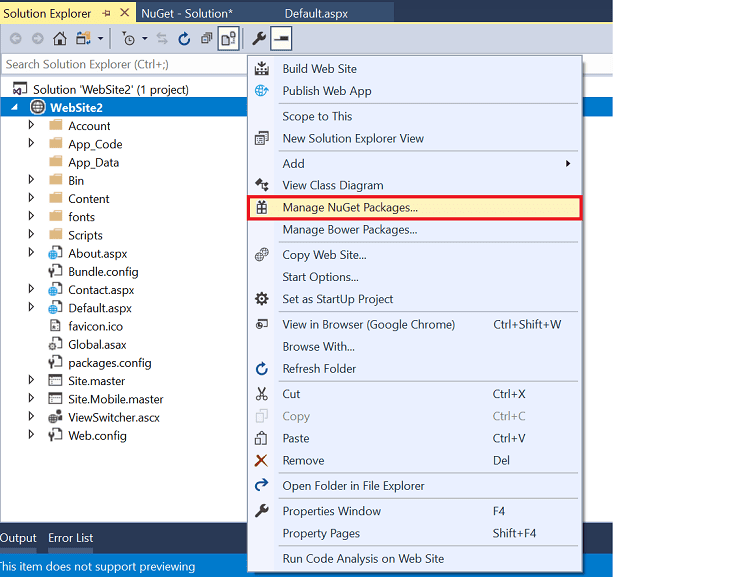
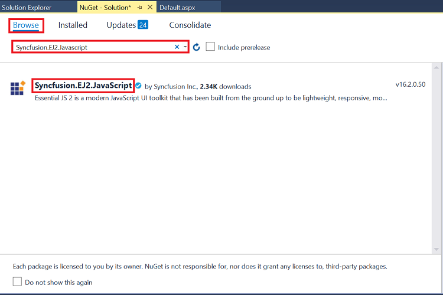
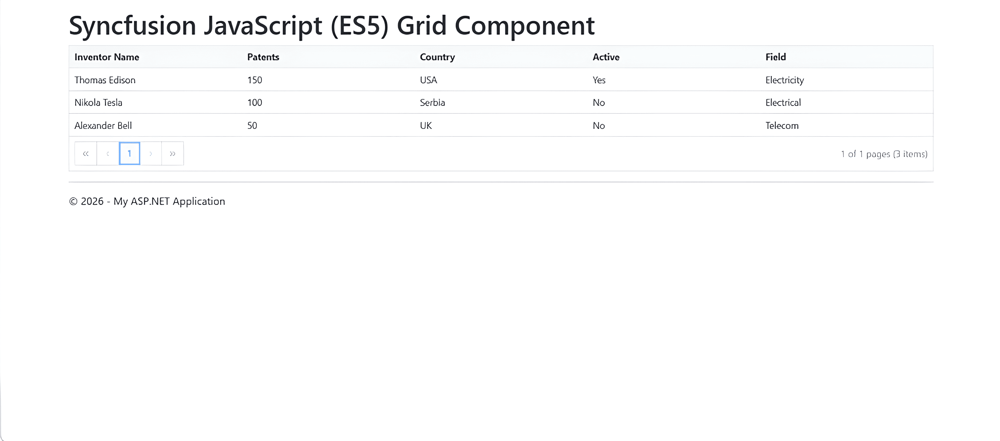

# Getting Started with Syncfusion® JavaScript and ASP.NET Web Forms
This guide provides a comprehensive walkthrough for integrating Syncfusion JavaScript (ES5) controls into an ASP.NET Web Forms application using NuGet-based installation. It includes step-by-step instructions for project setup and dependency configuration, along with a minimal working example using the Grid component to validate the implementation.

## Prerequisites

To get started with ASP.NET Web Forms application, ensure the following software to be installed in the machine.

* .NET Framework 4.5 and above
* ASP.NET Web Forms
* Visual Studio 2017

## Create ASP.NET Web Forms application

1. Choose **File > New > Project...** in the Visual Studio menu bar.

    

2. Select the **ASP.NET Web Forms Site** and change the application name, and then click **OK**.

    

### Configure Syncfusion<sup style="font-size:70%">&reg;</sup> JavaScript (ES5) control in the Web Forms application

 1. Add the [`Syncfusion.EJ2.Javascript`](https://www.nuget.org/packages/Syncfusion.EJ2.Javascript/) NuGet package to the new application by using the NuGet Package Manager. Right-click the project and select **Manage NuGet Packages...**.

    

 2. Search the `Syncfusion.EJ2.JavaScript` keyword in the **Browse** tab and install **Syncfusion.EJ2.JavaScript** NuGet package in the application.

    

    The Syncfusion Javascript NuGet package will be included in the project after the installation process is completed.

 3. Open `~/Site.master` file and add the required styles and script references of Syncfusion<sup style="font-size:70%">&reg;</sup> JavaScript controls to the `<head>` element.

    ```html
    <head>
    <!-- Syncfusion CSS -->
    <link href="https://cdn.syncfusion.com/ej2/33.2.3/ej2-base/styles/material.css" rel="stylesheet">
    <link href="https://cdn.syncfusion.com/ej2/33.2.3/ej2-grids/styles/material.css" rel="stylesheet">
    <!-- Syncfusion JS -->
    <script src="https://cdn.syncfusion.com/ej2/33.2.3/dist/ej2.min.js"></script>
    </head>
    ```

 4. Open `~/Default.aspx` file and add the Syncfusion<sup style="font-size:70%">&reg;</sup> JavaScript control to the `<div>` element and intimate the Grid control inside the `<script>` element.

    ```html
    <div class="row">
    <h2>Syncfusion Javascript (ES5) Grid Component</h2>
    <div id="Grid"></div>
    
    <script>
        var data = [
            { Inventor: "Thomas Edison", NumberofPatentFamilies: 150, Country: "USA", Active: "Yes", Mainfieldsofinvention: "Electricity" },
            { Inventor: "Nikola Tesla", NumberofPatentFamilies: 100, Country: "Serbia", Active: "No", Mainfieldsofinvention: "Electrical" },
            { Inventor: "Alexander Bell", NumberofPatentFamilies: 50, Country: "UK", Active: "No", Mainfieldsofinvention: "Telecom" }
        ];
    
        // Grid
        var grid = new ej.grids.Grid({
            dataSource: data,
            columns: [
                { field: 'Inventor', headerText: 'Inventor Name' },
                { field: 'NumberofPatentFamilies', headerText: 'Patents' },
                { field: 'Country', headerText: 'Country' },
                { field: 'Active', headerText: 'Active' },
                { field: 'Mainfieldsofinvention', headerText: 'Field' }
            ],
            allowPaging: true,
            pageSettings: { pageSize: 5 }
        });
        grid.appendTo('#Grid');
    </script>
    </div>
    ```

5. Run the application. The Syncfusion<sup style="font-size:70%">&reg;</sup> JavaScript Grid control will render in the web browser.

    

## See More

* [Syncfusion Grid Documentation](https://ej2.syncfusion.com/javascript/documentation/grid/getting-started): Detailed Grid features, API reference, and advanced examples.
* [Syncfusion NuGet Packages](https://www.nuget.org/packages/Syncfusion.EJ2.JavaScript): Use NuGet to add EJ2 packages to Visual Studio projects for offline and managed deployments.


