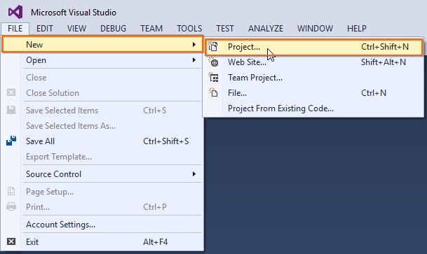
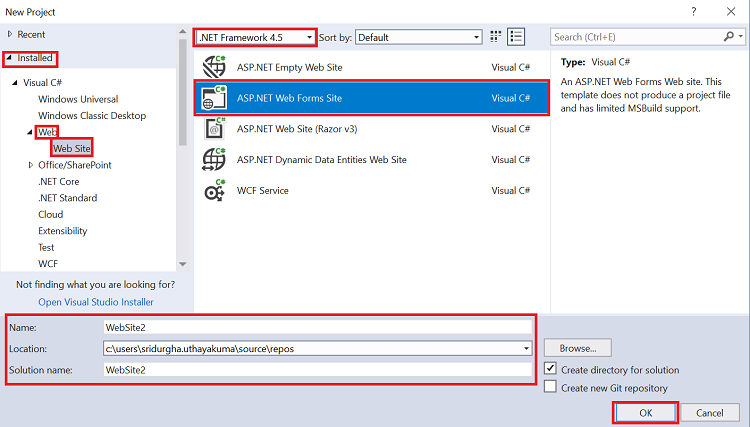
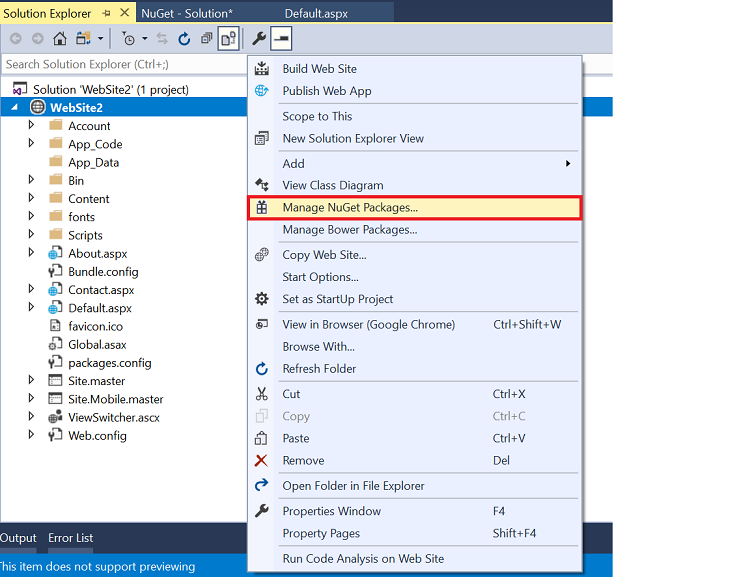
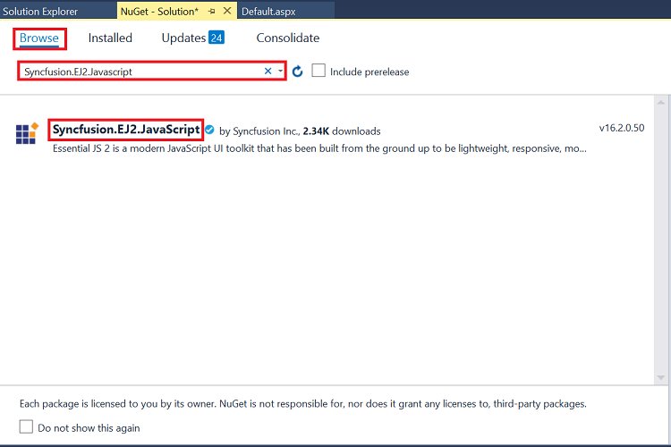

# Getting Started with Syncfusion JavaScript (ES5) UI control and ASP.NET Web Forms in Visual Studio 2017

## Prerequisites

To get started with ASP.NET Web Forms application, ensure the following software to be installed in the machine.

* .Net Framework 4.5 and above
* ASP.NET Web Forms
* Visual Studio 2017

## Create ASP.NET Web Forms application

1. Choose **File > New > Project...** in the Visual Studio menu bar.

    

2. Select the **ASP.NET Web Forms Site** and change the application name, and then click **OK**.

    

### Configure Syncfusion JavaScript (ES5) control in the Web Forms application

 1. Add the [`Syncfusion.EJ2.Javascript`](https://www.nuget.org/packages/Syncfusion.EJ2.Javascript/) NuGet package to the new application by using the NuGet Package Manager. Right-click the project and select **Manage NuGet Packages...**.

    

 2. Search the `Syncfusion.EJ2.JavaScript` keyword in the **Browse** tab and install **Syncfusion.EJ2.JavaScript** NuGet package in the application.

    

    The Syncfuion Javascript NuGet package will be included in the project after the installation process is completed.

 3. Open `~/Site.master` file and add the required styles and script references of Syncfusion JavaScript controls to the `<head>` element.

    ```
    <head>

       ....
       ....

       @* Syncfusion Essential JS 2 Styles *@
       <link href="Content/ej2/material.css" rel="stylesheet" />

       @* Syncfusion Essential JS 2 Scripts *@
       <script src="Scripts/ej2/ej2.min.js"></script>
       <script src="Scripts/ej2/datasource.js"></script>

    </head>
    ```

 4. Open `~/Default.aspx` file and add the Syncfusion JavaScript control to the `<div>` element and intiate the Grid control inside the `<script>` element.

    ```
    <div class="row">
        <h1>Syncfusion JavaScript (ES5) Grid Control</h1>
        <br />
            <div id="Grid"></div>
            <script>
                // Initialize Syncfusion JavaScript Grid control
                var grid = new ej.grids.Grid({
                    dataSource: window.inventoryData,
                    columns: [
                        { field: 'Inventor', headerText: 'Inventor Name', width: 140 },
                        { field: 'NumberofPatentFamilies', headerText: 'No of Patent Families', width: 185, textAlign: 'Right' },
                        { field: 'Country', headerText: 'Country', width: 120 },
                        { field: 'Active', headerText: 'Active', width: 130 },
                        { field: 'Mainfieldsofinvention', headerText: 'Main fields of invention', width: 180 },
                    ],
                    allowSorting: true,
                   allowPaging: true,
                    pageSettings: { pageSize: 15 }
                });
                grid.appendTo('#Grid');
            </script>
    </div>
    ```

 5. Run the application. The Syncfusion JavaScript Grid control will render in the web browser.

    
