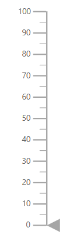

# Getting Started with ##Platform_Name## Linear Gauge Control

This document explains how to create a Linear Gauge and configure its features in TypeScript using the Essential JS 2 webpack [quickstart](https://github.com/SyncfusionExamples/ej2-quickstart-webpack) seed repository.

> The quickstart project uses the provided `webpack.config.js` configuration to compile and bundle the TypeScript application. For more information about webpack, refer to the [webpack getting-started guide](https://webpack.js.org/guides/getting-started/).

## Prerequisites

Before you begin, ensure that the following software is installed:

* Node.js with npm
* [Visual Studio Code](https://code.visualstudio.com) or another text editor
* [Git](https://git-scm.com/) for cloning the quickstart repository
* A modern web browser such as Chrome, Edge, Firefox, or Safari

> Register your Syncfusion license key before initializing the component. For more information, refer to the [license key registration documentation](https://ej2.syncfusion.com/documentation/licensing/license-key-registration).

## Dependencies

The Linear Gauge component is available in the `@syncfusion/ej2-lineargauge` package. The following packages are its minimum dependencies:

```text
|-- @syncfusion/ej2-lineargauge
    |-- @syncfusion/ej2-base
    |-- @syncfusion/ej2-pdf-export
    |-- @syncfusion/ej2-svg-base
```

Compatible package versions are resolved from the project-root `package.json` file. Keep all Syncfusion package versions consistent to avoid dependency conflicts.

## Quick Setup

### Step 1: Create a Project Folder

Create a folder named `my-linear-gauge` in your preferred location. This folder will contain the Linear Gauge TypeScript project.

### Step 2: Open a Terminal

Open a terminal and navigate to the `my-linear-gauge` folder.

* On Windows, use Command Prompt or PowerShell.
* On macOS or Linux, use Terminal.

### Step 3: Clone the Quickstart Repository

Run the following command to clone the Syncfusion JavaScript quickstart project:




git clone https://github.com/SyncfusionExamples/ej2-quickstart-webpack ej2-quickstart




### Step 4: Navigate to the Project Folder

Navigate to the cloned project directory:




cd ej2-quickstart




### Step 5: Install the Required Packages

Run the following command from the project root to install the dependencies listed in `package.json`:




npm install




### Step 6: Update the HTML Template

Open the `ej2-quickstart` folder in Visual Studio Code or another text editor.

Locate the `src/index.html` file. Preserve the existing content generated by the seed project and add a `<div>` element with the ID `container` inside the `<body>` element.




<!DOCTYPE html>
<html lang="en">

<head>
    <title>Essential JS 2 Linear Gauge</title>
    <meta charset="utf-8">
    <meta name="viewport" content="width=device-width, initial-scale=1.0">
    <meta name="description" content="Syncfusion Linear Gauge TypeScript example">
    <meta name="author" content="Syncfusion">
    <!-- Preserve the existing head content from the seed template. -->
</head>

<body>
    <h1>Syncfusion Linear Gauge</h1>
    <!-- Container for the Linear Gauge. -->
    <div id="element"></div>
</body>

</html>




The webpack configuration supplied by the quickstart project compiles the TypeScript entry file and loads the generated bundle in this page.

### Step 7: Create the Linear Gauge Component

Locate the `src/app/app.ts` file and add the following code:







The `LinearGauge` constructor creates the component and the `appendTo('#element')` call renders the component in the HTML element whose ID matches the supplied selector.

### Step 8: Run the Application

Run the following command from the project root:




npm run start




Wait for webpack to finish compiling the application. If the browser does not open automatically, open the local URL displayed in the terminal.

The project commonly runs at:

```text
http://localhost:4000/
```

The exact port can vary based on the webpack development-server configuration. To stop the development server, press `Ctrl+C` in the terminal.

## Output

After completing the quick setup, the browser displays a Linear Gauge with its default axis. The additional examples demonstrate how to add a title, define the axis range, format axis labels, enable optional modules, and set the pointer value.





## Module Injection

Basic Linear Gauge rendering does not require feature-module injection. Inject a module only when its corresponding optional feature is used.

The following optional feature modules are available:

* [`Annotations`](https://ej2.syncfusion.com/documentation/api/linear-gauge/annotationmodel) enables annotation content in the Linear Gauge.
* [`GaugeTooltip`](https://ej2.syncfusion.com/documentation/api/linear-gauge/tooltipsettingsmodel) enables tooltips for gauge elements.

Import `LinearGauge` with the required modules and call `LinearGauge.Inject()` before creating the component:

```typescript
import {
    Annotations,
    GaugeTooltip,
    LinearGauge
} from '@syncfusion/ej2-lineargauge';

LinearGauge.Inject(Annotations, GaugeTooltip);

const gauge: LinearGauge = new LinearGauge({
    tooltip: {
        enable: true
    },
    axes: [{
        annotations: [{
            content: '<div>Temperature</div>',
            x: 0,
            y: 0
        }]
    }]
});

gauge.appendTo('#container');
```

Only inject [`Annotations`](https://ej2.syncfusion.com/documentation/api/linear-gauge/annotationmodel) or [`GaugeTooltip`](https://ej2.syncfusion.com/documentation/api/linear-gauge/tooltipsettingsmodel) when the application configures the corresponding annotation or tooltip feature.

## Troubleshooting

* **The repository cannot be cloned.** Verify that Git is installed, confirm the internet connection, and run `git --version`.
* **`npm install` fails.** Verify that Node.js and npm are installed by running `node --version` and `npm --version`.
* **`Cannot find module '@syncfusion/ej2-lineargauge'`.** Run `npm install @syncfusion/ej2-lineargauge --save` from the project root.
* **The TypeScript application does not compile.** Ensure that all Syncfusion packages use compatible versions and run `npm run build` to view the complete error.
* **The page is blank.** Check the browser console for errors and confirm that webpack completed the build successfully.
* **The Linear Gauge is not displayed.** Ensure that the HTML container ID is `container` and that `appendTo('#container')` uses the same ID.
