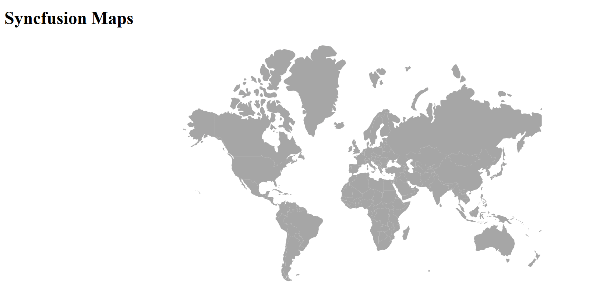

# Getting Started with Syncfusion® JavaScript (ES5) Maps Control

Build your first Syncfusion JavaScript (ES5) application with a simple Maps control in just a few minutes. This quickstart guides you through creating a minimal, runnable HTML page that loads the Syncfusion EJ2 (ES5) Maps from the CDN, initializes it with sample data, and renders an interactive map.

> **Ready to streamline your Syncfusion<sup style="font-size:70%">&reg;</sup> JavaScript development?** Discover the full potential of Syncfusion<sup style="font-size:70%">&reg;</sup> JavaScript controls with Syncfusion<sup style="font-size:70%">&reg;</sup> AI Coding Assistant. Effortlessly integrate, configure, and enhance your projects with intelligent, context-aware code suggestions, streamlined setups, and real-time insights—all seamlessly integrated into your preferred AI-powered IDEs like VS Code, Cursor, Syncfusion<sup style="font-size:70%">&reg;</sup> CodeStudio and more. [Explore Syncfusion<sup style="font-size:70%">&reg;</sup> AI Coding Assistant](https://ej2.syncfusion.com/javascript/documentation/ai-coding-assistant/overview)

## Prerequisites

* [Visual Studio Code](https://code.visualstudio.com) (or any text editor)
* A modern web browser (Chrome, Edge, Firefox, or Safari) to view the result

## Quick Setup

### Step 1: Create Folder and HTML file

* Create a folder named `quickstart` in your desired directory
* Inside the `quickstart` folder, create a new file named `index.html`

### Step 2: Add Syncfusion<sup style="font-size:70%">&reg;</sup> CDN Resources

Include the following JavaScript links in the `<head>` section.

**Scripts (JavaScript):**
```
https://cdn.syncfusion.com/ej2/33.2.3/ej2-base/dist/global/ej2-base.min.js
https://cdn.syncfusion.com/ej2/33.2.3/ej2-data/dist/global/ej2-data.min.js
https://cdn.syncfusion.com/ej2/33.2.3/ej2-pdf-export/dist/global/ej2-pdf-export.min.js
https://cdn.syncfusion.com/ej2/33.2.3/ej2-svg-base/dist/global/ej2-svg-base.min.js
https://cdn.syncfusion.com/ej2/33.2.3/ej2-maps/dist/global/ej2-maps.min.js
```

### Step 3: Add Syncfusion<sup style="font-size:70%">&reg;</sup> Maps control to the application

Copy and paste the following complete code into your `index.html` file:

```html
<!DOCTYPE html>
<html>
  <head>
    <title>Syncfusion Maps - Quick Start</title>

    <!-- Syncfusion CDN scripts (version 33.2.3) -->
    <script src="https://cdn.syncfusion.com/ej2/33.2.3/ej2-base/dist/global/ej2-base.min.js"></script>
    <script src="https://cdn.syncfusion.com/ej2/33.2.3/ej2-data/dist/global/ej2-data.min.js"></script>
    <script src="https://cdn.syncfusion.com/ej2/33.2.3/ej2-pdf-export/dist/global/ej2-pdf-export.min.js"></script>
    <script src="https://cdn.syncfusion.com/ej2/33.2.3/ej2-svg-base/dist/global/ej2-svg-base.min.js"></script>
    <script src="https://cdn.syncfusion.com/ej2/33.2.3/ej2-maps/dist/global/ej2-maps.min.js"></script>
  </head>

  <body>
    <h1>Syncfusion Maps</h1>
    <div id="element" style="width: 100%; height: 400px;"></div>

    <script>
      var shapeData = { dataOptions: { type: 'GET', url: 'https://cdn.syncfusion.com/maps/map-data/world-map.json'} };
      
      // Create Maps
      var map = new ej.maps.Maps({
            layers: [
                {
                    shapeData: shapeData
                }
            ]
        });

      // Render the map into the <div> with id="element"
      map.appendTo('#element');
    </script>
  </body>
</html>
```

### Step 4: Open in Browser

Open `quickstart/index.html` through a local web server (for example, right-click the file in VS Code with the Live Server extension installed and choose **Open with Live Server**). The page should display the Syncfusion Maps control rendered with the sample world map.

## Output

The following screenshot shows the output of the Syncfusion Maps quick start application:



## Next Steps

* Explore the [Maps API reference](https://ej2.syncfusion.com/javascript/documentation/api/maps) to learn about the available properties, events, and methods.
* Add additional [layers](https://ej2.syncfusion.com/javascript/documentation/maps/layers), [markers](https://ej2.syncfusion.com/javascript/documentation/maps/markers), and [legends](https://ej2.syncfusion.com/javascript/documentation/maps/legend) to enrich the map.
* Browse the [Maps samples](https://ej2.syncfusion.com/javascript/demos/#/bootstrap5/maps/default) for runnable examples.
