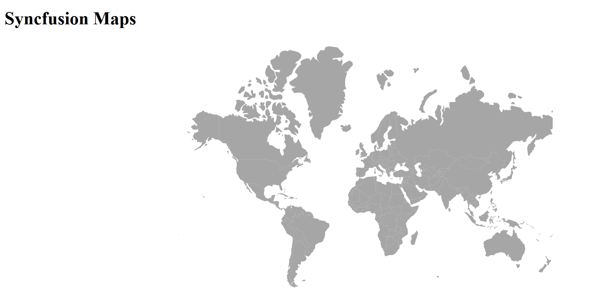

# Getting Started with TypeScript Maps

This section explains how to create a Maps component and configure its available functionalities in TypeScript using the Essential<sup style="font-size:70%">&reg;</sup> JS 2 [quickstart](https://github.com/SyncfusionExamples/ej2-quickstart-webpack-) seed repository.

> This application is integrated with the `webpack.config.js` configuration and uses the latest version of the [webpack-cli](https://webpack.js.org/api/cli/#commands). Ensure that Node.js is installed on your machine. For more information about webpack and its features, refer to the [webpack documentation](https://webpack.js.org/guides/getting-started).

You can explore some useful features in the Maps component using the following video.



## Prerequisites

Before you begin, ensure you have the following installed on your machine:

* [Node.js](https://nodejs.org/en)
* [Visual Studio Code](https://code.visualstudio.com) (or any text editor)
* [Git](https://git-scm.com/) (for cloning the quickstart repository)
* A modern web browser (Chrome, Edge, Firefox, or Safari) to view the result
* Basic knowledge of TypeScript and webpack

## Dependencies

The Maps control is available in the `@syncfusion/ej2-maps` package. The following dependencies are used by the package:

```javascript
|-- @syncfusion/ej2-maps
    |-- @syncfusion/ej2-base
    |-- @syncfusion/ej2-data
    |-- @syncfusion/ej2-pdf-export
    |-- @syncfusion/ej2-svg-base
```

Note: @syncfusion/ej2-pdf-export and @syncfusion/ej2-data are optional—required only for PDF export and data binding features respectively.

## Quick Setup

### Step 1: Open Command Prompt

Open the command prompt and navigate to your desired directory where you want to create the project. You can do this by:

* **Windows**: Command Prompt (cmd) or PowerShell
* **macOS / Linux**: Terminal

### Step 2: Clone the Quickstart Repository

Run the following command to clone the Syncfusion<sup style="font-size:70%">&reg;</sup> JavaScript (Essential<sup style="font-size:70%">&reg;</sup> JS 2) quickstart project from [GitHub](https://github.com/SyncfusionExamples/ej2-quickstart-webpack-). The repository will be cloned into a sub-folder named `ej2-quickstart`.




git clone https://github.com/SyncfusionExamples/ej2-quickstart-webpack ej2-quickstart




### Step 3: Navigate to the Project Folder

After cloning the application in the `ej2-quickstart` folder, run the following command to navigate to the project directory.




cd ej2-quickstart




### Step 4: Install Required Packages

Syncfusion<sup style="font-size:70%">&reg;</sup> JavaScript (Essential<sup style="font-size:70%">&reg;</sup> JS 2) packages are available on the [npmjs.com](https://www.npmjs.com/~syncfusionorg) public registry. You can install all Syncfusion<sup style="font-size:70%">&reg;</sup> JavaScript (Essential<sup style="font-size:70%">&reg;</sup> JS 2) controls in a single [@syncfusion/ej2](https://www.npmjs.com/package/@syncfusion/ej2) package or individual packages for each control.

The quickstart application is already preconfigured with the dependent [@syncfusion/ej2](https://www.npmjs.com/package/@syncfusion/ej2) package in the `~/package.json` file. Use the following command to install all the dependent npm packages from the command prompt.




npm install




This downloads and installs every package the project needs.

### Step 5: Update the HTML Template

Open the `ej2-quickstart` folder in Visual Studio Code and edit `src/index.html`. Replace its `<body>` with the snippet below, which adds a `<div id="container">` that the Maps control will render into. The container has an explicit width and height so the map is visible.




<!DOCTYPE html>
<html lang="en">
<head>
    <title>EJ2 Maps</title>
    <meta charset="utf-8" />
    <meta name="viewport" content="width=device-width, initial-scale=1.0" />
    <meta name="description" content="TypeScript UI Controls" />
    <meta name="author" content="Syncfusion" />
</head>
<body>
    <h1>Syncfusion Maps</h1>
    <!-- Container that renders the Map -->
    <div id="container" style="width: 100%; height: 400px;"></div>
</body>

</html>




### Step 6: Create the Maps Component with GeoJSON Data

Locate the `src/app/app.ts` file in your project and add the Maps component with geographic data. The Maps component renders shapes based on GeoJSON data loaded from a remote URL.

**Load GeoJSON Data**: The Maps component uses GeoJSON format to display geographic shapes. You can load this data from a CDN URL or include it as a local data source.






          
### Step 7: Run the Application

Open the integrated terminal in Visual Studio Code and run:




npm run start




The application will compile and automatically start in your default web browser. The application typically runs at `http://localhost:4000`. You should see the Syncfusion<sup style="font-size:70%">&reg;</sup> Maps control displaying the world map.

## Output

The following screenshot shows the output of the Syncfusion Maps quick start application:





## Troubleshooting

If the Maps control does not render as expected, review the most common issues below and apply the suggested fix for each.

* **Browser console shows `Maps is not a constructor`.**
  *Possible cause:* the `@syncfusion/ej2-maps` package was not installed, or two different versions are present.
  *Suggested fix:* run `npm install @syncfusion/ej2-maps` and ensure a single `@syncfusion/ej2*` version is used in `package-lock.json`.

* **Map shapes are missing or only borders appear.**
  *Possible cause:* the GeoJSON URL returned an error, or the `shapeData` path is wrong.
  *Suggested fix:* open the `shapeData` URL directly in the browser to confirm it returns valid GeoJSON.

* **`git clone` fails with `Repository not found`.**
  *Possible cause:* the URL is outdated or the repository was renamed.
  *Suggested fix:* confirm the URL at [github.com/SyncfusionExamples/ej2-quickstart-webpack](https://github.com/SyncfusionExamples/ej2-quickstart-webpack).

## Next Steps

* Explore the [Maps API reference](https://ej2.syncfusion.com/documentation/api/maps) for available properties, events, and methods.
* Add additional [layers](https://ej2.syncfusion.com/documentation/maps/layers), [markers](https://ej2.syncfusion.com/documentation/maps/markers), and [legends](https://ej2.syncfusion.com/documentation/maps/legend).
* Browse the [Maps samples](https://ej2.syncfusion.com/demos/#/bootstrap5/maps/default) for runnable examples.