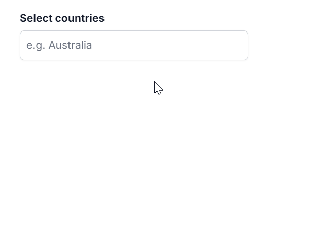

# Resizing in ##Platform_Name## MultiSelect Dropdown

You can dynamically adjust the size of the popup in the MultiSelect component by using the [`allowResize`](https://ej2.syncfusion.com/javascript/documentation/api/multi-select#allowresize) property. When enabled, users can resize the popup, and the resized dimensions are retained across sessions for a consistent user experience.



 

























