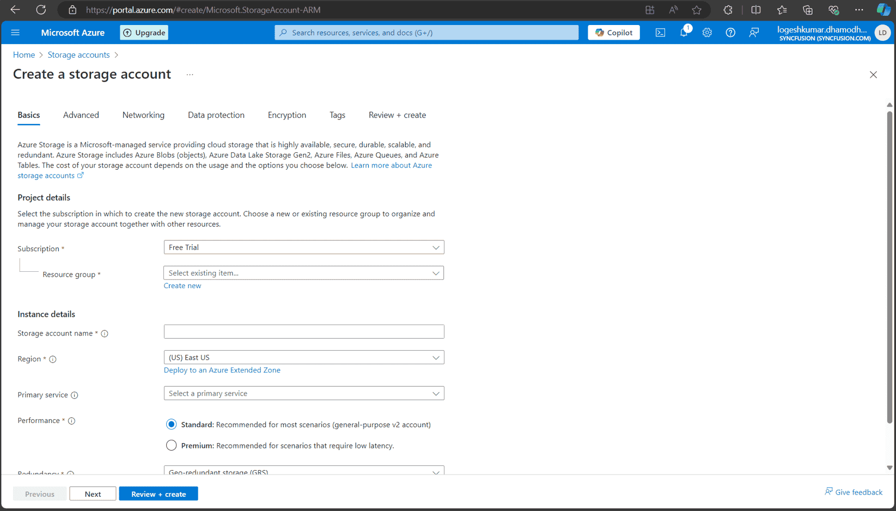

# Save PDF To Azure Active Directory in Viewer

### **Overview**

The Syncfusion<sup style="font-size:70%">&reg;</sup> PDF Viewer allows you to load and save PDF files directly from Azure Active Directory (AAD). Below are the steps to securely load and store PDF documents from and to AAD using the PDF Viewer.

### **Steps to Open the PDF File from Azure Active Directory**

---

### **Step 1: Register an Application in Azure Active Directory (AAD)**

1. **Go to the Azure Portal**:
   - Navigate to [Azure Portal](https://portal.azure.com).
  
2. **Register your Application**:
   - In the Azure portal, go to **Azure Active Directory** > **App registrations** > **New registration**.
   - Register your application and note down the **Application (client) ID** and **Directory (tenant) ID**.

   

3. **Create a Client Secret**:
   - In the registered application, go to **Certificates & secrets**.
   - Click **New client secret**.
   - Provide a description and set an expiration period.
   - Click **Add**.
   - Copy the client secret value immediately, as it will be hidden later. Store it securely.

   

---

### **Step 2: Create the Azure Storage Account**

1. **Create a Storage Account**:
   - In the Azure portal, use the search bar to search for **Storage accounts**.
   - Create a new storage account by filling in the required details (e.g., name, location, resource group, etc.).

    

---

### **Step 3: Assign Role to the Application**

1. **Go to your Storage Account**:
   - Navigate to **Access control (IAM)** > **Add role assignment** in your Azure Storage Account.

2. **Assign Role**:
   - Assign the **Storage Blob Data Contributor** role to your registered application.
   - In the **Assign access to** dropdown, select **User, group, or service principal**.
   - Click on **Select members** and search for your registered application by name or client ID.
   - Select your application and click **Select**.
   - Click **Review + assign** to finalize the role assignment.

    
---

### **Step 4: Upload the PDF Document to the Azure Storage Account**

1. **Navigate to Data Storage**:
   - In the Azure portal, go to **Data storage** > **Containers**.

2. **Upload the PDF File**:
   - Create a new container and upload the PDF document you want to access in the PDF Viewer.

    
---

### **Step 5: Server-Side Configuration**

1. **Configure Server-Side Code**:
   - Open the server-side application (e.g., ASP.NET Core) and configure the following details in the `PdfViewerController` file:
     - `tenantId` (your Azure AD tenant ID),
     - `clientId` (your registered application client ID),
     - `clientSecret` (your registered application client secret),
     - `blobServiceEndpoint` (your storage account blob service URL),
     - `containerName` (your container name in Azure Blob Storage).

2. **Run the Web Service**:
   - After configuring the necessary details, run the web service to make it accessible.

---

### **Step 6: Client-Side Configuration**

1. **Run the JS Sample**:
   - Start the JS sample that includes the Syncfusion<sup style="font-size:70%">&reg;</sup> PDF Viewer.

2. **Load PDF from AAD**:
   - When the user clicks the **Load from AAD** button, the JS client will make an HTTP request to the server-side API to fetch the PDF from Azure Blob Storage.
   - The server will retrieve the PDF from Azure, convert it to a base64 string, and return it to the client.

3. **Display PDF in the PDF Viewer**:
   - Once the base64 string is received, the PDF Viewer will load the PDF using the `viewer.load()` method.

---

### **Step 7: Save the PDF Document to Azure**

1. **Save PDF to AAD**:
   - The user can click the **Save to AAD** button to upload any modifications to the PDF back to Azure Blob Storage.
   - This action sends the modified PDF to the server, where it is converted into a byte array and saved to the specified Azure Blob container.

---

### **Server-Side Code Snippets**
```cs
string tenantId = "Provide the tenant id here";
string clientId = "Provide the clientid here";
string clientSecret = "Provide the client secret here";
string blobServiceEndpoint = "https://your-storage-account.blob.core.windows.net";
string containerName = "Provide the container name here";

 
 
[HttpPost("LoadFromAAD")]
[Route("[controller]/LoadFromAAD")]
public async Task<IActionResult> LoadFromAAD(string fileName)
{
    var clientSecretCredential = new ClientSecretCredential(tenantId, clientId, clientSecret);
    var blobServiceClient = new BlobServiceClient(new Uri(blobServiceEndpoint), clientSecretCredential);
    var containerClient = blobServiceClient.GetBlobContainerClient(containerName);
    var blobClient = containerClient.GetBlobClient(fileName);

    // Download the PDF file to a local stream
    using MemoryStream pdfStream = new MemoryStream();
    await blobClient.DownloadToAsync(pdfStream);
    var base64 = Convert.ToBase64String(pdfStream.ToArray());
    return Content("data:application/pdf;base64," + base64);
} 
 
[AcceptVerbs("SaveToAAD")]
[HttpPost("SaveToAAD")]
[Route("[controller]/SaveToAAD")]
public async Task<IActionResult> SaveToAAD([FromBody] Dictionary<string, string> jsonObject)
{
    PdfRenderer pdfviewer = new PdfRenderer(_cache);
    var fileName = jsonObject.ContainsKey("documentId") ? jsonObject["documentId"] : "Test.pdf";
    string documentBase = pdfviewer.GetDocumentAsBase64(jsonObject);
    string convertedBase = documentBase.Substring(documentBase.LastIndexOf(',') + 1);
    // Decode the Base64 string to a byte array
    byte[] byteArray = Convert.FromBase64String(convertedBase);
    // Create a MemoryStream from the byte array
    MemoryStream stream = new MemoryStream(byteArray);
    // Create a new BlobServiceClient using the DefaultAzureCredential
    var clientSecretCredential = new ClientSecretCredential(tenantId, clientId, clientSecret);
    var blobServiceClient = new BlobServiceClient(new Uri(blobServiceEndpoint), clientSecretCredential);
    // Get a reference to the container
    var containerClient = blobServiceClient.GetBlobContainerClient(containerName);
    // Get a reference to the blob
    var blobClient = containerClient.GetBlobClient(fileName);
    //FileStream uploadFileStream = new FileStream();
    await blobClient.UploadAsync(stream, true);
    stream.Close();
    return Content(string.Empty);
}

```


### **Client-side Code Snippets**

```js
import { PdfViewer, Toolbar, TextSelection, TextSearch, Print, Navigation, Magnification, Annotation, FormDesigner, FormFields, CustomToolbarItemModel } from '@syncfusion/ej2-pdfviewer';
import { ComboBox } from "@syncfusion/ej2-dropdowns";

// Inject required modules for PDF Viewer functionality
PdfViewer.Inject(
    TextSelection,
    TextSearch,
    Print,
    Navigation,
    Toolbar,
    Magnification,
    Annotation,
    FormDesigner,
    FormFields
);

// Define custom toolbar items
let toolItem1: CustomToolbarItemModel = {
    id: 'loadFromAAD',
    text: 'Load From AAD',
    tooltipText: 'Custom toolbar item',
    align: 'left'
};

let toolItem2: CustomToolbarItemModel = {
    id: 'saveToAAD',
    text: 'Save To AAD',
    tooltipText: 'Custom toolbar item',
    align: 'left'
};

// Initialize the PDF Viewer with custom toolbar items
let pdfviewer: PdfViewer = new PdfViewer({
    serviceUrl: 'https://localhost:44308/pdfviewer', //provide the service url here
    toolbarSettings: {
        toolbarItems: [
            toolItem1,
            toolItem2,
            'OpenOption',
            'PageNavigationTool',
            'MagnificationTool',
            'PanTool',
            'SelectionTool',
            'SearchOption',
            'PrintOption',
            'DownloadOption',
            'UndoRedoTool',
            'AnnotationEditTool',
            'FormDesignerEditTool',
            'CommentTool',
            'SubmitForm',
        ]
    }
});

// Render the PDF Viewer in the DOM
pdfviewer.appendTo('#PdfViewer');

// Handle toolbar clicks
pdfviewer.toolbarClick = (args: { item?: { id: string } }) => {
    if (args.item) {
        if (args.item.id === 'loadFromAAD') {
            // Handle 'Load From AAD' logic
            const xhr = new XMLHttpRequest();
            //modify the url based on the file name
            xhr.open('POST', `https://localhost:44308/pdfviewer/LoadFromAAD?fileName=pdf-succinctly.pdf`, true);
            xhr.onreadystatechange = () => {
                if (xhr.readyState === 4 && xhr.status === 200) {
                    const data = xhr.responseText;
                    console.log(data); // Handle the response
                    pdfviewer.load(data,''); // Load the document
                }
            };
            xhr.send();
        } else if (args.item.id === 'saveToAAD') {
            // Handle 'Save To AAD' logic
            pdfviewer.serverActionSettings.download = "SaveToAAD";
            pdfviewer.download(); // Trigger download
        }
    }
};

```

[View sample in GitHub](https://github.com/SyncfusionExamples/open-save-pdf-documents-in-aad).