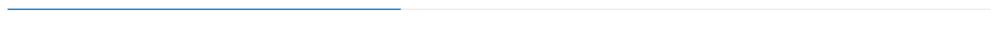

# Getting Started with Syncfusion® JavaScript (ES5) ProgressBar Control

Build your first Syncfusion JavaScript (ES5) application with a simple ProgressBar in just a few minutes. This quickstart guides you through creating a minimal, runnable HTML page that loads the Syncfusion EJ2 (ES5) ProgressBar control from the CDN, initializes it with a value, and renders an interactive progress indicator.

## Prerequisites

* [Visual Studio Code](https://code.visualstudio.com) (or any text editor)
* A web browser to view the result
* A local web server such as the VS Code [Live Server](https://marketplace.visualstudio.com/items?itemName=ritwickdey.LiveServer) extension

## Dependencies

The ProgressBar control ships as part of the `@syncfusion/ej2-progressbar` package. Below is the list of minimum dependencies required.

```
|-- @syncfusion/ej2-progressbar
    |-- @syncfusion/ej2-base
    |-- @syncfusion/ej2-data
    |-- @syncfusion/ej2-svg-base
```

## Quick Setup

### Step 1: Create Folder and HTML file

* Create a folder named `quickstart` in your desired directory.
* Inside the `quickstart` folder, create two new files: `index.html` and `index.js`.

### Step 2: Add Syncfusion<sup style="font-size:70%">&reg;</sup> CDN Resources

Include the following JavaScript links in the `<head>` section.

**Scripts (JavaScript):**

```html
<script src="https://cdn.syncfusion.com/ej2/33.2.3/ej2-base/dist/global/ej2-base.min.js" type="text/javascript"></script>
<script src="https://cdn.syncfusion.com/ej2/33.2.3/ej2-data/dist/global/ej2-data.min.js" type="text/javascript"></script>
<script src="https://cdn.syncfusion.com/ej2/33.2.3/ej2-svg-base/dist/global/ej2-svg-base.min.js" type="text/javascript"></script>
<script src="https://cdn.syncfusion.com/ej2/33.2.3/ej2-progressbar/dist/global/ej2-progressbar.min.js" type="text/javascript"></script>
```

**Or**, to load all Syncfusion components in a single combined bundle:

```html
<script src="https://cdn.syncfusion.com/ej2/33.2.3/dist/ej2.min.js" type="text/javascript"></script>
```

### Step 3: Add the Syncfusion<sup style="font-size:70%">&reg;</sup> ProgressBar Control to the Application

The `index.html` file references a separate `index.js` file that contains the ProgressBar component initialization. This keeps your markup and script logic cleanly separated, which is the recommended pattern for Syncfusion<sup style="font-size:70%">&reg;</sup> JavaScript (ES5) apps.

`index.js` imports nothing manually — the global scripts added in Step 2 register the `ej.progressbar.ProgressBar` class on the `ej` namespace. The script then builds the ProgressBar component with a numeric `value` and renders the control into the `#element` container declared in `index.html`.




  var percentageProgress = new ej.progressbar.ProgressBar({
      value: 40
  });
  percentageProgress.appendTo('#element');




<!DOCTYPE html>
<html lang="en">
<head>
    <title>Essential JS 2 ProgressBar</title>
    <meta charset="utf-8" />
    <meta name="viewport" content="width=device-width, initial-scale=1.0, user-scalable=no" />
    <script src="https://cdn.syncfusion.com/ej2/33.2.3/dist/ej2.min.js" type="text/javascript"></script>
</head>
<body>
    <!-- Add the HTML <div> element for ProgressBar -->
    <div id="element"></div>
    <script src="index.js" type="text/javascript"></script>
</body>
</html>




The `new ej.progressbar.ProgressBar({...})` call creates the ProgressBar component. The configuration object accepts the following key options:

- [`value`](https://ej2.syncfusion.com/javascript/documentation/api/progressbar/index-default#value) — Numeric progress value (default `null`). The value is interpreted as a percentage between `0` and `100` for both the linear and circular ProgressBar variants.
- [`type`](https://ej2.syncfusion.com/javascript/documentation/api/progressbar/index-default#type) — ProgressBar variant to render. Use `'Linear'` (default) for a horizontal bar or `'Circular'` for a radial indicator.
- [`minimum`](https://ej2.syncfusion.com/javascript/documentation/api/progressbar/index-default#minimum) / [`maximum`](https://ej2.syncfusion.com/javascript/documentation/api/progressbar/index-default#maximum) — Minimum and maximum range of the progress value. Defaults are `0` and `100`.
- [`height`](https://ej2.syncfusion.com/javascript/documentation/api/progressbar/index-default#height) / [`width`](https://ej2.syncfusion.com/javascript/documentation/api/progressbar/index-default#width) — Control height and width in pixels (or CSS units). For a circular ProgressBar, set `width` to render the SVG canvas size.
- [`showProgressValue`](https://ej2.syncfusion.com/javascript/documentation/api/progressbar/index-default#showprogressvalue) — When `true`, displays the numeric value on the bar. Defaults to `true`.
- [`animation`](https://ej2.syncfusion.com/javascript/documentation/api/progressbar/index-default#animation) — Object that controls the load animation (`enable`, `duration`, `delay`).

Finally, `percentageProgress.appendTo('#element')` renders the control into the `<div id="element">` element declared in `index.html`.

### Step 4: Open in Browser

Open `quickstart/index.html` through a local web server. With the VS Code **Live Server** extension installed, right-click `index.html` in the Explorer and choose **Open with Live Server**, then visit the URL it prints (for example, `http://127.0.0.1:5500/`). You should see the Syncfusion ProgressBar control rendered with the value `40`.

## Output

The following screenshot shows the output of the Syncfusion ProgressBar quick start application:



## Troubleshooting

- **`ej is not defined`.** Confirm that `ej2.min.js` (or `ej2-progressbar.min.js` plus its dependencies) is loaded before your script. Place the `<script>` tag inside the `<head>` or just before your own `<script src="index.js">` tag.
- **The container is empty.** Make sure the `id` in your markup (`#element`) matches the selector passed to `appendTo('#element')`.
- **The value exceeds the visible range.** `value` is clamped to the configured `min`/`max` (default `0`–`100`). If the bar appears at 100% unexpectedly, lower the value or raise the `max`.