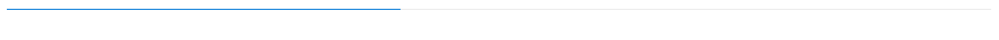

# Getting started with ##Platform_Name## ProgressBar control

This document explains how to create a simple ProgressBar and configure its features in TypeScript using the Essential JS 2 webpack [quickstart](https://github.com/SyncfusionExamples/ej2-quickstart-webpack) seed repository.

> This application is integrated with the `webpack.config.js` configuration and uses the latest version of the [webpack-cli](https://webpack.js.org/api/cli/#commands). It requires node `v14.15.0` or higher. For more information about webpack and its features, refer to the [webpack getting-started guide](https://webpack.js.org/guides/getting-started/).

## Prerequisites

Before you begin, ensure you have the following installed on your machine:

* Node.js (v14.15.0 or higher)
* [Visual Studio Code](https://code.visualstudio.com) (or any text editor)
* [Git](https://git-scm.com/) for cloning the quickstart repository
* A modern web browser (Chrome, Edge, Firefox, or Safari) to view the result

## Dependencies

Below is the list of minimum dependencies required to use the ProgressBar control, which ships as part of the `@syncfusion/ej2-progressbar` package.

```
|-- @syncfusion/ej2-progressbar
    |-- @syncfusion/ej2-base
    |-- @syncfusion/ej2-data
    |-- @syncfusion/ej2-svg-base
```

## Quick Setup

### Step 1: Create a Project Folder

Create a folder named `my-progressbar` in your desired location. This folder will contain your Syncfusion ProgressBar TypeScript project.

### Step 2: Open Command Prompt

Open the command prompt and navigate to the `my-progressbar` folder created in Step 1. You can do this by:

* **Windows**: Open Command Prompt or PowerShell and navigate to the `my-progressbar` folder.
* **macOS/Linux**: Open Terminal and navigate to the `my-progressbar` folder.

### Step 3: Clone the Quickstart Repository

Run the following command to clone the Syncfusion JavaScript (Essential JS 2) quickstart project from `GitHub`.




git clone https://github.com/SyncfusionExamples/ej2-quickstart-webpack ej2-quickstart




### Step 4: Navigate to Project Folder

After cloning the application in the `ej2-quickstart` folder, run the following command to navigate to the project directory.




cd ej2-quickstart




### Step 5: Install Required Packages

Syncfusion JavaScript (Essential JS 2) packages are available on the [npmjs.com](https://www.npmjs.com/~syncfusionorg) public registry. You can install all Syncfusion JavaScript (Essential JS 2) controls in a single [@syncfusion/ej2](https://www.npmjs.com/package/@syncfusion/ej2) package or individual packages for each control.

The quickstart application is already preconfigured with the dependent [@syncfusion/ej2](https://www.npmjs.com/package/@syncfusion/ej2) package in the `~/package.json` file. Use the following command to install all the dependent npm packages from the command prompt:




npm install




### Step 6: Update the HTML Template

Open the `ej2-quickstart` folder in Visual Studio Code (or any text editor). Locate the `~/src/index.html` file, preserve any existing `<link>` and `<script>` tags that were generated by the seed, and add an HTML `div` tag with its `id` attribute set to `element` inside the `<body>` so the ProgressBar has a container to render into:




<!DOCTYPE html>
<html lang="en">

<head>
    <title>Essential JS 2 ProgressBar</title>
    <meta charset="utf-8" />
    <meta name="viewport" content="width=device-width, initial-scale=1.0, user-scalable=no" />
    <meta name="description" content="TypeScript UI Controls" />
    <meta name="author" content="Syncfusion" />
    <!-- existing head content from the seed template remains here -->
</head>

<body>
    <!--container which is going to render the ProgressBar-->
    <div id="element"></div>
</body>

</html>




### Step 7: Initialize the ProgressBar Component

Locate the `src/app/app.ts` file in your project and add the ProgressBar component. The `import { ProgressBar } from '@syncfusion/ej2-progressbar'` line pulls the `ProgressBar` class from the package's TypeScript declaration. The `new ProgressBar({...})` call accepts a configuration object — the most common options are:

- [`value`](https://ej2.syncfusion.com/documentation/api/progressbar/index-default#value) — Numeric progress value (default `null`). Interpreted as a percentage between `0` and `100` for both the linear and circular ProgressBar variants.
- [`type`](https://ej2.syncfusion.com/documentation/api/progressbar/index-default#type) — ProgressBar variant. Use `'Linear'` (default) for a horizontal bar or `'Circular'` for a radial indicator.
- [`minimum`](https://ej2.syncfusion.com/documentation/api/progressbar/index-default#minimum) / [`maximum`](https://ej2.syncfusion.com/documentation/api/progressbar/index-default#maximum) — Minimum and maximum range of the progress value. Defaults are `0` and `100`.
- [`height`](https://ej2.syncfusion.com/documentation/api/progressbar/index-default#height) / [`width`](https://ej2.syncfusion.com/documentation/api/progressbar/index-default#width) — Control height and width in pixels (or CSS units). For a circular ProgressBar, set `width` to render the SVG canvas size.
- [`showProgressValue`](https://ej2.syncfusion.com/documentation/api/progressbar/index-default#showprogressvalue) — When `true`, displays the numeric value on the bar. Defaults to `true`.
- [`animation`](https://ej2.syncfusion.com/documentation/api/progressbar/index-default#animation) — Object that controls the load animation (`enable`, `duration`, `delay`).

Finally, `progressBar.appendTo('#element')` renders the component into the `<div id="element">` element declared in `index.html`.




import { ProgressBar } from '@syncfusion/ej2-progressbar';

// Initialize ProgressBar component
let progressBar: ProgressBar = new ProgressBar({
    value: 40
});

// Render initialized ProgressBar
progressBar.appendTo('#element');




> The seed project is already preconfigured to compile and bundle the TypeScript files (`src/index.ts` → `src/app/app.ts`) via the `webpack.config.js` shipped with the repository, so no additional TypeScript wiring is required.

### Step 8: Run the Application

Open the integrated terminal in Visual Studio Code or use your command prompt to run the application. Use the `npm run start` command:




npm run start




The application will compile and automatically start in your default web browser. The application typically runs at `http://localhost:4000`. You should see the Syncfusion<sup style="font-size:70%">&reg;</sup> ProgressBar control displayed on the page. To stop the dev server, press `Ctrl+C` in the terminal.

### Step 10: View Your ProgressBar

Wait for the webpack dev server to complete the build process. Once completed, the ProgressBar control will render in your browser with the value `40`. The bar is now successfully initialized and ready for further customization.

## Output

The following screenshot shows the output of the Syncfusion ProgressBar quick start application.



## Troubleshooting

* **Blank page, no ProgressBar** — The npm package failed to load. Verify the network tab and that `npm install` finished successfully.
* **`Cannot find module '@syncfusion/ej2-progressbar'`** — Dependencies were not installed. Re-run `npm install`.
* **`ProgressBar is undefined`** — The import line is missing or the package version is mismatched. Confirm `import { ProgressBar } from '@syncfusion/ej2-progressbar';` is at the top of `app.ts`.
* **Bar renders without data** — The selector passed to `appendTo` does not match the element id. Make sure the `id` in `index.html` (`#element`) matches the selector passed to `appendTo('#element')`.