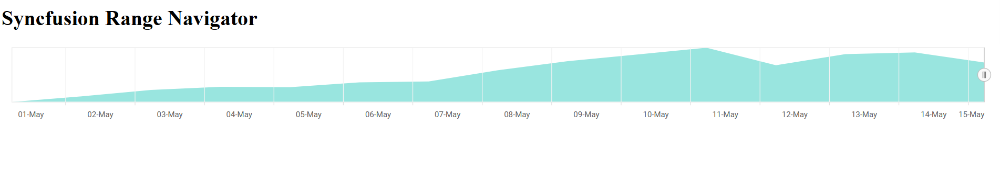

# Getting Started with Syncfusion® JavaScript (ES5) Range Navigator Control

Build your first Syncfusion JavaScript (ES5) application with a simple Range Navigator in just a few minutes. This quickstart guides you through creating a minimal, runnable HTML page that loads the Syncfusion EJ2 (ES5) Range Navigator from the CDN, initializes it with sample data, and renders an interactive navigator.

## Prerequisites

* [Visual Studio Code](https://code.visualstudio.com) (or any text editor)
* A web browser to view the result
* A local web server such as the VS Code [Live Server](https://marketplace.visualstudio.com/items?itemName=ritwickdey.LiveServer) extension

## Dependencies

The Range Navigator control ships as part of the `@syncfusion/ej2-charts` package. The minimum dependency tree is:

```
    |-- @syncfusion/ej2-charts
    |-- @syncfusion/ej2-base
    |-- @syncfusion/ej2-data
    |-- @syncfusion/ej2-pdf-export
    |-- @syncfusion/ej2-file-utils
    |-- @syncfusion/ej2-compression
    |-- @syncfusion/ej2-navigations
    |-- @syncfusion/ej2-calendars
```

## Quick Setup

### Step 1: Create Folder and HTML file

* Create a folder named `quickstart` in your desired directory.
* Inside the `quickstart` folder, create three new files: `index.html`, `index.js`, and `es5-datasource.js`.

### Step 2: Add Syncfusion<sup style="font-size:70%">&reg;</sup> CDN Resources

Include the following JavaScript links in the `<head>` section.

**Scripts (JavaScript):**
```html
<script src="https://cdn.syncfusion.com/ej2/33.2.3/ej2-base/dist/global/ej2-base.min.js" type="text/javascript"></script>
<script src="https://cdn.syncfusion.com/ej2/33.2.3/ej2-data/dist/global/ej2-data.min.js" type="text/javascript"></script>
<script src="https://cdn.syncfusion.com/ej2/33.2.3/ej2-svg-base/dist/global/ej2-svg-base.min.js" type="text/javascript"></script>
<script src="https://cdn.syncfusion.com/ej2/33.2.3/ej2-charts/dist/global/ej2-charts.min.js" type="text/javascript"></script>
```

**Or**, to load all Syncfusion components in a single combined bundle:

```html
<script src="https://cdn.syncfusion.com/ej2/33.2.3/dist/ej2.min.js" type="text/javascript"></script>
```

### Step 3: Add the Syncfusion<sup style="font-size:70%">&reg;</sup> Range Navigator Control to the Application

The `index.html` file loads `es5-datasource.js` and `index.js`. The `es5-datasource.js` file contains the sample data, while `index.js` initializes the Range Navigator.

The Syncfusion scripts provide the `ej.charts.RangeNavigator` class. The Range Navigator uses the global datasrc array, displays the data as an Area series on a DateTime axis, and renders inside the `#element` container.

Key options used in the configuration object:

- [`valueType`](https://ej2.syncfusion.com/javascript/documentation/api/range-navigator/index-default#valuetype) — Axis data type. Set to `'DateTime'` because the sample data uses date strings.
- [`labelFormat`](https://ej2.syncfusion.com/javascript/documentation/api/range-navigator/index-default#valuetype) — Format string applied to the axis labels (for example, `'dd-MMM'`).
- [`series`](https://ej2.syncfusion.com/javascript/documentation/api/range-navigator/index-default#series) — Array of series to render. Each series has a [`dataSource`](https://ej2.syncfusion.com/javascript/documentation/api/range-navigator/rangenavigatorseriesmodel#datasource), [`xName`](https://ej2.syncfusion.com/javascript/documentation/api/range-navigator/rangenavigatorseriesmodel#xname), [`yName`](https://ej2.syncfusion.com/javascript/documentation/api/range-navigator/rangenavigatorseriesmodel#yname), and [`type`](https://ej2.syncfusion.com/javascript/documentation/api/range-navigator/rangenavigatorseriesmodel#type) (e.g. `'Area'`).

Finally, `range.appendTo('#element')` renders the control into the `<div id="element">` element declared in `index.html`.

Copy the snippets below into the matching files in your `quickstart` folder.












        
> Note: Get data from [here](https://ej2.syncfusion.com/demos/src/range-navigator/data-source/default-data.json).

The sample should look like the [default](https://ej2.syncfusion.com/javascript/demos/#/material/range-navigator/default.html). Don’t worry about the gradient color; let it take the default color.

### Step 4: Open in Browser

Open `quickstart/index.html` through a local web server. With the VS Code **Live Server** extension installed, right-click `index.html` in the Explorer and choose **Open with Live Server**, then visit the URL it prints (for example, `http://127.0.0.1:5500/`). You should see the Syncfusion Range Navigator control displaying the sample data.

## Output

The Range Navigator shows 15 days of data. Drag the thumbs to select a date range.





## Troubleshooting

- **`ej is not defined`.** Confirm that `ej2-charts.min.js` is loaded before your script. Place the `<script>` tag inside the `<head>` or just before your own `<script src="index.js">` tag.
- **`datasrc is not defined`.** Make sure `es5-datasource.js` is loaded before `index.js` and that it assigns the data to `window.datasrc` (or `datasrc` at the top level).
- **The container is empty.** Make sure the `id` in your markup (`#element`) matches the selector passed to `appendTo('#element')`.
- **The selector doesn't move.** Verify that `valueType: 'DateTime'` is set and that every `x` value in your data is a valid `Date` or a date string parseable by `new Date(...)`.
