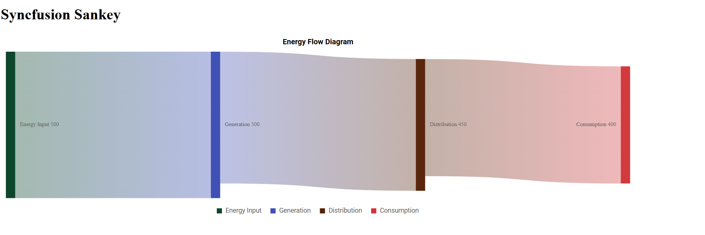

# Getting Started with Syncfusion® JavaScript (ES5) Sankey Control

Build your first Syncfusion JavaScript (ES5) application with a simple Sankey diagram in just a few minutes. This quickstart guides you through creating a minimal, runnable HTML page that loads the Syncfusion EJ2 (ES5) Sankey control from the CDN, initializes it with sample data, and renders an interactive diagram.

## Prerequisites

* [Visual Studio Code](https://code.visualstudio.com) (or any text editor)
* A web browser to view the result
* A local web server such as the VS Code [Live Server](https://marketplace.visualstudio.com/items?itemName=ritwickdey.LiveServer) extension

## Dependencies

The Sankey control ships as part of the `@syncfusion/ej2-charts` package. Below is the list of minimum dependencies required.

```
|-- @syncfusion/ej2-charts
    |-- @syncfusion/ej2-base
    |-- @syncfusion/ej2-data
    |-- @syncfusion/ej2-pdf-export
    |-- @syncfusion/ej2-file-utils
    |-- @syncfusion/ej2-compression
    |-- @syncfusion/ej2-svg-base
```

Note: `@syncfusion/ej2-pdf-export`, `@syncfusion/ej2-file-utils`, and `@syncfusion/ej2-compression` are optional—required only for PDF export features.

## Quick Setup

### Step 1: Create Folder and HTML file

* Create a folder named `quickstart` in your desired directory.
* Inside the `quickstart` folder, create two new files: `index.html` and `index.js`.

### Step 2: Add Syncfusion<sup style="font-size:70%">&reg;</sup> CDN Resources

Include the following JavaScript links in the `<head>` section.

**Scripts (JavaScript):**
```html
<script src="https://cdn.syncfusion.com/ej2/33.2.3/ej2-base/dist/global/ej2-base.min.js" type="text/javascript"></script>
<script src="https://cdn.syncfusion.com/ej2/33.2.3/ej2-data/dist/global/ej2-data.min.js" type="text/javascript"></script>
<script src="https://cdn.syncfusion.com/ej2/33.2.3/ej2-svg-base/dist/global/ej2-svg-base.min.js" type="text/javascript"></script>
<script src="https://cdn.syncfusion.com/ej2/33.2.3/ej2-charts/dist/global/ej2-charts.min.js" type="text/javascript"></script>
```

**Or**, to load all Syncfusion components in a single combined bundle:

```html
<script src="https://cdn.syncfusion.com/ej2/33.2.3/dist/ej2.min.js" type="text/javascript"></script>
```

### Step 3: Add the Syncfusion<sup style="font-size:70%">&reg;</sup> Sankey Control to the Application

The `index.html` file references a separate `index.js` file that contains the Sankey component initialization. This keeps your markup and script logic cleanly separated, which is the recommended pattern for Syncfusion<sup style="font-size:70%">&reg;</sup> JavaScript (ES5) apps.

`index.js` imports nothing manually — the global scripts added in Step 2 register the `ej.charts.Sankey` class on the `ej` namespace. The script then builds the Sankey component with sample node/link data and renders the control into the `#element` container declared in `index.html`.










The `new ej.charts.Sankey({...})` call creates the Sankey component. The configuration object accepts the following key options:

- [`nodes`](https://ej2.syncfusion.com/javascript/documentation/api/sankey/index-default#nodes) — Array of node objects. Each node needs a unique `id`; the optional `label.text` property controls the displayed label.
- [`links`](https://ej2.syncfusion.com/javascript/documentation/api/sankey/index-default#links) — Array of link objects. Each link needs a [`sourceId`](https://ej2.syncfusion.com/javascript/documentation/api/sankey/sankeylinkmodel#sourceid) and [`targetId`](https://ej2.syncfusion.com/javascript/documentation/api/sankey/sankeylinkmodel#sourceid) matching a node `id`, plus a numeric [`value`](https://ej2.syncfusion.com/javascript/documentation/api/sankey/sankeylinkmodel#value) that controls the link thickness.
- [`title`](https://ej2.syncfusion.com/javascript/documentation/api/sankey/index-default#title) — Text shown above the diagram.

Finally, `sankey.appendTo('#element')` renders the control into the `<div id="element">` element declared in `index.html`.

### Step 4: Open in Browser

Open `quickstart/index.html` through a local web server. With the VS Code **Live Server** extension installed, right-click `index.html` in the Explorer and choose **Open with Live Server**, then visit the URL it prints (for example, `http://127.0.0.1:5500/`). You should see the Syncfusion Sankey control displaying the energy-flow sample data.

## Output

The following screenshot shows the output of the Syncfusion Sankey quick start application:



## Troubleshooting

- **The page is blank.** Open the page through a local web server (for example, the VS Code **Live Server** extension) instead of double-clicking the file. Syncfusion charts require an `http://` or `https://` origin.
- **`ej is not defined`.** Confirm that `ej2-charts.min.js` is loaded before your script. Place the `<script>` tag inside the `<head>` or just before your own `<script src="index.js">` tag.
- **The container is empty.** Make sure the `id` in your markup (`#element`) matches the selector passed to `appendTo('#element')`.
- **Links render in the wrong direction.** Verify that every `sourceId` and `targetId` matches an existing `node.id`; unmatched ids are silently dropped.


