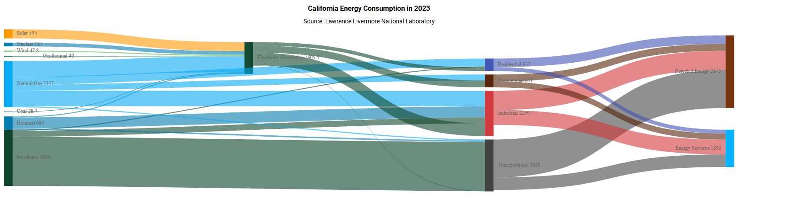

# Getting started with ##Platform_Name## Sankey control

This document explains how to create a simple Sankey diagram and configure its features in TypeScript using the Essential JS 2 webpack [quickstart](https://github.com/SyncfusionExamples/ej2-quickstart-webpack) seed repository.

> This application is integrated with the `webpack.config.js` configuration and uses the latest version of the [webpack-cli](https://webpack.js.org/api/cli/#commands). It requires node `v14.15.0` or higher. For more information about webpack and its features, refer to the [webpack getting-started guide](https://webpack.js.org/guides/getting-started/).

## Prerequisites

Before you begin, ensure you have the following installed on your machine:

* [Node.js](https://nodejs.org/) (v14.15.0 or higher)
* [Visual Studio Code](https://code.visualstudio.com) (or any text editor)
* [Git](https://git-scm.com/) for cloning the quickstart repository
* A modern web browser (Chrome, Edge, Firefox, or Safari) to view the result

## Dependencies

Below is the list of minimum dependencies required to use the Sankey control, which is part of the charts package.

```
|-- @syncfusion/ej2-charts
    |-- @syncfusion/ej2-base
    |-- @syncfusion/ej2-data
    |-- @syncfusion/ej2-pdf-export
    |-- @syncfusion/ej2-file-utils
    |-- @syncfusion/ej2-compression
    |-- @syncfusion/ej2-svg-base
```

Note: `@syncfusion/ej2-pdf-export`, `@syncfusion/ej2-file-utils`, and `@syncfusion/ej2-compression` are optional—required only for PDF export features.

## Quick Setup

### Step 1: Create a Project Folder

Create a folder named `my-sankey` in your desired location. This folder will contain your Syncfusion Sankey TypeScript project.

### Step 2: Open Command Prompt

Open the command prompt and navigate to `my-sankey` folder created in Step 1. You can do this by:

* **For Windows**: Open Command Prompt (cmd) or PowerShell and use the `cd` command to navigate to `my-sankey` folder.
* **For macOS/Linux**: Open Terminal and use the `cd` command to navigate to `my-sankey` folder.

### Step 3: Clone the Quickstart Repository

Run the following command to clone the Syncfusion JavaScript (Essential JS 2) quickstart project from [GitHub](https://github.com/SyncfusionExamples/ej2-quickstart-webpack).




git clone https://github.com/SyncfusionExamples/ej2-quickstart-webpack ej2-quickstart




### Step 4: Navigate to Project Folder

After cloning the application in the `ej2-quickstart` folder, run the following command to navigate to the project directory.




cd ej2-quickstart




### Step 5: Install Required Packages

Syncfusion JavaScript (Essential JS 2) packages are available on the [npmjs.com](https://www.npmjs.com/~syncfusionorg) public registry. You can install all Syncfusion JavaScript (Essential JS 2) controls in a single [@syncfusion/ej2](https://www.npmjs.com/package/@syncfusion/ej2) package or individual packages for each control.

The quickstart application is already preconfigured with the dependent [@syncfusion/ej2](https://www.npmjs.com/package/@syncfusion/ej2) package in the `~/package.json` file. Use the following command to install all the dependent npm packages from the command prompt:




npm install




### Step 6: Update the HTML Template

Open the `ej2-quickstart` folder in Visual Studio Code or any text editor of your choice.

Locate the `~/src/index.html` file in the project, preserve any existing `<link>` and `<script>` tags that were generated by the seed, and add the HTML `div` tag with its `id` attribute as `element` inside `<body>` to initialize the Sankey container.




<!DOCTYPE html>
<html lang="en">

<head>
    <title>Essential JS 2 Sankey</title>
    <meta charset="utf-8" />
    <meta name="viewport" content="width=device-width, initial-scale=1.0" />
    <meta name="description" content="TypeScript UI Controls" />
    <meta name="author" content="Syncfusion" />
    <!-- existing head content from the seed template remains here -->
</head>

<body>
    <h1>Syncfusion Sankey</h1>
    <!--container which is going to render the Sankey-->
    <div id='sankey-container'>
    </div>
</body>

</html>




### Step 7: Create the Sankey Component with Data

Locate the `src/app/app.ts` file in your project and add the Sankey component with module injection and sample data.

**Module Injection**: The Sankey component requires specific feature modules to be injected. For displaying nodes, links, tooltips, legend, and the export option, inject the `SankeyTooltip`, `SankeyLegend`, and `SankeyExport` modules.

**Populate Sankey with Data**: Create a [``nodes`](https://ej2.syncfusion.com/documentation/api/sankey/index-default#nodes) array (each node has a unique `id` and an optional `label`) and a [`links`](https://ej2.syncfusion.com/documentation/api/sankey/index-default#links) array (each link references a [`sourceId`](https://ej2.syncfusion.com/documentation/api/sankey/sankeylinkmodel#sourceid) and [`targetId`](https://ej2.syncfusion.com/documentation/api/sankey/sankeylinkmodel#targetid) plus a numeric [`value`](https://ej2.syncfusion.com/documentation/api/sankey/sankeylinkmodel#value) that controls the link thickness). Pass both arrays to the `Sankey` component's [`nodes`](https://ej2.syncfusion.com/documentation/api/sankey/index-default#nodes) and [`links`](https://ej2.syncfusion.com/documentation/api/sankey/index-default#links) properties.







### Step 8: Run the Application

Open the integrated terminal in Visual Studio Code or use your command prompt to run the application. Use the `npm run start` command:




npm run start




The application will compile and automatically start in your default web browser. The application typically runs at `http://localhost:4000`. You should see the Syncfusion<sup style="font-size:70%">&reg;</sup> Sankey control displayed on the page. To stop the dev server, press `Ctrl+C` in the terminal.

### Step 9: View Your Sankey

Wait for the webpack dev server to complete the build process. Once completed, you will see the Sankey control rendering in your browser with the energy-flow sample data. The diagram is now successfully initialized and ready for further customization.

## Output

The following screenshot shows the output of the Syncfusion Sankey quick start application.





## Troubleshooting

* **Blank page, no Sankey** — The npm package failed to load. Verify the network tab and that `npm install` finished successfully.
* **`Cannot find module '@syncfusion/ej2-charts'`** — Dependencies were not installed. Re-run `npm install`.
* **`Sankey is undefined`** — `Sankey.Inject(...)` was not called before the `new Sankey(...)` call. Add the `Inject` line at the top of `app.ts`.
* **Diagram renders without data** — Mismatched `sourceId`/`targetId` and `node.id` values. Ensure every link references an existing node id; unmatched ids are silently dropped.
* **TypeScript compile errors after `npm install`** — Run `npm run build` to see the full error; common causes are mismatched `ej2-charts` and theme package versions.


