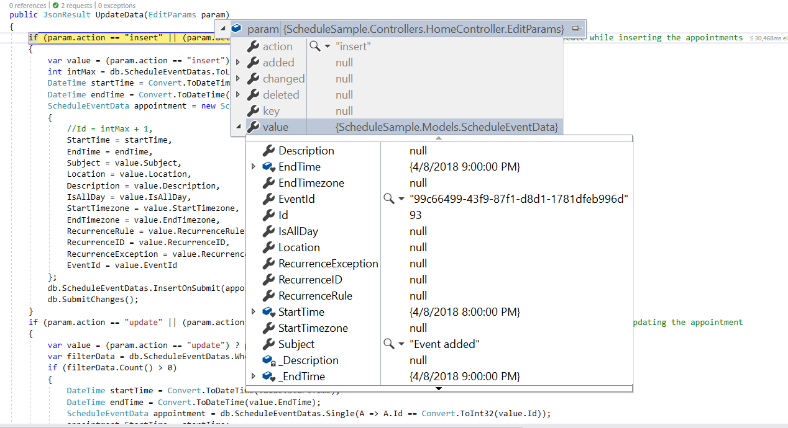
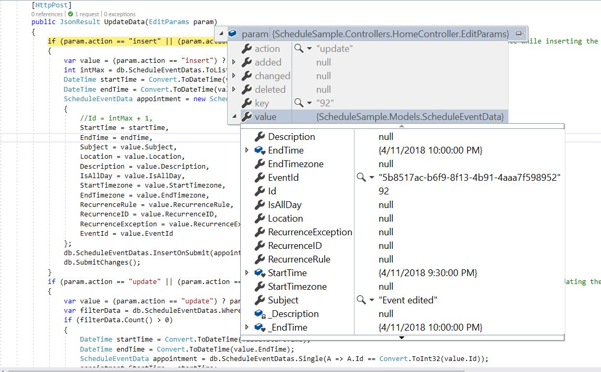
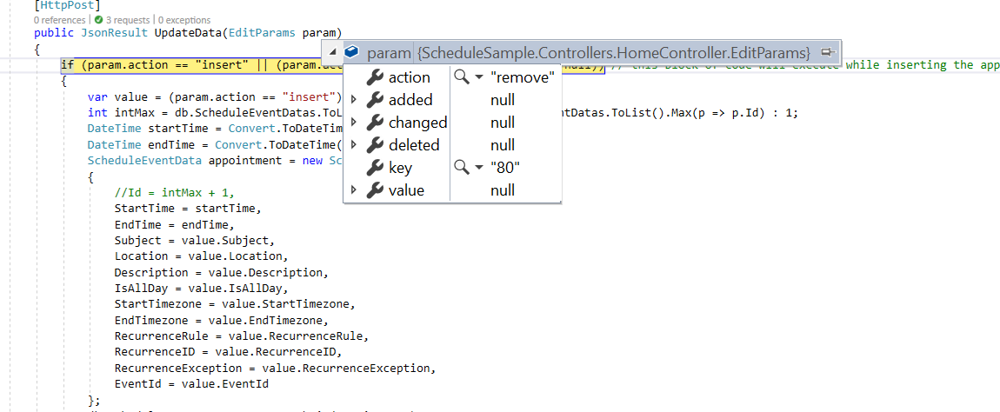

# CRUD operations in ##Platform_Name## Scheduler control

Appointments are the core elements of the Scheduler component, representing scheduled events that users can create, view, modify, and delete. The Scheduler provides comprehensive support for manipulating appointments using editor window or through the drag and resize action.

## Add

Appointments can be added to the Scheduler in multiple ways, supporting various event types including normal, all-day, spanned, and recurring events.
* [Creation using editor window](#creation-using-editor-window)
* [Creation using addEvent method](#creation-using-addevent-method)

### Creation using editor window

Double-clicking on Scheduler cells opens the default editor window, which provides fields for entering appointment details such as Subject, Location, Start and End time, All-day option, Timezone, Description, and recurrence settings. After filling in the required information, click the `Save` button to create the appointment.

For quick appointment creation, single-click on a cell to open a quick popup that prompts for the Subject field only. Multiple cells can be selected by clicking and dragging, then pressing `Enter` to open the quick popup for the selected time range.

To customize the editor window with additional fields, refer to the [custom editor window](./editor-template#customizing-event-editor-using-template) documentation. To add one or two [additional fields to the existing default editor](./editor-template#add-additional-fields-to-the-default-editor), manually define and append them to the editor window.

### Creation using addEvent method

Appointments can be created programmatically using the [`addEvent`](../api/schedule#addevent) method. This method accepts either a single appointment object or an collection of appointment objects. The following example demonstrates creating multiple appointments simultaneously:



 







        
















### Inserting events into database at server-side

When adding appointments to the Scheduler, an `insert` action occurs. The following server-side code demonstrates how to handle the insertion of new events into a database:

```ts
if (param.action == "insert" || (param.action == "batch" && param.added != null)) // this block of code will execute while inserting the appointments
{
    var value = (param.action == "insert") ? param.value : param.added[0];
    int intMax = db.ScheduleEventDatas.ToList().Count > 0 ? db.ScheduleEventDatas.ToList().Max(p => p.Id) : 1;
    DateTime startTime = Convert.ToDateTime(value.StartTime);
    DateTime endTime = Convert.ToDateTime(value.EndTime);
    ScheduleEventData appointment = new ScheduleEventData()
    {
        Id = intMax + 1,
        StartTime = startTime.ToLocalTime(),
        EndTime = endTime.ToLocalTime(),
        Subject = value.Subject,
        IsAllDay = value.IsAllDay,
        StartTimezone = value.StartTimezone,
        EndTimezone = value.EndTimezone,
        RecurrenceRule = value.RecurrenceRule,
        RecurrenceID = value.RecurrenceID,
        RecurrenceException = value.RecurrenceException
    };
    db.ScheduleEventDatas.InsertOnSubmit(appointment);
    db.SubmitChanges();
}
```



### Restricting add action based on specific criteria

In the following example, the specific fields of Scheduler editor window such as Subject and Location are made to undergo validation such that if it is left as blank, then the default `Required` validation message will be displayed, while clicking on a save button.

Additionally, the regex condition has been added to the Location field, so that if any special characters are typed into it, then the custom validation message will be displayed.



 










        



















Appointment creation can also be prevented dynamically based on custom conditions. The following example shows how to prevent appointments from being created on weekend days using the [`actionBegin`](../api/schedule#actionbegin) event:



 










        



















## Edit

The same way the appointments such as normal, all-day, spanned or recurring events are created, it can be easily edited using any of the following ways.

* [Update using editor window](#update-using-editor-window)
* [Update using saveEvent method](#update-using-saveevent-method)

### Update using editor window

Double-clicking on an existing appointment opens the editor window pre-filled with the appointment details. Modify the desired fields and click the `Save` button to update the appointment.

> Single-clicking an appointment opens a quick info popup with `Edit` and `Delete` options. Selecting `Edit` opens the default editor with appointment details, while `Delete` displays a confirmation prompt.

### Update using saveEvent method

Appointments can be updated programmatically using the [`saveEvent`](../api/schedule#saveevent) method. The following examples demonstrate editing normal and recurring events.

**Normal event** - Here, an event with ID `3` is edited and its subject is changed with a new text. When the modified data object is passed onto the [`saveEvent`](../api/schedule#saveevent) method, the changes gets reflected onto the original event. The `Id` field is mandatory in this edit process, where the modified event object should hold the valid `Id` value that exists in the Scheduler data source.



 







        
















**Recurring event** - The following code example shows how to edit a single occurrence of a recurring event. In this case, the modified data should hold an additional field namely [`RecurrenceID`](../api/schedule/field#recurrenceid) mapping to its parent recurring event's Id value. Also, this modified occurrence will be considered as a new event in the Scheduler dataSource, where it is linked with its parent event through the [`RecurrenceID`](../api/schedule/field#recurrenceid) field value. The [`saveEvent`](../api/schedule#saveevent) method takes 2 arguments, first one accepting the modified event data object and second argument accepting either of the 2 text values - `EditOccurrence` or `EditSeries`.

When the second argument is passed as `EditOccurrence`, which means that the passed event data is a single modified occurrence - whereas if the second argument is passed as `EditSeries`, it means that the modified data needs to be edited as a whole series and therefore no new event object will be maintained in the Scheduler dataSource.

In case of modifying the single occurrence, it is also necessary to update the [`RecurrenceException`](../api/schedule/field#recurrenceexception) field of parent event altogether with the occurrence editing. To know more about how to set [`RecurrenceException`](../api/schedule/field#recurrenceexception) values, refer the [recurring events](./appointments#adding-exceptions) topic.



 







        
















### Updating events in database at server-side

When editing appointments in the Scheduler, an `update` action occurs. The following server-side code demonstrates how to update events in a database:

```ts
if (param.action == "update" || (param.action == "batch" && param.changed != null)) // this block of code will execute while updating the appointment
{
    var value = (param.action == "update") ? param.value : param.changed[0];
    var filterData = db.ScheduleEventDatas.Where(c => c.Id == Convert.ToInt32(value.Id));
    if (filterData.Count() > 0)
    {
        DateTime startTime = Convert.ToDateTime(value.StartTime);
        DateTime endTime = Convert.ToDateTime(value.EndTime);
        ScheduleEventData appointment = db.ScheduleEventDatas.Single(A => A.Id == Convert.ToInt32(value.Id));
        appointment.StartTime = startTime.ToLocalTime();
        appointment.EndTime = endTime.ToLocalTime();
        appointment.StartTimezone = value.StartTimezone;
        appointment.EndTimezone = value.EndTimezone;
        appointment.Subject = value.Subject;
        appointment.IsAllDay = value.IsAllDay;
        appointment.RecurrenceRule = value.RecurrenceRule;
        appointment.RecurrenceID = value.RecurrenceID;
        appointment.RecurrenceException = value.RecurrenceException;
    }
    db.SubmitChanges();
}
```



### Editing single occurrence or entire series and updating in database at server-side

Recurring appointments can be edited in two ways:

* Single occurrence
* Entire series

**Editing single occurrence** - When double click on a recurring event, a popup prompts to choose either to edit the single event or entire series. From this, if **EDIT EVENT** option is selected, a single occurrence of the recurring appointment alone will be edited. The following process takes place while editing a single occurrence,

* A new event will be created from the parent event data and added to the Scheduler dataSource, with all its default field values overwritten with the newly modified data and additionally, the [`recurrenceID`](../api/schedule/field#recurrenceid) field will be added to it, that holds the `id` value of the parent recurring event. Also, a new `Id` will be generated for this event in the dataSource.

* The parent recurring event needs to be updated with appropriate [`recurrenceException`](../api/schedule/field#recurrenceexception) field to hold the edited occurrence appointment's date collection.

Therefore, when a single occurrence is edited from a recurring event, the batch action takes place by allowing both the `Add` and `Edit` action requests to take place together.

> In case, if existing occurrence of a recurring event edited, only those edited occurrence which present in the database as an individual event object will get updated. In this case, `update` action alone takes place on the edited occurrence object on the database.

```ts
if (param.action == "insert" || (param.action == "batch" && param.added != null)) // this block of code will execute while inserting the appointments
{
    var value = (param.action == "insert") ? param.value : param.added[0];
    int intMax = db.ScheduleEventDatas.ToList().Count > 0 ? db.ScheduleEventDatas.ToList().Max(p => p.Id) : 1;
    DateTime startTime = Convert.ToDateTime(value.StartTime);
    DateTime endTime = Convert.ToDateTime(value.EndTime);
    ScheduleEventData appointment = new ScheduleEventData()
    {
        Id = intMax + 1,
        StartTime = startTime.ToLocalTime(),
        EndTime = endTime.ToLocalTime(),
        Subject = value.Subject,
        IsAllDay = value.IsAllDay,
        StartTimezone = value.StartTimezone,
        EndTimezone = value.EndTimezone,
        RecurrenceRule = value.RecurrenceRule,
        RecurrenceID = value.RecurrenceID,
        RecurrenceException = value.RecurrenceException
    };
    db.ScheduleEventDatas.InsertOnSubmit(appointment);
    db.SubmitChanges();
}
if (param.action == "update" || (param.action == "batch" && param.changed != null)) // this block of code will execute while updating the appointment
{
    var value = (param.action == "update") ? param.value : param.changed[0];
    var filterData = db.ScheduleEventDatas.Where(c => c.Id == Convert.ToInt32(value.Id));
    if (filterData.Count() > 0)
    {
        DateTime startTime = Convert.ToDateTime(value.StartTime);
        DateTime endTime = Convert.ToDateTime(value.EndTime);
        ScheduleEventData appointment = db.ScheduleEventDatas.Single(A => A.Id == Convert.ToInt32(value.Id));
        appointment.StartTime = startTime.ToLocalTime();
        appointment.EndTime = endTime.ToLocalTime();
        appointment.StartTimezone = value.StartTimezone;
        appointment.EndTimezone = value.EndTimezone;
        appointment.Subject = value.Subject;
        appointment.IsAllDay = value.IsAllDay;
        appointment.RecurrenceRule = value.RecurrenceRule;
        appointment.RecurrenceID = value.RecurrenceID;
        appointment.RecurrenceException = value.RecurrenceException;
    }
    db.SubmitChanges();
}
```

**Entire series** - Selecting **EDIT SERIES** updates the entire recurring series with the new values. If the parent event has edited occurrences, all child occurrences are removed from the data source, and only the parent data is updated.

This action involves a batch process with both `Delete` and `Edit` operations.

```ts
if (param.action == "update" || (param.action == "batch" && param.changed != null)) // this block of code will execute while updating the appointment
{
    var value = (param.action == "update") ? param.value : param.changed[0];
    var filterData = db.ScheduleEventDatas.Where(c => c.Id == Convert.ToInt32(value.Id));
    if (filterData.Count() > 0)
    {
        DateTime startTime = Convert.ToDateTime(value.StartTime);
        DateTime endTime = Convert.ToDateTime(value.EndTime);
        ScheduleEventData appointment = db.ScheduleEventDatas.Single(A => A.Id == Convert.ToInt32(value.Id));
        appointment.StartTime = startTime.ToLocalTime();
        appointment.EndTime = endTime.ToLocalTime();
        appointment.StartTimezone = value.StartTimezone;
        appointment.EndTimezone = value.EndTimezone;
        appointment.Subject = value.Subject;
        appointment.IsAllDay = value.IsAllDay;
        appointment.RecurrenceRule = value.RecurrenceRule;
        appointment.RecurrenceID = value.RecurrenceID;
        appointment.RecurrenceException = value.RecurrenceException;
    }
    db.SubmitChanges();
}
if (param.action == "remove" || (param.action == "batch" && param.deleted != null)) // this block of code will execute while removing the appointment
{
    if (param.action == "remove")
    {
        int key = Convert.ToInt32(param.key);
        ScheduleEventData appointment = db.ScheduleEventDatas.Where(c => c.Id == key).FirstOrDefault();
        if (appointment != null) db.ScheduleEventDatas.DeleteOnSubmit(appointment);
    }
    else
    {
        foreach (var apps in param.deleted)
        {
            ScheduleEventData appointment = db.ScheduleEventDatas.Where(c => c.Id == apps.Id).FirstOrDefault();
            if (appointment != null) db.ScheduleEventDatas.DeleteOnSubmit(appointment);
        }
    }
    db.SubmitChanges();
}
```

> For more information on handling recurrence exceptions, refer to the [Adding exceptions](./appointments#adding-exceptions) topic.

### Editing current and following events of a series

Recurring appointments can be edited from the current event onwards when the [`editFollowingEvents`](../api/schedule/eventSettings#editfollowingevents) property is enabled.

**Editing Following Events** - When double click on a recurring event, a popup prompts to choose either to edit the single event or Edit Following Events or entire series. From this, if **EDIT FOLLOWING EVENTS** option is selected, a current and following events of the recurring appointment will be edited. The following process takes place while editing a following events,

* A new event will be created from the parent event data and added to the Scheduler dataSource, with all its default field values overwritten with the newly modified data and additionally, the `followingID` field will be added to it, that holds the `id` value of the immediate parent recurring event. Also, a new `Id` will be generated for this event in the dataSource.

* The parent recurring event needs to be updated with appropriate `recurrenceRule` field to hold the modified occurrence appointment's end date.

Therefore, when a following events are edited from a recurring event, the batch action takes place by allowing the `Add`, `Edit` and `Delete` action requests to take place together.

```ts
if (param.action == "insert" || (param.action == "batch" && param.added != null)) // this block of code will execute while inserting the appointments
{
    var value = (param.action == "insert") ? param.value : param.added[0];
    int intMax = db.ScheduleEventDatas.ToList().Count > 0 ? db.ScheduleEventDatas.ToList().Max(p => p.Id) : 1;
    DateTime startTime = Convert.ToDateTime(value.StartTime);
    DateTime endTime = Convert.ToDateTime(value.EndTime);
    ScheduleEventData appointment = new ScheduleEventData()
    {
        Id = intMax + 1,
        StartTime = startTime.ToLocalTime(),
        EndTime = endTime.ToLocalTime(),
        Subject = value.Subject,
        IsAllDay = value.IsAllDay,
        StartTimezone = value.StartTimezone,
        EndTimezone = value.EndTimezone,
        RecurrenceRule = value.RecurrenceRule,
        FollowingID = value.FollowingID,
        RecurrenceID = value.RecurrenceID,
        RecurrenceException = value.RecurrenceException
    };
    db.ScheduleEventDatas.InsertOnSubmit(appointment);
    db.SubmitChanges();
}
if (param.action == "update" || (param.action == "batch" && param.changed != null)) // this block of code will execute while updating the appointment
{
    var value = (param.action == "update") ? param.value : param.changed[0];
    var filterData = db.ScheduleEventDatas.Where(c => c.Id == Convert.ToInt32(value.Id));
    if (filterData.Count() > 0)
    {
        DateTime startTime = Convert.ToDateTime(value.StartTime);
        DateTime endTime = Convert.ToDateTime(value.EndTime);
        ScheduleEventData appointment = db.ScheduleEventDatas.Single(A => A.Id == Convert.ToInt32(value.Id));
        appointment.StartTime = startTime.ToLocalTime();
        appointment.EndTime = endTime.ToLocalTime();
        appointment.StartTimezone = value.StartTimezone;
        appointment.EndTimezone = value.EndTimezone;
        appointment.Subject = value.Subject;
        appointment.IsAllDay = value.IsAllDay;
        appointment.RecurrenceRule = value.RecurrenceRule;
        appointment.RecurrenceID = value.RecurrenceID;
        appointment.FollowingID = value.FollowingID;
        appointment.RecurrenceException = value.RecurrenceException;
    }
    db.SubmitChanges();
}
if (param.action == "remove" || (param.action == "batch" && param.deleted != null)) // this block of code will execute while removing the appointment
{
    if (param.action == "remove")
    {
        int key = Convert.ToInt32(param.key);
        ScheduleEventData appointment = db.ScheduleEventDatas.Where(c => c.Id == key).FirstOrDefault();
        if (appointment != null) db.ScheduleEventDatas.DeleteOnSubmit(appointment);
    }
    else
    {
        foreach (var apps in param.deleted)
        {
            ScheduleEventData appointment = db.ScheduleEventDatas.Where(c => c.Id == apps.Id).FirstOrDefault();
            if (appointment != null) db.ScheduleEventDatas.DeleteOnSubmit(appointment);
        }
    }
    db.SubmitChanges();
}
```

### Restricting edit action based on specific criteria

Appointment editing can be prevented dynamically based on custom conditions. The following example shows how to prevent updating appointments during non-working hours using the [`actionBegin`](../api/schedule#actionbegin) event:



 










        



















## Delete

Appointments can be deleted using the following methods:

* Selecting an appointment and clicking the delete icon in the quick popup
* Selecting an appointment and pressing the `Delete` key
* Selecting multiple appointments by tap-holding an event, then single-clicking other consecutive events, and pressing the `Delete` key
* Double-clicking an event to open the default editor, then clicking the `Delete` button

All deletion actions display a confirmation prompt before proceeding.

### Deletion using editor window

Double-clicking an event opens the default editor window with a `Delete` button at the bottom left. Clicking this button deletes the appointment immediately without displaying a confirmation prompt.

### Deletion using deleteEvent method

Appointments can be deleted programmatically using the [`deleteEvent`](../api/schedule#deleteevent) method. The following examples demonstrate deleting normal and recurring events.

**Normal event** - Delete normal appointments by passing the event's `Id` value or the entire event object to the [`deleteEvent`](../api/schedule#deleteevent) method:



 







        
















**Recurring Event** - Recurring events can be deleted as an entire series or as a single occurrence using the [`deleteEvent`](../api/schedule#deleteevent) method with either `DeleteSeries` or `DeleteOccurrence` parameters. The following example demonstrates deleting an entire series:



 







        
















### Removing events from database at server-side

When deleting events from the Scheduler, a `remove` action occurs. The following server-side code demonstrates how to delete events from a database:

```ts
if (param.action == "remove" || (param.action == "batch" && param.deleted != null)) // this block of code will execute while removing the appointment
{
    if (param.action == "remove")
    {
        int key = Convert.ToInt32(param.key);
        ScheduleEventData appointment = db.ScheduleEventDatas.Where(c => c.Id == key).FirstOrDefault();
        if (appointment != null) db.ScheduleEventDatas.DeleteOnSubmit(appointment);
    }
    else
    {
        foreach (var apps in param.deleted)
        {
            ScheduleEventData appointment = db.ScheduleEventDatas.Where(c => c.Id == apps.Id).FirstOrDefault();
            if (appointment != null) db.ScheduleEventDatas.DeleteOnSubmit(appointment);
        }
    }
    db.SubmitChanges();
}
```



### How to delete a single occurrence or entire series from Scheduler and update it in database at server-side

The recurring events can be deleted in either of the following two ways.

* Single occurrence
* Entire series

**Single occurrence** - When delete the recurring events, a popup prompts to choose either to delete the single event or entire series. From this, if  **DELETE EVENT** option is selected, a single occurrence of the recurring appointment alone will be removed. The following process takes place while removing a single occurrence,

* The selected occurrence will be deleted from the Scheduler user interface.
* In code, the parent recurring event object will be updated with appropriate [`recurrenceException`](../api/schedule/field#recurrenceexception) field, to hold the deleted occurrence appointment's date collection.

Therefore, when a single occurrence is deleted from a recurring event, the `update` action takes place on the parent recurring event as shown in the following code example.

> In case, if an existing edited occurrence of a recurring event is deleted, only those edited occurrence which present in the database as an individual event object will get removed. In this case, `delete` action takes place instead of `update` action and the parent recurring event object remains same with no changes.

```ts
if (param.action == "update" || (param.action == "batch" && param.changed != null)) // this block of code will execute while updating the appointment
{
    var value = (param.action == "update") ? param.value : param.changed[0];
    var filterData = db.ScheduleEventDatas.Where(c => c.Id == Convert.ToInt32(value.Id));
    if (filterData.Count() > 0)
    {
        DateTime startTime = Convert.ToDateTime(value.StartTime);
        DateTime endTime = Convert.ToDateTime(value.EndTime);
        ScheduleEventData appointment = db.ScheduleEventDatas.Single(A => A.Id == Convert.ToInt32(value.Id));
        appointment.StartTime = startTime.ToLocalTime();
        appointment.EndTime = endTime.ToLocalTime();
        appointment.StartTimezone = value.StartTimezone;
        appointment.EndTimezone = value.EndTimezone;
        appointment.Subject = value.Subject;
        appointment.IsAllDay = value.IsAllDay;
        appointment.RecurrenceRule = value.RecurrenceRule;
        appointment.RecurrenceID = value.RecurrenceID;
        appointment.RecurrenceException = value.RecurrenceException;
    }
    db.SubmitChanges();
}
```

**Entire series** - When  **DELETE SERIES** option is from the popup, the whole recurring series will be deleted. When this option is chosen explicitly, if a parent event holds any edited occurrences - then all its child occurrences which are maintained as separate event objects will also be removed from the dataSource. This action of deleting entire series leads to `remove` action and removes one or more event objects at the same time.

```ts
if (param.action == "remove" || (param.action == "batch" && param.deleted != null)) // this block of code will execute while removing the appointment
{
    if (param.action == "remove")
    {
        int key = Convert.ToInt32(param.key);
        ScheduleEventData appointment = db.ScheduleEventDatas.Where(c => c.Id == key).FirstOrDefault();
        if (appointment != null) db.ScheduleEventDatas.DeleteOnSubmit(appointment);
    }
    else
    {
        foreach (var apps in param.deleted)
        {
            ScheduleEventData appointment = db.ScheduleEventDatas.Where(c => c.Id == apps.Id).FirstOrDefault();
            if (appointment != null) db.ScheduleEventDatas.DeleteOnSubmit(appointment);
        }
    }
    db.SubmitChanges();
}
```

### How to delete only the current and following events of a series

The recurring events can be deleted from current and following events only when enable `editFollowingEvents` property.

**Delete Following Events** - When attempting to delete the recurring events, a popup prompts to choose either to delete the single event or Following Events or entire series. From this, if **FOLLOWING EVENT** option is selected, a current and following events of the recurring appointment alone will be removed. The following process takes place while removing a single occurrence,

* The selected occurrence and the following events in same series will be deleted from the Scheduler user interface.
* In code, the parent recurring event object will be updated with appropriate `recurrenceRule` field, to update the end date of the recurring events.

Therefore, when following events are deleted from a recurring event, the `remove` and `update` action takes place on the immediate parent recurring event as shown in the following code example.

```ts
if (param.action == "update" || (param.action == "batch" && param.changed != null)) // this block of code will execute while updating the appointment
{
    var value = (param.action == "update") ? param.value : param.changed[0];
    var filterData = db.ScheduleEventDatas.Where(c => c.Id == Convert.ToInt32(value.Id));
    if (filterData.Count() > 0)
    {
        DateTime startTime = Convert.ToDateTime(value.StartTime);
        DateTime endTime = Convert.ToDateTime(value.EndTime);
        ScheduleEventData appointment = db.ScheduleEventDatas.Single(A => A.Id == Convert.ToInt32(value.Id));
        appointment.StartTime = startTime.ToLocalTime();
        appointment.EndTime = endTime.ToLocalTime();
        appointment.StartTimezone = value.StartTimezone;
        appointment.EndTimezone = value.EndTimezone;
        appointment.Subject = value.Subject;
        appointment.IsAllDay = value.IsAllDay;
        appointment.RecurrenceRule = value.RecurrenceRule;
        appointment.RecurrenceID = value.RecurrenceID;
        appointment.followingID = value.followingID;
        appointment.RecurrenceException = value.RecurrenceException;
    }
    db.SubmitChanges();
}

if (param.action == "remove" || (param.action == "batch" && param.deleted != null)) // this block of code will execute while removing the appointment
{
    if (param.action == "remove")
    {
        int key = Convert.ToInt32(param.key);
        ScheduleEventData appointment = db.ScheduleEventDatas.Where(c => c.Id == key).FirstOrDefault();
        if (appointment != null) db.ScheduleEventDatas.DeleteOnSubmit(appointment);
    }
    else
    {
        foreach (var apps in param.deleted)
        {
            ScheduleEventData appointment = db.ScheduleEventDatas.Where(c => c.Id == apps.Id).FirstOrDefault();
            if (appointment != null) db.ScheduleEventDatas.DeleteOnSubmit(appointment);
        }
    }
    db.SubmitChanges();
}
```

## Drag and drop

When a normal event on the Scheduler is dropped, the event editing action takes place. When a recurring event is drag and dropped on a desired time range, the batch action explained in `Editing a single occurrence` process will takes place - thus allowing both the `Add` and `Edit` action to take place together.

> By default, when drag a recurring instance, only the occurrence of the event gets edited and not a whole series.



 










        



















## Resize

When normal event on the Scheduler is resized, the event editing action takes place. When a recurring event is resized to a new desired time, the batch action explained in `Editing a single occurrence` process will takes place - thus allowing both the `Add` and `Edit` action to take place together.

> By default, when resize a recurring instance, only the occurrence of the event gets edited and not a whole series.



 










        



















> You can refer to our [JavaScript Scheduler](https://www.syncfusion.com/javascript-ui-controls/js-scheduler) feature tour page for its groundbreaking feature representations. You can also explore our [JavaScript Scheduler example](https://ej2.syncfusion.com/demos/#/tailwind3/schedule/overview.html) to knows how to present and manipulate data.
