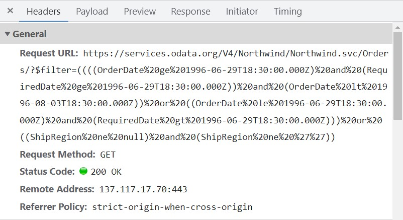

# Data binding in ##Platform_Name## Scheduler control

The Scheduler manages data using the `DataManager`, which supports both RESTful data service binding and JavaScript object array binding. The [`dataSource`](../api/schedule/eventSettings#datasource) property of the Scheduler can be assigned either an instance of `DataManager` or a JavaScript object array collection. The Scheduler supports two types of data binding methods:

* Local data
* Remote data

## Binding local data

To bind local JSON data to the Scheduler, assign a JavaScript object array to the [`dataSource`](../api/schedule/eventSettings#datasource) option within the `eventSettings` property. The JSON object dataSource can also be provided as an instance of `DataManager` and assigned to the Scheduler `dataSource` property.



 







        
















> By default, `DataManager` uses `JsonAdaptor` for binding local data.

Bind different field names to the default event fields and include additional custom fields in the event object collection, as described [here](./appointments#event-fields).

## Binding remote data

The Scheduler supports binding to remote data services. To implement this:

1. Create an instance of `DataManager`.
2. Provide the service URL to the `url` option of `DataManager`.
3. Assign the `DataManager` instance to the [`dataSource`](../api/schedule/eventSettings#datasource) property within `eventSettings`.

### Using ODataV4Adaptor
s
[ODataV4](https://www.odata.org/documentation) is a standardized protocol for creating and consuming data. To connect with ODataV4 service endpoints, use the `ODataV4Adaptor` within the `DataManager`. Refer to the following code example to retrieve data from an ODataV4 service using the DataManager. 



 







        
















### Filter events using the in-built query

To enable server-side filtering based on the current view range, set the [`includeFiltersInQuery`](https://ej2.syncfusion.com/documentation/api/schedule/eventSettings#includefiltersinquery) API to `true`. This constructs a filter query using the start date, end date, and recurrence rule, allowing the server to return only the relevant data.

This method improves component performance by reducing the amount of data transferred to the client. This enhances efficiency and responsiveness, resulting in a better user experience. However, consider the potential for longer query strings, which may encounter maximum URL length limits or server restrictions.



 







        
















The following image represents how the parameters are passed using ODataV4 filter.



### Using custom adaptor

Create a custom adaptor by extending the built-in adaptors. The following example demonstrates how to create a custom adaptor and add a custom field `EventID` for appointments by overriding the `processResponse` method of the `ODataV4Adaptor`.



 







        
















## Loading data via AJAX post

The Scheduler supports binding event data retrieved via external AJAX requests. Assign the retrieved data to the [`dataSource`](../api/schedule/eventSettings#datasource) property of the Scheduler. In the following code example, data is retrieved from the server using an AJAX request and assigned to the [`dataSource`](../api/schedule/eventSettings#datasource) property within the `onSuccess` event.

`[src/app/app.ts]`

```ts
import { Ajax } from '@syncfusion/ej2-base';
import { Schedule, Day, Week, WorkWeek, Month, Agenda } from '@syncfusion/ej2-schedule';

Schedule.Inject(Day, Week, WorkWeek, Month, Agenda);
let dataManager: object = [];
let ajax = new Ajax('Home/GetData', 'GET', false);
ajax.onSuccess = function (value) {
    dataManager = value;
};
ajax.send();
let scheduleObj: Schedule = new Schedule({
    height: '550px',
    selectedDate: new Date(2017, 5, 11),
    eventSettings: { dataSource: dataManager }
});
scheduleObj.appendTo('#Schedule');
```

> Definition for the controller method `GetData` can be referred [here](#scheduler-crud-actions).

## Passing additional parameters to the server

To send additional custom parameters to the server-side post:

1. Use the `addParams` method of `Query`.
2. Assign the `Query` object with additional parameters to the [`query`](../api/schedule/eventSettings#query) property of the Scheduler.



 







        
















> Parameters added using the [`query`](../api/schedule/eventSettings#query) property will be sent with every data request to the server for all Scheduler actions.

## Handling failure actions

You can handle server-side exceptions and error messages on the client-side using the Scheduler's [`actionFailure`](../api/schedule#actionfailure) event. The event argument contains the error details returned from the server.



 







        
















> The [`actionFailure`](../api/schedule#actionfailure) event triggers when the server returns errors or when an exception occurs while processing any Scheduler CRUD action.

## Scheduler CRUD actions

CRUD (Create, Read, Update, and Delete) actions can be performed on Scheduler appointments using various adaptors available within the `DataManager`. The `UrlAdaptor` is recommended for performing CRUD actions on Scheduler appointments.

```ts
import { Schedule, Day, Week, WorkWeek, Month, Agenda } from '@syncfusion/ej2-schedule';
import { DataManager, UrlAdaptor } from '@syncfusion/ej2-data';

Schedule.Inject(Day, Week, WorkWeek, Month, Agenda);
let dataManager: DataManager = new DataManager({
       url: 'Home/GetData', // 'controller/actions'
       crudUrl: 'Home/UpdateData',
       adaptor: new UrlAdaptor
   });

let scheduleObj: Schedule = new Schedule({
    height: '550px',
    selectedDate: new Date(2017, 5, 5),
    eventSettings: { dataSource: dataManager }
});
scheduleObj.appendTo('#Schedule');
```

The server-side controller code to handle the CRUD operations is as follows:

```c#
using System;
using System.Collections.Generic;
using System.Linq;
using System.Web;
using System.Web.Mvc;
using ScheduleSample.Models;

namespace ScheduleSample.Controllers
{
    public class HomeController : Controller
    {
        ScheduleDataDataContext db = new ScheduleDataDataContext();
        public ActionResult Index()
        {
            return View();
        }  
        public JsonResult LoadData()  // Here we get the Start and End Date and based on that can filter the data and return to Scheduler
        {
            var data = db.ScheduleEventDatas.ToList();
            return Json(data, JsonRequestBehavior.AllowGet);
        }
        [HttpPost]
        public JsonResult UpdateData(EditParams param)
        {
            if (param.action == "insert" || (param.action == "batch" && param.added != null)) // this block of code will execute while inserting the appointments
            {
                var value = (param.action == "insert") ? param.value : param.added[0];
                int intMax = db.ScheduleEventDatas.ToList().Count > 0 ? db.ScheduleEventDatas.ToList().Max(p => p.Id) : 1;
                DateTime startTime = Convert.ToDateTime(value.StartTime);
                DateTime endTime = Convert.ToDateTime(value.EndTime);
                ScheduleEventData appointment = new ScheduleEventData()
                {
                    Id = intMax + 1,
                    StartTime = startTime.ToLocalTime(),
                    EndTime = endTime.ToLocalTime(),
                    Subject = value.Subject,
                    IsAllDay = value.IsAllDay,
                    StartTimezone = value.StartTimezone,
                    EndTimezone = value.EndTimezone,
                    RecurrenceRule = value.RecurrenceRule,
                    RecurrenceID = value.RecurrenceID,
                    RecurrenceException = value.RecurrenceException
                };
                db.ScheduleEventDatas.InsertOnSubmit(appointment);
                db.SubmitChanges();
            }
            if (param.action == "update" || (param.action == "batch" && param.changed != null)) // this block of code will execute while updating the appointment
            {
                var value = (param.action == "update") ? param.value : param.changed[0];
                var filterData = db.ScheduleEventDatas.Where(c => c.Id == Convert.ToInt32(value.Id));
                if (filterData.Count() > 0)
                {
                    DateTime startTime = Convert.ToDateTime(value.StartTime);
                    DateTime endTime = Convert.ToDateTime(value.EndTime);
                    ScheduleEventData appointment = db.ScheduleEventDatas.Single(A => A.Id == Convert.ToInt32(value.Id));
                    appointment.StartTime = startTime.ToLocalTime();
                    appointment.EndTime = endTime.ToLocalTime();
                    appointment.StartTimezone = value.StartTimezone;
                    appointment.EndTimezone = value.EndTimezone;
                    appointment.Subject = value.Subject;
                    appointment.IsAllDay = value.IsAllDay;
                    appointment.RecurrenceRule = value.RecurrenceRule;
                    appointment.RecurrenceID = value.RecurrenceID;
                    appointment.RecurrenceException = value.RecurrenceException;
                }
                db.SubmitChanges();
            }
            if (param.action == "remove" || (param.action == "batch" && param.deleted != null)) // this block of code will execute while removing the appointment
            {
                if (param.action == "remove")
                {
                    int key = Convert.ToInt32(param.key);
                    ScheduleEventData appointment = db.ScheduleEventDatas.Where(c => c.Id == key).FirstOrDefault();
                    if (appointment != null) db.ScheduleEventDatas.DeleteOnSubmit(appointment);
                }
                else
                {
                    foreach (var apps in param.deleted)
                    {
                        ScheduleEventData appointment = db.ScheduleEventDatas.Where(c => c.Id == apps.Id).FirstOrDefault();
                        if (appointment != null) db.ScheduleEventDatas.DeleteOnSubmit(appointment);
                    }
                }
                db.SubmitChanges();
            }
            var data = db.ScheduleEventDatas.ToList();
            return Json(data, JsonRequestBehavior.AllowGet);
        }

        public class EditParams
        {
            public string key { get; set; }
            public string action { get; set; }
            public List<ScheduleEventData> added { get; set; }
            public List<ScheduleEventData> changed { get; set; }
            public List<ScheduleEventData> deleted { get; set; }
            public ScheduleEventData value { get; set; }
        }
    }
}
```

## Configuring Scheduler with Google API service

A custom Google Calendar URL is assigned to the `DataManager` and then to the Scheduler [`dataSource`](../api/schedule/eventSettings#datasource). Since event data retrieved from Google Calendar uses a custom format, it must be manually resolved within the Scheduler’s [`dataBinding`](../api/schedule#databinding) event. In this event, map the fields correctly and assign them to the result.



 







        
















## See Also

[Salesforce Integration](./how-to/salesforce-integration.md)

> You can refer to our [JavaScript Scheduler](https://www.syncfusion.com/javascript-ui-controls/js-scheduler) feature tour page for its groundbreaking feature representations. You can also explore our [JavaScript Scheduler example](https://ej2.syncfusion.com/demos/#/tailwind3/schedule/overview.html) to knows how to present and manipulate data.
