# Salesforce integration in ##Platform_Name## Scheduler control

This topic provides you with a detailed step-by-step guide on how to seamlessly integrate the [**JavaScript Scheduler**](https://www.syncfusion.com/javascript-ui-controls/js-scheduler) control into Salesforce. By integrating it into Salesforce, you can enhance your productivity and streamline your scheduling processes.

## Prerequisites

Before getting started, make sure you have the following prerequisites need to be installed

* [Salesforce CLI](https://developer.salesforce.com/tools/salesforcecli)

## Configuring salesforce 

To begin the integration process, you need to configure Salesforce by following these steps.

[Sign up](https://developer.salesforce.com/signup) with salesforce developer account, if you don’t have salesforce account, sign up for one to access the necessary tools and resources for integration.

[Log in](https://login.salesforce.com/) with salesforce account. 

After successful login, search for Dev Hub in the quick find search box and select Dev Hub. In the Dev Hub setup tab, ensure that the `Enable Dev Hub` option is enabled. If it's not enabled, enable it to proceed further.

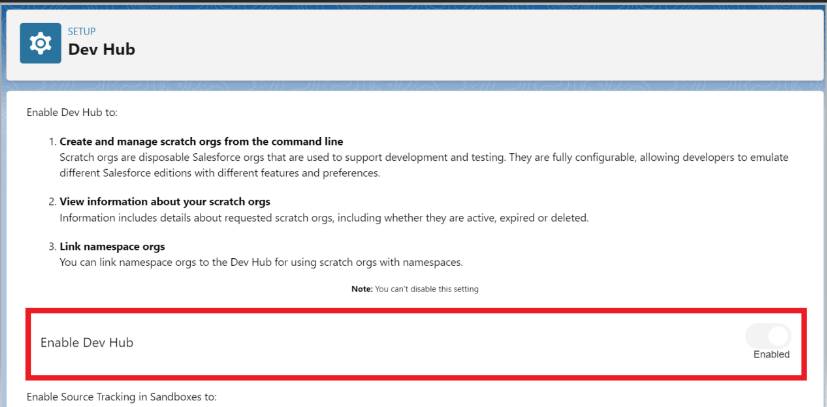

## Creating a salesforce project

Now you have have Salesforce configured, let's create a [Salesforce project](https://developer.salesforce.com/docs/atlas.en-us.sfdx_dev.meta/sfdx_dev/sfdx_dev_intro.htm) for our integration. 

In your preferred location, create a base directory for your Salesforce project. For example, you can create a directory named `salesforceApp` using the following command:

```bash
mkdir salesforceApp 
```

Navigate to the base directory you created in the previous step and generate a Salesforce DX project using the following CLI command.

```bash
sfdx project:generate -n scheduler-salesforce-app 
```

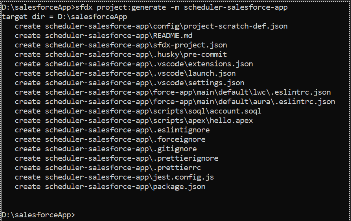

## Authorization of salesforce project 

Before proceeding further, you need to authorize your Salesforce project by following these steps

Run the following command to authorize your Salesforce project with your Salesforce account in the browser.

```bash
sfdx org:login:web -d 
```


Open the `sfdx-project.json` file located in `salesforceApp/scheduler-salesforce-app` and update the `sfdcLoginUrl` with the domain URL of your Salesforce account as shown in image (fig 2). You can obtain the domain URL from the `My Domain` setup tab in Salesforce as shown in image (fig 1). 

fig 1


fig 2


## Create scratch organization 

To facilitate development and testing, the creation of a scratch organization will be done using the following steps.

Run the following command to create a new scratch organization, which will provide a fresh Salesforce environment for development and testing with organization id and username as link below image.

```bash
sfdx org:create:scratch -f config/project-scratch-def.json 
```


## Adding static resources 

To integrate the Syncfusion scripts and styles as static resource files within Salesforce, follow these steps.  
 
Use the following command to open the scratch project in the browser

```bash
sfdx org:open -o <stratch org user name> 
```

Replace <scratch org username> with the username of your scratch organization, which was generated during the scratch organization creation process.  
 
In the Salesforce setup menu, search for `Static Resources` and click on **New** button in the static resources tab. 

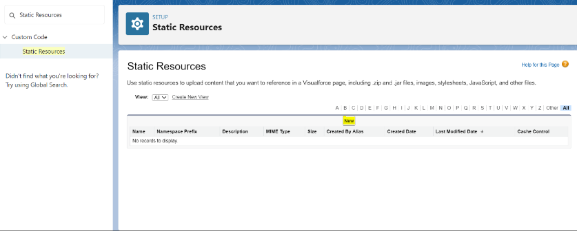

Load the Syncfusion scripts and styles as static files in a zip format, which you can obtain from the [CRG](https://crg.syncfusion.com/).

In the static resource tab, provide a name for the static resource files, upload the zip file, and change the cache control to `Public`. Click **Save** button to add the static resources to your Salesforce project.

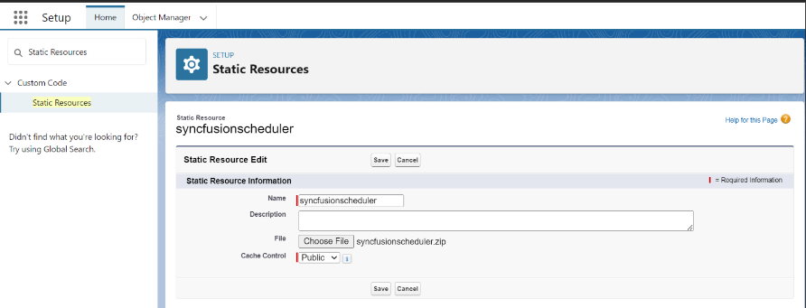

## Adding CSP trusted sites 

To ensure seamless integration and prevent content security policy issues, follow these steps. 

In the Salesforce setup menu, search for `CSP Trusted Sites` and click New Trusted Site button.

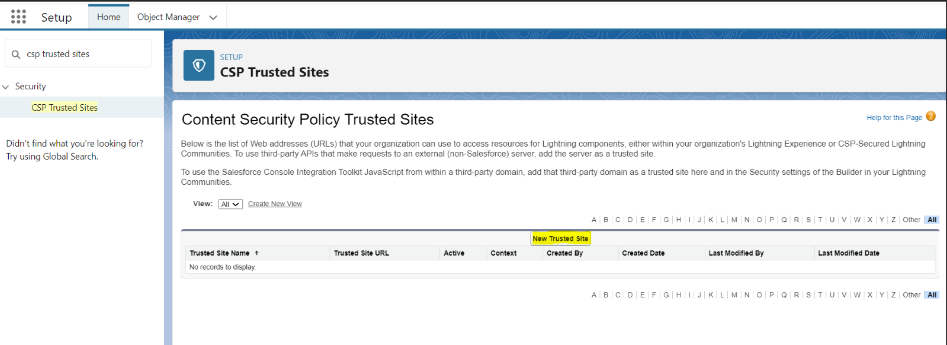

Enter the trusted site name and URL. For example, if the Syncfusion static styles refer to https://fonts.googleapis.com, enter that URL as the trusted site URL.  
 
Enable the following options to bypass the CSP issues and Click Save button to apply the changes. 
 
    * Allow site for font-src 
    * Allow site for style-src 

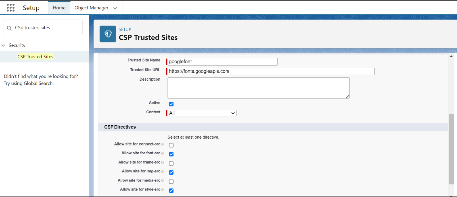

## Creating data model for appointment 

To begin, navigate to the Object Manager in Salesforce and select Create followed by `Custom Object`.


In the custom object section, enter a meaningful label for your custom object. For this example, let's name it `SchedulerEvent`. Once done, click **Save** to create the custom object. 


## Defining fields and relationships 

let's configure the fields and relationships for the `SchedulerEvent` object. To do so click **New** button to create a new field. 

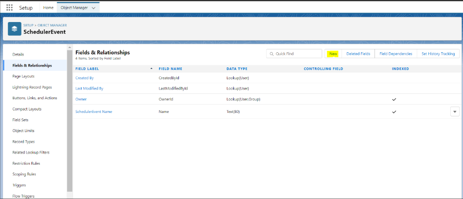

1. Setting the Data Type for `StartTime`. Choose DateTime as the data type for the `StartTime` field. This field will store the starting time of each appointment.


2. Provide a clear label for the `StartTime` field and click **Next** button. Once you've reviewed the settings, click **Save** & **New** button to proceed.


3. Repeat the same steps as above to create the `EndTime` field, which will store the ending time of each appointment. Creating the `EndTime` Field. Once you've reviewed the settings, click **Save** & **New** button to proceed.


4. Choose Checkbox as the data type for the `IsAllDay` field. This field will be marked when an appointment is scheduled for the entire day. 


5. Assign an appropriate label, such as `IsAllDay`, to the checkbox field. Click **Next** button to review the settings and then click **Save** & **New** button to proceed. 


6. Choose Text as the data type for the `Location/Recurrence Rule/Recurrence Id /Recurrence Exception` field to store the location field and recurrence rule for each appointment as shown in the image respectively. Click **Next** to review the settings and then click **Save** button to proceed. 


7. Based on your specific requirements, you can add more fields to the `SchedulerEvent` object by following the same steps outlined above.


## Creating a lightning web component 

To integrate the **JavaScript Scheduler** into your Salesforce project, we will create a [Lightning web component](https://developer.salesforce.com/docs/platform/lwc/guide/get-started-introduction.html).

1. In your Salesforce project, run the following command to generate a Lightning web component named scheduler.

```bash
sfdx lightning:generate:component --type lwc -n scheduler -d force-app/main/default/lwc 
```


2. Open the `scheduler.js-meta.xml` file located in `force-app/main/default/lwc/scheduler` and modify the component definition to expose it in the Lightning App Builder. Here's an example of the modified file. 

```xml
<?xml version="1.0" encoding="UTF-8"?> 
<LightningComponentBundle xmlns="http://soap.sforce.com/2006/04/metadata"> 
    <apiVersion>57.0</apiVersion> 
    <isExposed>true</isExposed> 
    <targets> 
        <target>lightning__AppPage</target> 
    </targets> 
    <targetConfigs> 
        <targetConfig targets="lightning__AppPage"> 
            <property name="height" label="Height" type="Integer" default="800" /> 
        </targetConfig> 
    </targetConfigs> 
</LightningComponentBundle> 
```

3. Open the `scheduler.html` file located in `force-app/main/default/lwc/scheduler` and add an element with a class name to append the Syncfusion scheduler. Here's an example of the modified file.

```html
<template> 
    <div class="syncfusionscheduler" lwc:dom="manual" style='width: 100%;'></div> 
</template> 
```

4. Open the `scheduler.js` file located in `force-app/main/default/lwc/scheduler` and implement the scheduler code in renderedCallback function. The static scripts and styles are loaded using the `loadScript` and `loadStyle` imports. Here's an example of the modified file.

```js
import { LightningElement, api } from 'lwc'; 
import { ShowToastEvent } from "lightning/platformShowToastEvent"; 
import { loadStyle, loadScript } from "lightning/platformResourceLoader"; 
import { createRecord, updateRecord, deleteRecord } from "lightning/uiRecordApi"; 
// Static resources 
import schedulerFiles from "@salesforce/resourceUrl/syncfusionscheduler"; 

// Controllers 
import getEvents from "@salesforce/apex/SchedulerData.getEvents";
function getEventsData(eventData) { 
    const data = eventData.events.map((a) => ({ 
        Id: a.Id, 
        Subject: a.Name, 
        Location: a.Location__c, 
        StartTime: a.Start_Time__c, 
        EndTime: a.End_Time__c, 
        IsAllDay: a.IsAllDay__c, 
        RecurrenceRule: a.RecurrenceRule__c, 
        RecurrenceID: a.Recurrence_Id__c, 
        RecurrenceException: a.RecurrenceException__c 
    })); 
    return data; 
} 

export default class Scheduler extends LightningElement { 
    static delegatesFocus = true;   
    @api height; 
    schedulerInitialized = false;  
    renderedCallback() { 
        if (this.schedulerInitialized) { 
            return; 
        } 
        this.schedulerInitialized = true;  
        Promise.all([ 
            loadScript(this, schedulerFiles + "/syncscheduler.js"), 
            loadStyle(this, schedulerFiles + "/syncscheduler.css") 
        ]) 
            .then(() => { 
                this.initializeUI(); 
            }) 
            .catch((error) => { 
                this.dispatchEvent( 
                    new ShowToastEvent({ 
                        title: "Error loading scheduler", 
                        message: error.message, 
                        variant: "error" 
                    }) 
                ); 
            }); 
    } 
    initializeUI() { 
        const root = this.template.querySelector(".syncfusionscheduler"); 
        root.style.height = this.height + "px"; 
        const scheduleOptions = { 
            height: this.height + "px", 
            selectedDate: new Date(), 
            actionComplete: function (args) { 
                //To perform CRUD in salesforce backend 
                if (args.addedRecords && args.addedRecords.length > 0) { 
                    var data = args.addedRecords[0]; 
                    var insert = { 
                        apiName: "SchedulerEvent__c", 
                        fields: { 
                            Name: data.Subject, 
                            Location__c: data.Location, 
                            Start_Time__c: data.StartTime, 
                            End_Time__c: data.EndTime, 
                            IsAllDay__c: data.IsAllDay, 
                            RecurrenceRule__c: data.RecurrenceRule, 
                            Recurrence_Id__c: data.RecurrenceID, 
                            RecurrenceException__c: data.RecurrenceException 
                        } 
                    }; 
                    createRecord(insert).then((res) => { 
                        if (scheduleObj) 
                        { 
                            scheduleObj.eventSettings.dataSource[scheduleObj.eventSettings.dataSource.length - 1].Id = res.id; 
                            scheduleObj.refreshEvents(); 
                        } 
                        return { tid: res.id, ...res }; 
                    }); 
                } 
                if (args.changedRecords && args.changedRecords.length > 0) { 
                    var data = args.changedRecords[0]; 
                    var update = { 
                        fields: { 
                            Id: data.Id, 
                            Name: data.Subject, 
                            Location__c: data.Location, 
                            Start_Time__c: data.StartTime, 
                            End_Time__c: data.EndTime, 
                            IsAllDay__c: data.IsAllDay, 
                            RecurrenceRule__c: data.RecurrenceRule, 
                            RecurrenceException__c: data.RecurrenceException, 
                            Recurrence_Id__c: data.RecurrenceID 
                        } 
                    }; 
                    updateRecord(update).then(() => ({})); 
                } 
                if (args.deletedRecords && args.deletedRecords.length > 0) { 
                    args.deletedRecords.forEach(event => { 
                        deleteRecord(event.Id).then(() => ({})); 
                    }); 
                } 
            } 
        }; 
        const scheduleObj = new ej.schedule.Schedule(scheduleOptions, root); 
        getEvents().then((data) => { 
            const eventData = getEventsData(data); 
            scheduleObj.eventSettings.dataSource = eventData; 
            scheduleObj.dataBind(); 
        }); 
    } 
} 
```

## Creating apex class 

Apex class that facilitates smooth interactions between your Lightning component and the data model. By following these steps, you will be able to fetch and manipulate data from the `SchedulerEvent` custom object effortlessly. 

Use the following command to create Apex class with the name `SchedulerData`. 

```bash
sfdx apex:generate:class -n SchedulerData -d force-app/main/default/classes	 
```


Open the **SchedulerData.cls** file located in `force-app/main/default/classes/SchedulerData.cls`. 
This will fetch the event data from salesforce backend. Here's an example of the modified file. 

```c#
public with sharing class SchedulerData { 
    @RemoteAction 
    @AuraEnabled(cacheable=true) 
    public static Map<String, Object> getEvents() {  
        // fetching the Records via SOQL 
        List<SchedulerEvent__c> Events = new List<SchedulerEvent__c>(); 
        Events = [SELECT Id, Name, Start_Time__c, End_Time__c, IsAllDay__c, 
            Location__c, RecurrenceRule__c, Recurrence_Id__c, RecurrenceException__c FROM SchedulerEvent__c];
        Map<String, Object> result = new Map<String, Object>{'events' => Events }; 
        return result; 
   } 
} 
```

## Pull scratch organization 

To retrieve the changes made in the scratch organization and sync them with your local Salesforce project, use the following command. 

```bash
sfdx project:retrieve:start -o <scratch org use name> 
```

Replace <scratch org username> with the username of your scratch organization.


## Push scratch organization 

To push the changes made in your local Salesforce project to the scratch organization, use the following command. 

```bash
sfdx project:deploy:start -o <scratch org use name> 
```

Replace <scratch org username> with the username of your scratch organization.


## Creating lightning page 

To display the **JavaScript Scheduler** on a Lightning page, follow these steps. 

1. In your scratch organization, search for `Lightning App Builder` in the quick find setup, select `Lightning App Builder` and click **New** button. 


2. Choose **App** Page and click **Next** button. 

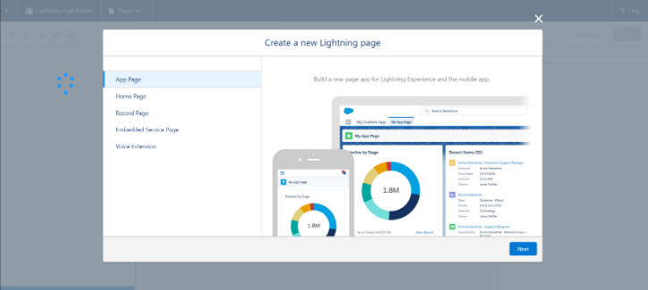 

3. Provide a label name for the app page and click **Next** button. For example, here you can name it `SyncfusionScheduler`. 

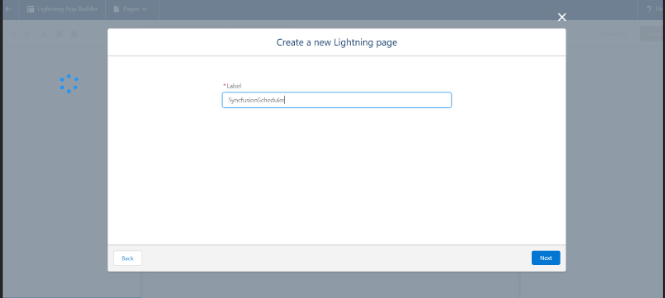

4. Choose One **Region** and click **Finish** button. 


5. In the Lightning App Builder, under the `Add Components Here` section, drag and drop the scheduler component. The scheduler will be 
rendered inside the content body. Click **Save** to activate the custom component. 

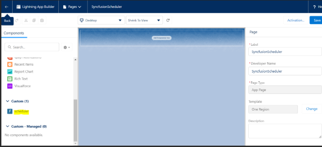

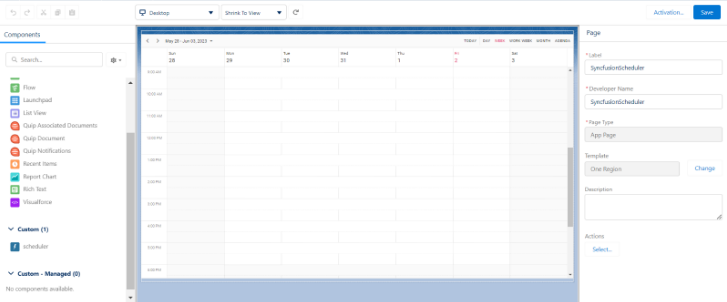

6. Activate the custom component with name `SyncfusionScheduler` and click the **Save** button. 

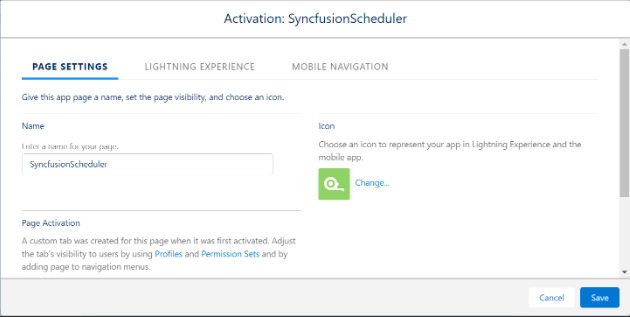

## Launching scheduler in home page 

To access the integrated **JavaScript Scheduler** on the home page, follow these steps. 

Click on the app launcher icon in Salesforce and Search for `SyncfusionScheduler`, which was registered earlier in the Lightning App Builder.


Click on the `SyncfusionScheduler` app, and the scheduler will load on the home page.

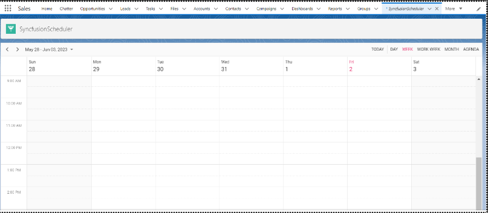

N> You can also explore our [**JavaScript Scheduler**](https://www.syncfusion.com/javascript-ui-controls/js-scheduler) example to knows about the Salesforce integration.
