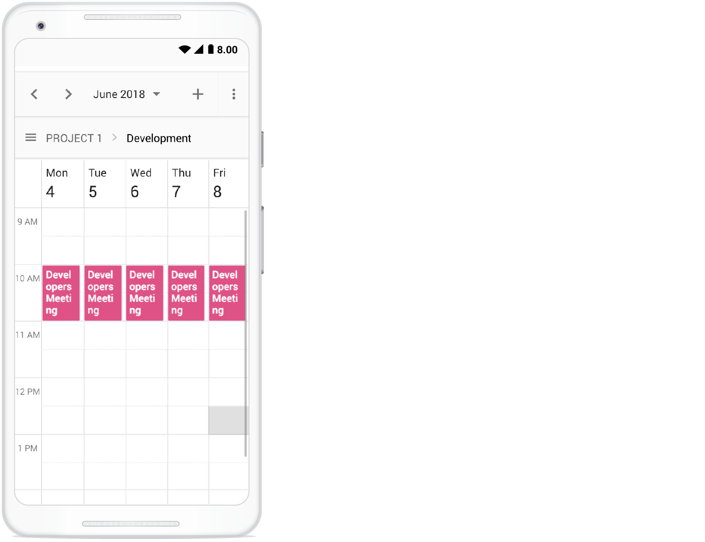
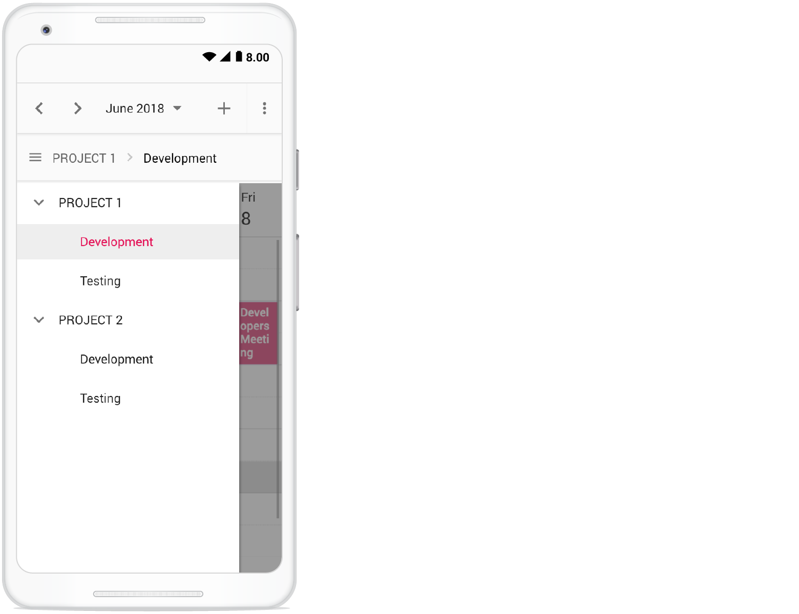

# Resources in ##Platform_Name## Scheduler control

Resources and grouping support allows the Scheduler to be shared by multiple resources. Appointments for each resource display under the relevant resource in a column or row layout. Each resource in the Scheduler is arranged in column-wise or row-wise order, with individual spacing to display all respective appointments on a single page. The Scheduler supports both single and multiple levels of resource grouping, enabling the categorization of resources in a hierarchical structure. Resources appear either as expandable groups in Timeline views or as a vertical hierarchy in Calendar views.

Multiple resources can be assigned to the same appointment by allowing multiple resource selection in the event editor window.

The HTML5 JavaScript Scheduler groups resources based on different criteria, including grouping appointments by resources, grouping resources by dates, and timeline scheduling. Resource data can be bound to the Scheduler either as a local JSON collection or through a URL retrieving data from remote services.

## Resource fields

The default options available within the [`resources`](https://ej2.syncfusion.com/documentation/api/schedule/resources) collection are as follows,

| Field name | Type | Description |
|-------|---------| --------------- |
| `field` | String | A value that binds to the resource [`field`](https://ej2.syncfusion.com/documentation/api/schedule/resources#field) of event object. |
| `title` | String | It holds the [`title`](https://ej2.syncfusion.com/documentation/api/schedule/resources#title) of the resource field to be displayed on the event editor window. |
| `name` | String | A unique resource [`name`](https://ej2.syncfusion.com/documentation/api/schedule/resources#name) used for differentiating various resource objects while grouping. |
| `allowMultiple` | Boolean | When set to `true`, the [`allowMultiple`](https://ej2.syncfusion.com/documentation/api/schedule/resources#allowmultiple) property allows the selection of multiple resource names, thus creating multiple instances of the same appointment for the selected resources. |
| `dataSource` | Object | Assigns the resource [`dataSource`](https://ej2.syncfusion.com/documentation/api/schedule/resources#datasource), where data can be passed either as an array of JavaScript objects, or else can create an instance of [`DataManager`](http://ej2.syncfusion.com/documentation/data/api-dataManager) for processing remote data. With remote data assigned to [`dataSource`](https://ej2.syncfusion.com/documentation/api/schedule/resources#datasource), check the available [adaptors](http://ej2.syncfusion.com/documentation/data/adaptors) to customize the data processing. |
| `query` | Query | Defines the external [`query`](http://ej2.syncfusion.com/documentation/data/api-query) that will be executed along with data processing. |
| `idField` | String | Binds the resource ID field name from the resources [`dataSource`](https://ej2.syncfusion.com/documentation/api/schedule/resources#datasource). |
| `expandedField` | String | Binds the [`expandedField`](https://ej2.syncfusion.com/documentation/api/schedule/resources#expandedfield) name from the resources [`dataSource`](https://ej2.syncfusion.com/documentation/api/schedule/resources#datasource). It usually holds a boolean value that determines whether the resource in Timeline views is in a collapsed or expanded state on initial load. |
| `textField` | String | Binds the [`textField`](https://ej2.syncfusion.com/documentation/api/schedule/resources#textfield) name from the resources [`dataSource`](https://ej2.syncfusion.com/documentation/api/schedule/resources#datasource). It usually holds the resource names. |
| `groupIDField` | String | Binds the [`groupIDField`](https://ej2.syncfusion.com/documentation/api/schedule/resources#groupidfield) name from the resource [`dataSource`](https://ej2.syncfusion.com/documentation/api/schedule/resources#datasource). It usually holds the resource IDs of parent-level resources. |
| `colorField` | String | Binds the [`colorField`](https://ej2.syncfusion.com/documentation/api/schedule/resources#colorfield)   name from the resource [`dataSource`](https://ej2.syncfusion.com/documentation/api/schedule/resources#datasource). The color value mapped in this field will be applied to the events of resources. |
| `startHourField` | String | Binds the [`startHourField`](https://ej2.syncfusion.com/documentation/api/schedule/resources#starthourfield) name from the resource [`dataSource`](https://ej2.syncfusion.com/documentation/api/schedule/resources#datasource). It allows providing different work start hour for the resources. |
| `endHourField` | String | Binds the [`endHourField`](https://ej2.syncfusion.com/documentation/api/schedule/resources#endhourfield) name from the resource [`dataSource`](https://ej2.syncfusion.com/documentation/api/schedule/resources#datasource). It allows providing different work end hour for the resources. |
| `workDaysField` | String | Binds the [`workDaysField`](https://ej2.syncfusion.com/documentation/api/schedule/resources#workdaysfield) name from the resources [`dataSource`](https://ej2.syncfusion.com/documentation/api/schedule/resources#datasource). It allows providing different working days collection for the resources. |
| `cssClassField` | String | Binds the custom [`cssClassField`](https://ej2.syncfusion.com/documentation/api/schedule/resources#cssclassfield) name from the resources [`dataSource`](https://ej2.syncfusion.com/documentation/api/schedule/resources#datasource). It maps the CSS class written for specific resources and applies it to the events of those resources. |

## Resource data binding

Resource data can be bound to the Scheduler either as a local JSON collection or through a service URL retrieving resource data from remote data services.

### Using local JSON data

The following code example demonstrates how to bind local JSON data to the [`dataSource`](https://ej2.syncfusion.com/documentation/api/schedule/resources#datasource) of the [`resources`](https://ej2.syncfusion.com/documentation/api/schedule/resources) collection.














        



















### Using remote service URL

The following code example demonstrates how to bind remote data for the resources [`dataSource`](https://ej2.syncfusion.com/documentation/api/schedule/resources#datasource).














        
















The server-side controller code to handle the resource datasource is as follows.

```c#
using Microsoft.AspNetCore.Mvc;

namespace Core_DotNet9.Controllers
{
    public class HomeController : Controller
    {
        public IActionResult Index()
        {
            return View();
        }
        public List<Resource> GetResourceData()
        {
            var resources = new List<Resource>
            {
                new Resource { Id = 1, OwnerText = "Alice", OwnerColor = "#1aaa55" },
                new Resource { Id = 2, OwnerText = "Bob", OwnerColor = "#357cd2" },
                new Resource { Id = 3, OwnerText = "Charlie", OwnerColor = "#7fa900" }
            };
            return resources;
        }
        public class Resource
        {
            public int Id { get; set; }
            public string OwnerText { get; set; }
            public string OwnerColor { get; set; }
        }
    }
}

```

## Scheduler with multiple resources

Display the Scheduler in default mode without visually showcasing all resources, while allowing assignment of required resources to appointments through the event editor resource options.

Appointments belonging to different resources display together on the default Scheduler, differentiated by the resource color assigned in the **resources** collection (indicating which resource the appointment belongs to).

**Example:** To display the default Scheduler with multiple resource options in the event editor, ignore the [`group`](https://ej2.syncfusion.com/documentation/api/schedule#group) option and simply define the [`resources`](https://ej2.syncfusion.com/documentation/api/schedule/resources) property with all its internal options.



 










        



















> Setting [`allowMultiple`](https://ej2.syncfusion.com/documentation/api/schedule/resources#allowmultiple) to `true` in the above code example allows selection of multiple resources from the event editor and also creates multiple copies of the same appointment in the Scheduler for each resource while rendering.

## Resource grouping

Resource grouping support allows the Scheduler to group resources in a hierarchical structure both as expandable groups (Timeline views) and as vertical hierarchy displaying resources one after the other (Resources view).

The Scheduler supports both single and multiple levels of resource grouping that can be customized in both Timeline and vertical Scheduler views.

### Vertical resource view

The following code example displays how multiple resources are grouped and their events are displayed in the default calendar views.



 










        



















### Timeline resource view

The following code example demonstrates how to group the multiple resources on Timeline Scheduler views with their relevant events displayed accordingly under those resources.



 










        



















### Grouping single-level resources

This grouping allows the Scheduler to display all resources at a single level simultaneously. The appointments mapped under resources display with colors as per the [`colorField`](https://ej2.syncfusion.com/documentation/api/schedule/resources#colorfield) defined in the resources collection.

**Example:** To display the Scheduler with single-level resource grouping,



 










        



















> The [`name`](https://ej2.syncfusion.com/documentation/api/schedule/resources#name) field defined in the **resources** collection namely `Owners` will be mapped within the [`group`](https://ej2.syncfusion.com/documentation/api/schedule/group) property, in order to enable the grouping option with those resource levels on the Scheduler.

### Grouping multi-level resources

Group the Scheduler resources in multiple levels, by mapping child resources to each parent resource. In the following example, there are 2 levels of resources, where the second level resources are defined with [`groupID`](https://ej2.syncfusion.com/documentation/api/schedule/resources#groupidfield) mapping to the first level resource's ID to establish the parent-child relationship between them.

**Example:** To display the Scheduler with multiple level resource grouping options,



 










        



















### One-to-One grouping

In multi-level grouping, Scheduler usually groups resources on the child level based on the `GroupID` that maps with the `Id` field of parent-level resources (as [`byGroupID`](https://ej2.syncfusion.com/documentation/api/schedule/group#bygroupid) set to true by default). There is also option to group all child resource(s) against each of its parent resource(s). To enable this kind of grouping, set `false` to the [`byGroupID`](https://ej2.syncfusion.com/documentation/api/schedule/group#bygroupid) option within the [`group`](https://ej2.syncfusion.com/documentation/api/schedule/group) property. In the following code example, there are two levels of resources, on which all the 3 resources at the child level is mapped one to one with each resource on the first level.



 










        



















### Grouping resources by date

Group the number of resources under each date, applicable only on Calendar views such as Day, Week, Work Week, Month, Agenda, and Month-Agenda. To enable such grouping, set [`byDate`](https://ej2.syncfusion.com/documentation/api/schedule/group#bydate) option to `true` within the [`group`](https://ej2.syncfusion.com/documentation/api/schedule/group) property.

**Example:** To display the Scheduler with resources grouped by date,



 










        



















> This grouping by date is not applicable on any Timeline views.

## Customizing parent resource cells

In timeline views, work cells of parent resources can be customized by checking the [`elementType`](https://ej2.syncfusion.com/documentation/api/schedule/renderCellEventArgs#elementtype) as `resourceGroupCells` in the event [`renderCell`](https://ej2.syncfusion.com/documentation/api/schedule#rendercell). In the following code example, background color of work hours has been changed.



 










        



















## Working with shared events

Multiple resources can share the same events, thus allowing the CRUD action made on it to reflect on all other shared instances simultaneously. To enable such option, set [`allowGroupEdit`](https://ej2.syncfusion.com/documentation/api/schedule/group#allowgroupedit) option to `true` within the [`group`](https://ej2.syncfusion.com/documentation/api/schedule/group) property. With this property enabled, a single appointment object will be maintained within the appointment collection, even if it is shared by more than one resource – whereas the resource fields of such appointment object will be in array which hold the IDs of the multiple resources.

> Any actions such as create, edit or delete performed on any shared event instance, will be reflected on all other related instances visible on the UI.

**Example:** To edit all resource events simultaneously,



 







        



















## Simple resource header customization

Customize the resource header cells using the built-in template option to change the look and appearance in both vertical and Timeline view modes. All the resource related fields and other information can be accessed within the [`resourceHeaderTemplate`](https://ej2.syncfusion.com/documentation/api/schedule#resourceheadertemplate) option.

**Example:** To customize the resource header and display it along with the designation [`resource`](https://ej2.syncfusion.com/documentation/api/schedule/resources) field, refer the below code example.



 










        



















> To customize the resource header in compact mode properly, use the class `e-device` as shown in the code example.


## Customizing resource header with multiple columns

Customize the resource headers to display with multiple columns such as Room, Type, and Capacity. The following code example demonstrates how to achieve this and is applicable only on timeline views.



 










        



















## Collapse/Expand child resources in timeline views

Expand and collapse resources that have child resources in Timeline views dynamically. By default, resources are in an expanded state with their child resources. We can collapse and expand the child resources in UI by setting the [`expandedField`](https://ej2.syncfusion.com/documentation/api/schedule/resources#expandedfield) option as `false` whereas its default value is `true`.



 










        



















## Displaying tooltip for resource headers

Display tooltips over resource headers showing the resource information. By default, no tooltips are displayed on resource headers. To enable tooltips, assign a customized template design to the  [`headerTooltipTemplate`](https://ej2.syncfusion.com/documentation/api/schedule/group#headertooltiptemplate) option within the[ `group`](https://ej2.syncfusion.com/documentation/api/schedule/group) property.



 










        



















## Choosing among resource colors for appointments

By default, colors defined on the top level resources collection are applied to events. To apply specific resource colors to events irrespective of top-level parent resource color, define the [`resourceColorField`](https://ej2.syncfusion.com/documentation/api/schedule/eventSettings#resourcecolorfield) option within the [`eventSettings`](https://ej2.syncfusion.com/documentation/api/schedule/eventSettings) property.

In the following example, colors mentioned in the second level are applied over the events.



 










        



















> The value of the [`resourceColorField`](https://ej2.syncfusion.com/documentation/api/schedule/eventSettings#resourcecolorfield) field should be mapped with the [`name`](https://ej2.syncfusion.com/documentation/api/schedule/resources#name) value given within the [`resources`](https://ej2.syncfusion.com/documentation/api/schedule/resources) property.

## Setting different style to each resource appointments

By default, the appearance of events is the same for all resource events. In case, if you want to apply the different styles to each resource event, you can do this by defining the [`cssClassField`](https://ej2.syncfusion.com/documentation/api/schedule/resources#cssclassfield) option within the [`resource`](https://ej2.syncfusion.com/documentation/api/schedule/resources) property that maps the different cssClass fields from the resource dataSource as shown in the following example.



 










        



















## Dynamically add and remove resources

Add or remove resources dynamically to and from the Scheduler. In the following example, when the checkboxes are checked and unchecked, the respective resources are added or removed from the Scheduler layout. To add new resource dynamically, use the [`addResource`](https://ej2.syncfusion.com/documentation/api/schedule#addresource) method, which accepts the resource object, resource name (the level within which to add the resource object), and index (the position where the resource needs to be added) as arguments.

To remove the resources dynamically, use the [`removeResource`](https://ej2.syncfusion.com/documentation/api/schedule#removeresource) method, which accepts the index (position from where the resource should be removed) and resource name (within which level, the resource object presents) as parameters.



 










        



















## Setting different working days and hours for resources

Each resource in the Scheduler can have different `working hours` and `working days`. There are default options available within the [`resources`](https://ej2.syncfusion.com/documentation/api/schedule/resources) collection, to customize the default working hours and days of the Scheduler.

* [Using the work day field for different work days](#set-different-work-days)
* [Using the start hour and end hour fields for different work hours](#set-different-work-hours)

### Set different work days

Set different working days for Scheduler resources using the [`workDaysField`](https://ej2.syncfusion.com/documentation/api/schedule/resources#workdaysfield) property, which maps the working days field from the resource dataSource. This field accepts the collection of day indexes (from 0 to 6) of a week. By default, it is set to [1, 2, 3, 4, 5], In the following example, each resource has been set with different values and therefore each will render only those working days. This option is applicable only on vertical views and is not applicable on timeline views.



 










        



















### Set different work hours

Different `working Hours` can be set for the resources of Scheduler using the [`startHourField`](https://ej2.syncfusion.com/documentation/api/schedule/resources#starthourfield) and [`endHourField`](https://ej2.syncfusion.com/documentation/api/schedule/resources#endhourfield) property, which maps the `startHourField` and `endHourField` field from the resource dataSource.

* [`startHourField`](https://ej2.syncfusion.com/documentation/api/schedule/resources#starthourfield) - Denotes the start time of the working/business hour in a day.
* [`endHourField`](https://ej2.syncfusion.com/documentation/api/schedule/resources#endhourfield) - Denotes the end time limit of the working/business hour in a day.

Working hours indicate the duration of a workday, which is visually highlighted with an active color over the work cells. Each resource in the Scheduler can have its own set of working hours, as depicted in the following example.



 










        



















In this example, a resource named `Will Smith` is shown with working hours ranging from 8.00 AM to 3.00 PM, visually illustrated with active colors, whereas the other two resources have different working hours set.

## Hide non-working days when grouped by date

In the Scheduler, set custom work days for each resource and group the Scheduler by date to display these work days. By default, the Scheduler shows all days when it is grouped by date, even if they are not included in the custom work days for the resources. However, use the [`hideNonWorkingDays`](../api/schedule/group#hidenonworkingdays) property to only display the custom work days in the Scheduler.

To use the [`hideNonWorkingDays`](../api/schedule/group#hidenonworkingdays) property, include it in the configuration options for the Scheduler component. Set the value of [`hideNonWorkingDays`](../api/schedule/group#hidenonworkingdays) to `true` to enable this feature.

**Example:** To display the Scheduler with resources grouped by date for custom working days,



 







        
















> The [`hideNonWorkingDays`](../api/schedule/group#hidenonworkingdays) property only applies when the Scheduler is grouped [`byDate`](../api/schedule/group#bydate).

## Scroll to specific resource

You can manually scroll to a specific resource on the Scheduler using the [`scrollToResource`](https://ej2.syncfusion.com/documentation/api/schedule#scrolltoresource) method as shown in the following code example.



 










        



















## Compact view in mobile

Although the Scheduler views are designed with responsiveness for mobile devices in mind, however when using Scheduler with multiple resources, it is difficult to view all resources and their relevant events at once on mobile devices. Therefore, a new compact mode has been introduced specifically for displaying multiple resources of the Scheduler on mobile devices. By default, this mode is enabled when using Scheduler with multiple resources on mobile devices. To disable this compact mode, set `false` to the [`enableCompactView`](https://ej2.syncfusion.com/documentation/api/schedule/group#enablecompactview) option within the [`group`](https://ej2.syncfusion.com/documentation/api/schedule/group) property. Disabling this option displays the exact desktop mode of Scheduler view on mobile devices.

With this compact view enabled on mobile, only single resource at a time and to switch to other resources, there is a treeview at the left listing out all other available resources - clicking on which will display that particular resource and its related appointments.



Clicking on the menu icon before the resource text will show the resources available in the Scheduler as following.



## Adaptive UI in desktop

By default, the Scheduler layout adapts automatically on desktop and mobile devices with appropriate UI changes. To display the adaptive Scheduler in desktop mode with adaptive enhancements, set the [`enableAdaptiveUI`](https://ej2.syncfusion.com/documentation/api/schedule#enableadaptiveui) property to true. Enabling this option will display the exact mobile mode of the Scheduler view on desktop devices.

Some of the default changes made for compact Scheduler to render in desktop devices are as follows,
* View options displayed in the Navigation drawer.
* Plus icon added to the header for new event creation.
* Today icon added to the header instead of the Today button.
* With Multiple resources – only one resource is shown to enhance the view experience of resource events details clearly. To switch to other resources, there is a TreeView on the left that lists all other available resources. Clicking on a resource displays that particular resource and its related events.



 










        



















> Refer to the [JavaScript Scheduler](https://www.syncfusion.com/javascript-ui-controls/js-scheduler) feature tour page for its groundbreaking feature representations. Also explore the [JavaScript Scheduler example](https://ej2.syncfusion.com/demos/#/tailwind3/schedule/overview.html) to learn how to present and manipulate data.
