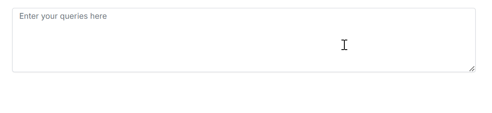

# Customization in ##Platform_Name## Smart TextArea

The [ShowSuggestionOnPopup](https://ej2.syncfusion.com/javascript/documentation/api/smart-textarea/index-default#showsuggestiononpopup) property in the Syncfusion® JavaScript Smart TextArea allows you to control how AI-generated text suggestions are presented to users. Depending on your application requirements, suggestions can be displayed in a popup window or directly within the text area as inline suggestions.

This customization helps provide a more flexible writing experience. Popup suggestions allow users to review generated content separately, while inline suggestions enable users to continue writing without leaving the editing flow.

The following values are supported:

| Value | Description |
|---------|-------------|
| `Enable` | Displays AI suggestions in a popup window. |
| `Disable` | Displays AI suggestions inline within the text area. |
| `None` | Uses the default suggestion behavior. |

## Display suggestions in a popup

Set the `ShowSuggestionOnPopup` property to `Enable` to display AI suggestions in a popup window. This mode allows users to review and accept suggestions without interrupting the content currently being edited.




let textareaObj = new ej.inputs.SmartTextArea({
    placeholder: 'Enter your queries here',
    rows: 3,
    cols: 35,
    userRole: 'Employee communicating with internal team',
    aiSuggestionHandler: serverAIRequest,
    ShowSuggestionOnPopup: 'Enable'
});
textareaObj.appendTo('#smart-textarea');




In popup mode, generated suggestions are displayed in a separate popup interface, enabling users to review the AI-generated content before applying it to the text area.

## Display suggestions inline

Set the `ShowSuggestionOnPopup` property to `Disable` to display AI-generated suggestions directly within the text area. This mode provides a seamless and contextual writing experience by presenting suggestions alongside the current content.




let textareaObj = new ej.inputs.SmartTextArea({
    placeholder: 'Enter your queries here',
    rows: 3,
    cols: 35,
    userRole: 'Employee communicating with internal team',
    aiSuggestionHandler: serverAIRequest,
    ShowSuggestionOnPopup: 'Disable'
});
textareaObj.appendTo('#smart-textarea');




In inline mode, suggestions appear directly within the text area, allowing users to review and continue writing without interacting with a separate popup window.

By default, the `ShowSuggestionOnPopup` property is set to `None`, which applies the default suggestion display behavior.

## See also

* [Getting Started with Syncfusion&reg; JavaScript Smart TextArea](./getting-started)