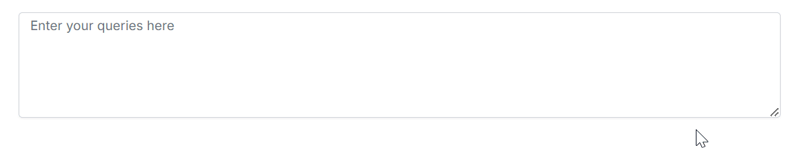

# Es5 getting started in ##Platform_Name## Smart TextArea control

The Essential JS 2 for JavaScript (global script) is an ES5 formatted pure JavaScript framework which can be directly used in latest web browsers.

The **Smart TextArea** is an advanced control designed to elevate the text input experience by providing intelligent autocomplete suggestions for entire sentences through text-generative AI functionality. This control enhances user productivity by predicting and offering relevant completions based on the context of what is being typed.

## Prerequisites

To get started, ensure the following software to be installed in the machine.

* [Essential Studio JavaScript (Essential JS 2)](https://www.syncfusion.com/downloads/essential-js2)

* [Visual Studio Code](https://code.visualstudio.com/)

* [OpenAI](https://github.com/syncfusion/smart-ai-samples/blob/master/typescript/README.md#openai) or [Azure OpenAI Account](https://learn.microsoft.com/en-us/azure/ai-services/openai/how-to/create-resource) 

> Check out the [download and installation](https://ej2.syncfusion.com/javascript/documentation/installation-and-upgrade/download/) section of `Essential Studio JavaScript`. If you are using Syncfusion CDN resources to build your web application, you can skip the Essential Studio JavaScript prerequisite.

## Dependencies

The following list of dependencies are required to use the Smart TextArea control in your application.

```js
|-- @syncfusion/ej2-inputs
    |-- @syncfusion/ej2-base
```

## Control Initialization

The Essential JS 2 JavaScript controls can be initialized by using either of the following ways.

* Using local script and style references in a HTML page.
* Using CDN link for script and style reference.

### Using local script and style references in a HTML page

**Step 1:** Create an app folder `quickstart` for getting started.

**Step 2:** You can get the global scripts and styles from the [Essential Studio JavaScript (Essential JS 2)](https://www.syncfusion.com/downloads/essential-js2) build installed location.

**Syntax:**
> Dependency Script: `**(installed location)**\Syncfusion\Essential Studio\JavaScript - EJ2\{RELEASE_VERSION}\Web (Essential JS 2)\JavaScript\{DEPENDENCY_PACKAGE_NAME}\dist\global\{DEPENDENCY_PACKAGE_NAME}.min.js`
>
> Control Script: `**(installed location)**\Syncfusion\Essential Studio\JavaScript - EJ2\{RELEASE_VERSION}\Web (Essential JS 2)\JavaScript\{PACKAGE_NAME}\dist\global\{PACKAGE_NAME}.min.js`
>
> Dependency Styles: `**(installed location)**\Syncfusion\Essential Studio\JavaScript - EJ2\{RELEASE_VERSION}\Web (Essential JS 2)\JavaScript\{DEPENDENCY_PACKAGE_NAME}\styles\material.css`
>
> Control Styles: `**(installed location)**\Syncfusion\Essential Studio\JavaScript - EJ2\{RELEASE_VERSION}\Web (Essential JS 2)\JavaScript\{PACKAGE_NAME}\styles\material.css`

**Example:**
> Dependency Script: `C:\Program Files (x86)\Syncfusion\Essential Studio\JavaScript - EJ2\19.3.0.44\Web (Essential JS 2)\JavaScript\ej2-base\dist\global\ej2-base.min.js`
>
> Control Script: `C:\Program Files (x86)\Syncfusion\Essential Studio\JavaScript - EJ2\19.3.0.44\Web (Essential JS 2)\JavaScript\ej2-inputs\dist\global\ej2-inputs.min.js`
>
> Dependency Styles: `C:\Program Files (x86)\Syncfusion\Essential Studio\JavaScript - EJ2\19.3.0.44\Web (Essential JS 2)\JavaScript\ej2-base\styles\material.css`
>
> Control Styles: `C:\Program Files (x86)\Syncfusion\Essential Studio\JavaScript - EJ2\19.3.0.44\Web (Essential JS 2)\JavaScript\ej2-inputs\styles\material.css`

The below located script and style file contains all Syncfusion JavaScript (ES5) UI control resources in a single file.

> Scripts: `**(installed location)**\Syncfusion\Essential Studio\JavaScript - EJ2\{RELEASE_VERSION}\Web (Essential JS 2)\JavaScript\ej2\dist\ej2.min.js`
>
> Styles: `**(installed location)**\Syncfusion\Essential Studio\JavaScript - EJ2\{RELEASE_VERSION}\Web (Essential JS 2)\JavaScript\ej2\material.css`

The [`Custom Resource Generator (CRG)`](https://crg.syncfusion.com/) is an online web tool, which can be used to generate the custom script and styles for a set of specific controls. This web tool is useful to combine the required control scripts and styles in a single file.

**Step 3:** Create a folder `~/quickstart/resources` and copy/paste the global scripts and styles from the above installed location to `quickstart/resources/package` corresponding package location.

**Step 4:** Create a HTML page (index.html) in `~/quickstart/index.html` location and add the Essentials JS 2 script and style references.

```html
<!DOCTYPE html>
  <html xmlns="http://www.w3.org/1999/xhtml">
       <head>
          <title>Essential JS 2 - Smart TextArea</title>
          <!-- Essential JS 2 Inputs's dependent material theme -->
          <link href="resources/base/material.css" rel="stylesheet" type="text/css"/>

          <!-- Essential JS 2 Smart TextArea's control material theme -->
          <link href="resources/inputs/material.css" rel="stylesheet" type="text/css"/>

          <!-- Essential JS 2 Inputs's dependent global script -->
          <script src="resources/base/ej2-base.min.js" type="text/javascript"></script>

          <!-- Essential JS 2 Inputs's control global script -->
          <script src="resources/inputs/ej2-inputs.min.js" type="text/javascript"></script>
       </head>
       <body>
       </body>
  </html>
```

**Step 5:** Now, add the `Smart TextArea` element and initiate the `Syncfusion JavaScript Smart TextArea` control in the `index.html` by using following code. In **Smart TextArea**, the [aiSuggestionHandler](https://ej2.syncfusion.com/javascript/documentation/api/smart-textarea#aisuggestionhandler) property, which sends prompts to the `AI` model and receives context-aware suggestions. These suggestions appear inline for non-touch devices and as an overlay popup for touch devices by default, helping users type faster and more accurately.

```html
<!DOCTYPE html>
<html xmlns="http://www.w3.org/1999/xhtml">

<head>
    <title>Essential JS 2 - Smart TextArea</title>
    <!-- Essential JS 2 Inputs's dependent material theme -->
    <link href="resources/base/material.css" rel="stylesheet" type="text/css"/>

    <!-- Essential JS 2 Smart TextArea control material theme -->
    <link href="resources/inputs/material.css" rel="stylesheet" type="text/css"/>

    <!-- Essential JS 2 Smart TextArea dependent global script -->
    <script src="resources/base/ej2-base.min.js" type="text/javascript"></script>

    <!-- Essential JS 2 Smart TextArea control global script -->
    <script src="resources/inputs/ej2-inputs.min.js" type="text/javascript"></script>
</head>

<body>
    <!--element which is going to render-->
    <div>
        <textarea id="smart-textarea"></textarea>
    </div>

    <script>
        // initialize Smart TextArea control
        const serverAIRequest = async (settings) => {
            let output = '';
            try {
                console.log(settings);
                const response = await (window).AzureAIRequest(settings);
                console.log("Success:", response);
                output = response;
            } catch (error) {
                console.error("Error:", error);
            }
            return output;
        };

        let textareaObj = new ej.inputs.SmartTextArea({
            placeholder: 'Enter your queries here',
            floatLabelType: 'Auto',
            resizeMode: 'Both',
            rows: 3,
            cols: 35,
            userRole: 'Employee communicating with internal team',
            UserPhrases: [
                "Please find the attached report.",
                "Let's schedule a meeting to discuss this further.",
                "Can you provide an update on this task?",
                "I appreciate your prompt response.",
                "Let's collaborate on this project to ensure timely delivery."
            ],
            aiSuggestionHandler: serverAIRequest
        });
        textareaObj.appendTo('#smart-textarea');

    </script>
</body>

</html>
```

**Step 6:** Now, run the `index.html` in web browser, it will render the **Syncfusion JavaScript Smart TextArea** control.

### Using CDN link for script and style reference

**Step 1:** Create an app folder `quickstart` for getting started.

**Step 2:** The Essential JS 2 control's global scripts and styles are already hosted in the below CDN link formats.

**Syntax:**
> Dependency Script: `https://cdn.syncfusion.com/ej2/{DEPENDENCY_PACKAGE_NAME}/dist/global/{PACKAGE_NAME}.min.js`
>
> Control Script: `https://cdn.syncfusion.com/ej2/{PACKAGE_NAME}/dist/global/{PACKAGE_NAME}.min.js`
>
> Dependency Styles: `https://cdn.syncfusion.com/ej2/{DEPENDENCY_PACKAGE_NAME}/styles/material.css`
>
> Control Styles: `https://cdn.syncfusion.com/ej2/{PACKAGE_NAME}/styles/material.css`

**Example:**
> Script: [`https://cdn.syncfusion.com/ej2/ej2-inputs/dist/global/ej2-inputs.min.js`](https://cdn.syncfusion.com/ej2/ej2-inputs/dist/global/ej2-inputs.min.js)
>
> Styles: [`https://cdn.syncfusion.com/ej2/ej2-inputs/styles/material.css`](https://cdn.syncfusion.com/ej2/ej2-inputs/styles/material.css)

**Step 3:** Create a HTML page (index.html) in `~/quickstart/index.html` location and add the CDN link references. Now, add the `Smart TextArea` element and initiate the `Syncfusion JavaScript Smart TextArea` control in the index.html by using following code.

```html
<!DOCTYPE html>
<html xmlns="http://www.w3.org/1999/xhtml">

<head>
    <title>Essential JS 2 - Smart TextArea</title>
    <!-- Essential JS 2 Inputs's dependent material theme -->
    <link href="https://cdn.syncfusion.com/ej2/27.1.48/ej2-base/styles/material.css" rel="stylesheet" type="text/css"/>

    <!-- Essential JS 2 Smart TextArea control material theme -->
    <link href="https://cdn.syncfusion.com/ej2/27.1.48/ej2-inputs/styles/material.css" rel="stylesheet" type="text/css"/>

    <!-- Essential JS 2 Smart TextArea dependent global script -->
    <script src="https://cdn.syncfusion.com/ej2/27.1.48/ej2-base/dist/global/ej2-base.min.js" type="text/javascript"></script>

    <!-- Essential JS 2 Smart TextArea control global script -->
    <script src="https://cdn.syncfusion.com/ej2/27.1.48/ej2-inputs/dist/global/ej2-inputs.min.js" type="text/javascript"></script>
</head>

<body>
    <!--element which is going to render-->
    <div>
        <textarea id="smart-textarea"></textarea>
    </div>

    <script>
        // initialize Smart TextArea control
        const serverAIRequest = async (settings) => {
            let output = '';
            try {
                const response = await (window).AzureAIRequest(settings);
                output = response;
            } catch (error) {
                console.error("Error:", error);
            }
            return output;
        };

        let textareaObj = new ej.inputs.SmartTextArea({
            placeholder: 'Enter your queries here',
            floatLabelType: 'Auto',
            resizeMode: 'Both',
            rows: 3,
            cols: 35,
            userRole: 'Employee communicating with internal team',
            UserPhrases: [
                "Please find the attached report.",
                "Let's schedule a meeting to discuss this further.",
                "Can you provide an update on this task?",
                "I appreciate your prompt response.",
                "Let's collaborate on this project to ensure timely delivery."
            ],
            aiSuggestionHandler: serverAIRequest
        });
        textareaObj.appendTo('#smart-textarea');

    </script>
</body>

</html>
```

## Adding Smart TextArea control to the application

* Add the HTML textarea tag with the `id` attribute as `Smart TextArea` to your `index.html` file. The following example shows the Smart TextArea control.

> In our demonstration, Azure AI is used, but you can integrate any text-generative AI of your choice.
















* Type 'To investigate' to experience instant sentence autocompletion.



> [View Sample in GitHub](https://github.com/syncfusion/smart-ai-samples/tree/master/typescript/src/app/smarttextarea).
