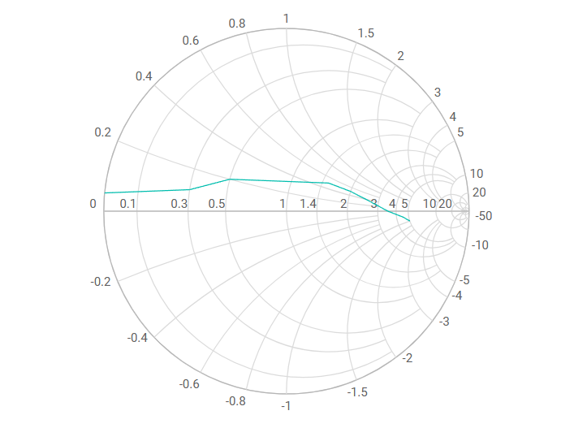

# Getting Started with Syncfusion® JavaScript (ES5) Smith Chart Control

Build your first Syncfusion JavaScript (ES5) application with a simple Smith Chart in just a few minutes. This quickstart guides you through creating a minimal, runnable HTML page that loads the Syncfusion EJ2 (ES5) Smith Chart control from the CDN, binds it to sample transmission-line data, and renders an interactive impedance plot.

## Prerequisites

* [Visual Studio Code](https://code.visualstudio.com) (or any text editor)
* A web browser to view the result
* A local web server such as the VS Code [Live Server](https://marketplace.visualstudio.com/items?itemName=ritwickdey.LiveServer) extension

## Dependencies

The Smith Chart control ships as part of the `@syncfusion/ej2-charts` package. Below is the list of minimum dependencies required.

```
|-- @syncfusion/ej2-charts
    |-- @syncfusion/ej2-base
    |-- @syncfusion/ej2-data
    |-- @syncfusion/ej2-svg-base
    |-- @syncfusion/ej2-pdf-export
    |-- @syncfusion/ej2-compression
    |-- @syncfusion/ej2-file-utils
```

## Quick Setup

### Step 1: Create Folder and HTML file

* Create a folder named `quickstart` in your desired directory.
* Inside the `quickstart` folder, create two new files: `index.html` and `index.js`.

### Step 2: Add Syncfusion<sup style="font-size:70%">&reg;</sup> CDN Resources

Include the following JavaScript and CSS links in the `<head>` section of `index.html`.

**Scripts (JavaScript):**
```html
<script src="https://cdn.syncfusion.com/ej2/33.2.3/ej2-base/dist/global/ej2-base.min.js" type="text/javascript"></script>
<script src="https://cdn.syncfusion.com/ej2/33.2.3/ej2-svg-base/dist/global/ej2-svg-base.min.js" type="text/javascript"></script>
<script src="https://cdn.syncfusion.com/ej2/33.2.3/ej2-charts/dist/global/ej2-charts.min.js" type="text/javascript"></script>
```

**Or**, to load all Syncfusion components in a single combined bundle:

```html
<script src="https://cdn.syncfusion.com/ej2/33.2.3/dist/ej2.min.js" type="text/javascript"></script>
```

### Step 3: Add the Syncfusion<sup style="font-size:70%">&reg;</sup> Smith Chart Control to the Application

The `index.html` file references a separate `index.js` file that contains the Smith Chart component initialization. This keeps your markup and script logic cleanly separated, which is the recommended pattern for Syncfusion<sup style="font-size:70%">&reg;</sup> JavaScript (ES5) apps.

`index.js` imports nothing manually — the global scripts added in Step 2 register the `ej.charts.Smithchart` class on the `ej` namespace. The script then builds the Smith Chart with a single [`dataSource`](https://ej2.syncfusion.com/javascript/documentation/api/smithchart/smithchartseriesmodel#datasource)-bound series and renders the control into the `#element` container declared in `index.html`.










The `new ej.charts.Smithchart({...})` call creates the Smith Chart component. The configuration object accepts the following key options:

- [`series`](https://ej2.syncfusion.com/javascript/documentation/api/smithchart/index-default#series) — Array of series objects. Each series is rendered as a curve on the chart.
- [`series[].dataSource`](https://ej2.syncfusion.com/javascript/documentation/api/smithchart/smithchartseriesmodel#datasource) — Array of `{ resistance, reactance }` objects. Use this when you want to bind a dataset to the series.
- [`series[].resistance`](https://ej2.syncfusion.com/javascript/documentation/api/smithchart/smithchartseriesmodel#resistance) / [`series[].reactance`](https://ej2.syncfusion.com/javascript/documentation/api/smithchart/smithchartseriesmodel#resistance) — Names of the data fields that hold the resistance and reactance values when binding to a [`dataSource`](https://ej2.syncfusion.com/javascript/documentation/api/smithchart/smithchartseriesmodel#datasource).

Finally, `smithchart.appendTo('#element')` renders the control into the `<div id="element">` element declared in `index.html`.

### Step 4: Open in Browser

Open `quickstart/index.html` through a local web server. With the VS Code **Live Server** extension installed, right-click `index.html` in the Explorer and choose **Open with Live Server**, then visit the URL it prints (for example, `http://127.0.0.1:5500/`). You should see the Syncfusion Smith Chart control displaying the transmission-line sample data.

## Output

The following screenshot shows the output of the Syncfusion Smith Chart quick start application:





## Troubleshooting

- **`ej is not defined`.** Confirm that `ej2-charts.min.js` is loaded before your script. Place the `<script>` tag inside the `<head>` or just before your own `<script src="index.js">` tag.
- **The container is empty.** Make sure the `id` in your markup (`#element`) matches the selector passed to `appendTo('#element')`.
- **`dataSource` is ignored.** When using `series[].dataSource`, you must also set the matching `resistance` and `reactance` field names; otherwise the series renders empty. Use `series[].points` instead if you want to pass values directly.