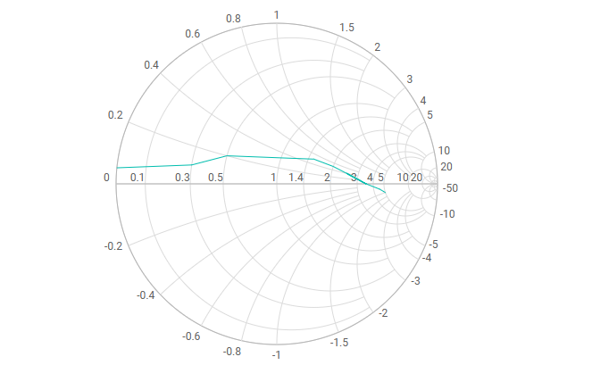

# Getting started with ##Platform_Name## Smith Chart control

This document explains how to create a simple Smith Chart and configure its features in TypeScript using the Essential<sup style="font-size:70%">&reg;</sup> JS 2 [quickstart](https://github.com/SyncfusionExamples/ej2-quickstart-webpack) seed repository.

> This application is integrated with the `webpack.config.js` configuration and uses the latest version of the [webpack-cli](https://webpack.js.org/api/cli/#commands). It requires node `v14.15.0` or higher. For more information about webpack and its features, refer to the [webpack getting-started guide](https://webpack.js.org/guides/getting-started/).

## Prerequisites

Before you begin, ensure you have the following installed on your machine:

* Node.js (v14.15.0 or higher)
* [Visual Studio Code](https://code.visualstudio.com) (or any text editor)
* [Git](https://git-scm.com/) for cloning the quickstart repository
* A modern web browser (Chrome, Edge, Firefox, or Safari) to view the result

## Dependencies

The Smith Chart control ships as part of the `@syncfusion/ej2-charts` package. Below is the list of minimum dependencies required.

```
|-- @syncfusion/ej2-charts
    |-- @syncfusion/ej2-base
    |-- @syncfusion/ej2-data
    |-- @syncfusion/ej2-svg-base
    |-- @syncfusion/ej2-pdf-export
    |-- @syncfusion/ej2-compression
    |-- @syncfusion/ej2-file-utils
```

## Quick Setup

### Step 1: Create a Project Folder

Create a folder named `my-smithchart` in your desired location. This folder will contain your Syncfusion Smith Chart TypeScript project.

### Step 2: Open Command Prompt

Open the command prompt and navigate to the `my-smithchart` folder created in Step 1. You can do this by:

* **Windows**: Open Command Prompt or PowerShell and navigate to the `my-smithchart` folder.
* **macOS/Linux**: Open Terminal and navigate to the `my-smithchart` folder.

### Step 3: Clone the Quickstart Repository

Run the following command to clone the Syncfusion<sup style="font-size:70%">&reg;</sup> JavaScript (Essential<sup style="font-size:70%">&reg;</sup> JS 2) quickstart project from [GitHub](https://github.com/SyncfusionExamples/ej2-quickstart-webpack).




git clone https://github.com/SyncfusionExamples/ej2-quickstart-webpack ej2-quickstart




### Step 4: Navigate to Project Folder

After cloning the application in the `ej2-quickstart` folder, run the following command to navigate to the project directory.




cd ej2-quickstart




### Step 5: Install Required Packages

Syncfusion<sup style="font-size:70%">&reg;</sup> JavaScript (Essential<sup style="font-size:70%">&reg;</sup> JS 2) packages are available on the [npmjs.com](https://www.npmjs.com/~syncfusionorg) public registry. You can install all Syncfusion<sup style="font-size:70%">&reg;</sup> JavaScript (Essential<sup style="font-size:70%">&reg;</sup> JS 2) controls in a single [@syncfusion/ej2](https://www.npmjs.com/package/@syncfusion/ej2) package or individual packages for each control.

The quickstart application is already preconfigured with the dependent [@syncfusion/ej2](https://www.npmjs.com/package/@syncfusion/ej2) package in the `~/package.json` file. Use the following command to install all the dependent npm packages from the command prompt:




npm install




### Step 6: Update the HTML Template

Open the `ej2-quickstart` folder in Visual Studio Code or any text editor of your choice.

Locate the `~/src/index.html` file in the project, preserve any existing `<link>` and `<script>` tags that were generated by the seed, and add the HTML `div` tag with its `id` attribute as `container` inside `<body>` to initialize the Smith Chart container.




<!DOCTYPE html>
<html lang="en">

<head>
    <title>Essential JS 2 Smith Chart</title>
    <meta charset="utf-8" />
    <meta name="viewport" content="width=device-width, initial-scale=1.0" />
    <meta name="description" content="TypeScript UI Controls" />
    <meta name="author" content="Syncfusion" />
    <!-- existing head content from the seed template remains here -->
</head>

<body>
    <!--container which is going to render the Smith Chart-->
    <div id='container'>
    </div>
</body>

</html>




### Step 7: Create the Smith Chart Component

Locate the `src/app/app.ts` file in your project and add the Smith Chart component.

**Module Injection**: The Smith Chart component is segregated into individual feature-specific modules. To use a particular feature, inject its module using the `Smithchart.Inject()` method. The commonly used modules are:

* `SmithchartLegend` — Inject to use the legend feature.
* `TooltipRender` — Inject to use the tooltip feature.

**Populate the chart with data**: The Smith Chart supports two ways to add a series:

* [`series[].dataSource`](https://ej2.syncfusion.com/documentation/api/smithchart/smithchartseriesmodel#datasource) — Bind an array of `{ resistance, reactance }` objects. Use [`series[].resistance`](https://ej2.syncfusion.com/documentation/api/smithchart/smithchartseriesmodel#resistance) and [`series[].reactance`](https://ej2.syncfusion.com/documentation/api/smithchart/smithchartseriesmodel#reactance) to map the field names.
* `series[].points` — Provide an array of `{ resistance, reactance }` points directly on the series.

The `new Smithchart({...})` call creates the Smith Chart component. Pass [`series`](https://ej2.syncfusion.com/documentation/api/smithchart/index-default#series), an array of series objects, to render curves on the chart. Each series with a [`dataSource`](https://ej2.syncfusion.com/documentation/api/smithchart/smithchartseriesmodel#datasource) needs matching [`resistance`](https://ej2.syncfusion.com/documentation/api/smithchart/smithchartseriesmodel#resistance) and [`reactance`](https://ej2.syncfusion.com/documentation/api/smithchart/smithchartseriesmodel#reactance) field names; each series with `points` does not. Finally, `smithchart.appendTo('#container')` renders the control into the `<div id="container">` element declared in `index.html`.







### Step 8: Run the Application

Open the integrated terminal in Visual Studio Code or use your command prompt to run the application. Use the `npm run start` command:




npm run start




The application will compile and automatically start in your default web browser. The application typically runs at `http://localhost:4000`. You should see the Syncfusion<sup style="font-size:70%">&reg;</sup> Smith Chart control displayed on the page. To stop the dev server, press `Ctrl+C` in the terminal.

### Step 9: View Your Smith Chart

Wait for the webpack dev server to complete the build process. Once completed, you will see the Smith Chart rendering in your browser with the transmission-line sample data. The chart is now successfully initialized and ready for further customization.

## Output

The following screenshot shows the output of the Syncfusion Smith Chart quick start application.





## Troubleshooting

* **`Cannot find module '@syncfusion/ej2-charts'`** — Dependencies were not installed. Re-run `npm install`.
* **`Smithchart is undefined`** — `Smithchart.Inject(...)` was not called before the `new Smithchart(...)` call. Add the `Inject` line at the top of `app.ts`.
* **Chart renders without data** — When using `series[].dataSource`, you must also set the matching `resistance` and `reactance` field names; otherwise the series renders empty. Use `series[].points` instead if you want to pass values directly.
* **TypeScript compile errors after `npm install`** — Run `npm run build` to see the full error; common causes are mismatched `ej2-charts` and theme package versions.