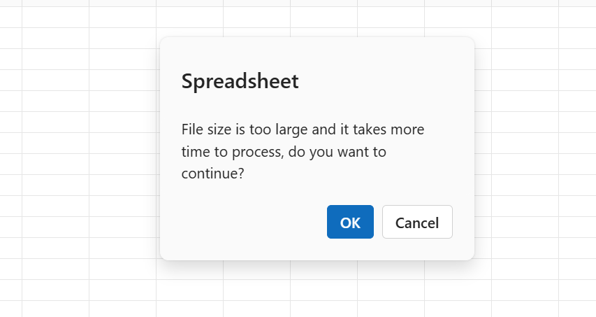

# Performance Best Practices in ##Platform_Name## Spreadsheet Control



Performance optimization is crucial when working with large datasets in the [Syncfusion® TypeScript Spreadsheet](https://www.syncfusion.com/javascript-ui-controls/js-spreadsheet). This documentation outlines best practices to enhance data handling efficiency and ensure a smooth, responsive user experience during various spreadsheet operations.



Performance optimization is crucial when working with large datasets in the [Syncfusion® JavaScript Spreadsheet](https://www.syncfusion.com/javascript-ui-controls/js-spreadsheet). This documentation outlines best practices to enhance data handling efficiency and ensure a smooth, responsive user experience during various spreadsheet operations.



## How to improve performance when opening Excel files in the Spreadsheet?

### Virtual scrolling


 
Virtual scrolling is an essential performance feature in the EJ2 Spreadsheet that enhances rendering efficiency when handling large datasets. Instead of loading all rows and columns into the DOM at once, it renders only the cells visible within the viewport. As the user scrolls, additional rows or columns are dynamically loaded and rendered.

This approach significantly reduces initial load time, DOM size, and memory usage — resulting in smoother rendering and interaction, especially when working with thousands of rows or columns.

For more details, refer to the [virtual scrolling documentation](https://ej2.syncfusion.com/documentation/spreadsheet/scrolling#virtual-scrolling).



Virtual scrolling is an essential performance feature in the EJ2 Spreadsheet that enhances rendering efficiency when handling large datasets. Instead of loading all rows and columns into the DOM at once, it renders only the cells visible within the viewport. As the user scrolls, additional rows or columns are dynamically loaded and rendered.

This approach significantly reduces initial load time, DOM size, and memory usage — resulting in smoother rendering and interaction, especially when working with thousands of rows or columns.

For more details, refer to the [virtual scrolling documentation](https://ej2.syncfusion.com/javascript/documentation/spreadsheet/scrolling#virtual-scrolling).



### Chunk response processing

When opening large Excel files with extensive data and features, server responses can become too large—leading to memory issues or connection failures during transmission. The Chunk Response Processing feature addresses this by breaking the response into smaller chunks and sending them in parallel to the client.

These chunks are combined on the client side to load the Excel data smoothly into the Spreadsheet. This approach avoids transmission failures due to memory constraints and ensures reliable and efficient loading of large files.



To enable the chunk response processing feature, you can refer to the following UG section:
* [Chunk Response Processing](https://ej2.syncfusion.com/documentation/spreadsheet/open-save#chunk-response-processing)



To enable the chunk response processing feature, you can refer to the following UG section:
* [Chunk Response Processing](https://ej2.syncfusion.com/javascript/documentation/spreadsheet/open-save#chunk-response-processing)



### Configure JSON serialization options during open



Serialization options in the EJ2 Spreadsheet allow you to exclude specific features—such as styles, formats, charts, images, wrap, etc.—from the `Workbook JSON object` when opening it in the Spreadsheet using the [`openFromJson`](https://helpej2.syncfusion.com/documentation/api/spreadsheet/#openfromjson) method. By skipping unnecessary features, you can significantly improve performance, especially when working with large or complex workbooks.

This is particularly useful when:
* You need only the raw data without formatting.
* You're opening the `Workbook JSON object` in the Spreadsheet using the [`openFromJson`](https://helpej2.syncfusion.com/documentation/api/spreadsheet/#openfromjson) method.
* You want to minimize the size of the JSON payload and optimize processing speed.

Refer to the following UG section to learn how to configure these options:

* [Configure JSON serialization options during open](https://ej2.syncfusion.com/documentation/spreadsheet/open-save#configure-json-deserialization-options)



Serialization options in the EJ2 Spreadsheet allow you to exclude specific features—such as styles, formats, charts, images, wrap, etc.—from the `Workbook JSON object` when opening it in the Spreadsheet using the [`openFromJson`](https://helpej2.syncfusion.com/javascript/documentation/api/spreadsheet/#openfromjson) method. By skipping unnecessary features, you can significantly improve performance, especially when working with large or complex workbooks.

This is particularly useful when:
* You need only the raw data without formatting.
* You're opening the `Workbook JSON object` in the Spreadsheet using the [`openFromJson`](https://helpej2.syncfusion.com/javascript/documentation/api/spreadsheet/#openfromjson) method.
* You want to minimize the size of the JSON payload and optimize processing speed.

Refer to the following UG section to learn how to configure these options:

* [Configure JSON serialization options during open](https://ej2.syncfusion.com/javascript/documentation/spreadsheet/open-save#configure-json-deserialization-options)



### Configuring threshold limits

To improve performance when importing large Excel files into the Spreadsheet component, you can configure thresholds for both the maximum number of cells `MaximumDataLimit` and the file size `MaximumFileSize`. These limits help prevent delays or potential server timeouts by restricting excessively large files from being imported.

When these thresholds are exceeded:
* The Spreadsheet displays an alert dialog indicating that the file is large.
  
* Clicking **Cancel** aborts the open process.
* Clicking **OK** proceeds with the open process.

You can configure the `MaximumDataLimit` and `MaximumFileSize` thresholds on the server side using the following code example:

**Code Snippet:**

```csharp
public IActionResult Open(IFormCollection openRequest)
{
    OpenRequest open = new OpenRequest();
    open.File = openRequest.Files[0];
    open.Guid = openRequest["Guid"];

    // Set maximum allowed number of cells
    open.ThresholdLimit.MaximumDataLimit = 1000000; // 1,000,000 cells

    // Set maximum allowed file size in bytes (e.g., 5MB)
    open.ThresholdLimit.MaximumFileSize = 5000000;

    var openbook = Content(Workbook.Open(open));
    return openbook;
}
```

### Optimize Excel open with parsing options

To improve performance when opening large Excel files, use parsing options like `IgnoreStyle` and `IgnoreFormat` to skip unnecessary styles and formats. This reduces memory usage, speeds up loading, and minimizes JSON size—especially helpful for files with many styled but empty cells.

To learn how to configure these parsing options, please refer to the UG section below.
* [Configure Parsing Options](./open-save#improving-excel-file-open-performance-with-parsing-options)

## How to improve performance on formula calculation in Spreadsheet?

### Manual calculation mode

Manual Calculation Mode in the EJ2 Spreadsheet is a performance optimization feature that allows you to delay formula recalculations until they are explicitly triggered. By default, the Spreadsheet automatically recalculates formulas whenever a dependent cell is edited or changed. While this behavior works well for small datasets, it can result in noticeable lag or UI freezing when working with large spreadsheets that contain many formulas or complex calculation chains.

To prevent such performance issues during bulk operations—such as importing data, applying formats, or setting multiple formulas — manual calculation mode gives developers control over when recalculations should occur.

Enabling manual mode is highly beneficial when:
* Importing large Excel or JSON files with formula-heavy sheets.
* Performing bulk updates (e.g., updating rows or columns via code).
* Applying formulas dynamically to a large number of cells.
* You want to postpone calculations until all content or changes are finalized.



To learn more about Manual Calculation Mode and how to enable it, you can refer to the following [UG link](https://ej2.syncfusion.com/documentation/spreadsheet/formulas#manual-mode).



To learn more about Manual Calculation Mode and how to enable it, you can refer to the following [UG link](https://ej2.syncfusion.com/javascript/documentation/spreadsheet/formulas#manual-mode).



## How to improve save performance in the Spreadsheet?

### Handling large file saves with `isFullPost` option



When saving large Excel files with extensive data and features using **File → Save As** or the **save** method, the Spreadsheet triggers a server API call through a form submit operation. This can lead to performance issues such as timeouts or delays, particularly due to the size and complexity of the workbook.

To mitigate these issues during the save operation, you can set the [`isFullPost`](https://helpej2.syncfusion.com/documentation/api/spreadsheet/beforeSaveEventArgs/#isfullpost) property to **false** in the [`beforeSave`](https://helpej2.syncfusion.com/documentation/api/spreadsheet/#beforesave) event of the Spreadsheet.

The following code example shows how to set `isFullPost` to **false** in the Spreadsheet component:

```ts
let spreadsheet: Spreadsheet = new Spreadsheet({
    beforeSave: (args: BeforeSaveEventArgs) => {
        args.isFullPost = false;
    }
});
```



When saving large Excel files with extensive data and features using **File → Save As** or the **save** method, the Spreadsheet triggers a server API call through a form submit operation. This can lead to performance issues such as timeouts or delays, particularly due to the size and complexity of the workbook.

To mitigate these issues during the save operation, you can set the [`isFullPost`](https://helpej2.syncfusion.com/javascript/documentation/api/spreadsheet/beforeSaveEventArgs/#isfullpost) property to **false** in the [`beforeSave`](https://helpej2.syncfusion.com/javascript/documentation/api/spreadsheet/#beforesave) event of the Spreadsheet.

The following code example shows how to set `isFullPost` to **false** in the Spreadsheet component:

```js
var spreadsheet = new ej.spreadsheet.Spreadsheet({
  beforeSave: (args) => {
      args.isFullPost = false;
  }
});
```



### Configure JSON serialization options during save



Serialization options in the EJ2 Spreadsheet allow you to exclude specific features such as styles, formats, charts, images, wrap, etc. from the `Workbook JSON object` when saving it using the [`saveAsJson`](https://helpej2.syncfusion.com/documentation/api/spreadsheet/#saveasjson) method in the Spreadsheet. By skipping unnecessary features, you can significantly improve performance, especially when working with large or complex workbooks.

This is particularly useful when:
* You need only the raw data without formatting.
* You're saving the `Workbook JSON object` using the [`saveAsJson`](https://helpej2.syncfusion.com/documentation/api/spreadsheet/#saveasjson) method in the Spreadsheet.
* You want to minimize the size of the JSON payload and optimize processing speed.

Proper use of serialization options during save improves performance and reduces the time taken during the save process.

Refer to the following UG section to learn how to configure these options:

* [Configure JSON serialization options during save](https://ej2.syncfusion.com/documentation/spreadsheet/open-save#configure-json-serialization-options)




Serialization options in the EJ2 Spreadsheet allow you to exclude specific features such as styles, formats, charts, images, wrap, etc. from the `Workbook JSON object` when saving it using the [`saveAsJson`](https://helpej2.syncfusion.com/javascript/documentation/api/spreadsheet/#saveasjson) method in the Spreadsheet. By skipping unnecessary features, you can significantly improve performance, especially when working with large or complex workbooks.

This is particularly useful when:
* You need only the raw data without formatting.
* You're saving the `Workbook JSON object` using the [`saveAsJson`](https://helpej2.syncfusion.com/javascript/documentation/api/spreadsheet/#saveasjson) method in the Spreadsheet.
* You want to minimize the size of the JSON payload and optimize processing speed.

Proper use of serialization options during save improves performance and reduces the time taken during the save process.

Refer to the following UG section to learn how to configure these options:

* [Configure JSON serialization options during save](https://ej2.syncfusion.com/javascript/documentation/spreadsheet/open-save#configure-json-serialization-options)



## How to improve cell selection performance in Spreadsheet?

### Disabling aggregate calculation



When working with large datasets in the EJ2 Spreadsheet, user interactions such as selecting a large range of cells can experience delays. This occurs because, by default, the Spreadsheet performs aggregate calculations (e.g., SUM, AVERAGE, COUNT, MIN, and MAX) on the selected range and displays the results in the sheet tab panel at the bottom-right corner.

To enhance the responsiveness of cell selection, particularly in performance-critical scenarios, consider disabling unnecessary aggregate calculations using the [`showAggregate`](https://ej2.syncfusion.com/documentation/api/spreadsheet/#showaggregate) property.

Benefits:
* Reduces selection lag when dealing with large data ranges.
* Prevents real-time computation of formulas like SUM, AVERAGE, MIN, and MAX for large selections.
* Keeps the UI responsive during large selection operations.

You can disable aggregate calculation using the following code example:

```ts
let spreadsheet = new Spreadsheet({
  showAggregate: false
});
spreadsheet.appendTo('#spreadsheet');
```



When working with large datasets in the EJ2 Spreadsheet, user interactions such as selecting a large range of cells can experience delays. This occurs because, by default, the Spreadsheet performs aggregate calculations (e.g., SUM, AVERAGE, COUNT, MIN, and MAX) on the selected range and displays the results in the sheet tab panel at the bottom-right corner.

To enhance the responsiveness of cell selection, particularly in performance-critical scenarios, consider disabling unnecessary aggregate calculations using the [`showAggregate`](https://ej2.syncfusion.com/javascript/documentation/api/spreadsheet/#showaggregate) property.

Benefits:
* Reduces selection lag when dealing with large data ranges.
* Prevents real-time computation of formulas like SUM, AVERAGE, MIN, and MAX for large selections.
* Keeps the UI responsive during large selection operations.

You can disable aggregate calculation using the following code example:

```js
var spreadsheet = new ej.spreadsheet.Spreadsheet({
  showAggregate: false
});
spreadsheet.appendTo('#spreadsheet');
```



## See Also



* [Open and Save](https://ej2.syncfusion.com/documentation/spreadsheet/open-save)
* [Docker Deployment](https://ej2.syncfusion.com/documentation/spreadsheet/docker-deployment)
* [Scrolling](https://ej2.syncfusion.com/documentation/spreadsheet/scrolling)
 


* [Open and Save](https://ej2.syncfusion.com/javascript/documentation/spreadsheet/open-save)
* [Docker Deployment](https://ej2.syncfusion.com/javascript/documentation/spreadsheet/docker-deployment)
* [Scrolling](https://ej2.syncfusion.com/javascript/documentation/spreadsheet/scrolling)

