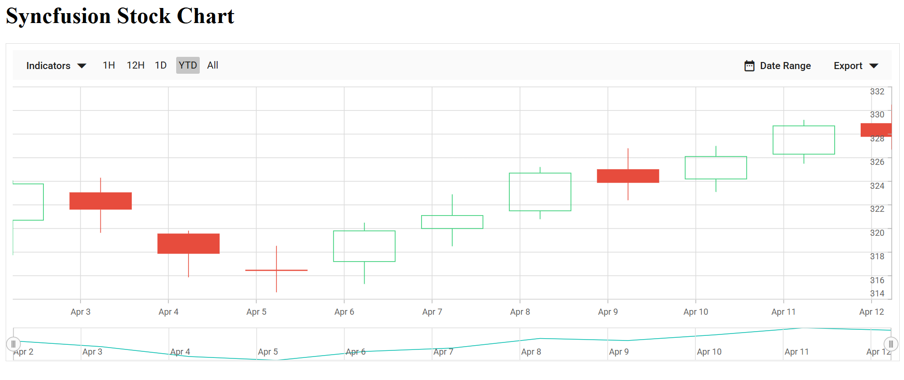

# Getting Started with Syncfusion® JavaScript (ES5) Stock Chart Control

Build your first Syncfusion JavaScript (ES5) application with a simple Stock Chart control in just a few minutes. This quickstart guides you through creating a minimal, runnable HTML page that loads the Syncfusion EJ2 (ES5) Stock Chart from the CDN, initializes it with sample data, and renders an interactive chart.

> **Ready to streamline your Syncfusion<sup style="font-size:70%">&reg;</sup> JavaScript development?** Discover the full potential of Syncfusion<sup style="font-size:70%">&reg;</sup> JavaScript controls with Syncfusion<sup style="font-size:70%">&reg;</sup> AI Coding Assistant. Effortlessly integrate, configure, and enhance your projects with intelligent, context-aware code suggestions, streamlined setups, and real-time insights—all seamlessly integrated into your preferred AI-powered IDEs like VS Code, Cursor, Syncfusion<sup style="font-size:70%">&reg;</sup> CodeStudio and more. [Explore Syncfusion<sup style="font-size:70%">&reg;</sup> AI Coding Assistant](https://ej2.syncfusion.com/javascript/documentation/ai-coding-assistant/overview)

## Prerequisites

* [Visual Studio Code](https://code.visualstudio.com) (or any text editor)
* A web browser to view the result

## Quick Setup

### Step 1: Create Folder and HTML file

* Create a folder named `quickstart` in your desired directory
* Inside the `quickstart` folder, create a new file named `index.html`

### Step 2: Add Syncfusion<sup style="font-size:70%">&reg;</sup> CDN Resources

Syncfusion<sup style="font-size:70%">&reg;</sup> JavaScript (Essential<sup style="font-size:70%">&reg;</sup> JS 2) packages are available on [npmjs.com](https://www.npmjs.com/~syncfusionorg). You can include all Syncfusion<sup style="font-size:70%">&reg;</sup> controls in a single bundled CDN package or use individual package CDN links.

**Option 1: Using Common CDN Bundle (Recommended)**

Include a single CDN link that contains all Syncfusion JavaScript controls:

```
https://cdn.syncfusion.com/ej2/33.2.3/dist/ej2.min.js
```

**Option 2: Using Individual CDN Packages**

Include the following CSS and JavaScript links in the `<head>` section:

**Styles (CSS):**
```
https://cdn.syncfusion.com/ej2/33.2.3/tailwind3.css
https://maxcdn.bootstrapcdn.com/bootstrap/3.3.7/css/bootstrap.min.css
```

**Scripts (JavaScript):**
```
https://cdn.syncfusion.com/ej2/33.2.3/ej2-base/dist/global/ej2-base.min.js
https://cdn.syncfusion.com/ej2/33.2.3/ej2-data/dist/global/ej2-data.min.js
https://cdn.syncfusion.com/ej2/33.2.3/ej2-pdf-export/dist/global/ej2-pdf-export.min.js
https://cdn.syncfusion.com/ej2/33.2.3/ej2-file-utils/dist/global/ej2-file-utils.min.js
https://cdn.syncfusion.com/ej2/33.2.3/ej2-compression/dist/global/ej2-compression.min.js
https://cdn.syncfusion.com/ej2/33.2.3/ej2-svg-base/dist/global/ej2-svg-base.min.js
https://cdn.syncfusion.com/ej2/33.2.3/ej2-navigations/dist/global/ej2-navigations.min.js
https://cdn.syncfusion.com/ej2/33.2.3/ej2-calendars/dist/global/ej2-calendars.min.js
https://cdn.syncfusion.com/ej2/33.2.3/ej2-popups/dist/global/ej2-popups.min.js
https://cdn.syncfusion.com/ej2/33.2.3/ej2-lists/dist/global/ej2-lists.min.js
https://cdn.syncfusion.com/ej2/33.2.3/ej2-inputs/dist/global/ej2-inputs.min.js
https://cdn.syncfusion.com/ej2/33.2.3/ej2-buttons/dist/global/ej2-buttons.min.js
https://cdn.syncfusion.com/ej2/33.2.3/ej2-splitbuttons/dist/global/ej2-splitbuttons.min.js
https://cdn.syncfusion.com/ej2/33.2.3/ej2-charts/dist/global/ej2-charts.min.js
```

### Step 3: Add Syncfusion<sup style="font-size:70%">&reg;</sup> Stock Chart control to the application

Copy and paste the following complete code into your `index.html` file:

```html
<!DOCTYPE html>
<html>

<head>
    <title>Syncfusion Stock Chart - Quick Start</title>

    <!-- Styles -->
    <link href="https://cdn.syncfusion.com/ej2/33.2.3/tailwind3.css" rel="stylesheet">
    <link href="https://maxcdn.bootstrapcdn.com/bootstrap/3.3.7/css/bootstrap.min.css" rel="stylesheet">

    <!-- Scripts -->
    <script src="https://cdn.syncfusion.com/ej2/33.2.3/dist/ej2.min.js" type="text/javascript"></script>
</head>

<body>
    <h1>Syncfusion Stock Chart</h1>
    <div id="element"></div>

    <script>
        // Sample data
        var chartData = [
            { x: new Date('2012-04-02'), open: 320.71, high: 324.07, low: 317.74, close: 323.78, volume: 45638000 },
            { x: new Date('2012-04-03'), open: 323.03, high: 324.30, low: 319.64, close: 321.63, volume: 40857000 },
            { x: new Date('2012-04-04'), open: 319.54, high: 319.82, low: 315.87, close: 317.89, volume: 32519000 },
            { x: new Date('2012-04-05'), open: 316.44, high: 318.53, low: 314.60, close: 316.48, volume: 46327000 },
            { x: new Date('2012-04-06'), open: 317.20, high: 320.50, low: 315.30, close: 319.80, volume: 38200000 },
            { x: new Date('2012-04-07'), open: 320.00, high: 322.90, low: 318.50, close: 321.10, volume: 35500000 },
            { x: new Date('2012-04-08'), open: 321.50, high: 325.20, low: 320.80, close: 324.70, volume: 41200000 },
            { x: new Date('2012-04-09'), open: 325.00, high: 326.80, low: 322.40, close: 323.90, volume: 39800000 },
            { x: new Date('2012-04-10'), open: 324.20, high: 327.00, low: 323.10, close: 326.10, volume: 42100000 },
            { x: new Date('2012-04-11'), open: 326.30, high: 329.20, low: 325.50, close: 328.70, volume: 44500000 },
            { x: new Date('2012-04-12'), open: 328.90, high: 330.50, low: 326.70, close: 327.80, volume: 36700000 }
        ];

        // Create Stock Chart
        var chart = new ej.charts.StockChart({
            series: [{
                dataSource: chartData,
                type: 'Candle',
                high: 'high', low: 'low', open: 'open', close: 'close', xName: 'x',
            }]
        });
        // Render Chart
        chart.appendTo('#element');
    </script>
</body>

</html>
```

### Step 4: Open in Browser

Open the `quickstart/index.html` file in your web browser. You should see the Syncfusion Stock Chart control displaying the sample data.

## Output

The following screenshot shows the output of the Syncfusion Stock Chart quick start application:


