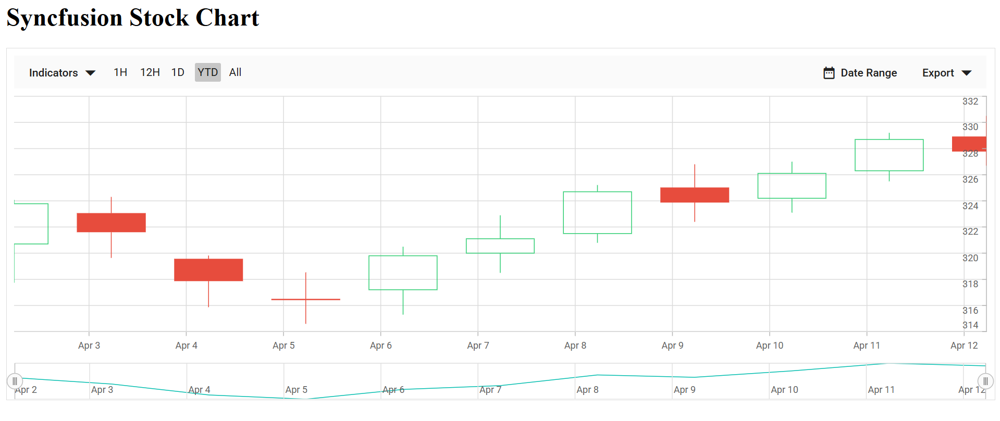

# Getting started with ##Platform_Name## Stock Chart control

This document explains how to create a simple Stock Chart and configure its features in TypeScript using the Essential JS 2 webpack [quickstart](https://github.com/SyncfusionExamples/ej2-quickstart-webpack) seed repository.

> This application is integrated with the `webpack.config.js` configuration and uses the latest version of the [webpack-cli](https://webpack.js.org/api/cli/#commands). Ensure that Node.js is installed on your machine. For more information about webpack and its features, refer to the [webpack getting-started guide](https://webpack.js.org/guides/getting-started/).

## Prerequisites

Before you begin, ensure you have the following installed on your machine:

* [Node.js](https://nodejs.org/)
* [Visual Studio Code](https://code.visualstudio.com) (or any text editor)
* [Git](https://git-scm.com/) for cloning the quickstart repository
* A modern web browser (Chrome, Edge, Firefox, or Safari) to view the result

## Dependencies

The Stock Chart control is included in the `@syncfusion/ej2-charts` package. Below is the list of core and optional dependencies used by the package.

```
|-- @syncfusion/ej2-charts
    |-- @syncfusion/ej2-base
    |-- @syncfusion/ej2-data
    |-- @syncfusion/ej2-pdf-export
    |-- @syncfusion/ej2-file-utils
    |-- @syncfusion/ej2-compression
    |-- @syncfusion/ej2-svg-base
    |-- @syncfusion/ej2-navigations
    |-- @syncfusion/ej2-calendars
    |-- @syncfusion/ej2-popups
    |-- @syncfusion/ej2-lists
    |-- @syncfusion/ej2-inputs
    |-- @syncfusion/ej2-buttons
    |-- @syncfusion/ej2-splitbuttons
```
Note: Some dependencies like @syncfusion/ej2-navigations, @syncfusion/ej2-calendars, and others are used for advanced Stock Chart features like date-time navigation and tooltips.

## Quick Setup

### Step 1: Open Command Prompt

Open the command prompt and navigate to the directory where you want to create the project.

* **For Windows**: Open Command Prompt (cmd) or PowerShell and use the `cd` command to navigate to your desired directory.
* **For macOS/Linux**: Open Terminal and use the `cd` command to navigate to your desired directory.

### Step 2: Clone the Quickstart Repository

Run the following command to clone the Syncfusion JavaScript (Essential JS 2) quickstart project from [GitHub](https://github.com/SyncfusionExamples/ej2-quickstart-webpack).




git clone https://github.com/SyncfusionExamples/ej2-quickstart-webpack ej2-quickstart




### Step 3: Navigate to Project Folder

After cloning the application in the `ej2-quickstart` folder, run the following command to navigate to the project directory.




cd ej2-quickstart




### Step 4: Install Required Packages

Syncfusion JavaScript (Essential JS 2) packages are available on the [npmjs.com](https://www.npmjs.com/~syncfusionorg) public registry. You can install all Syncfusion JavaScript (Essential JS 2) controls in a single [@syncfusion/ej2](https://www.npmjs.com/package/@syncfusion/ej2) package or individual packages for each control.

The quickstart application is already preconfigured with the dependent [@syncfusion/ej2](https://www.npmjs.com/package/@syncfusion/ej2) package in the `~/package.json` file. Use the following command to install all the dependent npm packages from the command prompt:




npm install




This command will download and install all necessary dependencies for your project.

### Step 5: Import Syncfusion® CSS Styles

Syncfusion® JavaScript Stock Chart controls provide built-in themes, which are available from the [npm theme packages](https://ej2.syncfusion.com/documentation/appearance/theme#theme-packages). Additionally, themes can be loaded via CDN or customized using the [Theme Studio](https://ej2.syncfusion.com/documentation/appearance/theme-studio). For more information, refer to the [themes documentation](https://ej2.syncfusion.com/documentation/appearance/theme).

The quickstart application is preconfigured to use the `Fluent2` theme. To install the [Fluent2](https://www.npmjs.com/package/@syncfusion/ej2-fluent2-theme) theme package, use the following command. Install a theme package version that is compatible with the Syncfusion packages used in your project.



 
npm install @syncfusion/ej2-fluent2-theme --save
 


 
Then add the following CSS reference to the **src/styles/styles.css** file:
 


 
@import "../../node_modules/@syncfusion/ej2-fluent2-theme/styles/stock-chart/index.css";
 



### Step 6: Update the HTML Template

Open the `ej2-quickstart` folder in Visual Studio Code or any text editor of your choice.

Locate the `~/src/index.html` file in the project. Preserve any existing `<link>` and `<script>` tags that were generated by the seed, and add the HTML div tag with its `id` attribute as `element` inside `<body>` to initialize the Stock Chart container.




<!DOCTYPE html>
<html lang="en">

<head>
    <title>Essential JS 2 Stock Chart</title>
    <meta charset="utf-8" />
    <meta name="viewport" content="width=device-width, initial-scale=1.0" />
    <meta name="description" content="TypeScript UI Controls" />
    <meta name="author" content="Syncfusion" />
    <!-- existing head content from the seed template remains here -->
</head>

<body>
     <h1>Syncfusion Stock Chart</h1>
     <!--container which is going to render the Stock Chart-->
     <div id='element'>
     </div>
</body>

</html>




### Step 7: Create the Stock Chart Component with Data

Locate the `src/app/app.ts` file in your project and add the Stock Chart component with module injection and sample data.

**Module Injection**: The Stock Chart component requires specific feature modules to be injected. For displaying stock data with a candle series and DateTime axis, we need to inject the `CandleSeries` and `DateTime` modules.

**Populate Stock Chart with Data**: Create sample JSON data with OHLC (Open, High, Low, Close) values and configure the chart series to display candlestick visualization of stock prices over time.






        
#### Series Property Reference

| Property | Description |
| --- | --- |
| [`dataSource`](https://ej2.syncfusion.com/documentation/api/stock-chart/index-default#datasource) | The data array used to render the chart |
| [`type`](https://ej2.syncfusion.com/documentation/api/stock-chart/stockseriesmodel#type) | The series type. For Stock Chart, use `'Candle'`, `'OHLC'`, `'Line'`, `'Area'`, or `'Column'` |
| [`xName`](https://ej2.syncfusion.com/documentation/api/stock-chart/stockseriesmodel#xname) | The field in the data source that maps to the x-axis (typically a date) |
| [`open`](https://ej2.syncfusion.com/documentation/api/stock-chart/stockseriesmodel#open) | The field in the data source that maps to the open price |
| [`high`](https://ej2.syncfusion.com/documentation/api/stock-chart/stockseriesmodel#high) | The field in the data source that maps to the high price |
| [`low`](https://ej2.syncfusion.com/documentation/api/stock-chart/stockseriesmodel#low) | The field in the data source that maps to the low price |
| [`close`](https://ej2.syncfusion.com/documentation/api/stock-chart/stockseriesmodel#close) | The field in the data source that maps to the close price |

> **Tip:** To add a volume pane below the price chart, append a second series to the `series` array with `type: 'Column'` and bind its data source to a `volume` field.

### Step 8: Run the Application

Open the integrated terminal in Visual Studio Code or use your command prompt to run the application. Use the `npm run start` command:




npm run start




The application will compile and automatically start in your default web browser. The application typically runs at `http://localhost:4000`. You should see the Syncfusion<sup style="font-size:70%">&reg;</sup> Stock Chart control displayed on the page. To stop the dev server, press `Ctrl+C` in the terminal. For a production build, use `npm run build`.

## Output

The following screenshot shows the output of the Syncfusion Stock Chart quick start application — a candle series rendering the sample OHLC data with date values on the x-axis and price values on the y-axis.





## Troubleshooting

* **Blank page, no Stock Chart** — Verify that `npm install` completed successfully, the `element` container exists in `index.html`, and `npm run start` finished without errors.
* **`Cannot find module '@syncfusion/ej2-charts'`** — Dependencies were not installed. Re-run `npm install`.
* **`ej.charts is undefined`** — `ej2-charts` is not imported into the bundle. Check that the import in `app.ts` matches the example and that the seed's webpack config picks up `src/app/app.ts`.
* **Chart renders without data** — Mismatched field names between `dataSource` and series props. Ensure `xName`, `open`, `high`, `low`, and `close` match the data keys exactly.
* **TypeScript compile errors after `npm install`** — Run `npm run build` to see the full error; common causes are mismatched `ej2-charts` and theme package versions.
